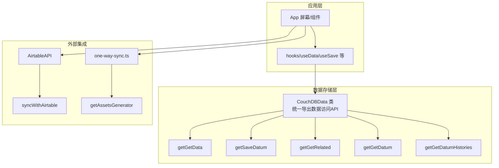
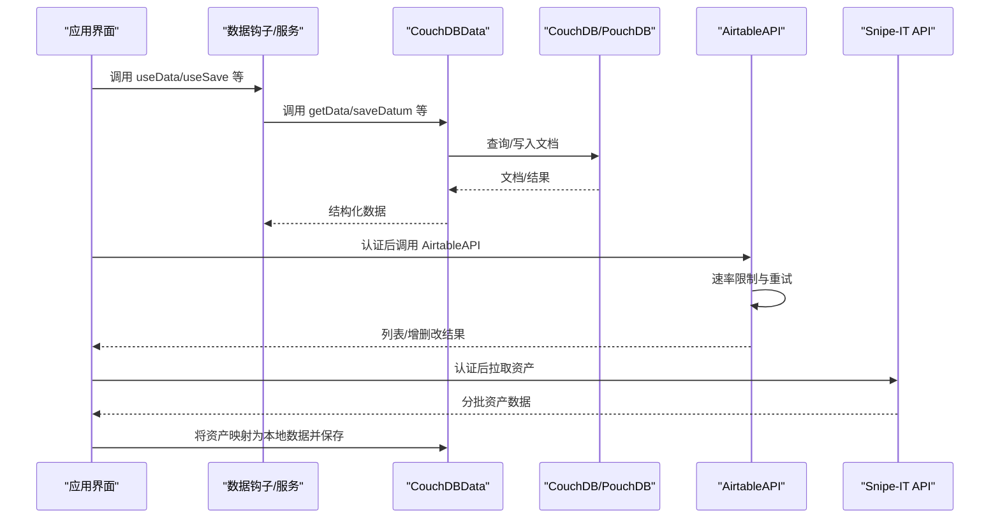
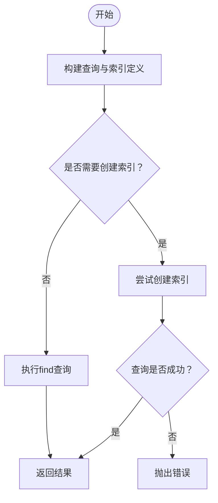
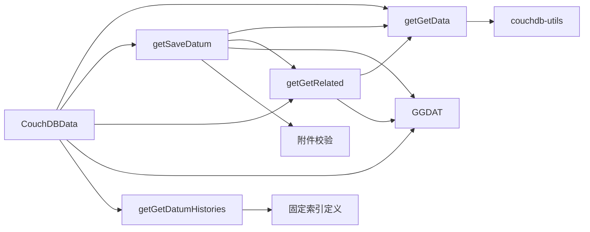

# API接口文档

<cite>
**本文引用的文件**
- [getGetData.ts](file://packages/data-storage-couchdb/lib/functions/getGetData.ts)
- [getSaveDatum.ts](file://packages/data-storage-couchdb/lib/functions/getSaveDatum.ts)
- [getGetDatum.ts](file://packages/data-storage-couchdb/lib/functions/getGetDatum.ts)
- [getGetRelated.ts](file://packages/data-storage-couchdb/lib/functions/getGetRelated.ts)
- [getGetDatumHistories.ts](file://packages/data-storage-couchdb/lib/functions/getGetDatumHistories.ts)
- [CouchDBData.ts](file://packages/data-storage-couchdb/lib/CouchDBData.ts)
- [types.ts](file://packages/data-storage-couchdb/lib/functions/types.ts)
- [AirtableAPI.ts](file://packages/integration-airtable/lib/AirtableAPI.ts)
- [syncWithAirtable.ts](file://packages/integration-airtable/lib/syncWithAirtable.ts)
- [schema.ts](file://packages/integration-airtable/lib/schema.ts)
- [one-way-sync.ts](file://packages/integration-snipe-it/one-way-sync.ts)
- [getAssetsGenerator.ts](file://packages/integration-snipe-it/lib/snipe-it-client/functions/getAssetsGenerator.ts)
- [types.ts（Snipe-IT客户端）](file://packages/integration-snipe-it/lib/snipe-it-client/types.ts)
- [views.ts](file://packages/data-storage-couchdb/lib/views.ts)
</cite>

## 目录
1. [简介](#简介)
2. [项目结构](#项目结构)
3. [核心组件](#核心组件)
4. [架构总览](#架构总览)
5. [详细组件分析](#详细组件分析)
6. [依赖关系分析](#依赖关系分析)
7. [性能考量](#性能考量)
8. [故障排查指南](#故障排查指南)
9. [结论](#结论)
10. [附录](#附录)

## 简介
本文件面向应用的公共API，覆盖以下方面：
- 内部数据访问API：来自 data-storage-couchdb 包的函数族，如 getGetData、getSaveDatum、getGetRelated 等，说明其参数、返回值、用途及典型用法。
- 外部集成API：Airtable 与 Snipe-IT 的REST接口交互，包括认证方式、端点URL、请求/响应格式与错误处理策略。
- 同步协议：应用与 CouchDB 服务器之间的查询与索引创建机制，以及与外部系统的单向/双向同步流程。
- 使用示例与最佳实践：如何在业务层调用这些API，以及常见问题的处理建议。

## 项目结构
该仓库采用多包结构，核心API分布在以下模块：
- data-storage-couchdb：封装对 CouchDB/PouchDB 的数据读写、关系查询、历史记录、视图统计等能力。
- integration-airtable：Airtable 客户端与双向同步逻辑。
- integration-snipe-it：Snipe-IT 单向同步脚本与客户端工具。
- App：前端应用，通过 hooks/useData/useSave 等使用上述数据访问API。

图表来源
- [CouchDBData.ts](file://packages/data-storage-couchdb/lib/CouchDBData.ts#L42-L96)
- [AirtableAPI.ts](file://packages/integration-airtable/lib/AirtableAPI.ts#L108-L451)
- [syncWithAirtable.ts](file://packages/integration-airtable/lib/syncWithAirtable.ts#L100-L800)
- [one-way-sync.ts](file://packages/integration-snipe-it/one-way-sync.ts#L110-L142)
- [getAssetsGenerator.ts](file://packages/integration-snipe-it/lib/snipe-it-client/functions/getAssetsGenerator.ts#L1-L50)

章节来源
- [CouchDBData.ts](file://packages/data-storage-couchdb/lib/CouchDBData.ts#L42-L96)

## 核心组件
本节聚焦 data-storage-couchdb 包提供的公共API，它们以函数工厂形式暴露，接收上下文对象，返回可直接使用的API函数。

- getConfig/updateConfig：读取/更新数据库配置。
- getDatum/getData/getDataCount：按类型与条件查询文档，支持分页、排序与数组ID查询。
- getRelated：根据数据类型关系查询关联数据（belongs_to/has_many）。
- saveDatum：保存/删除数据，包含附件校验、历史记录写入、回调跳过等策略。
- getDatumHistories/listHistoryBatchesCreatedBy/getHistoriesInBatch/restoreHistory：历史记录查询与恢复。
- attachAttachmentToDatum/getAttachmentFromDatum/getAttachmentInfoFromDatum/getAllAttachmentInfoFromDatum：附件相关操作。
- getViewData：基于预置视图的聚合查询。

章节来源
- [CouchDBData.ts](file://packages/data-storage-couchdb/lib/CouchDBData.ts#L42-L96)
- [types.ts](file://packages/data-storage-couchdb/lib/functions/types.ts#L12-L39)

## 架构总览
下图展示应用与CouchDB、Airtable、Snipe-IT之间的交互路径与职责边界。

图表来源
- [AirtableAPI.ts](file://packages/integration-airtable/lib/AirtableAPI.ts#L183-L451)
- [one-way-sync.ts](file://packages/integration-snipe-it/one-way-sync.ts#L110-L142)
- [getAssetsGenerator.ts](file://packages/integration-snipe-it/lib/snipe-it-client/functions/getAssetsGenerator.ts#L1-L50)

## 详细组件分析

### 数据访问API（CouchDB）

#### getGetData
- 作用：按类型与条件查询数据，支持数组ID查询、排序、分页；自动推断并创建索引以优化查询。
- 关键参数
  - type: 数据类型名称
  - conditions: 条件对象或ID数组
  - options: { skip, limit, sort, debug }
- 返回值：匹配的数据列表，若传入ID数组且未排序，将保持输入顺序；debug模式附加查询解释信息。
- 特性
  - 自动索引：首次查询或显式开启时创建设计文档与索引。
  - 排序：支持多字段排序，遵循CouchDB/PouchDB限制。
  - 错误处理：查询失败时自动重试并尝试创建索引。
- 典型用法
  - 按类型全量查询（带分页）
  - 按ID数组批量查询（保持顺序）
  - 带排序的条件查询
- 最佳实践
  - 对高频查询建立稳定索引字段集合
  - 使用 debug 模式定位慢查询
  - 避免在ID数组查询中使用排序

章节来源
- [getGetData.ts](file://packages/data-storage-couchdb/lib/functions/getGetData.ts#L20-L332)

#### getGetDatum
- 作用：按类型+ID获取单条数据，不存在时返回null。
- 参数
  - type: 数据类型
  - id: 数据ID
- 返回值：数据对象或null。
- 错误处理：捕获“not_found”、“missing”等错误并转换为null。

章节来源
- [getGetDatum.ts](file://packages/data-storage-couchdb/lib/functions/getGetDatum.ts#L1-L42)

#### getGetRelated
- 作用：根据数据类型关系查询关联数据。
- 支持关系
  - belongs_to：返回外键指向的单条数据，不存在则返回null。
  - has_many：按外键过滤返回多条数据，支持sort。
- 参数
  - d: 当前数据
  - relationName: 关系名
  - options: { sort }
- 返回值：关联数据或null。

章节来源
- [getGetRelated.ts](file://packages/data-storage-couchdb/lib/functions/getGetRelated.ts#L1-L56)

#### getSaveDatum
- 作用：保存/删除数据，包含附件校验、历史记录写入、回调跳过等策略。
- 关键行为
  - 附件校验：检查必填附件、内容类型。
  - 写入：根据dbType选择put/insert，并返回新修订号。
  - 历史：写入历史记录，使用batch标识批次。
  - 删除：支持软删除（PouchDB）或物理删除（CouchDB）。
  - 跳过保存：当变更检测为空时跳过保存并输出调试日志。
- 参数
  - d: 待保存数据
  - origD: 原始数据（用于差异计算）
- 返回值：保存后的数据（含__rev）。

章节来源
- [getSaveDatum.ts](file://packages/data-storage-couchdb/lib/functions/getSaveDatum.ts#L1-L141)

#### getGetDatumHistories
- 作用：按数据类型+ID查询历史记录，支持分页与时间窗口过滤。
- 参数
  - type: 数据类型
  - id: 数据ID
  - options: { limit, after }
- 返回值：历史记录数组（按时间倒序），并进行Zod解析过滤。

章节来源
- [getGetDatumHistories.ts](file://packages/data-storage-couchdb/lib/functions/getGetDatumHistories.ts#L1-L104)

#### CouchDBData 类
- 作用：统一导出所有数据访问API，便于上层注入与使用。
- 导出API
  - getConfig/updateConfig
  - getDatum/getData/getDataCount/getRelated/saveDatum
  - attach/getAttachment/getAttachmentInfo/getAllAttachmentInfo
  - getViewData
  - getDatumHistories/listHistoryBatchesCreatedBy/getHistoriesInBatch/restoreHistory
  - itemToCsvRow/csvRowToItem

章节来源
- [CouchDBData.ts](file://packages/data-storage-couchdb/lib/CouchDBData.ts#L42-L96)

#### 上下文与类型
- Context：dbType、db实例、日志器、索引策略等。
- Logger：debug/info/log/warn/error。
- CouchDBDoc：标准文档结构（_id/_rev/type/data/时间戳等）。

章节来源
- [types.ts](file://packages/data-storage-couchdb/lib/functions/types.ts#L1-L39)

#### 视图（Views）
- 提供常用聚合视图（如库存统计、过期/低库存、RFID未打标/标签不一致等），并定义map/reduce与数据解析器。
- 应用可通过getViewData调用这些视图。

章节来源
- [views.ts](file://packages/data-storage-couchdb/lib/views.ts#L1-L573)

### 外部集成API

#### AirtableAPI
- 认证：Bearer Token（Authorization: Bearer <token>）。
- 速率限制：内置节流与重试，避免429/5xx。
- 主要端点
  - 列表基表：GET /v0/meta/bases
  - 获取基表结构：GET /v0/meta/bases/{baseId}/tables
  - 创建基表：POST /v0/meta/bases
  - 字段管理：POST /v0/meta/bases/{baseId}/tables/{tableId}/fields（创建）、PATCH 更新
  - 记录管理：POST /v0/{base}/{table}（创建）、PATCH 更新、DELETE 删除
  - 列表记录：POST /v0/{base}/{table}/listRecords（支持分页、排序、筛选）
  - 获取单条记录：GET /v0/{base}/{table}/{recordId}
- 请求/响应
  - 列表记录：请求体包含pageSize/offset/sort/fields/filterByFormula；响应包含records与offset。
  - 字段定义：AirtableField结构包含类型、选项、主键等。
- 错误处理
  - 统一抛出AirtableAPIError，包含type/message/details。
  - 对429/5xx进行重试与退避。

章节来源
- [AirtableAPI.ts](file://packages/integration-airtable/lib/AirtableAPI.ts#L108-L451)

#### syncWithAirtable（双向同步）
- 流程概览
  - 初始化：读取集成配置、准备AirtableAPI、检查表结构与字段。
  - 全量同步：列出Airtable现有记录ID，作为去重与跳过的依据。
  - 推送：将本地未同步或已更新的数据转换为Airtable记录并创建/更新。
  - 拉取：从Airtable拉取记录，转换为本地数据并保存；处理删除、错误消息回写。
  - 重试：对拉取阶段出现错误的记录进行二次同步。
- 进度与状态
  - 通过生成器返回进度对象，包含apiCalls、toPush/toPull/pushed/pulled等。
- 配置校验
  - schema校验集成配置，要求存在airtable_base_id、scope_type等字段。

章节来源
- [syncWithAirtable.ts](file://packages/integration-airtable/lib/syncWithAirtable.ts#L1-L800)
- [schema.ts](file://packages/integration-airtable/lib/schema.ts#L1-L17)

#### Snipe-IT 单向同步
- 认证：Basic（用户名:密码）或API Key（Authorization: Bearer <key>）。
- 端点
  - 资产列表：GET /api/v1/hardware?sort=updated_at&order=desc&limit={BATCH_SIZE}&offset={offset}
  - 可选公司过滤：&company_id={id}
- 数据流
  - 通过getAssetsGenerator异步迭代资产，按批次处理。
  - 将资产映射为本地collection/item，保存到CouchDB。
- CLI参数
  - --sync_id、--api_base_url、--api_key、--time_zone、--company_id、--db_uri、--db_username、--db_password。

章节来源
- [one-way-sync.ts](file://packages/integration-snipe-it/one-way-sync.ts#L44-L142)
- [getAssetsGenerator.ts](file://packages/integration-snipe-it/lib/snipe-it-client/functions/getAssetsGenerator.ts#L1-L50)
- [types.ts（Snipe-IT客户端）](file://packages/integration-snipe-it/lib/snipe-it-client/types.ts#L1-L68)

### 同步协议与数据一致性

#### CouchDB 查询与索引策略
- 自动索引：首次查询或debug模式下，根据selector与sort字段组合生成索引定义并创建设计文档。
- 查询解释：debug模式下执行explain，输出查询计划与索引使用情况，便于性能诊断。
- 重试机制：当索引缺失导致查询失败时，自动尝试创建索引并重试，最多有限次数。

图表来源
- [getGetData.ts](file://packages/data-storage-couchdb/lib/functions/getGetData.ts#L225-L332)

#### 历史记录与回滚
- 历史记录写入：每次保存数据时写入一条历史记录，包含created_by/event_name/batch/data_type/data_id/timestamp等。
- 历史查询：按类型+ID+时间窗口过滤，支持分页与倒序。
- 历史回滚：提供restoreHistory能力，按批次恢复历史快照。

章节来源
- [getSaveDatum.ts](file://packages/data-storage-couchdb/lib/functions/getSaveDatum.ts#L98-L116)
- [getGetDatumHistories.ts](file://packages/data-storage-couchdb/lib/functions/getGetDatumHistories.ts#L1-L104)

## 依赖关系分析

图表来源
- [CouchDBData.ts](file://packages/data-storage-couchdb/lib/CouchDBData.ts#L42-L96)
- [getGetData.ts](file://packages/data-storage-couchdb/lib/functions/getGetData.ts#L20-L332)
- [getSaveDatum.ts](file://packages/data-storage-couchdb/lib/functions/getSaveDatum.ts#L1-L141)
- [getGetRelated.ts](file://packages/data-storage-couchdb/lib/functions/getGetRelated.ts#L1-L56)
- [getGetDatum.ts](file://packages/data-storage-couchdb/lib/functions/getGetDatum.ts#L1-L42)
- [getGetDatumHistories.ts](file://packages/data-storage-couchdb/lib/functions/getGetDatumHistories.ts#L1-L104)

## 性能考量
- 索引设计
  - 优先在selector字段与sort字段上建立复合索引，减少查询开销。
  - 避免在ID数组查询中使用排序，保持顺序可通过内存映射实现。
- 查询优化
  - 使用分页与limit控制返回量，结合skip实现滚动加载。
  - 在debug模式下利用explain分析索引命中情况。
- 外部API
  - AirtableAPI内置速率限制与重试，避免触发429/5xx。
  - Snipe-IT采用分批拉取，降低单次请求压力。

[本节为通用指导，无需具体文件分析]

## 故障排查指南
- CouchDB查询失败
  - 检查是否存在对应索引，必要时启用alwaysCreateIndexFirst或debug模式查看explain。
  - 确认selector字段命名与类型正确（如__id/__created_at/__updated_at映射）。
- 保存失败
  - 检查附件校验规则（必填、内容类型），确保rawDoc._attachments结构完整。
  - 查看跳过保存的日志，确认无变更。
- Airtable同步异常
  - 关注AirtableAPIError的type/message/details，检查权限与表结构。
  - 对拉取阶段的错误记录进行重试，查看dataUpdateErrors进度项。
- Snipe-IT同步异常
  - 校验CLI参数（api_base_url/api_key/db_uri等），确认网络连通性。
  - 检查日志文件，定位具体资产处理失败原因。

章节来源
- [AirtableAPI.ts](file://packages/integration-airtable/lib/AirtableAPI.ts#L78-L107)
- [syncWithAirtable.ts](file://packages/integration-airtable/lib/syncWithAirtable.ts#L1-L800)
- [one-way-sync.ts](file://packages/integration-snipe-it/one-way-sync.ts#L40-L83)

## 结论
本API体系以CouchDBData为核心，提供统一的数据访问、关系查询、历史管理与视图聚合能力；同时通过Airtable与Snipe-IT集成，实现跨系统的数据同步与一致性保障。建议在生产环境中：
- 明确索引策略，配合debug模式持续优化查询性能；
- 严格校验外部API响应与错误类型，完善重试与降级策略；
- 使用历史记录与回滚能力，确保数据变更可追踪与可恢复。

[本节为总结性内容，无需具体文件分析]

## 附录

### 使用示例与最佳实践
- 读取数据
  - 按类型分页查询：调用getData(type, {}, { skip, limit })
  - 按ID数组查询并保持顺序：传入ID数组作为conditions
  - 带排序的条件查询：传入sort数组，注意CouchDB排序限制
- 保存数据
  - 保存前先校验附件：使用getSaveDatum.validateAttachments
  - 批量保存：循环调用saveDatum，注意历史记录batch标识
  - 删除数据：调用saveDatum删除，或直接调用删除逻辑
- 关系查询
  - belongs_to：直接读取外键字段对应的单条数据
  - has_many：按外键过滤并支持sort
- Airtable同步
  - 初始化集成配置，确保表结构与字段满足要求
  - 先推送再拉取，最后处理错误记录重试
- Snipe-IT同步
  - 使用getAssetsGenerator分批拉取资产，映射为本地collection/item后保存

[本节为通用指导，无需具体文件分析]