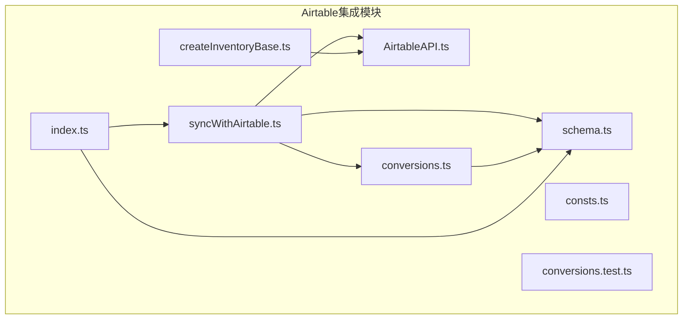
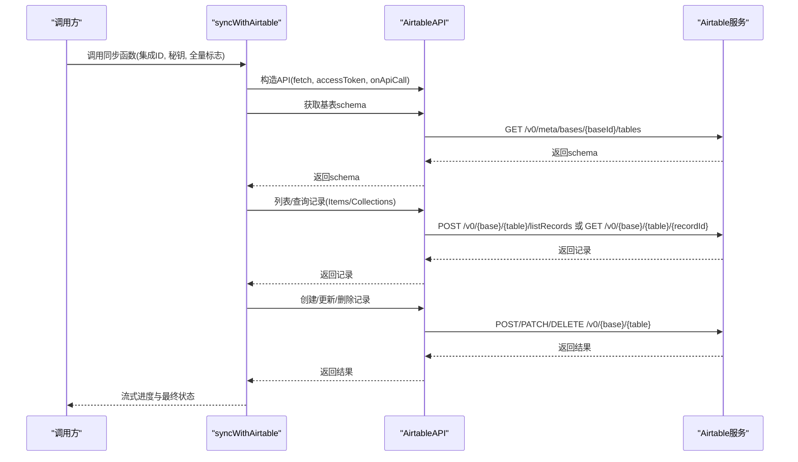
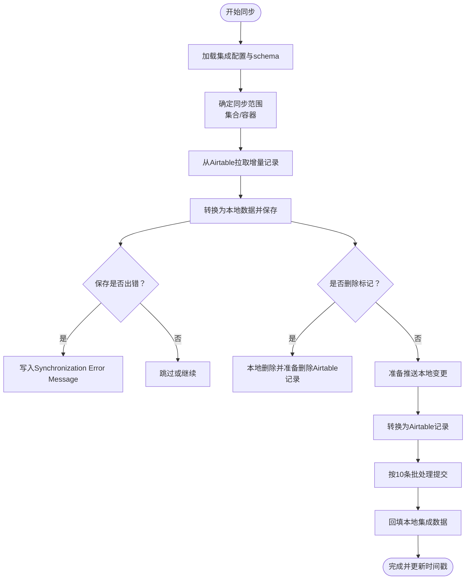
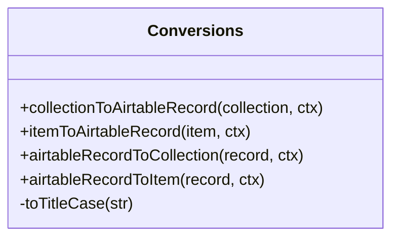
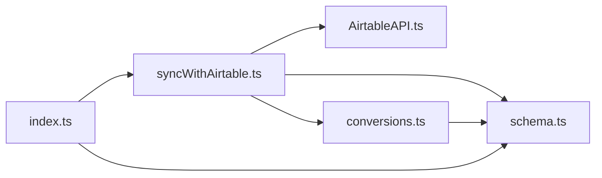

# Airtable集成API

<cite>
**本文引用的文件**
- [AirtableAPI.ts](file://packages/integration-airtable/lib/AirtableAPI.ts)
- [syncWithAirtable.ts](file://packages/integration-airtable/lib/syncWithAirtable.ts)
- [conversions.ts](file://packages/integration-airtable/lib/conversions.ts)
- [schema.ts](file://packages/integration-airtable/lib/schema.ts)
- [createInventoryBase.ts](file://packages/integration-airtable/lib/createInventoryBase.ts)
- [index.ts](file://packages/integration-airtable/lib/index.ts)
- [consts.ts](file://packages/integration-airtable/lib/consts.ts)
- [conversions.test.ts](file://packages/integration-airtable/lib/conversions.test.ts)
</cite>

## 目录
1. [简介](#简介)
2. [项目结构](#项目结构)
3. [核心组件](#核心组件)
4. [架构总览](#架构总览)
5. [详细组件分析](#详细组件分析)
6. [依赖关系分析](#依赖关系分析)
7. [性能与速率限制](#性能与速率限制)
8. [故障排查指南](#故障排查指南)
9. [结论](#结论)
10. [附录：REST端点与示例](#附录rest端点与示例)

## 简介
本文件面向Airtable集成API的使用者与维护者，系统性说明以下内容：
- AirtableAPI类的REST接口与认证方式
- 端点URL模式、请求/响应JSON结构
- 速率限制策略与重试机制
- 双向同步协议syncWithAirtable：数据映射规则、字段转换逻辑、冲突解决与错误处理
- conversions.ts中的数据类型转换函数
- 创建、读取、更新、删除Airtable记录的使用路径与示例位置
- 常见错误与解决方案（连接超时、权限错误、数据验证失败）

## 项目结构
该模块位于packages/integration-airtable/lib目录下，核心文件如下：
- AirtableAPI.ts：封装Airtable REST API调用，内置速率限制与重试
- syncWithAirtable.ts：双向同步主流程，负责Collections与Items的拉取、推送、删除与冲突处理
- conversions.ts：集合与物品到Airtable记录的转换函数，以及Airtable记录到本地数据的反向转换
- schema.ts：集成配置的Zod校验模式
- createInventoryBase.ts：辅助创建基础表结构（已标注为不推荐使用）
- index.ts：导出入口
- consts.ts：模板基地址常量
- conversions.test.ts：转换函数的单元测试

图表来源
- [AirtableAPI.ts](file://packages/integration-airtable/lib/AirtableAPI.ts#L1-L452)
- [syncWithAirtable.ts](file://packages/integration-airtable/lib/syncWithAirtable.ts#L1-L1452)
- [conversions.ts](file://packages/integration-airtable/lib/conversions.ts#L1-L564)
- [schema.ts](file://packages/integration-airtable/lib/schema.ts#L1-L17)
- [createInventoryBase.ts](file://packages/integration-airtable/lib/createInventoryBase.ts#L1-L165)
- [index.ts](file://packages/integration-airtable/lib/index.ts#L1-L5)
- [consts.ts](file://packages/integration-airtable/lib/consts.ts#L1-L3)
- [conversions.test.ts](file://packages/integration-airtable/lib/conversions.test.ts#L1-L283)

章节来源
- [index.ts](file://packages/integration-airtable/lib/index.ts#L1-L5)

## 核心组件
- AirtableAPI：提供Airtable元数据与数据表操作的封装，内置速率限制与重试；支持列表、查询、创建、更新、删除等操作，并抛出AirtableAPIError用于错误分类
- syncWithAirtable：双向同步主流程，按Collections与Items分别执行“从本地到Airtable”和“从Airtable到本地”的同步，处理全量与增量、删除标记、图片同步与冲突检测
- conversions：定义集合与物品与Airtable记录之间的字段映射与类型转换
- schema：集成配置的Zod校验，确保base_id、作用域、图片上传开关等参数合法
- createInventoryBase：辅助创建基础表结构（已标注为不推荐使用）
- index：导出schema与syncWithAirtable

章节来源
- [AirtableAPI.ts](file://packages/integration-airtable/lib/AirtableAPI.ts#L108-L451)
- [syncWithAirtable.ts](file://packages/integration-airtable/lib/syncWithAirtable.ts#L1-L1452)
- [conversions.ts](file://packages/integration-airtable/lib/conversions.ts#L1-L564)
- [schema.ts](file://packages/integration-airtable/lib/schema.ts#L1-L17)
- [createInventoryBase.ts](file://packages/integration-airtable/lib/createInventoryBase.ts#L1-L165)
- [index.ts](file://packages/integration-airtable/lib/index.ts#L1-L5)

## 架构总览
AirtableAPI通过Bearer Token进行认证，内部实现串行节流与指数退避重试。syncWithAirtable在初始化后：
- 读取集成配置与Airtable基表结构
- 检查目标表与关键字段存在性与类型
- 执行Collections与Items的双向同步
- 处理删除标记、图片同步、冲突检测与错误回写
- 记录同步统计与API调用计数

图表来源
- [AirtableAPI.ts](file://packages/integration-airtable/lib/AirtableAPI.ts#L196-L451)
- [syncWithAirtable.ts](file://packages/integration-airtable/lib/syncWithAirtable.ts#L132-L1387)

## 详细组件分析

### AirtableAPI类与REST接口
- 认证方式：Authorization头使用Bearer Token
- 速率限制：内部实现串行节流，最小间隔约210ms，同时对429/5xx进行重试（最多5次，每次等待约2秒）
- 主要端点与方法：
  - 列出基表：GET /v0/meta/bases
  - 获取基表schema：GET /v0/meta/bases/{baseId}/tables
  - 创建基表：POST /v0/meta/bases
  - 创建字段：POST /v0/meta/bases/{baseId}/tables/{tableId}/fields
  - 更新字段：PATCH /v0/meta/bases/{baseId}/tables/{tableId}/fields/{fieldId}
  - 列表记录：POST /v0/{base}/{table}/listRecords
  - 查询单条记录：GET /v0/{base}/{table}/{recordId}
  - 创建记录：POST /v0/{base}/{table}
  - 更新记录：PATCH /v0/{base}/{table}
  - 删除记录：DELETE /v0/{base}/{table}?records={ids...} 或 DELETE /v0/{base}/{table}/{recordId}

请求/响应要点
- 请求体：除listRecords外多为JSON对象，包含records或字段定义
- 响应体：标准JSON；若出现error字段，将抛出AirtableAPIError，包含type与message

错误处理
- 对429与5xx状态码触发重试
- 对非2xx且非429的错误抛出AirtableAPIError
- onApiCall回调用于统计API调用次数

章节来源
- [AirtableAPI.ts](file://packages/integration-airtable/lib/AirtableAPI.ts#L196-L451)

### 同步协议：syncWithAirtable
- 初始化与配置
  - 读取集成配置（base_id、scope_type、可选过滤项、图片上传开关等）
  - 读取Airtable基表schema并校验目标表与关键字段存在性与类型
- 数据范围与全量/增量
  - 支持按集合或容器范围同步
  - 全量模式会先拉取Airtable现有记录ID，避免重复创建
- 双向同步步骤
  - 从本地到Airtable：
    - 生成待创建/更新记录（按10条批处理）
    - 写入Airtable并回填本地集成数据（记录Airtable recordId与修改时间）
  - 从Airtable到本地：
    - 分页列出记录，按Modified At过滤增量
    - 将Airtable记录转换为本地数据，保存并记录批次历史
    - 若保存失败，写入Synchronization Error Message字段
    - 对于删除标记的记录，本地也删除并同步删除Airtable记录
  - 图片同步（可选）：
    - 当开启图片上传时，校验图片URL可达性，同步Images字段与item_image关联
- 冲突解决
  - 以Modified At为准：本地更新时间晚于Airtable则跳过或覆盖
  - 对同一条记录多次更新进行去重（避免INVALID_RECORDS）
  - 对于保存错误，保留错误信息并在后续重试阶段再次尝试
- 进度与统计
  - 提供toPush/toPull/pushed/pulled/pullErrored等指标
  - 记录创建/更新/删除的Airtable记录ID映射
  - 最终更新integration.data中的last_push/last_pull/last_synced_at

图表来源
- [syncWithAirtable.ts](file://packages/integration-airtable/lib/syncWithAirtable.ts#L132-L1387)

章节来源
- [syncWithAirtable.ts](file://packages/integration-airtable/lib/syncWithAirtable.ts#L1-L1452)

### 字段转换与映射：conversions.ts
- 集合到Airtable记录
  - 字段映射：Name、ID、Ref. No.
  - 仅返回Airtable表中存在的字段
- 物品到Airtable记录
  - 关联字段：Collection、Container（通过本地ID映射到Airtable recordId）
  - 类型字段：Type（空值或小写下划线转换单词）
  - 数值/日期字段：Purchase Price（x1000存储，回读时除以1000）、Purchase Date/Expiry Date、Created At/Updated At等
  - 库存字段：Stock Quantity、Stock Quantity Unit、Min Stock Level、Will Not Restock
  - 图片字段：Images（当启用图片上传时），并校验URL可达性
  - 其他：Notes、Model Name、PPC、RFID EPC Hex、Use First Image as Icon、Manually Set RFID EPC Hex等
  - 仅返回Airtable表中存在的字段
- Airtable记录到集合/物品
  - Delete字段用于标记删除
  - Collection/Container字段解析为本地collection_id/container_id
  - Type字段转回小写下划线形式
  - 日期字段解析为毫秒时间戳
  - 集合/物品的integrations字段中记录Airtable recordId与modified_at
- 工具函数
  - toTitleCase：标题化字符串

图表来源
- [conversions.ts](file://packages/integration-airtable/lib/conversions.ts#L1-L564)

章节来源
- [conversions.ts](file://packages/integration-airtable/lib/conversions.ts#L1-L564)
- [conversions.test.ts](file://packages/integration-airtable/lib/conversions.test.ts#L1-L283)

### 配置与模板
- schema.ts定义了集成配置的校验规则，包括：
  - airtable_base_id：必填
  - scope_type：collections或containers
  - collection_ids_to_sync/container_ids_to_sync：可选数组
  - images_public_endpoint：可选，用于图片URL可达性校验
  - disable_uploading_item_images：可选，禁用图片上传
- consts.ts提供模板基地址常量

章节来源
- [schema.ts](file://packages/integration-airtable/lib/schema.ts#L1-L17)
- [consts.ts](file://packages/integration-airtable/lib/consts.ts#L1-L3)

### 基础表创建（已不推荐）
- createInventoryBase.ts用于创建Items与Collections表及必要字段
- 注意：当前实现不支持创建lastModifiedTime字段，因此不建议使用

章节来源
- [createInventoryBase.ts](file://packages/integration-airtable/lib/createInventoryBase.ts#L1-L165)

## 依赖关系分析
- syncWithAirtable依赖AirtableAPI进行HTTP调用，依赖conversions进行数据映射，依赖schema进行配置校验
- conversions依赖schema中的字段白名单与类型转换规则
- index导出schema与syncWithAirtable，便于外部使用

图表来源
- [syncWithAirtable.ts](file://packages/integration-airtable/lib/syncWithAirtable.ts#L1-L1452)
- [AirtableAPI.ts](file://packages/integration-airtable/lib/AirtableAPI.ts#L108-L451)
- [conversions.ts](file://packages/integration-airtable/lib/conversions.ts#L1-L564)
- [schema.ts](file://packages/integration-airtable/lib/schema.ts#L1-L17)
- [index.ts](file://packages/integration-airtable/lib/index.ts#L1-L5)

## 性能与速率限制
- 速率限制策略
  - 串行节流：内部使用isFetching与lastFetchTime控制最小间隔约210ms
  - 并发阻塞：同一时刻仅允许一次请求
- 错误重试
  - 对429与5xx状态码自动重试（最多5次，每次等待约2秒）
- 批处理
  - Airtable批量创建/更新/删除采用每批10条，减少API调用次数
- 图片上传
  - 在启用图片上传时，会对每个图片URL发起HEAD请求校验可达性，可能增加额外延迟

章节来源
- [AirtableAPI.ts](file://packages/integration-airtable/lib/AirtableAPI.ts#L196-L235)
- [syncWithAirtable.ts](file://packages/integration-airtable/lib/syncWithAirtable.ts#L471-L509)
- [syncWithAirtable.ts](file://packages/integration-airtable/lib/syncWithAirtable.ts#L744-L765)

## 故障排查指南
- 连接超时/权限错误
  - AirtableAPI对429与5xx进行重试；若仍失败，抛出AirtableAPIError
  - onApiCall回调可用于统计API调用次数，定位异常
- 权限不足
  - NOT_FOUND或INVALID_PERMISSIONS_OR_MODEL_NOT_FOUND会被捕获并忽略某些删除场景，但不会阻止整体同步
- 数据验证失败
  - 保存本地数据失败时，会在Airtable记录上写入Synchronization Error Message字段，便于定位
- 图片URL不可达
  - itemToAirtableRecord在启用图片上传时会校验URL可达性，若404且重试多次仍未就绪，会抛出错误
- 字段缺失或类型不符
  - syncWithAirtable在初始化时会校验Collections与Items表的关键字段（如ID、Modified At），缺失或类型不符会直接报错

章节来源
- [AirtableAPI.ts](file://packages/integration-airtable/lib/AirtableAPI.ts#L216-L235)
- [syncWithAirtable.ts](file://packages/integration-airtable/lib/syncWithAirtable.ts#L152-L170)
- [syncWithAirtable.ts](file://packages/integration-airtable/lib/syncWithAirtable.ts#L592-L709)
- [syncWithAirtable.ts](file://packages/integration-airtable/lib/syncWithAirtable.ts#L847-L881)
- [conversions.ts](file://packages/integration-airtable/lib/conversions.ts#L120-L147)

## 结论
该Airtable集成API提供了完善的认证、速率限制与重试机制，配合双向同步协议实现了可靠的Collections与Items数据一致性。通过严格的字段映射与冲突检测，结合错误回写与进度统计，能够满足大多数库存管理场景下的Airtable集成需求。建议在生产环境中：
- 明确配置scope_type与过滤条件，避免不必要的全量同步
- 合理设置图片上传开关与公共URL，平衡数据完整性与性能
- 使用全量同步进行初始化，随后切换为增量同步以降低API开销

## 附录：REST端点与示例

### AirtableAPI端点与请求/响应
- 列出基表
  - 方法：GET
  - URL：/v0/meta/bases
  - 请求头：Authorization: Bearer {access_token}
  - 响应：包含bases数组
- 获取基表schema
  - 方法：GET
  - URL：/v0/meta/bases/{baseId}/tables
  - 响应：包含tables数组
- 创建基表
  - 方法：POST
  - URL：/v0/meta/bases
  - 请求体：{ name, tables, workspaceId }
  - 响应：包含新基表信息
- 创建字段
  - 方法：POST
  - URL：/v0/meta/bases/{baseId}/tables/{tableId}/fields
  - 请求体：字段定义
- 更新字段
  - 方法：PATCH
  - URL：/v0/meta/bases/{baseId}/tables/{tableId}/fields/{fieldId}
  - 请求体：字段定义
- 列表记录
  - 方法：POST
  - URL：/v0/{base}/{table}/listRecords
  - 请求体：{ pageSize?, offset?, sort?, fields?, filterByFormula? }
  - 响应：{ offset?, records[] }
- 查询单条记录
  - 方法：GET
  - URL：/v0/{base}/{table}/{recordId}
  - 响应：记录对象
- 创建记录
  - 方法：POST
  - URL：/v0/{base}/{table}
  - 请求体：{ records[] }
  - 响应：创建结果
- 更新记录
  - 方法：PATCH
  - URL：/v0/{base}/{table}
  - 请求体：{ records[] }
  - 响应：更新结果
- 删除记录
  - 方法：DELETE
  - URL：/v0/{base}/{table}?records={id1}&records={id2}... 或 /v0/{base}/{table}/{recordId}
  - 响应：删除结果

章节来源
- [AirtableAPI.ts](file://packages/integration-airtable/lib/AirtableAPI.ts#L237-L451)

### 创建、读取、更新、删除Airtable记录的使用路径
- 创建记录
  - 路径：AirtableAPI.createRecords
  - 示例位置：[AirtableAPI.ts](file://packages/integration-airtable/lib/AirtableAPI.ts#L359-L382)
  - 同步流程中的创建：[syncWithAirtable.ts](file://packages/integration-airtable/lib/syncWithAirtable.ts#L471-L509)
- 读取记录
  - 路径：AirtableAPI.listRecords / AirtableAPI.getRecord
  - 示例位置：[AirtableAPI.ts](file://packages/integration-airtable/lib/AirtableAPI.ts#L325-L358)
  - 同步流程中的拉取：[syncWithAirtable.ts](file://packages/integration-airtable/lib/syncWithAirtable.ts#L536-L563)
- 更新记录
  - 路径：AirtableAPI.updateRecords
  - 示例位置：[AirtableAPI.ts](file://packages/integration-airtable/lib/AirtableAPI.ts#L383-L406)
  - 同步流程中的更新：[syncWithAirtable.ts](file://packages/integration-airtable/lib/syncWithAirtable.ts#L744-L765)
- 删除记录
  - 路径：AirtableAPI.deleteRecords
  - 示例位置：[AirtableAPI.ts](file://packages/integration-airtable/lib/AirtableAPI.ts#L407-L449)
  - 同步流程中的删除：[syncWithAirtable.ts](file://packages/integration-airtable/lib/syncWithAirtable.ts#L729-L743)

### 双向同步示例位置
- 集合同步
  - 转换函数：[conversions.ts](file://packages/integration-airtable/lib/conversions.ts#L13-L42)
  - 同步流程：[syncWithAirtable.ts](file://packages/integration-airtable/lib/syncWithAirtable.ts#L890-L911)
- 物品同步
  - 转换函数：[conversions.ts](file://packages/integration-airtable/lib/conversions.ts#L44-L227)
  - 同步流程：[syncWithAirtable.ts](file://packages/integration-airtable/lib/syncWithAirtable.ts#L1137-L1290)