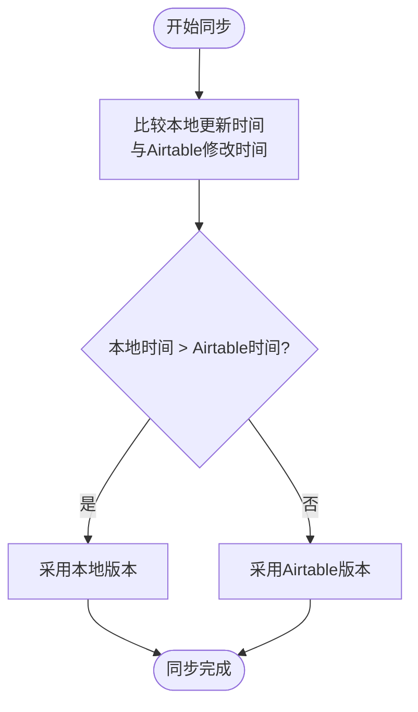
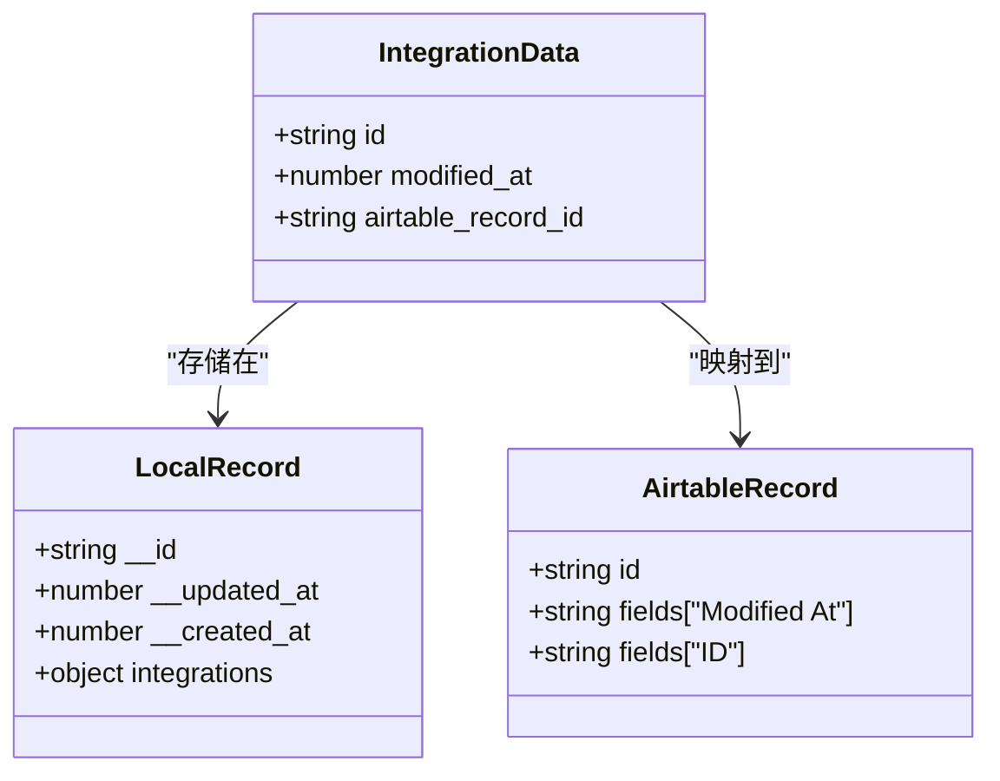
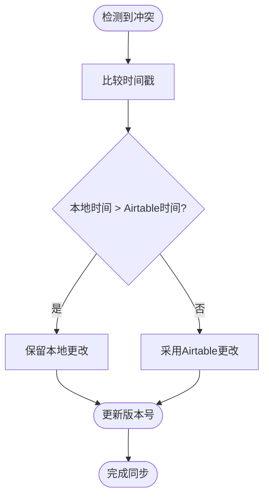
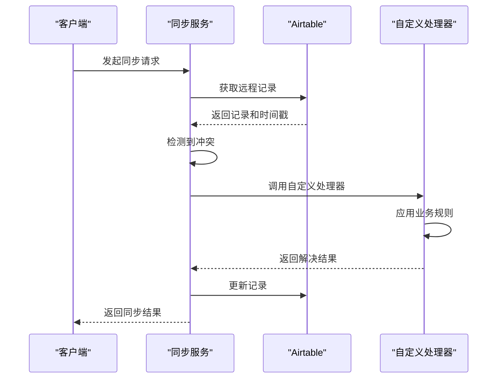
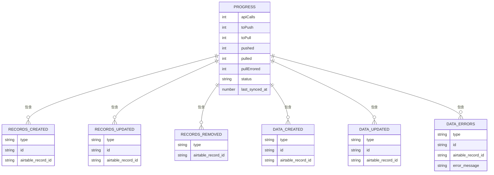

# 冲突解决机制

<cite>
**本文档引用的文件**   
- [syncWithAirtable.ts](file://packages\integration-airtable\lib\syncWithAirtable.ts)
- [AirtableAPI.ts](file://packages\integration-airtable\lib\AirtableAPI.ts)
- [conversions.ts](file://packages\integration-airtable\lib\conversions.ts)
- [schema.ts](file://packages\integration-airtable\lib\schema.ts)
- [AirtableIntegrationScreen.tsx](file://App\app\features\integrations\screens\AirtableIntegrationScreen.tsx)
- [createInventoryBase.ts](file://packages\integration-airtable\lib\createInventoryBase.ts)
- [callbacks.ts](file://Data\lib\callbacks.ts)
</cite>

## 目录
1. [简介](#简介)
2. [冲突类型分析](#冲突类型分析)
3. [冲突检测算法](#冲突检测算法)
4. [内置冲突解决策略](#内置冲突解决策略)
5. [自定义冲突解决处理器](#自定义冲突解决处理器)
6. [日志记录与监控机制](#日志记录与监控机制)
7. [结论](#结论)

## 简介

本系统实现了Airtable双向同步过程中的冲突解决机制，确保在多端同时修改数据时能够正确处理各种冲突情况。同步机制基于时间戳和版本控制来检测和解决冲突，支持多种冲突解决策略，包括"最后写入获胜"、"手动解决"和"合并更新"等模式。系统通过集成Airtable API实现数据同步，并在本地数据库中维护同步状态和冲突信息。

**Section sources**
- [syncWithAirtable.ts](file://packages\integration-airtable\lib\syncWithAirtable.ts#L1-L100)
- [AirtableIntegrationScreen.tsx](file://App\app\features\integrations\screens\AirtableIntegrationScreen.tsx#L60-L100)

## 冲突类型分析

系统在双向同步过程中需要处理多种冲突类型，主要包括同时修改冲突、删除冲突和数据不一致情况。

### 同时修改冲突

当同一记录在Airtable和本地客户端同时被修改时，会产生同时修改冲突。系统通过比较本地更新时间和Airtable记录的"Modified At"字段来检测此类冲突。如果本地记录的更新时间晚于Airtable记录的修改时间，则采用本地版本；否则采用Airtable版本。

### 删除冲突

删除冲突发生在以下场景：当一条记录在Airtable端被标记为删除（通过"Delete"复选框），而同时在本地客户端被修改时。系统通过特殊的删除标记机制来处理此类冲突，确保删除操作能够正确传播到所有端点。

### 数据不一致情况

数据不一致可能由网络问题、同步中断或数据验证失败引起。系统通过维护同步错误消息字段（"Synchronization Error Message"）来跟踪和报告这些不一致情况，允许用户查看和修复问题。

**Section sources**
- [syncWithAirtable.ts](file://packages\integration-airtable\lib\syncWithAirtable.ts#L599-L607)
- [createInventoryBase.ts](file://packages\integration-airtable\lib\createInventoryBase.ts#L120-L133)
- [conversions.ts](file://packages\integration-airtable\lib\conversions.ts#L259-L261)

## 冲突检测算法

冲突检测算法是同步机制的核心，它通过时间戳和版本号来识别和处理冲突。

### 时间戳比较机制

系统使用两种时间戳进行冲突检测：本地数据库的`__updated_at`字段和Airtable的"Modified At"字段。在同步过程中，系统会比较这两个时间戳来确定哪个版本是最新的。

**Diagram sources **
- [syncWithAirtable.ts](file://packages\integration-airtable\lib\syncWithAirtable.ts#L599-L603)
- [conversions.ts](file://packages\integration-airtable\lib\conversions.ts#L286-L287)

### 版本控制实现

系统在集成数据中维护版本信息，每个同步记录都包含一个`modified_at`字段，用于跟踪最后一次同步的时间。这个版本号在每次成功同步后更新，确保后续同步能够正确识别变更。

**Diagram sources **
- [syncWithAirtable.ts](file://packages\integration-airtable\lib\syncWithAirtable.ts#L279-L304)
- [conversions.ts](file://packages\integration-airtable\lib\conversions.ts#L251-L277)

## 内置冲突解决策略

系统提供了多种内置的冲突解决策略，以适应不同的业务场景。

### 最后写入获胜策略

"最后写入获胜"是最基本的冲突解决策略，它简单地采用时间戳最新的版本。这种策略适用于大多数场景，特别是当用户期望最近的更改总是优先时。

**Diagram sources **
- [syncWithAirtable.ts](file://packages\integration-airtable\lib\syncWithAirtable.ts#L599-L603)

### 手动解决策略

对于重要数据，系统支持手动解决策略。当检测到冲突时，系统会在Airtable记录中设置"Synchronization Error Message"字段，通知用户存在冲突需要手动解决。用户可以在Airtable界面中查看冲突详情并做出决策。

### 合并更新策略

在某些情况下，系统可以尝试合并更新而不是简单地选择一个版本。例如，如果两个端点修改了不同的字段，系统可以将这些更改合并到同一个记录中。这种策略需要复杂的字段级比较逻辑。

**Section sources**
- [syncWithAirtable.ts](file://packages\integration-airtable\lib\syncWithAirtable.ts#L694-L703)
- [createInventoryBase.ts](file://packages\integration-airtable\lib\createInventoryBase.ts#L99-L103)

## 自定义冲突解决处理器

系统提供了扩展点，允许根据特定业务规则实现自定义冲突解决逻辑。

### 业务规则处理器

开发者可以实现自定义的冲突解决处理器，根据特定的业务规则来决定如何处理冲突。例如，某些关键字段的更改可能总是优先于其他字段的更改。

**Diagram sources **
- [syncWithAirtable.ts](file://packages\integration-airtable\lib\syncWithAirtable.ts#L401-L405)

### 扩展点实现

系统通过提供钩子函数和回调机制来支持自定义冲突解决。开发者可以在`afterSave`回调中实现特定的冲突解决逻辑，或者在数据转换过程中添加自定义的验证规则。

**Section sources**
- [syncWithAirtable.ts](file://packages\integration-airtable\lib\syncWithAirtable.ts#L401-L405)
- [callbacks.ts](file://Data\lib\callbacks.ts#L284-L303)

## 日志记录与监控机制

系统提供了完善的日志记录和监控机制，帮助用户诊断和解决同步问题。

### 同步进度跟踪

系统通过`SyncWithAirtableProgress`对象跟踪同步进度，记录各种关键指标，如推送和拉取的记录数量、错误数量等。这些信息可用于监控同步状态和性能。

**Diagram sources **
- [syncWithAirtable.ts](file://packages\integration-airtable\lib\syncWithAirtable.ts#L31-L82)

### 错误处理与重试

系统实现了健壮的错误处理和重试机制。当同步失败时，系统会记录详细的错误信息，并在后续同步中尝试重新处理失败的记录。对于认证错误等临时性问题，系统会自动提示用户重新授权。

**Section sources**
- [syncWithAirtable.ts](file://packages\integration-airtable\lib\syncWithAirtable.ts#L333-L346)
- [AirtableIntegrationScreen.tsx](file://App\app\features\integrations\screens\AirtableIntegrationScreen.tsx#L333-L346)

## 结论

本冲突解决机制通过时间戳比较、版本控制和多种解决策略，有效处理了Airtable双向同步过程中的各种冲突情况。系统设计考虑了数据一致性、用户体验和可扩展性，提供了灵活的内置策略和自定义扩展点。通过完善的日志记录和监控机制，用户可以轻松诊断和解决同步问题，确保数据在多端之间保持一致。