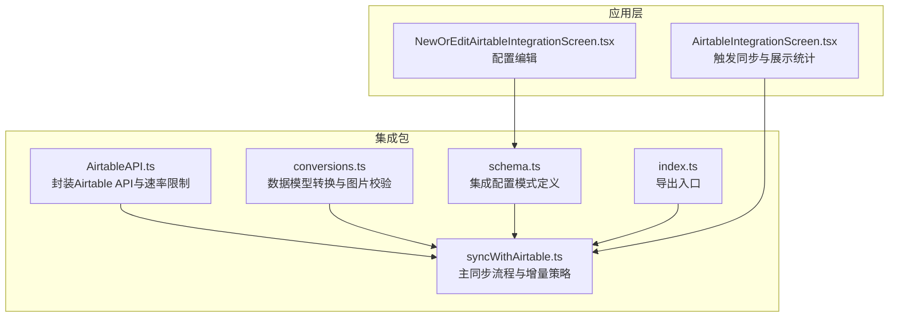
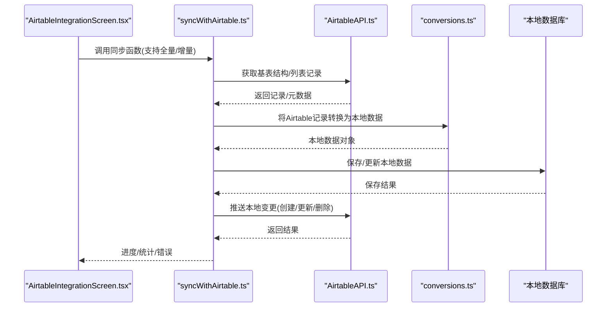
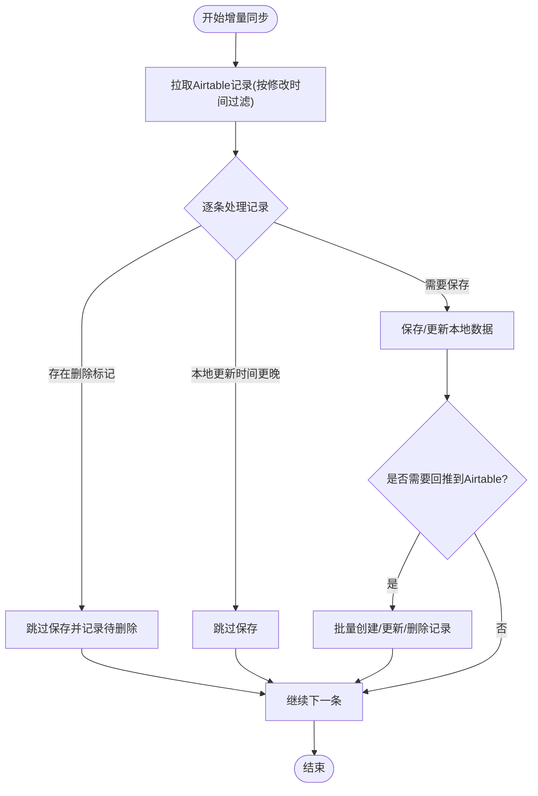
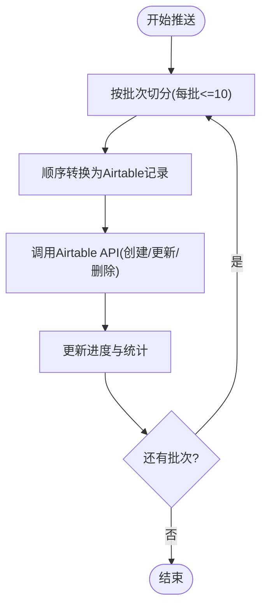
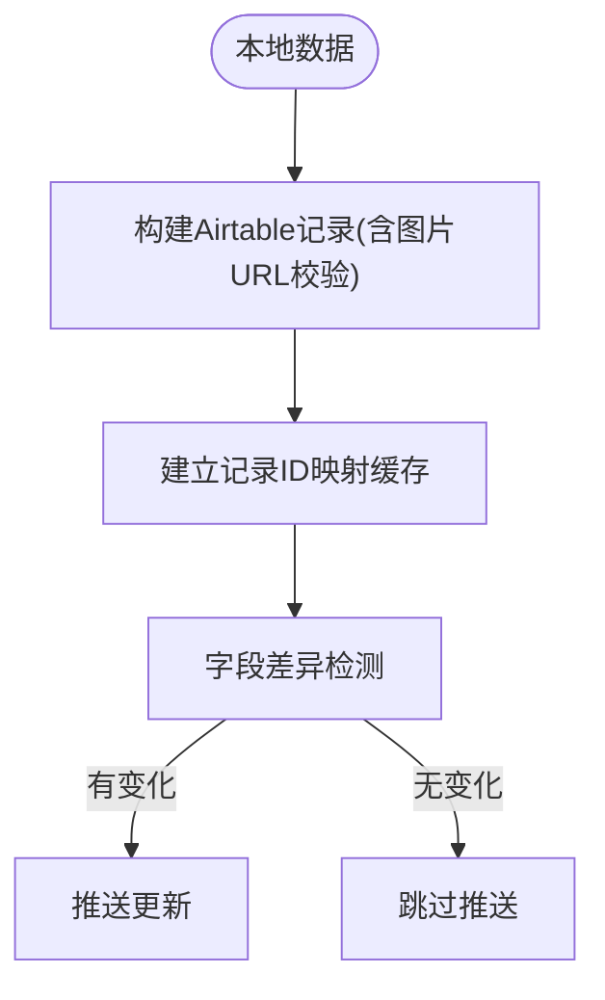
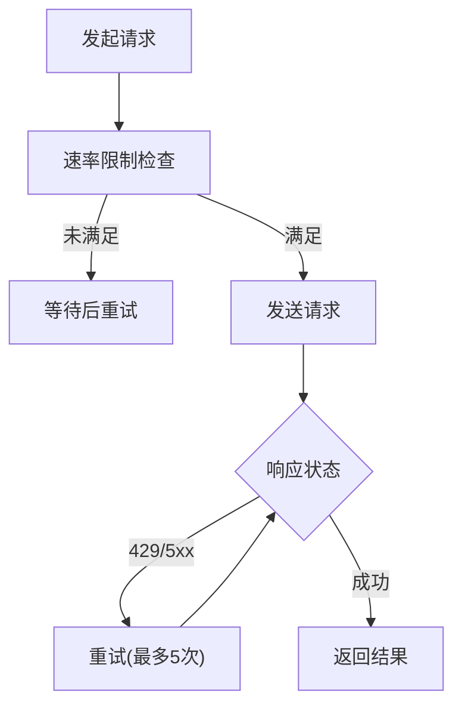
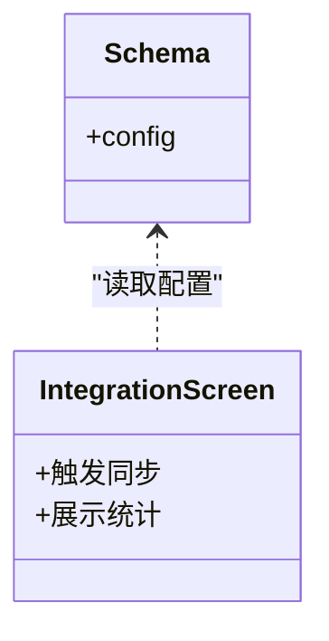
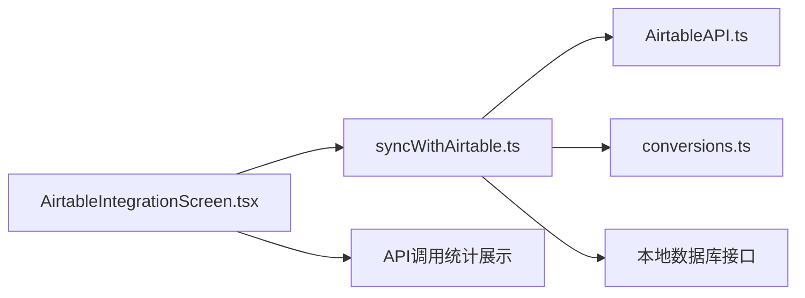

# 性能优化指南

<cite>
**本文引用的文件**
- [syncWithAirtable.ts](file://packages/integration-airtable/lib/syncWithAirtable.ts)
- [AirtableAPI.ts](file://packages/integration-airtable/lib/AirtableAPI.ts)
- [conversions.ts](file://packages/integration-airtable/lib/conversions.ts)
- [schema.ts](file://packages/integration-airtable/lib/schema.ts)
- [index.ts](file://packages/integration-airtable/lib/index.ts)
- [AirtableIntegrationScreen.tsx](file://App/app/features/integrations/screens/AirtableIntegrationScreen.tsx)
- [NewOrEditAirtableIntegrationScreen.tsx](file://App/app/features/integrations/screens/NewOrEditAirtableIntegrationScreen.tsx)
- [hasChanges.ts](file://Data/lib/utils/hasChanges.ts)
</cite>

## 目录
1. [简介](#简介)
2. [项目结构](#项目结构)
3. [核心组件](#核心组件)
4. [架构总览](#架构总览)
5. [详细组件分析](#详细组件分析)
6. [依赖关系分析](#依赖关系分析)
7. [性能考量与优化建议](#性能考量与优化建议)
8. [故障排查指南](#故障排查指南)
9. [结论](#结论)
10. [附录](#附录)

## 简介
本指南聚焦于Airtable同步性能优化，围绕以下关键主题展开：
- 影响同步性能的关键因素：网络延迟、数据量大小、API调用频率
- 增量同步策略：基于“修改时间”字段的变更检测，减少不必要数据传输
- 批量处理与并行同步：分批创建/更新/删除记录，以及在单次请求内合并操作
- 缓存策略与本地预处理：利用映射缓存与本地过滤，降低API调用次数
- 性能监控指标与调优建议：API调用计数、进度上报、错误重试与退避

## 项目结构
该仓库中与Airtable同步直接相关的模块集中在packages/integration-airtable包内，前端集成界面位于App应用层。整体结构如下图所示：

图表来源
- [AirtableAPI.ts](file://packages/integration-airtable/lib/AirtableAPI.ts#L1-L452)
- [syncWithAirtable.ts](file://packages/integration-airtable/lib/syncWithAirtable.ts#L1-L1452)
- [conversions.ts](file://packages/integration-airtable/lib/conversions.ts#L1-L564)
- [schema.ts](file://packages/integration-airtable/lib/schema.ts#L1-L17)
- [index.ts](file://packages/integration-airtable/lib/index.ts#L1-L5)
- [AirtableIntegrationScreen.tsx](file://App/app/features/integrations/screens/AirtableIntegrationScreen.tsx#L223-L261)
- [NewOrEditAirtableIntegrationScreen.tsx](file://App/app/features/integrations/screens/NewOrEditAirtableIntegrationScreen.tsx#L45-L619)

章节来源
- [AirtableAPI.ts](file://packages/integration-airtable/lib/AirtableAPI.ts#L1-L452)
- [syncWithAirtable.ts](file://packages/integration-airtable/lib/syncWithAirtable.ts#L1-L1452)
- [conversions.ts](file://packages/integration-airtable/lib/conversions.ts#L1-L564)
- [schema.ts](file://packages/integration-airtable/lib/schema.ts#L1-L17)
- [index.ts](file://packages/integration-airtable/lib/index.ts#L1-L5)
- [AirtableIntegrationScreen.tsx](file://App/app/features/integrations/screens/AirtableIntegrationScreen.tsx#L223-L261)
- [NewOrEditAirtableIntegrationScreen.tsx](file://App/app/features/integrations/screens/NewOrEditAirtableIntegrationScreen.tsx#L45-L619)

## 核心组件
- AirtableAPI：统一封装Airtable API调用，内置速率限制与重试逻辑，确保每秒不超过限定请求数，避免429/5xx错误。
- 同步主流程（syncWithAirtable）：负责准备配置、拉取基表结构、执行增量/全量同步、推送本地变更到Airtable、回写Airtable变更到本地数据库、记录进度与错误。
- 数据转换（conversions）：将本地数据模型转换为Airtable记录，或反向转换；包含图片URL可用性校验与映射缓存。
- 集成配置（schema）：定义可配置项，如基表ID、同步范围、是否上传图片等。
- 应用层集成：屏幕组件触发同步流程并展示API调用统计。

章节来源
- [AirtableAPI.ts](file://packages/integration-airtable/lib/AirtableAPI.ts#L1-L452)
- [syncWithAirtable.ts](file://packages/integration-airtable/lib/syncWithAirtable.ts#L1-L1452)
- [conversions.ts](file://packages/integration-airtable/lib/conversions.ts#L1-L564)
- [schema.ts](file://packages/integration-airtable/lib/schema.ts#L1-L17)
- [AirtableIntegrationScreen.tsx](file://App/app/features/integrations/screens/AirtableIntegrationScreen.tsx#L223-L261)

## 架构总览
下图展示了从应用层发起同步到Airtable API交互的整体流程，以及本地数据库与Airtable之间的双向同步路径。

图表来源
- [AirtableIntegrationScreen.tsx](file://App/app/features/integrations/screens/AirtableIntegrationScreen.tsx#L223-L261)
- [syncWithAirtable.ts](file://packages/integration-airtable/lib/syncWithAirtable.ts#L100-L1418)
- [AirtableAPI.ts](file://packages/integration-airtable/lib/AirtableAPI.ts#L197-L451)
- [conversions.ts](file://packages/integration-airtable/lib/conversions.ts#L1-L564)

## 详细组件分析

### 增量同步策略与变更检测
- 变更检测依据：使用“修改时间”字段进行比较，仅同步在上次拉取时间之后有变更的记录，显著减少网络与存储压力。
- 过滤公式：通过filterByFormula构造“IS_AFTER({Modified At}, ...)”，在Airtable端完成筛选，避免下载全量数据。
- 本地去重与跳过：当本地记录的更新时间晚于远端修改时间，或命中需要跳过的ID集合时，跳过保存，避免重复写入。
- 错误重试：对拉取阶段的错误记录进行二次重试，清理错误标记并尝试修复。

图表来源
- [syncWithAirtable.ts](file://packages/integration-airtable/lib/syncWithAirtable.ts#L526-L777)
- [syncWithAirtable.ts](file://packages/integration-airtable/lib/syncWithAirtable.ts#L554-L562)

章节来源
- [syncWithAirtable.ts](file://packages/integration-airtable/lib/syncWithAirtable.ts#L526-L777)
- [syncWithAirtable.ts](file://packages/integration-airtable/lib/syncWithAirtable.ts#L554-L562)

### 批量处理与并行同步
- 分批推送：创建/更新/删除均以固定批次大小（例如每次10条）进行，减少单次请求负载与Airtable端的处理压力。
- 并行转换：在创建阶段，对本地待创建记录的转换采用顺序执行函数数组的方式，避免并发导致的资源竞争，同时保持较高的吞吐。
- 去重与幂等：在更新阶段对同一记录多次更新进行去重，避免无效请求。

图表来源
- [syncWithAirtable.ts](file://packages/integration-airtable/lib/syncWithAirtable.ts#L471-L510)
- [syncWithAirtable.ts](file://packages/integration-airtable/lib/syncWithAirtable.ts#L781-L820)
- [syncWithAirtable.ts](file://packages/integration-airtable/lib/syncWithAirtable.ts#L729-L766)

章节来源
- [syncWithAirtable.ts](file://packages/integration-airtable/lib/syncWithAirtable.ts#L471-L510)
- [syncWithAirtable.ts](file://packages/integration-airtable/lib/syncWithAirtable.ts#L729-L766)
- [syncWithAirtable.ts](file://packages/integration-airtable/lib/syncWithAirtable.ts#L781-L820)

### 缓存策略与本地预处理
- 记录ID映射缓存：在拉取Airtable记录时，建立集合/物品记录ID到本地数据的映射缓存，减少重复查询本地数据库。
- 图片URL可用性校验：在构建物品记录时，先对图片URL执行HEAD请求，确保可访问后再提交到Airtable，避免无效附件。
- 本地变更判定：使用通用变更检测工具对字段差异进行判断，仅在确有变化时才触发回推，减少无效更新。

图表来源
- [conversions.ts](file://packages/integration-airtable/lib/conversions.ts#L1-L227)
- [conversions.ts](file://packages/integration-airtable/lib/conversions.ts#L229-L555)
- [hasChanges.ts](file://Data/lib/utils/hasChanges.ts#L1-L52)

章节来源
- [conversions.ts](file://packages/integration-airtable/lib/conversions.ts#L1-L227)
- [conversions.ts](file://packages/integration-airtable/lib/conversions.ts#L229-L555)
- [hasChanges.ts](file://Data/lib/utils/hasChanges.ts#L1-L52)

### API速率限制与重试
- 速率限制：内部实现串行化请求，最小间隔约210毫秒，确保每秒不超过限定请求数。
- 错误重试：对429/5xx类错误进行最多5次重试，每次等待固定时间后重试，提升稳定性。
- 统计上报：每次成功调用都会触发回调，累计API调用次数并持久化到集成数据中。

图表来源
- [AirtableAPI.ts](file://packages/integration-airtable/lib/AirtableAPI.ts#L197-L235)
- [AirtableAPI.ts](file://packages/integration-airtable/lib/AirtableAPI.ts#L216-L231)
- [syncWithAirtable.ts](file://packages/integration-airtable/lib/syncWithAirtable.ts#L1375-L1386)

章节来源
- [AirtableAPI.ts](file://packages/integration-airtable/lib/AirtableAPI.ts#L197-L235)
- [AirtableAPI.ts](file://packages/integration-airtable/lib/AirtableAPI.ts#L216-L231)
- [syncWithAirtable.ts](file://packages/integration-airtable/lib/syncWithAirtable.ts#L1375-L1386)

### 配置与集成点
- 集成配置：包含基表ID、同步范围（集合/容器）、可选的图片公共地址与是否禁用图片上传等。
- 屏幕集成：应用层屏幕负责触发同步、展示API调用统计与历史批次变更。

图表来源
- [schema.ts](file://packages/integration-airtable/lib/schema.ts#L1-L17)
- [AirtableIntegrationScreen.tsx](file://App/app/features/integrations/screens/AirtableIntegrationScreen.tsx#L223-L261)
- [AirtableIntegrationScreen.tsx](file://App/app/features/integrations/screens/AirtableIntegrationScreen.tsx#L698-L734)

章节来源
- [schema.ts](file://packages/integration-airtable/lib/schema.ts#L1-L17)
- [AirtableIntegrationScreen.tsx](file://App/app/features/integrations/screens/AirtableIntegrationScreen.tsx#L223-L261)
- [AirtableIntegrationScreen.tsx](file://App/app/features/integrations/screens/AirtableIntegrationScreen.tsx#L698-L734)

## 依赖关系分析
- 同步主流程依赖AirtableAPI进行网络请求，依赖转换模块进行数据形态转换，依赖本地数据库接口进行保存与查询。
- 应用层通过屏幕组件触发同步，并展示API调用统计与历史批次变更。

图表来源
- [AirtableIntegrationScreen.tsx](file://App/app/features/integrations/screens/AirtableIntegrationScreen.tsx#L223-L261)
- [AirtableIntegrationScreen.tsx](file://App/app/features/integrations/screens/AirtableIntegrationScreen.tsx#L698-L734)
- [syncWithAirtable.ts](file://packages/integration-airtable/lib/syncWithAirtable.ts#L100-L1418)
- [AirtableAPI.ts](file://packages/integration-airtable/lib/AirtableAPI.ts#L197-L451)
- [conversions.ts](file://packages/integration-airtable/lib/conversions.ts#L1-L564)

章节来源
- [AirtableIntegrationScreen.tsx](file://App/app/features/integrations/screens/AirtableIntegrationScreen.tsx#L223-L261)
- [AirtableIntegrationScreen.tsx](file://App/app/features/integrations/screens/AirtableIntegrationScreen.tsx#L698-L734)
- [syncWithAirtable.ts](file://packages/integration-airtable/lib/syncWithAirtable.ts#L100-L1418)
- [AirtableAPI.ts](file://packages/integration-airtable/lib/AirtableAPI.ts#L197-L451)
- [conversions.ts](file://packages/integration-airtable/lib/conversions.ts#L1-L564)

## 性能考量与优化建议

### 关键性能影响因素
- 网络延迟：AirtableAPI内部已做速率限制与重试，但仍需关注请求往返时间与服务器响应质量。
- 数据量大小：通过“修改时间”过滤与字段选择，尽量缩小每次拉取的数据规模。
- API调用频率：严格控制每秒请求数，避免触发429限流；批量推送减少请求次数。

章节来源
- [AirtableAPI.ts](file://packages/integration-airtable/lib/AirtableAPI.ts#L197-L235)
- [syncWithAirtable.ts](file://packages/integration-airtable/lib/syncWithAirtable.ts#L536-L563)

### 增量同步策略最佳实践
- 使用“修改时间”字段作为变更检测基准，避免全量扫描。
- 在拉取阶段使用filterByFormula进行服务端过滤，减少客户端处理负担。
- 对拉取阶段的错误记录进行二次重试，提高成功率。

章节来源
- [syncWithAirtable.ts](file://packages/integration-airtable/lib/syncWithAirtable.ts#L554-L562)
- [syncWithAirtable.ts](file://packages/integration-airtable/lib/syncWithAirtable.ts#L769-L777)

### 批量处理与并行同步
- 推送阶段固定批次大小（如10条/批），平衡吞吐与稳定性。
- 在创建阶段采用顺序转换函数数组，避免并发冲突；更新阶段对同记录多次更新进行去重。
- 对图片上传启用前的URL校验，减少无效附件导致的失败重试。

章节来源
- [syncWithAirtable.ts](file://packages/integration-airtable/lib/syncWithAirtable.ts#L471-L510)
- [syncWithAirtable.ts](file://packages/integration-airtable/lib/syncWithAirtable.ts#L729-L766)
- [conversions.ts](file://packages/integration-airtable/lib/conversions.ts#L120-L147)

### 缓存策略与本地预处理
- 建立Airtable记录ID到本地数据的映射缓存，减少重复查询。
- 使用字段差异检测工具仅在确有变化时回推，降低无效更新。
- 对图片URL进行HEAD校验，确保可访问后再提交，避免失败重试。

章节来源
- [syncWithAirtable.ts](file://packages/integration-airtable/lib/syncWithAirtable.ts#L526-L777)
- [conversions.ts](file://packages/integration-airtable/lib/conversions.ts#L120-L147)
- [hasChanges.ts](file://Data/lib/utils/hasChanges.ts#L1-L52)

### 性能监控指标与调优
- API调用计数：系统会按月统计Airtable API调用次数，便于观察与预算管理。
- 进度与错误：同步过程中持续上报toPull/pushed/pulled等进度指标，以及错误数量与详情。
- 调优建议：
  - 根据API调用统计调整同步频率，避免超出限额。
  - 在网络波动较大时适当增大重试等待时间。
  - 对图片上传开启条件（如图片公共地址有效）以减少失败重试。

章节来源
- [AirtableIntegrationScreen.tsx](file://App/app/features/integrations/screens/AirtableIntegrationScreen.tsx#L698-L734)
- [syncWithAirtable.ts](file://packages/integration-airtable/lib/syncWithAirtable.ts#L1375-L1386)

## 故障排查指南
- 429/5xx错误：AirtableAPI内部会自动重试，若仍失败，请检查网络状况与配额。
- 速率限制：确认未超过每秒请求上限；必要时降低批次大小或增加等待间隔。
- 图片上传失败：检查图片URL可达性与内容类型；确保图片已上传至公共地址。
- 字段差异问题：使用字段差异检测工具定位具体字段，避免不必要的更新。
- 历史批次与错误追踪：通过“由该集成创建的历史批次”查看同步批次与错误详情。

章节来源
- [AirtableAPI.ts](file://packages/integration-airtable/lib/AirtableAPI.ts#L216-L231)
- [conversions.ts](file://packages/integration-airtable/lib/conversions.ts#L120-L147)
- [hasChanges.ts](file://Data/lib/utils/hasChanges.ts#L1-L52)
- [AirtableIntegrationScreen.tsx](file://App/app/features/integrations/screens/AirtableIntegrationScreen.tsx#L698-L734)

## 结论
通过“修改时间”驱动的增量同步、严格的速率限制与重试、批量推送与本地缓存预处理，Airtable同步可在保证一致性的同时显著提升性能。结合API调用统计与进度指标，可针对不同环境与数据规模进行精细化调优，实现稳定高效的双向同步。

## 附录
- 集成配置项参考：基表ID、同步范围、图片公共地址、是否禁用图片上传等。
- 导出入口：index.ts导出同步函数与配置模式，便于在其他模块中复用。

章节来源
- [schema.ts](file://packages/integration-airtable/lib/schema.ts#L1-L17)
- [index.ts](file://packages/integration-airtable/lib/index.ts#L1-L5)