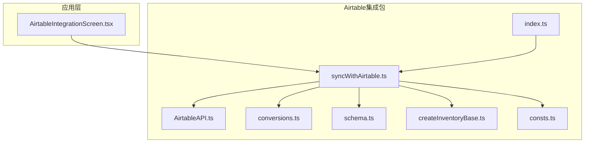
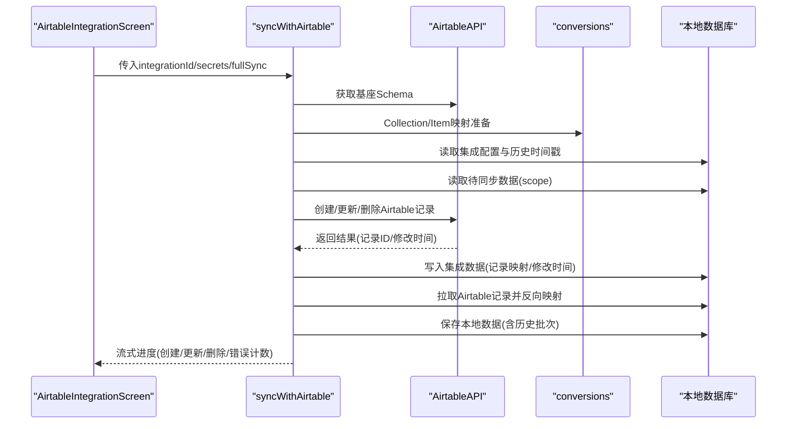
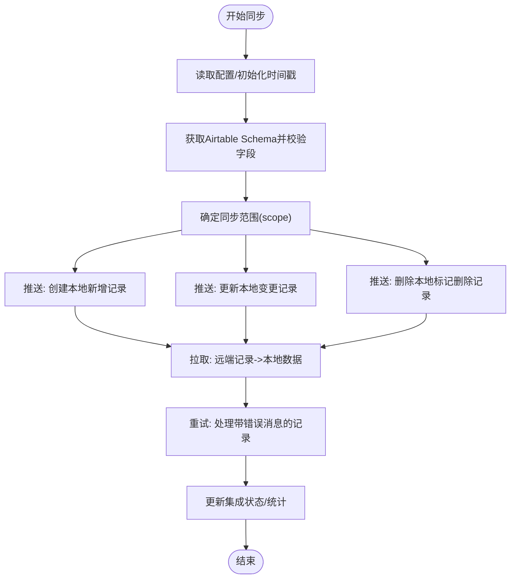
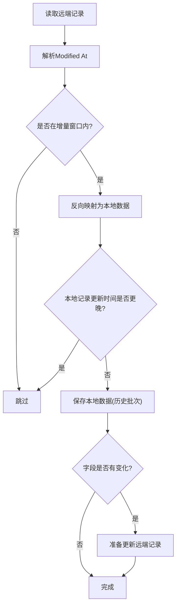
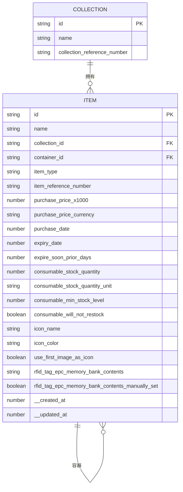
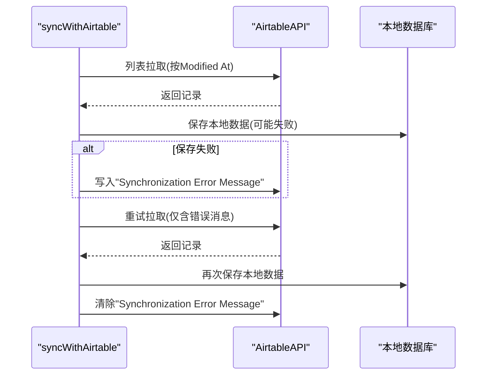
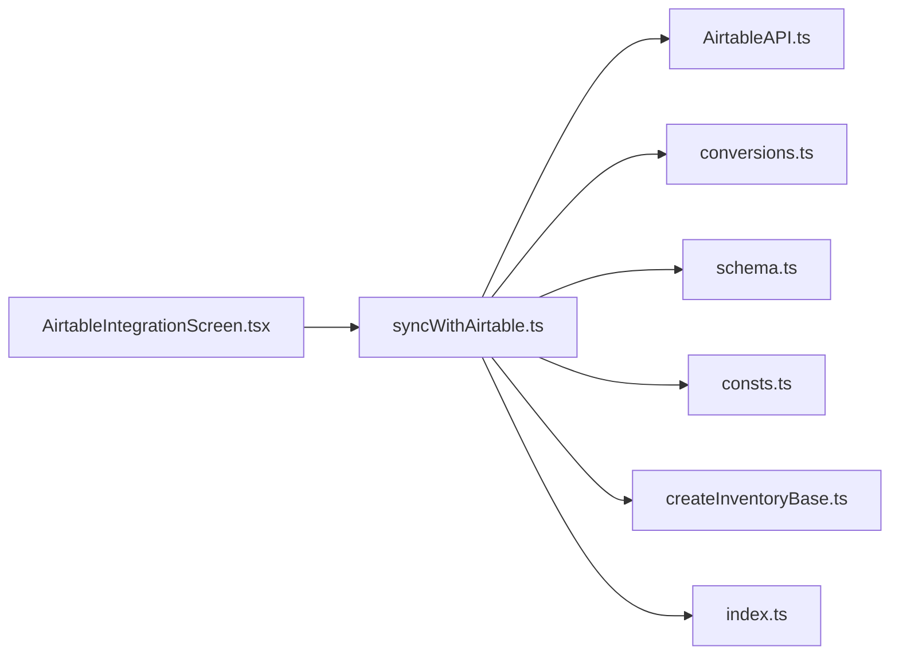

# 数据同步协议

<cite>
**本文引用的文件**
- [syncWithAirtable.ts](file://packages/integration-airtable/lib/syncWithAirtable.ts)
- [AirtableAPI.ts](file://packages/integration-airtable/lib/AirtableAPI.ts)
- [conversions.ts](file://packages/integration-airtable/lib/conversions.ts)
- [schema.ts](file://packages/integration-airtable/lib/schema.ts)
- [createInventoryBase.ts](file://packages/integration-airtable/lib/createInventoryBase.ts)
- [consts.ts](file://packages/integration-airtable/lib/consts.ts)
- [index.ts](file://packages/integration-airtable/lib/index.ts)
- [AirtableIntegrationScreen.tsx](file://App/app/features/integrations/screens/AirtableIntegrationScreen.tsx)
</cite>

## 目录
1. [简介](#简介)
2. [项目结构](#项目结构)
3. [核心组件](#核心组件)
4. [架构总览](#架构总览)
5. [详细组件分析](#详细组件分析)
6. [依赖关系分析](#依赖关系分析)
7. [性能考量](#性能考量)
8. [故障排查指南](#故障排查指南)
9. [结论](#结论)
10. [附录](#附录)

## 简介
本文件面向Airtable数据同步协议的技术文档，围绕 syncWithAirtable 函数的双向同步机制进行深入解析，覆盖增量同步策略、变更检测算法、冲突解决规则、数据映射配置、错误恢复与断点续传、性能优化与最佳实践等内容。目标是帮助开发者在不直接阅读源码的情况下，也能准确理解并正确使用该同步协议。

## 项目结构
该能力位于独立的包中，核心文件如下：
- 同步主流程：packages/integration-airtable/lib/syncWithAirtable.ts
- Airtable API封装：packages/integration-airtable/lib/AirtableAPI.ts
- 数据映射转换：packages/integration-airtable/lib/conversions.ts
- 配置校验：packages/integration-airtable/lib/schema.ts
- 模板基座创建（兼容性说明）：packages/integration-airtable/lib/createInventoryBase.ts
- 常量（模板基座链接）：packages/integration-airtable/lib/consts.ts
- 导出入口：packages/integration-airtable/lib/index.ts
- UI调用示例（移动端）：App/app/features/integrations/screens/AirtableIntegrationScreen.tsx

图表来源
- [syncWithAirtable.ts](file://packages/integration-airtable/lib/syncWithAirtable.ts#L1-L120)
- [AirtableAPI.ts](file://packages/integration-airtable/lib/AirtableAPI.ts#L1-L120)
- [conversions.ts](file://packages/integration-airtable/lib/conversions.ts#L1-L60)
- [schema.ts](file://packages/integration-airtable/lib/schema.ts#L1-L17)
- [createInventoryBase.ts](file://packages/integration-airtable/lib/createInventoryBase.ts#L1-L40)
- [consts.ts](file://packages/integration-airtable/lib/consts.ts#L1-L3)
- [index.ts](file://packages/integration-airtable/lib/index.ts#L1-L5)
- [AirtableIntegrationScreen.tsx](file://App/app/features/integrations/screens/AirtableIntegrationScreen.tsx#L1-L120)

章节来源
- [index.ts](file://packages/integration-airtable/lib/index.ts#L1-L5)

## 核心组件
- 同步主流程：syncWithAirtable，负责初始化、拉取Airtable Schema、构建增量/全量同步范围、双向推送与拉取、错误记录与重试、最终写回集成状态与统计。
- Airtable API封装：AirtableAPI，统一处理请求限流、重试、错误类型化、分页列表、增删改查等。
- 数据映射转换：conversions，定义Collection与Item到Airtable记录的映射，以及Airtable记录到本地数据的反向映射。
- 配置校验：schema，对集成配置进行Zod校验，确保必要字段存在且类型正确。
- 模板基座创建：createInventoryBase，用于生成符合集成要求的基座与字段（历史兼容说明）。
- 常量：consts，提供模板基座链接。
- UI调用：AirtableIntegrationScreen，演示如何以流式方式消费同步进度并处理认证与错误。

章节来源
- [syncWithAirtable.ts](file://packages/integration-airtable/lib/syncWithAirtable.ts#L1-L120)
- [AirtableAPI.ts](file://packages/integration-airtable/lib/AirtableAPI.ts#L1-L120)
- [conversions.ts](file://packages/integration-airtable/lib/conversions.ts#L1-L60)
- [schema.ts](file://packages/integration-airtable/lib/schema.ts#L1-L17)
- [createInventoryBase.ts](file://packages/integration-airtable/lib/createInventoryBase.ts#L1-L40)
- [consts.ts](file://packages/integration-airtable/lib/consts.ts#L1-L3)
- [AirtableIntegrationScreen.tsx](file://App/app/features/integrations/screens/AirtableIntegrationScreen.tsx#L1-L120)

## 架构总览
下图展示从应用层发起同步到Airtable API交互、再到本地数据库持久化的整体流程。

图表来源
- [AirtableIntegrationScreen.tsx](file://App/app/features/integrations/screens/AirtableIntegrationScreen.tsx#L200-L360)
- [syncWithAirtable.ts](file://packages/integration-airtable/lib/syncWithAirtable.ts#L100-L220)
- [AirtableAPI.ts](file://packages/integration-airtable/lib/AirtableAPI.ts#L180-L260)
- [conversions.ts](file://packages/integration-airtable/lib/conversions.ts#L1-L120)

## 详细组件分析

### syncWithAirtable 双向同步机制
- 初始化与配置
  - 读取集成配置并校验；解析Airtable基座ID、同步范围类型、集合/容器ID列表、图片公共端点与是否禁用上传等。
  - 记录本次同步开始时间，作为“最后推送/拉取”时间戳的基准。
- Airtable Schema校验
  - 获取基座Schema并定位“Collections”和“Items”表；校验关键字段（如ID、Modified At）的存在与类型。
- 增量同步策略
  - 通过“最后推送/拉取”时间戳过滤本地变更或远端变更，避免重复同步。
  - 支持“全量同步”模式，先扫描远端所有记录ID，再按需创建/更新/删除。
- 双向推送（本地→Airtable）
  - 先创建未映射的本地记录；随后更新已映射但有变更的记录；最后删除本地标记为删除的记录。
  - 使用批量分片（每批10条）与顺序执行映射，减少并发压力。
- 双向拉取（Airtable→本地）
  - 分页拉取远端记录，按“Modified At”排序；对每个记录进行反向映射，保存到本地数据库，并创建历史批次。
  - 对于保存失败的记录，写入“同步错误消息”字段，便于后续重试。
- 错误恢复与重试
  - 拉取阶段支持两轮遍历：第一轮按时间过滤，第二轮仅处理带有“同步错误消息”的记录，实现断点续传。
  - API层内置速率限制与指数退避重试，捕获429/5xx时自动重试。
- 断点续传
  - 通过“同步错误消息”字段标记失败记录；重试阶段仅处理这些记录，避免全量重跑。
- 最终状态与统计
  - 同步完成后，更新集成数据中的“最后推送/拉取/最后同步时间”，并累计Airtable API调用次数（按年月维度）。

图表来源
- [syncWithAirtable.ts](file://packages/integration-airtable/lib/syncWithAirtable.ts#L120-L220)
- [syncWithAirtable.ts](file://packages/integration-airtable/lib/syncWithAirtable.ts#L370-L770)
- [syncWithAirtable.ts](file://packages/integration-airtable/lib/syncWithAirtable.ts#L770-L1100)
- [syncWithAirtable.ts](file://packages/integration-airtable/lib/syncWithAirtable.ts#L1100-L1452)

章节来源
- [syncWithAirtable.ts](file://packages/integration-airtable/lib/syncWithAirtable.ts#L100-L220)
- [syncWithAirtable.ts](file://packages/integration-airtable/lib/syncWithAirtable.ts#L220-L420)
- [syncWithAirtable.ts](file://packages/integration-airtable/lib/syncWithAirtable.ts#L420-L770)
- [syncWithAirtable.ts](file://packages/integration-airtable/lib/syncWithAirtable.ts#L770-L1100)
- [syncWithAirtable.ts](file://packages/integration-airtable/lib/syncWithAirtable.ts#L1100-L1452)

### 增量同步策略与变更检测算法
- 增量判断
  - 本地侧：基于“最后推送时间”筛选本地变更；对已映射但未被拉取过的记录进行二次推送。
  - 远端侧：使用“Modified At”字段与过滤公式，仅拉取自上次拉取以来变更的记录。
- 变更检测
  - 字段级比较：忽略特定字段（如序号、修改时间、内部ID），并对数组/对象进行序列化对比。
  - 图片字段特殊处理：仅比较文件名数组，避免内容差异导致的无效更新。
- 冲突解决
  - 优先级：以本地数据为准；若本地记录的更新时间晚于远端记录，则跳过远端更新。
  - 删除策略：远端勾选“Delete”或本地标记删除时，同步删除远端记录并清理本地映射。

图表来源
- [syncWithAirtable.ts](file://packages/integration-airtable/lib/syncWithAirtable.ts#L520-L770)
- [syncWithAirtable.ts](file://packages/integration-airtable/lib/syncWithAirtable.ts#L1396-L1452)

章节来源
- [syncWithAirtable.ts](file://packages/integration-airtable/lib/syncWithAirtable.ts#L520-L770)
- [syncWithAirtable.ts](file://packages/integration-airtable/lib/syncWithAirtable.ts#L1396-L1452)

### 数据映射配置与实体关系
- 表与字段
  - Collections表：包含Name、ID、Ref. No.等字段；ID字段用于本地与远端记录的映射。
  - Items表：包含Name、ID、Collection、Container、Type、Ref. No.、Serial、Notes、Model Name、PPC、Purchase Price、Purchased From、Purchase Date、Expiry Date、Expire Soon Prior Days、Stock Quantity、Stock Quantity Unit、Min Stock Level、Will Not Restock、Icon Name、Icon Color、Use First Image as Icon、RFID EPC Hex、Manually Set RFID EPC Hex、Updated At、Created At、Delete、Synchronization Error Message等。
- 映射规则
  - Collection映射：将本地集合名称与参考编号映射到远端字段；ID字段双向保持一致。
  - Item映射：将集合/容器ID映射为多记录链接；购买价格按千倍整数存储；日期字段转换为ISO时间；图片字段根据公共端点生成URL并校验可达性；“Remove All Images”用于清空图片。
- 反向映射
  - 从远端记录读取后，写入本地集合/物品数据，并维护集成映射与修改时间；支持Delete字段触发删除逻辑。

图表来源
- [conversions.ts](file://packages/integration-airtable/lib/conversions.ts#L1-L227)
- [conversions.ts](file://packages/integration-airtable/lib/conversions.ts#L229-L555)

章节来源
- [conversions.ts](file://packages/integration-airtable/lib/conversions.ts#L1-L227)
- [conversions.ts](file://packages/integration-airtable/lib/conversions.ts#L229-L555)

### 错误恢复机制与断点续传
- 拉取阶段的两阶段重试
  - 第一阶段：按时间过滤拉取，处理保存异常的记录并写入错误消息。
  - 第二阶段：仅拉取带有“同步错误消息”的记录，再次尝试保存并清除错误消息。
- API层的限流与重试
  - 严格控制请求频率，遇到429/5xx自动重试最多5次，每次指数退避等待。
- 本地错误记录
  - 将错误消息写入远端“Synchronization Error Message”字段，便于用户查看与后续重试。
- 断点续传
  - 通过“同步错误消息”字段实现；重试阶段仅处理这些记录，避免全量重跑。

图表来源
- [syncWithAirtable.ts](file://packages/integration-airtable/lib/syncWithAirtable.ts#L520-L770)
- [AirtableAPI.ts](file://packages/integration-airtable/lib/AirtableAPI.ts#L196-L235)

章节来源
- [syncWithAirtable.ts](file://packages/integration-airtable/lib/syncWithAirtable.ts#L520-L770)
- [AirtableAPI.ts](file://packages/integration-airtable/lib/AirtableAPI.ts#L196-L235)

### 性能优化与大规模数据处理最佳实践
- 批量分片
  - 推送与更新采用每批10条的顺序执行，降低并发与API压力。
- 速率限制
  - API层强制最小间隔与并发互斥，避免超过Airtable速率限制。
- 字段级比较
  - 仅在字段实际变化时才发起更新请求，减少不必要的网络开销。
- 图片处理
  - 仅在启用图片同步时检查URL可达性；图片字段变更通过文件名数组对比，避免大对象序列化成本。
- 增量范围
  - 通过“最后推送/拉取时间”与“Modified At”字段精确限定同步范围，避免全量扫描。
- 并发与顺序
  - 映射与请求采用顺序执行，避免重复更新同一记录的冲突（API层已去重）。

章节来源
- [syncWithAirtable.ts](file://packages/integration-airtable/lib/syncWithAirtable.ts#L470-L510)
- [syncWithAirtable.ts](file://packages/integration-airtable/lib/syncWithAirtable.ts#L780-L840)
- [AirtableAPI.ts](file://packages/integration-airtable/lib/AirtableAPI.ts#L196-L235)
- [conversions.ts](file://packages/integration-airtable/lib/conversions.ts#L118-L147)

## 依赖关系分析
- 组件耦合
  - syncWithAirtable高度依赖AirtableAPI与conversions；通过配置schema保证输入合法性。
  - UI层通过流式消费进度，解耦了同步执行细节。
- 外部依赖
  - Airtable API：Schema获取、记录列表、增删改、字段管理。
  - 本地数据库：读取/保存数据、附件信息、历史批次。
- 循环依赖
  - 未发现循环依赖；各模块职责清晰。

图表来源
- [AirtableIntegrationScreen.tsx](file://App/app/features/integrations/screens/AirtableIntegrationScreen.tsx#L200-L360)
- [syncWithAirtable.ts](file://packages/integration-airtable/lib/syncWithAirtable.ts#L100-L220)
- [AirtableAPI.ts](file://packages/integration-airtable/lib/AirtableAPI.ts#L1-L120)
- [conversions.ts](file://packages/integration-airtable/lib/conversions.ts#L1-L60)
- [schema.ts](file://packages/integration-airtable/lib/schema.ts#L1-L17)
- [consts.ts](file://packages/integration-airtable/lib/consts.ts#L1-L3)
- [createInventoryBase.ts](file://packages/integration-airtable/lib/createInventoryBase.ts#L1-L40)
- [index.ts](file://packages/integration-airtable/lib/index.ts#L1-L5)

章节来源
- [AirtableIntegrationScreen.tsx](file://App/app/features/integrations/screens/AirtableIntegrationScreen.tsx#L200-L360)
- [syncWithAirtable.ts](file://packages/integration-airtable/lib/syncWithAirtable.ts#L100-L220)

## 性能考量
- 请求节流：API层严格控制请求频率，避免429与服务端限流。
- 批量与顺序：每批10条顺序执行，减少并发与重复更新风险。
- 字段比较：仅在字段变化时更新，避免无意义的网络往返。
- 图片校验：仅在启用图片同步时进行URL HEAD检查，避免不必要的网络开销。
- 增量范围：通过时间戳与Modified At字段精准限定范围，避免全量扫描。

[本节为通用指导，无需具体文件来源]

## 故障排查指南
- 认证失败
  - 现象：出现认证相关错误。
  - 处理：重新输入Access Token，确保具备读写权限与“所有当前及未来基座”的访问范围。
- 字段缺失或类型不符
  - 现象：初始化时报错，提示缺少关键字段或类型不匹配。
  - 处理：确认Collections/Items表存在ID与Modified At字段，且类型分别为单行文本与最后修改时间。
- 速率限制与重试
  - 现象：频繁出现429或5xx错误。
  - 处理：等待重试间隔后重试；检查网络与Airtable服务状态。
- 同步错误消息
  - 现象：远端记录显示“同步错误消息”。
  - 处理：重试拉取阶段会自动处理；也可手动修复本地数据后再次同步。
- 断点续传
  - 现象：部分记录反复失败。
  - 处理：使用“全量同步”模式先扫描远端记录，再进行增量同步；或单独修复错误记录后重试。

章节来源
- [AirtableIntegrationScreen.tsx](file://App/app/features/integrations/screens/AirtableIntegrationScreen.tsx#L330-L360)
- [syncWithAirtable.ts](file://packages/integration-airtable/lib/syncWithAirtable.ts#L140-L220)
- [AirtableAPI.ts](file://packages/integration-airtable/lib/AirtableAPI.ts#L216-L235)

## 结论
该同步协议通过严格的Schema校验、增量时间窗与字段级比较、两阶段重试与断点续传、API层限流与顺序执行等机制，实现了稳定可靠的双向同步。配合清晰的数据映射与错误消息记录，能够在大规模数据场景下保持性能与一致性。建议在生产环境中结合“全量同步”与“增量同步”策略，合理设置同步范围与图片同步开关，以获得最佳效果。

[本节为总结，无需具体文件来源]

## 附录
- 集成配置项
  - airtable_base_id：Airtable基座ID
  - scope_type：同步范围类型（collections 或 containers）
  - collection_ids_to_sync：当scope_type为collections时，指定集合ID列表
  - container_ids_to_sync：当scope_type为containers时，指定容器ID列表
  - images_public_endpoint：图片公共访问端点（可选）
  - disable_uploading_item_images：禁用上传物品图片（可选）

章节来源
- [schema.ts](file://packages/integration-airtable/lib/schema.ts#L1-L17)