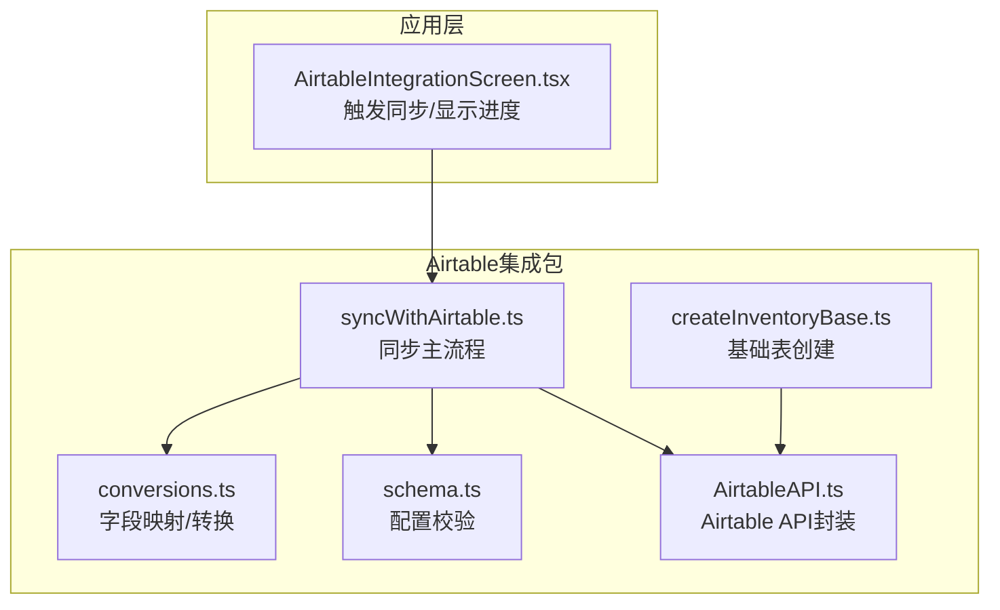
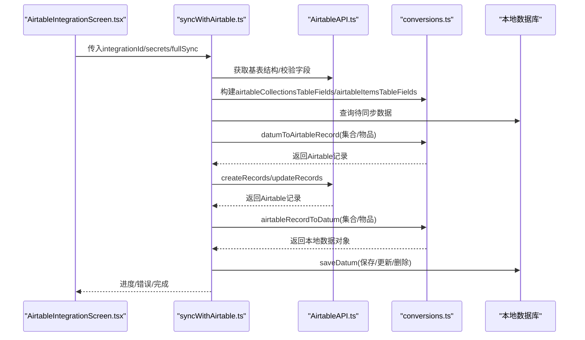
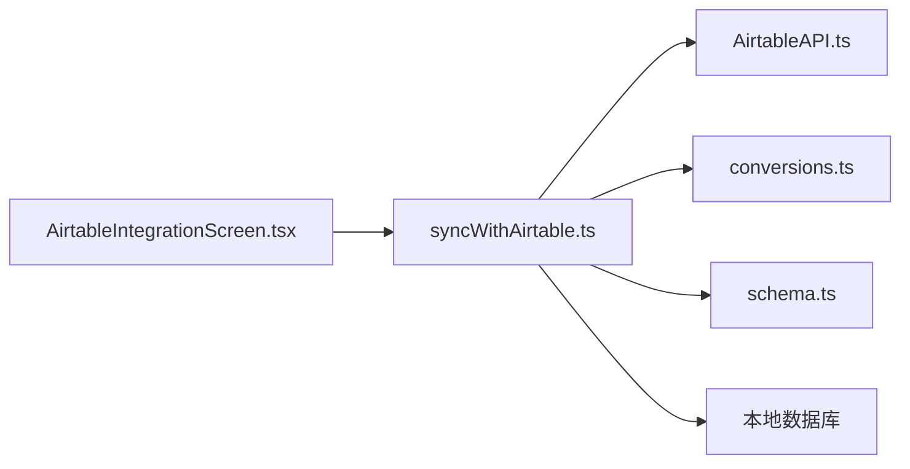

# 数据映射配置

<cite>
**本文引用的文件**
- [packages/integration-airtable/lib/syncWithAirtable.ts](file://packages/integration-airtable/lib/syncWithAirtable.ts)
- [packages/integration-airtable/lib/conversions.ts](file://packages/integration-airtable/lib/conversions.ts)
- [packages/integration-airtable/lib/schema.ts](file://packages/integration-airtable/lib/schema.ts)
- [packages/integration-airtable/lib/AirtableAPI.ts](file://packages/integration-airtable/lib/AirtableAPI.ts)
- [packages/integration-airtable/lib/createInventoryBase.ts](file://packages/integration-airtable/lib/createInventoryBase.ts)
- [packages/integration-airtable/lib/conversions.test.ts](file://packages/integration-airtable/lib/conversions.test.ts)
- [App/app/features/integrations/screens/AirtableIntegrationScreen.tsx](file://App/app/features/integrations/screens/AirtableIntegrationScreen.tsx)
</cite>

## 目录
1. [简介](#简介)
2. [项目结构](#项目结构)
3. [核心组件](#核心组件)
4. [架构总览](#架构总览)
5. [详细组件分析](#详细组件分析)
6. [依赖关系分析](#依赖关系分析)
7. [性能考量](#性能考量)
8. [故障排查指南](#故障排查指南)
9. [结论](#结论)
10. [附录：映射配置与最佳实践](#附录映射配置与最佳实践)

## 简介
本文件面向Airtable数据映射配置，系统性阐述库存系统中“物品”“集合”“检查清单”等实体如何映射到Airtable的表与字段，并详解映射配置对象的结构、字段名称转换规则、数据类型映射与默认值处理策略。同时，文档化映射配置的验证机制与错误处理流程，说明在映射配置无效或同步异常时系统的响应行为；最后提供多种业务场景下的映射配置示例与最佳实践建议，帮助开发者快速落地。

## 项目结构
Airtable集成位于独立包中，核心文件包括：
- 同步主流程：packages/integration-airtable/lib/syncWithAirtable.ts
- 字段映射与转换：packages/integration-airtable/lib/conversions.ts
- 配置校验：packages/integration-airtable/lib/schema.ts
- Airtable API封装：packages/integration-airtable/lib/AirtableAPI.ts
- 基础表创建（含字段）：packages/integration-airtable/lib/createInventoryBase.ts
- 映射行为测试：packages/integration-airtable/lib/conversions.test.ts
- UI层触发与进度反馈：App/app/features/integrations/screens/AirtableIntegrationScreen.tsx

图表来源
- [packages/integration-airtable/lib/syncWithAirtable.ts](file://packages/integration-airtable/lib/syncWithAirtable.ts#L1-L120)
- [packages/integration-airtable/lib/conversions.ts](file://packages/integration-airtable/lib/conversions.ts#L1-L60)
- [packages/integration-airtable/lib/schema.ts](file://packages/integration-airtable/lib/schema.ts#L1-L17)
- [packages/integration-airtable/lib/AirtableAPI.ts](file://packages/integration-airtable/lib/AirtableAPI.ts#L1-L120)
- [packages/integration-airtable/lib/createInventoryBase.ts](file://packages/integration-airtable/lib/createInventoryBase.ts#L1-L60)
- [App/app/features/integrations/screens/AirtableIntegrationScreen.tsx](file://App/app/features/integrations/screens/AirtableIntegrationScreen.tsx#L1-L120)

章节来源
- [packages/integration-airtable/lib/syncWithAirtable.ts](file://packages/integration-airtable/lib/syncWithAirtable.ts#L1-L120)
- [packages/integration-airtable/lib/conversions.ts](file://packages/integration-airtable/lib/conversions.ts#L1-L60)
- [packages/integration-airtable/lib/schema.ts](file://packages/integration-airtable/lib/schema.ts#L1-L17)
- [packages/integration-airtable/lib/AirtableAPI.ts](file://packages/integration-airtable/lib/AirtableAPI.ts#L1-L120)
- [packages/integration-airtable/lib/createInventoryBase.ts](file://packages/integration-airtable/lib/createInventoryBase.ts#L1-L60)
- [App/app/features/integrations/screens/AirtableIntegrationScreen.tsx](file://App/app/features/integrations/screens/AirtableIntegrationScreen.tsx#L1-L120)

## 核心组件
- 同步主流程（syncWithAirtable）
  - 负责拉取Airtable基表结构、校验必需字段、构建本地与Airtable之间的双向映射、执行创建/更新/删除记录、记录进度与错误。
- 字段映射与转换（conversions）
  - 定义collectionToAirtableRecord、itemToAirtableRecord、airtableRecordToCollection、airtableRecordToItem等映射函数，负责字段过滤、类型转换、默认值处理与关联字段解析。
- 配置校验（schema）
  - 使用Zod对integration配置进行结构化校验，确保必要字段存在且类型正确。
- Airtable API封装（AirtableAPI）
  - 提供列表/查询、创建、更新、删除等接口，并内置速率限制与重试逻辑，统一错误类型。
- 基础表创建（createInventoryBase）
  - 自动创建Items/Collections表及关键字段（如ID、Delete、Modified At、Last Synced At、Synchronization Error Message等），便于后续映射使用。
- UI触发与进度（AirtableIntegrationScreen）
  - 从应用侧发起同步，传入数据库访问器、图片下载回调、fetch等，驱动同步流程并展示进度。

章节来源
- [packages/integration-airtable/lib/syncWithAirtable.ts](file://packages/integration-airtable/lib/syncWithAirtable.ts#L100-L260)
- [packages/integration-airtable/lib/conversions.ts](file://packages/integration-airtable/lib/conversions.ts#L1-L120)
- [packages/integration-airtable/lib/schema.ts](file://packages/integration-airtable/lib/schema.ts#L1-L17)
- [packages/integration-airtable/lib/AirtableAPI.ts](file://packages/integration-airtable/lib/AirtableAPI.ts#L1-L120)
- [packages/integration-airtable/lib/createInventoryBase.ts](file://packages/integration-airtable/lib/createInventoryBase.ts#L1-L120)
- [App/app/features/integrations/screens/AirtableIntegrationScreen.tsx](file://App/app/features/integrations/screens/AirtableIntegrationScreen.tsx#L1-L120)

## 架构总览
下图展示了从应用层到Airtable的完整同步路径，以及映射与转换的关键节点。

图表来源
- [packages/integration-airtable/lib/syncWithAirtable.ts](file://packages/integration-airtable/lib/syncWithAirtable.ts#L100-L260)
- [packages/integration-airtable/lib/conversions.ts](file://packages/integration-airtable/lib/conversions.ts#L1-L120)
- [packages/integration-airtable/lib/AirtableAPI.ts](file://packages/integration-airtable/lib/AirtableAPI.ts#L320-L450)
- [App/app/features/integrations/screens/AirtableIntegrationScreen.tsx](file://App/app/features/integrations/screens/AirtableIntegrationScreen.tsx#L200-L280)

## 详细组件分析

### 同步主流程（syncWithAirtable）
- 初始化与配置校验
  - 读取integration配置并通过schema进行校验，确保airtable_base_id、scope_type、可选的collection_ids_to_sync/container_ids_to_sync、images_public_endpoint、disable_uploading_item_images等字段有效。
- 基表结构与字段校验
  - 拉取基表结构，定位Collections/Items表，校验是否存在ID、Modified At等关键字段及其类型是否符合预期。
- 双向映射与批量操作
  - 将本地数据转换为Airtable记录（datumToAirtableRecord），支持分批创建与更新；从Airtable记录反向转换为本地数据（airtableRecordToDatum），并保存至数据库。
  - 对于错误记录，写入“Synchronization Error Message”字段以便后续重试。
- 进度与状态
  - 维护进度对象，包含toPush/toPull/pushed/pulled/pullErrored/status等字段，用于UI反馈。

章节来源
- [packages/integration-airtable/lib/syncWithAirtable.ts](file://packages/integration-airtable/lib/syncWithAirtable.ts#L100-L260)
- [packages/integration-airtable/lib/syncWithAirtable.ts](file://packages/integration-airtable/lib/syncWithAirtable.ts#L260-L520)
- [packages/integration-airtable/lib/syncWithAirtable.ts](file://packages/integration-airtable/lib/syncWithAirtable.ts#L520-L800)
- [packages/integration-airtable/lib/schema.ts](file://packages/integration-airtable/lib/schema.ts#L1-L17)

### 字段映射与转换（conversions）
- 集合映射（collectionToAirtableRecord）
  - 输出字段：Name、ID、Ref. No.，并仅保留Airtable表中存在的字段。
- 物品映射（itemToAirtableRecord）
  - 输出字段：Name、ID、Collection、Container、Type、Can Contain Items、Ref. No.、Serial、Individual Asset Ref.、Manually Set Individual Asset Ref.、Notes、Model Name、PPC、Purchase Price、Purchased From、Purchase Date、Expiry Date、Expire Soon Prior Days、Stock Quantity、Stock Quantity Unit、Min Stock Level、Will Not Restock、Icon Name、Icon Color、Images、Use First Image as Icon、RFID EPC Hex、Manually Set RFID EPC Hex、Updated At、Created At、Remove All Images。
  - 关联字段：通过回调函数将本地collection_id/item_id解析为Airtable记录ID，用于多记录链接字段。
  - 图片上传：若启用images_public_endpoint，则先校验图片URL可达性，再以数组形式写入Images字段。
- 反向映射（airtableRecordToCollection/airtableRecordToItem）
  - 从Airtable记录读取各字段，填充本地数据对象；对Delete字段标记删除；对Modified At进行时间戳转换并写回本地集成元数据。
  - 物品映射中对Type字段进行大小写与空格替换，再转为下划线命名；对Collection/Container字段通过缓存或查询解析为本地ID。

章节来源
- [packages/integration-airtable/lib/conversions.ts](file://packages/integration-airtable/lib/conversions.ts#L1-L120)
- [packages/integration-airtable/lib/conversions.ts](file://packages/integration-airtable/lib/conversions.ts#L120-L227)
- [packages/integration-airtable/lib/conversions.ts](file://packages/integration-airtable/lib/conversions.ts#L229-L360)
- [packages/integration-airtable/lib/conversions.ts](file://packages/integration-airtable/lib/conversions.ts#L360-L555)

### 配置校验（schema）
- 必填项与可选项
  - airtable_base_id：字符串，非空。
  - scope_type：枚举，collections或containers。
  - collection_ids_to_sync/container_ids_to_sync：可选数组，字符串ID列表。
  - images_public_endpoint：可选字符串，用于图片URL校验与上传。
  - disable_uploading_item_images：可选布尔值，控制是否上传图片。
- 校验方式
  - 使用Zod对integration.config进行parse，catchall允许额外字段存在但不参与校验。

章节来源
- [packages/integration-airtable/lib/schema.ts](file://packages/integration-airtable/lib/schema.ts#L1-L17)

### Airtable API封装（AirtableAPI）
- 接口能力
  - 列出基表、获取基表结构、创建字段、列出记录、获取单条记录、创建记录、更新记录、删除记录。
- 错误处理
  - 统一抛出AirtableAPIError，包含type/message/details，便于上层捕获与分类处理。
- 速率限制与重试
  - 内置节流与指数退避重试，避免触发Airtable限流。

章节来源
- [packages/integration-airtable/lib/AirtableAPI.ts](file://packages/integration-airtable/lib/AirtableAPI.ts#L1-L120)
- [packages/integration-airtable/lib/AirtableAPI.ts](file://packages/integration-airtable/lib/AirtableAPI.ts#L120-L260)
- [packages/integration-airtable/lib/AirtableAPI.ts](file://packages/integration-airtable/lib/AirtableAPI.ts#L260-L450)

### 基础表创建（createInventoryBase）
- 自动生成Items/Collections表及关键字段
  - Collections：Name、ID、Ref. Number。
  - Items：Name、ID、Collection（多记录链接）、Delete（复选框）、Last Synced At（日期时间）、Synchronization Error Message（单行文本）。
- 用途
  - 为映射提供标准字段名与类型，确保映射函数能稳定工作。

章节来源
- [packages/integration-airtable/lib/createInventoryBase.ts](file://packages/integration-airtable/lib/createInventoryBase.ts#L1-L165)

### UI触发与进度（AirtableIntegrationScreen）
- 触发同步
  - 从应用侧读取integration配置，调用syncWithAirtable并传入数据库访问器、图片下载回调、fetch等。
- 进度与错误
  - 通过回调实时更新进度对象，展示已创建/更新/删除数量、错误计数与错误详情。

章节来源
- [App/app/features/integrations/screens/AirtableIntegrationScreen.tsx](file://App/app/features/integrations/screens/AirtableIntegrationScreen.tsx#L1-L120)
- [App/app/features/integrations/screens/AirtableIntegrationScreen.tsx](file://App/app/features/integrations/screens/AirtableIntegrationScreen.tsx#L200-L280)

## 依赖关系分析
- 同步主流程依赖
  - AirtableAPI：网络请求与错误处理。
  - conversions：字段映射与类型转换。
  - schema：配置校验。
  - 本地数据库：读取/保存数据。
- 映射函数依赖
  - 通过回调函数解析集合/物品的Airtable记录ID，依赖数据库查询与附件信息。
- UI层依赖
  - 通过导航与敏感信息存储获取密钥，调用同步流程并展示进度。

图表来源
- [packages/integration-airtable/lib/syncWithAirtable.ts](file://packages/integration-airtable/lib/syncWithAirtable.ts#L100-L260)
- [packages/integration-airtable/lib/conversions.ts](file://packages/integration-airtable/lib/conversions.ts#L1-L120)
- [packages/integration-airtable/lib/schema.ts](file://packages/integration-airtable/lib/schema.ts#L1-L17)
- [packages/integration-airtable/lib/AirtableAPI.ts](file://packages/integration-airtable/lib/AirtableAPI.ts#L1-L120)
- [App/app/features/integrations/screens/AirtableIntegrationScreen.tsx](file://App/app/features/integrations/screens/AirtableIntegrationScreen.tsx#L1-L120)

## 性能考量
- 批量操作
  - 同步主流程按批次（每批10条）创建/更新/删除记录，减少API调用次数与网络开销。
- 速率限制
  - AirtableAPI内置节流与重试，避免频繁请求导致限流。
- 图片校验
  - 在上传前对图片URL进行HEAD请求校验，失败则抛错，避免无效图片占用带宽与存储。
- 字段过滤
  - 仅输出Airtable表中存在的字段，避免无效字段导致的API错误与性能浪费。

章节来源
- [packages/integration-airtable/lib/syncWithAirtable.ts](file://packages/integration-airtable/lib/syncWithAirtable.ts#L470-L520)
- [packages/integration-airtable/lib/AirtableAPI.ts](file://packages/integration-airtable/lib/AirtableAPI.ts#L180-L260)
- [packages/integration-airtable/lib/conversions.ts](file://packages/integration-airtable/lib/conversions.ts#L110-L160)

## 故障排查指南
- 配置无效
  - 若integration.config不符合schema定义，将抛出错误。请检查airtable_base_id、scope_type、可选字段是否正确填写。
- 表结构缺失
  - 同步初始化阶段会校验Collections/Items表是否存在ID与Modified At字段，类型是否匹配。若缺失或类型不符，将抛出明确错误提示。
- 记录错误回写
  - 当本地保存失败时，会在Airtable记录中写入“Synchronization Error Message”，随后再次尝试拉取并重试更新。
- API错误
  - AirtableAPIError包含type与message，上层应根据type区分处理（如NOT_FOUND、INVALID_PERMISSIONS_OR_MODEL_NOT_FOUND等）。
- 图片URL不可达
  - HEAD请求返回非200或抛错时会中断同步并给出具体URL与原因。

章节来源
- [packages/integration-airtable/lib/schema.ts](file://packages/integration-airtable/lib/schema.ts#L1-L17)
- [packages/integration-airtable/lib/syncWithAirtable.ts](file://packages/integration-airtable/lib/syncWithAirtable.ts#L190-L260)
- [packages/integration-airtable/lib/syncWithAirtable.ts](file://packages/integration-airtable/lib/syncWithAirtable.ts#L520-L760)
- [packages/integration-airtable/lib/AirtableAPI.ts](file://packages/integration-airtable/lib/AirtableAPI.ts#L70-L120)
- [packages/integration-airtable/lib/conversions.ts](file://packages/integration-airtable/lib/conversions.ts#L110-L160)

## 结论
该Airtable集成通过严格的配置校验、完善的表结构校验与稳健的映射转换，实现了库存系统与Airtable之间的可靠同步。映射函数覆盖了集合与物品的核心字段，并对图片、日期、数值、选择与链接等类型进行了适配。同步主流程提供了进度与错误追踪，AirtableAPI封装了网络与错误处理细节。遵循本文档的最佳实践，可在不同业务场景下快速落地并稳定运行。

## 附录：映射配置与最佳实践

### fieldMappings配置对象结构与用法
- 结构要点
  - airtableCollectionsTableFields：集合表字段字典，键为Airtable字段名，值为字段元数据（类型、选项等）。
  - airtableItemsTableFields：物品表字段字典，键为Airtable字段名，值为字段元数据。
  - 其他可选参数：如getAirtableRecordIdFromCollectionId、getAirtableRecordIdFromItemId、imagesPublicEndpoint、fetch等，用于映射函数内部解析与图片校验。
- 用法说明
  - 在调用datumToAirtableRecord/airtableRecordToDatum时传入上述字典与回调，确保字段过滤与类型转换生效。
  - 仅输出Airtable表中存在的字段，避免无效字段导致API错误。

章节来源
- [packages/integration-airtable/lib/syncWithAirtable.ts](file://packages/integration-airtable/lib/syncWithAirtable.ts#L230-L260)
- [packages/integration-airtable/lib/conversions.ts](file://packages/integration-airtable/lib/conversions.ts#L1-L120)

### 字段名称转换规则
- 集合
  - Name、ID、Ref. No. 一一对应。
- 物品
  - Name、ID、Collection、Container、Type、Can Contain Items、Ref. No.、Serial、Individual Asset Ref.、Manually Set Individual Asset Ref.、Notes、Model Name、PPC、Purchase Price、Purchased From、Purchase Date、Expiry Date、Expire Soon Prior Days、Stock Quantity、Stock Quantity Unit、Min Stock Level、Will Not Restock、Icon Name、Icon Color、Images、Use First Image as Icon、RFID EPC Hex、Manually Set RFID EPC Hex、Updated At、Created At、Remove All Images。
- 类型转换
  - 日期：统一转换为ISO字符串。
  - 数值：如purchase_price_x1000与单价的换算。
  - 选择/单选：Type字段进行标题化与空格替换后转为下划线命名。
  - 复选框：Delete字段直接映射布尔值。
  - 多记录链接：Collection/Container通过回调解析为Airtable记录ID数组。

章节来源
- [packages/integration-airtable/lib/conversions.ts](file://packages/integration-airtable/lib/conversions.ts#L120-L227)
- [packages/integration-airtable/lib/conversions.ts](file://packages/integration-airtable/lib/conversions.ts#L229-L555)

### 数据类型映射与默认值处理
- 类型映射
  - 字符串：Name、Notes、Model Name、Ref. No.、Individual Asset Ref.、Icon Name、Icon Color、PPC等。
  - 数值：Serial、Stock Quantity、Min Stock Level、Expire Soon Prior Days、Purchase Price等。
  - 日期：Purchase Date、Expiry Date、Updated At、Created At。
  - 布尔：Can Contain Items、Will Not Restock、Use First Image as Icon、Delete等。
  - 多记录链接：Collection、Container。
  - 附件：Images（数组，包含url与filename）。
- 默认值处理
  - 对于可空字段，未提供值时写入null或空字符串；对于库存类字段，未提供值时根据类型与业务语义设置默认值（如库存最小值默认null，耗材类型未设置时Stock Quantity默认1）。
  - Remove All Images默认false，用于清空图片。

章节来源
- [packages/integration-airtable/lib/conversions.ts](file://packages/integration-airtable/lib/conversions.ts#L120-L227)
- [packages/integration-airtable/lib/conversions.ts](file://packages/integration-airtable/lib/conversions.ts#L460-L520)

### 自定义映射函数实现示例
- 场景一：新增自定义字段
  - 在调用datumToAirtableRecord时，将自定义字段加入fields对象，并确保其存在于airtableItemsTableFields中，否则会被过滤掉。
  - 参考路径：[packages/integration-airtable/lib/conversions.ts](file://packages/integration-airtable/lib/conversions.ts#L120-L227)
- 场景二：复杂类型转换
  - 如需将本地枚举映射为Airtable单选/多选，应在映射函数中进行转换，并保证Airtable字段类型与choices匹配。
  - 参考路径：[packages/integration-airtable/lib/conversions.ts](file://packages/integration-airtable/lib/conversions.ts#L360-L420)
- 场景三：图片上传策略
  - 若启用images_public_endpoint，映射函数会校验图片URL可达性；若不可达，将抛错并中断同步，便于及时修复。
  - 参考路径：[packages/integration-airtable/lib/conversions.ts](file://packages/integration-airtable/lib/conversions.ts#L110-L160)

章节来源
- [packages/integration-airtable/lib/conversions.ts](file://packages/integration-airtable/lib/conversions.ts#L110-L227)

### 映射配置验证机制与错误处理
- 配置验证
  - 使用schema.config.parse对integration.config进行校验，不符合要求将抛错。
  - 参考路径：[packages/integration-airtable/lib/schema.ts](file://packages/integration-airtable/lib/schema.ts#L1-L17)
- 表结构验证
  - 初始化阶段校验ID与Modified At字段存在性与类型，缺失或类型不符将抛错。
  - 参考路径：[packages/integration-airtable/lib/syncWithAirtable.ts](file://packages/integration-airtable/lib/syncWithAirtable.ts#L190-L260)
- 错误处理
  - 本地保存失败时写入“Synchronization Error Message”，随后重试；AirtableAPIError按type分类处理。
  - 参考路径：[packages/integration-airtable/lib/syncWithAirtable.ts](file://packages/integration-airtable/lib/syncWithAirtable.ts#L520-L760)
  - [packages/integration-airtable/lib/AirtableAPI.ts](file://packages/integration-airtable/lib/AirtableAPI.ts#L70-L120)

### 实际映射配置示例与最佳实践
- 示例一：基础集合映射
  - Airtable集合表包含Name、ID、Ref. No.字段；映射时仅输出存在的字段，避免无效字段。
  - 参考路径：[packages/integration-airtable/lib/conversions.ts](file://packages/integration-airtable/lib/conversions.ts#L1-L60)
  - 测试用例参考：[packages/integration-airtable/lib/conversions.test.ts](file://packages/integration-airtable/lib/conversions.test.ts#L1-L120)
- 示例二：物品映射（含图片与链接）
  - 启用images_public_endpoint后，映射函数会校验图片URL并写入Images字段；Collection/Container通过回调解析为Airtable记录ID。
  - 参考路径：[packages/integration-airtable/lib/conversions.ts](file://packages/integration-airtable/lib/conversions.ts#L120-L227)
  - 测试用例参考：[packages/integration-airtable/lib/conversions.test.ts](file://packages/integration-airtable/lib/conversions.test.ts#L120-L283)
- 最佳实践
  - 在Airtable中保持ID与Modified At字段不变，确保映射稳定。
  - 对于耗材类物品，若未设置Stock Quantity，按业务需求设置默认值（如1）。
  - 对外链图片，确保images_public_endpoint可达且URL格式正确。
  - 使用fullSync首次同步时，先拉取所有Airtable记录ID，避免重复创建。

章节来源
- [packages/integration-airtable/lib/conversions.ts](file://packages/integration-airtable/lib/conversions.ts#L1-L227)
- [packages/integration-airtable/lib/conversions.test.ts](file://packages/integration-airtable/lib/conversions.test.ts#L1-L283)
- [packages/integration-airtable/lib/syncWithAirtable.ts](file://packages/integration-airtable/lib/syncWithAirtable.ts#L300-L420)