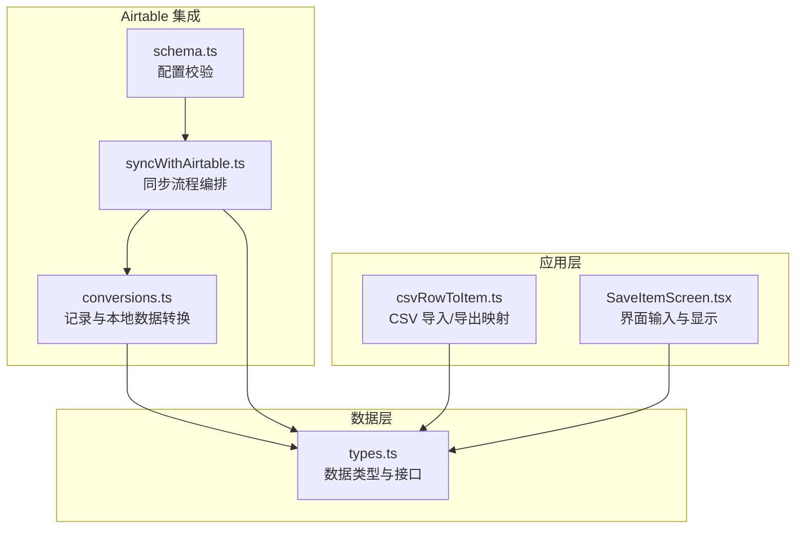
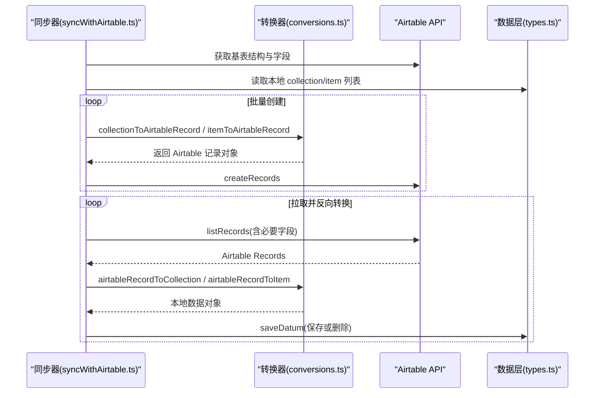
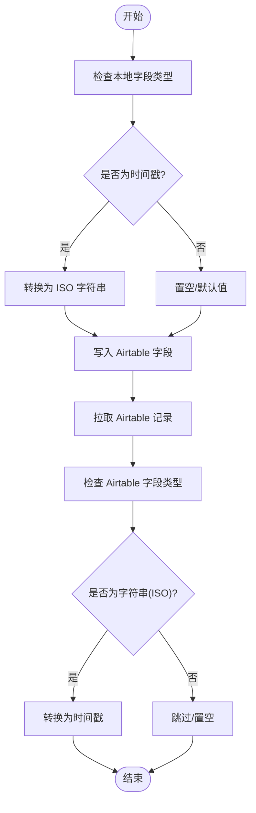
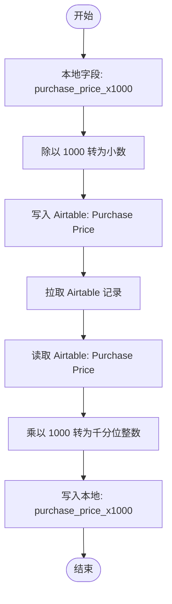
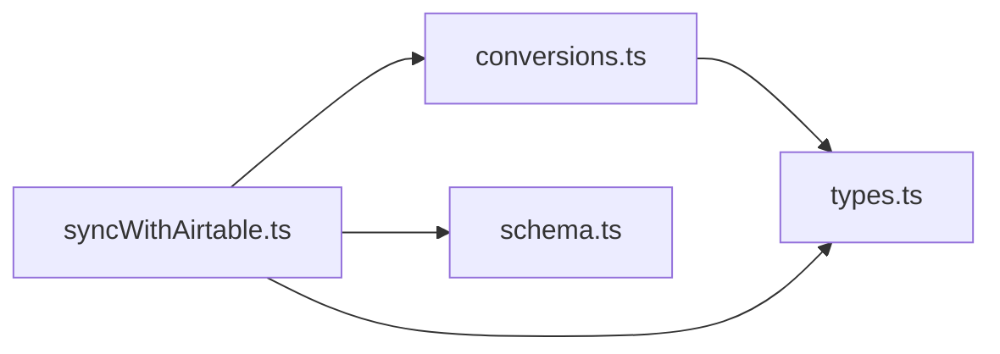

# 数据类型转换

<cite>
**本文引用的文件**
- [conversions.ts](file://packages/integration-airtable/lib/conversions.ts)
- [conversions.test.ts](file://packages/integration-airtable/lib/conversions.test.ts)
- [syncWithAirtable.ts](file://packages/integration-airtable/lib/syncWithAirtable.ts)
- [schema.ts](file://packages/integration-airtable/lib/schema.ts)
- [types.ts](file://Data/lib/types.ts)
- [csvRowToItem.ts](file://Data/lib/utils/csv/csvRowToItem.ts)
- [SaveItemScreen.tsx](file://App/app/features/inventory/screens/SaveItemScreen.tsx)
</cite>

## 目录
1. [简介](#简介)
2. [项目结构](#项目结构)
3. [核心组件](#核心组件)
4. [架构总览](#架构总览)
5. [详细组件分析](#详细组件分析)
6. [依赖关系分析](#依赖关系分析)
7. [性能考量](#性能考量)
8. [故障排查指南](#故障排查指南)
9. [结论](#结论)
10. [附录](#附录)

## 简介
本文件系统性梳理 Airtable 集成中的数据类型转换逻辑，聚焦于 conversions.ts 中定义的转换函数，涵盖：
- 日期格式转换（时间戳与 ISO 字符串互转）
- 货币单位与价格精度转换（千分位整数到小数）
- 布尔值映射（Airtable 复选框与本地布尔字段）
- 枚举类型处理（物品类型、选择字段）
- 自定义字段类型的转换逻辑（图片上传、链接字段等）
- 如何扩展转换函数以支持新数据类型
- 类型转换错误的调试方法与常见问题解决方案

## 项目结构
该功能位于集成包 integration-airtable 的 lib 目录下，核心文件包括：
- conversions.ts：定义 collection/item 与 Airtable 记录之间的双向转换
- syncWithAirtable.ts：同步流程编排，调用转换函数并处理错误
- schema.ts：集成配置校验（包含图片公开端点、是否禁用上传等）
- types.ts：数据层类型定义（用于理解输入输出结构）

图表来源
- [conversions.ts](file://packages/integration-airtable/lib/conversions.ts#L1-L564)
- [syncWithAirtable.ts](file://packages/integration-airtable/lib/syncWithAirtable.ts#L1-L800)
- [schema.ts](file://packages/integration-airtable/lib/schema.ts#L1-L17)
- [types.ts](file://Data/lib/types.ts#L1-L212)
- [csvRowToItem.ts](file://Data/lib/utils/csv/csvRowToItem.ts#L85-L127)
- [SaveItemScreen.tsx](file://App/app/features/inventory/screens/SaveItemScreen.tsx#L1184-L1287)

章节来源
- [conversions.ts](file://packages/integration-airtable/lib/conversions.ts#L1-L564)
- [syncWithAirtable.ts](file://packages/integration-airtable/lib/syncWithAirtable.ts#L1-L800)
- [schema.ts](file://packages/integration-airtable/lib/schema.ts#L1-L17)
- [types.ts](file://Data/lib/types.ts#L1-L212)

## 核心组件
- collectionToAirtableRecord：将本地 collection 转换为 Airtable Collections 表记录
- itemToAirtableRecord：将本地 item 转换为 Airtable Items 表记录，并处理图片上传与校验
- airtableRecordToCollection：将 Airtable Collections 记录转换为本地 collection
- airtableRecordToItem：将 Airtable Items 记录转换为本地 item，并处理枚举、链接、日期、布尔、数值等字段

章节来源
- [conversions.ts](file://packages/integration-airtable/lib/conversions.ts#L13-L227)
- [conversions.ts](file://packages/integration-airtable/lib/conversions.ts#L229-L555)

## 架构总览
同步流程通过 syncWithAirtable.ts 组织，按表名获取 Airtable 基础结构，解析字段类型，随后对本地数据进行转换并批量创建/更新，再从 Airtable 拉取记录并反向转换回本地数据。

图表来源
- [syncWithAirtable.ts](file://packages/integration-airtable/lib/syncWithAirtable.ts#L190-L246)
- [syncWithAirtable.ts](file://packages/integration-airtable/lib/syncWithAirtable.ts#L448-L518)
- [syncWithAirtable.ts](file://packages/integration-airtable/lib/syncWithAirtable.ts#L522-L778)
- [conversions.ts](file://packages/integration-airtable/lib/conversions.ts#L13-L227)
- [conversions.ts](file://packages/integration-airtable/lib/conversions.ts#L229-L555)

## 详细组件分析

### 日期格式转换
- 写入 Airtable（本地 -> Airtable）：将时间戳转换为 ISO 字符串（UTC），用于日期/时间字段
  - 示例路径：[purchase_date/expiry_date 转换](file://packages/integration-airtable/lib/conversions.ts#L172-L179)
  - 示例路径：[updated_at/created_at 转换](file://packages/integration-airtable/lib/conversions.ts#L202-L207)
- 从 Airtable 读取（Airtable -> 本地）：将 ISO 字符串转换为时间戳
  - 示例路径：[purchase_date/expiry_date 反向转换](file://packages/integration-airtable/lib/conversions.ts#L448-L462)
  - 示例路径：[updated_at/created_at 反向转换](file://packages/integration-airtable/lib/conversions.ts#L546-L552)

图表来源
- [conversions.ts](file://packages/integration-airtable/lib/conversions.ts#L172-L179)
- [conversions.ts](file://packages/integration-airtable/lib/conversions.ts#L202-L207)
- [conversions.ts](file://packages/integration-airtable/lib/conversions.ts#L448-L462)
- [conversions.ts](file://packages/integration-airtable/lib/conversions.ts#L546-L552)

章节来源
- [conversions.ts](file://packages/integration-airtable/lib/conversions.ts#L172-L179)
- [conversions.ts](file://packages/integration-airtable/lib/conversions.ts#L202-L207)
- [conversions.ts](file://packages/integration-airtable/lib/conversions.ts#L448-L462)
- [conversions.ts](file://packages/integration-airtable/lib/conversions.ts#L546-L552)

### 货币单位与价格转换
- 写入 Airtable（本地 -> Airtable）：将“千分位整数”字段除以 1000 转为小数显示
  - 示例路径：[purchase_price_x1000 -> Purchase Price](file://packages/integration-airtable/lib/conversions.ts#L168-L170)
- 从 Airtable 读取（Airtable -> 本地）：将小数乘以 1000 转为“千分位整数”
  - 示例路径：[Purchase Price -> purchase_price_x1000](file://packages/integration-airtable/lib/conversions.ts#L437-L441)
- 货币单位：直接映射字符串字段
  - 示例路径：[purchase_price_currency 映射](file://packages/integration-airtable/lib/conversions.ts#L166-L170)

图表来源
- [conversions.ts](file://packages/integration-airtable/lib/conversions.ts#L166-L170)
- [conversions.ts](file://packages/integration-airtable/lib/conversions.ts#L437-L441)

章节来源
- [conversions.ts](file://packages/integration-airtable/lib/conversions.ts#L166-L170)
- [conversions.ts](file://packages/integration-airtable/lib/conversions.ts#L437-L441)

### 布尔值映射
- Airtable 复选框（checkbox）与本地布尔字段一一对应
  - 示例路径：[Can Contain Items](file://packages/integration-airtable/lib/conversions.ts#L158-L159)
  - 示例路径：[Use First Image as Icon](file://packages/integration-airtable/lib/conversions.ts#L198-L200)
  - 示例路径：[Will Not Restock](file://packages/integration-airtable/lib/conversions.ts#L190-L191)
  - 示例路径：[Manually Set Individual Asset Ref.](file://packages/integration-airtable/lib/conversions.ts#L162-L164)
  - 示例路径：[Manually Set RFID EPC Hex](file://packages/integration-airtable/lib/conversions.ts#L200-L202)
  - 示例路径：[Delete 标记](file://packages/integration-airtable/lib/conversions.ts#L259-L261)
  - 示例路径：[Delete 标记（反向）](file://packages/integration-airtable/lib/conversions.ts#L331-L333)

章节来源
- [conversions.ts](file://packages/integration-airtable/lib/conversions.ts#L158-L159)
- [conversions.ts](file://packages/integration-airtable/lib/conversions.ts#L190-L202)
- [conversions.ts](file://packages/integration-airtable/lib/conversions.ts#L259-L261)
- [conversions.ts](file://packages/integration-airtable/lib/conversions.ts#L331-L333)

### 枚举类型处理
- 物品类型（item_type）：Airtable 中为单选（singleSelect），本地使用字符串标识；转换时将标题格式化为下划线命名
  - 示例路径：[Type -> item_type](file://packages/integration-airtable/lib/conversions.ts#L154-L157)
  - 示例路径：[item_type -> Type](file://packages/integration-airtable/lib/conversions.ts#L362-L374)
- 选择字段（如 PPC）：Airtable 选择字段映射为本地字符串
  - 示例路径：[PPC 映射](file://packages/integration-airtable/lib/conversions.ts#L166-L167)

章节来源
- [conversions.ts](file://packages/integration-airtable/lib/conversions.ts#L154-L157)
- [conversions.ts](file://packages/integration-airtable/lib/conversions.ts#L362-L374)
- [conversions.ts](file://packages/integration-airtable/lib/conversions.ts#L166-L167)

### 自定义字段类型转换
- 图片字段（Images）：当启用图片上传时，先获取图片附件信息，生成 URL 与文件名，再逐个 HEAD 校验可达性
  - 示例路径：[图片列表构建与校验](file://packages/integration-airtable/lib/conversions.ts#L86-L147)
- 关联字段（Collection/Container）：通过 recordId 与本地数据映射，支持缓存与回查
  - 示例路径：[Collection 关联](file://packages/integration-airtable/lib/conversions.ts#L152-L153)
  - 示例路径：[Container 关联](file://packages/integration-airtable/lib/conversions.ts#L154-L155)
  - 示例路径：[反向关联（Collection/Container）](file://packages/integration-airtable/lib/conversions.ts#L340-L360)
  - 示例路径：[容器集合继承](file://packages/integration-airtable/lib/conversions.ts#L525-L532)
- 删除标记（Delete）：通过复选框控制本地删除标志
  - 示例路径：[Delete 标记写入](file://packages/integration-airtable/lib/conversions.ts#L259-L261)
  - 示例路径：[Delete 标记读取](file://packages/integration-airtable/lib/conversions.ts#L331-L333)

章节来源
- [conversions.ts](file://packages/integration-airtable/lib/conversions.ts#L86-L147)
- [conversions.ts](file://packages/integration-airtable/lib/conversions.ts#L152-L155)
- [conversions.ts](file://packages/integration-airtable/lib/conversions.ts#L340-L360)
- [conversions.ts](file://packages/integration-airtable/lib/conversions.ts#L525-L532)
- [conversions.ts](file://packages/integration-airtable/lib/conversions.ts#L259-L261)
- [conversions.ts](file://packages/integration-airtable/lib/conversions.ts#L331-L333)

### 扩展转换函数的方法
- 新增字段映射：在对应的转换函数中添加字段分支，遵循“已知字段白名单”策略
  - 示例路径：[Collections 字段过滤](file://packages/integration-airtable/lib/conversions.ts#L29-L41)
  - 示例路径：[Items 字段过滤](file://packages/integration-airtable/lib/conversions.ts#L212-L226)
- 新增数据类型：新增一对转换函数（本地 -> Airtable 与 Airtable -> 本地），并在同步流程中注册
  - 示例路径：[同步流程中注册转换函数](file://packages/integration-airtable/lib/syncWithAirtable.ts#L376-L406)
- 错误处理：在转换过程中捕获异常并补充上下文信息（如记录 ID、字段名）
  - 示例路径：[图片 URL 校验错误增强](file://packages/integration-airtable/lib/conversions.ts#L133-L146)

章节来源
- [conversions.ts](file://packages/integration-airtable/lib/conversions.ts#L29-L41)
- [conversions.ts](file://packages/integration-airtable/lib/conversions.ts#L212-L226)
- [syncWithAirtable.ts](file://packages/integration-airtable/lib/syncWithAirtable.ts#L376-L406)
- [conversions.ts](file://packages/integration-airtable/lib/conversions.ts#L133-L146)

## 依赖关系分析
- 转换函数依赖数据层类型（DataMeta、DataTypeWithID、GetData、GetAttachmentInfoFromDatum 等）
- 同步流程依赖转换函数与 Airtable API，负责批量创建、更新、删除与重试
- 配置校验确保图片公开端点、禁用上传开关等参数合法

图表来源
- [conversions.ts](file://packages/integration-airtable/lib/conversions.ts#L1-L564)
- [syncWithAirtable.ts](file://packages/integration-airtable/lib/syncWithAirtable.ts#L1-L800)
- [schema.ts](file://packages/integration-airtable/lib/schema.ts#L1-L17)
- [types.ts](file://Data/lib/types.ts#L1-L212)

章节来源
- [conversions.ts](file://packages/integration-airtable/lib/conversions.ts#L1-L564)
- [syncWithAirtable.ts](file://packages/integration-airtable/lib/syncWithAirtable.ts#L1-L800)
- [schema.ts](file://packages/integration-airtable/lib/schema.ts#L1-L17)
- [types.ts](file://Data/lib/types.ts#L1-L212)

## 性能考量
- 图片上传前的 HEAD 校验会增加网络请求次数，建议：
  - 在批量创建/更新时合并请求，避免重复校验
  - 对未上传完成的图片进行重试与延迟退避
- 关联字段使用 Map 缓存 recordId -> DataMeta，减少重复查询
- 同步流程中对本地数据进行去重与增量判断，降低无效操作

[本节为通用建议，不直接分析具体文件]

## 故障排查指南
- 图片无法上传/显示
  - 现象：Airtable 忽略不可访问的图片 URL
  - 排查：确认图片公开端点可用，URL HEAD 请求返回 200；若 404，等待上传完成后再重试
  - 参考路径：[图片 URL 校验与重试](file://packages/integration-airtable/lib/conversions.ts#L120-L147)
- 日期字段异常
  - 现象：Airtable 与本地时间不一致
  - 排查：确认转换为 ISO 字符串且时区设置；反向转换时确保字符串可解析为时间戳
  - 参考路径：[日期转换](file://packages/integration-airtable/lib/conversions.ts#L172-L179)
  - 参考路径：[日期反向转换](file://packages/integration-airtable/lib/conversions.ts#L448-L462)
- 价格/货币不一致
  - 现象：Airtable 小数与本地整数不匹配
  - 排查：确认 purchase_price_x1000 与 Purchase Price 的乘除关系；货币单位需一致
  - 参考路径：[价格转换](file://packages/integration-airtable/lib/conversions.ts#L168-L170)
  - 参考路径：[价格反向转换](file://packages/integration-airtable/lib/conversions.ts#L437-L441)
- 枚举字段为空或无效
  - 现象：Type 字段映射后为 undefined 或非法值
  - 排查：确认 Airtable 单选选项与本地命名一致；注意标题格式化规则
  - 参考路径：[Type 映射](file://packages/integration-airtable/lib/conversions.ts#L154-L157)
  - 参考路径：[item_type 反向映射](file://packages/integration-airtable/lib/conversions.ts#L362-L374)
- 删除未生效
  - 现象：Airtable 勾选 Delete 后本地未删除
  - 排查：确认同步流程中 Delete 字段被正确读取并设置本地 __deleted
  - 参考路径：[Delete 标记读取](file://packages/integration-airtable/lib/conversions.ts#L331-L333)
- 同步错误消息
  - 现象：Airtable 中出现“Synchronization Error Message”字段
  - 排查：同步器在保存失败时写入错误信息；可在 UI 中查看并重试
  - 参考路径：[错误消息写入](file://packages/integration-airtable/lib/syncWithAirtable.ts#L656-L674)

章节来源
- [conversions.ts](file://packages/integration-airtable/lib/conversions.ts#L120-L147)
- [conversions.ts](file://packages/integration-airtable/lib/conversions.ts#L172-L179)
- [conversions.ts](file://packages/integration-airtable/lib/conversions.ts#L448-L462)
- [conversions.ts](file://packages/integration-airtable/lib/conversions.ts#L168-L170)
- [conversions.ts](file://packages/integration-airtable/lib/conversions.ts#L437-L441)
- [conversions.ts](file://packages/integration-airtable/lib/conversions.ts#L154-L157)
- [conversions.ts](file://packages/integration-airtable/lib/conversions.ts#L362-L374)
- [conversions.ts](file://packages/integration-airtable/lib/conversions.ts#L331-L333)
- [syncWithAirtable.ts](file://packages/integration-airtable/lib/syncWithAirtable.ts#L656-L674)

## 结论
conversions.ts 提供了完善的 Airtable 与本地数据双向转换能力，覆盖日期、货币、布尔、枚举与自定义字段。通过“已知字段白名单”与严格的类型检查，保证了转换的稳定性。扩展新字段或新类型时，应遵循现有模式：明确字段映射、处理边界值、完善错误上下文，并在同步流程中进行单元测试验证。

[本节为总结，不直接分析具体文件]

## 附录

### 字段映射速查
- Collections 表
  - Name -> name
  - ID -> __id
  - Ref. No. -> collection_reference_number
  - Delete -> __deleted
  - Modified At -> integrations[integrationId].modified_at
- Items 表
  - Name -> name
  - ID -> __id
  - Collection -> collection_id（多记录链接）
  - Container -> container_id（多记录链接）
  - Type -> item_type（单选）
  - Can Contain Items -> _can_contain_items（布尔）
  - Ref. No. -> item_reference_number
  - Serial -> serial
  - Individual Asset Ref. -> individual_asset_reference
  - Manually Set Individual Asset Ref. -> individual_asset_reference_manually_set
  - Notes -> notes
  - Model Name -> model_name
  - PPC -> purchase_price_currency
  - Purchase Price -> purchase_price_x1000（小数 -> 千分位整数）
  - Purchased From -> purchased_from
  - Purchase Date -> purchase_date（时间戳 <-> ISO）
  - Expiry Date -> expiry_date（时间戳 <-> ISO）
  - Expire Soon Prior Days -> expire_soon_prior_days
  - Stock Quantity -> consumable_stock_quantity
  - Stock Quantity Unit -> consumable_stock_quantity_unit
  - Min Stock Level -> consumable_min_stock_level
  - Will Not Restock -> consumable_will_not_restock（布尔）
  - Icon Name -> icon_name
  - Icon Color -> icon_color
  - Images -> 图片数组（URL + 文件名）
  - Use First Image as Icon -> use_first_image_as_icon（布尔）
  - RFID EPC Hex -> rfid_tag_epc_memory_bank_contents
  - Manually Set RFID EPC Hex -> rfid_tag_epc_memory_bank_contents_manually_set（布尔）
  - Updated At -> __updated_at（时间戳 <-> ISO）
  - Created At -> __created_at（时间戳 <-> ISO）
  - Remove All Images -> false（用于清空图片）
  - Delete -> __deleted（布尔）

章节来源
- [conversions.ts](file://packages/integration-airtable/lib/conversions.ts#L13-L227)
- [conversions.ts](file://packages/integration-airtable/lib/conversions.ts#L229-L555)