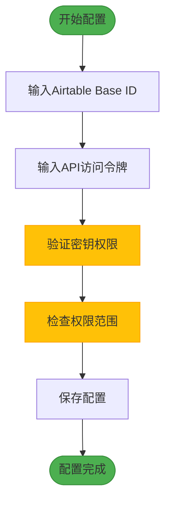
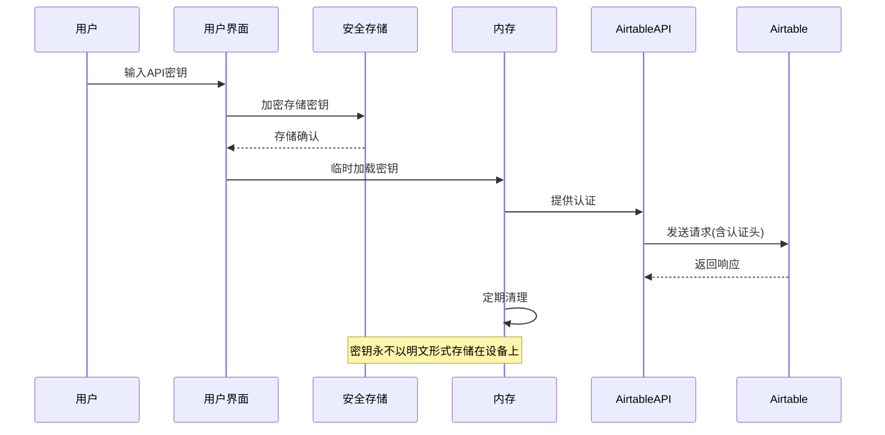
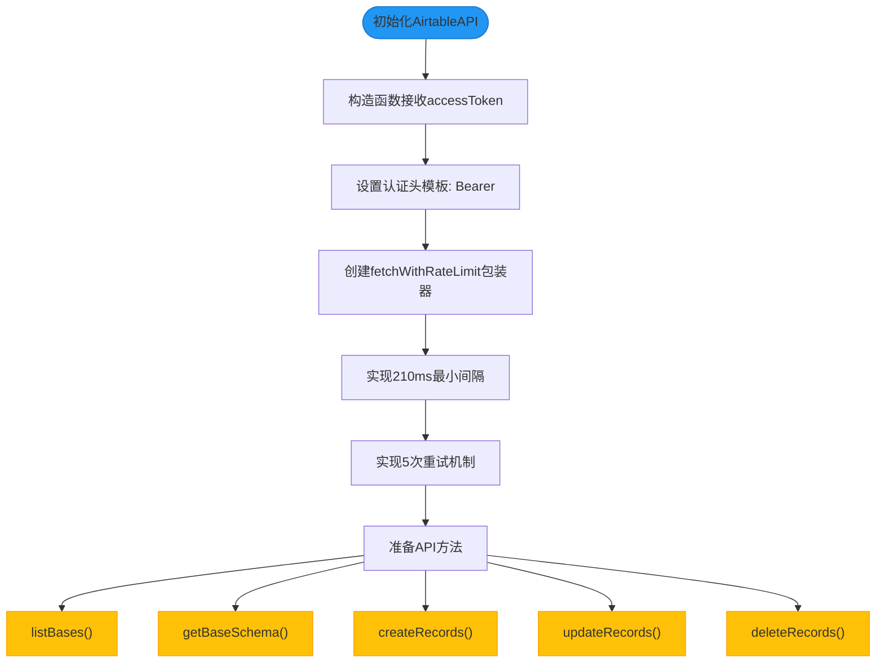
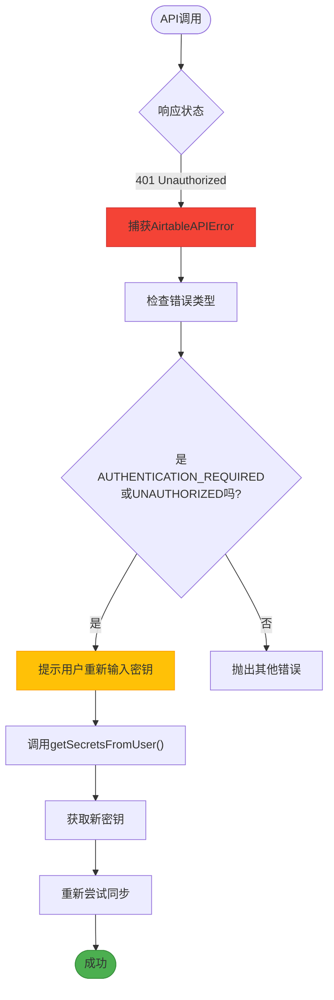
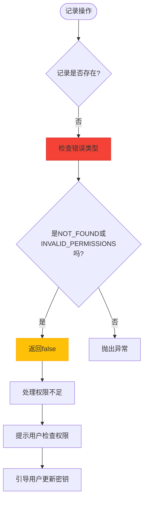

# 认证机制

<cite>
**本文档引用的文件**   
- [AirtableAPI.ts](file://packages/integration-airtable/lib/AirtableAPI.ts)
- [syncWithAirtable.ts](file://packages/integration-airtable/lib/syncWithAirtable.ts)
- [schema.ts](file://packages/integration-airtable/lib/schema.ts)
- [AirtableIntegrationScreen.tsx](file://App/app/features/integrations/screens/AirtableIntegrationScreen.tsx)
- [NewOrEditAirtableIntegrationScreen.tsx](file://App/app/features/integrations/screens/NewOrEditAirtableIntegrationScreen.tsx)
- [GetSecretsModalScreen.tsx](file://App/app/screens/GetSecretsModalScreen.tsx)
</cite>

## 目录
1. [简介](#简介)
2. [API密钥配置](#api密钥配置)
3. [认证头构造](#认证头构造)
4. [安全存储策略](#安全存储策略)
5. [AirtableAPI类认证流程](#airtableapi类认证流程)
6. [错误处理](#错误处理)
7. [最佳实践](#最佳实践)
8. [安全审计建议](#安全审计建议)

## 简介
本文档详细介绍了Inventory应用中Airtable集成的认证机制。该机制基于Airtable API的Bearer Token认证方式，实现了安全的数据同步功能。系统通过API密钥进行身份验证，支持处理无效密钥、过期凭证和权限不足等异常情况，并提供了完整的错误处理和安全审计方案。

**Section sources**
- [AirtableAPI.ts](file://packages/integration-airtable/lib/AirtableAPI.ts#L1-L452)
- [syncWithAirtable.ts](file://packages/integration-airtable/lib/syncWithAirtable.ts#L1-L1452)

## API密钥配置
Airtable API密钥的配置通过用户界面完成，系统要求用户提供具有特定权限范围的访问令牌。在`NewOrEditAirtableIntegrationScreen.tsx`中，用户可以通过界面输入Airtable Base ID和其他配置信息。

API密钥必须包含以下权限范围：
- `data.records:read` - 读取记录权限
- `data.records:write` - 写入记录权限
- `data.bases:read` - 读取数据库权限
- `data.bases:write` - 写入数据库权限

并且需要设置为"all current and future bases"（所有当前和未来的数据库）的访问权限。用户可以通过[https://airtable.com/create/tokens](https://airtable.com/create/tokens)获取访问令牌。



**Diagram sources **
- [NewOrEditAirtableIntegrationScreen.tsx](file://App/app/features/integrations/screens/NewOrEditAirtableIntegrationScreen.tsx#L1-L620)
- [AirtableIntegrationScreen.tsx](file://App/app/features/integrations/screens/AirtableIntegrationScreen.tsx#L1-L774)

## 认证头构造
Airtable API使用标准的HTTP Bearer Token认证机制。在`AirtableAPI.ts`文件中，认证头的构造遵循以下模式：

```mermaid
classDiagram
class AirtableAPI {
+accessToken : string
+fetchWithRateLimit : Fetch
+constructor(accessToken : string, fetch : Fetch)
+listBases() : Promise
+getBaseSchema(baseId : string) : Promise
+createBase(params : object) : Promise
+createRecords(baseId : string, tableId : string, records : object[]) : Promise
+updateRecords(baseId : string, tableId : string, records : object[]) : Promise
+deleteRecords(baseId : string, tableId : string, recordIds : string[]) : Promise
}
AirtableAPI --> "Authorization Header" : 构造
"Authorization Header" --> "Bearer ${accessToken}" : 格式
note right of AirtableAPI
认证头格式 : Authorization : Bearer <API密钥>
所有API请求都包含此认证头
end note
```

**Diagram sources **
- [AirtableAPI.ts](file://packages/integration-airtable/lib/AirtableAPI.ts#L108-L452)

**Section sources**
- [AirtableAPI.ts](file://packages/integration-airtable/lib/AirtableAPI.ts#L179-L195)

## 安全存储策略
系统采用安全的存储策略来保护Airtable API密钥。密钥不会以明文形式存储，而是使用`react-native-sensitive-info`库进行加密存储。



**Diagram sources **
- [AirtableIntegrationScreen.tsx](file://App/app/features/integrations/screens/AirtableIntegrationScreen.tsx#L127-L197)
- [GetSecretsModalScreen.tsx](file://App/app/screens/GetSecretsModalScreen.tsx#L1-L111)

**Section sources**
- [AirtableIntegrationScreen.tsx](file://App/app/features/integrations/screens/AirtableIntegrationScreen.tsx#L210-L222)
- [GetSecretsModalScreen.tsx](file://App/app/screens/GetSecretsModalScreen.tsx#L29-L50)

## AirtableAPI类认证流程
`AirtableAPI`类是认证机制的核心实现，负责处理所有与Airtable API的交互。该类在构造时接收API密钥，并在所有请求中自动添加认证头。

认证流程包括：
1. 初始化API实例时传入访问令牌
2. 为每个请求构造包含Bearer Token的认证头
3. 处理API调用的速率限制（5次/秒）
4. 实现重试机制以应对临时性错误



**Diagram sources **
- [AirtableAPI.ts](file://packages/integration-airtable/lib/AirtableAPI.ts#L183-L235)

**Section sources**
- [AirtableAPI.ts](file://packages/integration-airtable/lib/AirtableAPI.ts#L175-L235)

## 错误处理
系统实现了完善的错误处理机制，能够识别和处理各种认证相关的错误情况。

### 401未授权错误处理
当遇到401错误（未授权）时，系统会：
1. 检测到`AUTHENTICATION_REQUIRED`或`UNAUTHORIZED`错误类型
2. 提示用户重新输入API密钥
3. 重新获取并存储新的访问令牌
4. 重试同步操作



**Diagram sources **
- [AirtableIntegrationScreen.tsx](file://App/app/features/integrations/screens/AirtableIntegrationScreen.tsx#L333-L345)

### 403权限不足错误处理
对于403错误（权限不足），系统会：
1. 检测`INVALID_PERMISSIONS_OR_MODEL_NOT_FOUND`错误类型
2. 验证用户是否具有足够的权限
3. 提示用户检查API密钥的权限范围
4. 引导用户获取具有正确权限的新密钥



**Diagram sources **
- [syncWithAirtable.ts](file://packages/integration-airtable/lib/syncWithAirtable.ts#L152-L169)

**Section sources**
- [AirtableAPI.ts](file://packages/integration-airtable/lib/AirtableAPI.ts#L78-L106)
- [syncWithAirtable.ts](file://packages/integration-airtable/lib/syncWithAirtable.ts#L152-L169)

## 最佳实践
### API密钥管理最佳实践
1. **最小权限原则**：API密钥应仅授予必要的权限，避免使用具有完全访问权限的密钥
2. **定期轮换**：建议定期更换API密钥，特别是在怀疑密钥可能泄露时
3. **环境分离**：为开发、测试和生产环境使用不同的API密钥
4. **监控使用**：定期检查API调用日志，监控异常使用模式

### 配置管理最佳实践
1. **Base ID验证**：在配置时验证Airtable Base ID的格式正确性
2. **连接测试**：在保存配置前进行连接测试，确保API密钥有效
3. **错误提示**：提供清晰的错误信息，帮助用户快速解决问题
4. **文档指引**：提供详细的设置文档链接，指导用户完成配置

## 安全审计建议
1. **密钥存储审计**：定期检查`react-native-sensitive-info`的存储实现，确保加密算法的安全性
2. **内存清理**：确保API密钥在使用后从内存中及时清理，避免内存泄露
3. **网络传输**：验证所有与Airtable的通信都通过HTTPS加密传输
4. **日志记录**：避免在日志中记录完整的API密钥，只记录必要的调试信息
5. **权限审查**：定期审查API密钥的权限范围，确保符合最小权限原则
6. **异常监控**：监控认证失败的频率，异常高的失败率可能表明存在暴力破解尝试

**Section sources**
- [AirtableAPI.ts](file://packages/integration-airtable/lib/AirtableAPI.ts#L1-L452)
- [syncWithAirtable.ts](file://packages/integration-airtable/lib/syncWithAirtable.ts#L1-L1452)
- [AirtableIntegrationScreen.tsx](file://App/app/features/integrations/screens/AirtableIntegrationScreen.tsx#L1-L774)