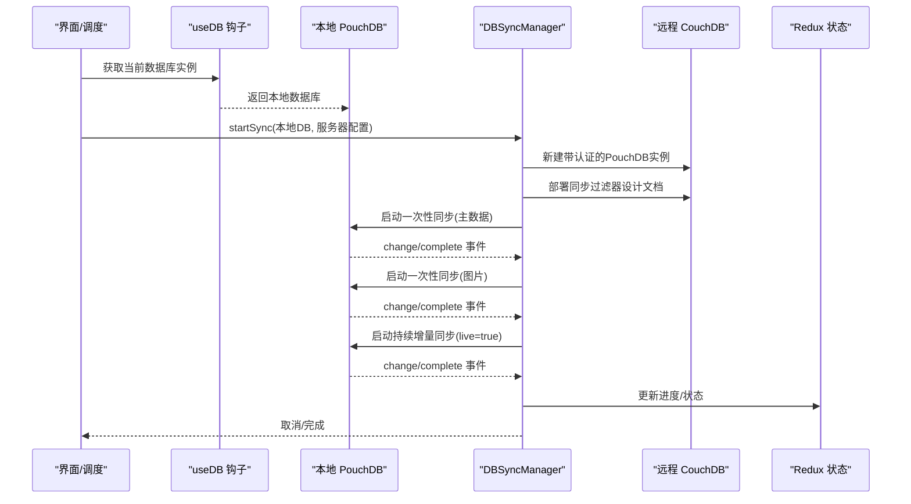
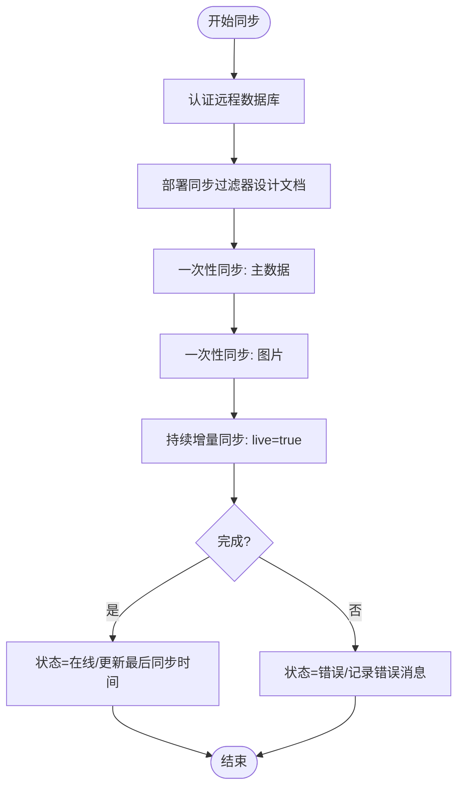
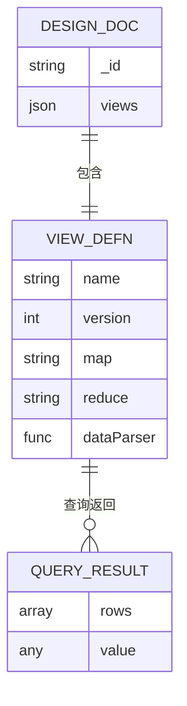
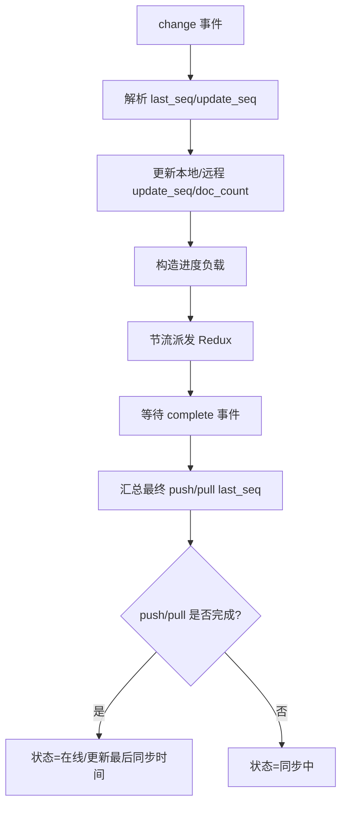
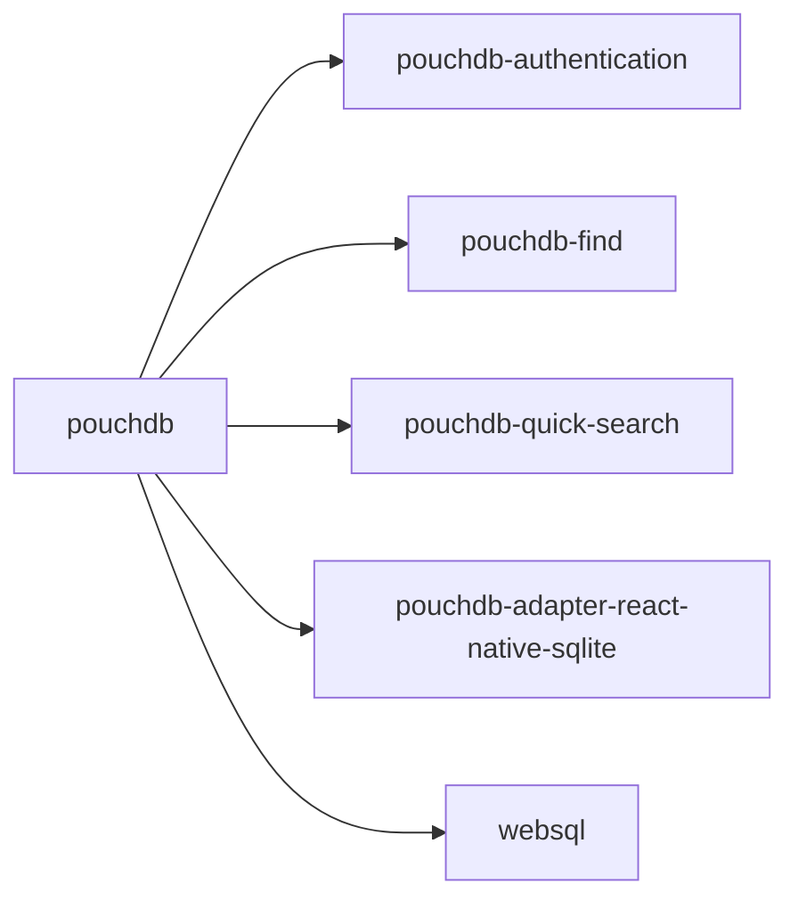

# CouchDB同步协议

<cite>
**本文引用的文件**
- [App/app/db/pouchdb.ts](file://App/app/db/pouchdb.ts)
- [App/app/db/index.ts](file://App/app/db/index.ts)
- [App/app/db/hooks/useDB.ts](file://App/app/db/hooks/useDB.ts)
- [App/app/db/configUtils.ts](file://App/app/db/configUtils.ts)
- [App/app/features/db-sync/DBSyncManager.tsx](file://App/app/features/db-sync/DBSyncManager.tsx)
- [App/app/features/db-sync/slice.ts](file://App/app/features/db-sync/slice.ts)
- [packages/data-storage-couchdb/lib/views.ts](file://packages/data-storage-couchdb/lib/views.ts)
- [packages/data-storage-couchdb/lib/functions/getGetViewData.ts](file://packages/data-storage-couchdb/lib/functions/getGetViewData.ts)
- [packages/data-storage-couchdb/lib/CouchDBData.ts](file://packages/data-storage-couchdb/lib/CouchDBData.ts)
- [App/app/utils/insertTimestampIdRecord.ts](file://App/app/utils/insertTimestampIdRecord.ts)
- [App/yarn.lock](file://App/yarn.lock)
</cite>

## 目录
1. [简介](#简介)
2. [项目结构](#项目结构)
3. [核心组件](#核心组件)
4. [架构总览](#架构总览)
5. [详细组件分析](#详细组件分析)
6. [依赖关系分析](#依赖关系分析)
7. [性能考量](#性能考量)
8. [故障排查指南](#故障排查指南)
9. [结论](#结论)

## 简介
本文件面向CouchDB双向同步协议的技术文档，聚焦于移动端应用中的PouchDB与远程CouchDB之间的同步流程、配置选项、增量同步与序列号跟踪、MapReduce视图在查询与同步中的作用，以及网络异常处理与性能优化策略。文档以仓库现有实现为依据，避免臆测，确保可追溯性与可验证性。

## 项目结构
围绕同步协议的关键模块分布如下：
- 数据层与适配器：PouchDB初始化、SQLite适配器、搜索插件等
- 同步管理器：负责连接建立、认证、过滤器部署、增量同步与状态上报
- 视图层：MapReduce视图定义与查询封装
- Redux状态：服务器配置、状态机与进度指标
- 冲突处理：基于时间戳ID插入的冲突重试策略

```mermaid
graph TB
subgraph "本地"
Pouch["PouchDB 实例<br/>SQLite 适配器"]
Hooks["数据库钩子 useDB"]
end
subgraph "同步管理"
SyncMgr["DBSyncManager<br/>连接/认证/过滤器/增量同步"]
Redux["Redux Slice<br/>服务器状态/进度"]
end
subgraph "远程"
Remote["CouchDB 服务端"]
Views["MapReduce 视图"]
end
subgraph "视图与数据访问"
ViewsDef["views.ts 定义"]
GetView["getGetViewData 封装"]
DataAPI["CouchDBData API"]
end
Hooks --> Pouch
Pouch <- --> SyncMgr
SyncMgr --> Remote
ViewsDef --> Views
GetView --> Views
DataAPI --> GetView
SyncMgr --> Redux
```

图表来源
- [App/app/db/pouchdb.ts](file://App/app/db/pouchdb.ts#L1-L102)
- [App/app/db/hooks/useDB.ts](file://App/app/db/hooks/useDB.ts#L1-L80)
- [App/app/features/db-sync/DBSyncManager.tsx](file://App/app/features/db-sync/DBSyncManager.tsx#L1-L743)
- [App/app/features/db-sync/slice.ts](file://App/app/features/db-sync/slice.ts#L1-L348)
- [packages/data-storage-couchdb/lib/views.ts](file://packages/data-storage-couchdb/lib/views.ts#L1-L573)
- [packages/data-storage-couchdb/lib/functions/getGetViewData.ts](file://packages/data-storage-couchdb/lib/functions/getGetViewData.ts#L1-L126)
- [packages/data-storage-couchdb/lib/CouchDBData.ts](file://packages/data-storage-couchdb/lib/CouchDBData.ts#L1-L97)

章节来源
- [App/app/db/pouchdb.ts](file://App/app/db/pouchdb.ts#L1-L102)
- [App/app/db/hooks/useDB.ts](file://App/app/db/hooks/useDB.ts#L1-L80)
- [App/app/features/db-sync/DBSyncManager.tsx](file://App/app/features/db-sync/DBSyncManager.tsx#L1-L743)
- [App/app/features/db-sync/slice.ts](file://App/app/features/db-sync/slice.ts#L1-L348)
- [packages/data-storage-couchdb/lib/views.ts](file://packages/data-storage-couchdb/lib/views.ts#L1-L573)
- [packages/data-storage-couchdb/lib/functions/getGetViewData.ts](file://packages/data-storage-couchdb/lib/functions/getGetViewData.ts#L1-L126)
- [packages/data-storage-couchdb/lib/CouchDBData.ts](file://packages/data-storage-couchdb/lib/CouchDBData.ts#L1-L97)

## 核心组件
- PouchDB初始化与适配器
  - 使用React Native SQLite适配器，启用认证、全文检索与快速搜索插件；在iOS平台集成中文分词与多语言支持。
- 同步管理器（DBSyncManager）
  - 负责网络状态监听、认证远程数据库、部署同步过滤器、启动一次性全量与增量同步、事件回调与状态更新。
- 视图系统（views.ts + getGetViewData）
  - 定义多种MapReduce视图，提供带版本号的视图命名与自动重建逻辑，支持查询参数化与结果解析。
- Redux状态机（db-sync slice）
  - 维护服务器列表、状态、错误信息、最后同步时间与序列号/计数等进度指标。
- 冲突处理辅助
  - 基于时间戳ID插入的冲突重试策略，用于本地写入场景下的冲突消解。

章节来源
- [App/app/db/pouchdb.ts](file://App/app/db/pouchdb.ts#L1-L102)
- [App/app/features/db-sync/DBSyncManager.tsx](file://App/app/features/db-sync/DBSyncManager.tsx#L1-L743)
- [packages/data-storage-couchdb/lib/views.ts](file://packages/data-storage-couchdb/lib/views.ts#L1-L573)
- [packages/data-storage-couchdb/lib/functions/getGetViewData.ts](file://packages/data-storage-couchdb/lib/functions/getGetViewData.ts#L1-L126)
- [App/app/features/db-sync/slice.ts](file://App/app/features/db-sync/slice.ts#L1-L348)
- [App/app/utils/insertTimestampIdRecord.ts](file://App/app/utils/insertTimestampIdRecord.ts#L1-L34)

## 架构总览
下图展示从本地到远程的双向同步主流程，包括连接建立、认证、过滤器部署、一次性全量与图片同步、以及持续增量同步。



图表来源
- [App/app/db/hooks/useDB.ts](file://App/app/db/hooks/useDB.ts#L1-L80)
- [App/app/features/db-sync/DBSyncManager.tsx](file://App/app/features/db-sync/DBSyncManager.tsx#L412-L725)
- [App/app/features/db-sync/slice.ts](file://App/app/features/db-sync/slice.ts#L1-L348)

## 详细组件分析

### DBSyncManager：同步流程与配置
- 连接与认证
  - 通过用户名/密码创建远程PouchDB实例，使用fetch包装记录HTTP错误；随后登录并获取会话与数据库信息，校验本地或远程配置有效性。
- 过滤器部署
  - 在远程数据库上部署同步过滤器设计文档，包含“仅主数据”和“仅图片”两类过滤器，失败时最多重试若干次。
- 同步阶段
  - 一次性全量同步（主数据）：批量大小与批次限制较小，优先同步主数据。
  - 一次性全量同步（图片）：批量更小，确保图片类文档优先同步。
  - 持续增量同步（live=true）：批量与批次限制进一步降低，保证实时性与低带宽占用。
- 事件与进度
  - 订阅change/complete/paused/active/denied/error事件，计算本地/远程update_seq与doc_count，按方向更新pushLastSeq/pullLastSeq，节流派发Redux进度。
- 状态机
  - 初始化/离线/禁用/同步中/在线/错误等状态，配合最后同步时间与错误消息维护用户体验。



图表来源
- [App/app/features/db-sync/DBSyncManager.tsx](file://App/app/features/db-sync/DBSyncManager.tsx#L149-L725)
- [App/app/features/db-sync/slice.ts](file://App/app/features/db-sync/slice.ts#L1-L348)

章节来源
- [App/app/features/db-sync/DBSyncManager.tsx](file://App/app/features/db-sync/DBSyncManager.tsx#L1-L743)
- [App/app/features/db-sync/slice.ts](file://App/app/features/db-sync/slice.ts#L1-L348)

### PouchDB与SQLite适配器及插件
- 适配器
  - 使用React Native SQLite适配器，本地数据库持久化至SQLite后端。
- 插件
  - 认证、全文检索、快速搜索、Lunr中文分词与多语言支持。
- 初始化
  - 平台差异处理（iOS原生分词与回退策略），统一导出PouchDB实例与工厂方法。

章节来源
- [App/app/db/pouchdb.ts](file://App/app/db/pouchdb.ts#L1-L102)
- [App/app/db/index.ts](file://App/app/db/index.ts#L1-L3)

### 视图系统：MapReduce支持高效查询与同步
- 视图定义
  - 定义多类统计与列表视图（如缺货数量、低库存数量、过期物品、RFID未打标签物品等），每个视图包含map/reduce与数据解析器。
- 视图命名与重建
  - 视图采用前缀+名称+版本号命名；查询封装在getGetViewData中，若视图缺失则尝试重建设计文档，最多重试若干次。
- 数据访问API
  - CouchDBData聚合了配置、数据读取、附件、历史、视图查询等能力，供上层业务调用。



图表来源
- [packages/data-storage-couchdb/lib/views.ts](file://packages/data-storage-couchdb/lib/views.ts#L1-L573)
- [packages/data-storage-couchdb/lib/functions/getGetViewData.ts](file://packages/data-storage-couchdb/lib/functions/getGetViewData.ts#L1-L126)
- [packages/data-storage-couchdb/lib/CouchDBData.ts](file://packages/data-storage-couchdb/lib/CouchDBData.ts#L1-L97)

章节来源
- [packages/data-storage-couchdb/lib/views.ts](file://packages/data-storage-couchdb/lib/views.ts#L1-L573)
- [packages/data-storage-couchdb/lib/functions/getGetViewData.ts](file://packages/data-storage-couchdb/lib/functions/getGetViewData.ts#L1-L126)
- [packages/data-storage-couchdb/lib/CouchDBData.ts](file://packages/data-storage-couchdb/lib/CouchDBData.ts#L1-L97)

### 增量同步与序列号跟踪
- 序列号解析
  - 将update_seq与last_seq转换为数值，兼容字符串形式的复合序列号（取主段）。
- 进度上报
  - change事件中根据方向更新pushLastSeq/pullLastSeq与本地/远程update_seq/doc_count；complete事件汇总最终状态。
- 在线判断
  - 当本地/远程update_seq与lastSeq相等时视为完成；对初始0值场景进行特殊处理，避免误判。



图表来源
- [App/app/features/db-sync/DBSyncManager.tsx](file://App/app/features/db-sync/DBSyncManager.tsx#L253-L725)
- [App/app/features/db-sync/slice.ts](file://App/app/features/db-sync/slice.ts#L1-L348)

章节来源
- [App/app/features/db-sync/DBSyncManager.tsx](file://App/app/features/db-sync/DBSyncManager.tsx#L253-L743)
- [App/app/features/db-sync/slice.ts](file://App/app/features/db-sync/slice.ts#L1-L348)

### 冲突解决机制
- 时间戳ID插入
  - 通过递增时间戳作为文档ID，遇到冲突时自动重试，最多允许一定偏移量，避免无限循环。
- 适用范围
  - 该策略适用于本地写入场景，确保并发写入不产生重复ID冲突；对于PouchDB双向同步，冲突通常由PouchDB/Cloudant自动处理，此处策略作为补充。

章节来源
- [App/app/utils/insertTimestampIdRecord.ts](file://App/app/utils/insertTimestampIdRecord.ts#L1-L34)

## 依赖关系分析
- 外部依赖
  - PouchDB、pouchdb-authentication、pouchdb-find、pouchdb-quick-search、pouchdb-adapter-react-native-sqlite、websql等。
- 版本与兼容性
  - yarn.lock显示pouchdb-authentication与pouchdb-mapreduce-utils等版本，需关注插件与PouchDB主版本的兼容性。



图表来源
- [App/yarn.lock](file://App/yarn.lock#L11831-L12088)

章节来源
- [App/yarn.lock](file://App/yarn.lock#L11831-L12088)

## 性能考量
- 批处理与批次限制
  - 一次性同步使用较大批次（如批量大小16、批次上限4），以提升吞吐；图片同步使用更小批量（如批量大小1、批次上限2），确保高优先级文档尽快到达。
  - 持续增量同步使用极小批量（如批量大小2、批次上限2），降低网络与CPU压力，提高实时性。
- 心跳间隔
  - 代码中未显式设置心跳间隔；默认行为取决于底层HTTP长连接与PouchDB内部重试策略。若需自定义心跳，可在fetch包装或PouchDB配置中扩展。
- 日志与节流
  - 进度事件每秒最多派发一次，避免频繁渲染与状态更新。
- 视图重建与缓存
  - 视图缺失时自动重建设计文档，但应尽量减少重建频率，避免频繁写入导致性能抖动。

章节来源
- [App/app/features/db-sync/DBSyncManager.tsx](file://App/app/features/db-sync/DBSyncManager.tsx#L465-L570)
- [packages/data-storage-couchdb/lib/functions/getGetViewData.ts](file://packages/data-storage-couchdb/lib/functions/getGetViewData.ts#L56-L121)

## 故障排查指南
- 连接与认证失败
  - 检查服务器URI、用户名/密码是否正确；确认fetch包装已捕获HTTP错误并记录详情；根据错误码区分超时与网络不可达。
- 配置无效
  - 若本地无配置，远程配置必须有效；否则同步状态置为错误并记录具体原因。
- 过滤器部署失败
  - 若远程设计文档不存在，将尝试部署；若多次失败，检查权限与网络状况。
- 同步卡住或长时间无进展
  - 查看change事件日志与进度payload，确认push/pull last_seq是否推进；核对本地/远程update_seq与doc_count变化。
- 错误事件
  - 订阅error事件并记录详细错误信息；根据错误类型调整重试策略或提示用户检查网络/权限。

章节来源
- [App/app/features/db-sync/DBSyncManager.tsx](file://App/app/features/db-sync/DBSyncManager.tsx#L149-L204)
- [App/app/features/db-sync/DBSyncManager.tsx](file://App/app/features/db-sync/DBSyncManager.tsx#L386-L405)
- [App/app/db/configUtils.ts](file://App/app/db/configUtils.ts#L1-L30)

## 结论
本实现以PouchDB为核心，结合React Native SQLite适配器与认证/搜索插件，构建了稳定可靠的双向同步方案。通过分阶段的一次性同步与持续增量同步、事件驱动的进度上报与状态机管理、以及MapReduce视图的查询封装，系统在移动端环境下实现了高效、可观测且具备一定容错能力的同步能力。建议在生产环境中持续监控序列号推进情况与错误事件，必要时微调批处理参数与网络策略，以获得最佳体验与性能平衡。