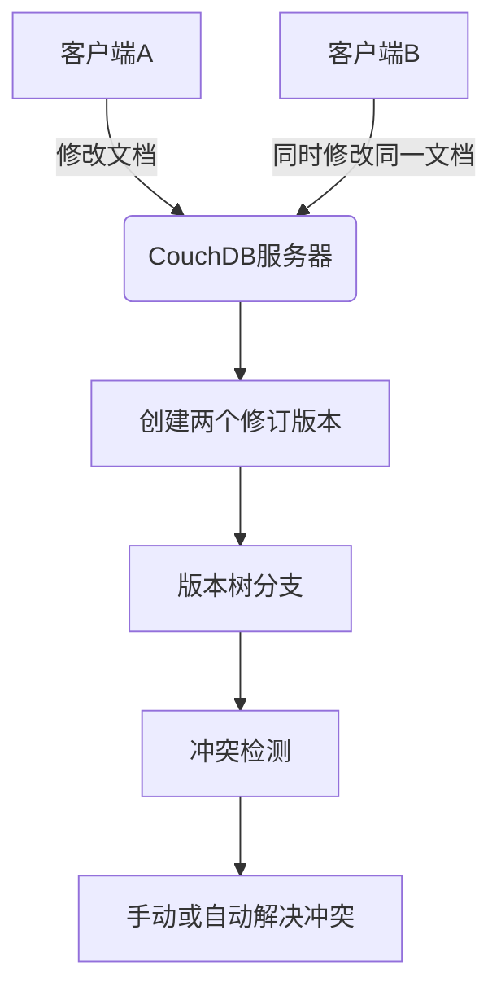
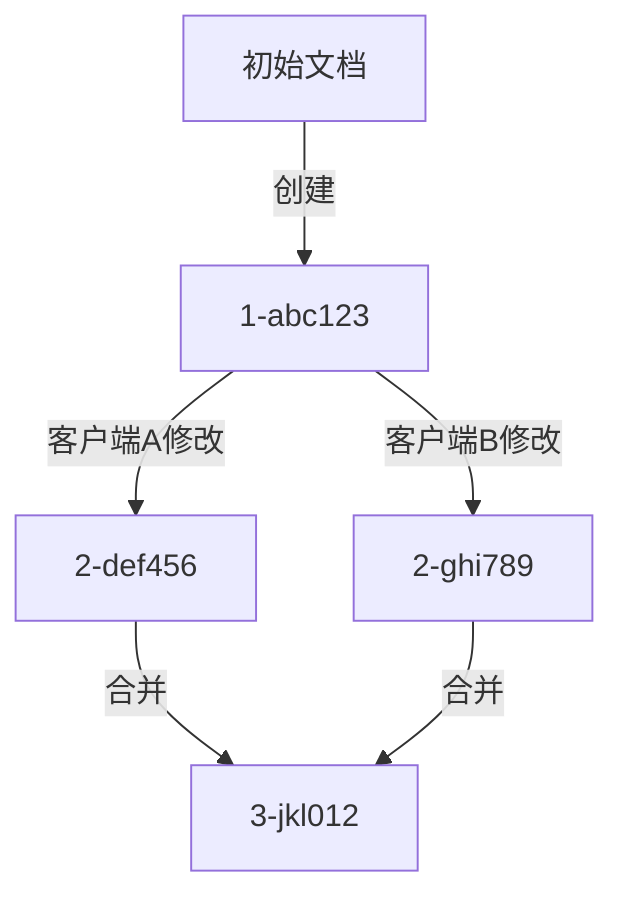
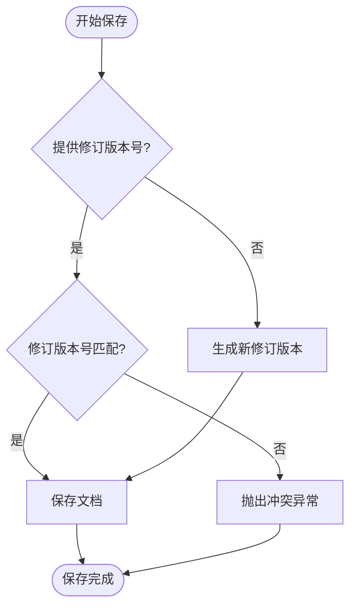
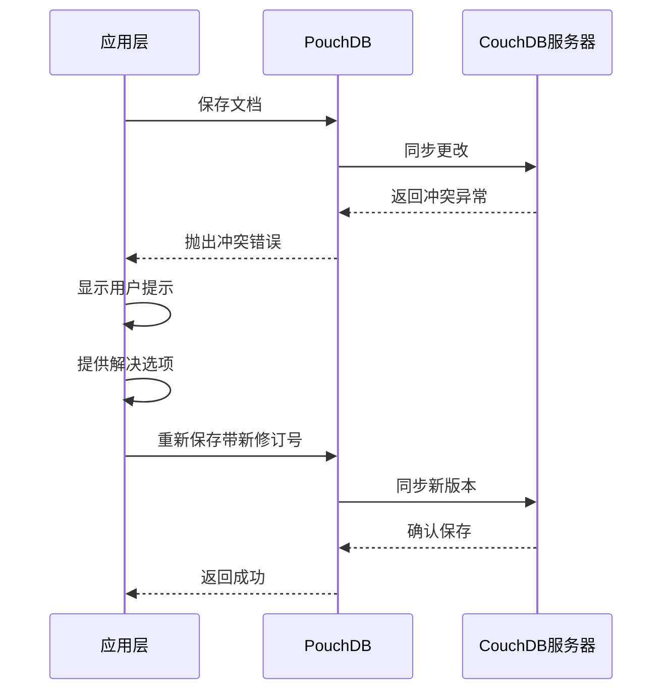
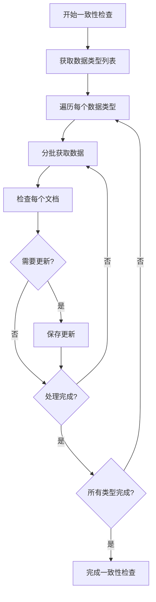

# 冲突解决

<cite>
**本文档引用文件**   
- [insertTimestampIdRecord.ts](file://App\app\utils\insertTimestampIdRecord.ts)
- [pouchdb.ts](file://App\app\db\pouchdb.ts)
- [DBSyncManager.tsx](file://App\app\features\db-sync\DBSyncManager.tsx)
- [getSaveDatum.ts](file://packages\data-storage-couchdb\lib\functions\getSaveDatum.ts)
- [couchdb-utils.ts](file://packages\data-storage-couchdb\lib\functions\couchdb-utils.ts)
- [fixDataConsistency.ts](file://Data\lib\utils\fixDataConsistency.ts)
- [hasChanges.ts](file://Data\lib\utils\hasChanges.ts)
</cite>

## 目录
1. [简介](#简介)
2. [CouchDB/PouchDB冲突处理机制](#couchdbpouchdb冲突处理机制)
3. [修订版本树与MVCC原理](#修订版本树与mvcc原理)
4. [冲突检测与处理策略](#冲突检测与处理策略)
5. [应用层冲突处理实现](#应用层冲突处理实现)
6. [数据一致性修复](#数据一致性修复)
7. [结论](#结论)

## 简介
本文档深入解析CouchDB在分布式环境中处理数据冲突的机制。通过分析代码库中的实现，阐述文档多版本并发控制（MVCC）原理，详细说明修订版本树（_rev）的生成与比较规则，以及'最后写入获胜'（Last Write Wins）策略的具体实现。同时介绍如何检测编辑冲突、获取冲突版本、手动或自动合并冲突数据，并结合实际代码场景，展示应用层如何处理PouchDB返回的冲突异常，实现优雅的用户提示与数据恢复流程。

## CouchDB/PouchDB冲突处理机制

CouchDB和其前端实现PouchDB采用多版本并发控制（MVCC）来处理分布式环境中的数据冲突。当多个客户端同时修改同一文档时，系统不会立即拒绝后续的写入操作，而是允许创建文档的多个版本，通过修订版本号（_rev）来跟踪和管理这些版本。

在本项目中，PouchDB作为CouchDB的前端实现，通过SQLite适配器在本地存储数据，并与远程CouchDB服务器进行双向同步。这种架构天然支持离线操作和多设备同步，但也带来了数据冲突的可能性。



**Diagram sources**
- [DBSyncManager.tsx](file://App\app\features\db-sync\DBSyncManager.tsx)
- [pouchdb.ts](file://App\app\db\pouchdb.ts)

**Section sources**
- [DBSyncManager.tsx](file://App\app\features\db-sync\DBSyncManager.tsx#L1-L743)
- [pouchdb.ts](file://App\app\db\pouchdb.ts#L1-L102)

## 修订版本树与MVCC原理

CouchDB使用修订版本树（Revision Tree）来管理文档的多个版本。每个文档的修订版本号（_rev）由两部分组成：修订级别和哈希值，格式为"级别-哈希"。修订级别表示从文档创建开始的修改次数，而哈希值是基于前一个修订版本的内容生成的唯一标识。

在本项目中，`couchdb-utils.ts`文件中的`getDocFromDatum`函数负责将应用数据转换为CouchDB文档格式，其中包含了修订版本的处理逻辑。当保存文档时，系统会检查是否存在现有的修订版本号（__rev），并在保存时将其包含在文档中。



**Diagram sources**
- [couchdb-utils.ts](file://packages\data-storage-couchdb\lib\functions\couchdb-utils.ts#L280-L311)

**Section sources**
- [couchdb-utils.ts](file://packages\data-storage-couchdb\lib\functions\couchdb-utils.ts#L1-L351)

## 冲突检测与处理策略

### 冲突检测机制

系统通过比较修订版本号来检测冲突。当尝试保存一个文档时，如果提供的修订版本号与数据库中当前的修订版本号不匹配，则会抛出冲突异常。在`getSaveDatum.ts`文件中，`doSaveData`函数实现了这一逻辑，通过比较现有数据和要保存的数据来确定是否发生了更改。



### "最后写入获胜"策略

本项目实现了"最后写入获胜"（Last Write Wins）的冲突解决策略。当`ignoreConflict`选项设置为`true`时，系统会自动使用现有文档的修订版本号，从而避免冲突异常。这种策略适用于那些不需要严格版本控制的场景，确保最新的更改总是能够保存成功。

在`getSaveDatum.ts`文件的291-314行中，可以看到这一策略的具体实现：
```typescript
const dataToSave: DataMeta<T> & { [key: string]: unknown } = {
  ...(existingData
    ? (Object.fromEntries(
        Object.entries(existingData).filter(
          ([k]) => k !== '__rev' && k !== '__type',
        ),
      ) as any)
    : {}),
  ...d,
  ...(options.ignoreConflict && existingData?.__rev
    ? { __rev: existingData.__rev }
    : {}),
  ...(d.__raw ? { __raw: d.__raw } : {}),
};
```

**Diagram sources**
- [getSaveDatum.ts](file://packages\data-storage-couchdb\lib\functions\getSaveDatum.ts#L80-L238)

**Section sources**
- [getSaveDatum.ts](file://packages\data-storage-couchdb\lib\functions\getSaveDatum.ts#L1-L141)

## 应用层冲突处理实现

### 冲突异常处理

在应用层，当PouchDB返回冲突异常时，系统需要优雅地处理这种情况。`insertTimestampIdRecord.ts`文件提供了一个处理ID冲突的示例，当使用时间戳作为文档ID时，如果发生冲突（即已有相同ID的文档），系统会自动增加时间戳偏移量并重试，最多尝试500次。



### 用户提示与数据恢复

当检测到冲突时，应用应向用户提供清晰的提示，并提供多种解决选项，如：
- 保留当前版本
- 使用服务器版本
- 手动合并更改
- 查看更改历史

在`DBSyncManager.tsx`文件中，同步管理器会监听同步事件，并在发生错误时更新服务器状态和错误消息，这为用户提供了一个反馈机制。

**Diagram sources**
- [insertTimestampIdRecord.ts](file://App\app\utils\insertTimestampIdRecord.ts#L1-L35)
- [DBSyncManager.tsx](file://App\app\features\db-sync\DBSyncManager.tsx#L374-L407)

**Section sources**
- [insertTimestampIdRecord.ts](file://App\app\utils\insertTimestampIdRecord.ts#L1-L35)
- [DBSyncManager.tsx](file://App\app\features\db-sync\DBSyncManager.tsx#L253-L440)

## 数据一致性修复

### 自动一致性检查

系统提供了自动修复数据一致性的功能，通过`fixDataConsistency.ts`文件中的`fixDataConsistency`函数实现。该函数会遍历所有数据类型，检查每个文档的完整性，并在必要时进行修复。



该函数返回一个异步生成器，可以实时报告修复进度，这对于处理大量数据时的用户体验非常重要。

### 变更检测机制

`hasChanges.ts`文件实现了变更检测逻辑，用于确定两个数据对象之间是否存在实质性更改。该函数会忽略元数据字段（如__rev和__raw），并区分元数据更改和用户数据更改，这对于优化同步和历史记录功能至关重要。

**Diagram sources**
- [fixDataConsistency.ts](file://Data\lib\utils\fixDataConsistency.ts#L1-L75)
- [hasChanges.ts](file://Data\lib\utils\hasChanges.ts#L1-L52)

**Section sources**
- [fixDataConsistency.ts](file://Data\lib\utils\fixDataConsistency.ts#L1-L75)
- [hasChanges.ts](file://Data\lib\utils\hasChanges.ts#L1-L52)

## 结论
本项目中的CouchDB/PouchDB冲突处理机制体现了分布式数据库设计的精髓。通过MVCC和修订版本树，系统能够在保证数据一致性的同时，支持离线操作和多设备同步。"最后写入获胜"策略简化了冲突解决过程，而详细的冲突检测和处理机制则确保了数据的完整性和可靠性。

应用层通过优雅的用户提示和数据恢复流程，将复杂的冲突处理逻辑转化为用户友好的体验。自动一致性检查和变更检测机制进一步增强了系统的健壮性，确保了数据在分布式环境中的长期一致性。

这些机制共同构成了一个强大而灵活的数据同步解决方案，既满足了离线优先的应用需求，又保证了多用户协作环境下的数据一致性。