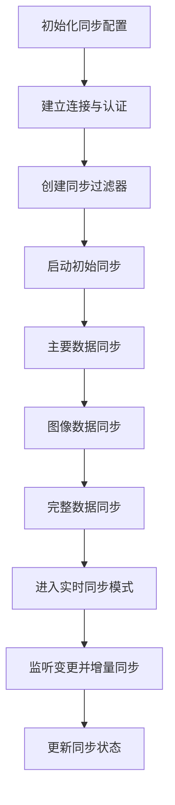
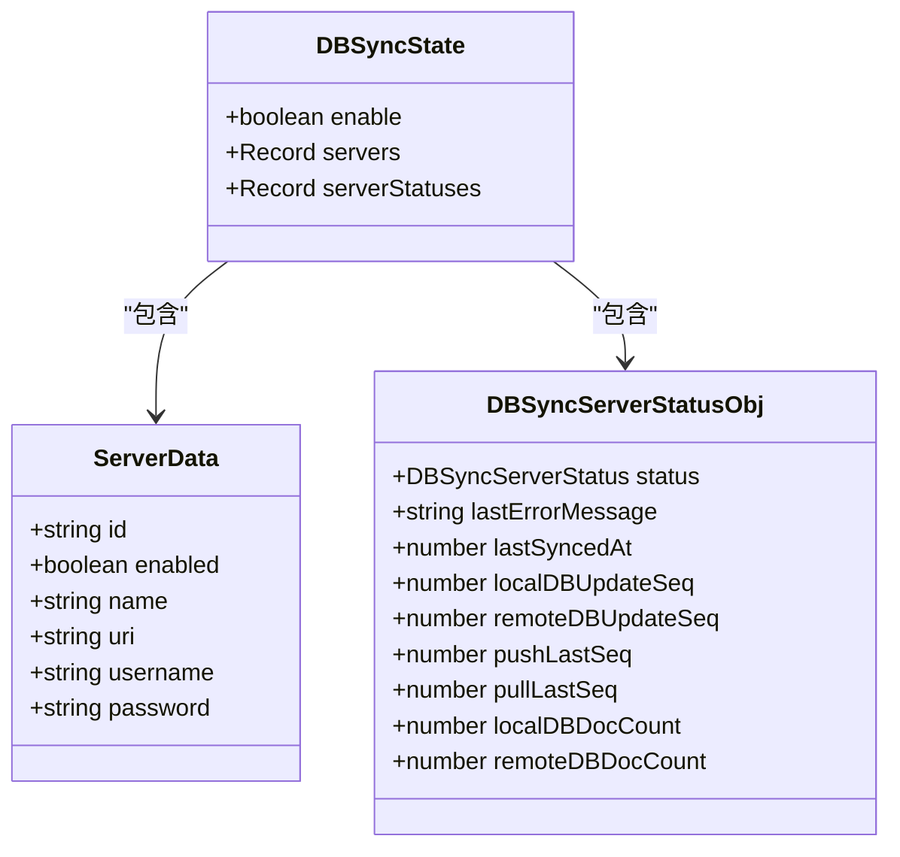
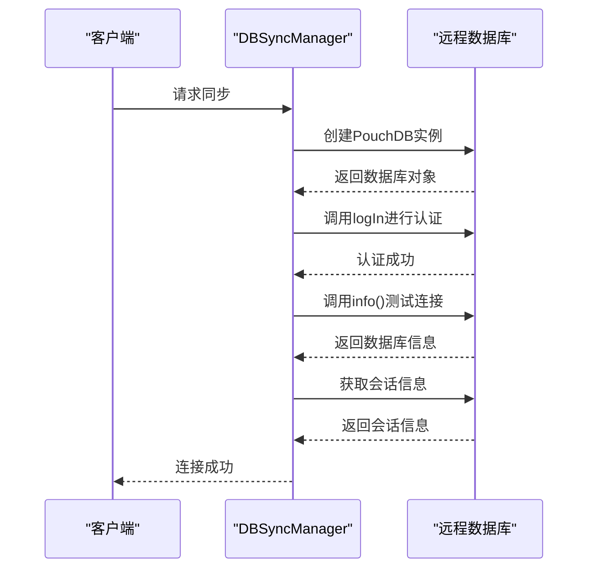
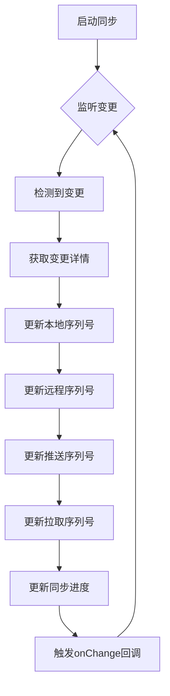
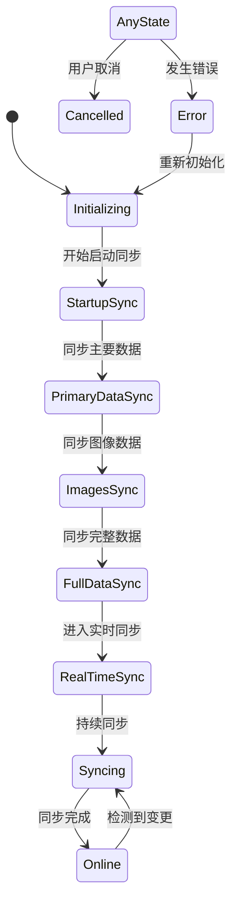
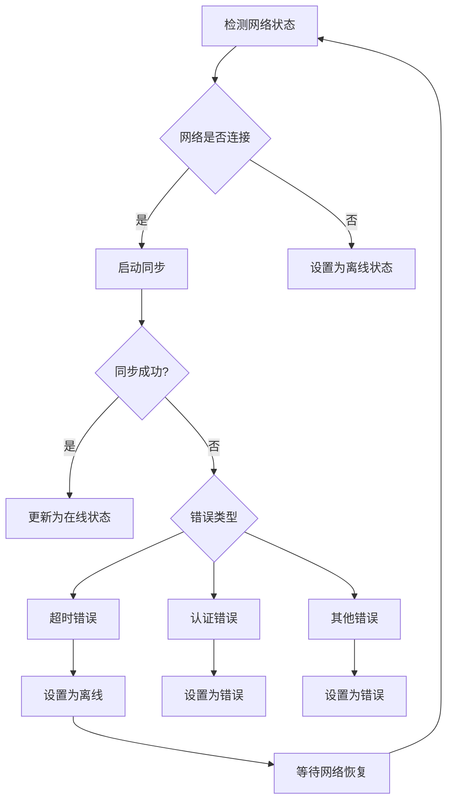
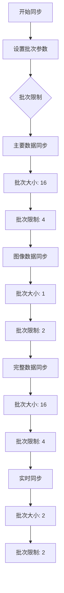
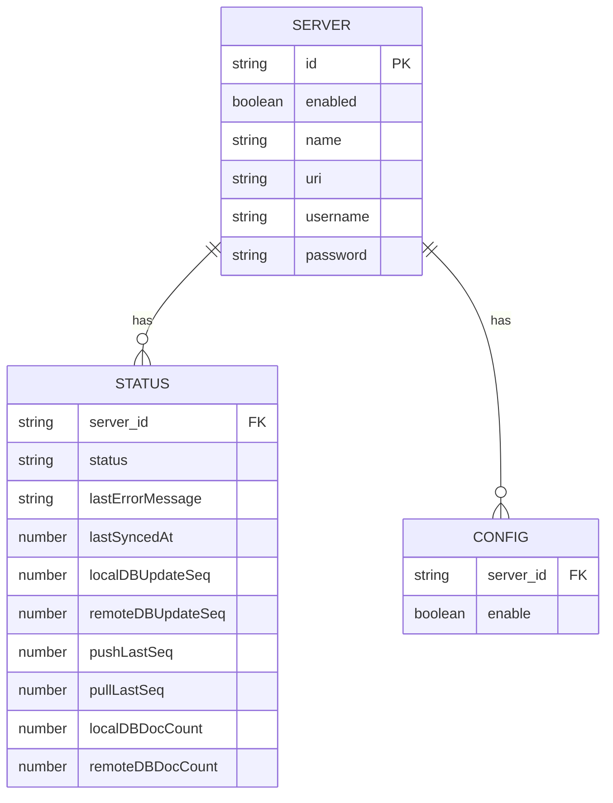

# 同步流程

<cite>
**本文档中引用的文件**  
- [DBSyncManager.tsx](file://App\app\features\db-sync\DBSyncManager.tsx)
- [slice.ts](file://App\app\features\db-sync\slice.ts)
- [pouchdb.ts](file://App\app\db\pouchdb.ts)
- [useDB.ts](file://App\app\db\hooks\useDB.ts)
- [app_db\index.ts](file://App\app\db\app_db\index.ts)
- [getAuthenticatedRemoteDB](file://App\app\features\db-sync\DBSyncManager.tsx#L77-L112)
- [startSync](file://App\app\features\db-sync\DBSyncManager.tsx#L412-L742)
- [SYNC_FILTER_DDOC](file://App\app\features\db-sync\DBSyncManager.tsx#L22-L29)
</cite>

## 目录
1. [同步流程概述](#同步流程概述)
2. [同步配置初始化](#同步配置初始化)
3. [连接建立与认证机制](#连接建立与认证机制)
4. [变更监听与增量同步](#变更监听与增量同步)
5. [同步会话生命周期管理](#同步会话生命周期管理)
6. [网络错误重试与断点续传](#网络错误重试与断点续传)
7. [同步过滤器与选择性同步](#同步过滤器与选择性同步)
8. [大数据批次处理逻辑](#大数据批次处理逻辑)
9. [同步状态管理](#同步状态管理)

## 同步流程概述

本系统实现了CouchDB与PouchDB之间的双向同步流程，通过精心设计的同步策略确保本地数据库与远程服务器之间的数据一致性。同步流程包括初始化配置、连接认证、变更监听、增量数据推送和拉取等关键环节。系统采用分阶段同步策略，首先同步主要数据，然后同步图像数据，最后进入实时同步模式。



**Diagram sources**
- [DBSyncManager.tsx](file://App\app\features\db-sync\DBSyncManager.tsx#L412-L742)

**Section sources**
- [DBSyncManager.tsx](file://App\app\features\db-sync\DBSyncManager.tsx#L1-L742)

## 同步配置初始化

同步流程从初始化配置开始，系统首先检查网络连接状态并获取服务器配置。每个同步服务器包含启用状态、名称、URI、用户名和密码等基本信息。同步管理器会监听网络状态变化，当网络连接可用时启动同步过程。



**Diagram sources**
- [slice.ts](file://App\app\features\db-sync\slice.ts#L14-L42)

**Section sources**
- [slice.ts](file://App\app\features\db-sync\slice.ts#L1-L348)

## 连接建立与认证机制

系统通过`getAuthenticatedRemoteDB`函数建立与远程CouchDB服务器的连接。连接过程包括基本认证和会话管理，确保安全的数据传输。系统使用PouchDB的认证插件进行身份验证，并通过自定义fetch包装器记录HTTP错误。



**Diagram sources**
- [DBSyncManager.tsx](file://App\app\features\db-sync\DBSyncManager.tsx#L77-L112)

**Section sources**
- [DBSyncManager.tsx](file://App\app\features\db-sync\DBSyncManager.tsx#L77-L173)

## 变更监听与增量同步

系统通过PouchDB的sync API实现双向同步，监听本地和远程数据库的变更。同步过程分为推送(push)和拉取(pull)两个方向，每次变更都会触发change事件，系统会更新同步进度并记录序列号。



**Diagram sources**
- [DBSyncManager.tsx](file://App\app\features\db-sync\DBSyncManager.tsx#L289-L333)

**Section sources**
- [DBSyncManager.tsx](file://App\app\features\db-sync\DBSyncManager.tsx#L289-L370)

## 同步会话生命周期管理

同步会话的生命周期由`startSync`函数管理，包括启动、运行和取消三个阶段。系统采用分阶段同步策略，先进行一次性完整同步，然后进入实时同步模式。同步会话可以被显式取消，确保资源的正确释放。



**Diagram sources**
- [DBSyncManager.tsx](file://App\app\features\db-sync\DBSyncManager.tsx#L412-L742)

**Section sources**
- [DBSyncManager.tsx](file://App\app\features\db-sync\DBSyncManager.tsx#L412-L742)

## 网络错误重试与断点续传

系统实现了健壮的网络错误处理机制，包括自动重试和断点续传功能。当网络连接失败时，系统会根据错误类型设置相应的服务器状态，并在连接恢复时自动重新同步。同步进度通过序列号跟踪，确保断点续传的准确性。



**Diagram sources**
- [DBSyncManager.tsx](file://App\app\features\db-sync\DBSyncManager.tsx#L186-L201)

**Section sources**
- [DBSyncManager.tsx](file://App\app\features\db-sync\DBSyncManager.tsx#L186-L201)

## 同步过滤器与选择性同步

系统使用设计文档(Design Document)实现同步过滤，支持选择性同步特定类型的数据。通过定义过滤函数，可以只同步主要数据或图像数据，优化同步性能和带宽使用。

```mermaid
classDiagram
class SYNC_FILTER_DDOC {
+string _id
+object filters
}
class SYNC_ONLY_PRIMARY_FILTER {
+function(doc) bool
}
class SYNC_ONLY_IMAGES_FILTER {
+function(doc) bool
}
SYNC_FILTER_DDOC --> SYNC_ONLY_PRIMARY_FILTER : "only_primary"
SYNC_FILTER_DDOC --> SYNC_ONLY_IMAGES_FILTER : "only_images"
note right of SYNC_ONLY_PRIMARY_FILTER
过滤函数 :
function (doc) {
return !doc._id.startsWith('zz');
}
end note
note right of SYNC_ONLY_IMAGES_FILTER
过滤函数 :
function (doc) {
return doc._id.startsWith('zz20-image');
}
end note
```

**Diagram sources**
- [DBSyncManager.tsx](file://App\app\features\db-sync\DBSyncManager.tsx#L22-L29)

**Section sources**
- [DBSyncManager.tsx](file://App\app\features\db-sync\DBSyncManager.tsx#L18-L30)

## 大数据批次处理逻辑

为了处理大量数据，系统实现了批次处理机制，通过batch_size和batches_limit参数控制每次同步的数据量。分批处理避免了内存溢出和网络超时问题，确保大数据集的稳定同步。



**Diagram sources**
- [DBSyncManager.tsx](file://App\app\features\db-sync\DBSyncManager.tsx#L32-L33)

**Section sources**
- [DBSyncManager.tsx](file://App\app\features\db-sync\DBSyncManager.tsx#L469-L525)

## 同步状态管理

系统通过Redux状态管理同步状态，包括服务器状态、同步进度和最后同步时间。状态更新通过action分发，确保UI与同步状态的实时同步。状态管理还支持敏感数据的脱敏处理。



**Diagram sources**
- [slice.ts](file://App\app\features\db-sync\slice.ts#L44-L48)

**Section sources**
- [slice.ts](file://App\app\features\db-sync\slice.ts#L124-L197)