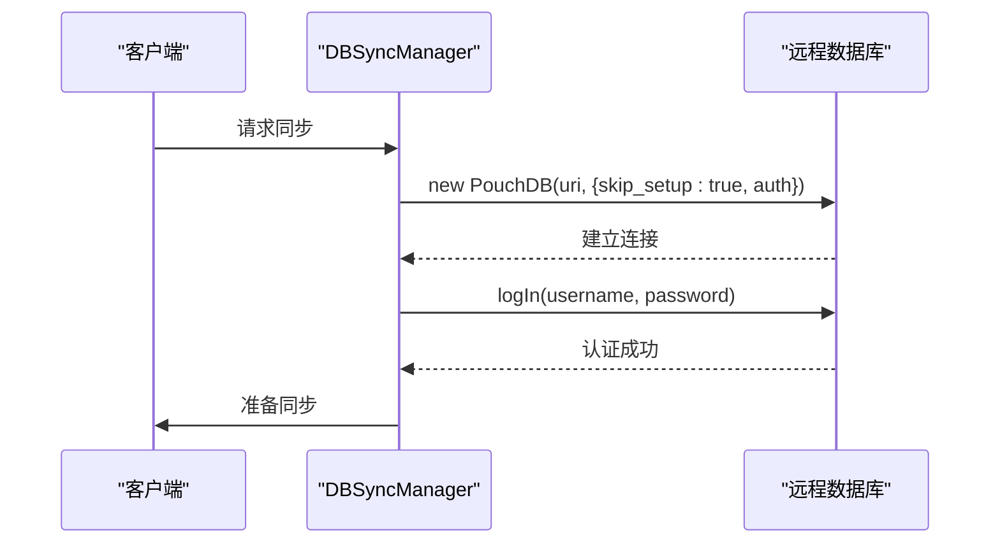
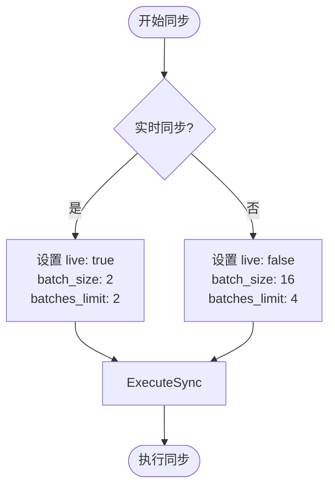
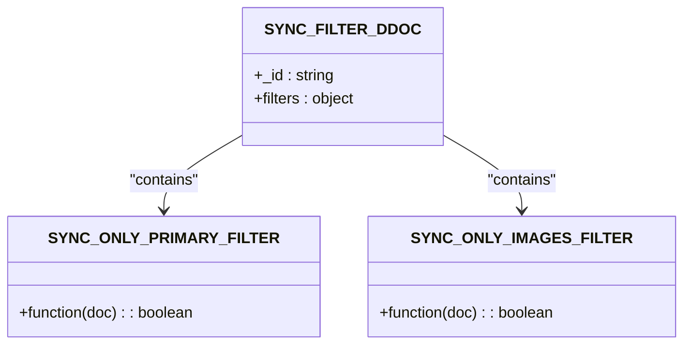
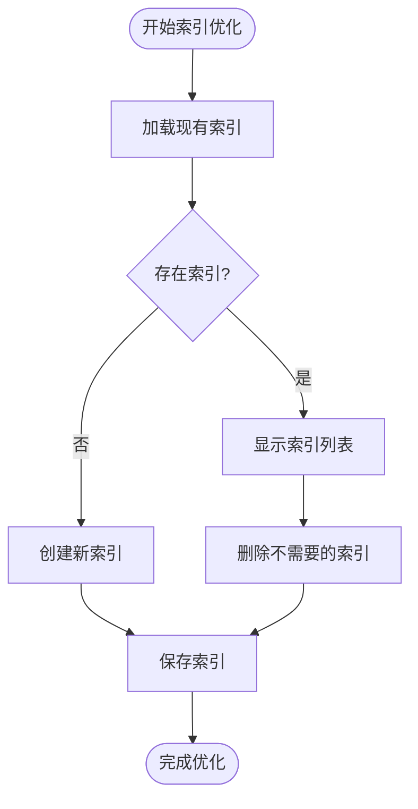
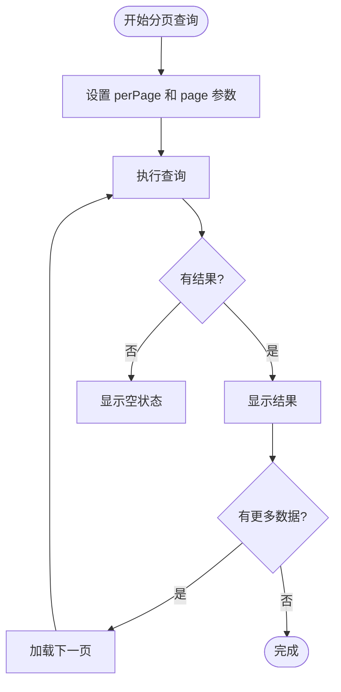
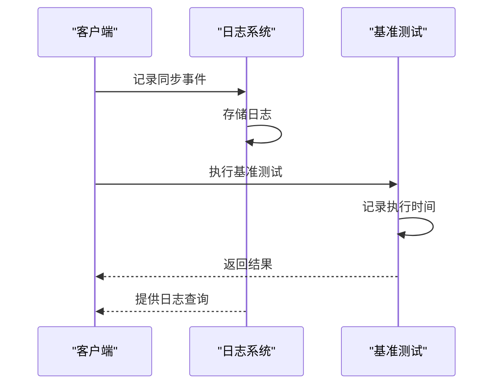

# 性能优化

<cite>
**本文档引用的文件**   
- [DBSyncManager.tsx](file://App/app/features/db-sync/DBSyncManager.tsx)
- [pouchdb.ts](file://App/app/db/pouchdb.ts)
- [PouchDBIndexesScreen.tsx](file://App/app/screens/dev-tools/pouchdb/PouchDBIndexesScreen.tsx)
- [DatabaseManagementScreen.tsx](file://App/app/screens/DatabaseManagementScreen.tsx)
- [BenchmarkScreen.tsx](file://App/app/screens/dev-tools/BenchmarkScreen.tsx)
- [logger.ts](file://App/app/logger/logger.ts)
- [pouchdb+8.0.1.patch](file://App/patches/pouchdb+8.0.1.patch)
</cite>

## 目录
1. [简介](#简介)
2. [连接复用与认证管理](#连接复用与认证管理)
3. [批量操作与变更流控制](#批量操作与变更流控制)
4. [过滤与查询优化](#过滤与查询优化)
5. [索引优化策略](#索引优化策略)
6. [内存与大数据集处理](#内存与大数据集处理)
7. [性能监控与诊断](#性能监控与诊断)
8. [实际调优案例](#实际调优案例)

## 简介
本指南详细阐述了CouchDB数据同步的性能优化技术，涵盖连接复用、批量操作、变更流限流、索引优化等关键技术点。通过分析代码库中的实现细节，提供如何通过调整`batch_size`、`timeout`、`heartbeat`等参数提升同步效率，如何利用`filter`和`query_params`减少不必要的数据传输。同时介绍本地PouchDB查询优化策略、内存使用控制和大数据集分页同步方案，以及性能监控指标采集方法和瓶颈诊断工具。

**Section sources**
- [DBSyncManager.tsx](file://App/app/features/db-sync/DBSyncManager.tsx#L1-L743)

## 连接复用与认证管理
在移动应用中，频繁建立和断开数据库连接会消耗大量资源。本项目通过`getAuthenticatedRemoteDB`函数实现连接复用和认证管理。该函数在连接时使用`skip_setup: true`选项跳过初始设置，并通过`auth`对象提供用户名和密码进行认证。此外，通过`fetch`包装器记录HTTP错误，确保连接的稳定性和可诊断性。

**Diagram sources**
- [DBSyncManager.tsx](file://App/app/features/db-sync/DBSyncManager.tsx#L77-L107)

## 批量操作与变更流控制
批量操作是提升同步效率的关键。项目中定义了`BATCH_SIZE = 16`和`BATCHES_LIMIT = 4`作为默认的批量大小和限制。在同步过程中，通过`_startSync`函数配置`batch_size`和`batches_limit`参数，实现高效的数据传输。对于实时同步，使用`live: true`模式，并设置较小的批量大小以减少延迟。

**Diagram sources**
- [DBSyncManager.tsx](file://App/app/features/db-sync/DBSyncManager.tsx#L32-L33)
- [DBSyncManager.tsx](file://App/app/features/db-sync/DBSyncManager.tsx#L469-L472)
- [DBSyncManager.tsx](file://App/app/features/db-sync/DBSyncManager.tsx#L566-L569)

## 过滤与查询优化
通过设计文档（Design Document）中的过滤器，可以有效减少不必要的数据传输。项目中定义了两个过滤器：`only_primary`用于同步主要数据，`only_images`用于同步图片数据。这些过滤器通过`filter`参数在同步时应用，确保只传输所需的数据。

**Diagram sources**
- [DBSyncManager.tsx](file://App/app/features/db-sync/DBSyncManager.tsx#L18-L30)

## 索引优化策略
索引是提升查询性能的关键。项目提供了`PouchDBIndexesScreen`用于管理和优化索引。通过`createIndex`和`deleteIndex`方法，可以动态创建和删除索引。此外，`explain`方法可用于分析查询计划，帮助优化索引设计。

**Diagram sources**
- [PouchDBIndexesScreen.tsx](file://App/app/screens/dev-tools/pouchdb/PouchDBIndexesScreen.tsx#L43-L54)
- [PouchDBIndexesScreen.tsx](file://App/app/screens/dev-tools/pouchdb/PouchDBIndexesScreen.tsx#L98-L114)

## 内存与大数据集处理
对于大数据集，分页同步是必要的。项目中通过`perPage`和`page`参数实现分页查询。此外，`UIGroupPaginator`组件提供了用户友好的分页界面，支持自定义每页显示数量和快速跳转。

**Diagram sources**
- [DataListScreen.tsx](file://App/app/screens/dev-tools/data/DataListScreen.tsx#L197-L253)
- [UIGroupPaginator.tsx](file://App/app/components/UIGroupPaginator/UIGroupPaginator.tsx#L1-L100)

## 性能监控与诊断
性能监控是优化的基础。项目中通过`logger`模块记录详细的同步日志，包括连接状态、同步进度和错误信息。此外，`BenchmarkScreen`提供了性能基准测试功能，可以测量不同操作的执行时间，帮助识别性能瓶颈。

**Diagram sources**
- [logger.ts](file://App/app/logger/logger.ts#L1-L193)
- [BenchmarkScreen.tsx](file://App/app/screens/dev-tools/BenchmarkScreen.tsx#L136-L181)

## 实际调优案例
在实际应用中，通过调整`batch_size`和`batches_limit`参数，可以显著提升同步速度。例如，在初始同步时使用较大的批量大小（`batch_size: 16`），而在实时同步时使用较小的批量大小（`batch_size: 2`）以减少延迟。此外，通过合理设计索引和过滤器，可以减少不必要的数据传输，进一步提升性能。

**Section sources**
- [DBSyncManager.tsx](file://App/app/features/db-sync/DBSyncManager.tsx#L469-L472)
- [DBSyncManager.tsx](file://App/app/features/db-sync/DBSyncManager.tsx#L566-L569)
- [PouchDBIndexesScreen.tsx](file://App/app/screens/dev-tools/pouchdb/PouchDBIndexesScreen.tsx#L98-L114)
- [DBSyncManager.tsx](file://App/app/features/db-sync/DBSyncManager.tsx#L25-L29)