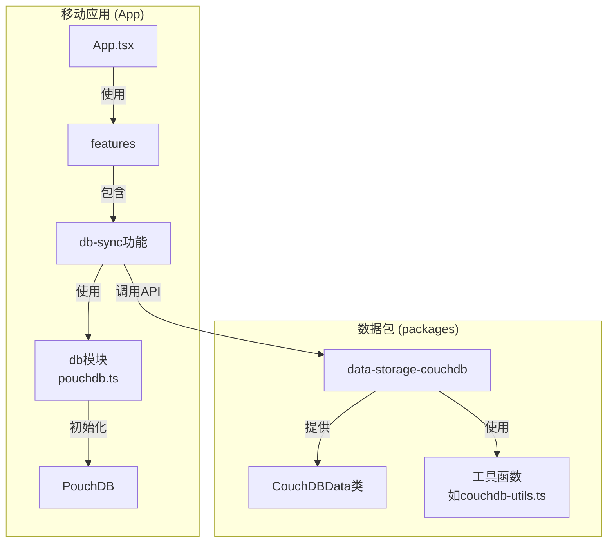
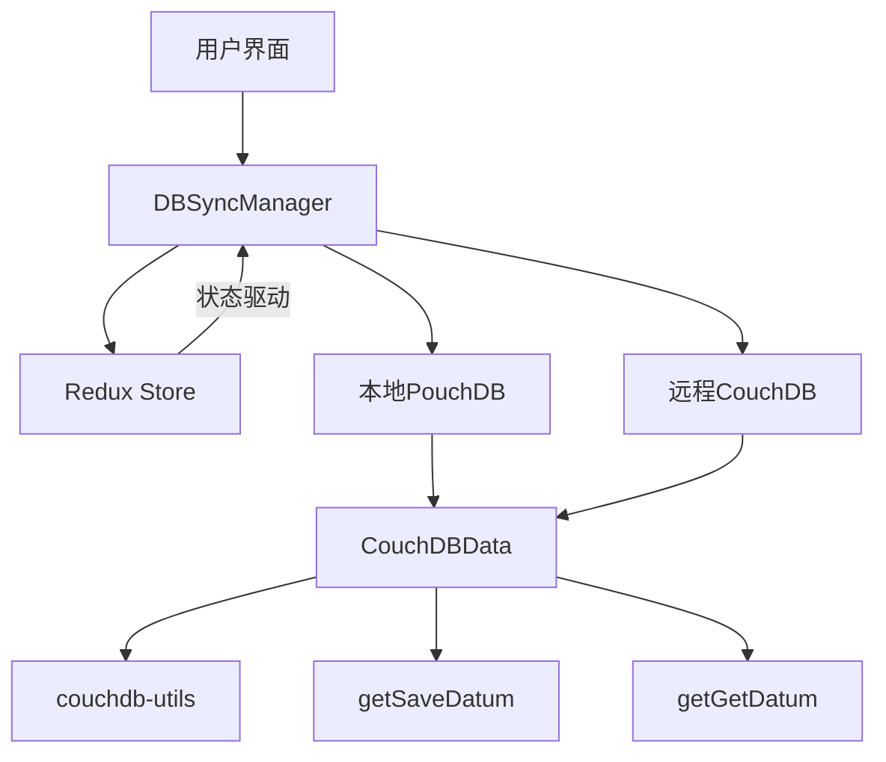
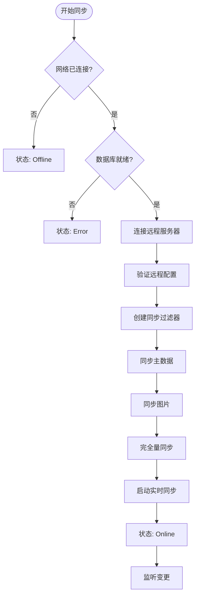
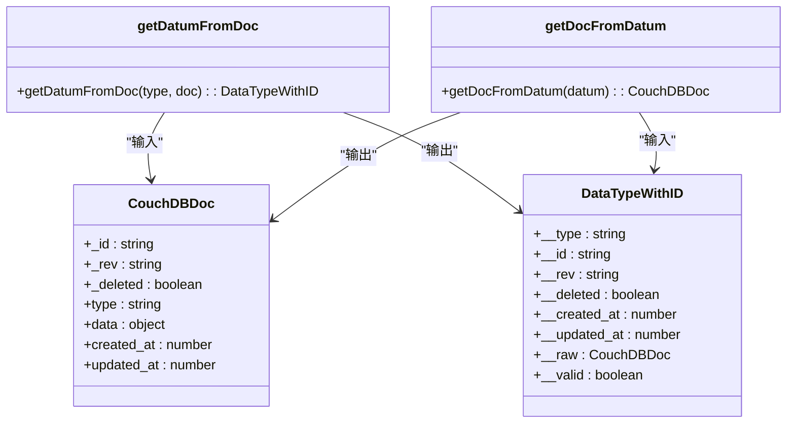
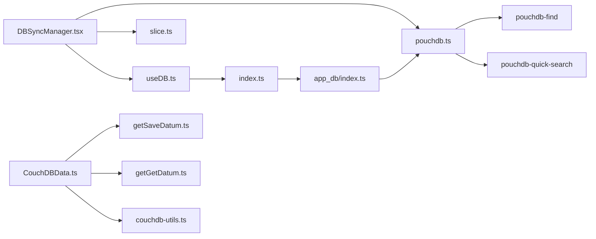

# 数据同步机制

<cite>
**本文档引用的文件**
- [pouchdb.ts](file://App/app/db/pouchdb.ts)
- [DBSyncManager.tsx](file://App/app/features/db-sync/DBSyncManager.tsx)
- [slice.ts](file://App/app/features/db-sync/slice.ts)
- [CouchDBData.ts](file://packages/data-storage-couchdb/lib/CouchDBData.ts)
- [couchdb-utils.ts](file://packages/data-storage-couchdb/lib/functions/couchdb-utils.ts)
- [getSaveDatum.ts](file://packages/data-storage-couchdb/lib/functions/getSaveDatum.ts)
- [getGetDatum.ts](file://packages/data-storage-couchdb/lib/functions/getGetDatum.ts)
- [useDB.ts](file://App/app/db/hooks/useDB.ts)
- [index.ts](file://App/app/db/app_db/index.ts)
</cite>

## 目录
1. [简介](#简介)
2. [项目结构](#项目结构)
3. [核心组件](#核心组件)
4. [架构概述](#架构概述)
5. [详细组件分析](#详细组件分析)
6. [依赖分析](#依赖分析)
7. [性能考虑](#性能考虑)
8. [故障排除指南](#故障排除指南)
9. [结论](#结论)

## 简介
本文档深入解析了基于CouchDB和PouchDB的双向数据同步核心机制。系统通过在本地移动设备上使用PouchDB，在远程服务器上使用CouchDB，实现了强大的离线优先和数据同步功能。同步过程由`DBSyncManager`组件驱动，它负责管理与一个或多个远程CouchDB服务器的连接、认证和双向同步。系统利用CouchDB的变更流（_changes feed）来实现增量同步，通过序列号（seq）跟踪来确保数据的一致性。同步过程分为启动同步和实时同步两个阶段，并应用了过滤器来优化同步内容。此外，文档还涵盖了冲突检测与解决、数据转换、批处理逻辑以及性能监控等关键方面。

## 项目结构
该项目是一个典型的React Native应用，其数据同步功能主要集中在`App/app/features/db-sync`和`packages/data-storage-couchdb`两个目录中。`App`目录包含移动应用的前端代码，其中`db`子目录封装了PouchDB数据库的初始化和访问，`features/db-sync`则包含了同步功能的UI和核心逻辑。`packages`目录包含可复用的Node.js包，其中`data-storage-couchdb`提供了与CouchDB交互的通用数据访问层。这种分离设计使得数据访问逻辑可以在不同环境中（如移动应用和后端服务）复用。

**图表来源**
- [pouchdb.ts](file://App/app/db/pouchdb.ts#L1-L102)
- [DBSyncManager.tsx](file://App/app/features/db-sync/DBSyncManager.tsx#L1-L743)
- [CouchDBData.ts](file://packages/data-storage-couchdb/lib/CouchDBData.ts#L1-L97)

**本节来源**
- [pouchdb.ts](file://App/app/db/pouchdb.ts#L1-L102)
- [DBSyncManager.tsx](file://App/app/features/db-sync/DBSyncManager.tsx#L1-L743)
- [CouchDBData.ts](file://packages/data-storage-couchdb/lib/CouchDBData.ts#L1-L97)

## 核心组件
系统的核心是`DBSyncManager`组件，它是一个React函数组件，负责协调整个同步过程。它通过监听Redux状态（如`dbSyncEnabled`和`servers`）来决定何时启动或停止同步。该组件利用`useDB` Hook获取当前的本地PouchDB数据库实例，并通过`getAuthenticatedRemoteDB`函数为每个配置的服务器创建一个经过身份验证的远程CouchDB连接。同步的核心逻辑由`_startSync`和`startSync`函数实现，它们使用PouchDB的`sync`方法来建立双向数据流。`DBSyncManager`还负责处理网络状态变化，确保在设备离线时暂停同步，并在恢复连接后重新启动。

**本节来源**
- [DBSyncManager.tsx](file://App/app/features/db-sync/DBSyncManager.tsx#L1-L743)
- [useDB.ts](file://App/app/db/hooks/useDB.ts#L1-L80)

## 架构概述
系统的整体架构遵循客户端-服务器模式，其中本地PouchDB数据库作为客户端，远程CouchDB服务器作为服务端。`DBSyncManager`作为同步协调器，位于应用逻辑层，它通过Redux状态管理来控制同步的生命周期。数据访问层由`CouchDBData`类和一系列`get*`函数构成，它们为上层应用提供了统一的数据操作接口（如`saveDatum`, `getDatum`），并负责将应用数据模型与底层CouchDB文档格式进行转换。这种分层架构清晰地分离了关注点，使得同步逻辑、数据访问和业务逻辑可以独立演进。

**图表来源**
- [DBSyncManager.tsx](file://App/app/features/db-sync/DBSyncManager.tsx#L1-L743)
- [CouchDBData.ts](file://packages/data-storage-couchdb/lib/CouchDBData.ts#L1-L97)
- [couchdb-utils.ts](file://packages/data-storage-couchdb/lib/functions/couchdb-utils.ts#L1-L351)

## 详细组件分析

### DBSyncManager 分析
`DBSyncManager`是整个同步系统的大脑。它通过`useEffect` Hook监听`dbSyncEnabled`、网络状态和服务器配置的变化。当所有条件满足时，它会遍历所有启用的服务器，并为每个服务器调用`startSync`函数来启动同步过程。

#### 启动同步流程

**图表来源**
- [DBSyncManager.tsx](file://App/app/features/db-sync/DBSyncManager.tsx#L639-L722)

#### 同步事件处理
`_startSync`函数是同步的核心，它为PouchDB的同步句柄注册了多个事件监听器：
- **change**: 当同步过程中有文档被推送或拉取时触发。此事件会更新Redux中的同步进度，包括本地和远程的更新序列号（update_seq）以及推送/拉取的最后序列号（last_seq）。
- **complete**: 当一次同步批次完成时触发。它会记录最终的序列号，并在启动同步成功后切换到实时同步模式。
- **error**: 处理同步过程中的任何错误，并更新服务器状态为“Error”。
- **paused** 和 **active**: 监控同步的暂停和恢复状态。

**本节来源**
- [DBSyncManager.tsx](file://App/app/features/db-sync/DBSyncManager.tsx#L253-L410)

### 数据访问层分析
`CouchDBData`类是数据访问层的入口，它在构造函数中实例化了所有数据操作函数，如`saveDatum`和`getDatum`。这些函数通过闭包捕获了数据库连接和上下文信息，从而可以安全地在应用的任何地方调用。

#### 数据转换机制
`couchdb-utils.ts`文件中的`getDatumFromDoc`和`getDocFromDatum`函数负责在CouchDB文档和应用数据模型之间进行双向转换。`getDatumFromDoc`接收一个CouchDB文档，验证其数据类型，并返回一个带有额外元信息（如`__type`, `__id`, `__rev`）的代理对象。`getDocFromDatum`则执行相反的操作，将应用数据模型转换为符合CouchDB格式的文档。

**图表来源**
- [couchdb-utils.ts](file://packages/data-storage-couchdb/lib/functions/couchdb-utils.ts#L66-L351)

#### 冲突处理与数据保存
`getSaveDatum.ts`中的`writeDatum`函数是处理数据保存和冲突的核心。当调用`db.put()`时，PouchDB/CouchDB会根据文档的`_rev`（修订版）来检测冲突。如果本地文档的`_rev`与服务器上的不匹配，保存操作将失败并抛出一个冲突错误。在`DBSyncManager`的同步流程中，这种冲突会通过变更流被自动检测和解决，通常采用“最后写入获胜”（Last Write Wins）的策略，即后保存的版本会覆盖先保存的版本。

**本节来源**
- [getSaveDatum.ts](file://packages/data-storage-couchdb/lib/functions/getSaveDatum.ts#L1-L141)
- [getGetDatum.ts](file://packages/data-storage-couchdb/lib/functions/getGetDatum.ts#L1-L42)

## 依赖分析
系统的主要依赖关系如下图所示。`DBSyncManager`直接依赖于`pouchdb.ts`提供的PouchDB实例和`slice.ts`中的Redux状态。`CouchDBData`类则依赖于`packages`目录下的各种`get*`函数来实现具体的数据操作。值得注意的是，`pouchdb.ts`文件通过`require`动态加载了`pouchdb-find`和`pouchdb-quick-search`等插件，这些插件扩展了PouchDB的功能，但并未在`package.json`中作为直接依赖列出，而是通过补丁文件（patches）进行管理。

**图表来源**
- [DBSyncManager.tsx](file://App/app/features/db-sync/DBSyncManager.tsx#L1-L743)
- [pouchdb.ts](file://App/app/db/pouchdb.ts#L1-L102)
- [CouchDBData.ts](file://packages/data-storage-couchdb/lib/CouchDBData.ts#L1-L97)

## 性能考虑
系统在设计上考虑了多项性能优化：
1.  **增量同步**: 通过`_changes` feed和序列号跟踪，只同步自上次同步以来发生变更的数据，极大地减少了网络传输量。
2.  **数据过滤**: 在`DBSyncManager`中定义了`SYNC_FILTER_DDOC`设计文档，其中包含`only_primary`和`only_images`两个过滤器。这允许在启动同步时分阶段同步不同类型的数据（如先同步主数据，再同步大体积的图片），避免一次性加载过多数据。
3.  **批处理**: 同步操作使用`batch_size`和`batches_limit`参数进行批处理，平衡了网络请求的频率和单次请求的数据量。
4.  **防抖更新**: `updateSyncProgress`函数使用了防抖技术，确保同步进度的更新不会过于频繁地触发Redux状态更新，从而避免UI卡顿。
5.  **本地缓存**: 通过Redux和`useDB` Hook，本地数据库实例被缓存，避免了重复创建数据库连接的开销。

## 故障排除指南
当同步出现问题时，可以参考以下步骤进行排查：
1.  **检查网络状态**: 确保设备已连接到互联网，且可以访问配置的CouchDB服务器URI。
2.  **验证服务器配置**: 检查服务器的用户名、密码和URI是否正确。`getAuthenticatedRemoteDB`函数会尝试登录并验证配置的有效性。
3.  **查看日志**: 应用内置了详细的日志记录功能。可以通过`DBSyncScreen`中的“View Logs”选项查看`DBSyncManager`模块的日志，其中包含了连接、同步和错误的详细信息。
4.  **检查数据库状态**: 在`DBSyncServerDetailScreen`中，可以查看服务器的“Docs”数量，对比本地和远程的文档计数，判断同步是否正常进行。
5.  **处理冲突**: 如果出现数据冲突，系统通常会自动解决。但如果需要手动干预，可以检查文档的`_rev`字段来追踪修订历史。

**本节来源**
- [DBSyncManager.tsx](file://App/app/features/db-sync/DBSyncManager.tsx#L76-L204)
- [DBSyncScreen.tsx](file://App/app/features/db-sync/screens/DBSyncScreen.tsx#L1-L92)
- [DBSyncServerDetailScreen.tsx](file://App/app/features/db-sync/screens/DBSyncServerDetailScreen.tsx#L1-L290)

## 结论
该系统实现了一个健壮且功能丰富的CouchDB双向数据同步解决方案。通过精心设计的分层架构，它成功地将同步逻辑、数据访问和业务逻辑解耦。系统利用PouchDB和CouchDB的原生功能，实现了高效的增量同步、自动冲突解决和离线数据访问。其模块化的设计和详细的日志记录使得系统易于维护和调试。未来可以进一步优化的方向包括实现更复杂的冲突解决策略（如基于版本向量的合并）、更精细的网络带宽控制以及对大数据集的分页同步支持。