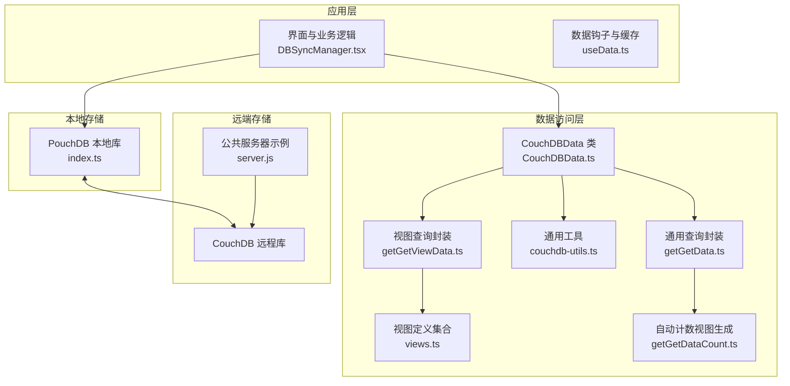
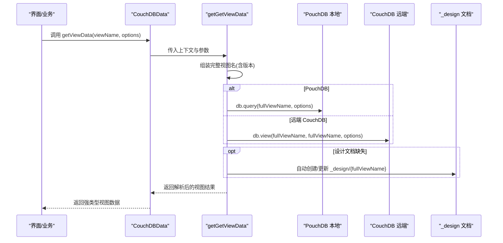
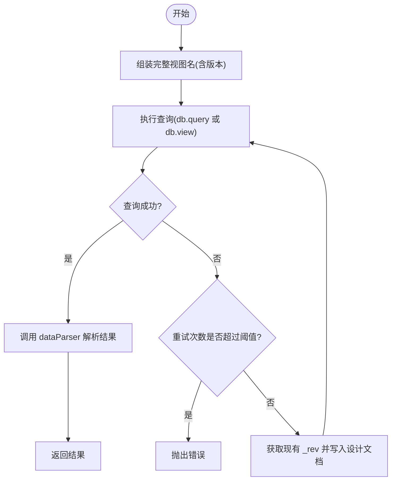
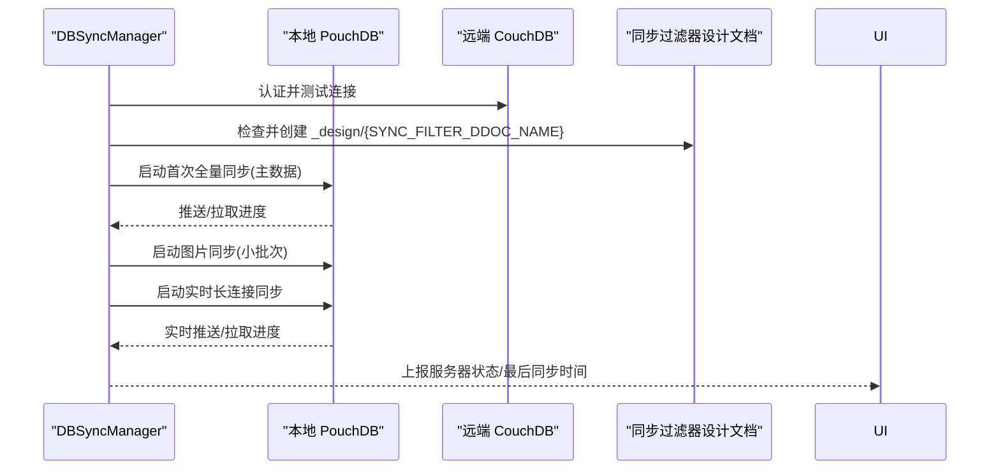
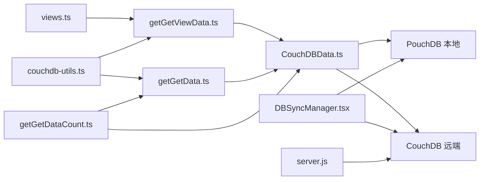

# 视图与查询同步

<cite>
**本文引用的文件列表**
- [views.ts](file://packages/data-storage-couchdb/lib/views.ts)
- [getGetViewData.ts](file://packages/data-storage-couchdb/lib/functions/getGetViewData.ts)
- [CouchDBData.ts](file://packages/data-storage-couchdb/lib/CouchDBData.ts)
- [couchdb-utils.ts](file://packages/data-storage-couchdb/lib/functions/couchdb-utils.ts)
- [getGetData.ts](file://packages/data-storage-couchdb/lib/functions/getGetData.ts)
- [getGetDataCount.ts](file://packages/data-storage-couchdb/lib/functions/getGetDataCount.ts)
- [DBSyncManager.tsx](file://App/app/features/db-sync/DBSyncManager.tsx)
- [index.ts](file://App/app/db/app_db/index.ts)
- [server.js](file://packages/couchdb-public-server/server.js)
- [README.md](file://packages/data-storage-couchdb/README.md)
</cite>

## 目录
1. [简介](#简介)
2. [项目结构](#项目结构)
3. [核心组件](#核心组件)
4. [架构总览](#架构总览)
5. [组件详解](#组件详解)
6. [依赖关系分析](#依赖关系分析)
7. [性能考量](#性能考量)
8. [故障排查指南](#故障排查指南)
9. [结论](#结论)

## 简介
本文件围绕基于 MapReduce 的 CouchDB 视图在 Inventory 项目中的应用，系统阐述以下内容：
- 如何在本地 PouchDB 与远程 CouchDB 之间部署与维护视图设计文档（_design 文档），以保证视图一致性；
- 视图索引的创建、更新与同步机制；
- 通过视图实现复杂的数据过滤、聚合与排序，并在离线/在线模式下保持一致；
- 性能优化建议：索引设计、查询缓存与批量同步策略。

## 项目结构
该仓库采用多包结构，其中与视图与查询同步直接相关的核心模块位于 packages/data-storage-couchdb 与 App/app/features/db-sync 中：
- packages/data-storage-couchdb/lib：封装了 CouchDB/PouchDB 数据访问层，包含视图定义、视图查询封装、通用工具等；
- App/app/features/db-sync：负责本地数据库与远端 CouchDB 的双向同步，包含同步过滤器设计文档的部署与状态管理；
- packages/couchdb-public-server：示例后端服务，用于验证数据库连通性与公开图片接口。

图表来源
- [CouchDBData.ts](file://packages/data-storage-couchdb/lib/CouchDBData.ts#L1-L97)
- [getGetViewData.ts](file://packages/data-storage-couchdb/lib/functions/getGetViewData.ts#L1-L126)
- [views.ts](file://packages/data-storage-couchdb/lib/views.ts#L1-L573)
- [getGetData.ts](file://packages/data-storage-couchdb/lib/functions/getGetData.ts#L47-L257)
- [getGetDataCount.ts](file://packages/data-storage-couchdb/lib/functions/getGetDataCount.ts#L130-L177)
- [couchdb-utils.ts](file://packages/data-storage-couchdb/lib/functions/couchdb-utils.ts#L1-L351)
- [DBSyncManager.tsx](file://App/app/features/db-sync/DBSyncManager.tsx#L1-L743)
- [index.ts](file://App/app/db/app_db/index.ts#L48-L104)
- [server.js](file://packages/couchdb-public-server/server.js#L1-L42)

章节来源
- [README.md](file://packages/data-storage-couchdb/README.md#L1-L63)

## 核心组件
- 视图定义集合：集中定义了多组 MapReduce 视图，覆盖库存统计、过期与临近过期、RFID 标签状态、按货币聚合采购金额等场景；每个视图包含版本号、map 函数、可选 reduce 函数与结果解析器。
- 视图查询封装：统一处理视图名称拼接（前缀+名称+版本）、键范围查询参数、include_docs 控制、错误重试与设计文档自动部署。
- 数据访问类：将配置读取、数据读取、计数、附件、历史、视图查询等能力聚合为统一入口。
- 同步管理器：负责本地与远端数据库的认证、连接、过滤器设计文档部署、批量同步与状态上报。
- 通用工具：文档 ID 生成与解析、选择器扁平化、对象键排序等，支撑查询与视图键设计。

章节来源
- [views.ts](file://packages/data-storage-couchdb/lib/views.ts#L1-L573)
- [getGetViewData.ts](file://packages/data-storage-couchdb/lib/functions/getGetViewData.ts#L1-L126)
- [CouchDBData.ts](file://packages/data-storage-couchdb/lib/CouchDBData.ts#L1-L97)
- [DBSyncManager.tsx](file://App/app/features/db-sync/DBSyncManager.tsx#L1-L743)
- [couchdb-utils.ts](file://packages/data-storage-couchdb/lib/functions/couchdb-utils.ts#L1-L351)

## 架构总览
视图与查询同步的整体流程如下：
- 应用通过 CouchDBData 获取视图数据；
- 视图查询封装根据视图定义生成完整视图名（含版本）并执行查询；
- 若远端 CouchDB 缺少对应设计文档，封装会自动创建或更新；
- 本地 PouchDB 与远端 CouchDB 通过 DBSyncManager 进行分阶段批量同步，确保数据一致性；
- 公共服务器示例用于验证数据库可用性与图片访问。

图表来源
- [getGetViewData.ts](file://packages/data-storage-couchdb/lib/functions/getGetViewData.ts#L1-L126)
- [views.ts](file://packages/data-storage-couchdb/lib/views.ts#L1-L573)
- [CouchDBData.ts](file://packages/data-storage-couchdb/lib/CouchDBData.ts#L1-L97)

## 组件详解

### 视图定义与版本化
- 视图集合通过统一工厂函数定义，包含版本号、map、可选 reduce 与 dataParser；
- 每个视图使用固定前缀与版本号组合成完整视图名，避免命名冲突；
- dataParser 将底层查询结果标准化为上层期望的数据结构，便于类型安全与错误处理。

关键点
- 版本控制：通过版本号确保视图升级时不会破坏旧客户端；
- 结果解析：统一解析 rows、value、doc 等字段，支持带/不带文档详情两种模式；
- 多种聚合：计数、求和、按货币分组求和、复合键排序等。

章节来源
- [views.ts](file://packages/data-storage-couchdb/lib/views.ts#L1-L573)

### 视图查询封装与设计文档部署
- 统一的视图查询入口，支持 key/startKey/endKey/descending/include_docs 等参数；
- 首次查询失败且错误为“missing/not_found”时，自动尝试创建或更新对应设计文档；
- 对于 PouchDB 与远端 CouchDB 分别使用 put/insert 写入设计文档；
- 带重试机制，最多重试若干次，避免瞬时异常导致失败。

图表来源
- [getGetViewData.ts](file://packages/data-storage-couchdb/lib/functions/getGetViewData.ts#L1-L126)

章节来源
- [getGetViewData.ts](file://packages/data-storage-couchdb/lib/functions/getGetViewData.ts#L1-L126)

### 数据访问类与视图集成
- CouchDBData 将各类数据操作（配置、保存、附件、历史、视图）统一注入到实例中；
- 通过上下文传递 db、dbType、logger、logLevels，使各方法具备一致的运行环境；
- 为上层提供强类型接口，降低调用方心智负担。

章节来源
- [CouchDBData.ts](file://packages/data-storage-couchdb/lib/CouchDBData.ts#L1-L97)

### 同步管理器与设计文档部署
- 在连接远端数据库后，确保同步过滤器设计文档存在，不存在则自动创建；
- 使用分阶段批量同步策略：先同步主数据，再同步图片，最后开启实时长连接同步；
- 实时同步过程中持续上报 push/pull 最新序列与本地/远端 update_seq，用于判断同步完成度；
- 支持网络状态变化时重启同步，保障离线/在线切换下的数据一致性。

图表来源
- [DBSyncManager.tsx](file://App/app/features/db-sync/DBSyncManager.tsx#L1-L743)

章节来源
- [DBSyncManager.tsx](file://App/app/features/db-sync/DBSyncManager.tsx#L1-L743)

### 通用工具与查询辅助
- 文档 ID 生成与解析：将类型与业务 ID 映射为 CouchDB 文档 ID，反向解析类型与 ID；
- 选择器扁平化：将嵌套条件转换为点式路径，便于构建查询与索引；
- 对象键排序：按 schema 字段顺序输出，提升索引命中与一致性。

章节来源
- [couchdb-utils.ts](file://packages/data-storage-couchdb/lib/functions/couchdb-utils.ts#L1-L351)

### 通用查询与自动索引
- 通用查询封装支持数组 ID 查询、按类型筛选、条件与排序组合；
- 当未指定排序或条件时，自动生成按 type/_id 的索引设计文档；
- 条件与排序字段组合形成唯一索引名称，避免重复创建；
- 可选强制创建索引，便于调试 explain 输出。

章节来源
- [getGetData.ts](file://packages/data-storage-couchdb/lib/functions/getGetData.ts#L47-L257)

### 自动计数视图与设计文档
- 针对任意类型与条件组合，动态生成计数视图的设计文档；
- 通过 map/reduce 实现条件计数，查询时按 key 精确匹配；
- 在 PouchDB 与远端 CouchDB 场景下分别处理设计文档写入。

章节来源
- [getGetDataCount.ts](file://packages/data-storage-couchdb/lib/functions/getGetDataCount.ts#L130-L177)

## 依赖关系分析
- 视图查询封装依赖视图定义集合与通用工具；
- 数据访问类聚合视图查询与其他数据操作；
- 同步管理器依赖 PouchDB 进行本地/远端双向同步；
- 公共服务器示例用于验证数据库连通性与图片访问。

图表来源
- [views.ts](file://packages/data-storage-couchdb/lib/views.ts#L1-L573)
- [getGetViewData.ts](file://packages/data-storage-couchdb/lib/functions/getGetViewData.ts#L1-L126)
- [couchdb-utils.ts](file://packages/data-storage-couchdb/lib/functions/couchdb-utils.ts#L1-L351)
- [getGetData.ts](file://packages/data-storage-couchdb/lib/functions/getGetData.ts#L47-L257)
- [getGetDataCount.ts](file://packages/data-storage-couchdb/lib/functions/getGetDataCount.ts#L130-L177)
- [CouchDBData.ts](file://packages/data-storage-couchdb/lib/CouchDBData.ts#L1-L97)
- [DBSyncManager.tsx](file://App/app/features/db-sync/DBSyncManager.tsx#L1-L743)
- [server.js](file://packages/couchdb-public-server/server.js#L1-L42)

## 性能考量
- 索引设计
  - 视图键设计应尽量使用复合键，将常用过滤字段与排序字段纳入 key，减少 reduce 阶段的计算压力；
  - 对于高频查询，优先使用 map/reduce 的复合键分组，避免在 reduce 阶段进行大规模聚合；
  - 为视图键选择稳定、高区分度的字段，避免过多重复值导致 reduce 阶段开销增大。
- 查询参数
  - 利用 startKey/endKey 精准限定范围，减少扫描；
  - include_docs 仅在需要文档详情时启用，避免不必要的大文档传输；
  - 对于离线场景，优先使用本地 PouchDB 查询，必要时再回退到远端 CouchDB。
- 批量与重试
  - 同步阶段采用小批次与限流策略，降低网络与存储压力；
  - 视图查询封装内置重试与设计文档自动部署，提高鲁棒性。
- 缓存策略
  - 对于频繁访问的视图结果，可在应用层引入轻量缓存（如内存缓存或持久化缓存），结合版本号与键范围进行失效控制；
  - 对于离线模式，优先使用本地缓存，待网络恢复后再进行增量同步与视图刷新。

## 故障排查指南
- 视图缺失或不可用
  - 现象：查询时报 missing/not_found；
  - 处理：确认视图设计文档已部署；检查版本号是否与当前实现一致；查看日志中自动部署过程的错误信息。
- 同步状态异常
  - 现象：服务器状态停留在 Syncing 或 Error；
  - 处理：检查网络连接与认证信息；查看同步事件回调中的 last_seq 与 update_seq 是否推进；关注 denied/error 事件日志。
- 图片访问失败
  - 现象：公共服务器返回 404 或 500；
  - 处理：确认数据库中是否存在对应图片文档；检查文档类型与附件键是否正确。
- 数据一致性问题
  - 现象：本地与远端数据不一致；
  - 处理：确认同步过滤器设计文档已部署；检查同步批次大小与并发限制；必要时触发全量同步。

章节来源
- [getGetViewData.ts](file://packages/data-storage-couchdb/lib/functions/getGetViewData.ts#L1-L126)
- [DBSyncManager.tsx](file://App/app/features/db-sync/DBSyncManager.tsx#L1-L743)
- [server.js](file://packages/couchdb-public-server/server.js#L1-L42)

## 结论
本项目通过“视图定义 + 查询封装 + 自动设计文档部署 + 分阶段批量同步”的方式，实现了在离线/在线环境下对 CouchDB 视图的高效查询与数据同步。视图版本化与统一解析器确保了跨版本兼容与类型安全；同步管理器的多阶段策略与状态上报提升了用户体验与可观测性。配合合理的索引设计与缓存策略，可在保证一致性的同时获得良好的性能表现。