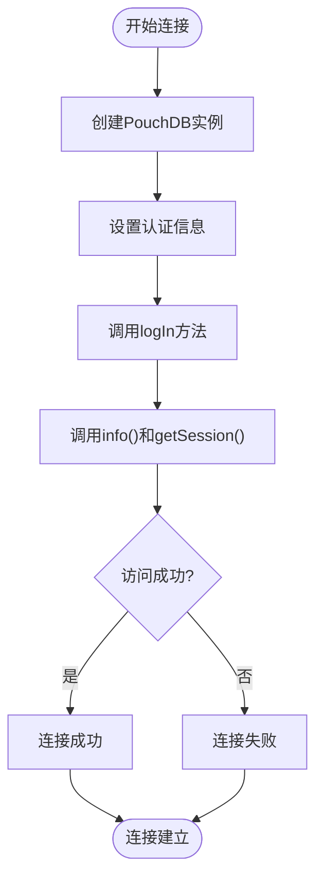
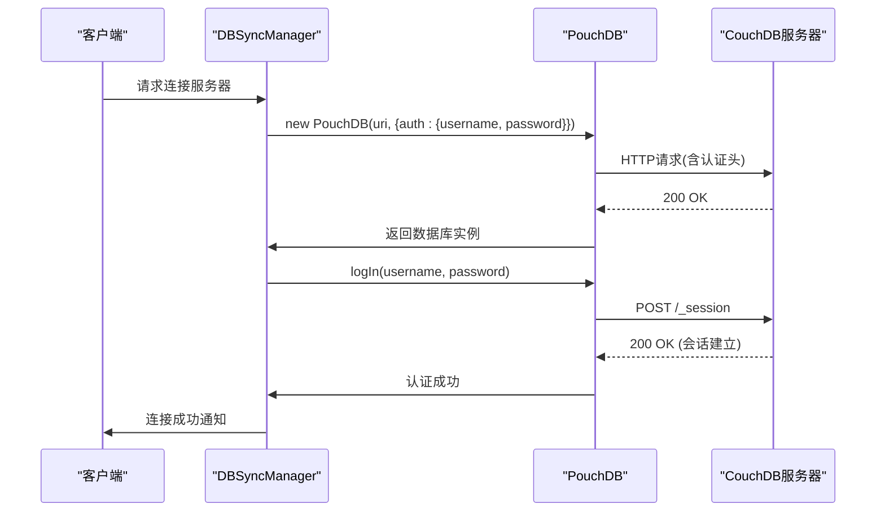
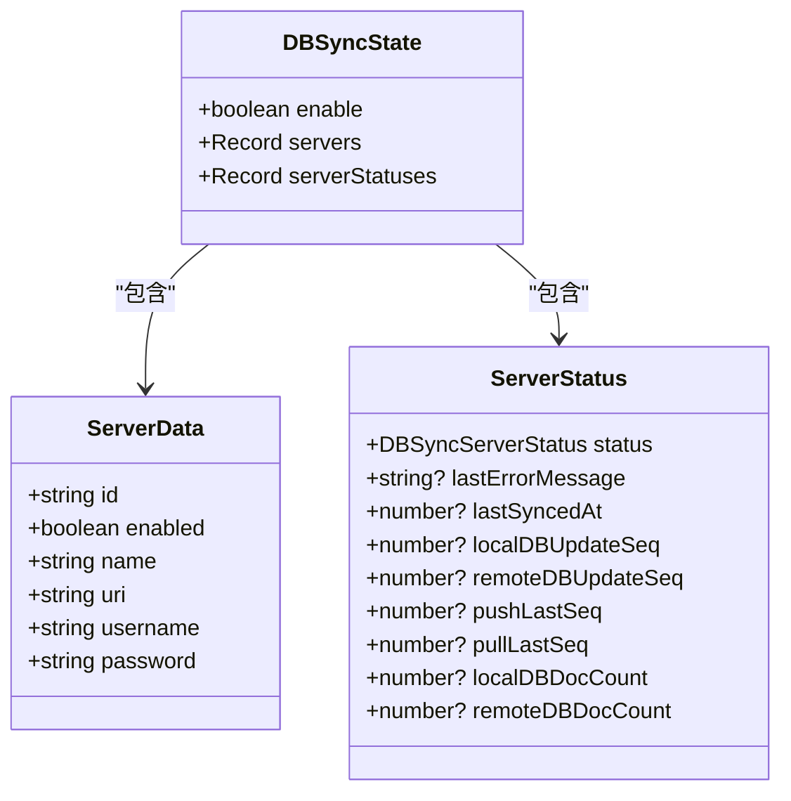
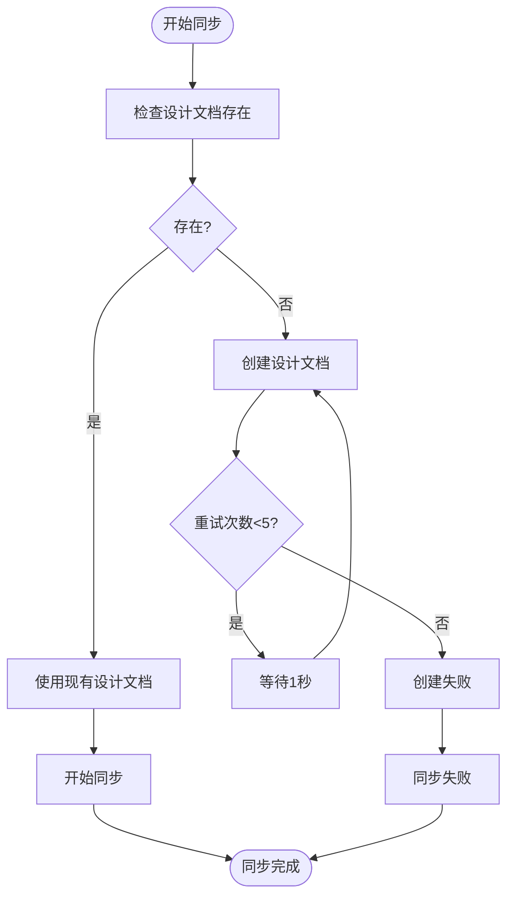
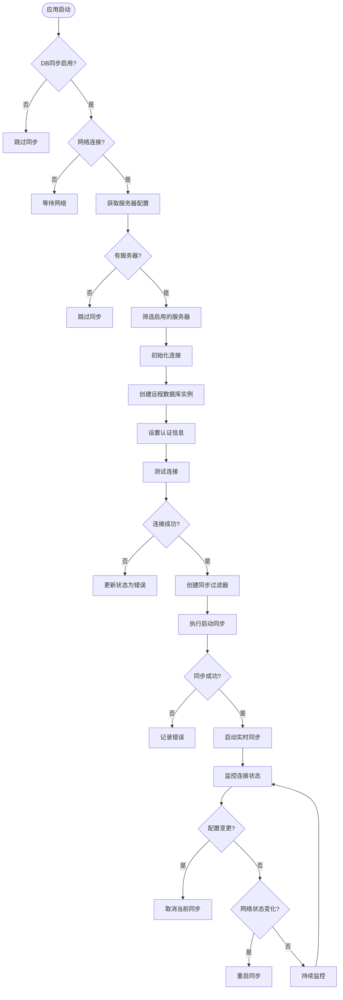

# 连接管理

<cite>
**本文档中引用的文件**  
- [DBSyncManager.tsx](file://App/app/features/db-sync/DBSyncManager.tsx)
- [slice.ts](file://App/app/features/db-sync/slice.ts)
- [useNewOrEditServerUI.tsx](file://App/app/features/db-sync/hooks/useNewOrEditServerUI.tsx)
- [repl.ts](file://packages/data-storage-couchdb/repl.ts)
- [getGetConfig.ts](file://packages/data-storage-couchdb/lib/functions/getGetConfig.ts)
- [getUpdateConfig.ts](file://packages/data-storage-couchdb/lib/functions/getUpdateConfig.ts)
- [configUtils.ts](file://App/app/db/configUtils.ts)
- [pouchdb.ts](file://App/app/db/pouchdb.ts)
</cite>

## 目录
1. [简介](#简介)
2. [连接初始化机制](#连接初始化机制)
3. [认证方式](#认证方式)
4. [连接配置参数](#连接配置参数)
5. [连接状态监控与健康检查](#连接状态监控与健康检查)
6. [同步过滤器与设计文档管理](#同步过滤器与设计文档管理)
7. [错误处理与重连策略](#错误处理与重连策略)
8. [安全最佳实践](#安全最佳实践)
9. [连接管理流程图](#连接管理流程图)

## 简介
本文档详细说明了库存管理应用中CouchDB连接管理的实现机制。核心组件`DBSyncManager`负责初始化和管理与远程CouchDB服务器的连接，支持基本认证方式，并实现了连接超时处理、重试机制和健康检查。文档涵盖了连接配置参数、状态监控、错误处理和安全实践等关键方面。

## 连接初始化机制

`DBSyncManager`通过PouchDB库初始化与远程CouchDB服务器的连接。连接过程包括创建远程数据库实例、验证凭据和测试数据库访问权限。

连接初始化的主要步骤包括：
1. 使用服务器URI创建PouchDB远程数据库实例
2. 通过`auth`配置项提供用户名和密码进行基本认证
3. 调用`logIn`方法重置会话，避免同一主机名使用不同凭据的问题
4. 调用`info()`和`getSession()`方法验证数据库访问权限

**Diagram sources**
- [DBSyncManager.tsx](file://App/app/features/db-sync/DBSyncManager.tsx#L81-L112)

**Section sources**
- [DBSyncManager.tsx](file://App/app/features/db-sync/DBSyncManager.tsx#L80-L189)

## 认证方式

系统采用HTTP基本认证方式连接远程CouchDB服务器。认证信息通过PouchDB的`auth`配置项传递，包含用户名和密码。

认证实现特点：
- 在创建PouchDB实例时直接通过`auth`对象传递凭据
- 调用`logIn`方法确保会话正确建立，避免凭据冲突
- 凭据存储在Redux状态管理中，通过加密存储保护敏感信息

**Diagram sources**
- [DBSyncManager.tsx](file://App/app/features/db-sync/DBSyncManager.tsx#L83-L106)
- [repl.ts](file://packages/data-storage-couchdb/repl.ts#L111-L118)

**Section sources**
- [DBSyncManager.tsx](file://App/app/features/db-sync/DBSyncManager.tsx#L80-L112)

## 连接配置参数

连接配置参数定义了与CouchDB服务器通信所需的所有必要信息，包括服务器URL、数据库名称、凭据等。

### 配置参数详情
- **服务器URI**: 完整的CouchDB服务器地址，包含协议、主机名和端口
- **数据库名称**: URI路径中的数据库名称部分
- **用户名**: 用于基本认证的用户名
- **密码**: 用于基本认证的密码
- **启用状态**: 控制服务器是否参与同步

配置参数通过Redux状态管理，确保敏感信息的安全存储和访问控制。

**Diagram sources**
- [slice.ts](file://App/app/features/db-sync/slice.ts#L51-L57)
- [DBSyncManager.tsx](file://App/app/features/db-sync/DBSyncManager.tsx#L35-L37)

**Section sources**
- [slice.ts](file://App/app/features/db-sync/slice.ts#L49-L347)
- [useNewOrEditServerUI.tsx](file://App/app/features/db-sync/hooks/useNewOrEditServerUI.tsx#L30-L35)

## 连接状态监控与健康检查

系统实现了全面的连接状态监控和健康检查机制，确保连接的可靠性和稳定性。

### 状态监控
- **状态枚举**: 包括"Initializing"、"Connecting"、"Syncing"、"Connected"、"Error"等状态
- **状态更新**: 通过Redux action实时更新服务器状态
- **进度报告**: 在同步过程中持续报告进度信息

### 健康检查
- **连接测试**: 通过`info()`和`getSession()`方法验证连接有效性
- **序列号跟踪**: 监控本地和远程数据库的更新序列号
- **文档计数**: 跟踪本地和远程数据库的文档数量

状态监控数据存储在Redux状态树中，便于UI组件实时显示连接状态。

**Section sources**
- [slice.ts](file://App/app/features/db-sync/slice.ts#L124-L139)
- [DBSyncManager.tsx](file://App/app/features/db-sync/DBSyncManager.tsx#L226-L248)

## 同步过滤器与设计文档管理

系统使用CouchDB的设计文档和过滤器来控制数据同步范围，提高同步效率。

### 同步过滤器
- **主数据过滤器**: `only_primary` - 同步不以"zz"开头的文档
- **图片数据过滤器**: `only_images` - 仅同步以"zz20-image"开头的文档

### 设计文档管理
- **自动创建**: 如果设计文档不存在，则自动创建
- **重试机制**: 最多尝试5次创建，每次间隔1秒
- **版本控制**: 使用`app_sync_v0`作为设计文档名称，便于版本管理

**Diagram sources**
- [DBSyncManager.tsx](file://App/app/features/db-sync/DBSyncManager.tsx#L156-L169)
- [DBSyncManager.tsx](file://App/app/features/db-sync/DBSyncManager.tsx#L18-L30)

**Section sources**
- [DBSyncManager.tsx](file://App/app/features/db-sync/DBSyncManager.tsx#L155-L172)

## 错误处理与重连策略

系统实现了健壮的错误处理和重连策略，确保在网络不稳定情况下的连接可靠性。

### 错误处理
- **网络超时**: 识别`ETIMEDOUT`错误并显示友好提示
- **HTTP错误**: 捕获400及以上状态码的响应，记录详细错误信息
- **连接失败**: 更新服务器状态为"Error"，并存储错误消息

### 重连策略
- **自动重试**: PouchDB同步配置`retry: true`启用自动重试
- **状态重置**: 连接失败后重置为"Initializing"状态，等待下次尝试
- **批量限制**: 设置`batch_size`和`batches_limit`控制同步批量大小

错误信息通过fLogger记录，便于问题诊断和调试。

**Section sources**
- [DBSyncManager.tsx](file://App/app/features/db-sync/DBSyncManager.tsx#L173-L189)
- [DBSyncManager.tsx](file://App/app/features/db-sync/DBSyncManager.tsx#L283-L284)

## 安全最佳实践

系统遵循多项安全最佳实践，保护数据库连接的安全性。

### 凭据保护
- **加密存储**: 敏感信息在Redux状态中加密存储
- **密码移除**: 在日志记录前移除密码信息
- **会话管理**: 每次连接都调用`logIn`重置会话，避免凭据冲突

### 安全配置
- **HTTPS优先**: URI验证确保使用"http://"或"https://"协议
- **输入验证**: 对服务器名称、URI、用户名和密码进行前端验证
- **日志安全**: 敏感信息在日志输出前经过处理

这些安全措施确保了数据库连接的安全性，防止凭据泄露和未授权访问。

**Section sources**
- [useNewOrEditServerUI.tsx](file://App/app/features/db-sync/hooks/useNewOrEditServerUI.tsx#L92-L118)
- [DBSyncManager.tsx](file://App/app/features/db-sync/DBSyncManager.tsx#L88-L98)
- [configUtils.ts](file://App/app/db/configUtils.ts#L18-L28)

## 连接管理流程图

**Diagram sources**
- [DBSyncManager.tsx](file://App/app/features/db-sync/DBSyncManager.tsx#L670-L711)
- [DBSyncManager.tsx](file://App/app/features/db-sync/DBSyncManager.tsx#L453-L516)

**Section sources**
- [DBSyncManager.tsx](file://App/app/features/db-sync/DBSyncManager.tsx#L43-L725)