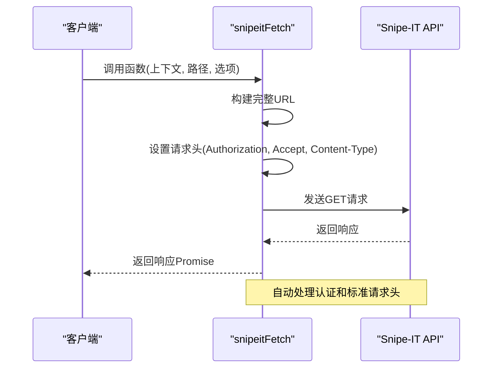
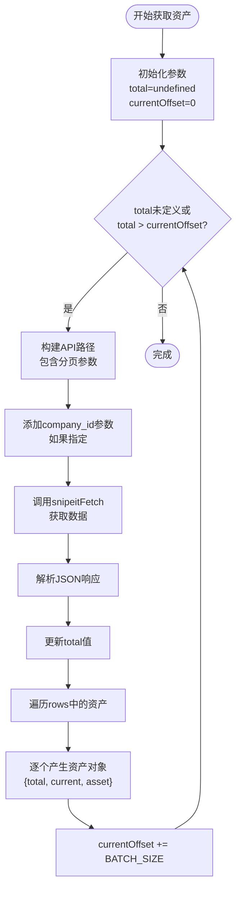
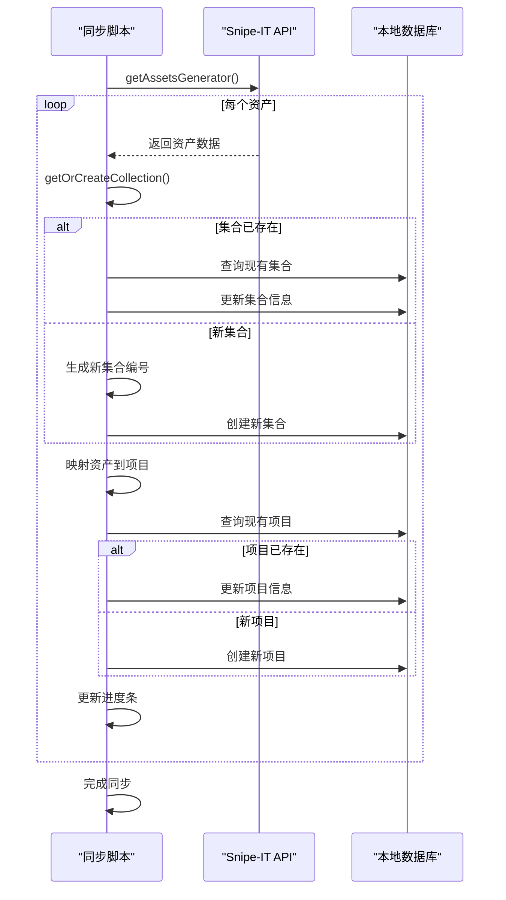

# Snipe-IT集成API

<cite>
**本文档中引用的文件**  
- [snipeitFetch.ts](file://packages/integration-snipe-it/lib/snipe-it-client/functions/snipeitFetch.ts)
- [getAssetsGenerator.ts](file://packages/integration-snipe-it/lib/snipe-it-client/functions/getAssetsGenerator.ts)
- [getAssetById.ts](file://packages/integration-snipe-it/lib/snipe-it-client/functions/getAssetById.ts)
- [types.ts](file://packages/integration-snipe-it/lib/snipe-it-client/types.ts)
- [one-way-sync.ts](file://packages/integration-snipe-it/one-way-sync.ts)
- [getCategories.ts](file://packages/integration-snipe-it/lib/snipe-it-client/functions/getCategories.ts)
- [getCategoryById.ts](file://packages/integration-snipe-it/lib/snipe-it-client/functions/getCategoryById.ts)
- [getCompanies.ts](file://packages/integration-snipe-it/lib/snipe-it-client/functions/getCompanies.ts)
- [getModelById.ts](file://packages/integration-snipe-it/lib/snipe-it-client/functions/getModelById.ts)
- [callbacks.ts](file://Data/lib/callbacks.ts)
</cite>

## 目录
1. [简介](#简介)
2. [核心请求函数实现](#核心请求函数实现)
3. [资产获取接口](#资产获取接口)
4. [Snipe-IT API端点结构](#snipe-it-api端点结构)
5. [资产同步实现示例](#资产同步实现示例)
6. [性能优化建议](#性能优化建议)

## 简介
Snipe-IT集成API提供了一套完整的工具，用于将Snipe-IT资产管理系统中的数据同步到本地库存系统。该集成通过REST API与Snipe-IT通信，实现了资产、分类、公司和模型等资源的获取和同步功能。核心功能包括通用请求处理、分页数据获取、错误处理和数据映射。

## 核心请求函数实现

`snipeitFetch`函数是所有Snipe-IT API调用的基础，负责处理认证、请求头配置和HTTP请求发送。该函数接受上下文对象、API路径和可选的请求初始化参数，返回一个Promise<Response>。

函数通过Context对象获取必要的配置信息，包括fetch函数、基础URL和API密钥。在请求头中自动添加Bearer Token认证，确保所有请求都经过身份验证。同时设置了标准的Accept和Content-Type头，保证与Snipe-IT API的兼容性。



**图示来源**
- [snipeitFetch.ts](file://packages/integration-snipe-it/lib/snipe-it-client/functions/snipeitFetch.ts#L5-L20)

**本节来源**
- [snipeitFetch.ts](file://packages/integration-snipe-it/lib/snipe-it-client/functions/snipeitFetch.ts#L1-L21)

## 资产获取接口

### getAssetsGenerator函数
`getAssetsGenerator`是一个异步生成器函数，用于高效地获取Snipe-IT系统中的所有资产。该函数实现了分页处理机制，通过BATCH_SIZE常量（默认100）控制每次请求的资产数量，避免单次请求数据量过大。

函数支持按公司ID过滤资产，通过在查询参数中添加company_id来实现。返回值是一个AsyncGenerator，逐个产生资产对象，包含总数量、当前序号和资产数据，便于处理大量数据时的进度跟踪。



**图示来源**
- [getAssetsGenerator.ts](file://packages/integration-snipe-it/lib/snipe-it-client/functions/getAssetsGenerator.ts#L14-L50)

### getAssetById函数
`getAssetById`函数用于获取特定ID的资产信息。该函数实现了完善的错误处理机制，能够区分"资产未找到"和其他API错误。当资产不存在时返回null，便于调用者处理；对于其他错误则抛出异常。

函数通过Zod库对响应数据进行类型验证，确保返回的数据结构符合预期。这种类型安全的设计减少了运行时错误的可能性。

**本节来源**
- [getAssetsGenerator.ts](file://packages/integration-snipe-it/lib/snipe-it-client/functions/getAssetsGenerator.ts#L1-L50)
- [getAssetById.ts](file://packages/integration-snipe-it/lib/snipe-it-client/functions/getAssetById.ts#L1-L25)

## Snipe-IT API端点结构

Snipe-IT API采用RESTful设计，资源层次清晰。主要端点包括：

- `/hardware`：资产资源，支持分页、排序和过滤
- `/categories`：分类资源，可通过category_type过滤
- `/companies`：公司资源
- `/models`：模型资源

所有列表端点都支持标准的分页参数：limit（每页数量）、offset（偏移量）、sort（排序字段）和order（排序顺序）。单个资源通过ID在路径中指定，如`/hardware/{id}`。

```mermaid
graph TB
API[Snipe-IT API] --> Hardware[/hardware]
API --> Categories[/categories]
API --> Companies[/companies]
API --> Models[/models]
Hardware --> List["GET /hardware<br/>?limit=100&offset=0"]
Hardware --> Single["GET /hardware/{id}"]
Categories --> ListCat["GET /categories<br/>?category_type=asset"]
Categories --> SingleCat["GET /categories/{id}"]
Companies --> ListComp["GET /companies"]
Companies --> SingleComp["GET /companies/{id}"]
Models --> ListMod["GET /models"]
Models --> SingleMod["GET /models/{id}"]
style Hardware fill:#f9f,stroke:#333
style Categories fill:#f9f,stroke:#333
style Companies fill:#f9f,stroke:#333
style Models fill:#f9f,stroke:#333
classDef endpoint fill:#e6f3ff,stroke:#333,stroke-width:1px;
class List,Single,ListCat,SingleCat,ListComp,SingleComp,ListMod,SingleMod endpoint;
```

**图示来源**
- [getAssetsGenerator.ts](file://packages/integration-snipe-it/lib/snipe-it-client/functions/getAssetsGenerator.ts#L26-L29)
- [getCategories.ts](file://packages/integration-snipe-it/lib/snipe-it-client/functions/getCategories.ts#L25-L25)
- [getCompanies.ts](file://packages/integration-snipe-it/lib/snipe-it-client/functions/getCompanies.ts#L24-L24)
- [getModelById.ts](file://packages/integration-snipe-it/lib/snipe-it-client/functions/getModelById.ts#L11-L11)

**本节来源**
- [getAssetsGenerator.ts](file://packages/integration-snipe-it/lib/snipe-it-client/functions/getAssetsGenerator.ts#L1-L50)
- [getCategories.ts](file://packages/integration-snipe-it/lib/snipe-it-client/functions/getCategories.ts#L1-L39)
- [getCategoryById.ts](file://packages/integration-snipe-it/lib/snipe-it-client/functions/getCategoryById.ts#L1-L25)
- [getCompanies.ts](file://packages/integration-snipe-it/lib/snipe-it-client/functions/getCompanies.ts#L1-L38)
- [getModelById.ts](file://packages/integration-snipe-it/lib/snipe-it-client/functions/getModelById.ts#L1-L25)

## 资产同步实现示例

one-way-sync脚本展示了如何将Snipe-IT资产数据映射到本地数据模型的完整流程。同步过程包括：

1. 建立Snipe-IT上下文和数据库连接
2. 创建或获取对应的本地集合（collection）
3. 将Snipe-IT资产映射到本地项目（item）模型
4. 处理新资产创建和现有资产更新

关键的映射逻辑包括：
- Snipe-IT分类 → 本地集合
- Snipe-IT资产 → 本地项目
- 资产名称和模型信息 → 项目名称
- 时间戳转换（考虑时区）
- HTML实体解码



**图示来源**
- [one-way-sync.ts](file://packages/integration-snipe-it/one-way-sync.ts#L315-L415)

**本节来源**
- [one-way-sync.ts](file://packages/integration-snipe-it/one-way-sync.ts#L1-L443)
- [callbacks.ts](file://Data/lib/callbacks.ts#L35-L247)

## 性能优化建议

### 批量获取策略
使用`getAssetsGenerator`而非逐个获取资产，可以显著减少HTTP请求数量。通过100条/次的批量获取，避免了为每个资产发起单独请求的开销。

### 缓存策略
在同步过程中，使用Map对象缓存已创建或获取的集合对象，避免重复查询数据库。这种内存缓存机制大大提高了处理大量资产时的性能。

### 进度反馈
实现进度条显示，让用户了解同步进度。这对于处理大量数据的长时间操作尤为重要，提升了用户体验。

### 错误处理与日志
完善的错误处理机制确保同步过程不会因单个资产的问题而中断。同时记录详细日志，便于问题排查和审计。

### 数据验证
在保存数据前进行验证，确保数据完整性。使用beforeSave回调自动处理字段标准化、默认值设置和衍生字段计算。

**本节来源**
- [getAssetsGenerator.ts](file://packages/integration-snipe-it/lib/snipe-it-client/functions/getAssetsGenerator.ts#L7-L8)
- [one-way-sync.ts](file://packages/integration-snipe-it/one-way-sync.ts#L169-L172)
- [callbacks.ts](file://Data/lib/callbacks.ts#L35-L247)