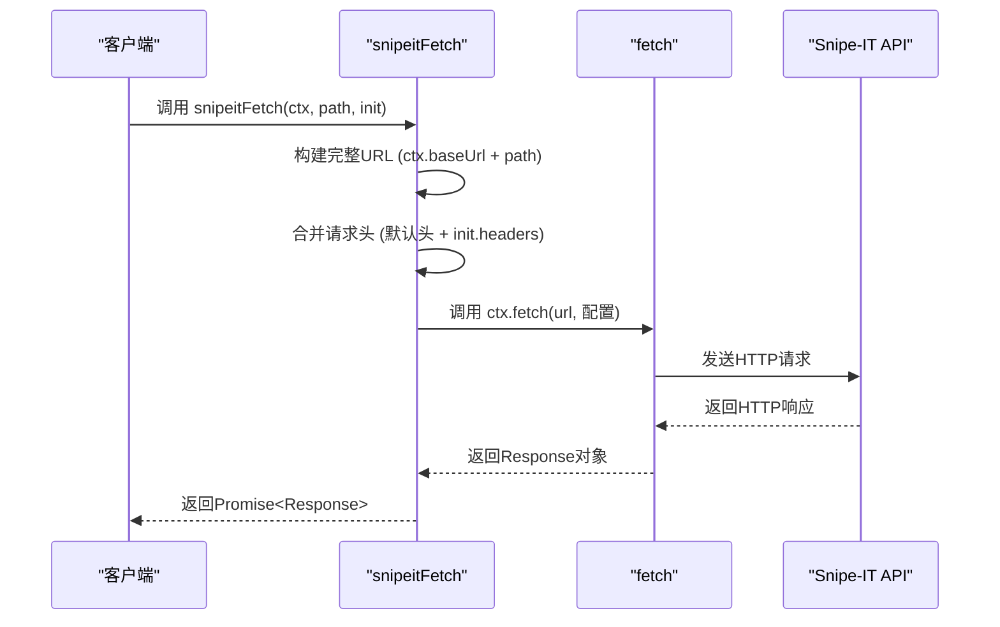
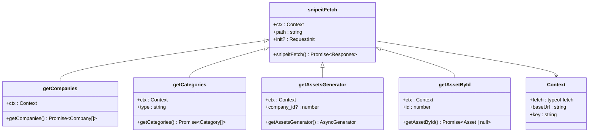

# 核心请求机制

<cite>
**本文档中引用的文件**  
- [snipeitFetch.ts](file://packages/integration-snipe-it/lib/snipe-it-client/functions/snipeitFetch.ts)
- [types.ts](file://packages/integration-snipe-it/lib/snipe-it-client/types.ts)
- [getAssetById.ts](file://packages/integration-snipe-it/lib/snipe-it-client/functions/getAssetById.ts)
- [getAssetsGenerator.ts](file://packages/integration-snipe-it/lib/snipe-it-client/functions/getAssetsGenerator.ts)
- [getCategories.ts](file://packages/integration-snipe-it/lib/snipe-it-client/functions/getCategories.ts)
- [getCompanies.ts](file://packages/integration-snipe-it/lib/snipe-it-client/functions/getCompanies.ts)
- [getModelById.ts](file://packages/integration-snipe-it/lib/snipe-it-client/functions/getModelById.ts)
- [getCategoryById.ts](file://packages/integration-snipe-it/lib/snipe-it-client/functions/getCategoryById.ts)
- [one-way-sync.ts](file://packages/integration-snipe-it/one-way-sync.ts)
- [package.json](file://packages/integration-snipe-it/package.json)
</cite>

## 目录
1. [简介](#简介)
2. [核心请求函数 `snipeitFetch`](#核心请求函数-snipeitfetch)
3. [请求配置与认证机制](#请求配置与认证机制)
4. [错误处理与重试策略](#错误处理与重试策略)
5. [请求配置选项](#请求配置选项)
6. [使用示例](#使用示例)
7. [与其他API函数的集成](#与其他api函数的集成)
8. [最佳实践与常见状态码](#最佳实践与常见状态码)

## 简介
Snipe-IT 集成模块提供了一套完整的 REST API 客户端功能，用于与 Snipe-IT 资产管理系统进行交互。该文档详细解析了核心请求机制，特别是 `snipeitFetch` 函数的实现，以及它如何作为所有其他 API 调用的基础。文档涵盖了认证、错误处理、配置选项和使用模式，确保与 Snipe-IT REST API 的兼容性。

## 核心请求函数 `snipeitFetch`

`snipeitFetch` 函数是整个 Snipe-IT 集成模块的基石，它封装了底层的 `fetch` 请求，为所有 API 调用提供了一致的接口和预设配置。

该函数接收三个参数：
- `ctx`: 包含 `fetch` 函数、基础 URL 和认证密钥的上下文对象。
- `path`: 要请求的 API 端点路径。
- `init`: 可选的 `RequestInit` 对象，用于覆盖默认的请求配置。

函数的主要职责是构建完整的请求 URL，并合并默认的请求头与用户提供的自定义头。

**Section sources**
- [snipeitFetch.ts](file://packages/integration-snipe-it/lib/snipe-it-client/functions/snipeitFetch.ts#L5-L20)

## 请求配置与认证机制

`snipeitFetch` 函数通过 `Context` 类型定义了请求的上下文，该类型包含三个关键属性：`fetch`、`baseUrl` 和 `key`。这种设计将请求逻辑与具体的 HTTP 客户端实现（如 `node-fetch`）解耦，提高了代码的可测试性和灵活性。

### 认证头
函数自动在请求头中添加 `Authorization: Bearer <token>`，其中 `<token>` 来自 `ctx.key`。这是 Snipe-IT API 所需的认证方式。

### 内容类型
所有请求的 `Content-Type` 和 `Accept` 头都被预设为 `application/json`，确保了与 Snipe-IT API 的 JSON 数据交换。

### 请求头合并
函数使用扩展运算符 (`...init?.headers`) 将用户提供的自定义头与默认头进行合并。这允许用户在需要时覆盖默认值，例如添加额外的头信息。



**Diagram sources**
- [snipeitFetch.ts](file://packages/integration-snipe-it/lib/snipe-it-client/functions/snipeitFetch.ts#L10-L19)
- [types.ts](file://packages/integration-snipe-it/lib/snipe-it-client/types.ts#L4-L8)

## 错误处理与重试策略

虽然 `snipeitFetch` 本身不直接包含重试逻辑，但其返回的 `Response` 对象被上层函数用于实现健壮的错误处理。

### 上层错误处理
其他 API 函数（如 `getAssetById`）在调用 `snipeitFetch` 后，会检查响应数据中的 `status` 字段。如果返回 `"error"`，函数会根据 `messages` 字段的内容进行判断：
- 如果是 `"Asset not found"`，则返回 `null`，表示资源不存在。
- 对于其他错误，则抛出包含详细信息的 `Error`，便于上层应用进行处理。

### 网络错误处理
在集成模块的使用示例（如 `one-way-sync.ts`）中，可以看到对网络错误的处理。例如，当 `fetch` 请求超时时，错误码 `ETIMEDOUT` 会被捕获并转换为更友好的错误信息 "Network timeout"。

### 重试机制
虽然在当前分析的代码中未直接实现 `snipeitFetch` 的重试，但项目中其他模块（如数据库同步）展示了重试模式。一个典型的重试策略包括：
- 设置最大重试次数（例如 5 次）。
- 在每次重试前加入延迟（例如 1000 毫秒）。
- 捕获特定的网络或临时错误。

这种模式可以被借鉴并应用于 `snipeitFetch` 的包装器中，以增强其在网络不稳定环境下的可靠性。

**Section sources**
- [getAssetById.ts](file://packages/integration-snipe-it/lib/snipe-it-client/functions/getAssetById.ts#L14-L19)
- [one-way-sync.ts](file://packages/integration-snipe-it/one-way-sync.ts#L185)
- [DBSyncManager.tsx](file://App/app/features/db-sync/DBSyncManager.tsx#L166)

## 请求配置选项

`snipeitFetch` 函数通过 `init` 参数支持灵活的请求配置。

### 自定义头
用户可以通过 `init.headers` 添加或覆盖请求头。例如，可以添加一个自定义的 `X-Client-Version` 头。

### 查询参数
查询参数应直接附加到 `path` 参数中。例如，`/hardware?limit=50&offset=0`。

### 请求方法
尽管 `snipeitFetch` 的默认方法是 `GET`，但可以通过 `init.method` 参数指定其他方法，如 `POST`、`PUT` 或 `DELETE`。

### 其他选项
`RequestInit` 接口还支持 `body`（用于 POST/PUT 请求）、`timeout` 等选项。虽然 `node-fetch` 原生不支持 `timeout`，但可以通过 `AbortController` 实现超时控制。

**Section sources**
- [snipeitFetch.ts](file://packages/integration-snipe-it/lib/snipe-it-client/functions/snipeitFetch.ts#L11-L18)
- [getAssetsGenerator.ts](file://packages/integration-snipe-it/lib/snipe-it-client/functions/getAssetsGenerator.ts#L26-L29)

## 使用示例

以下是如何使用 `snipeitFetch` 及其封装函数发起各种请求的示例。

### 初始化上下文
```javascript
import fetch from 'node-fetch';
const baseUrl = 'https://your-snipeit-domain.com/api/v1';
const key = 'your-api-key';
const ctx = { fetch, baseUrl, key };
```

### GET 请求
获取所有公司信息：
```javascript
import getCompanies from './lib/snipe-it-client/functions/getCompanies';
getCompanies(ctx).then(companies => console.log(companies));
```

获取特定资产：
```javascript
import getAssetById from './lib/snipe-it-client/functions/getAssetById';
getAssetById(ctx, 1).then(asset => console.log(asset));
```

### POST 请求
要发起 POST 请求，可以创建一个封装函数：
```javascript
async function createAsset(ctx, assetData) {
  const response = await snipeitFetch(ctx, '/hardware', {
    method: 'POST',
    body: JSON.stringify(assetData)
  });
  return response.json();
}
```

### PUT 和 DELETE 请求
类似地，可以创建 `updateAsset` 和 `deleteAsset` 函数，将 `method` 分别设置为 `'PUT'` 和 `'DELETE'`。

### 流式获取大量数据
对于可能返回大量数据的端点，`getAssetsGenerator` 提供了异步生成器模式，可以逐个处理资产，避免内存溢出：
```javascript
import getAssetsGenerator from './lib/snipe-it-client/functions/getAssetsGenerator';
(async function () {
  for await (const { total, current, asset } of getAssetsGenerator(ctx)) {
    console.log(`${current}/${total}:`, asset);
  }
})();
```

**Section sources**
- [README.md](file://packages/integration-snipe-it/README.md#L23-L57)
- [one-way-sync.ts](file://packages/integration-snipe-it/one-way-sync.ts#L35-L36)

## 与其他API函数的集成

`snipeitFetch` 是所有其他 API 函数的基础。每个具体的 API 函数（如 `getCompanies`、`getCategories`）都依赖于 `snipeitFetch` 来执行实际的 HTTP 请求。

这种分层架构的优势在于：
- **单一责任**：`snipeitFetch` 只负责处理 HTTP 通信和认证。
- **代码复用**：所有 API 调用共享相同的认证和配置逻辑。
- **易于维护**：如果 Snipe-IT API 的认证方式发生变化，只需修改 `snipeitFetch` 函数。
- **类型安全**：通过 `zod` 库对响应数据进行解析和验证，确保了数据的正确性。



**Diagram sources**
- [snipeitFetch.ts](file://packages/integration-snipe-it/lib/snipe-it-client/functions/snipeitFetch.ts)
- [getCompanies.ts](file://packages/integration-snipe-it/lib/snipe-it-client/functions/getCompanies.ts)
- [getCategories.ts](file://packages/integration-snipe-it/lib/snipe-it-client/functions/getCategories.ts)
- [getAssetsGenerator.ts](file://packages/integration-snipe-it/lib/snipe-it-client/functions/getAssetsGenerator.ts)
- [getAssetById.ts](file://packages/integration-snipe-it/lib/snipe-it-client/functions/getAssetById.ts)
- [types.ts](file://packages/integration-snipe-it/lib/snipe-it-client/types.ts)

## 最佳实践与常见状态码

### 错误处理最佳实践
1. **始终处理 Promise**：使用 `try/catch` 或 `.catch()` 来捕获异步错误。
2. **区分错误类型**：检查错误信息以确定是网络错误、认证失败还是业务逻辑错误。
3. **提供用户反馈**：在应用层面，将技术性错误信息转换为用户友好的提示。
4. **日志记录**：记录详细的错误信息以便于调试。

### 常见HTTP状态码
- **200 OK**: 请求成功，返回了请求的数据。
- **401 Unauthorized**: 认证失败，通常是 API 密钥无效或缺失。
- **404 Not Found**: 请求的资源不存在。
- **429 Too Many Requests**: 请求过于频繁，触发了速率限制。
- **500 Internal Server Error**: 服务器内部错误。

**Section sources**
- [getAssetById.ts](file://packages/integration-snipe-it/lib/snipe-it-client/functions/getAssetById.ts#L14-L19)
- [one-way-sync.ts](file://packages/integration-snipe-it/one-way-sync.ts#L185)
- [getAssetsGenerator.ts](file://packages/integration-snipe-it/lib/snipe-it-client/functions/getAssetsGenerator.ts#L33)