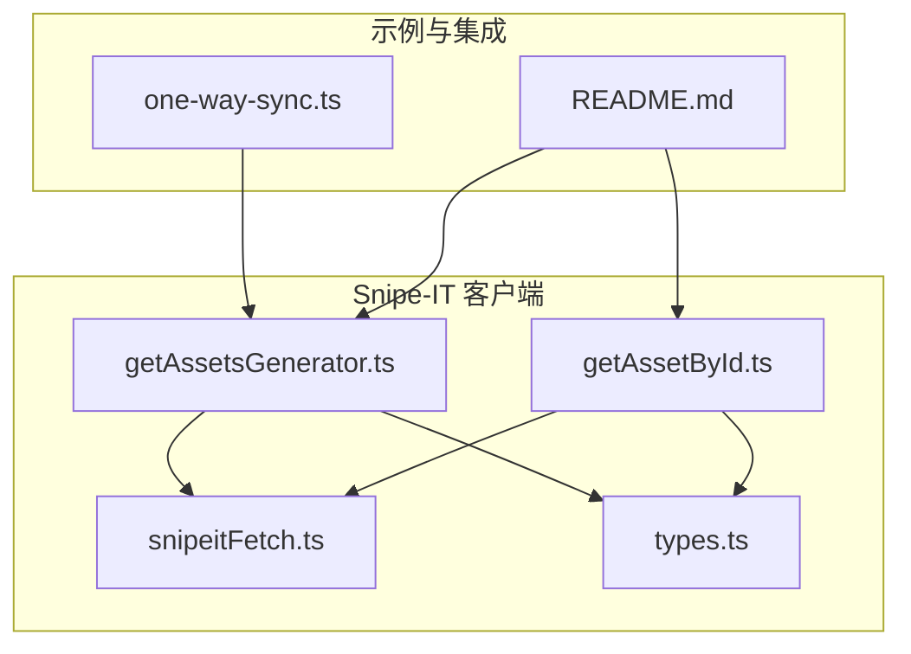
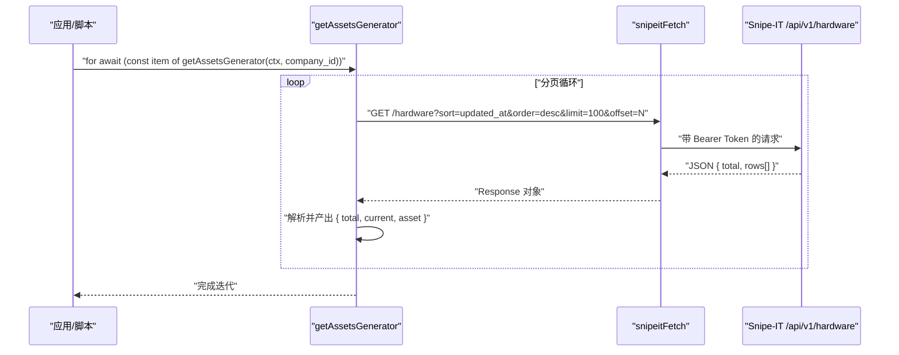
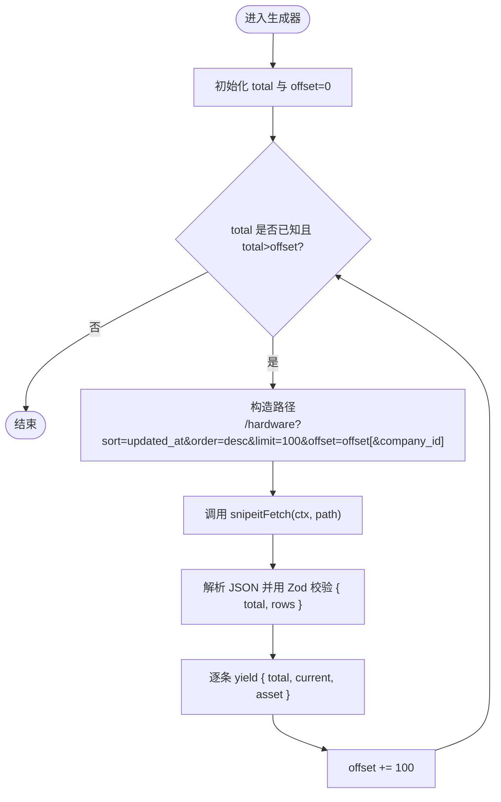
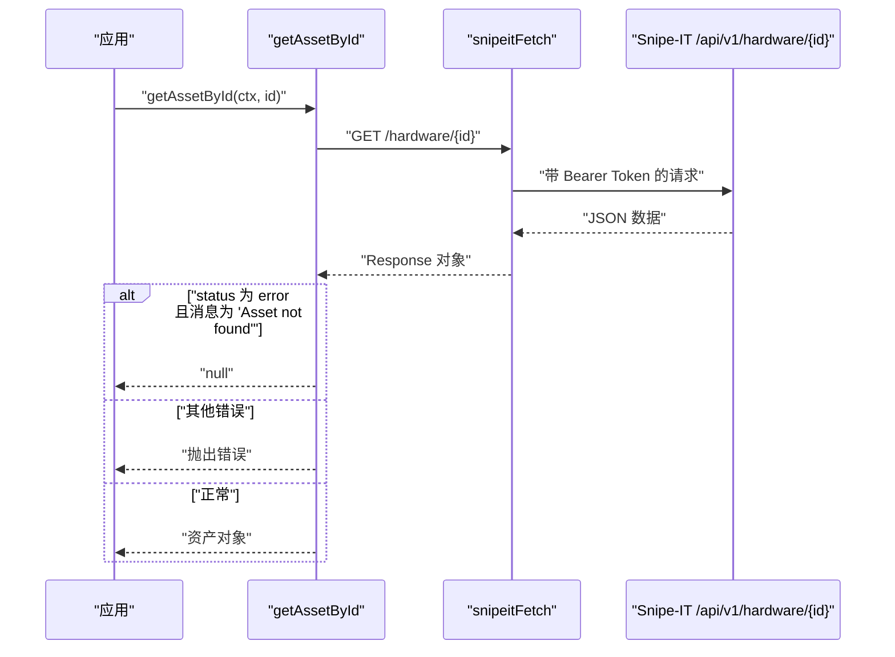
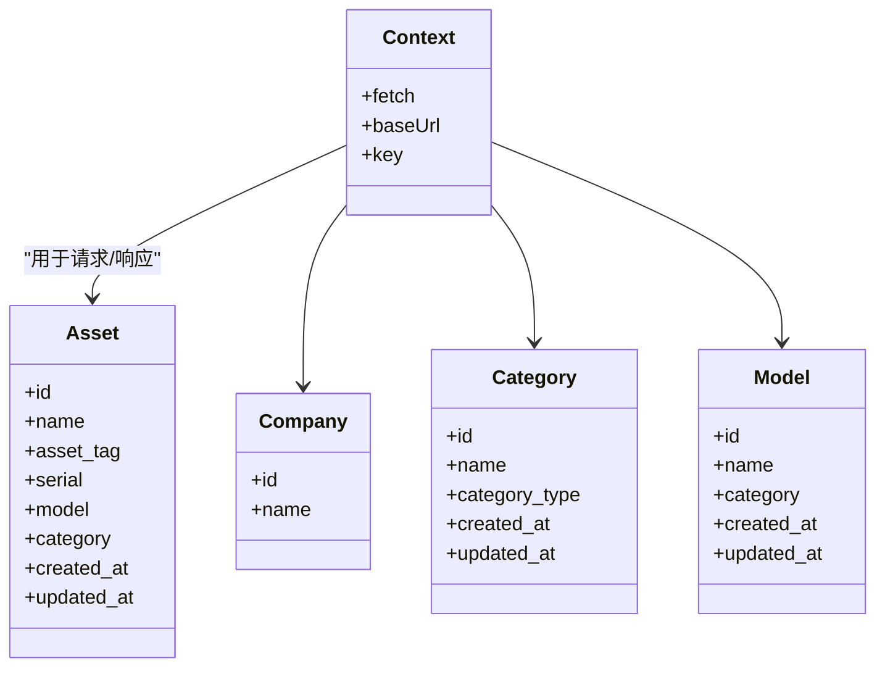
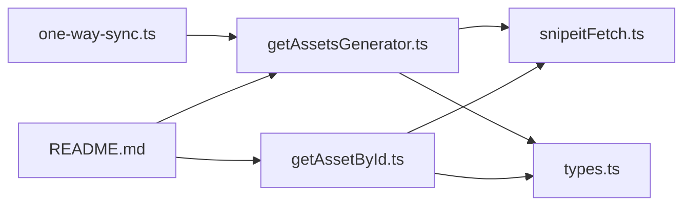

# 资产接口

<cite>
**本文引用的文件**
- [getAssetsGenerator.ts](file://packages/integration-snipe-it/lib/snipe-it-client/functions/getAssetsGenerator.ts)
- [getAssetById.ts](file://packages/integration-snipe-it/lib/snipe-it-client/functions/getAssetById.ts)
- [snipeitFetch.ts](file://packages/integration-snipe-it/lib/snipe-it-client/functions/snipeitFetch.ts)
- [types.ts](file://packages/integration-snipe-it/lib/snipe-it-client/types.ts)
- [one-way-sync.ts](file://packages/integration-snipe-it/one-way-sync.ts)
- [README.md](file://packages/integration-snipe-it/README.md)
</cite>

## 目录
1. [简介](#简介)
2. [项目结构](#项目结构)
3. [核心组件](#核心组件)
4. [架构总览](#架构总览)
5. [详细组件分析](#详细组件分析)
6. [依赖关系分析](#依赖关系分析)
7. [性能考虑](#性能考虑)
8. [故障排查指南](#故障排查指南)
9. [结论](#结论)
10. [附录](#附录)

## 简介
本文件面向需要对接 Snipe-IT 资产管理系统的开发者，系统性地文档化以下能力：
- 使用生成器函数遍历 Snipe-IT 资产列表，支持分页与流式处理
- 获取单个资产详情
- 资产资源的 API 端点结构与响应数据模型
- 类型定义如何保障类型安全
- 性能优化建议与常见问题排查

## 项目结构
与资产接口相关的核心文件位于 integration-snipe-it 包中，主要由以下模块组成：
- 函数层：资产生成器、按 ID 查询资产、HTTP 请求封装
- 类型层：上下文、资产、公司、分类、型号等数据模型
- 示例与集成：同步脚本演示如何消费资产生成器

图表来源
- [getAssetsGenerator.ts](file://packages/integration-snipe-it/lib/snipe-it-client/functions/getAssetsGenerator.ts#L1-L50)
- [getAssetById.ts](file://packages/integration-snipe-it/lib/snipe-it-client/functions/getAssetById.ts#L1-L25)
- [snipeitFetch.ts](file://packages/integration-snipe-it/lib/snipe-it-client/functions/snipeitFetch.ts#L1-L21)
- [types.ts](file://packages/integration-snipe-it/lib/snipe-it-client/types.ts#L1-L68)
- [one-way-sync.ts](file://packages/integration-snipe-it/one-way-sync.ts#L315-L415)
- [README.md](file://packages/integration-snipe-it/README.md#L46-L57)

章节来源
- [getAssetsGenerator.ts](file://packages/integration-snipe-it/lib/snipe-it-client/functions/getAssetsGenerator.ts#L1-L50)
- [getAssetById.ts](file://packages/integration-snipe-it/lib/snipe-it-client/functions/getAssetById.ts#L1-L25)
- [snipeitFetch.ts](file://packages/integration-snipe-it/lib/snipe-it-client/functions/snipeitFetch.ts#L1-L21)
- [types.ts](file://packages/integration-snipe-it/lib/snipe-it-client/types.ts#L1-L68)
- [one-way-sync.ts](file://packages/integration-snipe-it/one-way-sync.ts#L315-L415)
- [README.md](file://packages/integration-snipe-it/README.md#L46-L57)

## 核心组件
- 生成器：getAssetsGenerator(ctx, company_id?) 提供异步迭代器，按批次拉取资产并逐条产出
- 单资产查询：getAssetById(ctx, id) 返回单个资产对象或空值
- HTTP 封装：snipeitFetch(ctx, path, init?) 统一注入认证与内容类型头
- 类型模型：Context、Asset、Company、Category、Model 等，用于请求与响应的类型校验

章节来源
- [getAssetsGenerator.ts](file://packages/integration-snipe-it/lib/snipe-it-client/functions/getAssetsGenerator.ts#L1-L50)
- [getAssetById.ts](file://packages/integration-snipe-it/lib/snipe-it-client/functions/getAssetById.ts#L1-L25)
- [snipeitFetch.ts](file://packages/integration-snipe-it/lib/snipe-it-client/functions/snipeitFetch.ts#L1-L21)
- [types.ts](file://packages/integration-snipe-it/lib/snipe-it-client/types.ts#L1-L68)

## 架构总览
下图展示了从应用到 Snipe-IT 的调用链路与数据流向：

图表来源
- [getAssetsGenerator.ts](file://packages/integration-snipe-it/lib/snipe-it-client/functions/getAssetsGenerator.ts#L14-L49)
- [snipeitFetch.ts](file://packages/integration-snipe-it/lib/snipe-it-client/functions/snipeitFetch.ts#L5-L20)

## 详细组件分析

### 生成器：getAssetsGenerator
- 功能概述
  - 基于 limit/offset 分页拉取资产列表，返回异步迭代器，逐条产出当前资产及总数/进度信息
  - 可选传入 company_id 过滤公司维度
- 分页与流式处理
  - 每次请求固定批量大小（BATCH_SIZE），通过 offset 递增推进
  - 使用 Zod 解析响应为 { total, rows[] }，再对 rows 中每个资产进行类型校验
  - 逐条 yield 当前资产，并计算 current 位置，便于进度展示
- 异步迭代器模式
  - 返回 AsyncGenerator，支持 for-await-of 风格消费，避免一次性加载全部数据
- 错误处理
  - 若 total 首次未就绪则继续拉取；当 total <= currentOffset 时停止
  - 依赖 snipeitFetch 的统一错误传播与状态码处理
- 使用示例
  - 在同步脚本中直接消费生成器，边拉取边入库或处理
  - README 提供了最小可运行示例

图表来源
- [getAssetsGenerator.ts](file://packages/integration-snipe-it/lib/snipe-it-client/functions/getAssetsGenerator.ts#L14-L49)

章节来源
- [getAssetsGenerator.ts](file://packages/integration-snipe-it/lib/snipe-it-client/functions/getAssetsGenerator.ts#L1-L50)
- [one-way-sync.ts](file://packages/integration-snipe-it/one-way-sync.ts#L315-L415)
- [README.md](file://packages/integration-snipe-it/README.md#L51-L57)

### 单资产查询：getAssetById
- 功能概述
  - 通过 /hardware/{id} 获取单个资产详情
  - 对响应进行类型校验，若 status 为 error 且消息为“Asset not found”则返回空值；其他错误抛出异常
- 参数与返回
  - ctx: 上下文（含 fetch、baseUrl、key）
  - id: 资产 ID
  - 返回：资产对象或空值
- 典型用法
  - 在批量同步后，对个别资产进行二次确认或补全信息

图表来源
- [getAssetById.ts](file://packages/integration-snipe-it/lib/snipe-it-client/functions/getAssetById.ts#L7-L24)
- [snipeitFetch.ts](file://packages/integration-snipe-it/lib/snipe-it-client/functions/snipeitFetch.ts#L5-L20)

章节来源
- [getAssetById.ts](file://packages/integration-snipe-it/lib/snipe-it-client/functions/getAssetById.ts#L1-L25)
- [README.md](file://packages/integration-snipe-it/README.md#L46-L48)

### HTTP 封装：snipeitFetch
- 功能概述
  - 统一封装 GET 请求，自动拼接 baseUrl 与路径
  - 注入 Authorization: Bearer {key}、Accept 与 Content-Type 头
- 适用范围
  - 生成器与单资产查询均复用该封装，保证一致性与可维护性

章节来源
- [snipeitFetch.ts](file://packages/integration-snipe-it/lib/snipe-it-client/functions/snipeitFetch.ts#L1-L21)

### 类型定义与类型安全
- Context
  - 包含 fetch 实现、API 基础地址、访问密钥
- Asset
  - 关键字段：id、name、asset_tag、serial、model（含 id/name）、category（含 id/name）、created_at/updated_at（含 datetime/formatted）
- Company、Category、Model
  - 用于关联与扩展的类型定义
- 类型安全实践
  - 使用 Zod 对响应进行编译期与运行期双重校验
  - 生成器与查询函数返回值均通过 z.infer<typeof Type> 映射为强类型对象

图表来源
- [types.ts](file://packages/integration-snipe-it/lib/snipe-it-client/types.ts#L1-L68)

章节来源
- [types.ts](file://packages/integration-snipe-it/lib/snipe-it-client/types.ts#L1-L68)

## 依赖关系分析
- getAssetsGenerator 依赖 snipeitFetch 与 Asset 类型定义
- getAssetById 同样依赖 snipeitFetch 与 Asset 类型定义
- one-way-sync.ts 展示了在真实场景中如何消费 getAssetsGenerator
- README.md 提供了最小可用示例，便于快速上手

图表来源
- [getAssetsGenerator.ts](file://packages/integration-snipe-it/lib/snipe-it-client/functions/getAssetsGenerator.ts#L1-L50)
- [getAssetById.ts](file://packages/integration-snipe-it/lib/snipe-it-client/functions/getAssetById.ts#L1-L25)
- [snipeitFetch.ts](file://packages/integration-snipe-it/lib/snipe-it-client/functions/snipeitFetch.ts#L1-L21)
- [types.ts](file://packages/integration-snipe-it/lib/snipe-it-client/types.ts#L1-L68)
- [one-way-sync.ts](file://packages/integration-snipe-it/one-way-sync.ts#L315-L415)
- [README.md](file://packages/integration-snipe-it/README.md#L46-L57)

章节来源
- [getAssetsGenerator.ts](file://packages/integration-snipe-it/lib/snipe-it-client/functions/getAssetsGenerator.ts#L1-L50)
- [getAssetById.ts](file://packages/integration-snipe-it/lib/snipe-it-client/functions/getAssetById.ts#L1-L25)
- [snipeitFetch.ts](file://packages/integration-snipe-it/lib/snipe-it-client/functions/snipeitFetch.ts#L1-L21)
- [types.ts](file://packages/integration-snipe-it/lib/snipe-it-client/types.ts#L1-L68)
- [one-way-sync.ts](file://packages/integration-snipe-it/one-way-sync.ts#L315-L415)
- [README.md](file://packages/integration-snipe-it/README.md#L46-L57)

## 性能考虑
- 分批拉取与流式处理
  - 生成器默认每批 100 条，避免一次性下载大量数据，降低内存峰值与网络拥塞风险
- 排序与增量策略
  - 生成器按 updated_at 降序排序，便于优先处理最近变更的资产
  - 在大规模数据场景下，结合 company_id 过滤可显著减少无关数据传输
- 响应解析与类型校验
  - 使用 Zod 对响应进行严格解析，提前发现 API 结构变化，避免后续逻辑出错
- 进度反馈
  - 生成器同时提供 total 与 current，便于 UI 或日志展示进度

章节来源
- [getAssetsGenerator.ts](file://packages/integration-snipe-it/lib/snipe-it-client/functions/getAssetsGenerator.ts#L7-L13)
- [getAssetsGenerator.ts](file://packages/integration-snipe-it/lib/snipe-it-client/functions/getAssetsGenerator.ts#L25-L30)
- [one-way-sync.ts](file://packages/integration-snipe-it/one-way-sync.ts#L315-L415)

## 故障排查指南
- 常见错误与处理
  - 单资产查询返回空值：当 API 返回 status 为 error 且消息为“Asset not found”时，函数返回空值
  - 其他错误：抛出包含原始响应的错误，便于定位问题
- 认证与网络
  - 确认 Context 中的 baseUrl 与 key 正确无误
  - 确保网络可达且未被中间件拦截
- 数据格式
  - 若响应结构与类型定义不匹配，Zod 解析会失败，需检查 API 版本或字段变更
- 分页异常
  - 若 total 一直未就绪或 offset 无法推进，检查排序参数与过滤条件是否导致结果为空

章节来源
- [getAssetById.ts](file://packages/integration-snipe-it/lib/snipe-it-client/functions/getAssetById.ts#L14-L24)
- [snipeitFetch.ts](file://packages/integration-snipe-it/lib/snipe-it-client/functions/snipeitFetch.ts#L10-L19)

## 结论
- 通过生成器与分页机制，Snipe-IT 资产接口实现了对大规模数据的高效流式处理
- 类型定义与 Zod 校验确保了数据结构的一致性与健壮性
- 单资产查询提供了灵活的补充能力，适合在批量同步后做二次确认
- 结合过滤参数（如 company_id）与合理的批次大小，可在性能与稳定性之间取得良好平衡

## 附录

### API 端点与响应模型
- 端点结构
  - 列表：/api/v1/hardware
  - 单个资产：/api/v1/hardware/{id}
- 关键查询参数
  - sort、order：控制排序字段与方向
  - limit：每页数量（默认 100）
  - offset：偏移量
  - company_id：可选，按公司过滤
- 响应数据模型（节选）
  - 列表响应：包含 total 与 rows[]
  - 资产对象：id、name、asset_tag、serial、model、category、created_at、updated_at
- 参考路径
  - 列表与单个资产的端点与参数使用可参考生成器与查询函数的实现

章节来源
- [getAssetsGenerator.ts](file://packages/integration-snipe-it/lib/snipe-it-client/functions/getAssetsGenerator.ts#L25-L30)
- [getAssetById.ts](file://packages/integration-snipe-it/lib/snipe-it-client/functions/getAssetById.ts#L11-L11)
- [types.ts](file://packages/integration-snipe-it/lib/snipe-it-client/types.ts#L46-L67)

### 实际使用示例（路径指引）
- 遍历所有资产
  - 参考：[one-way-sync.ts](file://packages/integration-snipe-it/one-way-sync.ts#L315-L415)
  - 示例：README 中的 for-await-of 循环示例
    - [README.md](file://packages/integration-snipe-it/README.md#L51-L57)
- 获取特定资产
  - 参考：[getAssetById.ts](file://packages/integration-snipe-it/lib/snipe-it-client/functions/getAssetById.ts#L7-L24)
  - 示例：README 中的单资产查询示例
    - [README.md](file://packages/integration-snipe-it/README.md#L46-L48)