# 关系查询API

<cite>
**本文档引用的文件**  
- [getGetRelated.ts](file://packages/data-storage-couchdb/lib/functions/getGetRelated.ts)
- [useRelated.ts](file://App/app/data/hooks/useRelated.ts)
- [relations.ts](file://Data/lib/relations.ts)
- [types.ts](file://Data/lib/types.ts)
- [getGetDatumHistories.ts](file://packages/data-storage-couchdb/lib/functions/getGetDatumHistories.ts)
- [getGetAllAttachmentInfoFromDatum.ts](file://packages/data-storage-couchdb/lib/functions/getGetAllAttachmentInfoFromDatum.ts)
- [getGetAttachmentFromDatum.ts](file://packages/data-storage-couchdb/lib/functions/getGetAttachmentFromDatum.ts)
- [getGetAttachmentInfoFromDatum.ts](file://packages/data-storage-couchdb/lib/functions/getGetAttachmentInfoFromDatum.ts)
- [getGetData.ts](file://packages/data-storage-couchdb/lib/functions/getGetData.ts)
- [getGetDatum.ts](file://packages/data-storage-couchdb/lib/functions/getGetDatum.ts)
- [schema.ts](file://Data/lib/schema.ts)
</cite>

## 目录
1. [简介](#简介)
2. [核心关系查询函数](#核心关系查询函数)
3. [关系类型与配置](#关系类型与配置)
4. [辅助查询函数](#辅助查询函数)
5. [查询参数与返回结果](#查询参数与返回结果)
6. [实际使用示例](#实际使用示例)
7. [性能优化策略](#性能优化策略)
8. [循环引用处理](#循环引用处理)
9. [错误处理与边界情况](#错误处理与边界情况)

## 简介

关系查询API是库存管理系统中的核心功能，用于查询数据实体之间的关联关系。该API通过`getGetRelated`函数实现，支持`belongs_to`和`has_many`两种关系类型，能够高效地查询物品的关联集合、检查清单等关系数据。

**Section sources**
- [getGetRelated.ts](file://packages/data-storage-couchdb/lib/functions/getGetRelated.ts)
- [relations.ts](file://Data/lib/relations.ts)

## 核心关系查询函数

`getGetRelated`函数是关系查询API的核心实现，负责处理数据实体之间的关联查询。该函数根据预定义的关系配置，自动判断查询类型并执行相应的数据库操作。

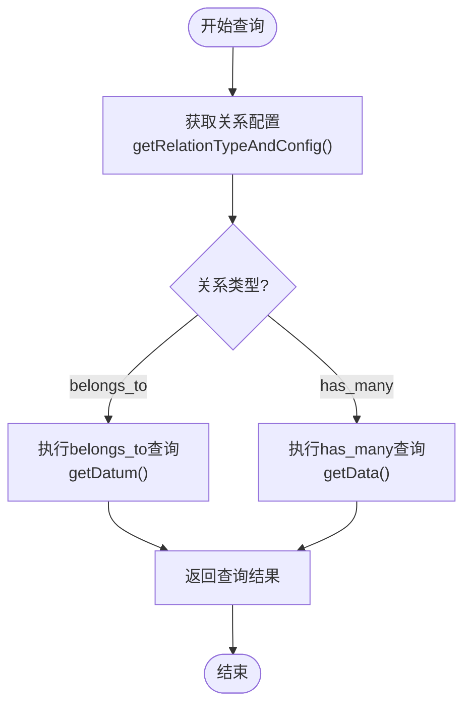

**Diagram sources**
- [getGetRelated.ts](file://packages/data-storage-couchdb/lib/functions/getGetRelated.ts)

### 函数实现细节

`getGetRelated`函数接收上下文参数，返回一个异步查询函数。该函数根据关系类型执行不同的查询逻辑：

- **belongs_to关系**：通过外键查找单个关联实体
- **has_many关系**：通过外键查找多个关联实体

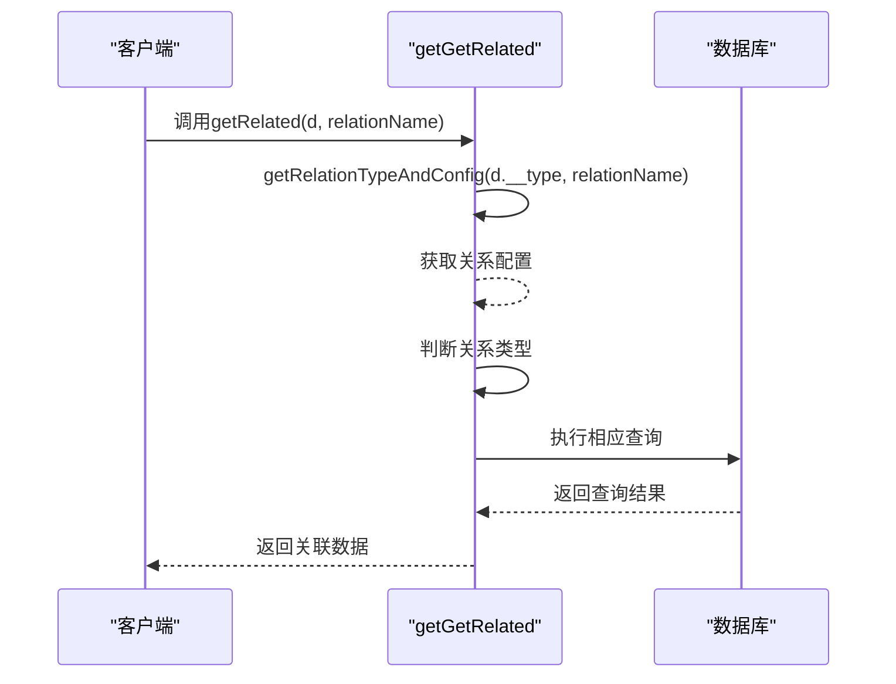

**Diagram sources**
- [getGetRelated.ts](file://packages/data-storage-couchdb/lib/functions/getGetRelated.ts)

**Section sources**
- [getGetRelated.ts](file://packages/data-storage-couchdb/lib/functions/getGetRelated.ts)

## 关系类型与配置

系统支持两种主要的关系类型：`belongs_to`和`has_many`。这些关系在`relations.ts`文件中定义，通过类型安全的方式管理实体间的关联。

### 关系类型定义

```typescript
export type RelationType = 'belongs_to' | 'has_many';
```

### 关系配置结构

```typescript
export type RelationConfig = {
  type_name: DataTypeName;
  foreign_key: string;
};
```

### 实际关系配置示例

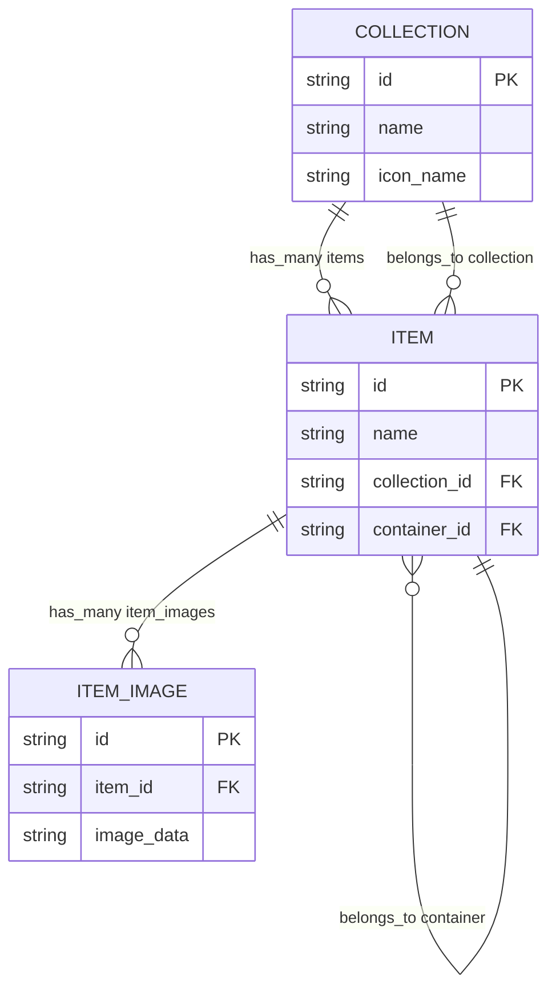

**Diagram sources**
- [relations.ts](file://Data/lib/relations.ts)

### 关系查询流程

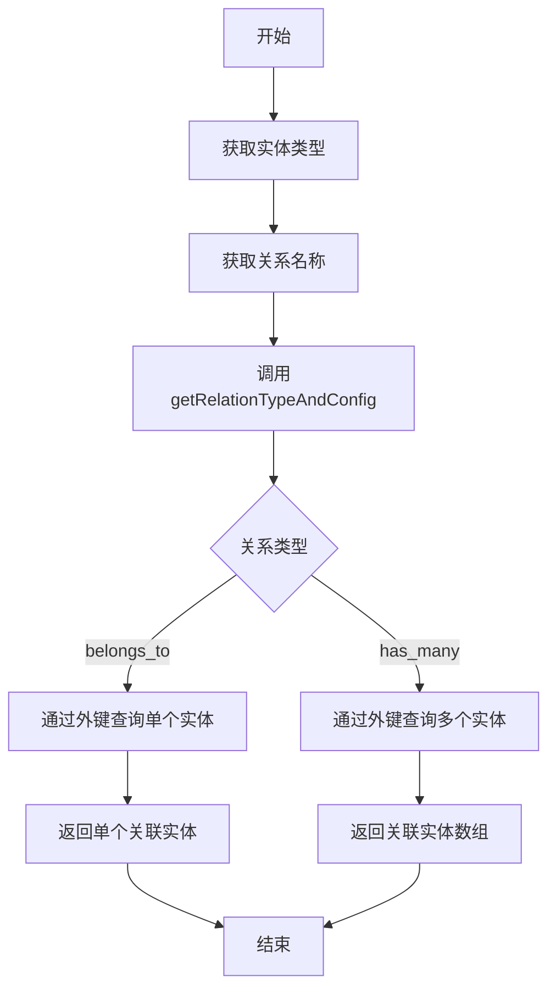

**Diagram sources**
- [relations.ts](file://Data/lib/relations.ts)
- [getGetRelated.ts](file://packages/data-storage-couchdb/lib/functions/getGetRelated.ts)

**Section sources**
- [relations.ts](file://Data/lib/relations.ts)

## 辅助查询函数

除了核心的`getGetRelated`函数外，系统还提供了一系列辅助查询函数，用于处理特定的数据查询需求。

### getGetDatumHistories函数

`getGetDatumHistories`函数用于查询特定数据实体的历史记录，支持分页和时间过滤。

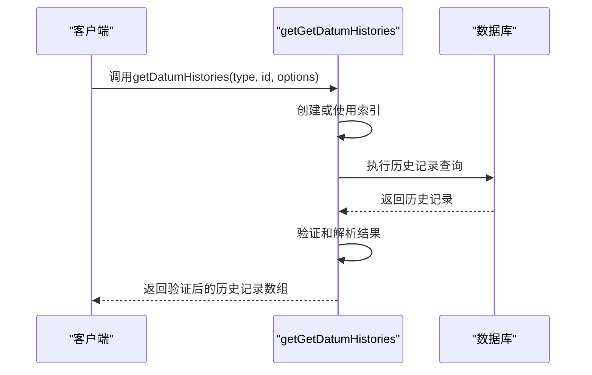

**Diagram sources**
- [getGetDatumHistories.ts](file://packages/data-storage-couchdb/lib/functions/getGetDatumHistories.ts)

### getGetAllAttachmentInfoFromDatum函数

`getGetAllAttachmentInfoFromDatum`函数用于获取数据实体的所有附件信息，包括内容类型、大小和摘要。

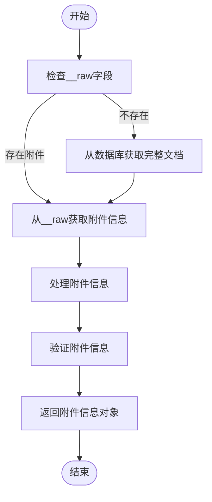

**Diagram sources**
- [getGetAllAttachmentInfoFromDatum.ts](file://packages/data-storage-couchdb/lib/functions/getGetAllAttachmentInfoFromDatum.ts)

### getGetAttachmentFromDatum函数

`getGetAttachmentFromDatum`函数用于获取数据实体的特定附件，包括附件数据本身。

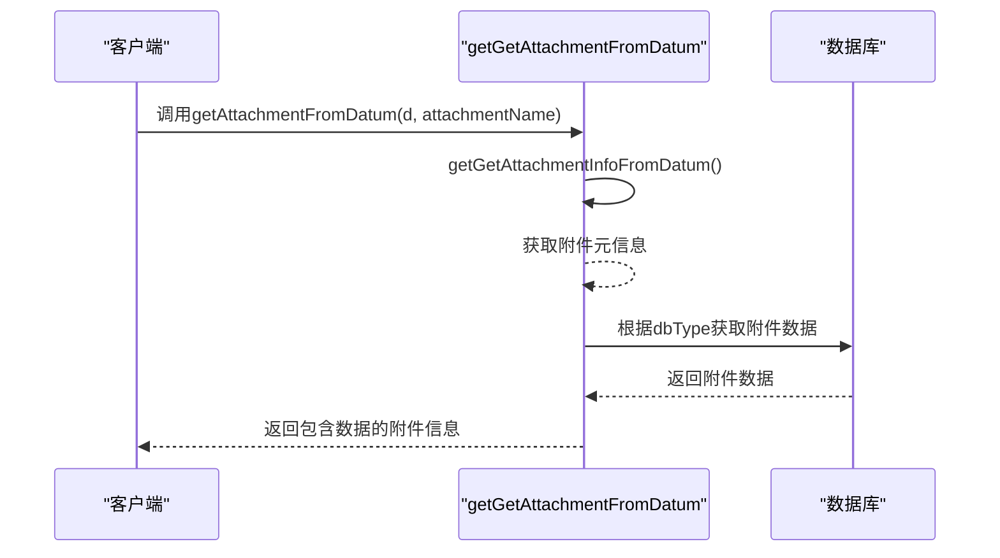

**Diagram sources**
- [getGetAttachmentFromDatum.ts](file://packages/data-storage-couchdb/lib/functions/getGetAttachmentFromDatum.ts)

**Section sources**
- [getGetDatumHistories.ts](file://packages/data-storage-couchdb/lib/functions/getGetDatumHistories.ts)
- [getGetAllAttachmentInfoFromDatum.ts](file://packages/data-storage-couchdb/lib/functions/getGetAllAttachmentInfoFromDatum.ts)
- [getGetAttachmentFromDatum.ts](file://packages/data-storage-couchdb/lib/functions/getGetAttachmentFromDatum.ts)
- [getGetAttachmentInfoFromDatum.ts](file://packages/data-storage-couchdb/lib/functions/getGetAttachmentInfoFromDatum.ts)

## 查询参数与返回结果

### 查询参数结构

```typescript
interface GetRelatedParams {
  sort?: Array<{ [propName: string]: 'asc' | 'desc' }>;
}
```

### 返回结果结构

根据关系类型，返回结果的结构有所不同：

- **belongs_to关系**：返回单个关联实体或null
- **has_many关系**：返回关联实体数组

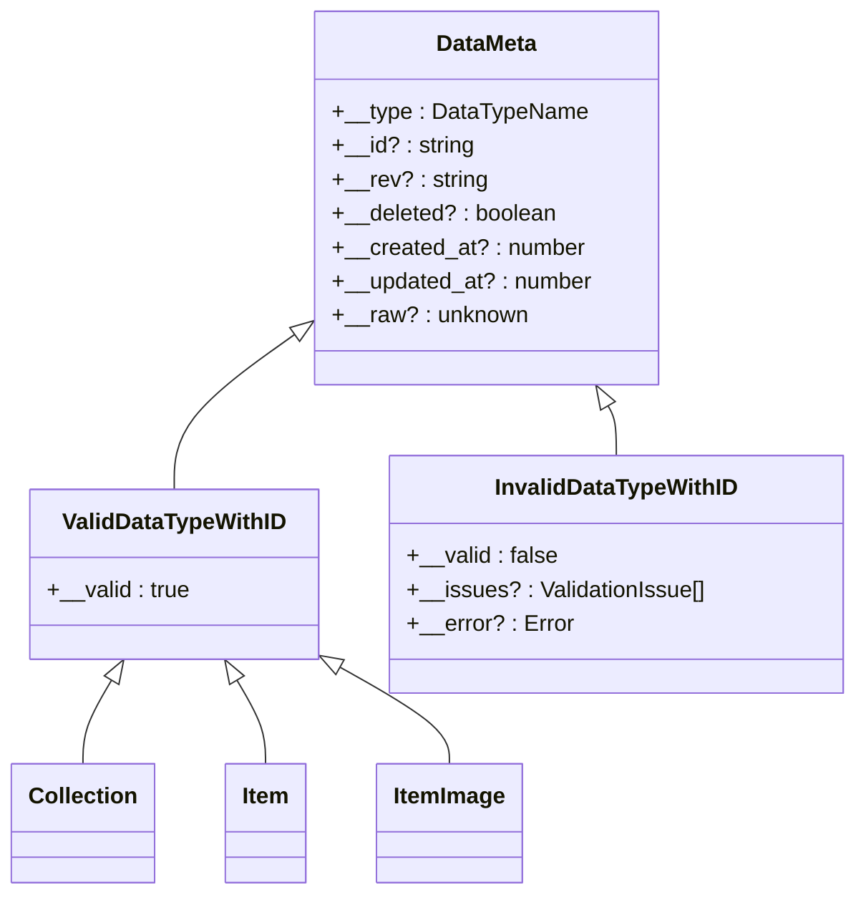

**Diagram sources**
- [types.ts](file://Data/lib/types.ts)

### 数据类型定义

```typescript
export type DataRelationType<
  T extends DataTypeWithRelationDefsName,
  DRN extends DataRelationName<T>,
> =
  | ((typeof relation_definitions)[T] extends {
      belongs_to: Record<DRN, { type_name: infer U extends DataTypeName }>
    }
      ? DataRelationBaseType<U> | null
      : never)
  | ((typeof relation_definitions)[T] extends {
      has_many: Record<DRN, { type_name: infer U extends DataTypeName }>
    }
      ? Array<DataRelationBaseType<U>>
      : never);
```

**Section sources**
- [types.ts](file://Data/lib/types.ts)

## 实际使用示例

### 查询物品的集合关系

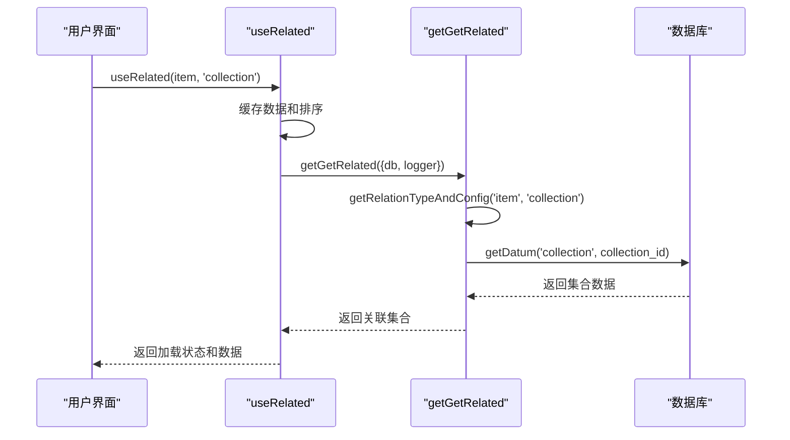

**Diagram sources**
- [useRelated.ts](file://App/app/data/hooks/useRelated.ts)

### 查询集合的物品关系

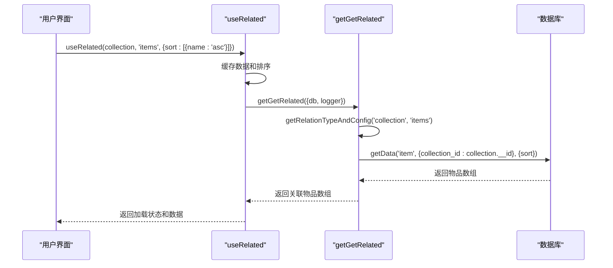

**Diagram sources**
- [useRelated.ts](file://App/app/data/hooks/useRelated.ts)

### 使用React Hook查询关系数据

```typescript
const { loading, data: collection } = useRelated(item, 'collection');
const { loading, data: items } = useRelated(collection, 'items', {
  sort: [{ name: 'asc' }]
});
```

**Section sources**
- [useRelated.ts](file://App/app/data/hooks/useRelated.ts)

## 性能优化策略

### 预加载与懒加载模式

系统实现了智能的预加载和懒加载策略，以优化性能和用户体验。

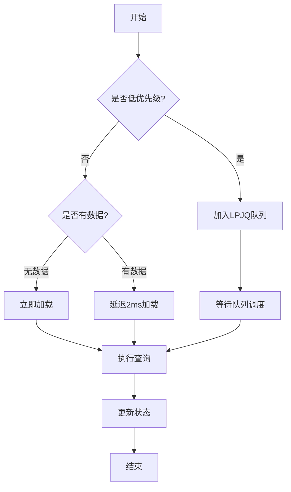

**Diagram sources**
- [useRelated.ts](file://App/app/data/hooks/useRelated.ts)

### 查询缓存机制

系统实现了多层缓存机制，避免重复查询：

1. **数据缓存**：缓存实体数据，避免重复获取
2. **排序缓存**：缓存排序参数，避免重复比较
3. **关系配置缓存**：缓存关系配置，避免重复解析

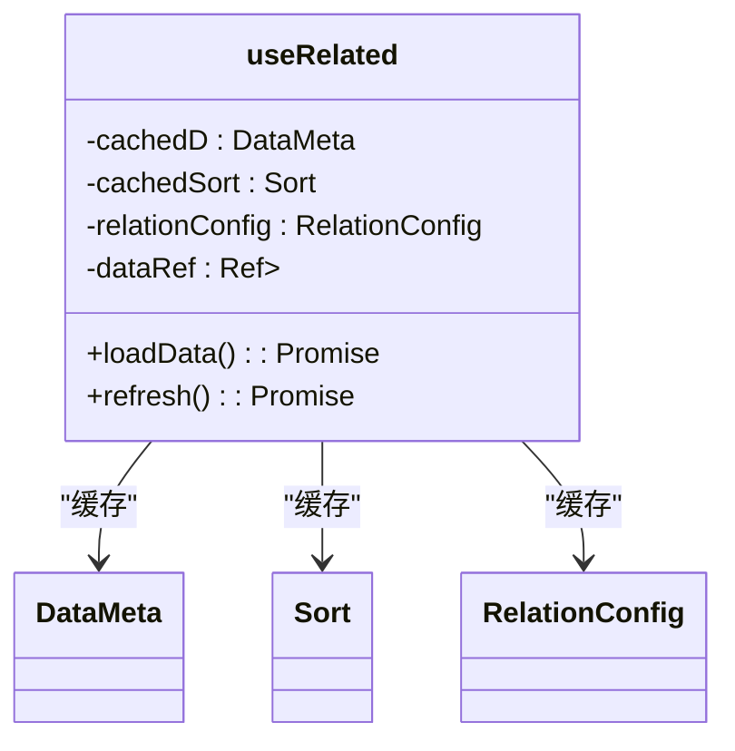

**Diagram sources**
- [useRelated.ts](file://App/app/data/hooks/useRelated.ts)

### 索引优化

`getGetDatumHistories`函数使用了专门的数据库索引，以提高查询性能：

```typescript
const INDEX = {
  fields: [
    { type: 'desc' },
    { data_type: 'desc' },
    { data_id: 'desc' },
    { timestamp: 'desc' }
  ],
  partial_filter_selector: { type: '_history' }
};
```

**Section sources**
- [getGetDatumHistories.ts](file://packages/data-storage-couchdb/lib/functions/getGetDatumHistories.ts)
- [useRelated.ts](file://App/app/data/hooks/useRelated.ts)

## 循环引用处理

系统通过类型安全的方式处理潜在的循环引用问题，确保查询的稳定性和可靠性。

### 类型安全检查

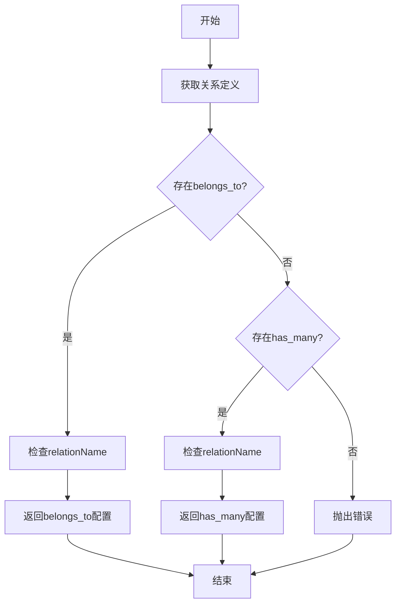

**Diagram sources**
- [relations.ts](file://Data/lib/relations.ts)

### 错误处理机制

当查询不存在的关系时，系统会抛出明确的错误信息：

```typescript
throw new Error(
  `Cannot find relation "${String(relationName)}" on defn ${JSON.stringify(relD)}`
);
```

**Section sources**
- [relations.ts](file://Data/lib/relations.ts)

## 错误处理与边界情况

### 异常处理策略

系统实现了全面的异常处理机制，确保在各种边界情况下都能正确响应。

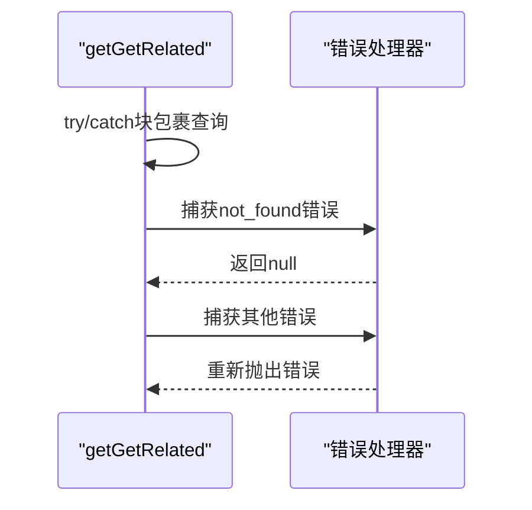

**Diagram sources**
- [getGetRelated.ts](file://packages/data-storage-couchdb/lib/functions/getGetRelated.ts)

### 边界情况处理

| 情况 | 处理方式 |
|------|----------|
| 外键不是字符串 | 返回null |
| 实体不存在 | 返回null |
| 关系配置不存在 | 抛出错误 |
| 数据库连接失败 | 重试最多3次 |

**Section sources**
- [getGetRelated.ts](file://packages/data-storage-couchdb/lib/functions/getGetRelated.ts)