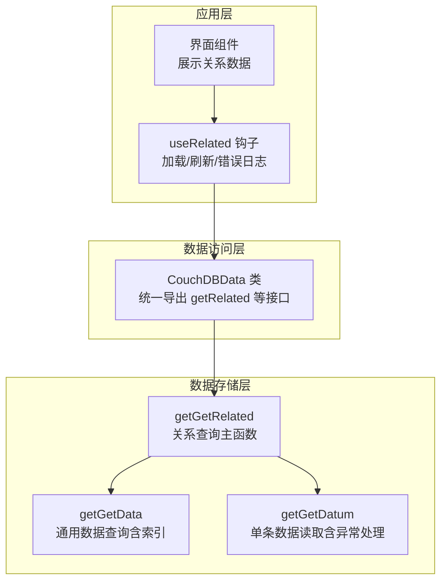
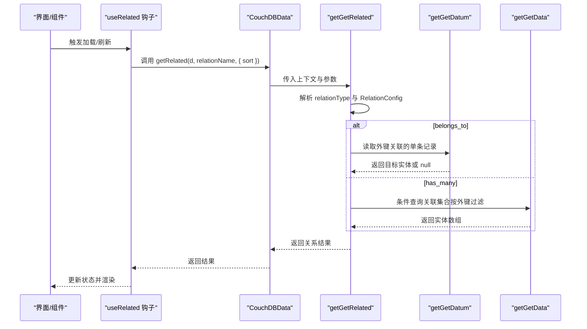
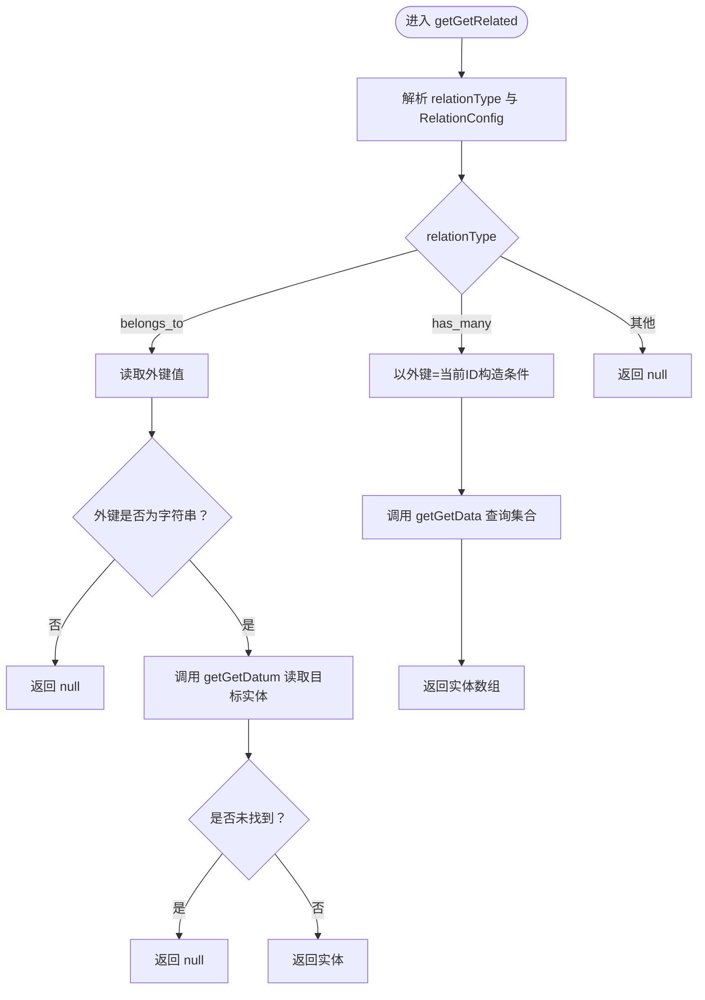
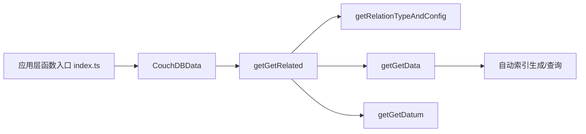

# 关系查询核心API

<cite>
**本文引用的文件列表**
- [getGetRelated.ts](file://packages/data-storage-couchdb/lib/functions/getGetRelated.ts)
- [relations.ts](file://Data/lib/relations.ts)
- [types.ts](file://Data/lib/types.ts)
- [getGetData.ts](file://packages/data-storage-couchdb/lib/functions/getGetData.ts)
- [getGetDatum.ts](file://packages/data-storage-couchdb/lib/functions/getGetDatum.ts)
- [CouchDBData.ts](file://packages/data-storage-couchdb/lib/CouchDBData.ts)
- [index.ts（应用层函数入口）](file://App/app/data/functions/index.ts)
- [useRelated.ts](file://App/app/data/hooks/useRelated.ts)
- [DatumScreen.tsx](file://App/app/screens/dev-tools/data/DatumScreen.tsx)
- [views.ts](file://packages/data-storage-couchdb/lib/views.ts)
</cite>

## 目录
1. [简介](#简介)
2. [项目结构](#项目结构)
3. [核心组件](#核心组件)
4. [架构总览](#架构总览)
5. [详细组件分析](#详细组件分析)
6. [依赖关系分析](#依赖关系分析)
7. [性能考量](#性能考量)
8. [故障排查指南](#故障排查指南)
9. [结论](#结论)
10. [附录：使用示例与最佳实践](#附录使用示例与最佳实践)

## 简介
本文件系统性地文档化关系查询核心API，重点围绕 getGetRelated 函数的实现机制展开，解释其如何通过“视图查询”和“索引优化”实现高效的数据实体关系检索，并给出参数说明、性能优化策略、错误处理与边界情况处理方法。同时提供实际使用场景与最佳实践，帮助开发者在物品与集合、检查清单等实体间进行稳定、可扩展的关系查询。

## 项目结构
该功能横跨三层：
- 应用层：通过 useRelated 钩子与业务界面交互，负责加载、刷新与错误日志。
- 数据访问层：CouchDBData 类封装统一的数据访问接口，内部委托到具体函数模块。
- 数据存储层：getGetRelated 基于 getGetDatum 与 getGetData 实现一对一/一对多关系查询；getGetData 内部自动构建并使用索引以提升查询性能。

图表来源
- [useRelated.ts](file://App/app/data/hooks/useRelated.ts#L1-L182)
- [CouchDBData.ts](file://packages/data-storage-couchdb/lib/CouchDBData.ts#L42-L96)
- [getGetRelated.ts](file://packages/data-storage-couchdb/lib/functions/getGetRelated.ts#L1-L56)
- [getGetData.ts](file://packages/data-storage-couchdb/lib/functions/getGetData.ts#L1-L332)
- [getGetDatum.ts](file://packages/data-storage-couchdb/lib/functions/getGetDatum.ts#L1-L42)

章节来源
- [useRelated.ts](file://App/app/data/hooks/useRelated.ts#L1-L182)
- [CouchDBData.ts](file://packages/data-storage-couchdb/lib/CouchDBData.ts#L42-L96)

## 核心组件
- getGetRelated：根据实体类型与关系名，判断关系类型（belongs_to 或 has_many），分别调用 getGetDatum 或 getGetData 完成查询。
- getGetData：通用查询函数，支持条件筛选、排序、分页，并自动为查询构造索引以提升性能。
- getGetDatum：单条数据读取，对“未找到”等异常进行捕获与转换。
- relations.ts：关系定义与类型推断，提供 relation_definitions、RelationConfig、RelationType 等。
- types.ts：对外暴露 GetRelated 等类型签名，明确参数与返回值约束。
- CouchDBData.ts：统一导出数据访问接口，包含 getRelated。
- useRelated.ts：React 钩子，封装关系数据的加载、刷新与错误日志。
- views.ts：预置视图定义，用于统计与聚合场景（与关系查询互补）。

章节来源
- [getGetRelated.ts](file://packages/data-storage-couchdb/lib/functions/getGetRelated.ts#L1-L56)
- [getGetData.ts](file://packages/data-storage-couchdb/lib/functions/getGetData.ts#L1-L332)
- [getGetDatum.ts](file://packages/data-storage-couchdb/lib/functions/getGetDatum.ts#L1-L42)
- [relations.ts](file://Data/lib/relations.ts#L1-L112)
- [types.ts](file://Data/lib/types.ts#L103-L120)
- [CouchDBData.ts](file://packages/data-storage-couchdb/lib/CouchDBData.ts#L42-L96)
- [useRelated.ts](file://App/app/data/hooks/useRelated.ts#L1-L182)
- [views.ts](file://packages/data-storage-couchdb/lib/views.ts#L1-L573)

## 架构总览
关系查询流程从应用层 useRelated 开始，经由 CouchDBData.getRelated 调用 getGetRelated，再根据关系类型选择 getGetDatum 或 getGetData。后者内部通过自动索引与查询计划生成，确保在大数据量下仍具备良好性能。

图表来源
- [useRelated.ts](file://App/app/data/hooks/useRelated.ts#L90-L121)
- [CouchDBData.ts](file://packages/data-storage-couchdb/lib/CouchDBData.ts#L68-L75)
- [getGetRelated.ts](file://packages/data-storage-couchdb/lib/functions/getGetRelated.ts#L10-L51)
- [getGetDatum.ts](file://packages/data-storage-couchdb/lib/functions/getGetDatum.ts#L20-L38)
- [getGetData.ts](file://packages/data-storage-couchdb/lib/functions/getGetData.ts#L258-L303)

## 详细组件分析

### getGetRelated 实现机制
- 输入参数
  - d：当前数据元信息，需包含 __type 与 __id 等字段。
  - relationName：关系名称，必须在 relation_definitions 中存在。
  - { sort }：可选排序参数，类型为 SortOption，用于 has_many 查询时的排序。
- 处理逻辑
  - 通过 getRelationTypeAndConfig 解析 relationType 与 RelationConfig。
  - belongs_to 分支：读取 d[foreign_key] 作为外键 ID，若非字符串则返回 null；否则调用 getGetDatum 获取目标实体；对“未找到”异常转换为 null，其他异常抛出。
  - has_many 分支：以 relationConfig.foreign_key 为键、d.__id 为值构造查询条件，调用 getGetData 执行条件查询并返回数组。
  - 默认分支：返回 null。
- 返回值
  - belongs_to：单个实体或 null。
  - has_many：实体数组。

图表来源
- [getGetRelated.ts](file://packages/data-storage-couchdb/lib/functions/getGetRelated.ts#L10-L51)
- [getGetDatum.ts](file://packages/data-storage-couchdb/lib/functions/getGetDatum.ts#L20-L38)
- [getGetData.ts](file://packages/data-storage-couchdb/lib/functions/getGetData.ts#L258-L303)

章节来源
- [getGetRelated.ts](file://packages/data-storage-couchdb/lib/functions/getGetRelated.ts#L1-L56)

### 关系定义与类型推断
- relation_definitions：集中定义各数据类型的 belongs_to 与 has_many 关系，包含 type_name 与 foreign_key。
- RelationConfig：包含 type_name（目标类型名）与 foreign_key（外键字段名）。
- RelationType：从 RelationDefn 中提取的键名，即 belongs_to 或 has_many。
- DataRelationType：基于 relation_definitions 的泛型类型推断，确保 belongs_to 返回单实体或 null，has_many 返回实体数组。

章节来源
- [relations.ts](file://Data/lib/relations.ts#L1-L112)
- [types.ts](file://Data/lib/types.ts#L103-L120)

### getGetData 的索引与查询优化
- 自动索引生成
  - 当使用条件查询或排序时，会根据 selector 字段与 sort 字段动态计算 indexFields，并生成 ddocName 与 index 定义。
  - 若未找到索引，会在重试循环中尝试创建索引，保证查询可用性。
- 排序与索引匹配
  - 对 sort 进行规范化映射（如 __id 映射为 _id，__created_at/__updated_at 映射为对应字段），并确保索引字段包含 type 与 indexFields。
- 性能特性
  - 支持 skip/limit 分页。
  - 提供 debug 模式输出 explain 信息，便于诊断查询计划。

章节来源
- [getGetData.ts](file://packages/data-storage-couchdb/lib/functions/getGetData.ts#L1-L332)

### getGetDatum 的异常处理
- 统一捕获“未找到/已删除/缺失”等异常，转换为 null 返回，避免上层崩溃。
- 其他异常直接抛出，交由调用方处理。

章节来源
- [getGetDatum.ts](file://packages/data-storage-couchdb/lib/functions/getGetDatum.ts#L1-L42)

### CouchDBData 与应用层集成
- CouchDBData 将 getGetRelated 注入为 getRelated，统一对外暴露。
- 应用层通过 index.ts 的 getGetRelated(ctx) 包装，将上下文传递给底层实现。

章节来源
- [CouchDBData.ts](file://packages/data-storage-couchdb/lib/CouchDBData.ts#L42-L96)
- [index.ts（应用层函数入口）](file://App/app/data/functions/index.ts#L55-L57)

### useRelated 钩子的加载与刷新策略
- 缓存输入数据与排序参数，避免不必要的重复请求。
- 使用 LPJQ 或定时器控制低优先级加载，减少主线程阻塞。
- 错误日志记录，加载完成后更新状态并触发首次加载回调。

章节来源
- [useRelated.ts](file://App/app/data/hooks/useRelated.ts#L1-L182)

## 依赖关系分析
- getGetRelated 依赖
  - getRelationTypeAndConfig：从 relation_definitions 中解析关系类型与配置。
  - getGetDatum：用于 belongs_to 的单条读取。
  - getGetData：用于 has_many 的条件查询。
- getGetData 依赖
  - 自动索引创建与查询执行，内部封装了 selector、sort、skip/limit 等参数处理。
- CouchDBData 依赖
  - 统一封装所有数据访问接口，包括 getRelated。

图表来源
- [getGetRelated.ts](file://packages/data-storage-couchdb/lib/functions/getGetRelated.ts#L1-L56)
- [getGetData.ts](file://packages/data-storage-couchdb/lib/functions/getGetData.ts#L1-L332)
- [getGetDatum.ts](file://packages/data-storage-couchdb/lib/functions/getGetDatum.ts#L1-L42)
- [CouchDBData.ts](file://packages/data-storage-couchdb/lib/CouchDBData.ts#L42-L96)
- [index.ts（应用层函数入口）](file://App/app/data/functions/index.ts#L55-L57)

章节来源
- [getGetRelated.ts](file://packages/data-storage-couchdb/lib/functions/getGetRelated.ts#L1-L56)
- [getGetData.ts](file://packages/data-storage-couchdb/lib/functions/getGetData.ts#L1-L332)
- [getGetDatum.ts](file://packages/data-storage-couchdb/lib/functions/getGetDatum.ts#L1-L42)
- [CouchDBData.ts](file://packages/data-storage-couchdb/lib/CouchDBData.ts#L42-L96)
- [index.ts（应用层函数入口）](file://App/app/data/functions/index.ts#L55-L57)

## 性能考量
- 索引使用建议
  - has_many 查询默认以外键字段为条件，getGetData 会基于 selector 与 sort 动态生成索引，确保查询命中索引。
  - 若频繁按时间字段排序，建议在 relation_definitions 中将相应字段纳入 has_many 的 foreign_key 或在业务侧补充复合索引。
- 查询缓存机制
  - useRelated 钩子内部对输入数据与排序参数进行缓存，避免短时间内重复请求。
  - 可结合业务层的本地缓存策略（如内存缓存或持久化缓存）进一步降低重复查询成本。
- 视图与关系查询的配合
  - views.ts 提供多种聚合视图（如过期物品、低库存统计等），适合批量统计与报表场景；关系查询更偏向“单次实体关系定位”，两者可互补使用。

章节来源
- [getGetData.ts](file://packages/data-storage-couchdb/lib/functions/getGetData.ts#L154-L222)
- [useRelated.ts](file://App/app/data/hooks/useRelated.ts#L56-L80)
- [views.ts](file://packages/data-storage-couchdb/lib/views.ts#L1-L573)

## 故障排查指南
- 关系不存在
  - 当 relationName 在 relation_definitions 中找不到时，getRelationTypeAndConfig 抛出错误。请检查关系名称与类型定义是否一致。
- belongs_to 外键为空或非字符串
  - 若外键字段不存在或不是字符串，getGetRelated 直接返回 null，不会抛错。请确认外键字段命名与数据一致性。
- has_many 查询无结果
  - 检查 foreign_key 是否正确、d.__id 是否有效；确认 getGetData 的索引是否已创建并被查询命中。
- “未找到”异常
  - getGetDatum 对“未找到/已删除/缺失”等异常转换为 null；若需要区分，可在上层业务逻辑中捕获并处理。
- 日志与调试
  - useRelated 会记录错误日志；getGetData 支持 debug 模式输出 explain 信息，便于分析查询计划与索引使用情况。

章节来源
- [relations.ts](file://Data/lib/relations.ts#L92-L111)
- [getGetRelated.ts](file://packages/data-storage-couchdb/lib/functions/getGetRelated.ts#L20-L35)
- [getGetDatum.ts](file://packages/data-storage-couchdb/lib/functions/getGetDatum.ts#L20-L38)
- [getGetData.ts](file://packages/data-storage-couchdb/lib/functions/getGetData.ts#L236-L257)

## 结论
getGetRelated 通过“关系类型判定 + 单条读取/条件查询”的组合，实现了对 belongs_to 与 has_many 的高效关系检索。配合 getGetData 的自动索引与查询优化，以及 useRelated 的加载与缓存策略，能够在复杂数据模型下保持良好的性能与稳定性。建议在关系设计阶段明确 foreign_key 与 type_name，并在高频查询场景中关注索引命中与排序字段的合理性。

## 附录：使用示例与最佳实践

### 参数说明与取值范围
- d：当前实体元信息，需包含 __type 与 __id 等字段。
- relationName：关系名称，取值来自 relation_definitions 中某类型定义的 belongs_to 或 has_many 键名。
- { sort }：可选排序参数，类型为 SortOption，支持按字段升/降序排序。

章节来源
- [types.ts](file://Data/lib/types.ts#L103-L120)
- [relations.ts](file://Data/lib/relations.ts#L1-L112)

### 实际使用场景
- 物品与集合的关系
  - 场景：从 item 查询其所属 collection。
  - 关系定义：item.belongs_to.collection，foreign_key 为 collection_id。
  - 调用路径：useRelated -> getGetRelated -> getGetDatum。
  - 参考位置：[DatumScreen.tsx](file://App/app/screens/dev-tools/data/DatumScreen.tsx#L353-L404)
- 检查清单与物品的关系
  - 场景：从 collection 查询其下的 items。
  - 关系定义：collection.has_many.items，foreign_key 为 collection_id。
  - 调用路径：useRelated -> getGetRelated -> getGetData。
  - 参考位置：[DatumScreen.tsx](file://App/app/screens/dev-tools/data/DatumScreen.tsx#L380-L404)

### 最佳实践
- 关系设计
  - 明确 belongs_to 与 has_many 的方向，确保 foreign_key 与 type_name 一致。
- 查询优化
  - 对高频 has_many 查询，尽量提供 sort 以利用索引；避免在大结果集上进行复杂排序。
- 错误处理
  - 对 belongs_to 外键缺失或“未找到”场景，接受 null 并进行空值处理。
  - 对 has_many 无结果场景，提供兜底文案或引导用户创建关联数据。
- 缓存与刷新
  - 利用 useRelated 的缓存与刷新策略，减少重复请求；必要时在业务层增加本地缓存。

章节来源
- [relations.ts](file://Data/lib/relations.ts#L20-L44)
- [useRelated.ts](file://App/app/data/hooks/useRelated.ts#L90-L121)
- [DatumScreen.tsx](file://App/app/screens/dev-tools/data/DatumScreen.tsx#L353-L404)