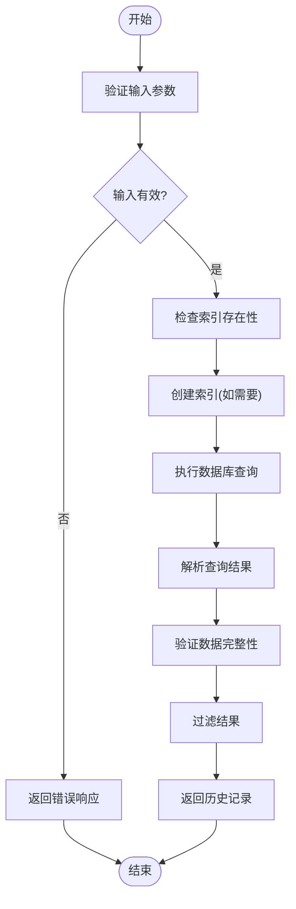
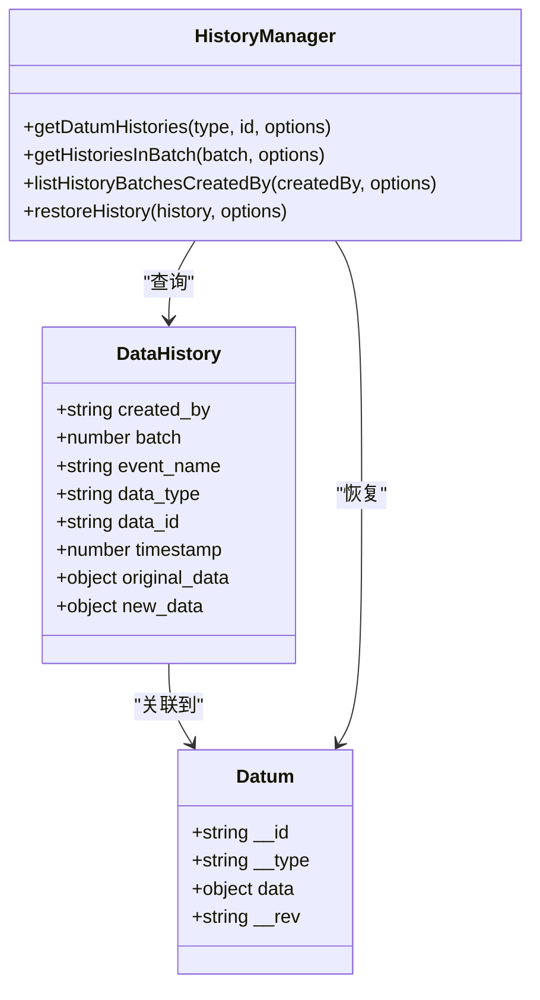
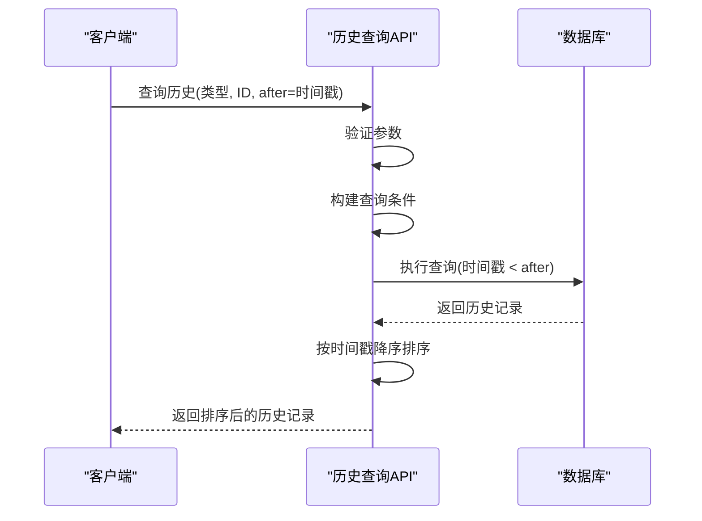
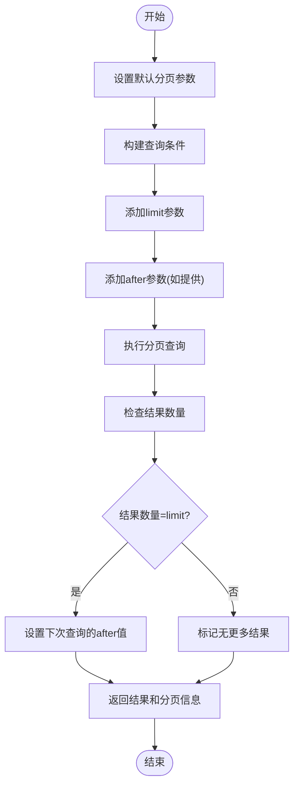
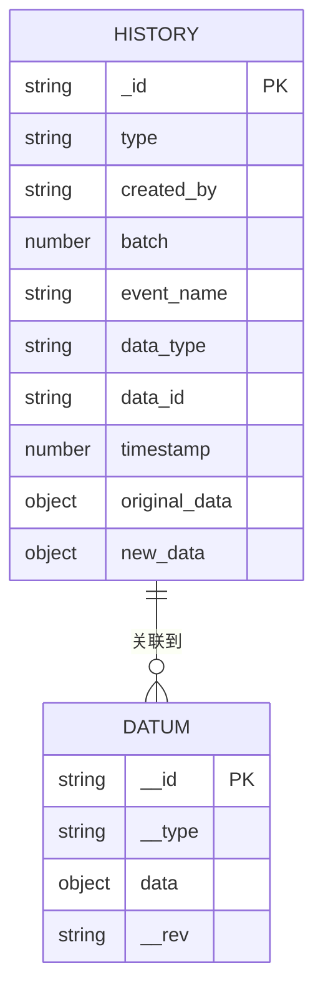
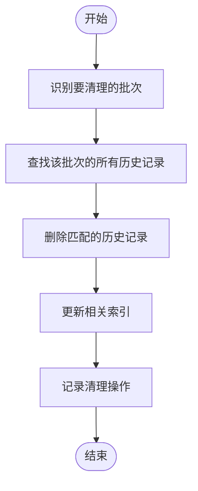
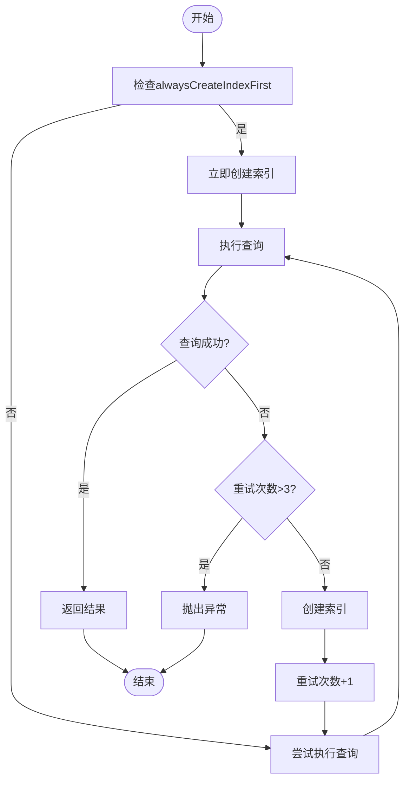
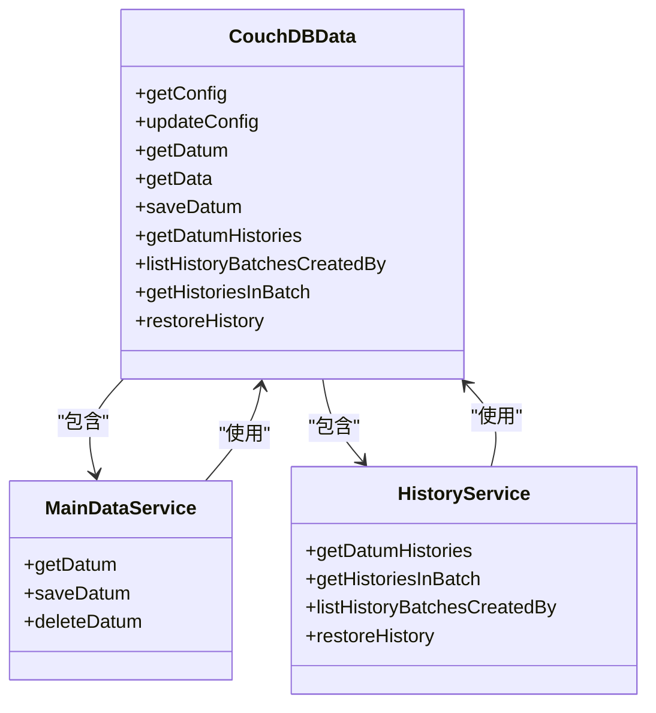
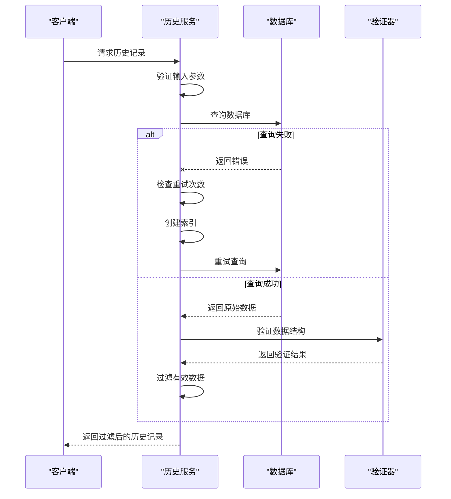
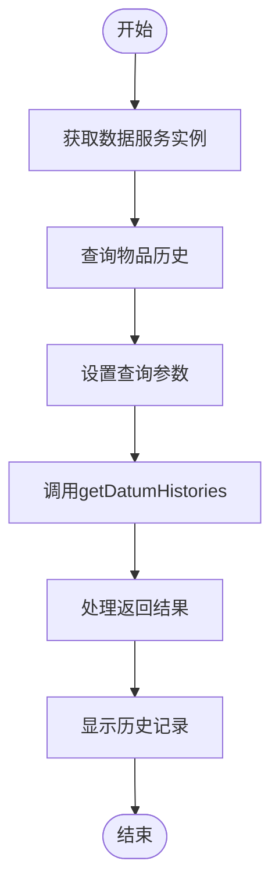

# 数据历史查询API

<cite>
**本文档引用的文件**
- [getGetDatumHistories.ts](file://packages/data-storage-couchdb/lib/functions/getGetDatumHistories.ts)
- [getGetHistoriesInBatch.ts](file://packages/data-storage-couchdb/lib/functions/getGetHistoriesInBatch.ts)
- [getListHistoryBatchesCreatedBy.ts](file://packages/data-storage-couchdb/lib/functions/getListHistoryBatchesCreatedBy.ts)
- [types.ts](file://packages/data-storage-couchdb/lib/types.ts)
- [CouchDBData.ts](file://packages/data-storage-couchdb/lib/CouchDBData.ts)
- [index.ts](file://App/app/data/functions/index.ts)
- [HistoryBatchesModalScreen.tsx](file://App/app/screens/data-history/HistoryBatchesModalScreen.tsx)
- [HistoryBatchModalScreen.tsx](file://App/app/screens/data-history/HistoryBatchModalScreen.tsx)
</cite>

## 目录
1. [简介](#简介)
2. [核心功能](#核心功能)
3. [版本控制机制](#版本控制机制)
4. [时间戳处理](#时间戳处理)
5. [历史记录分页](#历史记录分页)
6. [数据存储策略](#数据存储策略)
7. [清理机制](#清理机制)
8. [性能考虑](#性能考虑)
9. [与主数据查询的集成](#与主数据查询的集成)
10. [一致性保证](#一致性保证)
11. [实际示例](#实际示例)

## 简介
数据历史查询API为库存管理系统提供了完整的数据变更追踪功能。该API允许用户查询物品或集合的修改历史，支持按时间、用户和批次进行过滤。系统通过CouchDB/PouchDB数据库实现数据版本控制，确保所有变更都有据可查。

**本节不包含具体文件分析，因此不提供来源**

## 核心功能
数据历史查询API的核心功能由`getGetDatumHistories`函数实现，该函数提供对特定数据项变更历史的查询能力。API支持多种查询参数，包括数据类型、ID、分页限制和时间戳过滤。

**图表来源**
- [getGetDatumHistories.ts](file://packages/data-storage-couchdb/lib/functions/getGetDatumHistories.ts#L18-L103)

**本节来源**
- [getGetDatumHistories.ts](file://packages/data-storage-couchdb/lib/functions/getGetDatumHistories.ts#L18-L103)

## 版本控制机制
系统采用基于文档的历史记录存储方式，每个数据变更都会生成一个历史记录文档。历史记录包含变更前后的数据状态，支持完整的版本回溯。

**图表来源**
- [types.ts](file://packages/data-storage-couchdb/lib/types.ts#L3-L12)
- [getGetDatumHistories.ts](file://packages/data-storage-couchdb/lib/functions/getGetDatumHistories.ts#L18-L103)

**本节来源**
- [types.ts](file://packages/data-storage-couchdb/lib/types.ts#L3-L12)
- [getGetDatumHistories.ts](file://packages/data-storage-couchdb/lib/functions/getGetDatumHistories.ts#L18-L103)

## 时间戳处理
系统使用毫秒级时间戳来精确记录数据变更时间。时间戳在查询中作为排序和过滤的关键字段，支持按时间范围查询历史记录。

**图表来源**
- [getGetDatumHistories.ts](file://packages/data-storage-couchdb/lib/functions/getGetDatumHistories.ts#L46-L47)
- [getGetHistoriesInBatch.ts](file://packages/data-storage-couchdb/lib/functions/getGetHistoriesInBatch.ts#L43-L44)

**本节来源**
- [getGetDatumHistories.ts](file://packages/data-storage-couchdb/lib/functions/getGetDatumHistories.ts#L28-L29)
- [getGetHistoriesInBatch.ts](file://packages/data-storage-couchdb/lib/functions/getGetHistoriesInBatch.ts#L21-L23)

## 历史记录分页
API提供分页功能，支持大规模历史数据的高效查询。通过limit和after参数实现分页，避免一次性加载过多数据。

**图表来源**
- [getGetDatumHistories.ts](file://packages/data-storage-couchdb/lib/functions/getGetDatumHistories.ts#L28-L29)
- [HistoryBatchesModalScreen.tsx](file://App/app/screens/data-history/HistoryBatchesModalScreen.tsx#L69-L71)

**本节来源**
- [getGetDatumHistories.ts](file://packages/data-storage-couchdb/lib/functions/getGetDatumHistories.ts#L28-L29)
- [HistoryBatchesModalScreen.tsx](file://App/app/screens/data-history/HistoryBatchesModalScreen.tsx#L69-L71)

## 数据存储策略
历史数据存储采用专门的文档类型`_history`，与主数据分离存储。每个历史记录包含完整的变更信息，包括操作者、批次、事件名称和时间戳。

**图表来源**
- [getGetDatumHistories.ts](file://packages/data-storage-couchdb/lib/functions/getGetDatumHistories.ts#L43-L45)
- [getSaveDatum.ts](file://packages/data-storage-couchdb/lib/functions/getSaveDatum.ts#L108-L109)

**本节来源**
- [getGetDatumHistories.ts](file://packages/data-storage-couchdb/lib/functions/getGetDatumHistories.ts#L7-L16)
- [getSaveDatum.ts](file://packages/data-storage-couchdb/lib/functions/getSaveDatum.ts#L98-L115)

## 清理机制
系统通过批次(batch)机制支持历史数据的批量清理。虽然当前代码未实现自动清理功能，但数据结构支持按批次删除历史记录。

**图表来源**
- [getListHistoryBatchesCreatedBy.ts](file://packages/data-storage-couchdb/lib/functions/getListHistoryBatchesCreatedBy.ts#L12-L13)
- [getGetHistoriesInBatch.ts](file://packages/data-storage-couchdb/lib/functions/getGetHistoriesInBatch.ts#L37-L38)

**本节来源**
- [getListHistoryBatchesCreatedBy.ts](file://packages/data-storage-couchdb/lib/functions/getListHistoryBatchesCreatedBy.ts#L25-L28)
- [getGetHistoriesInBatch.ts](file://packages/data-storage-couchdb/lib/functions/getGetHistoriesInBatch.ts#L20-L23)

## 性能考虑
API设计考虑了性能优化，通过预创建索引、错误重试机制和结果缓存来提高查询效率。索引按类型、数据类型、数据ID和时间戳建立，确保快速查询。

**图表来源**
- [getGetDatumHistories.ts](file://packages/data-storage-couchdb/lib/functions/getGetDatumHistories.ts#L30-L86)
- [getGetHistoriesInBatch.ts](file://packages/data-storage-couchdb/lib/functions/getGetHistoriesInBatch.ts#L24-L77)

**本节来源**
- [getGetDatumHistories.ts](file://packages/data-storage-couchdb/lib/functions/getGetDatumHistories.ts#L30-L86)
- [getGetHistoriesInBatch.ts](file://packages/data-storage-couchdb/lib/functions/getGetHistoriesInBatch.ts#L24-L77)

## 与主数据查询的集成
历史查询API与主数据查询系统紧密集成，通过统一的CouchDBData类暴露所有数据访问功能。这种设计确保了数据访问的一致性和便利性。

**图表来源**
- [CouchDBData.ts](file://packages/data-storage-couchdb/lib/CouchDBData.ts#L42-L96)
- [index.ts](file://App/app/data/functions/index.ts#L88-L90)

**本节来源**
- [CouchDBData.ts](file://packages/data-storage-couchdb/lib/CouchDBData.ts#L56-L59)
- [index.ts](file://App/app/data/functions/index.ts#L88-L90)

## 一致性保证
系统通过事务性操作和错误处理机制确保数据一致性。查询操作包含重试逻辑，索引创建有容错处理，数据验证使用Zod库确保类型安全。

**图表来源**
- [getGetDatumHistories.ts](file://packages/data-storage-couchdb/lib/functions/getGetDatumHistories.ts#L57-L86)
- [types.ts](file://packages/data-storage-couchdb/lib/types.ts#L3-L12)

**本节来源**
- [getGetDatumHistories.ts](file://packages/data-storage-couchdb/lib/functions/getGetDatumHistories.ts#L88-L99)
- [types.ts](file://packages/data-storage-couchdb/lib/types.ts#L3-L12)

## 实际示例
以下示例展示如何使用数据历史查询API获取物品或集合的修改历史。

**图表来源**
- [HistoryBatchesModalScreen.tsx](file://App/app/screens/data-history/HistoryBatchesModalScreen.tsx#L61-L68)
- [HistoryBatchModalScreen.tsx](file://App/app/screens/data-history/HistoryBatchModalScreen.tsx#L60-L67)

**本节来源**
- [HistoryBatchesModalScreen.tsx](file://App/app/screens/data-history/HistoryBatchesModalScreen.tsx#L55-L84)
- [HistoryBatchModalScreen.tsx](file://App/app/screens/data-history/HistoryBatchModalScreen.tsx#L54-L76)