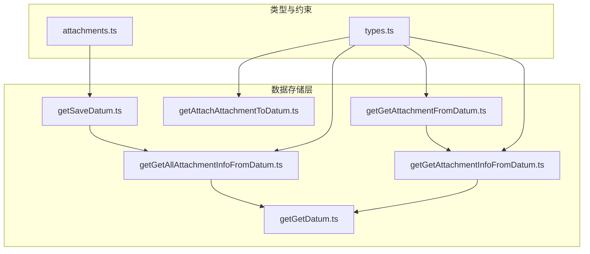
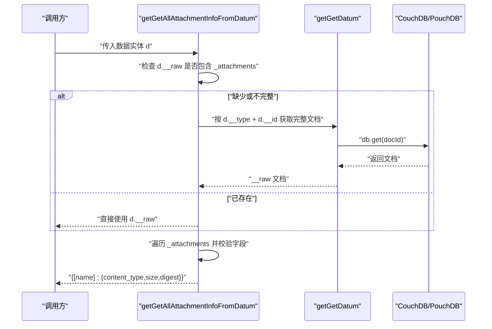
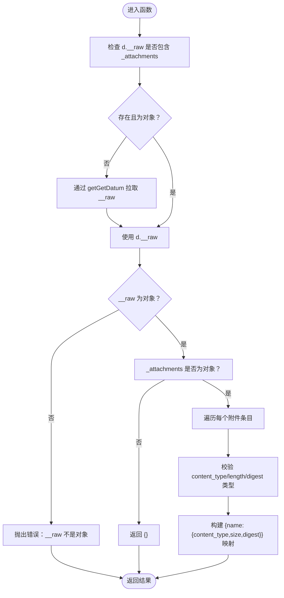
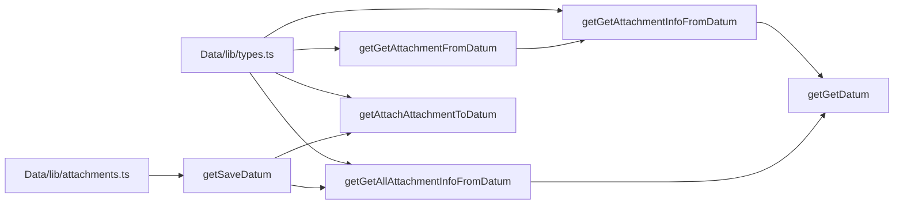

# 附件信息查询API

<cite>
**本文引用的文件**
- [packages/data-storage-couchdb/lib/functions/getGetAllAttachmentInfoFromDatum.ts](file://packages/data-storage-couchdb/lib/functions/getGetAllAttachmentInfoFromDatum.ts)
- [packages/data-storage-couchdb/lib/functions/getGetAttachmentInfoFromDatum.ts](file://packages/data-storage-couchdb/lib/functions/getGetAttachmentInfoFromDatum.ts)
- [packages/data-storage-couchdb/lib/functions/getGetAttachmentFromDatum.ts](file://packages/data-storage-couchdb/lib/functions/getGetAttachmentFromDatum.ts)
- [packages/data-storage-couchdb/lib/functions/getGetDatum.ts](file://packages/data-storage-couchdb/lib/functions/getGetDatum.ts)
- [packages/data-storage-couchdb/lib/functions/getAttachAttachmentToDatum.ts](file://packages/data-storage-couchdb/lib/functions/getAttachAttachmentToDatum.ts)
- [packages/data-storage-couchdb/lib/functions/getSaveDatum.ts](file://packages/data-storage-couchdb/lib/functions/getSaveDatum.ts)
- [Data/lib/attachments.ts](file://Data/lib/attachments.ts)
- [Data/lib/types.ts](file://Data/lib/types.ts)
- [App/app/schemas/pouchdb/PouchDBAttachmentScreen.tsx](file://App/app/schemas/pouchdb/PouchDBAttachmentScreen.tsx)
- [App/app/data/hooks/useData.ts](file://App/app/data/hooks/useData.ts)
- [App/app/features/inventory/components/ImagesSliderBox.tsx](file://App/app/features/inventory/components/ImagesSliderBox.tsx)
</cite>

## 目录
1. [简介](#简介)
2. [项目结构](#项目结构)
3. [核心组件](#核心组件)
4. [架构总览](#架构总览)
5. [详细组件分析](#详细组件分析)
6. [依赖关系分析](#依赖关系分析)
7. [性能考量](#性能考量)
8. [故障排查指南](#故障排查指南)
9. [结论](#结论)
10. [附录](#附录)

## 简介
本文件面向“附件信息查询API”的技术文档，重点围绕函数 getGetAllAttachmentInfoFromDatum 的实现与使用，说明其如何从数据实体中批量提取附件元信息（文件名、大小、MIME 类型等），并结合现有数据模型与存储层能力，给出查询流程、性能优化策略与安全注意事项。同时提供一个基于物品图片附件的实际查询示例路径，帮助快速上手。

## 项目结构
该功能位于数据存储与类型定义两个层面：
- 存储层：在 CouchDB/PouchDB 数据存储包中，提供附件信息查询与拉取的函数族。
- 类型与约束：在 Data 模块中，定义了附件名称、内容类型、以及数据实体的通用元信息结构。

图表来源
- [packages/data-storage-couchdb/lib/functions/getGetAllAttachmentInfoFromDatum.ts](file://packages/data-storage-couchdb/lib/functions/getGetAllAttachmentInfoFromDatum.ts#L1-L66)
- [packages/data-storage-couchdb/lib/functions/getGetAttachmentInfoFromDatum.ts](file://packages/data-storage-couchdb/lib/functions/getGetAttachmentInfoFromDatum.ts#L1-L62)
- [packages/data-storage-couchdb/lib/functions/getGetAttachmentFromDatum.ts](file://packages/data-storage-couchdb/lib/functions/getGetAttachmentFromDatum.ts#L1-L45)
- [packages/data-storage-couchdb/lib/functions/getGetDatum.ts](file://packages/data-storage-couchdb/lib/functions/getGetDatum.ts#L1-L42)
- [packages/data-storage-couchdb/lib/functions/getAttachAttachmentToDatum.ts](file://packages/data-storage-couchdb/lib/functions/getAttachAttachmentToDatum.ts#L1-L37)
- [packages/data-storage-couchdb/lib/functions/getSaveDatum.ts](file://packages/data-storage-couchdb/lib/functions/getSaveDatum.ts#L1-L81)
- [Data/lib/attachments.ts](file://Data/lib/attachments.ts#L1-L48)
- [Data/lib/types.ts](file://Data/lib/types.ts#L160-L212)

章节来源
- [packages/data-storage-couchdb/lib/functions/getGetAllAttachmentInfoFromDatum.ts](file://packages/data-storage-couchdb/lib/functions/getGetAllAttachmentInfoFromDatum.ts#L1-L66)
- [Data/lib/types.ts](file://Data/lib/types.ts#L160-L212)

## 核心组件
- 批量附件元信息查询：getGetAllAttachmentInfoFromDatum
  - 输入：数据实体对象（包含类型、ID、可选原始文档）
  - 输出：以附件名为键的对象，值为包含 content_type、size、digest 的元信息
  - 行为：若传入对象未包含完整原始文档，则会通过 getGetDatum 拉取
- 单附件元信息查询：getGetAttachmentInfoFromDatum
  - 输入：数据实体 + 附件名
  - 输出：单个附件的元信息，不存在则返回空
- 附件数据拉取：getGetAttachmentFromDatum
  - 在获取元信息后，按需拉取二进制数据（PouchDB 或 CouchDB 客户端差异处理）

章节来源
- [packages/data-storage-couchdb/lib/functions/getGetAllAttachmentInfoFromDatum.ts](file://packages/data-storage-couchdb/lib/functions/getGetAllAttachmentInfoFromDatum.ts#L1-L66)
- [packages/data-storage-couchdb/lib/functions/getGetAttachmentInfoFromDatum.ts](file://packages/data-storage-couchdb/lib/functions/getGetAttachmentInfoFromDatum.ts#L1-L62)
- [packages/data-storage-couchdb/lib/functions/getGetAttachmentFromDatum.ts](file://packages/data-storage-couchdb/lib/functions/getGetAttachmentFromDatum.ts#L1-L45)

## 架构总览
下图展示了从调用方到存储层的典型调用链，以及附件元信息与数据实体的关系。

图表来源
- [packages/data-storage-couchdb/lib/functions/getGetAllAttachmentInfoFromDatum.ts](file://packages/data-storage-couchdb/lib/functions/getGetAllAttachmentInfoFromDatum.ts#L1-L66)
- [packages/data-storage-couchdb/lib/functions/getGetDatum.ts](file://packages/data-storage-couchdb/lib/functions/getGetDatum.ts#L1-L42)

## 详细组件分析

### 组件A：批量附件元信息查询（getGetAllAttachmentInfoFromDatum）
- 实现要点
  - 原始文档来源优先级：若 d.__raw 已包含 _attachments 则直接使用；否则通过 getGetDatum 拉取
  - 对 _attachments 进行类型校验，非对象时返回空对象
  - 遍历每个附件条目，校验 content_type（字符串）、length（数字）、digest（可选字符串）
  - 返回以附件名为键的对象，值为 { content_type, size, digest? }
- 复杂度
  - 时间复杂度：O(N)，N 为附件数量
  - 空间复杂度：O(N)
- 错误处理
  - 当 __raw 非对象或 _attachments 非对象时抛出错误
  - 当任一字段类型不符合预期时抛出错误

图表来源
- [packages/data-storage-couchdb/lib/functions/getGetAllAttachmentInfoFromDatum.ts](file://packages/data-storage-couchdb/lib/functions/getGetAllAttachmentInfoFromDatum.ts#L1-L66)

章节来源
- [packages/data-storage-couchdb/lib/functions/getGetAllAttachmentInfoFromDatum.ts](file://packages/data-storage-couchdb/lib/functions/getGetAllAttachmentInfoFromDatum.ts#L1-L66)

### 组件B：单附件元信息查询（getGetAttachmentInfoFromDatum）
- 实现要点
  - 逻辑与批量查询一致，但只返回指定附件名的元信息，不存在则返回空
- 使用场景
  - 需要判断某附件是否存在或仅获取特定附件元信息时

章节来源
- [packages/data-storage-couchdb/lib/functions/getGetAttachmentInfoFromDatum.ts](file://packages/data-storage-couchdb/lib/functions/getGetAttachmentInfoFromDatum.ts#L1-L62)

### 组件C：附件数据拉取（getGetAttachmentFromDatum）
- 实现要点
  - 先通过 getGetAttachmentInfoFromDatum 获取元信息
  - 若存在元信息，则根据 dbType 调用不同客户端接口获取二进制数据
  - 返回合并后的对象：{ content_type, size, digest?, data }
- 注意事项
  - 该操作会触发网络/本地IO，建议按需调用，避免一次性拉取所有附件

章节来源
- [packages/data-storage-couchdb/lib/functions/getGetAttachmentFromDatum.ts](file://packages/data-storage-couchdb/lib/functions/getGetAttachmentFromDatum.ts#L1-L45)
- [packages/data-storage-couchdb/lib/functions/getGetAttachmentInfoFromDatum.ts](file://packages/data-storage-couchdb/lib/functions/getGetAttachmentInfoFromDatum.ts#L1-L62)

### 组件D：附件索引结构与元数据字段
- 索引结构
  - 数据实体的 __raw 中包含 _attachments 字段，类型为对象
  - 附件名作为键，值为包含 content_type、length、digest 等字段的对象
- 元数据字段
  - content_type：字符串，表示 MIME 类型
  - length：数字，表示字节数
  - digest：字符串（可选），表示内容摘要
- 附件定义与约束
  - Data 层对不同类型的数据实体定义了附件名称与允许的内容类型
  - 保存时会校验必填附件与内容类型

章节来源
- [Data/lib/attachments.ts](file://Data/lib/attachments.ts#L1-L48)
- [Data/lib/types.ts](file://Data/lib/types.ts#L160-L212)
- [packages/data-storage-couchdb/lib/functions/getSaveDatum.ts](file://packages/data-storage-couchdb/lib/functions/getSaveDatum.ts#L1-L81)

### 组件E：附件写入与更新（getAttachAttachmentToDatum）
- 作用
  - 将附件元信息写入数据实体的 __raw._attachments 中
  - 更新 __updated_at 时间戳
- 用途
  - 作为批量查询前置步骤，确保数据实体包含有效的附件索引

章节来源
- [packages/data-storage-couchdb/lib/functions/getAttachAttachmentToDatum.ts](file://packages/data-storage-couchdb/lib/functions/getAttachAttachmentToDatum.ts#L1-L37)

## 依赖关系分析
- getGetAllAttachmentInfoFromDatum 依赖 getGetDatum 用于在缺少原始文档时拉取
- getGetAttachmentFromDatum 依赖 getGetAttachmentInfoFromDatum 与底层数据库客户端
- getSaveDatum 依赖 getGetAllAttachmentInfoFromDatum 与附件定义，用于保存前的附件校验

图表来源
- [packages/data-storage-couchdb/lib/functions/getGetAllAttachmentInfoFromDatum.ts](file://packages/data-storage-couchdb/lib/functions/getGetAllAttachmentInfoFromDatum.ts#L1-L66)
- [packages/data-storage-couchdb/lib/functions/getGetAttachmentInfoFromDatum.ts](file://packages/data-storage-couchdb/lib/functions/getGetAttachmentInfoFromDatum.ts#L1-L62)
- [packages/data-storage-couchdb/lib/functions/getGetAttachmentFromDatum.ts](file://packages/data-storage-couchdb/lib/functions/getGetAttachmentFromDatum.ts#L1-L45)
- [packages/data-storage-couchdb/lib/functions/getGetDatum.ts](file://packages/data-storage-couchdb/lib/functions/getGetDatum.ts#L1-L42)
- [packages/data-storage-couchdb/lib/functions/getAttachAttachmentToDatum.ts](file://packages/data-storage-couchdb/lib/functions/getAttachAttachmentToDatum.ts#L1-L37)
- [packages/data-storage-couchdb/lib/functions/getSaveDatum.ts](file://packages/data-storage-couchdb/lib/functions/getSaveDatum.ts#L1-L81)
- [Data/lib/types.ts](file://Data/lib/types.ts#L160-L212)
- [Data/lib/attachments.ts](file://Data/lib/attachments.ts#L1-L48)

章节来源
- [packages/data-storage-couchdb/lib/functions/getGetAllAttachmentInfoFromDatum.ts](file://packages/data-storage-couchdb/lib/functions/getGetAllAttachmentInfoFromDatum.ts#L1-L66)
- [packages/data-storage-couchdb/lib/functions/getGetAttachmentFromDatum.ts](file://packages/data-storage-couchdb/lib/functions/getGetAttachmentFromDatum.ts#L1-L45)
- [packages/data-storage-couchdb/lib/functions/getSaveDatum.ts](file://packages/data-storage-couchdb/lib/functions/getSaveDatum.ts#L1-L81)

## 性能考量
- 分页与懒加载
  - 数据列表查询支持 skip/limit/sort，可在前端分页加载数据实体，再按需查询附件元信息
  - 附件数据拉取（getGetAttachmentFromDatum）应采用懒加载：仅在用户需要查看时才请求二进制数据
- 缓存与去重
  - 对于同一文档的多次查询，可复用已获取的 __raw，减少重复 IO
- 传输优化
  - 优先使用批量元信息查询（getGetAllAttachmentInfoFromDatum）一次性获取全部附件元信息，避免多次往返
  - 仅在必要时拉取二进制数据，避免大图一次性下载
- 前端实践参考
  - 列表加载时仅请求元信息，滑动到可见项时再触发附件数据拉取
  - 图片轮播组件可延迟加载当前可见项的图片数据

章节来源
- [App/app/data/hooks/useData.ts](file://App/app/data/hooks/useData.ts#L134-L190)
- [App/app/features/inventory/components/ImagesSliderBox.tsx](file://App/app/features/inventory/components/ImagesSliderBox.tsx#L272-L330)

## 故障排查指南
- 常见错误与定位
  - __raw 非对象：检查传入的数据实体是否完整，或确认 getGetDatum 是否成功返回
  - _attachments 非对象：确认数据实体的 __raw 结构是否正确
  - content_type/length/digest 类型不符：检查附件写入流程或外部导入的数据
- 附件缺失或类型不匹配
  - 保存前会进行附件校验，若缺少必填附件或内容类型不合法，保存会失败
- 附件调试界面
  - 开发工具中的附件查看页面可用于核对文档ID、附件ID、内容类型、大小与摘要等信息

章节来源
- [packages/data-storage-couchdb/lib/functions/getGetAllAttachmentInfoFromDatum.ts](file://packages/data-storage-couchdb/lib/functions/getGetAllAttachmentInfoFromDatum.ts#L1-L66)
- [packages/data-storage-couchdb/lib/functions/getSaveDatum.ts](file://packages/data-storage-couchdb/lib/functions/getSaveDatum.ts#L1-L81)
- [App/app/schemas/pouchdb/PouchDBAttachmentScreen.tsx](file://App/app/schemas/pouchdb/PouchDBAttachmentScreen.tsx#L120-L212)

## 结论
- getGetAllAttachmentInfoFromDatum 提供了高效、稳定的批量附件元信息查询能力，适合在数据列表场景中预取附件概览
- 通过懒加载与分页策略，可显著降低网络与内存压力
- 附件写入、校验与拉取流程清晰，配合类型与约束定义，保证了数据一致性与可维护性
- 安全方面，附件访问权限控制建议在应用层结合业务规则与认证体系实现，存储层本身不强制执行访问控制

## 附录

### 实际示例：查询物品图片附件的详细信息
- 步骤
  1) 获取物品数据实体（含 __type/__id）
  2) 调用批量附件元信息查询，得到所有附件的 {content_type,size,digest}
  3) 若需要图片数据，再调用附件数据拉取
- 示例路径参考
  - 批量元信息查询：[packages/data-storage-couchdb/lib/functions/getGetAllAttachmentInfoFromDatum.ts](file://packages/data-storage-couchdb/lib/functions/getGetAllAttachmentInfoFromDatum.ts#L1-L66)
  - 单附件元信息查询：[packages/data-storage-couchdb/lib/functions/getGetAttachmentInfoFromDatum.ts](file://packages/data-storage-couchdb/lib/functions/getGetAttachmentInfoFromDatum.ts#L1-L62)
  - 附件数据拉取：[packages/data-storage-couchdb/lib/functions/getGetAttachmentFromDatum.ts](file://packages/data-storage-couchdb/lib/functions/getGetAttachmentFromDatum.ts#L1-L45)
  - 附件写入（前置步骤）：[packages/data-storage-couchdb/lib/functions/getAttachAttachmentToDatum.ts](file://packages/data-storage-couchdb/lib/functions/getAttachAttachmentToDatum.ts#L1-L37)
  - 附件定义与校验：[Data/lib/attachments.ts](file://Data/lib/attachments.ts#L1-L48)、[packages/data-storage-couchdb/lib/functions/getSaveDatum.ts](file://packages/data-storage-couchdb/lib/functions/getSaveDatum.ts#L1-L81)

### 安全性考虑
- 访问权限控制
  - 附件访问权限应在应用层实现，结合用户身份、资源归属与角色进行授权
  - 存储层不强制执行访问控制，建议在调用 getGetAttachmentFromDatum 前进行鉴权
- 内容类型与大小限制
  - 保存时会校验内容类型与必填附件，防止非法或缺失附件
- 数据完整性
  - digest 字段可用于校验附件完整性，建议在下载后进行二次校验

章节来源
- [packages/data-storage-couchdb/lib/functions/getSaveDatum.ts](file://packages/data-storage-couchdb/lib/functions/getSaveDatum.ts#L1-L81)
- [Data/lib/attachments.ts](file://Data/lib/attachments.ts#L1-L48)