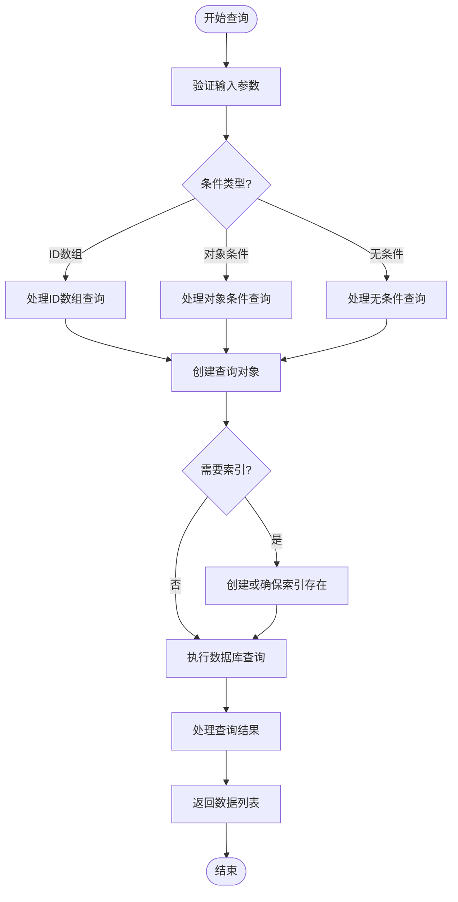
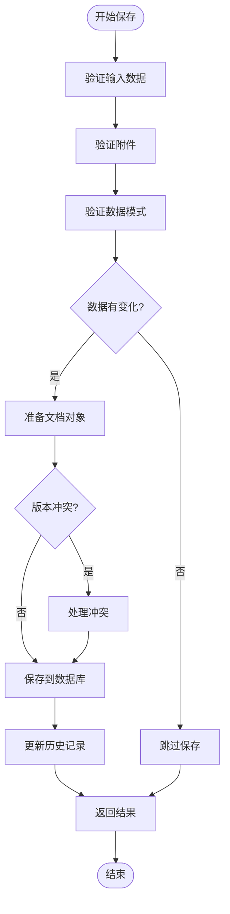
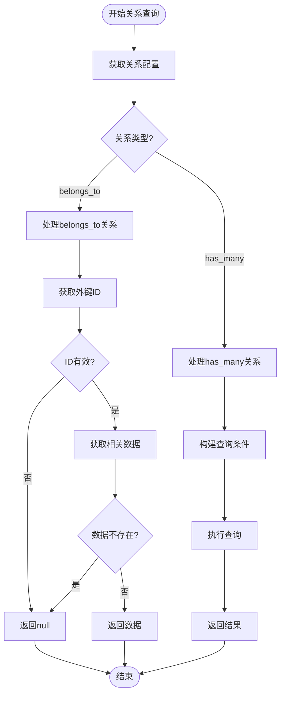
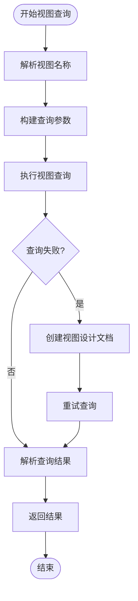
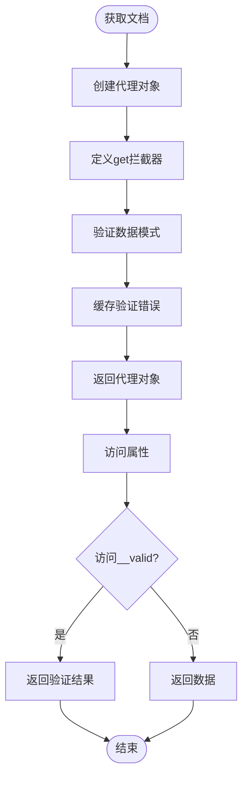
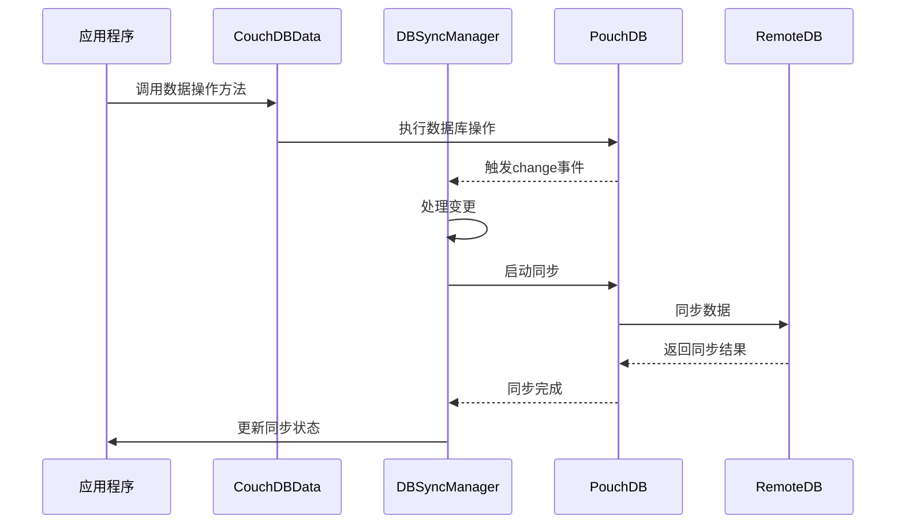
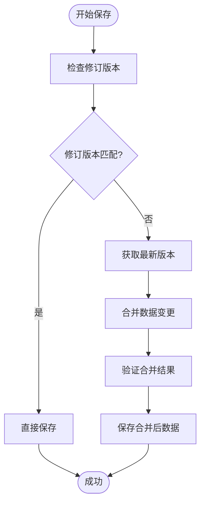
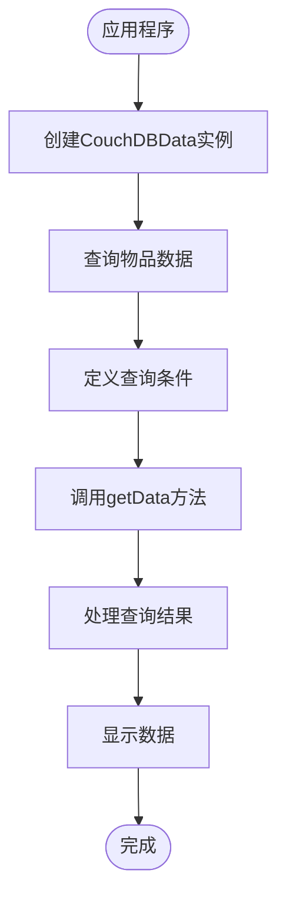
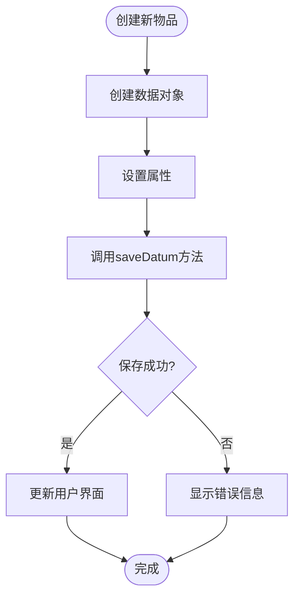
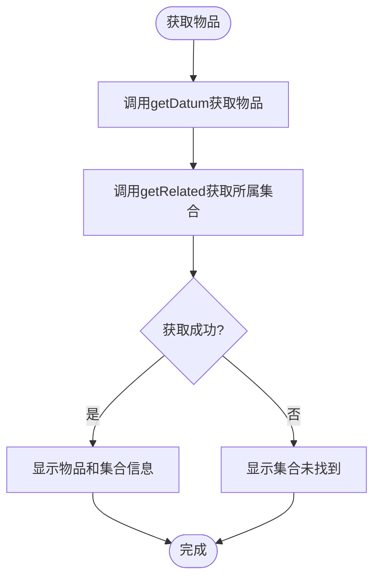

# 内部API文档

<cite>
**本文档中引用的文件**   
- [index.ts](file://packages/data-storage-couchdb/lib/index.ts)
- [CouchDBData.ts](file://packages/data-storage-couchdb/lib/CouchDBData.ts)
- [getGetData.ts](file://packages/data-storage-couchdb/lib/functions/getGetData.ts)
- [getSaveDatum.ts](file://packages/data-storage-couchdb/lib/functions/getSaveDatum.ts)
- [getGetRelated.ts](file://packages/data-storage-couchdb/lib/functions/getGetRelated.ts)
- [getGetViewData.ts](file://packages/data-storage-couchdb/lib/functions/getGetViewData.ts)
- [types.ts](file://packages/data-storage-couchdb/lib/functions/types.ts)
- [couchdb-utils.ts](file://packages/data-storage-couchdb/lib/functions/couchdb-utils.ts)
- [views.ts](file://packages/data-storage-couchdb/lib/views.ts)
- [data-storage-couchdb.test.ts](file://packages/data-storage-couchdb/lib/__tests__/data-storage-couchdb.test.ts)
</cite>

## 目录
1. [简介](#简介)
2. [核心函数接口定义](#核心函数接口定义)
3. [CouchDBData类公共方法](#couchdbdata类公共方法)
4. [数据访问抽象层实现](#数据访问抽象层实现)
5. [同步机制实现细节](#同步机制实现细节)
6. [实际使用示例](#实际使用示例)

## 简介

`data-storage-couchdb`包提供了对PouchDB/CouchDB数据库操作的高级抽象层，封装了底层数据库访问细节，为应用程序提供了一致的数据访问接口。该包的核心是`CouchDBData`类，它通过工厂函数创建各种数据访问方法，实现了类型安全的数据操作。

该包的主要功能包括：
- 数据查询（getGetData）
- 数据保存（getSaveDatum）
- 关系数据检索（getGetRelated）
- 视图数据查询（getGetViewData）
- 附件管理
- 数据验证和错误处理
- 同步机制支持

所有数据访问方法都通过上下文对象（Context）注入数据库实例、日志记录器和其他依赖项，实现了依赖注入模式，提高了代码的可测试性和灵活性。

**Section sources**
- [index.ts](file://packages/data-storage-couchdb/lib/index.ts#L1-L46)
- [CouchDBData.ts](file://packages/data-storage-couchdb/lib/CouchDBData.ts#L1-L97)

## 核心函数接口定义

### getGetData函数

`getGetData`函数用于根据指定条件查询数据，返回符合类型和条件的数据列表。

**参数类型：**
- `type`: 数据类型名称（如'item'、'collection'）
- `conditions`: 查询条件，可以是：
  - 对象：字段值匹配条件
  - 数组：ID列表
  - 空对象：查询所有该类型数据
- `options`: 查询选项对象，包含：
  - `skip`: 跳过记录数
  - `limit`: 返回记录数限制
  - `sort`: 排序规则数组
  - `debug`: 调试模式标志

**返回值格式：**
返回Promise<Array<DataType>>，其中数组元素为符合类型定义的数据对象，包含以下元数据属性：
- `__type`: 数据类型
- `__id`: 数据ID
- `__rev`: 修订版本
- `__created_at`: 创建时间戳
- `__updated_at`: 更新时间戳
- `__valid`: 数据有效性标志
- `__issues`: 数据验证问题列表（如果无效）

**错误处理机制：**
- 自动处理索引创建失败
- 重试机制处理临时性数据库错误
- 详细的调试信息输出
- 条件验证和类型检查



**Diagram sources**
- [getGetData.ts](file://packages/data-storage-couchdb/lib/functions/getGetData.ts#L20-L332)

### getSaveDatum函数

`getSaveDatum`函数用于保存或更新数据记录。

**参数类型：**
- `datum`: 要保存的数据对象，必须包含`__type`属性
- `options`: 保存选项，包含：
  - `ignoreConflict`: 是否忽略版本冲突

**返回值格式：**
返回Promise<DataType>，保存成功后的数据对象，包含更新后的元数据（如`__rev`）。

**错误处理机制：**
- 附件验证：检查必需附件是否存在和内容类型是否正确
- 数据验证：使用Zod模式验证数据完整性
- 冲突处理：检测和处理版本冲突
- 自动重试机制
- 详细的错误日志记录



**Diagram sources**
- [getSaveDatum.ts](file://packages/data-storage-couchdb/lib/functions/getSaveDatum.ts#L17-L141)

### getGetRelated函数

`getGetRelated`函数用于检索与指定数据项相关的其他数据项。

**参数类型：**
- `d`: 源数据项
- `relationName`: 关系名称
- `options`: 选项对象，包含排序规则

**返回值格式：**
返回Promise<RelatedDataType | null>，相关数据项或null（如果不存在）。

**关系类型支持：**
- `belongs_to`: 属于关系，返回单个相关对象
- `has_many`: 拥有多个关系，返回相关对象数组

**错误处理机制：**
- 处理"not_found"错误，返回null而不是抛出异常
- 验证关系配置的有效性
- 详细的调试日志



**Diagram sources**
- [getGetRelated.ts](file://packages/data-storage-couchdb/lib/functions/getGetRelated.ts#L8-L56)

### getGetViewData函数

`getGetViewData`函数用于查询CouchDB视图数据。

**参数类型：**
- `viewName`: 视图名称
- `options`: 查询选项，包含：
  - `key`: 键值
  - `startKey`: 起始键
  - `endKey`: 结束键
  - `descending`: 是否降序
  - `includeDocs`: 是否包含文档

**返回值格式：**
返回Promise<ViewDataType>，视图查询结果，经过数据解析器处理后的格式化数据。

**错误处理机制：**
- 自动创建缺失的视图设计文档
- 重试机制处理临时性错误
- 详细的错误日志记录
- 视图版本管理



**Diagram sources**
- [getGetViewData.ts](file://packages/data-storage-couchdb/lib/functions/getGetViewData.ts#L24-L126)

## CouchDBData类公共方法

`CouchDBData`类是数据访问的主要入口点，封装了所有数据操作方法。

### 公共方法列表

| 方法名 | 参数 | 返回值 | 描述 |
|-------|------|-------|------|
| `getConfig` | 无 | Promise<Config> | 获取配置数据 |
| `updateConfig` | config: Config | Promise<Config> | 更新配置数据 |
| `getDatum` | type: string, id: string | Promise<DataType \| null> | 根据ID获取单个数据项 |
| `getData` | type: string, conditions: object, options: QueryOptions | Promise<Array<DataType>> | 根据条件查询数据列表 |
| `getDataCount` | type: string, conditions: object | Promise<number> | 查询符合条件的数据数量 |
| `getRelated` | datum: DataType, relationName: string, options: object | Promise<RelatedType> | 获取相关数据 |
| `saveDatum` | datum: DataType, options: SaveOptions | Promise<DataType> | 保存数据项 |
| `attachAttachmentToDatum` | datum: DataType, name: string, content: any, contentType: string | Promise<AttachmentResult> | 附加文件到数据项 |
| `getAttachmentInfoFromDatum` | datum: DataType, name: string | Promise<AttachmentInfo> | 获取附件信息 |
| `getAttachmentFromDatum` | datum: DataType, name: string | Promise<AttachmentContent> | 获取附件内容 |
| `getAllAttachmentInfoFromDatum` | datum: DataType | Promise<Array<AttachmentInfo>> | 获取所有附件信息 |
| `getViewData` | viewName: string, options: ViewOptions | Promise<ViewResult> | 查询视图数据 |

### 生命周期事件

`CouchDBData`类在实例化时通过依赖注入初始化所有方法，确保所有依赖项（如数据库连接、日志记录器）都已正确配置。该类没有显式的生命周期方法，但其方法调用会触发相应的数据库事件和日志记录。

**Section sources**
- [CouchDBData.ts](file://packages/data-storage-couchdb/lib/CouchDBData.ts#L42-L97)

## 数据访问抽象层实现

### 数据模型映射

数据访问抽象层通过`getDatumFromDoc`和`getDocFromDatum`工具函数实现数据模型与CouchDB文档之间的双向映射。

```mermaid
classDiagram
class CouchDBDoc {
+_id : string
+_rev : string
+type : string
+data : object
+created_at : number
+updated_at : number
}
class DataType {
+__type : string
+__id : string
+__rev : string
+__created_at : number
+__updated_at : number
+其他业务数据属性
}
class couchdb-utils {
+getDatumFromDoc(doc, type) : DataType
+getDocFromDatum(datum) : CouchDBDoc
+getCouchDbId(type, id) : string
+getDataIdFromCouchDbId(id) : {type, id}
+flattenSelector(obj) : object
+sortObjectKeys(obj, order) : object
}
CouchDBDoc <--> DataType : 双向映射
couchdb-utils ..> CouchDBDoc : 使用
couchdb-utils ..> DataType : 使用
```

**Diagram sources**
- [couchdb-utils.ts](file://packages/data-storage-couchdb/lib/functions/couchdb-utils.ts#L15-L351)

### 索引管理

`getGetData`函数实现了自动索引管理，根据查询条件动态创建和使用索引。

**索引命名规则：**
- 基础索引：`auto_get_data_v1--type`
- 条件索引：`auto_get_data_v1--type_{type}--{field1}-{field2}`
- 排序索引：`auto_get_data_v1--type_{type}--{field1}-{field2}--desc`

**索引创建流程：**
1. 分析查询条件和排序规则
2. 生成索引名称和定义
3. 尝试使用现有索引查询
4. 如果失败，创建索引并重试

### 数据验证

数据验证通过Zod模式实现，在`getDatumFromDoc`函数中进行：



**Diagram sources**
- [couchdb-utils.ts](file://packages/data-storage-couchdb/lib/functions/couchdb-utils.ts#L66-L278)

## 同步机制实现细节

### 变更监听器

虽然`data-storage-couchdb`包本身不直接实现变更监听器，但它与`DBSyncManager`组件协同工作，支持数据同步。



**Diagram sources**
- [DBSyncManager.tsx](file://App/app/features/db-sync/DBSyncManager.tsx#L253-L742)

### 冲突解决策略

`getSaveDatum`函数实现了基于版本控制的冲突解决策略：

1. **乐观锁机制**：使用`_rev`字段检测并发修改
2. **自动重试**：在发生冲突时自动重试操作
3. **数据合并**：在某些情况下合并不同版本的数据
4. **用户干预**：在无法自动解决时提示用户

冲突解决流程：


## 实际使用示例

### 数据查询示例



**Section sources**
- [data-storage-couchdb.test.ts](file://packages/data-storage-couchdb/lib/__tests__/data-storage-couchdb.test.ts#L136-L800)

### 数据保存示例



### 关系数据检索示例



这些示例展示了如何在应用程序中使用`data-storage-couchdb`包的API进行常见的数据操作。通过这些封装良好的接口，开发者可以专注于业务逻辑而不是底层数据库细节。

**Section sources**
- [data-storage-couchdb.test.ts](file://packages/data-storage-couchdb/lib/__tests__/data-storage-couchdb.test.ts#L93-L133)
- [data-storage-couchdb.test.ts](file://packages/data-storage-couchdb/lib/__tests__/data-storage-couchdb.test.ts#L136-L260)