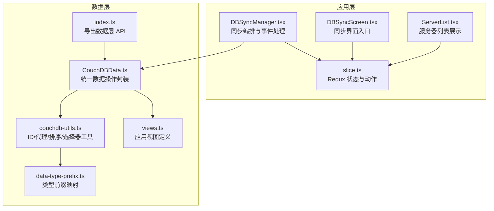
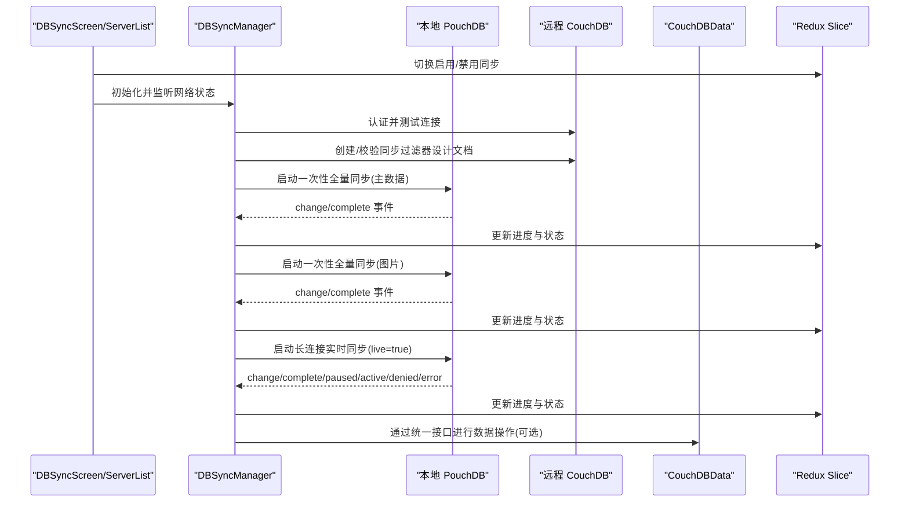
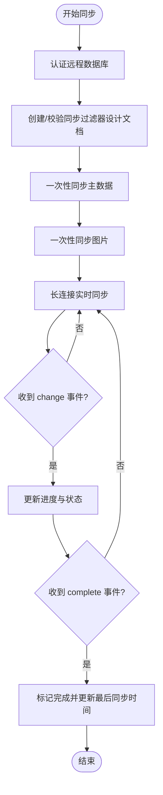
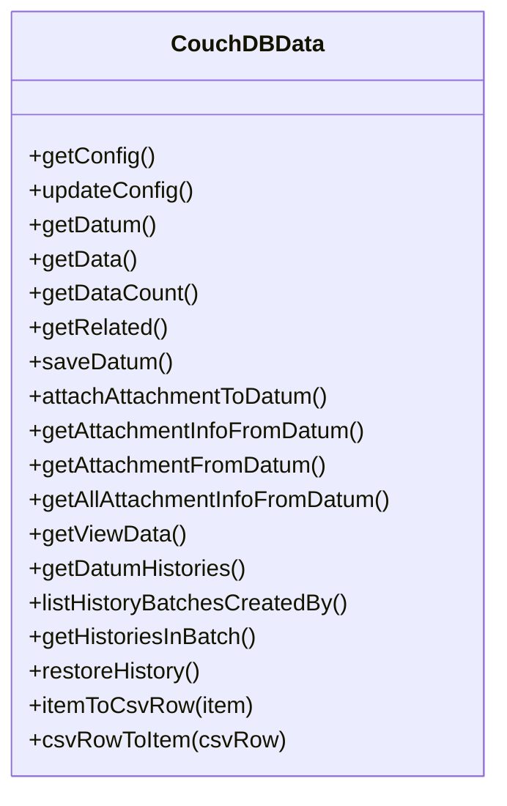
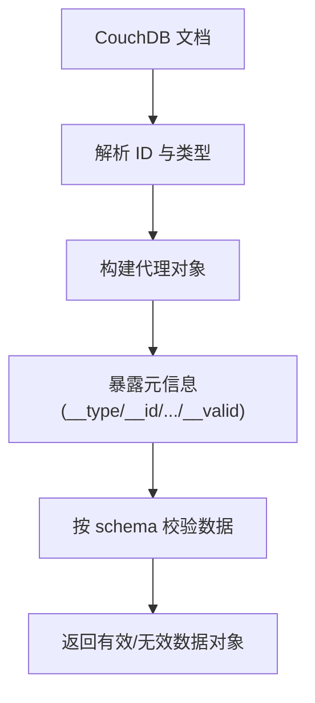
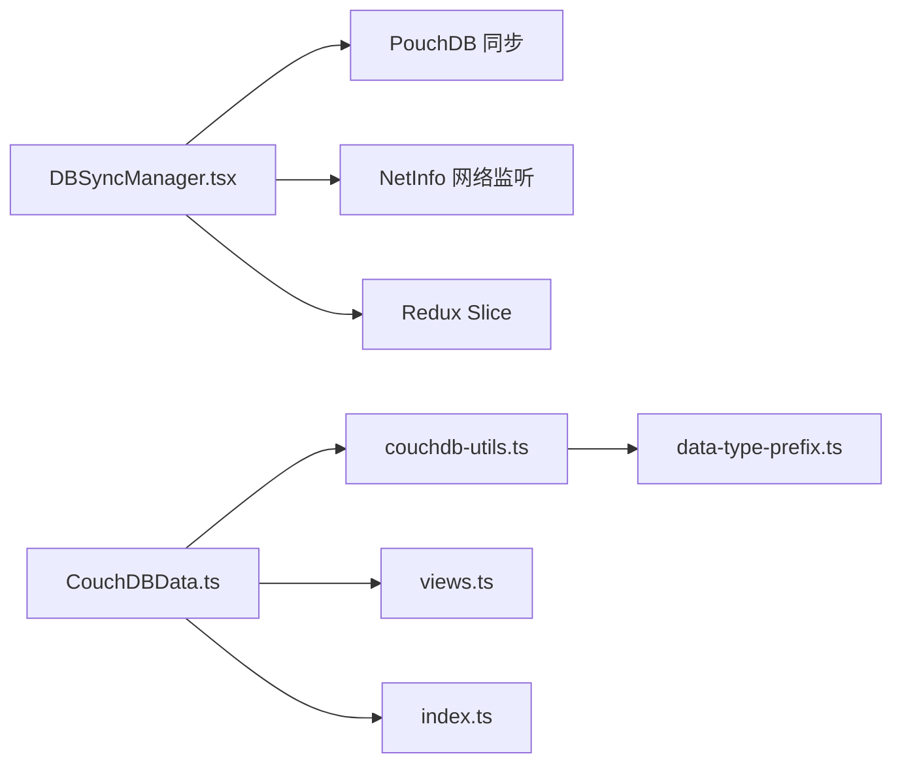

# 同步执行机制

<cite>
**本文引用的文件**
- [DBSyncManager.tsx](file://App/app/features/db-sync\DBSyncManager.tsx)
- [slice.ts](file://App/app/features/db-sync/slice.ts)
- [DBSyncScreen.tsx](file://App/app/features/db-sync/screens/DBSyncScreen.tsx)
- [ServerList.tsx](file://App/app/features/db-sync/components/ServerList.tsx)
- [couchdb-utils.ts](file://packages/data-storage-couchdb/lib/functions/couchdb-utils.ts)
- [CouchDBData.ts](file://packages/data-storage-couchdb/lib/CouchDBData.ts)
- [data-type-prefix.ts](file://packages/data-storage-couchdb/lib/data-type-prefix.ts)
- [views.ts](file://packages/data-storage-couchdb/lib/views.ts)
- [index.ts](file://packages/data-storage-couchdb/lib/index.ts)
- [fixDataConsistency.ts](file://Data/lib/utils/fixDataConsistency.ts)
</cite>

## 目录
1. [简介](#简介)
2. [项目结构](#项目结构)
3. [核心组件](#核心组件)
4. [架构总览](#架构总览)
5. [详细组件分析](#详细组件分析)
6. [依赖关系分析](#依赖关系分析)
7. [性能考量](#性能考量)
8. [故障排查指南](#故障排查指南)
9. [结论](#结论)

## 简介
本文件围绕“同步执行机制”展开，系统性解析以下主题：
- DBSyncManager 如何协调本地与远程 CouchDB 的双向同步流程，包括启动同步、增量同步、状态管理与网络恢复。
- couchdb-utils.ts 提供的底层工具函数（文档 ID 规则、代理访问、序列号解析等）在同步中的作用。
- CouchDBData 类如何封装数据操作接口，统一对外暴露查询、保存、附件处理、视图与历史记录等能力。
- 双向同步的实现细节：变更检测算法、冲突解决策略、增量同步优化。
- 离线优先架构下的数据一致性保障与网络恢复机制。

## 项目结构
与同步相关的关键模块分布如下：
- 应用层同步编排：DBSyncManager 负责连接、过滤、事件监听、进度上报与状态机切换。
- Redux 状态：slice 定义服务器配置、状态与进度字段，并提供更新动作。
- UI 展示：DBSyncScreen 与 ServerList 展示同步开关、服务器列表与最后同步时间。
- 数据层封装：CouchDBData 将具体数据操作封装为统一接口；couchdb-utils 提供 ID 前缀、代理访问、排序等工具。
- 设计文档与视图：同步过滤器设计文档与应用视图定义，支撑增量同步与统计查询。

图表来源
- [DBSyncManager.tsx](file://App/app/features/db-sync\DBSyncManager.tsx#L1-L120)
- [slice.ts](file://App/app/features/db-sync/slice.ts#L1-L120)
- [DBSyncScreen.tsx](file://App/app/features/db-sync/screens/DBSyncScreen.tsx#L1-L92)
- [ServerList.tsx](file://App/app/features/db-sync/components/ServerList.tsx#L1-L82)
- [CouchDBData.ts](file://packages/data-storage-couchdb/lib/CouchDBData.ts#L1-L97)
- [couchdb-utils.ts](file://packages/data-storage-couchdb/lib/functions/couchdb-utils.ts#L1-L120)
- [data-type-prefix.ts](file://packages/data-storage-couchdb/lib/data-type-prefix.ts#L1-L10)
- [views.ts](file://packages/data-storage-couchdb/lib/views.ts#L1-L60)
- [index.ts](file://packages/data-storage-couchdb/lib/index.ts#L25-L45)

章节来源
- [DBSyncManager.tsx](file://App/app/features/db-sync\DBSyncManager.tsx#L1-L120)
- [slice.ts](file://App/app/features/db-sync/slice.ts#L1-L120)

## 核心组件
- DBSyncManager：负责网络状态监听、认证远程数据库、创建/校验同步过滤器设计文档、启动一次性全量同步与长连接实时同步、事件回调与进度上报、错误与离线状态处理。
- CouchDBData：以类的形式聚合数据操作方法（getConfig、saveDatum、getData、getViewData、getDatumHistories 等），屏蔽底层实现差异。
- couchdb-utils：提供文档 ID 生成与解析、代理访问（含校验）、文档到数据对象转换、键排序、选择器扁平化等工具。
- slice：定义同步服务器状态、进度字段与 Redux 动作，支持批量更新与持久化重载。

章节来源
- [DBSyncManager.tsx](file://App/app/features/db-sync\DBSyncManager.tsx#L1-L120)
- [CouchDBData.ts](file://packages/data-storage-couchdb/lib/CouchDBData.ts#L1-L97)
- [couchdb-utils.ts](file://packages/data-storage-couchdb/lib/functions/couchdb-utils.ts#L1-L120)
- [slice.ts](file://App/app/features/db-sync/slice.ts#L1-L120)

## 架构总览
下图展示了从 UI 到数据层的同步调用链路与事件流。

图表来源
- [DBSyncManager.tsx](file://App/app/features/db-sync\DBSyncManager.tsx#L120-L220)
- [slice.ts](file://App/app/features/db-sync/slice.ts#L120-L220)
- [DBSyncScreen.tsx](file://App/app/features/db-sync/screens/DBSyncScreen.tsx#L1-L92)
- [ServerList.tsx](file://App/app/features/db-sync/components/ServerList.tsx#L1-L82)
- [CouchDBData.ts](file://packages/data-storage-couchdb/lib/CouchDBData.ts#L1-L97)

## 详细组件分析

### DBSyncManager：同步编排与事件处理
- 过滤器设计文档与分批同步
  - 在远程数据库上创建同步过滤器设计文档，包含“仅主数据”和“仅图片”两类过滤器，用于区分不同阶段的同步任务。
  - 首次启动采用多轮同步：先同步主数据，再同步图片，最后进入长连接实时同步，确保大体量附件不会阻塞主数据同步。
- 事件驱动的状态机
  - 监听 change/complete/paused/active/denied/error 等事件，动态更新进度与状态，支持断点续传与错误恢复。
  - 使用防抖定时器限制进度上报频率，避免频繁渲染与日志风暴。
- 网络与认证
  - 通过 NetInfo 监听网络状态变化，根据连接类型与费用策略决定是否启动同步。
  - 使用 fetch 包装器记录 HTTP 错误，登录失败时按离线或错误状态处理。
- 序列号解析与完成判定
  - 解析 last_seq 字符串为数字，结合本地/远程 update_seq 与 push/pull 最终序列号判断同步完成条件。
  - 对初始 0 场景进行特殊处理，避免空增量导致的误判。

图表来源
- [DBSyncManager.tsx](file://App/app/features/db-sync\DBSyncManager.tsx#L412-L742)

章节来源
- [DBSyncManager.tsx](file://App/app/features/db-sync\DBSyncManager.tsx#L1-L120)
- [DBSyncManager.tsx](file://App/app/features/db-sync\DBSyncManager.tsx#L120-L220)
- [DBSyncManager.tsx](file://App/app/features/db-sync\DBSyncManager.tsx#L220-L412)
- [DBSyncManager.tsx](file://App/app/features/db-sync\DBSyncManager.tsx#L412-L742)

### CouchDBData：数据操作封装
- 统一接口
  - 暴露 getConfig、updateConfig、getDatum、getData、getDataCount、getRelated、saveDatum、attachAttachmentToDatum、getAttachmentInfoFromDatum、getAttachmentFromDatum、getAllAttachmentInfoFromDatum、getViewData、getDatumHistories、listHistoryBatchesCreatedBy、getHistoriesInBatch、restoreHistory 等方法。
- CSV 导入导出辅助
  - 提供 itemToCsvRow 与 csvRowToItem，基于内部上下文方法实现数据转换。
- 上下文注入
  - 通过 Context 注入 db、logger、logLevels 等，便于在不同客户端（PouchDB/nano/WebSQL）下复用同一套逻辑。

图表来源
- [CouchDBData.ts](file://packages/data-storage-couchdb/lib/CouchDBData.ts#L1-L97)

章节来源
- [CouchDBData.ts](file://packages/data-storage-couchdb/lib/CouchDBData.ts#L1-L97)
- [index.ts](file://packages/data-storage-couchdb/lib/index.ts#L25-L45)

### couchdb-utils：底层工具函数
- 文档 ID 规则与类型前缀
  - 通过 DATA_TYPE_PREFIX 为不同类型分配前缀，确保 ID 具有可预测的范围，便于范围查询与过滤。
- 代理访问与校验
  - getDatumFromDoc 返回一个代理对象，提供 __type/__id/__rev/__deleted/__created_at/__updated_at/__raw/__valid/__issues/__error 等元信息访问，并对数据进行模式校验，便于调试与错误定位。
- 文档与数据对象互转
  - getDocFromDatum 将数据对象转换为 CouchDB 文档格式，按 schema 排序键值，保证存储一致性。
- 选择器与键排序
  - flattenSelector 将嵌套选择器扁平化，便于视图与查询使用。
  - sortObjectKeys 按 schema 定义顺序对对象键进行排序，减少存储差异。

图表来源
- [couchdb-utils.ts](file://packages/data-storage-couchdb/lib/functions/couchdb-utils.ts#L1-L120)
- [couchdb-utils.ts](file://packages/data-storage-couchdb/lib/functions/couchdb-utils.ts#L120-L220)
- [couchdb-utils.ts](file://packages/data-storage-couchdb/lib/functions/couchdb-utils.ts#L220-L351)
- [data-type-prefix.ts](file://packages/data-storage-couchdb/lib/data-type-prefix.ts#L1-L10)

章节来源
- [couchdb-utils.ts](file://packages/data-storage-couchdb/lib/functions/couchdb-utils.ts#L1-L120)
- [couchdb-utils.ts](file://packages/data-storage-couchdb/lib/functions/couchdb-utils.ts#L120-L220)
- [couchdb-utils.ts](file://packages/data-storage-couchdb/lib/functions/couchdb-utils.ts#L220-L351)
- [data-type-prefix.ts](file://packages/data-storage-couchdb/lib/data-type-prefix.ts#L1-L10)

### 双向同步实现细节
- 变更检测算法
  - 通过 PouchDB 的 change 事件携带 direction（push/pull）与 last_seq，结合本地/远程 info().update_seq 与 doc_count 实时计算进度。
  - 仅在 push 或 pull 方向上更新对应侧的 update_seq，避免跨方向覆盖。
- 冲突解决策略
  - 仓库未显式实现自定义冲突处理器；默认依赖 PouchDB/CouchDB 的内置冲突处理与版本控制（_rev）。建议在业务层通过 saveDatum 的 ignoreConflict 参数或自定义合并策略降低冲突概率。
- 增量同步优化
  - 分阶段同步：主数据先行，图片随后，最后进入 live 同步，平衡吞吐与延迟。
  - 批大小与批次限制：startup 同步使用较大批次，live 同步使用较小批次，降低网络压力。
  - 进度上报节流：1 秒内多次变更仅上报一次，减少 UI 与日志压力。
  - 设计文档过滤：通过过滤器设计文档仅传输必要文档，减少带宽占用。

章节来源
- [DBSyncManager.tsx](file://App/app/features/db-sync\DBSyncManager.tsx#L220-L412)
- [DBSyncManager.tsx](file://App/app/features/db-sync\DBSyncManager.tsx#L412-L742)

### 离线优先与网络恢复
- 离线优先
  - 本地数据库优先可用，所有 UI 与业务逻辑围绕本地数据展开；仅在网络可用且配置正确时才触发同步。
  - 当网络不可用或昂贵时，DBSyncManager 将服务器状态置为 Offline/Disabled，避免无意义的重试。
- 网络恢复机制
  - NetInfo 监听网络状态变化，当连接类型改变（如从蜂窝切换到 Wi-Fi）时，重新评估是否需要重启同步。
  - 远程认证失败时，根据错误码与消息分类为 Offline 或 Error，避免重复尝试。
  - 启动同步前会检查本地/远程配置有效性，确保双方均为合法的库存数据库。

章节来源
- [DBSyncManager.tsx](file://App/app/features/db-sync\DBSyncManager.tsx#L639-L725)

## 依赖关系分析
- DBSyncManager 依赖 PouchDB 进行本地/远程同步，依赖 NetInfo 管理网络状态，依赖 Redux slice 管理服务器状态与进度。
- CouchDBData 依赖上下文注入的 db、logger、logLevels，通过一系列 getXXX 函数实现统一的数据访问。
- couchdb-utils 依赖 schema 与 DATA_TYPE_PREFIX，提供 ID 规范化与代理访问。
- views.ts 定义应用视图，配合 CouchDBData 的 getViewData 使用，支撑统计与查询场景。

图表来源
- [DBSyncManager.tsx](file://App/app/features/db-sync\DBSyncManager.tsx#L1-L120)
- [CouchDBData.ts](file://packages/data-storage-couchdb/lib/CouchDBData.ts#L1-L97)
- [couchdb-utils.ts](file://packages/data-storage-couchdb/lib/functions/couchdb-utils.ts#L1-L120)
- [data-type-prefix.ts](file://packages/data-storage-couchdb/lib/data-type-prefix.ts#L1-L10)
- [views.ts](file://packages/data-storage-couchdb/lib/views.ts#L1-L60)
- [index.ts](file://packages/data-storage-couchdb/lib/index.ts#L25-L45)

章节来源
- [DBSyncManager.tsx](file://App/app/features/db-sync\DBSyncManager.tsx#L1-L120)
- [CouchDBData.ts](file://packages/data-storage-couchdb/lib/CouchDBData.ts#L1-L97)
- [couchdb-utils.ts](file://packages/data-storage-couchdb/lib/functions/couchdb-utils.ts#L1-L120)
- [data-type-prefix.ts](file://packages/data-storage-couchdb/lib/data-type-prefix.ts#L1-L10)
- [views.ts](file://packages/data-storage-couchdb/lib/views.ts#L1-L60)
- [index.ts](file://packages/data-storage-couchdb/lib/index.ts#L25-L45)

## 性能考量
- 批处理与并发
  - startup 同步使用较大的 batch_size 与 batches_limit，提高吞吐；live 同步使用较小批次，降低网络与内存压力。
- 进度上报节流
  - 1 秒内多次变更仅上报一次，避免 UI 与日志抖动。
- 过滤与索引
  - 使用过滤器设计文档减少传输与处理量；视图定义支持高效统计与查询。
- 数据一致性
  - 通过代理访问与 schema 校验在读取端发现异常，结合 fixDataConsistency 工具在后台修复不一致数据。

[本节为通用指导，无需列出章节来源]

## 故障排查指南
- 常见问题与定位
  - 远程认证失败：检查用户名/密码与网络连通性；查看 fetch 包装器输出的 HTTP 错误。
  - 设计文档缺失：确认已成功创建/校验同步过滤器设计文档；若失败重试至阈值。
  - 同步卡住：观察 change/complete 事件是否持续触发；检查 live 同步是否被 paused。
  - 状态异常：核对本地/远程 update_seq 与 push/pull 最终序列号；关注 0 初始值的完成判定。
- 数据一致性修复
  - 使用 fixDataConsistency 生成器逐批扫描并修复不一致数据，支持进度反馈与中断。
- UI 与日志
  - 通过 DBSyncScreen 的“查看日志”入口筛选 DBSyncManager 模块日志，快速定位问题。

章节来源
- [DBSyncManager.tsx](file://App/app/features/db-sync\DBSyncManager.tsx#L120-L220)
- [DBSyncManager.tsx](file://App/app/features/db-sync\DBSyncManager.tsx#L220-L412)
- [DBSyncScreen.tsx](file://App/app/features/db-sync/screens/DBSyncScreen.tsx#L1-L92)
- [fixDataConsistency.ts](file://Data/lib/utils/fixDataConsistency.ts#L1-L53)

## 结论
该同步机制以 DBSyncManager 为核心，结合 CouchDB 的设计文档过滤、PouchDB 的事件驱动与批处理能力，实现了稳健的双向同步。couchdb-utils 提供了 ID 规范化、代理访问与文档转换等基础能力，CouchDBData 则将这些能力整合为统一的数据接口。通过分阶段同步、进度节流与网络感知，系统在离线优先的前提下兼顾了性能与可靠性。对于冲突与一致性问题，建议在业务层引入更严格的合并策略与定期修复流程，以进一步提升稳定性。