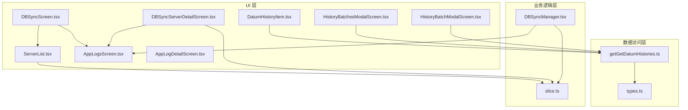
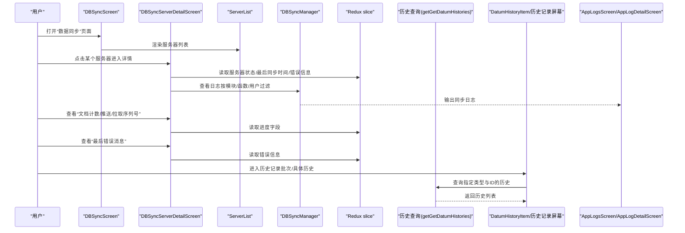
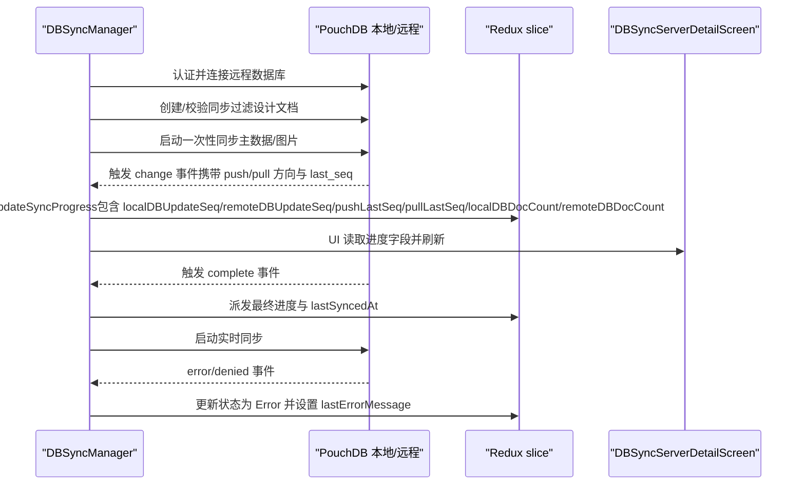
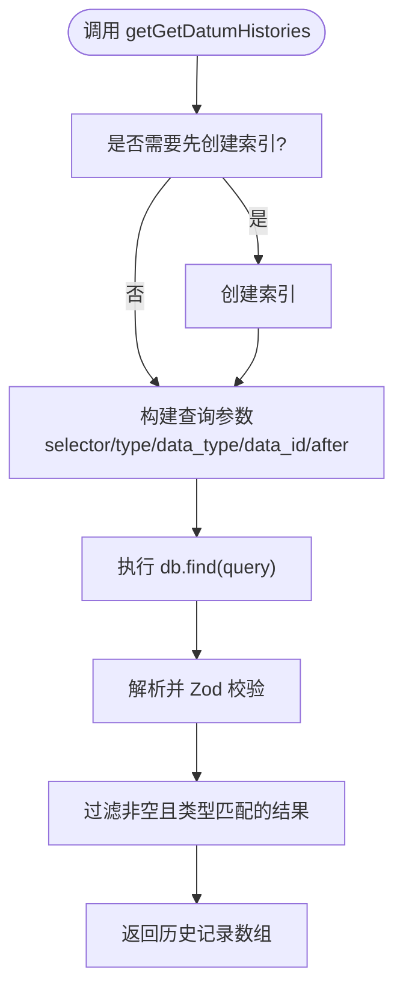
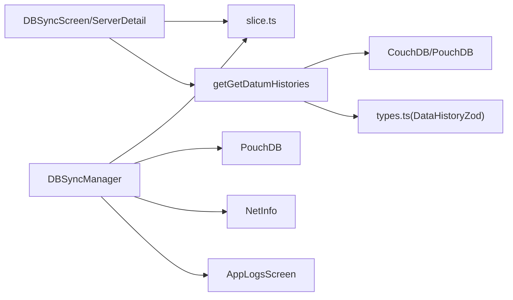

# 同步监控与状态

<cite>
**本文引用的文件**
- [DBSyncScreen.tsx](file://App/app/features/db-sync/screens/DBSyncScreen.tsx)
- [DBSyncServerDetailScreen.tsx](file://App/app/features/db-sync/screens/DBSyncServerDetailScreen.tsx)
- [ServerList.tsx](file://App/app/features/db-sync/components/ServerList.tsx)
- [DBSyncManager.tsx](file://App/app/features/db-sync/DBSyncManager.tsx)
- [slice.ts](file://App/app/features/db-sync/slice.ts)
- [getGetDatumHistories.ts](file://packages/data-storage-couchdb/lib/functions/getGetDatumHistories.ts)
- [DatumHistoryItem.tsx](file://App/app/components/DatumHistoryItem/DatumHistoryItem.tsx)
- [HistoryBatchesModalScreen.tsx](file://App/app/screens/data-history/HistoryBatchesModalScreen.tsx)
- [HistoryBatchModalScreen.tsx](file://App/app/screens/data-history/HistoryBatchModalScreen.tsx)
- [AppLogsScreen.tsx](file://App/app/screens/AppLogsScreen.tsx)
- [AppLogDetailScreen.tsx](file://App/app/screens/AppLogDetailScreen.tsx)
- [types.ts](file://packages/data-storage-couchdb/lib/types.ts)
</cite>

## 目录
1. [简介](#简介)
2. [项目结构](#项目结构)
3. [核心组件](#核心组件)
4. [架构总览](#架构总览)
5. [详细组件分析](#详细组件分析)
6. [依赖关系分析](#依赖关系分析)
7. [性能考量](#性能考量)
8. [故障排查指南](#故障排查指南)
9. [结论](#结论)
10. [附录](#附录)

## 简介
本文件聚焦于应用中的“同步监控与状态”能力，围绕以下目标展开：
- 展示 DBSyncScreen 与 DBSyncServerDetailScreen 如何呈现同步状态与历史记录
- 解释 getGetDatumHistories 如何获取数据变更历史，并说明 UI 层如何呈现同步进度、成功/失败统计与错误详情
- 提供实际示例：用户如何监控同步过程、查看历史记录、诊断同步问题

## 项目结构
与“同步监控与状态”直接相关的核心模块分布如下：
- UI 层（屏幕与组件）
  - DBSyncScreen：总览同步开关、服务器列表、高级入口（查看日志）
  - DBSyncServerDetailScreen：单个服务器详情页，展示状态、最后同步时间、错误信息、序列号等
  - ServerList：在总览页中展示各服务器的状态与最近同步时间
  - DatumHistoryItem：以列表项形式展示某条数据的历史变更详情
  - 历史记录相关屏幕：HistoryBatchesModalScreen、HistoryBatchModalScreen
  - 日志相关屏幕：AppLogsScreen、AppLogDetailScreen
- 业务逻辑层（Redux Slice 与同步管理器）
  - slice.ts：定义 dbSync 的状态、动作与选择器，包括服务器状态、最后同步时间、进度字段等
  - DBSyncManager.tsx：负责连接远程数据库、执行同步、监听事件并更新状态；同时记录网络状态与错误信息
- 数据访问层（历史查询）
  - getGetDatumHistories.ts：基于 CouchDB/PouchDB 查询指定类型与 ID 的历史记录，支持分页与时间过滤
  - types.ts：历史记录的数据模型 Zod 校验

图表来源
- [DBSyncScreen.tsx](file://App/app/features/db-sync/screens/DBSyncScreen.tsx#L1-L92)
- [DBSyncServerDetailScreen.tsx](file://App/app/features/db-sync/screens/DBSyncServerDetailScreen.tsx#L1-L290)
- [ServerList.tsx](file://App/app/features/db-sync/components/ServerList.tsx#L1-L82)
- [DBSyncManager.tsx](file://App/app/features/db-sync/DBSyncManager.tsx#L1-L743)
- [slice.ts](file://App/app/features/db-sync/slice.ts#L1-L348)
- [getGetDatumHistories.ts](file://packages/data-storage-couchdb/lib/functions/getGetDatumHistories.ts#L1-L104)
- [DatumHistoryItem.tsx](file://App/app/components/DatumHistoryItem/DatumHistoryItem.tsx#L1-L162)
- [HistoryBatchesModalScreen.tsx](file://App/app/screens/data-history/HistoryBatchesModalScreen.tsx#L1-L250)
- [HistoryBatchModalScreen.tsx](file://App/app/screens/data-history/HistoryBatchModalScreen.tsx#L45-L95)
- [AppLogsScreen.tsx](file://App/app/screens/AppLogsScreen.tsx#L1-L368)
- [AppLogDetailScreen.tsx](file://App/app/screens/AppLogDetailScreen.tsx#L1-L41)
- [types.ts](file://packages/data-storage-couchdb/lib/types.ts#L1-L12)

章节来源
- [DBSyncScreen.tsx](file://App/app/features/db-sync/screens/DBSyncScreen.tsx#L1-L92)
- [DBSyncServerDetailScreen.tsx](file://App/app/features/db-sync/screens/DBSyncServerDetailScreen.tsx#L1-L290)
- [ServerList.tsx](file://App/app/features/db-sync/components/ServerList.tsx#L1-L82)
- [DBSyncManager.tsx](file://App/app/features/db-sync/DBSyncManager.tsx#L1-L743)
- [slice.ts](file://App/app/features/db-sync/slice.ts#L1-L348)
- [getGetDatumHistories.ts](file://packages/data-storage-couchdb/lib/functions/getGetDatumHistories.ts#L1-L104)
- [DatumHistoryItem.tsx](file://App/app/components/DatumHistoryItem/DatumHistoryItem.tsx#L1-L162)
- [HistoryBatchesModalScreen.tsx](file://App/app/screens/data-history/HistoryBatchesModalScreen.tsx#L1-L250)
- [HistoryBatchModalScreen.tsx](file://App/app/screens/data-history/HistoryBatchModalScreen.tsx#L45-L95)
- [AppLogsScreen.tsx](file://App/app/screens/AppLogsScreen.tsx#L1-L368)
- [AppLogDetailScreen.tsx](file://App/app/screens/AppLogDetailScreen.tsx#L1-L41)
- [types.ts](file://packages/data-storage-couchdb/lib/types.ts#L1-L12)

## 核心组件
- DBSyncScreen：提供“启用同步”开关、“添加服务器”入口、服务器列表跳转、查看日志入口
- DBSyncServerDetailScreen：展示单个服务器的“状态”“最后同步时间”“错误信息”“URI/用户名”“启用开关”“编辑/删除服务器”“文档计数”“推送/拉取序列号”“查看日志”
- ServerList：在总览页中按名称排序显示服务器，展示状态与最近同步时间
- DBSyncManager：负责认证远程数据库、创建/校验同步过滤设计文档、启动一次性与实时同步、监听事件并更新 Redux 状态、记录网络状态与错误
- slice.ts：定义服务器状态枚举、状态对象字段、动作（启用/禁用、更新状态、设置最后错误消息、更新进度、更新最后同步时间）、选择器（整体状态计算）
- getGetDatumHistories：查询指定数据类型的变更历史，支持 limit、after 时间过滤与索引自动创建
- DatumHistoryItem：渲染一条历史记录的类型、数据名、变更详情（键值对对比），用于历史记录列表
- 历史记录相关屏幕：按批次分组查看历史、进入批次后查看具体历史项
- 日志相关屏幕：全局日志筛选与分页查看、日志详情

章节来源
- [DBSyncScreen.tsx](file://App/app/features/db-sync/screens/DBSyncScreen.tsx#L1-L92)
- [DBSyncServerDetailScreen.tsx](file://App/app/features/db-sync/screens/DBSyncServerDetailScreen.tsx#L1-L290)
- [ServerList.tsx](file://App/app/features/db-sync/components/ServerList.tsx#L1-L82)
- [DBSyncManager.tsx](file://App/app/features/db-sync/DBSyncManager.tsx#L1-L743)
- [slice.ts](file://App/app/features/db-sync/slice.ts#L1-L348)
- [getGetDatumHistories.ts](file://packages/data-storage-couchdb/lib/functions/getGetDatumHistories.ts#L1-L104)
- [DatumHistoryItem.tsx](file://App/app/components/DatumHistoryItem/DatumHistoryItem.tsx#L1-L162)
- [HistoryBatchesModalScreen.tsx](file://App/app/screens/data-history/HistoryBatchesModalScreen.tsx#L1-L250)
- [HistoryBatchModalScreen.tsx](file://App/app/screens/data-history/HistoryBatchModalScreen.tsx#L45-L95)
- [AppLogsScreen.tsx](file://App/app/screens/AppLogsScreen.tsx#L1-L368)
- [AppLogDetailScreen.tsx](file://App/app/screens/AppLogDetailScreen.tsx#L1-L41)

## 架构总览
下图展示了从 UI 到业务逻辑再到数据访问的整体流程，以及日志系统的集成点。

图表来源
- [DBSyncScreen.tsx](file://App/app/features/db-sync/screens/DBSyncScreen.tsx#L1-L92)
- [DBSyncServerDetailScreen.tsx](file://App/app/features/db-sync/screens/DBSyncServerDetailScreen.tsx#L1-L290)
- [ServerList.tsx](file://App/app/features/db-sync/components/ServerList.tsx#L1-L82)
- [DBSyncManager.tsx](file://App/app/features/db-sync/DBSyncManager.tsx#L1-L743)
- [slice.ts](file://App/app/features/db-sync/slice.ts#L1-L348)
- [getGetDatumHistories.ts](file://packages/data-storage-couchdb/lib/functions/getGetDatumHistories.ts#L1-L104)
- [DatumHistoryItem.tsx](file://App/app/components/DatumHistoryItem/DatumHistoryItem.tsx#L1-L162)
- [HistoryBatchesModalScreen.tsx](file://App/app/screens/data-history/HistoryBatchesModalScreen.tsx#L1-L250)
- [HistoryBatchModalScreen.tsx](file://App/app/screens/data-history/HistoryBatchModalScreen.tsx#L45-L95)
- [AppLogsScreen.tsx](file://App/app/screens/AppLogsScreen.tsx#L1-L368)
- [AppLogDetailScreen.tsx](file://App/app/screens/AppLogDetailScreen.tsx#L1-L41)

## 详细组件分析

### DBSyncScreen：总览与入口
- 功能要点
  - 开关“启用同步”，切换 Redux 中的 enable 字段
  - 展示服务器列表（可点击进入详情）
  - 高级入口：打开“DB Sync Logs”日志视图，按模块过滤为 DBSyncManager
- UI 呈现
  - 使用 UIGroup 组织开关、列表、按钮与分组
  - 通过 useAppSelector 读取 dbSyncEnabled 与当前用户 UUID
- 实际使用
  - 用户可在该页快速开启/关闭同步，并查看服务器概览

章节来源
- [DBSyncScreen.tsx](file://App/app/features/db-sync/screens/DBSyncScreen.tsx#L1-L92)
- [slice.ts](file://App/app/features/db-sync/slice.ts#L1-L348)

### DBSyncServerDetailScreen：单服务器详情与监控
- 功能要点
  - 展示状态、最后同步时间（支持多种时间格式切换）
  - 显示最后错误消息（若存在）
  - 显示 URI、用户名
  - 启用/禁用服务器开关
  - 编辑/删除服务器
  - 文档计数：本地/远端文档数量
  - 推送/拉取序列号：本地/远端 update_seq 与 pushLastSeq/pullLastSeq
  - 查看日志：按模块 DBSyncManager 与 function（服务器 id）过滤
- UI 呈现
  - 使用 UIGroup.ListItem 与 UIGroup.ListTextInputItem 组织信息
  - lastSyncAtDisplayType 支持“相对时间/本地化/Unix”三种显示模式
  - showAdvancedStatus 控制是否展开高级状态（序列号）

章节来源
- [DBSyncServerDetailScreen.tsx](file://App/app/features/db-sync/screens/DBSyncServerDetailScreen.tsx#L1-L290)
- [slice.ts](file://App/app/features/db-sync/slice.ts#L1-L348)

### ServerList：服务器列表
- 功能要点
  - 按名称排序展示服务器
  - 显示状态与“最后同步时间”（使用 TimeAgo）
  - 可导航到详情页
- UI 呈现
  - 使用 UIGroup.ListItemSeparator.insertBetween 插入分隔符
  - detail 区域组合状态与相对时间

章节来源
- [ServerList.tsx](file://App/app/features/db-sync/components/ServerList.tsx#L1-L82)
- [DBSyncServerDetailScreen.tsx](file://App/app/features/db-sync/screens/DBSyncServerDetailScreen.tsx#L1-L290)

### DBSyncManager：同步驱动与状态更新
- 功能要点
  - 订阅网络状态变化，根据连接性更新服务器状态
  - 认证远程数据库，测试可用性与配置有效性
  - 创建/校验同步过滤设计文档
  - 启动一次性同步（主数据与图片）与实时同步
  - 监听 PouchDB 同步事件（change/complete/paused/active/denied/error）
  - 更新 Redux 状态：服务器状态、最后错误消息、进度字段、最后同步时间
- 关键流程
  - _startSync：封装 syncHandler.on(...) 事件处理，计算并派发进度
  - startSync：串行执行启动同步（主数据→图片→全量），完成后进入实时同步
  - updateSyncProgress：节流派发进度，避免频繁重渲染
  - 错误处理：捕获 denied/error 事件，更新状态为 Error 并记录最后错误消息

图表来源
- [DBSyncManager.tsx](file://App/app/features/db-sync/DBSyncManager.tsx#L1-L743)
- [slice.ts](file://App/app/features/db-sync/slice.ts#L1-L348)
- [DBSyncServerDetailScreen.tsx](file://App/app/features/db-sync/screens/DBSyncServerDetailScreen.tsx#L1-L290)

章节来源
- [DBSyncManager.tsx](file://App/app/features/db-sync/DBSyncManager.tsx#L1-L743)
- [slice.ts](file://App/app/features/db-sync/slice.ts#L1-L348)

### getGetDatumHistories：获取数据变更历史
- 功能要点
  - 以 CouchDB/PouchDB find 查询历史记录
  - 支持索引自动创建（可选）
  - 支持 limit 与 after 时间过滤
  - 使用 Zod 校验返回的历史记录结构
- 性能与健壮性
  - 若首次查询失败，最多重试若干次并尝试自动创建索引
  - 返回结果先映射再过滤，确保类型安全

图表来源
- [getGetDatumHistories.ts](file://packages/data-storage-couchdb/lib/functions/getGetDatumHistories.ts#L1-L104)
- [types.ts](file://packages/data-storage-couchdb/lib/types.ts#L1-L12)

章节来源
- [getGetDatumHistories.ts](file://packages/data-storage-couchdb/lib/functions/getGetDatumHistories.ts#L1-L104)
- [types.ts](file://packages/data-storage-couchdb/lib/types.ts#L1-L12)

### DatumHistoryItem：历史记录项渲染
- 功能要点
  - 读取对应数据的名称（优先使用当前数据，其次历史中的原始/新数据）
  - 判断类型：CREATED/DELETED/UPDATED
  - 对 UPDATED 类型，列出键值差异（排除敏感字段）
- UI 呈现
  - 使用 UIGroup.ListItem 作为容器，展示数据类型、名称、类型标签与更新详情

章节来源
- [DatumHistoryItem.tsx](file://App/app/components/DatumHistoryItem/DatumHistoryItem.tsx#L1-L162)

### 历史记录相关屏幕：批次与批次内历史
- HistoryBatchesModalScreen
  - 加载历史批次（按时间分组：今天/昨天/近7天/近30天/更早）
  - 分页加载，支持“加载更多”
  - 点击批次进入批次详情
- HistoryBatchModalScreen
  - 加载批次内的具体历史项
  - 按数据类型分组（如 item/collection/others）
  - 结合 DatumHistoryItem 展示每条历史的变更详情

章节来源
- [HistoryBatchesModalScreen.tsx](file://App/app/screens/data-history/HistoryBatchesModalScreen.tsx#L1-L250)
- [HistoryBatchModalScreen.tsx](file://App/app/screens/data-history/HistoryBatchModalScreen.tsx#L45-L95)
- [DatumHistoryItem.tsx](file://App/app/components/DatumHistoryItem/DatumHistoryItem.tsx#L1-L162)

### 日志系统：DBSyncManager 日志与全局日志
- DBSyncServerDetailScreen
  - 提供“查看日志”入口，按 module=DBSyncManager、function=服务器 id、user=当前用户过滤
- AppLogsScreen/AppLogDetailScreen
  - 全局日志筛选、分页、搜索
  - 支持按级别、模块、函数、用户过滤
  - 展示日志详情（级别、模块、函数、时间戳、堆栈等）

章节来源
- [DBSyncServerDetailScreen.tsx](file://App/app/features/db-sync/screens/DBSyncServerDetailScreen.tsx#L1-L290)
- [AppLogsScreen.tsx](file://App/app/screens/AppLogsScreen.tsx#L1-L368)
- [AppLogDetailScreen.tsx](file://App/app/screens/AppLogDetailScreen.tsx#L1-L41)

## 依赖关系分析
- UI 层依赖 Redux 状态（servers/serverStatuses）
- DBSyncManager 依赖 PouchDB、网络状态、日志工具
- 历史查询依赖 CouchDB/PouchDB 的设计文档与索引
- 日志系统独立于同步逻辑，但通过过滤条件实现关联

图表来源
- [DBSyncScreen.tsx](file://App/app/features/db-sync/screens/DBSyncScreen.tsx#L1-L92)
- [DBSyncServerDetailScreen.tsx](file://App/app/features/db-sync/screens/DBSyncServerDetailScreen.tsx#L1-L290)
- [DBSyncManager.tsx](file://App/app/features/db-sync/DBSyncManager.tsx#L1-L743)
- [slice.ts](file://App/app/features/db-sync/slice.ts#L1-L348)
- [getGetDatumHistories.ts](file://packages/data-storage-couchdb/lib/functions/getGetDatumHistories.ts#L1-L104)
- [types.ts](file://packages/data-storage-couchdb/lib/types.ts#L1-L12)
- [AppLogsScreen.tsx](file://App/app/screens/AppLogsScreen.tsx#L1-L368)

章节来源
- [DBSyncManager.tsx](file://App/app/features/db-sync/DBSyncManager.tsx#L1-L743)
- [slice.ts](file://App/app/features/db-sync/slice.ts#L1-L348)
- [getGetDatumHistories.ts](file://packages/data-storage-couchdb/lib/functions/getGetDatumHistories.ts#L1-L104)
- [types.ts](file://packages/data-storage-couchdb/lib/types.ts#L1-L12)
- [AppLogsScreen.tsx](file://App/app/screens/AppLogsScreen.tsx#L1-L368)

## 性能考量
- 同步进度节流
  - updateSyncProgress 使用定时器与时间戳控制，避免高频更新导致 UI 抖动与过度重渲染
- 网络状态与批量策略
  - 根据网络连接类型与是否昂贵网络决定是否暂停或调整策略
  - 批大小与批次数限制用于控制同步吞吐与资源占用
- 历史查询健壮性
  - 自动创建索引与多次重试，提升查询成功率
  - Zod 校验保证返回数据结构一致性，减少 UI 渲染异常

章节来源
- [DBSyncManager.tsx](file://App/app/features/db-sync/DBSyncManager.tsx#L206-L251)
- [getGetDatumHistories.ts](file://packages/data-storage-couchdb/lib/functions/getGetDatumHistories.ts#L1-L104)

## 故障排查指南
- 常见状态与含义
  - Initializing/Offline/Syncing/Online/Error/Disabled/-：由 selectors.overallStatus 与 updateServerStatus 决定
- 快速定位
  - 在 DBSyncServerDetailScreen 查看“最后错误消息”与“状态”
  - 在“查看日志”中按 module=DBSyncManager、function=服务器 id、user=当前用户过滤
- 常见原因
  - 网络不可用或昂贵网络
  - 远程数据库认证失败或配置无效
  - 同步被 denied 或发生错误事件
- 处理建议
  - 确认网络连接与费用策略
  - 检查服务器 URI、用户名、密码
  - 查看日志详情，定位具体错误码与堆栈
  - 若索引缺失，等待自动创建或手动触发重建

章节来源
- [DBSyncServerDetailScreen.tsx](file://App/app/features/db-sync/screens/DBSyncServerDetailScreen.tsx#L1-L290)
- [DBSyncManager.tsx](file://App/app/features/db-sync/DBSyncManager.tsx#L1-L743)
- [AppLogsScreen.tsx](file://App/app/screens/AppLogsScreen.tsx#L1-L368)

## 结论
本系统通过 UI 层（DBSyncScreen/ServerDetail）、业务层（DBSyncManager）与数据层（getGetDatumHistories）协同，实现了：
- 可观测的同步状态（状态、最后同步时间、错误信息、序列号）
- 可追溯的历史记录（按批次与具体历史项查看）
- 可诊断的日志体系（按模块/函数/用户过滤）
- 稳健的性能与容错机制（进度节流、索引自动创建、错误事件处理）

## 附录
- 实际示例：用户如何监控与诊断
  - 监控同步过程
    - 在 DBSyncScreen 打开“启用同步”，查看服务器列表与状态
    - 进入 DBSyncServerDetailScreen，查看“状态”“最后同步时间”“文档计数”“推送/拉取序列号”
  - 查看历史记录
    - 在历史记录批次页按时间分组浏览，进入批次后查看具体历史项
    - 使用 DatumHistoryItem 查看某条历史的类型与键值差异
  - 诊断同步问题
    - 在 DBSyncServerDetailScreen 点击“查看日志”，按 module=DBSyncManager、function=服务器 id、user=当前用户过滤
    - 在全局日志页进一步筛选级别、模块、函数、用户，查看日志详情

章节来源
- [DBSyncScreen.tsx](file://App/app/features/db-sync/screens/DBSyncScreen.tsx#L1-L92)
- [DBSyncServerDetailScreen.tsx](file://App/app/features/db-sync/screens/DBSyncServerDetailScreen.tsx#L1-L290)
- [HistoryBatchesModalScreen.tsx](file://App/app/screens/data-history/HistoryBatchesModalScreen.tsx#L1-L250)
- [HistoryBatchModalScreen.tsx](file://App/app/screens/data-history/HistoryBatchModalScreen.tsx#L45-L95)
- [DatumHistoryItem.tsx](file://App/app/components/DatumHistoryItem/DatumHistoryItem.tsx#L1-L162)
- [AppLogsScreen.tsx](file://App/app/screens/AppLogsScreen.tsx#L1-L368)