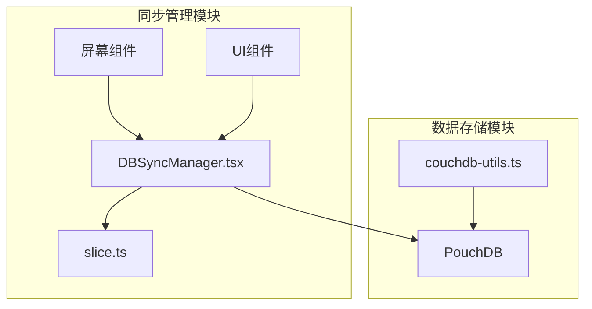
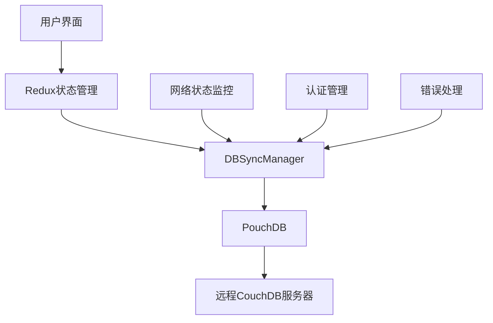
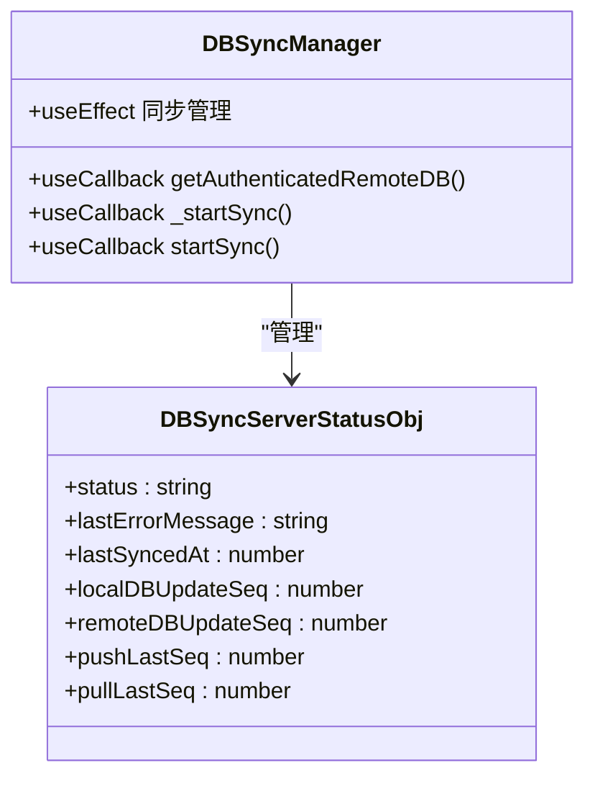
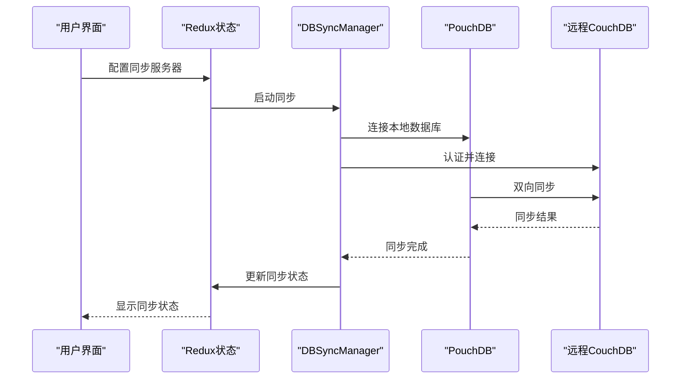
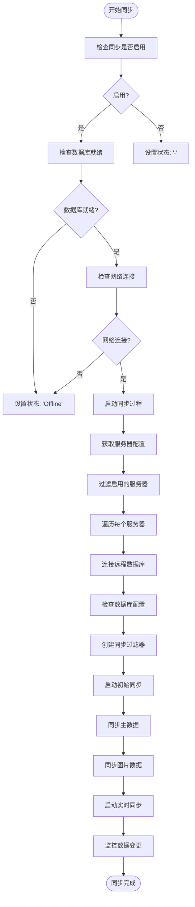
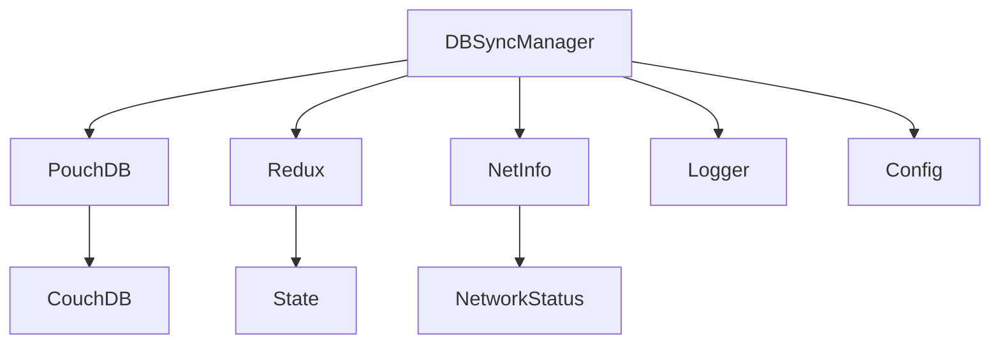

# 同步管理API

<cite>
**本文档中引用的文件**   
- [DBSyncManager.tsx](file://App/app/features/db-sync/DBSyncManager.tsx)
- [couchdb-utils.ts](file://packages/data-storage-couchdb/lib/functions/couchdb-utils.ts)
- [slice.ts](file://App/app/features/db-sync/slice.ts)
</cite>

## 目录
1. [简介](#简介)
2. [项目结构](#项目结构)
3. [核心组件](#核心组件)
4. [架构概述](#架构概述)
5. [详细组件分析](#详细组件分析)
6. [依赖分析](#依赖分析)
7. [性能考虑](#性能考虑)
8. [故障排除指南](#故障排除指南)
9. [结论](#结论)

## 简介
同步管理API是Inventory应用程序的核心功能之一，它实现了本地数据库与远程CouchDB服务器之间的双向同步。该系统基于PouchDB和CouchDB的同步机制，提供了离线优先的数据管理能力。API的核心是`DBSyncManager`类，它负责管理同步过程、处理连接和认证、监控同步状态，并实现增量同步策略。同步系统还包含了冲突解决机制和数据一致性保障措施，确保在多设备环境下数据的完整性和一致性。

## 项目结构
同步管理功能主要分布在应用程序的`db-sync`特性模块中，该模块包含了同步管理器、状态管理、用户界面组件等。系统使用Redux进行状态管理，通过`slice.ts`文件定义了同步相关的状态结构和操作。`DBSyncManager.tsx`是核心同步逻辑的实现，而`couchdb-utils.ts`提供了与CouchDB交互的实用函数。整个同步系统与应用程序的数据库层紧密集成，使用PouchDB作为本地数据库引擎。

**图表来源**
- [DBSyncManager.tsx](file://App/app/features/db-sync/DBSyncManager.tsx)
- [slice.ts](file://App/app/features/db-sync/slice.ts)
- [couchdb-utils.ts](file://packages/data-storage-couchdb/lib/functions/couchdb-utils.ts)

**章节来源**
- [DBSyncManager.tsx](file://App/app/features/db-sync/DBSyncManager.tsx)
- [slice.ts](file://App/app/features/db-sync/slice.ts)

## 核心组件
同步管理API的核心组件包括`DBSyncManager`类和`couchdb-utils.ts`中的同步相关函数。`DBSyncManager`是一个React函数组件，它使用useCallback和useEffect等React Hooks来管理同步逻辑。该组件负责监控网络状态、管理服务器连接、执行同步操作并更新同步状态。`couchdb-utils.ts`文件提供了与CouchDB数据库交互的实用函数，如生成文档ID、从文档中提取数据等。这些组件共同实现了双向同步机制，包括变更检测、冲突解决和增量同步策略。

**章节来源**
- [DBSyncManager.tsx](file://App/app/features/db-sync/DBSyncManager.tsx)
- [couchdb-utils.ts](file://packages/data-storage-couchdb/lib/functions/couchdb-utils.ts)

## 架构概述
同步管理API采用分层架构设计，顶层是用户界面层，中间是同步管理层，底层是数据存储层。用户界面层通过Redux与同步管理层交互，同步管理层使用PouchDB的同步功能与远程CouchDB服务器通信。系统实现了离线优先的设计理念，用户可以在没有网络连接的情况下正常使用应用程序，当网络恢复时，系统会自动同步本地变更到远程服务器。架构中还包含了错误恢复机制，能够处理网络中断、认证失败等各种异常情况。

**图表来源**
- [DBSyncManager.tsx](file://App/app/features/db-sync/DBSyncManager.tsx)

## 详细组件分析

### DBSyncManager分析
`DBSyncManager`是同步功能的核心实现，它使用React的useEffect Hook在组件挂载时启动同步过程。组件首先检查同步是否启用、数据库是否就绪以及网络连接状态。如果所有条件满足，它会遍历所有启用的服务器配置，为每个服务器启动同步。同步过程分为两个阶段：启动同步和实时同步。启动同步用于初始数据同步，而实时同步则在数据变更时自动同步。

#### 对象导向组件：

**图表来源**
- [DBSyncManager.tsx](file://App/app/features/db-sync/DBSyncManager.tsx)
- [slice.ts](file://App/app/features/db-sync/slice.ts)

#### API/服务组件：

**图表来源**
- [DBSyncManager.tsx](file://App/app/features/db-sync/DBSyncManager.tsx)
- [slice.ts](file://App/app/features/db-sync/slice.ts)

#### 复杂逻辑组件：

**图表来源**
- [DBSyncManager.tsx](file://App/app/features/db-sync/DBSyncManager.tsx)

**章节来源**
- [DBSyncManager.tsx](file://App/app/features/db-sync/DBSyncManager.tsx)

### couchdb-utils分析
`couchdb-utils.ts`文件提供了与CouchDB数据库交互的实用函数。这些函数主要用于处理文档ID的生成和解析、数据验证、以及文档与数据对象之间的转换。`getCouchDbId`函数根据数据类型和ID生成符合应用程序规范的文档ID，而`getDataIdFromCouchDbId`则执行相反的操作，从文档ID中提取数据类型和ID。`getDatumFromDoc`和`getDocFromDatum`函数实现了文档与数据对象之间的双向转换，确保数据的一致性和完整性。

**章节来源**
- [couchdb-utils.ts](file://packages/data-storage-couchdb/lib/functions/couchdb-utils.ts)

## 依赖分析
同步管理API依赖于多个外部库和内部模块。主要依赖包括PouchDB用于本地数据库存储和同步，Redux用于状态管理，以及React Native的NetInfo模块用于网络状态监控。内部依赖包括应用程序的数据库模块、日志模块和配置管理模块。这些依赖关系确保了同步功能的稳定性和可靠性，同时也使得系统具有良好的可维护性和可扩展性。

**图表来源**
- [DBSyncManager.tsx](file://App/app/features/db-sync/DBSyncManager.tsx)

**章节来源**
- [DBSyncManager.tsx](file://App/app/features/db-sync/DBSyncManager.tsx)

## 性能考虑
同步管理API在设计时充分考虑了性能因素。系统实现了增量同步策略，只同步自上次同步以来发生变更的数据，减少了网络传输量。同步过程被分解为多个小批次，避免了长时间占用主线程导致的UI卡顿。此外，系统还实现了同步进度的节流机制，避免频繁更新UI状态。对于大型数据集，系统采用了分批处理的方式，确保内存使用在合理范围内。

## 故障排除指南
当同步出现问题时，可以按照以下步骤进行排查：首先检查网络连接状态，确保设备能够访问远程服务器；其次检查服务器配置，包括URI、用户名和密码是否正确；然后查看同步日志，了解具体的错误信息；最后尝试重启应用程序或重新配置同步服务器。系统提供了详细的错误处理机制，能够在发生错误时提供有意义的错误信息，帮助用户快速定位和解决问题。

**章节来源**
- [DBSyncManager.tsx](file://App/app/features/db-sync/DBSyncManager.tsx)

## 结论
同步管理API通过`DBSyncManager`类和`couchdb-utils.ts`中的函数实现了高效、可靠的双向同步机制。系统采用了离线优先的设计理念，确保了用户体验的连续性。通过增量同步、冲突解决和错误恢复机制，系统能够在各种网络条件下保持数据的一致性和完整性。API的设计充分考虑了性能和可维护性，为Inventory应用程序提供了强大的数据同步能力。