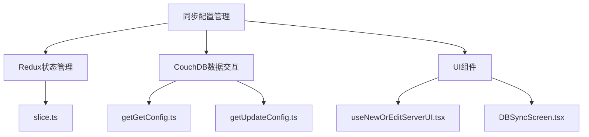
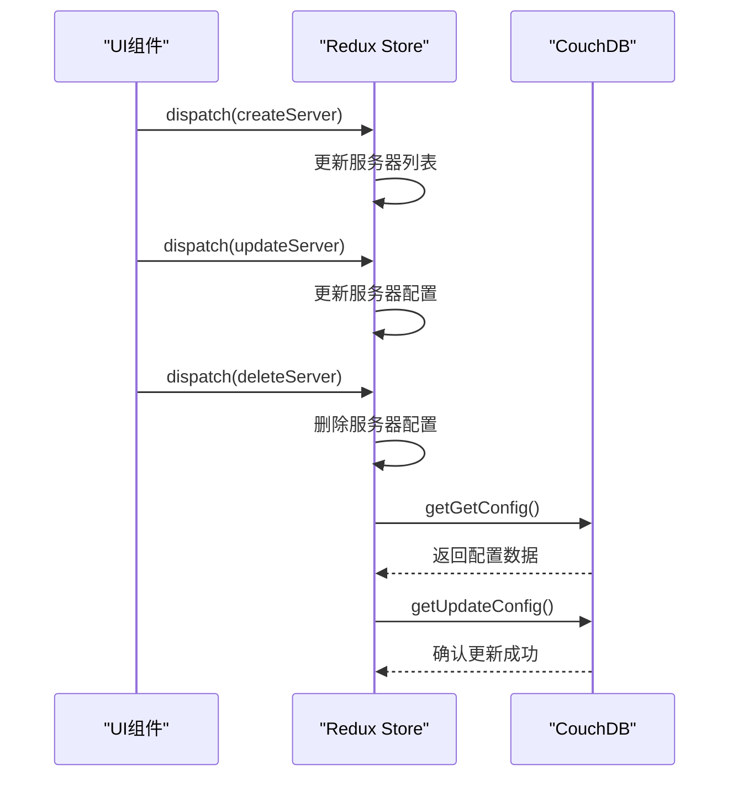
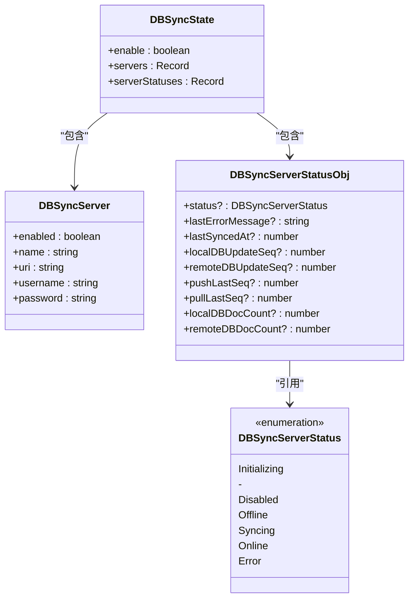
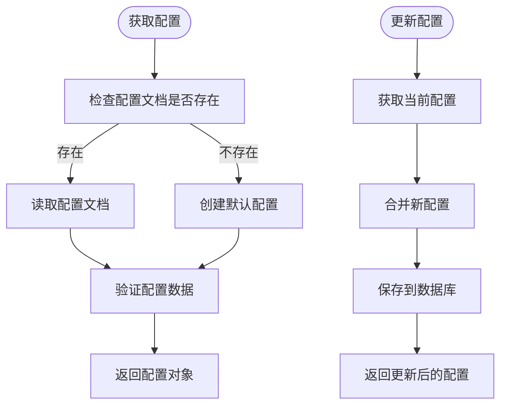
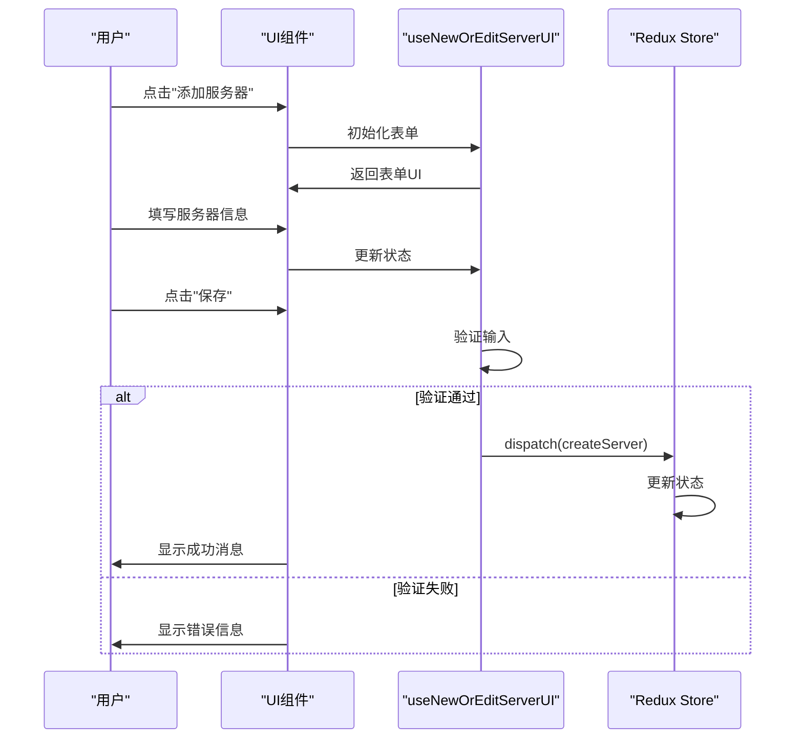
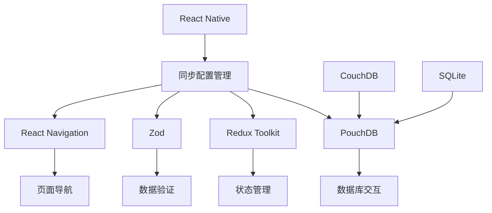

# 同步配置管理

<cite>
**本文档引用的文件**
- [slice.ts](file://App/App/features/db-sync/slice.ts)
- [getGetConfig.ts](file://packages/data-storage-couchdb/lib/functions/getGetConfig.ts)
- [getUpdateConfig.ts](file://packages/data-storage-couchdb/lib/functions/getUpdateConfig.ts)
- [CouchDBData.ts](file://packages/data-storage-couchdb/lib/CouchDBData.ts)
- [useNewOrEditServerUI.tsx](file://App/App/features/db-sync/hooks/useNewOrEditServerUI.tsx)
- [DBSyncNewOrEditServerModalScreen.tsx](file://App/App/features/db-sync/screens/DBSyncNewOrEditServerModalScreen.tsx)
- [DBSyncScreen.tsx](file://App/App/features/db-sync/screens/DBSyncScreen.tsx)
- [schema.ts](file://Data/lib/schema.ts)
</cite>

## 目录
1. [简介](#简介)
2. [项目结构](#项目结构)
3. [核心组件](#核心组件)
4. [架构概述](#架构概述)
5. [详细组件分析](#详细组件分析)
6. [依赖分析](#依赖分析)
7. [性能考虑](#性能考虑)
8. [故障排除指南](#故障排除指南)
9. [结论](#结论)

## 简介
本文档详细介绍了库存管理应用中的同步配置管理系统。该系统通过Redux状态管理实现同步配置的管理，并与CouchDB数据库进行交互以获取和更新配置。文档涵盖了配置项的结构设计、持久化机制、默认值处理，以及添加、编辑和删除同步服务器配置的实际示例。同时，还说明了配置验证和错误处理机制。

## 项目结构
同步配置管理功能主要分布在以下几个目录中：
- `App/App/features/db-sync/`: 包含同步功能的核心Redux slice、UI组件和钩子
- `packages/data-storage-couchdb/lib/functions/`: 包含与CouchDB交互的核心函数
- `Data/lib/schema.ts`: 定义了配置数据的结构和验证规则

**Diagram sources**
- [slice.ts](file://App/App/features/db-sync/slice.ts)
- [getGetConfig.ts](file://packages/data-storage-couchdb/lib/functions/getGetConfig.ts)
- [getUpdateConfig.ts](file://packages/data-storage-couchdb/lib/functions/getUpdateConfig.ts)
- [useNewOrEditServerUI.tsx](file://App/App/features/db-sync/hooks/useNewOrEditServerUI.tsx)
- [DBSyncScreen.tsx](file://App/App/features/db-sync/screens/DBSyncScreen.tsx)

**Section sources**
- [slice.ts](file://App/App/features/db-sync/slice.ts)
- [getGetConfig.ts](file://packages/data-storage-couchdb/lib/functions/getGetConfig.ts)
- [getUpdateConfig.ts](file://packages/data-storage-couchdb/lib/functions/getUpdateConfig.ts)

## 核心组件
同步配置管理系统的核心组件包括Redux slice、CouchDB交互函数和UI组件。Redux slice负责管理同步服务器的状态，包括启用状态、服务器列表和同步状态。CouchDB交互函数提供了获取和更新配置的功能，而UI组件则提供了用户界面来管理这些配置。

**Section sources**
- [slice.ts](file://App/App/features/db-sync/slice.ts)
- [getGetConfig.ts](file://packages/data-storage-couchdb/lib/functions/getGetConfig.ts)
- [getUpdateConfig.ts](file://packages/data-storage-couchdb/lib/functions/getUpdateConfig.ts)

## 架构概述
同步配置管理系统的架构基于Redux状态管理和CouchDB数据持久化。系统通过Redux store管理同步配置的状态，包括全局同步开关、服务器列表和每个服务器的同步状态。配置数据存储在CouchDB数据库中，通过专门的函数进行读取和更新。

**Diagram sources**
- [slice.ts](file://App/App/features/db-sync/slice.ts)
- [getGetConfig.ts](file://packages/data-storage-couchdb/lib/functions/getGetConfig.ts)
- [getUpdateConfig.ts](file://packages/data-storage-couchdb/lib/functions/getUpdateConfig.ts)

## 详细组件分析

### Redux Slice分析
`slice.ts`文件定义了同步配置管理的Redux slice，包含了管理同步服务器的所有reducer函数。

**Diagram sources**
- [slice.ts](file://App/App/features/db-sync/slice.ts)

**Section sources**
- [slice.ts](file://App/App/features/db-sync/slice.ts)

### CouchDB交互函数分析
`getGetConfig.ts`和`getUpdateConfig.ts`文件提供了与CouchDB数据库交互的核心功能。

**Diagram sources**
- [getGetConfig.ts](file://packages/data-storage-couchdb/lib/functions/getGetConfig.ts)
- [getUpdateConfig.ts](file://packages/data-storage-couchdb/lib/functions/getUpdateConfig.ts)

**Section sources**
- [getGetConfig.ts](file://packages/data-storage-couchdb/lib/functions/getGetConfig.ts)
- [getUpdateConfig.ts](file://packages/data-storage-couchdb/lib/functions/getUpdateConfig.ts)

### UI组件分析
UI组件提供了用户界面来管理同步服务器配置，包括添加、编辑和删除操作。

**Diagram sources**
- [useNewOrEditServerUI.tsx](file://App/App/features/db-sync/hooks/useNewOrEditServerUI.tsx)
- [DBSyncNewOrEditServerModalScreen.tsx](file://App/App/features/db-sync/screens/DBSyncNewOrEditServerModalScreen.tsx)

**Section sources**
- [useNewOrEditServerUI.tsx](file://App/App/features/db-sync/hooks/useNewOrEditServerUI.tsx)
- [DBSyncNewOrEditServerModalScreen.tsx](file://App/App/features/db-sync/screens/DBSyncNewOrEditServerModalScreen.tsx)

## 依赖分析
同步配置管理系统依赖于多个核心模块和库：

**Diagram sources**
- [package.json](file://package.json)
- [slice.ts](file://App/App/features/db-sync/slice.ts)
- [pouchdb.ts](file://App/App/db/pouchdb.ts)

**Section sources**
- [package.json](file://package.json)
- [slice.ts](file://App/App/features/db-sync/slice.ts)

## 性能考虑
同步配置管理系统的性能主要受以下几个因素影响：
- Redux状态更新的频率和大小
- CouchDB数据库读写操作的效率
- UI组件的渲染性能
- 网络请求的延迟和带宽

为了优化性能，系统采用了以下策略：
1. 使用Redux Toolkit的immer库来高效地处理不可变状态更新
2. 对CouchDB操作进行批处理和缓存
3. 使用React.memo和useCallback优化UI组件渲染
4. 实现配置数据的本地缓存，减少网络请求

## 故障排除指南
在使用同步配置管理系统时，可能会遇到以下常见问题：

**Section sources**
- [slice.ts](file://App/App/features/db-sync/slice.ts)
- [getGetConfig.ts](file://packages/data-storage-couchdb/lib/functions/getGetConfig.ts)
- [getUpdateConfig.ts](file://packages/data-storage-couchdb/lib/functions/getUpdateConfig.ts)
- [useNewOrEditServerUI.tsx](file://App/App/features/db-sync/hooks/useNewOrEditServerUI.tsx)

## 结论
同步配置管理系统通过Redux状态管理和CouchDB数据持久化，为库存管理应用提供了可靠的同步功能。系统设计合理，代码结构清晰，具有良好的可维护性和扩展性。通过详细的配置管理功能，用户可以方便地设置和管理多个同步服务器，确保数据在不同设备间的同步和一致性。