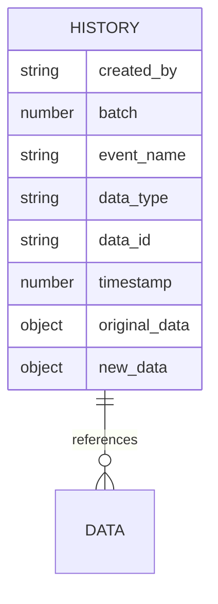
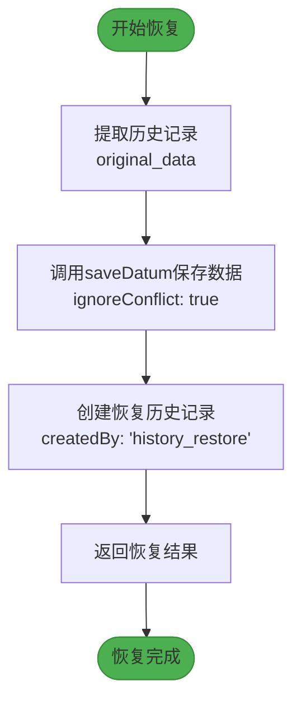
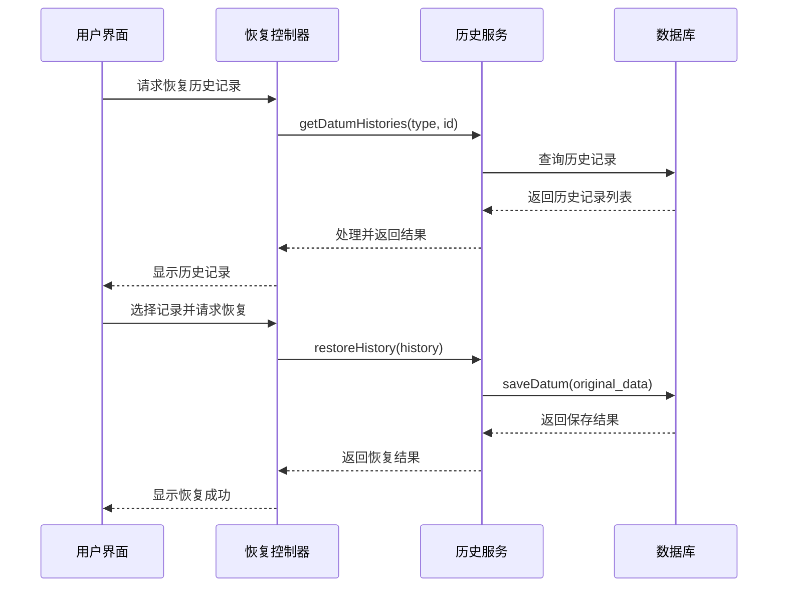
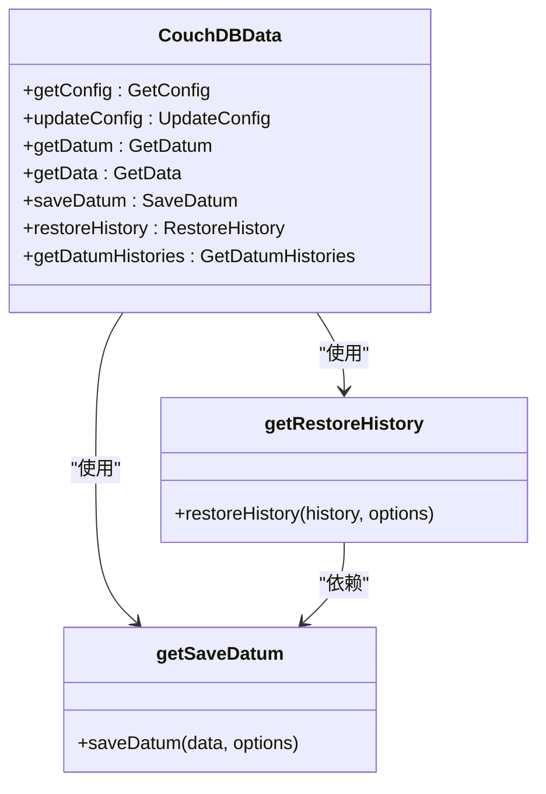

# 历史数据恢复功能

<cite>
**本文档引用的文件**
- [getRestoreHistory.ts](file://Data/lib/functions/getRestoreHistory.ts)
- [getRestoreHistory.ts](file://packages/data-storage-couchdb/lib/functions/getRestoreHistory.ts)
- [types.ts](file://Data/lib/types.ts)
- [CouchDBData.ts](file://packages/data-storage-couchdb/lib/CouchDBData.ts)
- [HistoryBatchModalScreen.tsx](file://App/app/screens/data-history/HistoryBatchModalScreen.tsx)
- [getSaveDatum.ts](file://packages/data-storage-couchdb/lib/functions/getSaveDatum.ts)
- [getGetDatumHistories.ts](file://packages/data-storage-couchdb/lib/functions/getGetDatumHistories.ts)
- [getGetHistoriesInBatch.ts](file://packages/data-storage-couchdb/lib/functions/getGetHistoriesInBatch.ts)
- [getListHistoryBatchesCreatedBy.ts](file://packages/data-storage-couchdb/lib/functions/getListHistoryBatchesCreatedBy.ts)
- [types.ts](file://packages/data-storage-couchdb/lib/types.ts)
</cite>

## 目录
1. [简介](#简介)
2. [核心实现机制](#核心实现机制)
3. [数据溯源与版本控制](#数据溯源与版本控制)
4. [恢复流程与冲突解决](#恢复流程与冲突解决)
5. [实际应用场景](#实际应用场景)
6. [多设备协同与数据同步](#多设备协同与数据同步)
7. [系统架构与集成](#系统架构与集成)
8. [错误处理与数据一致性](#错误处理与数据一致性)

## 简介
本系统提供了一套完整的数据历史记录与恢复机制，允许用户通过历史记录恢复到任意时间点的数据状态。该功能支持细粒度的版本回滚、批量操作恢复以及数据审计追踪，为库存管理系统提供了强大的数据安全保障。

**本节不分析具体源文件**

## 核心实现机制

`getRestoreHistory`函数是数据恢复功能的核心实现，采用分层架构设计，由两个主要部分组成：基础恢复逻辑和数据库适配层。

基础恢复逻辑位于`Data/lib/functions/getRestoreHistory.ts`，定义了通用的恢复策略。该函数接收一个`saveDatum`函数作为参数，返回一个可调用的`restoreHistory`函数。当执行恢复操作时，系统会从历史记录中提取`original_data`，并使用`saveDatum`函数将其写回数据库。

数据库适配层位于`packages/data-storage-couchdb/lib/functions/getRestoreHistory.ts`，负责将通用恢复逻辑与具体的数据库实现（CouchDB/PouchDB）进行集成。该层通过上下文对象获取数据库连接和日志记录器，并创建适配后的`saveDatum`函数供基础层使用。

恢复过程的关键参数包括：
- `createdBy`: 记录恢复操作的来源（自动标记为"history_restore"）
- `batch`: 支持批量恢复操作的分组标识
- `ignoreConflict`: 强制忽略数据冲突，确保恢复操作能够完成

**本节不分析具体源文件**

## 数据溯源与版本控制

系统实现了完整的数据溯源机制，通过历史记录文档（type: '_history'）追踪所有数据变更。每个历史记录包含以下关键信息：

- **数据溯源信息**：`created_by`字段记录了操作来源，`timestamp`记录了精确的时间戳
- **版本标识**：`batch`字段支持将多个相关变更组织为一个逻辑批次
- **状态对比**：同时保存`original_data`和`new_data`，便于进行变更分析

系统提供了三个主要的查询接口来支持数据溯源：

1. **按数据实体查询历史**：`getGetDatumHistories`函数允许按数据类型和ID查询特定实体的所有历史记录
2. **按批次查询历史**：`getGetHistoriesInBatch`函数支持查询特定批次中的所有变更
3. **按创建者查询批次**：`getListHistoryBatchesCreatedBy`函数提供按操作者分组的批次列表

这些查询接口均使用数据库索引优化性能，确保在大量历史数据情况下仍能快速响应。

**图源**
- [types.ts](file://packages/data-storage-couchdb/lib/types.ts#L3-L12)
- [getGetDatumHistories.ts](file://packages/data-storage-couchdb/lib/functions/getGetDatumHistories.ts#L7-L16)
- [getGetHistoriesInBatch.ts](file://packages/data-storage-couchdb/lib/functions/getGetHistoriesInBatch.ts#L7-L11)
- [getListHistoryBatchesCreatedBy.ts](file://packages/data-storage-couchdb/lib/functions/getListHistoryBatchesCreatedBy.ts#L5-L16)

## 恢复流程与冲突解决

数据恢复流程设计为原子性操作，确保每次恢复都能达到一致的状态。流程如下：

1. 从历史记录中提取目标状态数据
2. 调用`saveDatum`函数写入数据，设置`ignoreConflict: true`以覆盖当前状态
3. 创建新的历史记录，标记操作来源为"history_restore"
4. 返回恢复后的数据对象

冲突解决机制是恢复功能的关键特性。系统采用"最后写入获胜"策略，通过设置`ignoreConflict: true`参数强制覆盖现有数据。这种设计确保了恢复操作的确定性，即使在并发环境下也能正确执行。

恢复操作还支持批处理模式，允许将多个历史记录的恢复操作组织为一个逻辑批次。这在执行大规模数据回滚时特别有用，可以保持操作的原子性和可追踪性。

**图源**
- [getRestoreHistory.ts](file://Data/lib/functions/getRestoreHistory.ts#L8-L26)
- [getSaveDatum.ts](file://packages/data-storage-couchdb/lib/functions/getSaveDatum.ts#L73-L97)
- [getRestoreHistory.ts](file://packages/data-storage-couchdb/lib/functions/getRestoreHistory.ts#L7-L14)

## 实际应用场景

### 误操作恢复
当用户意外修改或删除数据时，可以通过历史记录界面浏览变更历史，并选择恢复到之前的某个状态。系统提供两种恢复模式：

- **单条记录恢复**：针对特定数据实体的精确恢复
- **批量恢复**：恢复整个操作批次的所有变更

### 数据审计追踪
系统记录了所有数据变更的完整历史，包括：
- 变更时间
- 操作来源
- 变更前后的数据状态
- 关联的批次信息

这些信息可用于合规性审计、问题排查和操作分析。

### 状态回滚
在系统升级或配置变更后发现问题时，可以使用历史恢复功能将数据状态回滚到变更前的稳定版本。

**图源**
- [HistoryBatchModalScreen.tsx](file://App/app/screens/data-history/HistoryBatchModalScreen.tsx#L184-L192)
- [getRestoreHistory.ts](file://Data/lib/functions/getRestoreHistory.ts#L8-L26)
- [getGetDatumHistories.ts](file://packages/data-storage-couchdb/lib/functions/getGetDatumHistories.ts#L25-L104)

## 多设备协同与数据同步

历史恢复功能与系统的数据同步模块深度集成，确保在多设备环境下的一致性。关键设计包括：

1. **同步冲突处理**：当设备离线时进行的恢复操作会在重新连接时同步到其他设备，通过`createdBy`字段标识操作来源
2. **时间戳协调**：使用UTC时间戳确保跨设备的时间一致性
3. **批次同步**：批量恢复操作作为一个整体进行同步，保持操作的原子性

在数据同步过程中，恢复操作被视为普通的数据变更，遵循相同的同步协议。这确保了恢复状态能够在所有设备间正确传播。

**本节不分析具体源文件**

## 系统架构与集成

`getRestoreHistory`功能通过`CouchDBData`类集成到整体系统架构中。该类作为数据访问层的统一入口，封装了所有数据操作，包括恢复功能。

系统架构采用分层设计：
- **应用层**：提供用户界面和业务逻辑
- **服务层**：`CouchDBData`类提供统一的数据访问接口
- **适配层**：数据库特定的函数实现
- **存储层**：CouchDB/PouchDB数据库

这种设计实现了关注点分离，使得恢复功能可以独立演进而不影响其他系统组件。

**图源**
- [CouchDBData.ts](file://packages/data-storage-couchdb/lib/CouchDBData.ts#L42-L97)
- [getRestoreHistory.ts](file://packages/data-storage-couchdb/lib/functions/getRestoreHistory.ts#L7-L14)
- [getSaveDatum.ts](file://packages/data-storage-couchdb/lib/functions/getSaveDatum.ts#L17-L139)

## 错误处理与数据一致性

系统实现了多层次的错误处理和数据一致性保障机制：

1. **输入验证**：使用Zod库对历史记录进行类型验证，确保数据完整性
2. **事务性操作**：每个恢复操作都是原子性的，要么完全成功，要么完全失败
3. **错误传播**：底层数据库错误会向上传播，由调用者决定如何处理
4. **日志记录**：所有恢复操作都会被记录，便于问题排查

数据一致性通过以下机制保障：
- **版本控制**：使用数据库的版本号（_rev）确保更新的原子性
- **索引优化**：为历史查询创建专用索引，确保查询性能
- **批量处理**：支持大容量历史数据的分页查询和处理

这些机制共同确保了历史恢复功能的可靠性和稳定性。

**本节不分析具体源文件**