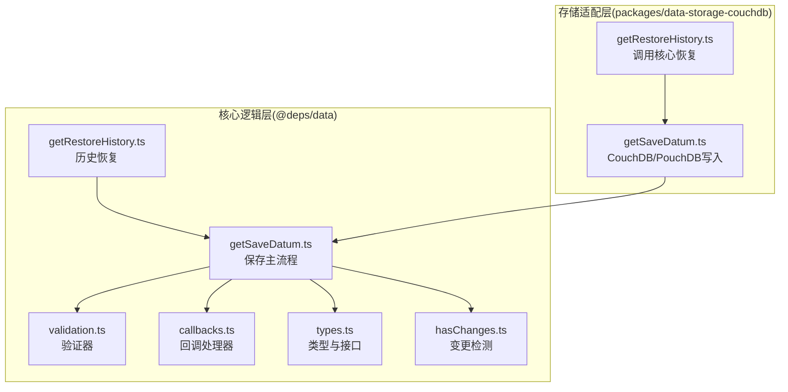
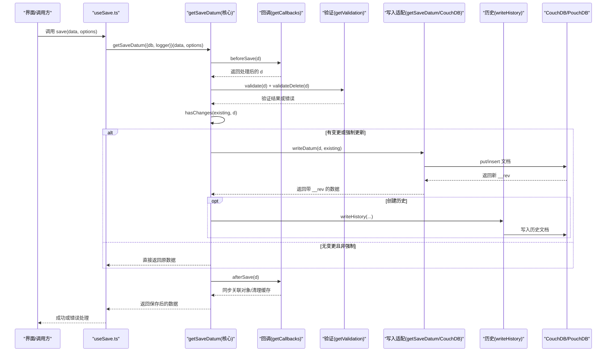
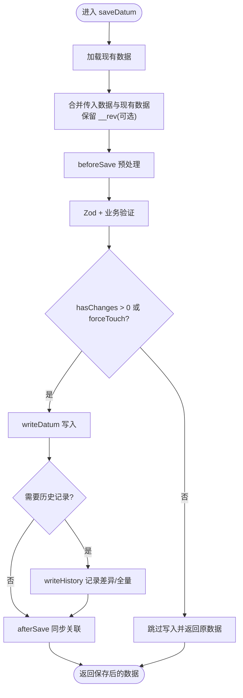
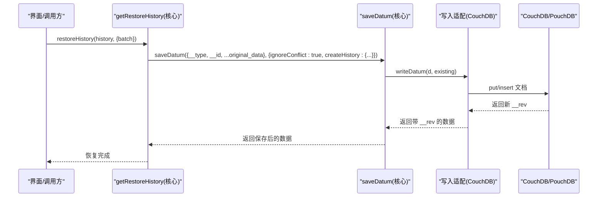
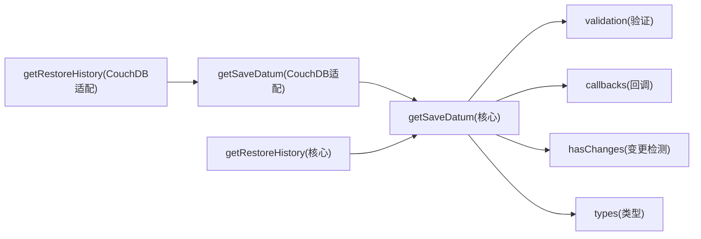

# 数据保存API

<cite>
**本文引用的文件**
- [getSaveDatum.ts（核心实现）](file://Data/lib/functions/getSaveDatum.ts)
- [getRestoreHistory.ts（核心实现）](file://Data/lib/functions/getRestoreHistory.ts)
- [validation.ts（验证器）](file://Data/lib/validation.ts)
- [callbacks.ts（回调处理器）](file://Data/lib/callbacks.ts)
- [types.ts（类型定义）](file://Data/lib/types.ts)
- [hasChanges.ts（变更检测）](file://Data/lib/utils/hasChanges.ts)
- [getSaveDatum.ts（CouchDB适配层）](file://packages/data-storage-couchdb/lib/functions/getSaveDatum.ts)
- [getRestoreHistory.ts（CouchDB适配层）](file://packages/data-storage-couchdb/lib/functions/getRestoreHistory.ts)
- [useSave.ts（React Hook封装）](file://App/app/data/hooks/useSave.ts)
- [fixDataConsistency.ts（一致性修复工具）](file://Data/lib/utils/fixDataConsistency.ts)
</cite>

## 目录
1. [简介](#简介)
2. [项目结构](#项目结构)
3. [核心组件](#核心组件)
4. [架构总览](#架构总览)
5. [详细组件分析](#详细组件分析)
6. [依赖关系分析](#依赖关系分析)
7. [性能考量](#性能考量)
8. [故障排查指南](#故障排查指南)
9. [结论](#结论)
10. [附录：使用示例与最佳实践](#附录使用示例与最佳实践)

## 简介
本文件系统性地文档化“数据保存API”，重点围绕以下目标展开：
- 接口定义与使用模式：详解 getSaveDatum 的参数、选项与行为边界
- 数据验证、冲突检测与版本控制：说明验证链路、变更检测与冲突处理策略
- 历史恢复：getRestoreHistory 如何基于历史记录回写数据
- 实际用法：创建、更新、删除数据项的示例路径
- 事务与批量：说明单条保存的原子性、批量修复的一致性策略与回滚思路
- 完整性保障与异常处理：数据一致性、历史记录、错误聚合与日志记录

## 项目结构
该能力由“核心逻辑层”和“存储适配层”两部分组成：
- 核心逻辑层（@deps/data）：定义统一的数据保存流程、验证、回调、历史记录与类型约束
- 存储适配层（packages/data-storage-couchdb）：针对 CouchDB/PouchDB 的具体实现（写入、删除、历史写入、附件校验等）

图表来源
- [getSaveDatum.ts（核心实现）](file://Data/lib/functions/getSaveDatum.ts#L1-L334)
- [validation.ts（验证器）](file://Data/lib/validation.ts#L1-L494)
- [callbacks.ts（回调处理器）](file://Data/lib/callbacks.ts#L1-L364)
- [types.ts（类型定义）](file://Data/lib/types.ts#L1-L212)
- [getRestoreHistory.ts（核心实现）](file://Data/lib/functions/getRestoreHistory.ts#L1-L30)
- [hasChanges.ts（变更检测）](file://Data/lib/utils/hasChanges.ts#L1-L53)
- [getSaveDatum.ts（CouchDB适配层）](file://packages/data-storage-couchdb/lib/functions/getSaveDatum.ts#L1-L140)
- [getRestoreHistory.ts（CouchDB适配层）](file://packages/data-storage-couchdb/lib/functions/getRestoreHistory.ts#L1-L16)

章节来源
- [getSaveDatum.ts（核心实现）](file://Data/lib/functions/getSaveDatum.ts#L1-L334)
- [getSaveDatum.ts（CouchDB适配层）](file://packages/data-storage-couchdb/lib/functions/getSaveDatum.ts#L1-L140)

## 核心组件
- getSaveDatum：统一的数据保存入口，负责回调、验证、变更检测、历史记录与写入
- getRestoreHistory：根据历史记录回写数据，支持批号与创建者过滤
- 验证器 getValidation：基于 Zod Schema 与业务规则的双重校验
- 回调处理器 getCallbacks：在保存前后注入业务逻辑（如生成 EPC、计算过期提醒、同步关联对象）
- 变更检测 hasChanges：区分元数据与用户数据变更级别，决定是否写入与是否记录历史
- 类型系统 types：统一的数据模型、历史记录结构与接口契约

章节来源
- [types.ts（类型定义）](file://Data/lib/types.ts#L1-L212)
- [validation.ts（验证器）](file://Data/lib/validation.ts#L1-L494)
- [callbacks.ts（回调处理器）](file://Data/lib/callbacks.ts#L1-L364)
- [hasChanges.ts（变更检测）](file://Data/lib/utils/hasChanges.ts#L1-L53)

## 架构总览
下图展示了从应用到数据库的完整调用链，以及历史恢复的回放路径。

图表来源
- [useSave.ts（React Hook封装）](file://App/app/data/hooks/useSave.ts#L1-L115)
- [getSaveDatum.ts（核心实现）](file://Data/lib/functions/getSaveDatum.ts#L1-L334)
- [callbacks.ts（回调处理器）](file://Data/lib/callbacks.ts#L1-L364)
- [validation.ts（验证器）](file://Data/lib/validation.ts#L1-L494)
- [getSaveDatum.ts（CouchDB适配层）](file://packages/data-storage-couchdb/lib/functions/getSaveDatum.ts#L1-L140)

## 详细组件分析

### 组件A：getSaveDatum（数据保存主流程）
- 输入与选项
  - data：可为对象或三元组（类型、ID、更新函数），后者会自动忽略冲突检查
  - options：
    - noTouch：不更新时间戳
    - forceTouch：即使无变更也强制更新时间戳
    - ignoreConflict：忽略冲突，保留现有 __rev
    - skipValidation/skipCallbacks：跳过验证或回调
    - createHistory：开启历史记录，包含创建者、批次、事件名
- 处理逻辑
  - 回调 beforeSave：预处理字段（如填充 config_uuid、生成 EPC/RFID 密钥、计算过期提醒等）
  - 验证：
    - Zod Schema 校验
    - 业务规则校验（共享权限、唯一性、容器关系、EPC/RFID 合法性等）
    - 附件校验（由适配层注入）
  - 变更检测 hasChanges：区分元数据变更（级别1）与用户数据变更（级别11）
  - 历史记录 writeHistory：仅记录差异（新增/删除/变更），删除时记录全量
  - 写入 writeDatum：根据 dbType 使用 put/insert，返回新 __rev
  - 回调 afterSave：同步关联对象（如图片、集成标记）、刷新派生字段
- 删除流程
  - 必须提供 __id；先执行 validateDelete，再写入历史，最后删除文档
- 错误处理
  - 验证错误包装为 ValidationError 并抛出
  - 批量重试：当使用更新函数时，内部循环最多25次，聚合前24个错误消息

图表来源
- [getSaveDatum.ts（核心实现）](file://Data/lib/functions/getSaveDatum.ts#L1-L334)
- [callbacks.ts（回调处理器）](file://Data/lib/callbacks.ts#L1-L364)
- [validation.ts（验证器）](file://Data/lib/validation.ts#L1-L494)
- [hasChanges.ts（变更检测）](file://Data/lib/utils/hasChanges.ts#L1-L53)

章节来源
- [getSaveDatum.ts（核心实现）](file://Data/lib/functions/getSaveDatum.ts#L1-L334)
- [callbacks.ts（回调处理器）](file://Data/lib/callbacks.ts#L1-L364)
- [validation.ts（验证器）](file://Data/lib/validation.ts#L1-L494)
- [hasChanges.ts（变更检测）](file://Data/lib/utils/hasChanges.ts#L1-L53)

### 组件B：getRestoreHistory（历史恢复）
- 功能概述
  - 依据历史记录中的 original_data 回写数据
  - 自动设置 ignoreConflict 与 createHistory，便于审计
- 关键点
  - 通过核心 getRestoreHistory 包装，复用 saveDatum 的验证与回调
  - 支持按批次与创建者筛选历史记录（查询由适配层提供）

图表来源
- [getRestoreHistory.ts（核心实现）](file://Data/lib/functions/getRestoreHistory.ts#L1-L30)
- [getSaveDatum.ts（CouchDB适配层）](file://packages/data-storage-couchdb/lib/functions/getSaveDatum.ts#L1-L140)

章节来源
- [getRestoreHistory.ts（核心实现）](file://Data/lib/functions/getRestoreHistory.ts#L1-L30)
- [getRestoreHistory.ts（CouchDB适配层）](file://packages/data-storage-couchdb/lib/functions/getRestoreHistory.ts#L1-L16)

### 组件C：验证与冲突检测
- 验证链路
  - Zod Schema：字段类型、必填、长度等基础校验
  - 业务规则：共享数据库权限、唯一性（集合参考号、IAR、EPC hex）、关系合法性（容器/子项）、编码有效性（EPC/RFID）
- 冲突检测与版本控制
  - hasChanges：区分元数据与用户数据变更级别
  - ignoreConflict：保留现有 __rev，避免覆盖他人修改
  - __rev：写入后返回，用于后续并发场景
- 附件校验（适配层）
  - 依据 attachment_definitions 对 raw 文档进行校验，缺失或非法则返回错误

章节来源
- [validation.ts（验证器）](file://Data/lib/validation.ts#L1-L494)
- [getSaveDatum.ts（CouchDB适配层）](file://packages/data-storage-couchdb/lib/functions/getSaveDatum.ts#L1-L140)
- [hasChanges.ts（变更检测）](file://Data/lib/utils/hasChanges.ts#L1-L53)

### 组件D：回调与历史记录
- 回调
  - beforeSave：字段标准化、生成 EPC/RFID、计算过期提醒、容器属性、密码生成等
  - afterSave：同步关联对象（如 item_image、image）、清理集成标记、刷新派生字段
- 历史记录
  - 新增/更新：记录差异（original_data/new_data）
  - 删除：记录全量原始数据并标记 __deleted
  - 写入策略：统一以 _history 文档写入，包含 created_by/batch/event_name/data_type/data_id/timestamp

章节来源
- [callbacks.ts（回调处理器）](file://Data/lib/callbacks.ts#L1-L364)
- [getSaveDatum.ts（核心实现）](file://Data/lib/functions/getSaveDatum.ts#L1-L334)

## 依赖关系分析
- 组件耦合
  - getSaveDatum 依赖 validation、callbacks、hasChanges、types
  - 适配层 getSaveDatum 依赖核心 getSaveDatum，并注入写入、删除、历史写入与附件校验
  - getRestoreHistory 依赖核心 getRestoreHistory，并通过适配层的 saveDatum 实现回写
- 外部依赖
  - CouchDB/PouchDB：put/insert/destroy、索引与查询
  - EPC 工具：生成 IAR/GIAI/EPCHex
- 循环依赖
  - 未发现直接循环依赖；回调中对 saveDatum 的递归调用仅限于 afterSave 的同步场景

图表来源
- [getSaveDatum.ts（核心实现）](file://Data/lib/functions/getSaveDatum.ts#L1-L334)
- [validation.ts（验证器）](file://Data/lib/validation.ts#L1-L494)
- [callbacks.ts（回调处理器）](file://Data/lib/callbacks.ts#L1-L364)
- [hasChanges.ts（变更检测）](file://Data/lib/utils/hasChanges.ts#L1-L53)
- [getSaveDatum.ts（CouchDB适配层）](file://packages/data-storage-couchdb/lib/functions/getSaveDatum.ts#L1-L140)
- [getRestoreHistory.ts（CouchDB适配层）](file://packages/data-storage-couchdb/lib/functions/getRestoreHistory.ts#L1-L16)

## 性能考量
- 变更检测与写入
  - hasChanges 在无变更时直接返回，避免不必要的写入与历史记录
  - forceTouch 可用于强制更新时间戳，但会触发写入
- 批量修复
  - fixDataConsistency 提供分页批量修复，边修复边产出进度，适合大规模一致性修复
- 历史记录
  - 仅记录差异，减少历史文档体积；删除时记录全量，便于恢复

章节来源
- [getSaveDatum.ts（核心实现）](file://Data/lib/functions/getSaveDatum.ts#L1-L334)
- [fixDataConsistency.ts（一致性修复工具）](file://Data/lib/utils/fixDataConsistency.ts#L1-L74)

## 故障排查指南
- 常见错误类型
  - 验证错误：ValidationError，包含多条问题与消息数组
  - 共享数据库权限不足：无法写入/删除共享对象
  - 唯一性冲突：集合参考号、IAR、EPC hex 已存在
  - 关系不合法：容器不存在、容器不可容纳、子项仍存在等
- 日志与调试
  - 适配层可在 debug 级别输出跳过保存的日志
  - useSave 将错误记录到日志并可弹窗提示
- 回滚与重试
  - 更新函数模式下，内部最多重试25次，聚合前24次错误消息
  - 建议在上层捕获错误后，结合历史记录进行人工核对与重试

章节来源
- [validation.ts（验证器）](file://Data/lib/validation.ts#L1-L494)
- [getSaveDatum.ts（CouchDB适配层）](file://packages/data-storage-couchdb/lib/functions/getSaveDatum.ts#L1-L140)
- [useSave.ts（React Hook封装）](file://App/app/data/hooks/useSave.ts#L1-L115)

## 结论
- getSaveDatum 提供了统一、可扩展的数据保存入口，内置验证、回调、变更检测与历史记录，确保数据质量与可追溯性
- getRestoreHistory 通过历史记录实现安全回放，配合 ignoreConflict 与 createHistory，满足审计与恢复需求
- 适配层将核心逻辑与存储细节解耦，便于扩展其他存储后端
- 建议在生产环境启用 createHistory、严格验证与回调，配合批量修复工具定期维护一致性

## 附录：使用示例与最佳实践

### 接口定义与选项
- SaveDatum 参数与选项
  - data：对象或三元组（类型、ID、更新函数）
  - options：
    - noTouch、forceTouch、ignoreConflict、skipValidation、skipCallbacks、createHistory
- 历史记录 DataHistory 字段
  - created_by、batch、event_name、data_type、data_id、timestamp、original_data、new_data

章节来源
- [types.ts（类型定义）](file://Data/lib/types.ts#L1-L212)

### 创建、更新、删除数据项（示例路径）
- 创建
  - 传入对象，省略 __id，系统自动生成
  - 参考路径：[useSave.ts（创建示例）](file://App/app/data/hooks/useSave.ts#L1-L115)
- 更新
  - 传入对象，指定 __type 与 __id
  - 或使用三元组（类型、ID、更新函数），自动忽略冲突检查
  - 参考路径：[getSaveDatum.ts（核心实现）](file://Data/lib/functions/getSaveDatum.ts#L240-L288)
- 删除
  - 设置 __deleted: true，并提供 __id
  - 参考路径：[getSaveDatum.ts（核心实现）](file://Data/lib/functions/getSaveDatum.ts#L190-L231)

### 历史恢复（getRestoreHistory）
- 从历史记录回写数据，自动设置 ignoreConflict 与 createHistory
- 参考路径：[getRestoreHistory.ts（核心实现）](file://Data/lib/functions/getRestoreHistory.ts#L1-L30)

### 事务与批量、错误回滚
- 单条保存的原子性
  - 写入与历史记录在同一流程内，失败时整体回滚（由存储层保证）
- 批量修复
  - 使用 fixDataConsistency 分页批量修复，边修复边产出进度
  - 参考路径：[fixDataConsistency.ts（一致性修复工具）](file://Data/lib/utils/fixDataConsistency.ts#L1-L74)
- 错误回滚
  - 更新函数模式下，最多重试25次，聚合前24次错误消息
  - 参考路径：[getSaveDatum.ts（核心实现）](file://Data/lib/functions/getSaveDatum.ts#L240-L288)

### 数据完整性保障与异常处理最佳实践
- 强制启用 createHistory，便于审计与恢复
- 在删除前执行 validateDelete，避免破坏关系完整性
- 使用 ignoreConflict 时需谨慎，必要时结合历史记录核对
- 对外部依赖（如 EPC 工具）的异常进行捕获与降级处理
- 使用 useSave 进行统一错误处理与日志记录

章节来源
- [validation.ts（验证器）](file://Data/lib/validation.ts#L1-L494)
- [useSave.ts（React Hook封装）](file://App/app/data/hooks/useSave.ts#L1-L115)