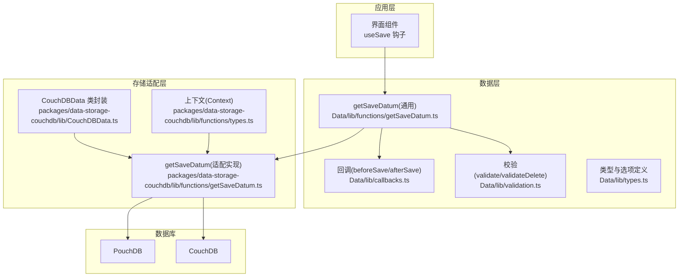
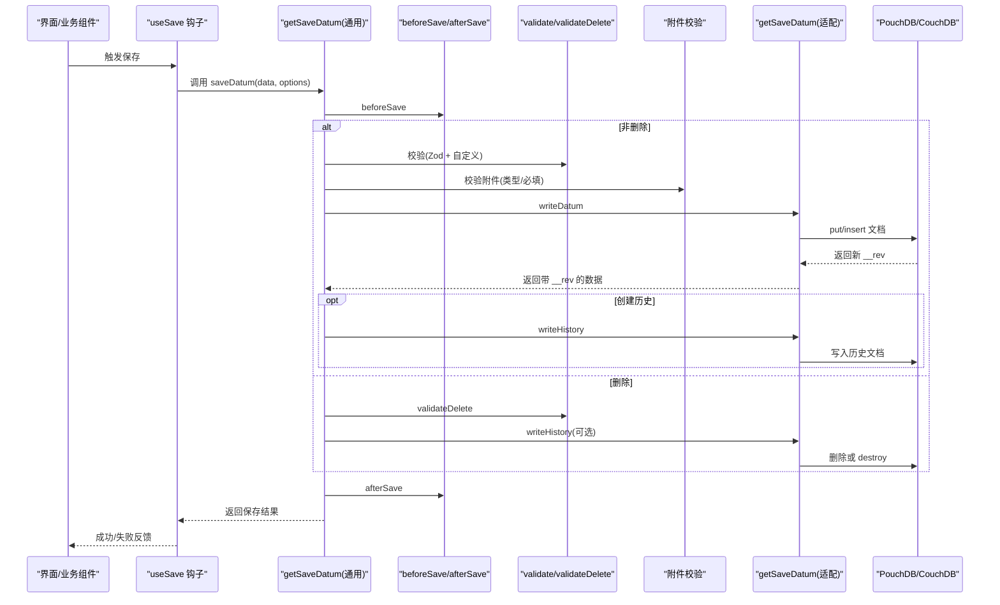
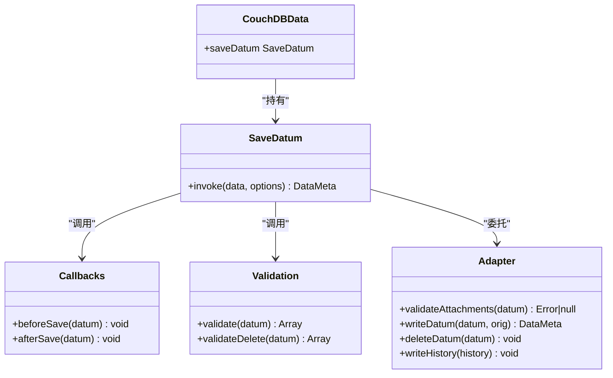
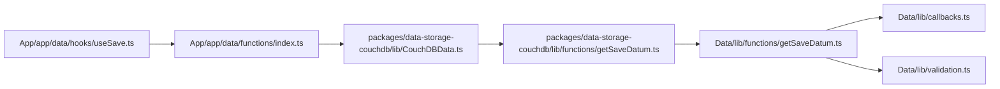
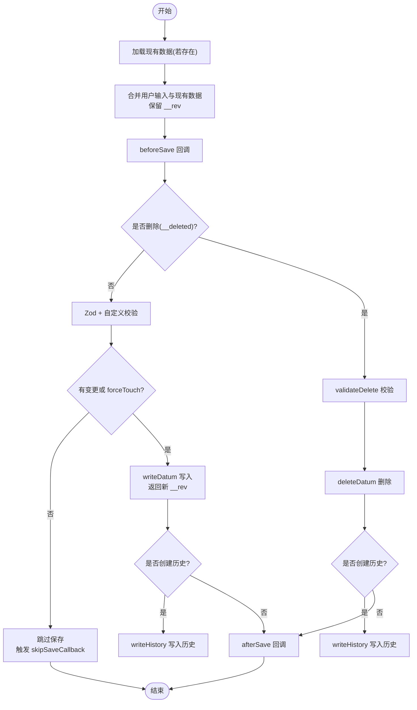

# 数据保存功能

<cite>
**本文引用的文件**
- [Data/lib/functions/getSaveDatum.ts](file://Data/lib/functions/getSaveDatum.ts)
- [packages/data-storage-couchdb/lib/functions/getSaveDatum.ts](file://packages/data-storage-couchdb/lib/functions/getSaveDatum.ts)
- [Data/lib/callbacks.ts](file://Data/lib/callbacks.ts)
- [Data/lib/validation.ts](file://Data/lib/validation.ts)
- [Data/lib/types.ts](file://Data/lib/types.ts)
- [App/app/data/hooks/useSave.ts](file://App/app/data/hooks/useSave.ts)
- [App/app/data/functions/index.ts](file://App/app/data/functions/index.ts)
- [packages/data-storage-couchdb/lib/CouchDBData.ts](file://packages/data-storage-couchdb/lib/CouchDBData.ts)
- [Data/lib/utils/fixDataConsistency.ts](file://Data/lib/utils/fixDataConsistency.ts)
- [App/app/features/db-sync/DBSyncManager.tsx](file://App/app/features/db-sync/DBSyncManager.tsx)
</cite>

## 目录
1. [简介](#简介)
2. [项目结构](#项目结构)
3. [核心组件](#核心组件)
4. [架构总览](#架构总览)
5. [详细组件分析](#详细组件分析)
6. [依赖关系分析](#依赖关系分析)
7. [性能考量](#性能考量)
8. [故障排查指南](#故障排查指南)
9. [结论](#结论)
10. [附录](#附录)

## 简介
本文件系统性阐述“数据保存功能”的设计与实现，重点围绕 getSaveDatum 接口的定义、使用模式与运行机制，覆盖数据验证、冲突检测与版本控制、事务与批量处理、历史记录与回滚策略、数据完整性保障与异常处理最佳实践，并解释其与 PouchDB/CouchDB 的交互方式及在离线场景下的数据一致性保障。

## 项目结构
- 核心保存逻辑位于 Data 包中的 getSaveDatum.ts，提供统一的保存流程：回调、校验、变更检测、写入、历史记录与删除。
- 平台适配层位于 packages/data-storage-couchdb，将通用逻辑桥接到具体数据库（CouchDB/PouchDB），包括附件校验、写入、删除、历史写入与日志。
- 应用层通过 App 层的 useSave 钩子与函数入口调用 getSaveDatum，完成 UI 侧的数据保存。
- 同步与一致性保障由 DBSyncManager 负责，结合 PouchDB 的双向同步与序列号管理，确保离线与在线状态下的数据一致。

图表来源
- [Data/lib/functions/getSaveDatum.ts](file://Data/lib/functions/getSaveDatum.ts#L23-L334)
- [Data/lib/callbacks.ts](file://Data/lib/callbacks.ts#L1-L364)
- [Data/lib/validation.ts](file://Data/lib/validation.ts#L1-L494)
- [Data/lib/types.ts](file://Data/lib/types.ts#L120-L164)
- [packages/data-storage-couchdb/lib/functions/getSaveDatum.ts](file://packages/data-storage-couchdb/lib/functions/getSaveDatum.ts#L1-L140)
- [packages/data-storage-couchdb/lib/CouchDBData.ts](file://packages/data-storage-couchdb/lib/CouchDBData.ts#L42-L96)

章节来源
- [Data/lib/functions/getSaveDatum.ts](file://Data/lib/functions/getSaveDatum.ts#L23-L334)
- [packages/data-storage-couchdb/lib/functions/getSaveDatum.ts](file://packages/data-storage-couchdb/lib/functions/getSaveDatum.ts#L1-L140)
- [packages/data-storage-couchdb/lib/CouchDBData.ts](file://packages/data-storage-couchdb/lib/CouchDBData.ts#L42-L96)

## 核心组件
- 通用保存器 getSaveDatum：负责回调、校验、变更检测、写入、历史记录与删除；支持两种调用形式：对象式保存与“更新器函数”式保存；支持忽略冲突、强制触碰时间戳、跳过回调等选项。
- 回调系统 beforeSave/afterSave：在保存前后注入业务规则（如 EPC/RFID 字段生成、共享权限检查、关联数据联动）。
- 校验系统 validate/validateDelete：基于 Zod Schema 与自定义规则，覆盖唯一性、引用有效性、格式合法性等。
- 存储适配器 getSaveDatum：对接 PouchDB/CouchDB，执行写入、删除、历史记录写入与附件校验。
- 应用入口 useSave：封装 getSaveDatum 的调用，统一错误处理与用户提示。

章节来源
- [Data/lib/functions/getSaveDatum.ts](file://Data/lib/functions/getSaveDatum.ts#L23-L334)
- [Data/lib/callbacks.ts](file://Data/lib/callbacks.ts#L1-L364)
- [Data/lib/validation.ts](file://Data/lib/validation.ts#L1-L494)
- [packages/data-storage-couchdb/lib/functions/getSaveDatum.ts](file://packages/data-storage-couchdb/lib/functions/getSaveDatum.ts#L1-L140)
- [App/app/data/hooks/useSave.ts](file://App/app/data/hooks/useSave.ts#L1-L115)

## 架构总览
下图展示了从 UI 到数据库的端到端保存路径，以及关键扩展点（回调、校验、历史、附件校验）。

图表来源
- [Data/lib/functions/getSaveDatum.ts](file://Data/lib/functions/getSaveDatum.ts#L79-L237)
- [Data/lib/callbacks.ts](file://Data/lib/callbacks.ts#L1-L364)
- [Data/lib/validation.ts](file://Data/lib/validation.ts#L1-L494)
- [packages/data-storage-couchdb/lib/functions/getSaveDatum.ts](file://packages/data-storage-couchdb/lib/functions/getSaveDatum.ts#L33-L116)

## 详细组件分析

### getSaveDatum 接口定义与使用模式
- 接口签名与参数
  - 支持两种输入形式：
    - 对象式：包含 __type、__id、字段与可选 __deleted 等元数据。
    - 更新器函数式：传入 [类型, ID, updater]，内部自动拉取现有数据并合并更新，同时隐含 ignoreConflict=true。
  - 选项 options：
    - noTouch：不更新 __updated_at。
    - ignoreConflict：忽略冲突，直接覆盖（仅在对象式可用；更新器函数式会强制为 true）。
    - forceTouch：即使无变更也强制更新 __updated_at。
    - skipValidation/skipCallbacks：跳过校验或回调。
    - createHistory：开启历史记录，记录原始数据与新数据差异。
- 运行流程
  - 先加载现有数据（若存在）。
  - 合并用户输入与现有数据，保留 __rev 以支持冲突检测。
  - beforeSave 注入业务规则（如 EPC/RFID 生成、权限检查、显示规则等）。
  - 校验：Zod Schema + 自定义 validate/validateDelete + 附件校验。
  - 变更检测：若无变更且未 forceTouch，则跳过保存，触发 skipSaveCallback。
  - 写入：调用适配器 writeDatum，返回新 __rev。
  - 历史：按需写入历史文档（原始数据与新数据差异）。
  - 删除：校验后调用 deleteDatum，写入历史（可选）。
  - afterSave：触发后置回调（如联动更新图片/镜像数据、集成标记等）。
- 错误处理
  - 校验错误包装为 ValidationError，包含 messages 与 issues。
  - 更新器函数式保存在循环中捕获错误并最多重试若干次，最终聚合错误消息。
  - 删除时必须提供 __id，否则抛错。

章节来源
- [Data/lib/types.ts](file://Data/lib/types.ts#L120-L164)
- [Data/lib/functions/getSaveDatum.ts](file://Data/lib/functions/getSaveDatum.ts#L55-L314)
- [Data/lib/validation.ts](file://Data/lib/validation.ts#L18-L36)
- [Data/lib/callbacks.ts](file://Data/lib/callbacks.ts#L1-L364)

### 数据验证、冲突检测与版本控制
- 数据验证
  - Zod Schema：对字段进行基础类型与长度校验。
  - 自定义 validate：覆盖业务规则，如集合参考号唯一性、物品容器类型限制、IAR/EPCHex 唯一性与格式校验、共享数据库写入权限等。
  - 自定义 validateDelete：删除前检查是否允许删除（如集合/物品内仍有子项）。
- 冲突检测与版本控制
  - 读取现有数据并保留 __rev。
  - 保存时将 __rev 作为版本依据，避免覆盖他人修改。
  - ignoreConflict=true 时，显式保留现有 __rev，允许覆盖。
  - 适配器 writeDatum 在 PouchDB 使用 put，在 CouchDB 使用 insert，均返回新的 __rev。
- 历史记录
  - 当 createHistory 开启且发生实质性变更（changeLevel > 10）时，写入历史文档，记录 original_data/new_data 差异。
  - 删除时可写入包含完整元数据的历史记录。

章节来源
- [Data/lib/functions/getSaveDatum.ts](file://Data/lib/functions/getSaveDatum.ts#L98-L237)
- [Data/lib/validation.ts](file://Data/lib/validation.ts#L50-L465)
- [packages/data-storage-couchdb/lib/functions/getSaveDatum.ts](file://packages/data-storage-couchdb/lib/functions/getSaveDatum.ts#L73-L116)

### 事务处理、批量操作与错误回滚策略
- 事务与回滚
  - 通用保存器未提供跨多文档的 ACID 事务；单个 saveDatum 是原子性的（回调、校验、写入、历史写入视为一个单元）。
  - 若某一步骤失败（如校验失败、写入失败），则不会继续后续步骤，相当于“部分回滚”：已写入的历史不会撤销，但不会产生新的持久化变更。
- 批量操作
  - 提供 fixDataConsistency 工具，按批次遍历所有数据类型，逐条调用 saveDatum(noTouch: true)，用于修复一致性问题。
  - DBSyncManager 使用 PouchDB 的 live 同步与序列号跟踪，配合本地/远程 update_seq，实现离线与在线间的数据一致性。
- 错误回滚策略
  - 通用保存器不提供自动回滚；建议在上层业务中采用幂等设计与补偿任务。
  - 对于批量修复，通过迭代器逐步产出进度与错误列表，便于人工干预与重试。

章节来源
- [Data/lib/utils/fixDataConsistency.ts](file://Data/lib/utils/fixDataConsistency.ts#L1-L75)
- [App/app/features/db-sync/DBSyncManager.tsx](file://App/app/features/db-sync/DBSyncManager.tsx#L267-L440)

### 数据完整性保障与异常处理最佳实践
- 完整性保障
  - beforeSave/afterSave：在保存前后注入业务规则，确保数据满足业务约束（如 EPC/RFID 生成、权限检查、显示规则、关联数据联动）。
  - validate/validateDelete：严格校验引用有效性、唯一性与格式，防止脏数据进入数据库。
  - 历史记录：保留变更轨迹，便于审计与恢复。
- 异常处理最佳实践
  - 统一捕获 ValidationError 并向用户展示可读的 messages。
  - 对非 ValidationError 的错误，记录详细上下文（数据体、错误堆栈），必要时弹窗提示或静默记录。
  - 更新器函数式保存在循环中捕获错误并最多重试若干次，最终聚合错误消息，提升用户体验。

章节来源
- [Data/lib/callbacks.ts](file://Data/lib/callbacks.ts#L1-L364)
- [Data/lib/validation.ts](file://Data/lib/validation.ts#L18-L36)
- [App/app/data/hooks/useSave.ts](file://App/app/data/hooks/useSave.ts#L54-L115)

### 与 PouchDB/CouchDB 的交互与离线一致性
- 适配器实现
  - 附件校验：根据类型定义检查 __raw._attachments 的 content_type 与必填项。
  - 写入：PouchDB 使用 put，CouchDB 使用 insert，均返回新 __rev。
  - 删除：PouchDB 使用 put(_deleted: true)，CouchDB 使用 destroy。
  - 历史写入：生成唯一历史文档 ID，写入 type='_history'。
- 离线一致性
  - 本地使用 PouchDB 作为本地存储，通过 sync 与远端 CouchDB 双向同步。
  - 同步过程中维护 pushLastSeq/pullLastSeq 与 update_seq，确保增量同步与冲突最小化。
  - DBSyncManager 提供同步事件监听与进度回调，便于 UI 展示与用户感知。

章节来源
- [packages/data-storage-couchdb/lib/functions/getSaveDatum.ts](file://packages/data-storage-couchdb/lib/functions/getSaveDatum.ts#L33-L116)
- [App/app/features/db-sync/DBSyncManager.tsx](file://App/app/features/db-sync/DBSyncManager.tsx#L267-L440)

### 代码级类图（保存流程）

图表来源
- [Data/lib/functions/getSaveDatum.ts](file://Data/lib/functions/getSaveDatum.ts#L23-L334)
- [Data/lib/callbacks.ts](file://Data/lib/callbacks.ts#L1-L364)
- [Data/lib/validation.ts](file://Data/lib/validation.ts#L1-L494)
- [packages/data-storage-couchdb/lib/functions/getSaveDatum.ts](file://packages/data-storage-couchdb/lib/functions/getSaveDatum.ts#L1-L140)
- [packages/data-storage-couchdb/lib/CouchDBData.ts](file://packages/data-storage-couchdb/lib/CouchDBData.ts#L42-L96)

## 依赖关系分析
- 通用保存器依赖
  - 回调：beforeSave/afterSave
  - 校验：validate/validateDelete
  - 适配器：validateAttachments/writeDatum/deleteDatum/writeHistory
- 适配器依赖
  - 上下文：db、dbType、logger、logLevels
  - 工具：文档与数据转换、附件信息获取
- 应用层依赖
  - useSave 钩子封装 getSaveDatum，统一错误处理与用户提示
  - 函数入口导出 getSaveDatum，供各业务模块使用

图表来源
- [App/app/data/hooks/useSave.ts](file://App/app/data/hooks/useSave.ts#L1-L115)
- [App/app/data/functions/index.ts](file://App/app/data/functions/index.ts#L1-L103)
- [packages/data-storage-couchdb/lib/CouchDBData.ts](file://packages/data-storage-couchdb/lib/CouchDBData.ts#L42-L96)
- [packages/data-storage-couchdb/lib/functions/getSaveDatum.ts](file://packages/data-storage-couchdb/lib/functions/getSaveDatum.ts#L1-L140)
- [Data/lib/functions/getSaveDatum.ts](file://Data/lib/functions/getSaveDatum.ts#L23-L334)
- [Data/lib/callbacks.ts](file://Data/lib/callbacks.ts#L1-L364)
- [Data/lib/validation.ts](file://Data/lib/validation.ts#L1-L494)

章节来源
- [App/app/data/hooks/useSave.ts](file://App/app/data/hooks/useSave.ts#L1-L115)
- [App/app/data/functions/index.ts](file://App/app/data/functions/index.ts#L1-L103)
- [packages/data-storage-couchdb/lib/CouchDBData.ts](file://packages/data-storage-couchdb/lib/CouchDBData.ts#L42-L96)
- [packages/data-storage-couchdb/lib/functions/getSaveDatum.ts](file://packages/data-storage-couchdb/lib/functions/getSaveDatum.ts#L1-L140)
- [Data/lib/functions/getSaveDatum.ts](file://Data/lib/functions/getSaveDatum.ts#L23-L334)
- [Data/lib/callbacks.ts](file://Data/lib/callbacks.ts#L1-L364)
- [Data/lib/validation.ts](file://Data/lib/validation.ts#L1-L494)

## 性能考量
- 变更检测：通过 hasChanges 快速判断是否需要保存，避免不必要的写入与历史记录。
- 历史记录：仅在实质性变更时写入，减少冗余文档。
- 批量修复：fixDataConsistency 以固定批次大小遍历，避免一次性加载过多数据。
- 同步策略：DBSyncManager 使用 live 同步与序列号，减少全量同步开销。

[本节为通用指导，无需列出章节来源]

## 故障排查指南
- 常见错误类型
  - ValidationError：校验失败，查看 messages 获取用户可读提示。
  - “数据不存在/未找到”：更新器函数式保存时，若目标不存在会抛错。
  - 删除失败：删除前 validateDelete 会检查是否允许删除（如集合/物品仍包含子项）。
- 排查步骤
  - 检查 options 中的 ignoreConflict/forceTouch 是否符合预期。
  - 确认 __id 与 __type 是否正确，删除时必须提供 __id。
  - 查看历史记录（original_data/new_data）定位变更范围。
  - 使用 fixDataConsistency 进行批量修复，观察进度与错误列表。
- 日志与监控
  - 适配器在 debug 级别下输出跳过保存的日志。
  - DBSyncManager 记录同步过程中的 last_seq 与统计信息，便于定位卡顿或断点。

章节来源
- [Data/lib/functions/getSaveDatum.ts](file://Data/lib/functions/getSaveDatum.ts#L190-L237)
- [Data/lib/validation.ts](file://Data/lib/validation.ts#L385-L465)
- [packages/data-storage-couchdb/lib/functions/getSaveDatum.ts](file://packages/data-storage-couchdb/lib/functions/getSaveDatum.ts#L125-L136)
- [Data/lib/utils/fixDataConsistency.ts](file://Data/lib/utils/fixDataConsistency.ts#L1-L75)
- [App/app/features/db-sync/DBSyncManager.tsx](file://App/app/features/db-sync/DBSyncManager.tsx#L267-L440)

## 结论
getSaveDatum 将“保存”抽象为可插拔的流程：回调、校验、变更检测、写入、历史记录与删除。通过 __rev 实现版本控制与冲突检测，结合 PouchDB/CouchDB 的同步能力，可在离线与在线环境下保持数据一致性。对于复杂业务，建议在 beforeSave/afterSave 中注入必要的规则，并在上层采用幂等设计与补偿任务，以获得更高的可靠性与可维护性。

[本节为总结性内容，无需列出章节来源]

## 附录

### 代码示例（路径指引）
- 创建数据项
  - 路径：[Data/lib/functions/getSaveDatum.ts](file://Data/lib/functions/getSaveDatum.ts#L98-L137)
  - 说明：对象式保存，自动分配 __id；可设置 __raw 传递底层文档；支持 createHistory。
- 更新数据项
  - 路径：[Data/lib/functions/getSaveDatum.ts](file://Data/lib/functions/getSaveDatum.ts#L240-L287)
  - 说明：更新器函数式保存，自动保留 __rev；可设置 ignoreConflict=false 时抛错。
- 删除数据项
  - 路径：[Data/lib/functions/getSaveDatum.ts](file://Data/lib/functions/getSaveDatum.ts#L190-L237)
  - 说明：必须提供 __id；validateDelete 检查是否允许删除；可写入历史。
- 批量修复一致性
  - 路径：[Data/lib/utils/fixDataConsistency.ts](file://Data/lib/utils/fixDataConsistency.ts#L1-L75)
  - 说明：按批次调用 saveDatum(noTouch: true) 修复 __rev 不一致问题。
- 应用层调用
  - 路径：[App/app/data/hooks/useSave.ts](file://App/app/data/hooks/useSave.ts#L54-L115)
  - 说明：封装 getSaveDatum，统一错误处理与用户提示。

### 关键流程图（保存与删除）

图表来源
- [Data/lib/functions/getSaveDatum.ts](file://Data/lib/functions/getSaveDatum.ts#L79-L237)
- [packages/data-storage-couchdb/lib/functions/getSaveDatum.ts](file://packages/data-storage-couchdb/lib/functions/getSaveDatum.ts#L73-L116)