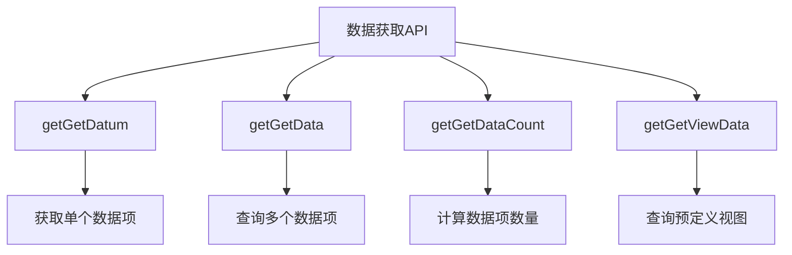
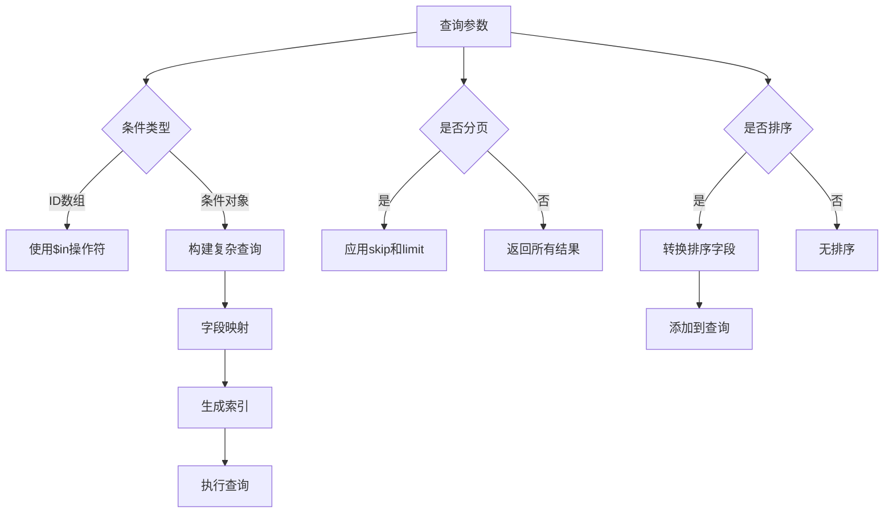
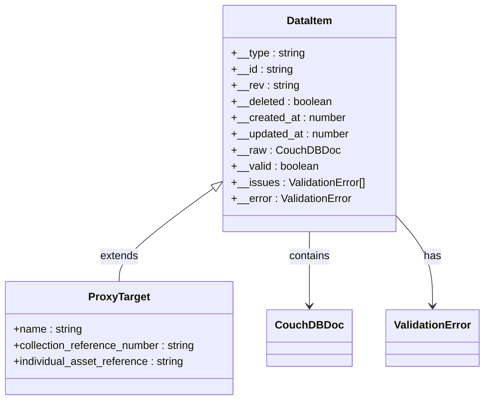
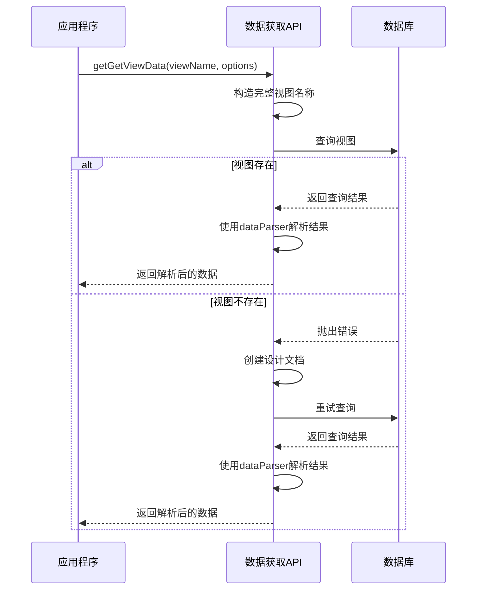
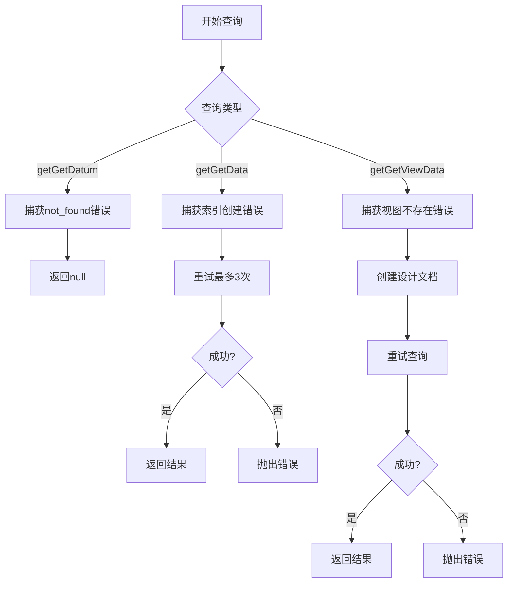
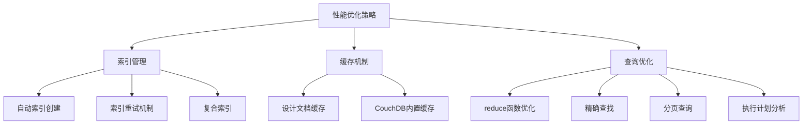
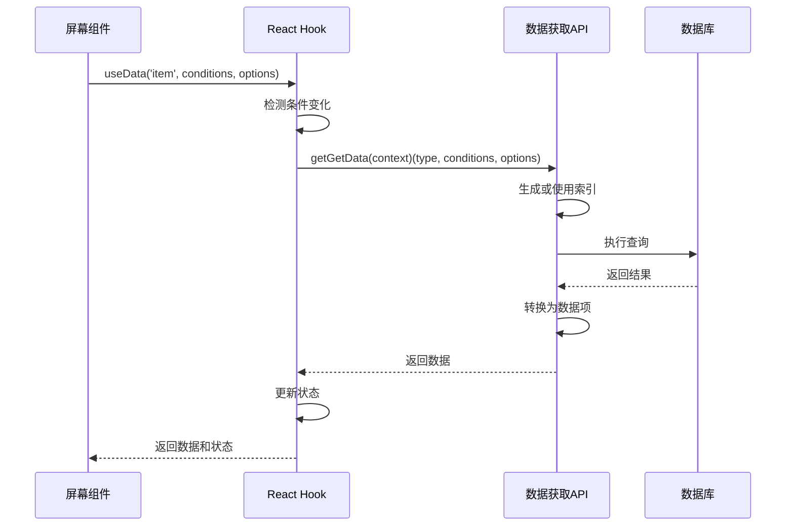

# 数据获取API

<cite>
**本文档引用的文件**   
- [getGetData.ts](file://packages/data-storage-couchdb/lib/functions/getGetData.ts)
- [getGetDataCount.ts](file://packages/data-storage-couchdb/lib/functions/getGetDataCount.ts)
- [getGetDatum.ts](file://packages/data-storage-couchdb/lib/functions/getGetDatum.ts)
- [getGetViewData.ts](file://packages/data-storage-couchdb/lib/functions/getGetViewData.ts)
- [couchdb-utils.ts](file://packages/data-storage-couchdb/lib/functions/couchdb-utils.ts)
- [views.ts](file://packages/data-storage-couchdb/lib/views.ts)
- [useData.ts](file://App/app/data/hooks/useData.ts)
- [useDataCount.ts](file://App/app/data/hooks/useDataCount.ts)
- [useView.ts](file://App/app/data/hooks/useView.ts)
- [ItemsScreen.tsx](file://App/app/features/inventory/screens/ItemsScreen.tsx)
- [CollectionsScreen.tsx](file://App/app/features/inventory/screens/CollectionsScreen.tsx)
</cite>

## 目录
1. [简介](#简介)
2. [核心数据获取函数](#核心数据获取函数)
3. [分页、过滤和排序](#分页过滤和排序)
4. [数据结构格式](#数据结构格式)
5. [视图查询实现](#视图查询实现)
6. [错误处理机制](#错误处理机制)
7. [性能优化策略](#性能优化策略)
8. [实际使用示例](#实际使用示例)
9. [结论](#结论)

## 简介

数据获取API是库存管理系统的核心组件，提供了一组强大的函数来查询和操作数据。该API基于CouchDB/PouchDB数据库系统，通过精心设计的函数接口，实现了高效的数据检索、分页、过滤、排序和计数功能。API的主要目标是为前端应用提供一致、可靠和高性能的数据访问能力，同时支持复杂的查询需求和视图操作。

数据获取API的设计遵循了模块化和可扩展的原则，将不同的数据操作功能分离到独立的函数中。这些函数通过统一的上下文对象（Context）接收数据库连接、日志记录器和其他配置参数，确保了代码的可维护性和可测试性。API还实现了自动索引创建和设计文档管理，以优化查询性能并确保数据一致性。

**Section sources**
- [getGetData.ts](file://packages/data-storage-couchdb/lib/functions/getGetData.ts#L1-L332)
- [getGetDataCount.ts](file://packages/data-storage-couchdb/lib/functions/getGetDataCount.ts#L1-L277)
- [getGetDatum.ts](file://packages/data-storage-couchdb/lib/functions/getGetDatum.ts#L1-L42)

## 核心数据获取函数

数据获取API提供了四个核心函数：`getGetData`、`getGetDataCount`、`getGetDatum`和`getGetViewData`。这些函数构成了数据查询的基础，每个函数都有特定的用途和功能。

`getGetDatum`函数用于根据类型和ID获取单个数据项。它通过`getCouchDbId`函数生成CouchDB文档ID，然后使用数据库的`get`方法检索文档。如果文档不存在或已被删除，函数会返回null而不是抛出异常，这使得调用者可以优雅地处理缺失数据的情况。该函数还集成了错误处理机制，能够识别不同数据库实现（如nano和pouchdb）返回的特定错误消息。

`getGetData`函数用于根据条件查询多个数据项。它支持复杂的查询条件，包括字段匹配、范围查询和逻辑操作符。函数会根据查询条件自动选择或创建适当的数据库索引，以确保查询性能。对于简单的类型查询，函数使用预定义的索引；对于复杂的条件查询，函数会动态生成索引名称并创建相应的设计文档。

`getGetDataCount`函数专门用于计算满足特定条件的数据项数量。与`getGetData`不同，它不返回实际数据，而是使用CouchDB的reduce函数（_count）来高效地计算结果数量。这对于分页显示和统计信息计算非常有用，因为它避免了传输大量数据的开销。

`getGetViewData`函数用于查询预定义的视图。视图是CouchDB中一种强大的数据索引和聚合机制，允许通过MapReduce函数对数据进行复杂的转换和聚合。该函数通过视图名称和查询选项来执行视图查询，并将结果通过预定义的数据解析器转换为应用程序友好的格式。

**Diagram sources **
- [getGetDatum.ts](file://packages/data-storage-couchdb/lib/functions/getGetDatum.ts#L6-L41)
- [getGetData.ts](file://packages/data-storage-couchdb/lib/functions/getGetData.ts#L20-L332)
- [getGetDataCount.ts](file://packages/data-storage-couchdb/lib/functions/getGetDataCount.ts#L12-L253)
- [getGetViewData.ts](file://packages/data-storage-couchdb/lib/functions/getGetViewData.ts#L24-L125)

**Section sources**
- [getGetDatum.ts](file://packages/data-storage-couchdb/lib/functions/getGetDatum.ts#L6-L41)
- [getGetData.ts](file://packages/data-storage-couchdb/lib/functions/getGetData.ts#L20-L332)
- [getGetDataCount.ts](file://packages/data-storage-couchdb/lib/functions/getGetDataCount.ts#L12-L253)
- [getGetViewData.ts](file://packages/data-storage-couchdb/lib/functions/getGetViewData.ts#L24-L125)

## 分页、过滤和排序

数据获取API提供了全面的分页、过滤和排序功能，以支持复杂的数据查询需求。这些功能通过`getGetData`函数的参数接口实现，允许调用者灵活地控制查询结果。

分页功能通过`skip`和`limit`参数实现。`skip`参数指定从结果集的哪个位置开始返回数据，而`limit`参数指定最多返回多少条记录。这种分页机制与CouchDB的查询API直接对应，确保了高效的数据库查询。在实际应用中，分页通常与数据计数功能结合使用，以提供完整的分页控件。

过滤功能通过`conditions`参数实现，支持多种查询模式。最简单的模式是通过ID数组进行查询，此时函数会使用`$in`操作符来匹配文档ID。更复杂的过滤条件可以作为对象传递，其中键表示字段名，值表示匹配条件。API支持CouchDB查询语言的所有操作符，包括`$eq`、`$ne`、`$lt`、`$gt`、`$lte`、`$gte`等。特殊字段如`__id`、`__created_at`和`__updated_at`会被自动映射到相应的数据库字段。

排序功能通过`sort`参数实现，接受一个排序选项数组。每个排序选项是一个对象，指定字段名和排序方向（'asc'或'desc'）。API会将应用程序级别的字段名（如`__created_at`）转换为数据库级别的字段名（如`created_at`），并将数据字段前缀添加为`data.`。由于PouchDB的限制，当使用排序时，所有用于索引的字段都必须包含在排序条件中。

**Diagram sources **
- [getGetData.ts](file://packages/data-storage-couchdb/lib/functions/getGetData.ts#L27-L332)
- [couchdb-utils.ts](file://packages/data-storage-couchdb/lib/functions/couchdb-utils.ts#L313-L330)

**Section sources**
- [getGetData.ts](file://packages/data-storage-couchdb/lib/functions/getGetData.ts#L27-L332)
- [couchdb-utils.ts](file://packages/data-storage-couchdb/lib/functions/couchdb-utils.ts#L313-L330)

## 数据结构格式

数据获取API返回的数据结构经过精心设计，以提供丰富的元数据和类型安全。所有数据项都遵循统一的结构，包含数据本身和附加的元信息。

每个数据项都是一个代理对象，通过`getDatumFromDoc`函数从数据库文档创建。代理对象的主要优势是它提供了惰性属性访问和类型安全。数据字段直接从文档的`data`属性暴露，而元数据字段（以`__`开头）则通过代理的getter方法提供。这种设计使得数据项在JavaScript控制台中具有良好的可读性，同时保持了类型系统的完整性。

元数据字段包括：
- `__type`：数据项的类型（如'item'、'collection'）
- `__id`：数据项的唯一标识符
- `__rev`：CouchDB文档的修订版本
- `__deleted`：标记文档是否已被删除
- `__created_at`：文档创建时间戳
- `__updated_at`：文档最后更新时间戳
- `__raw`：原始数据库文档
- `__valid`：指示数据是否有效
- `__issues`：验证错误详情
- `__error`：验证错误对象

数据验证是通过Zod库实现的。当创建数据项代理时，系统会使用预定义的模式验证文档数据。如果验证失败，`__valid`属性将为false，并且`__issues`和`__error`属性将包含详细的错误信息。这种验证机制确保了应用程序始终处理结构正确的数据，避免了潜在的运行时错误。

**Diagram sources **
- [couchdb-utils.ts](file://packages/data-storage-couchdb/lib/functions/couchdb-utils.ts#L66-L277)
- [getGetDatum.ts](file://packages/data-storage-couchdb/lib/functions/getGetDatum.ts#L20-L38)

**Section sources**
- [couchdb-utils.ts](file://packages/data-storage-couchdb/lib/functions/couchdb-utils.ts#L66-L277)

## 视图查询实现

视图查询是数据获取API中处理复杂数据聚合和预计算结果的核心机制。与动态查询不同，视图是预先定义和索引的，提供了更高的查询性能和更复杂的数据处理能力。

视图定义在`views.ts`文件中，通过`VIEWS`常量导出。每个视图包含一个Map函数、一个可选的Reduce函数和一个数据解析器。Map函数定义了如何从文档中提取键值对，Reduce函数用于聚合结果（如计数、求和等），而数据解析器则将原始查询结果转换为应用程序友好的格式。

`getGetViewData`函数是视图查询的主要入口。它接收视图名称和查询选项作为参数，构造完整的视图名称（包含前缀、名称和版本号），然后执行数据库查询。函数实现了自动视图创建机制：如果视图不存在，它会捕获相应的错误，创建设计文档，然后重试查询。这种机制确保了应用程序的健壮性，即使在数据库初始化不完整的情况下也能正常工作。

视图查询支持多种选项，包括`key`、`startKey`、`endKey`、`descending`和`includeDocs`。这些选项直接映射到CouchDB的视图查询参数，允许精确控制查询结果。例如，`startKey`和`endKey`可以用于范围查询，`descending`可以用于反向排序，而`includeDocs`可以用于在结果中包含完整的文档。

API预定义了多个视图，用于常见的业务场景：
- `out_of_stock_items_count`：计算缺货物品数量
- `low_stock_items_count`：计算低库存物品数量
- `expired_items`：查询过期物品
- `rfid_untagged_items`：查询未标记RFID的物品
- `purchase_price_sums`：按货币汇总采购价格

**Diagram sources **
- [views.ts](file://packages/data-storage-couchdb/lib/views.ts#L16-L573)
- [getGetViewData.ts](file://packages/data-storage-couchdb/lib/functions/getGetViewData.ts#L24-L125)

**Section sources**
- [views.ts](file://packages/data-storage-couchdb/lib/views.ts#L16-L573)
- [getGetViewData.ts](file://packages/data-storage-couchdb/lib/functions/getGetViewData.ts#L24-L125)

## 错误处理机制

数据获取API实现了全面的错误处理机制，确保在各种异常情况下都能提供可靠的服务。错误处理贯穿于所有核心函数，从低级别的数据库操作到高级别的应用逻辑。

在`getGetDatum`函数中，错误处理主要针对文档不存在或已被删除的情况。函数会捕获特定的错误消息（如'not_found'、'deleted'、'missing'），并返回null而不是抛出异常。这种设计模式使得调用者可以优雅地处理缺失数据，而不需要使用try-catch块。对于其他类型的错误，函数会重新抛出，以便上层代码可以进行适当的处理。

`getGetData`和`getGetDataCount`函数实现了更复杂的错误处理机制，主要针对索引创建失败的情况。由于CouchDB索引创建可能因并发访问而失败，这些函数实现了重试逻辑。当索引创建失败时，函数会捕获错误，记录警告日志，然后重试查询。最多重试3次，如果仍然失败，则抛出原始错误。这种机制确保了在高并发环境下的稳定性。

`getGetViewData`函数的错误处理更加复杂，需要处理视图不存在的情况。当查询视图时，如果设计文档不存在，函数会捕获相应的错误，创建设计文档，然后重试查询。这个过程最多重试3次，以确保视图能够成功创建。此外，函数还会处理视图定义更新的情况，通过版本号机制确保使用最新的视图定义。

所有错误处理都与日志系统集成。在调试模式下，函数会记录详细的调试信息，包括查询条件、索引定义和执行计划。对于警告和错误，函数会使用适当的日志级别记录相关信息，便于问题诊断和性能优化。

**Diagram sources **
- [getGetDatum.ts](file://packages/data-storage-couchdb/lib/functions/getGetDatum.ts#L22-L34)
- [getGetData.ts](file://packages/data-storage-couchdb/lib/functions/getGetData.ts#L258-L297)
- [getGetViewData.ts](file://packages/data-storage-couchdb/lib/functions/getGetViewData.ts#L57-L120)

**Section sources**
- [getGetDatum.ts](file://packages/data-storage-couchdb/lib/functions/getGetDatum.ts#L22-L34)
- [getGetData.ts](file://packages/data-storage-couchdb/lib/functions/getGetData.ts#L258-L297)
- [getGetViewData.ts](file://packages/data-storage-couchdb/lib/functions/getGetViewData.ts#L57-L120)

## 性能优化策略

数据获取API采用了多种性能优化策略，以确保在大规模数据集上的高效查询。这些策略主要集中在索引管理、缓存机制和查询优化三个方面。

索引管理是性能优化的核心。API实现了自动索引创建机制，根据查询条件动态生成索引名称和定义。对于简单的类型查询，使用预定义的索引；对于复杂的条件查询，根据条件字段和排序字段生成唯一的索引名称。这种策略确保了每个查询都能使用最优的索引，避免了全表扫描的性能问题。索引创建过程还实现了重试机制，以处理并发创建冲突。

缓存机制通过设计文档（design document）实现。API使用设计文档来存储视图定义和索引，这些设计文档在数据库中被持久化，避免了每次查询时重新定义视图的开销。对于频繁使用的视图，如库存统计和过期物品查询，预定义的设计文档确保了查询的即时响应。此外，CouchDB本身的缓存机制也被充分利用，热点数据和查询结果会被自动缓存。

查询优化体现在多个层面。首先，API区分了不同类型查询的优化策略：对于计数查询，使用CouchDB的reduce函数（_count）而不是返回所有数据；对于单个文档查询，直接使用文档ID进行精确查找；对于范围查询，使用复合索引确保高效检索。其次，查询参数被精心设计，避免了不必要的数据传输，如通过`skip`和`limit`实现分页，通过`include_docs`控制是否返回完整文档。

在应用层面，API提供了`debug`选项，允许开发者查看查询的执行计划（explain）。这有助于识别性能瓶颈和优化查询。此外，API还实现了查询条件的规范化和索引字段的去重，避免了创建冗余索引。

**Diagram sources **
- [getGetData.ts](file://packages/data-storage-couchdb/lib/functions/getGetData.ts#L225-L234)
- [getGetDataCount.ts](file://packages/data-storage-couchdb/lib/functions/getGetDataCount.ts#L46-L84)
- [getGetViewData.ts](file://packages/data-storage-couchdb/lib/functions/getGetViewData.ts#L68-L97)

**Section sources**
- [getGetData.ts](file://packages/data-storage-couchdb/lib/functions/getGetData.ts#L225-L234)
- [getGetDataCount.ts](file://packages/data-storage-couchdb/lib/functions/getGetDataCount.ts#L46-L84)
- [getGetViewData.ts](file://packages/data-storage-couchdb/lib/functions/getGetViewData.ts#L68-L97)

## 实际使用示例

数据获取API在实际应用中通过React Hooks进行封装，提供了更简洁和响应式的接口。这些Hooks在`useData.ts`、`useDataCount.ts`和`useView.ts`文件中定义，将底层API函数与React的生命周期和状态管理集成。

`useData` Hook用于查询多个数据项。它接收数据类型、查询条件和分页排序选项作为参数，返回加载状态、数据和刷新函数。Hook内部实现了条件变化的检测，当查询条件改变时自动重新加载数据。在`ItemsScreen.tsx`中，`useData`被用于显示物品列表，支持分页和排序功能。

`useDataCount` Hook用于获取数据项的数量。它与`useData`配合使用，为分页控件提供总记录数。在`ItemsScreen.tsx`中，`useDataCount`用于计算满足搜索条件的物品总数，从而计算总页数。Hook还实现了防抖机制，避免在条件频繁变化时产生过多的数据库查询。

`useView` Hook用于查询预定义的视图。它简化了视图查询的使用，自动处理视图不存在的情况。在库存统计和报表功能中，`useView`被用于获取预计算的聚合数据，如缺货物品数量、低库存物品数量等。这种设计避免了在客户端进行复杂的数据聚合计算，提高了性能和响应速度。

在`CollectionsScreen.tsx`中，`useData`被用于显示集合列表，并结合`useConfig` Hook实现自定义排序。用户可以通过拖拽重新排序集合，排序结果保存在配置中，下次加载时自动应用。这种模式展示了如何将数据获取API与应用状态管理结合，创建流畅的用户体验。

**Diagram sources **
- [useData.ts](file://App/app/data/hooks/useData.ts#L19-L225)
- [useDataCount.ts](file://App/app/data/hooks/useDataCount.ts#L16-L110)
- [useView.ts](file://App/app/data/hooks/useView.ts#L18-L114)
- [ItemsScreen.tsx](file://App/app/features/inventory/screens/ItemsScreen.tsx#L36-L57)
- [CollectionsScreen.tsx](file://App/app/features/inventory/screens/CollectionsScreen.tsx#L34-L35)

**Section sources**
- [useData.ts](file://App/app/data/hooks/useData.ts#L19-L225)
- [useDataCount.ts](file://App/app/data/hooks/useDataCount.ts#L16-L110)
- [useView.ts](file://App/app/data/hooks/useView.ts#L18-L114)
- [ItemsScreen.tsx](file://App/app/features/inventory/screens/ItemsScreen.tsx#L36-L57)
- [CollectionsScreen.tsx](file://App/app/features/inventory/screens/CollectionsScreen.tsx#L34-L35)

## 结论

数据获取API是一个功能强大且设计精良的系统，为库存管理应用提供了高效、可靠和灵活的数据访问能力。通过`getGetData`、`getGetDataCount`、`getGetDatum`和`getGetViewData`四个核心函数，API覆盖了从简单数据检索到复杂数据聚合的各种查询需求。

API的设计体现了多个优秀实践：使用代理对象提供丰富的元数据和类型安全，实现自动索引管理和视图创建以优化性能，采用重试机制和错误处理确保系统的健壮性，以及通过React Hooks提供响应式的应用接口。这些设计决策共同创造了一个既强大又易于使用的API。

性能优化是API的核心关注点。通过智能的索引策略、缓存机制和查询优化，API能够在大规模数据集上保持高效的查询性能。特别是视图查询的使用，将复杂的聚合计算移到数据库层面，显著提高了应用的响应速度和可扩展性。

在实际应用中，API通过React Hooks与前端组件无缝集成，提供了流畅的用户体验。分页、排序、过滤和实时更新等功能的实现，展示了API如何支持复杂的用户交互和数据展示需求。

总的来说，数据获取API不仅满足了当前的功能需求，还具有良好的可扩展性和维护性，为未来的功能扩展和性能优化奠定了坚实的基础。