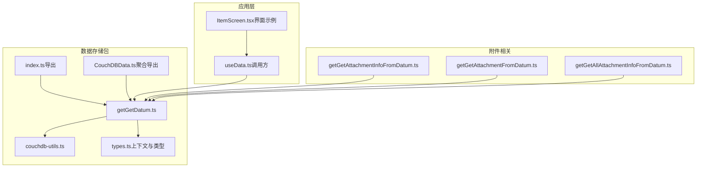
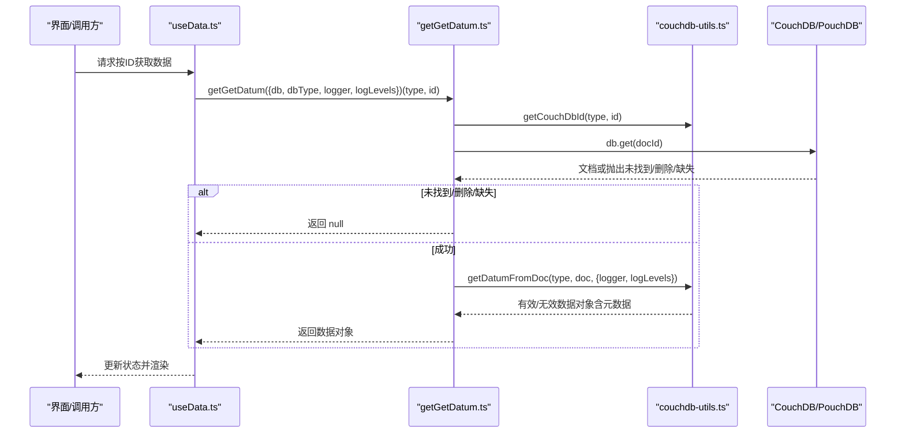
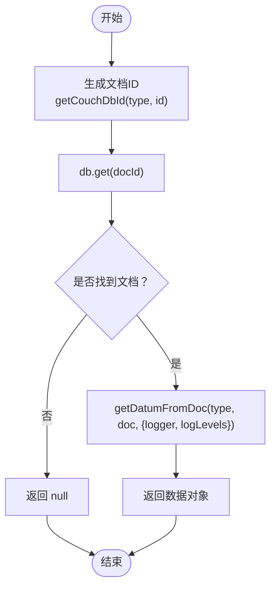
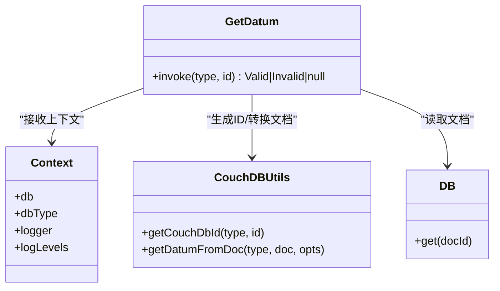

# 获取单条数据

<cite>
**本文引用的文件列表**
- [getGetDatum.ts](file://packages/data-storage-couchdb/lib/functions/getGetDatum.ts)
- [couchdb-utils.ts](file://packages/data-storage-couchdb/lib/functions/couchdb-utils.ts)
- [types.ts（上下文与类型）](file://packages/data-storage-couchdb/lib/functions/types.ts)
- [types.ts（接口定义）](file://Data/lib/types.ts)
- [index.ts（导出入口）](file://packages/data-storage-couchdb/lib/index.ts)
- [CouchDBData.ts](file://packages/data-storage-couchdb/lib/CouchDBData.ts)
- [useData.ts（调用方示例）](file://App/app/data/hooks/useData.ts)
- [ItemScreen.tsx（界面使用示例）](file://App/app/features/inventory/screens/ItemScreen.tsx)
- [getGetAttachmentInfoFromDatum.ts](file://packages/data-storage-couchdb/lib/functions/getGetAttachmentInfoFromDatum.ts)
- [getGetAttachmentFromDatum.ts](file://packages/data-storage-couchdb/lib/functions/getGetAttachmentFromDatum.ts)
- [getGetAllAttachmentInfoFromDatum.ts](file://packages/data-storage-couchdb/lib/functions/getGetAllAttachmentInfoFromDatum.ts)
- [getGetRelated.ts](file://packages/data-storage-couchdb/lib/functions/getGetRelated.ts)
</cite>

## 目录
1. [简介](#简介)
2. [项目结构](#项目结构)
3. [核心组件](#核心组件)
4. [架构总览](#架构总览)
5. [详细组件分析](#详细组件分析)
6. [依赖关系分析](#依赖关系分析)
7. [性能考量](#性能考量)
8. [故障排查指南](#故障排查指南)
9. [结论](#结论)
10. [附录：使用示例与最佳实践](#附录使用示例与最佳实践)

## 简介
本文件围绕 getGetDatum 函数进行系统化文档化，解释其“根据数据类型与ID获取单条数据记录”的能力。内容涵盖：
- 参数要求：数据类型与ID格式、ID生成规则
- 返回数据结构：元数据字段、有效性标记、原始文档、附件信息处理
- 错误处理：记录不存在、数据库异常、类型不匹配等
- 实际使用示例：在界面中按物品ID加载详情
- 缓存策略与性能优化：与 useData 钩子的配合、避免重复请求
- 与其他数据获取函数的关系：与 getGetData、getGetRelated、附件相关函数的协作

## 项目结构
该功能位于数据存储包内，采用分层设计：
- 上下文与类型：Context、CouchDBDoc、Logger 等类型定义
- 工具函数：ID 生成、文档到数据对象转换、排序与扁平化
- 功能实现：getGetDatum 及其依赖的工具链
- 导出入口：统一导出所有数据访问函数
- 调用方：前端 Hook useData 与业务界面 ItemScreen

图表来源
- [getGetDatum.ts](file://packages/data-storage-couchdb/lib/functions/getGetDatum.ts#L1-L41)
- [couchdb-utils.ts](file://packages/data-storage-couchdb/lib/functions/couchdb-utils.ts#L1-L60)
- [types.ts（上下文与类型）](file://packages/data-storage-couchdb/lib/functions/types.ts#L1-L39)
- [index.ts（导出入口）](file://packages/data-storage-couchdb/lib/index.ts#L1-L46)
- [CouchDBData.ts](file://packages/data-storage-couchdb/lib/CouchDBData.ts#L1-L35)
- [useData.ts（调用方示例）](file://App/app/data/hooks/useData.ts#L130-L170)
- [ItemScreen.tsx（界面使用示例）](file://App/app/features/inventory/screens/ItemScreen.tsx#L90-L100)
- [getGetAttachmentInfoFromDatum.ts](file://packages/data-storage-couchdb/lib/functions/getGetAttachmentInfoFromDatum.ts#L1-L41)
- [getGetAttachmentFromDatum.ts](file://packages/data-storage-couchdb/lib/functions/getGetAttachmentFromDatum.ts#L1-L45)
- [getGetAllAttachmentInfoFromDatum.ts](file://packages/data-storage-couchdb/lib/functions/getGetAllAttachmentInfoFromDatum.ts#L1-L38)

章节来源
- [getGetDatum.ts](file://packages/data-storage-couchdb/lib/functions/getGetDatum.ts#L1-L41)
- [couchdb-utils.ts](file://packages/data-storage-couchdb/lib/functions/couchdb-utils.ts#L1-L60)
- [types.ts（上下文与类型）](file://packages/data-storage-couchdb/lib/functions/types.ts#L1-L39)
- [index.ts（导出入口）](file://packages/data-storage-couchdb/lib/index.ts#L1-L46)
- [CouchDBData.ts](file://packages/data-storage-couchdb/lib/CouchDBData.ts#L1-L35)

## 核心组件
- getGetDatum：根据数据类型与ID获取单条数据，内部通过 db.get 拉取文档，并使用工具函数解析为带元数据的数据对象；对“未找到”等特定错误进行捕获并返回 null。
- 数据对象转换：getDatumFromDoc 将 CouchDB 文档转换为带 __type、__id、__rev、__deleted、__created_at、__updated_at、__raw、__valid、__issues 等元数据的代理对象，并基于 schema 进行校验。
- ID 规则：getCouchDbId 将数据类型与用户ID组合为 CouchDB 文档ID，支持前缀映射，确保跨类型唯一性。
- 附件信息：getGetAttachmentInfoFromDatum、getGetAttachmentFromDatum、getGetAllAttachmentInfoFromDatum 基于 getGetDatum 的结果或直接从 __raw 中提取附件元数据或二进制数据。
- 关联查询：getGetRelated 在 belongs_to 场景下可直接调用 getGetDatum 获取关联实体。

章节来源
- [getGetDatum.ts](file://packages/data-storage-couchdb/lib/functions/getGetDatum.ts#L1-L41)
- [couchdb-utils.ts](file://packages/data-storage-couchdb/lib/functions/couchdb-utils.ts#L66-L120)
- [couchdb-utils.ts](file://packages/data-storage-couchdb/lib/functions/couchdb-utils.ts#L1-L60)
- [getGetAttachmentInfoFromDatum.ts](file://packages/data-storage-couchdb/lib/functions/getGetAttachmentInfoFromDatum.ts#L1-L41)
- [getGetAttachmentFromDatum.ts](file://packages/data-storage-couchdb/lib/functions/getGetAttachmentFromDatum.ts#L1-L45)
- [getGetAllAttachmentInfoFromDatum.ts](file://packages/data-storage-couchdb/lib/functions/getGetAllAttachmentInfoFromDatum.ts#L1-L38)
- [getGetRelated.ts](file://packages/data-storage-couchdb/lib/functions/getGetRelated.ts#L1-L55)

## 架构总览
getGetDatum 的调用流程如下：

图表来源
- [useData.ts（调用方示例）](file://App/app/data/hooks/useData.ts#L130-L170)
- [getGetDatum.ts](file://packages/data-storage-couchdb/lib/functions/getGetDatum.ts#L1-L41)
- [couchdb-utils.ts](file://packages/data-storage-couchdb/lib/functions/couchdb-utils.ts#L66-L120)

## 详细组件分析

### getGetDatum 函数详解
- 输入参数
  - type：数据类型名称（枚举），例如 'item'、'collection' 等
  - id：字符串形式的用户侧ID
- 内部逻辑
  - 使用 getCouchDbId(type, id) 生成 CouchDB 文档ID
  - 调用 db.get(docId)，对常见“未找到/删除/缺失”错误进行捕获并返回 null
  - 若存在文档，则通过 getDatumFromDoc(type, doc, {logger, logLevels}) 转换为带元数据的数据对象
- 返回值
  - null：未找到记录
  - 有效数据对象：包含 __type、__id、__rev、__deleted、__created_at、__updated_at、__raw、__valid=true、以及 schema 校验通过后的数据字段
  - 无效数据对象：__valid=false，同时携带 __issues、__error、__error_details 等诊断信息

图表来源
- [getGetDatum.ts](file://packages/data-storage-couchdb/lib/functions/getGetDatum.ts#L1-L41)
- [couchdb-utils.ts](file://packages/data-storage-couchdb/lib/functions/couchdb-utils.ts#L66-L120)

章节来源
- [getGetDatum.ts](file://packages/data-storage-couchdb/lib/functions/getGetDatum.ts#L1-L41)

### 数据对象与元数据结构
getDatumFromDoc 返回的对象包含以下关键元数据字段：
- __type：数据类型
- __id：文档ID中的用户ID部分
- __rev：文档修订号
- __deleted：是否已删除
- __created_at / __updated_at：时间戳
- __raw：原始文档
- __valid：是否通过 schema 校验
- __issues / __error / __error_details：校验问题与错误详情

章节来源
- [couchdb-utils.ts](file://packages/data-storage-couchdb/lib/functions/couchdb-utils.ts#L66-L120)
- [types.ts（接口定义）](file://Data/lib/types.ts#L1-L60)

### ID 生成与类型前缀
- getCouchDbId 将 type 与 id 组合为文档ID，若存在类型前缀映射，则使用前缀-类型-用户ID 的形式，否则使用 类型-用户ID
- getDataIdFromCouchDbId 支持从文档ID反向解析出类型与用户ID，用于校验与调试

章节来源
- [couchdb-utils.ts](file://packages/data-storage-couchdb/lib/functions/couchdb-utils.ts#L1-L60)

### 附件信息处理
- 单个附件信息：getGetAttachmentInfoFromDatum 先尝试从 d.__raw._attachments 中读取，若无则回退调用 getGetDatum 获取原始文档后再提取
- 附件二进制数据：getGetAttachmentFromDatum 在获取到附件元数据后，分别针对 PouchDB 或 CouchDB 客户端调用 getAttachment 获取二进制数据
- 所有附件信息：getGetAllAttachmentInfoFromDatum 对 d.__raw._attachments 进行遍历，返回键名为附件名、值为内容类型的映射

章节来源
- [getGetAttachmentInfoFromDatum.ts](file://packages/data-storage-couchdb/lib/functions/getGetAttachmentInfoFromDatum.ts#L1-L41)
- [getGetAttachmentFromDatum.ts](file://packages/data-storage-couchdb/lib/functions/getGetAttachmentFromDatum.ts#L1-L45)
- [getGetAllAttachmentInfoFromDatum.ts](file://packages/data-storage-couchdb/lib/functions/getGetAllAttachmentInfoFromDatum.ts#L1-L38)

### 与其他数据获取函数的关系
- 与 getGetData：getGetData 用于批量查询，getGetDatum 用于单条查询；两者共享相同的文档ID生成与转换逻辑
- 与 getGetRelated：在 belongs_to 关系中，getGetRelated 会直接调用 getGetDatum 获取父实体
- 与附件函数：附件相关函数均以 getGetDatum 的结果或 __raw 为基础，保证在无原始文档时自动拉取

章节来源
- [getGetRelated.ts](file://packages/data-storage-couchdb/lib/functions/getGetRelated.ts#L1-L55)
- [getGetAttachmentInfoFromDatum.ts](file://packages/data-storage-couchdb/lib/functions/getGetAttachmentInfoFromDatum.ts#L1-L41)
- [getGetAttachmentFromDatum.ts](file://packages/data-storage-couchdb/lib/functions/getGetAttachmentFromDatum.ts#L1-L45)
- [getGetAllAttachmentInfoFromDatum.ts](file://packages/data-storage-couchdb/lib/functions/getGetAllAttachmentInfoFromDatum.ts#L1-L38)

## 依赖关系分析
- getGetDatum 依赖
  - Context：db、dbType、logger、logLevels
  - 工具函数：getCouchDbId、getDatumFromDoc
- 调用链
  - 应用层 Hook useData -> getGetDatum -> db.get -> getDatumFromDoc -> schema 校验
- 导出与聚合
  - index.ts 与 CouchDBData.ts 将 getGetDatum 作为公共 API 暴露

图表来源
- [getGetDatum.ts](file://packages/data-storage-couchdb/lib/functions/getGetDatum.ts#L1-L41)
- [couchdb-utils.ts](file://packages/data-storage-couchdb/lib/functions/couchdb-utils.ts#L1-L60)
- [types.ts（上下文与类型）](file://packages/data-storage-couchdb/lib/functions/types.ts#L1-L39)

章节来源
- [index.ts（导出入口）](file://packages/data-storage-couchdb/lib/index.ts#L1-L46)
- [CouchDBData.ts](file://packages/data-storage-couchdb/lib/CouchDBData.ts#L1-L35)

## 性能考量
- 单条查询 vs 批量查询：getGetDatum 适合精确ID查询，避免不必要的全表扫描；批量查询请使用 getGetData 并合理设置 limit/skip
- 附件读取成本：附件二进制数据读取需额外网络/磁盘开销，建议仅在需要时调用 getGetAttachmentFromDatum
- 缓存策略：应用层 useData 在首次加载后会缓存结果，避免重复请求；界面聚焦时触发刷新，减少无效调用
- 日志与诊断：通过 logger 与 logLevels 控制日志级别，便于定位性能瓶颈与异常

章节来源
- [useData.ts（调用方示例）](file://App/app/data/hooks/useData.ts#L130-L170)

## 故障排查指南
- 记录不存在
  - 现象：返回 null
  - 处理：检查 type 与 id 是否正确，确认文档是否存在
- 数据库连接失败
  - 现象：抛出异常
  - 处理：检查 db 配置、网络连通性；重试或降级策略
- 文档类型不匹配
  - 现象：getDatumFromDoc 返回 __valid=false，并在日志中提示类型不一致
  - 处理：核对文档ID中的类型与传入 type 是否一致
- 附件不存在或格式异常
  - 现象：getGetAttachmentInfoFromDatum 返回 null；getGetAttachmentFromDatum 抛错
  - 处理：确认附件名与文档 _attachments 结构，必要时先调用 getGetDatum 获取最新 __raw

章节来源
- [getGetDatum.ts](file://packages/data-storage-couchdb/lib/functions/getGetDatum.ts#L1-L41)
- [couchdb-utils.ts](file://packages/data-storage-couchdb/lib/functions/couchdb-utils.ts#L66-L120)
- [getGetAttachmentInfoFromDatum.ts](file://packages/data-storage-couchdb/lib/functions/getGetAttachmentInfoFromDatum.ts#L1-L41)
- [getGetAttachmentFromDatum.ts](file://packages/data-storage-couchdb/lib/functions/getGetAttachmentFromDatum.ts#L1-L45)

## 结论
getGetDatum 提供了稳定、可诊断的单条数据获取能力，结合元数据与校验机制，能够清晰地表达数据有效性与错误信息。通过与附件相关函数及 getGetRelated 的协同，可构建完整的数据读取与展示链路。在实际使用中，应遵循 ID 生成规范、合理利用缓存与日志，并在需要时按需加载附件数据以优化性能。

## 附录：使用示例与最佳实践

### 参数要求
- type：必须为受支持的数据类型名称（如 'item'、'collection' 等）
- id：字符串形式的用户侧ID，getGetDatum 会将其与类型组合为文档ID

章节来源
- [getGetDatum.ts](file://packages/data-storage-couchdb/lib/functions/getGetDatum.ts#L1-L41)
- [couchdb-utils.ts](file://packages/data-storage-couchdb/lib/functions/couchdb-utils.ts#L1-L60)

### 返回数据结构
- null：未找到记录
- 有效对象：包含 __type、__id、__rev、__deleted、__created_at、__updated_at、__raw、__valid=true
- 无效对象：__valid=false，携带 __issues、__error、__error_details

章节来源
- [types.ts（接口定义）](file://Data/lib/types.ts#L1-L60)
- [couchdb-utils.ts](file://packages/data-storage-couchdb/lib/functions/couchdb-utils.ts#L66-L120)

### 错误处理场景
- 记录不存在：返回 null
- 数据库异常：抛出异常，调用方可捕获并提示
- 类型不匹配：返回无效对象并在日志中警告

章节来源
- [getGetDatum.ts](file://packages/data-storage-couchdb/lib/functions/getGetDatum.ts#L1-L41)
- [couchdb-utils.ts](file://packages/data-storage-couchdb/lib/functions/couchdb-utils.ts#L66-L120)

### 实际使用示例
- 在界面中按物品ID获取详细信息
  - ItemScreen.tsx 中通过 useData('item', id) 触发 getGetDatum 的调用
  - 刷新与重新加载由 useData 管理，避免重复请求

章节来源
- [ItemScreen.tsx（界面使用示例）](file://App/app/features/inventory/screens/ItemScreen.tsx#L90-L100)
- [useData.ts（调用方示例）](file://App/app/data/hooks/useData.ts#L130-L170)

### 缓存策略与性能优化
- 应用层缓存：useData 首次加载后缓存结果，聚焦时刷新
- 按需加载：附件数据仅在需要时获取，避免不必要的 IO
- 合理的日志级别：通过 logLevels 控制日志输出，降低运行时开销

章节来源
- [useData.ts（调用方示例）](file://App/app/data/hooks/useData.ts#L130-L170)

### 与其他数据获取函数的关系
- getGetData：批量查询，适合列表场景
- getGetRelated：在 belongs_to 关系中直接调用 getGetDatum 获取父实体
- 附件函数：基于 getGetDatum 的结果或 __raw，确保在无原始文档时自动拉取

章节来源
- [getGetRelated.ts](file://packages/data-storage-couchdb/lib/functions/getGetRelated.ts#L1-L55)
- [getGetAttachmentInfoFromDatum.ts](file://packages/data-storage-couchdb/lib/functions/getGetAttachmentInfoFromDatum.ts#L1-L41)
- [getGetAttachmentFromDatum.ts](file://packages/data-storage-couchdb/lib/functions/getGetAttachmentFromDatum.ts#L1-L45)
- [getGetAllAttachmentInfoFromDatum.ts](file://packages/data-storage-couchdb/lib/functions/getGetAllAttachmentInfoFromDatum.ts#L1-L38)