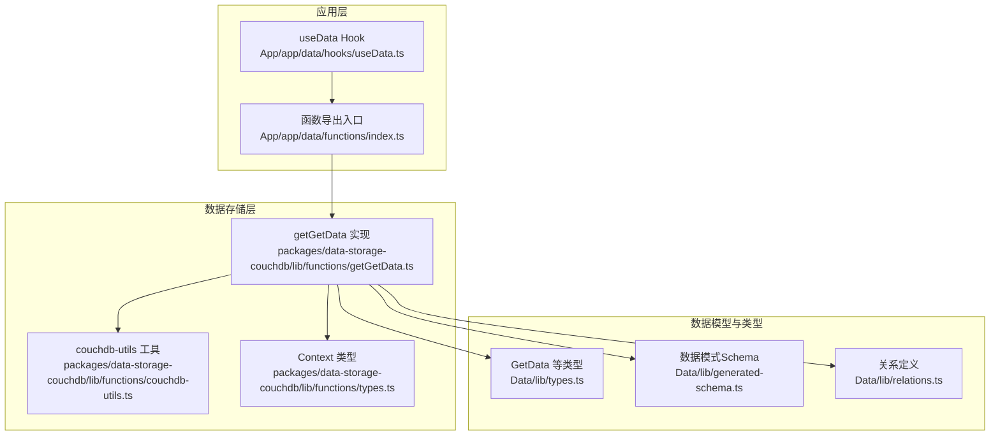
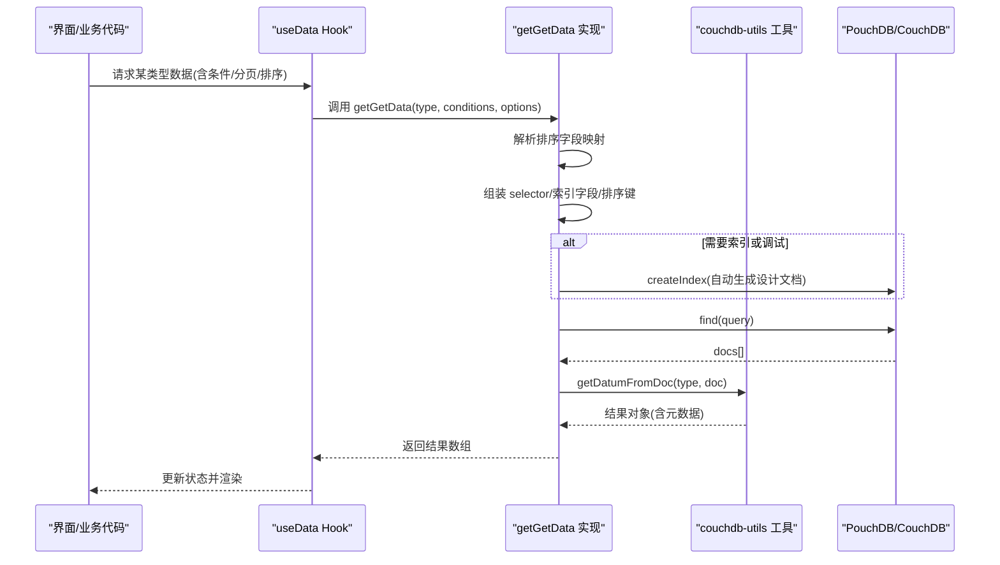
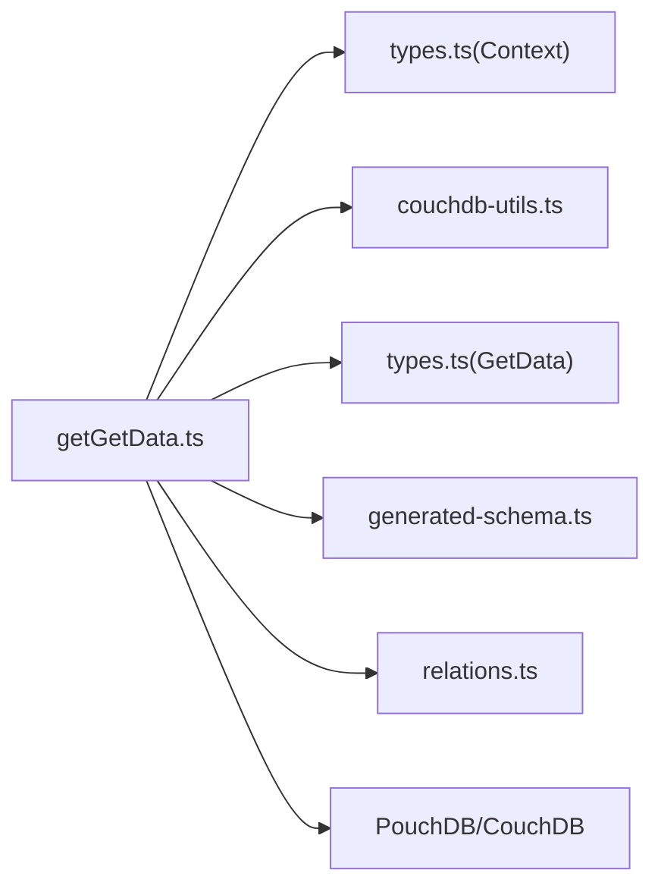

# 获取数据列表

<cite>
**本文引用的文件**
- [getGetData.ts](file://packages/data-storage-couchdb/lib/functions/getGetData.ts)
- [types.ts（数据类型）](file://Data/lib/types.ts)
- [useData.ts（React Hook）](file://App/app/data/hooks/useData.ts)
- [index.ts（函数导出）](file://App/app/data/functions/index.ts)
- [couchdb-utils.ts（工具函数）](file://packages/data-storage-couchdb/lib/functions/couchdb-utils.ts)
- [types.ts（上下文类型）](file://packages/data-storage-couchdb/lib/functions/types.ts)
- [generated-schema.ts（数据模式）](file://Data/lib/generated-schema.ts)
- [relations.ts（关系定义）](file://Data/lib/relations.ts)
</cite>

## 目录
1. [简介](#简介)
2. [项目结构](#项目结构)
3. [核心组件](#核心组件)
4. [架构总览](#架构总览)
5. [详细组件分析](#详细组件分析)
6. [依赖分析](#依赖分析)
7. [性能考虑](#性能考虑)
8. [故障排查指南](#故障排查指南)
9. [结论](#结论)
10. [附录：示例与最佳实践](#附录示例与最佳实践)

## 简介
本文件围绕核心数据查询接口 getGetData 进行系统化文档化，目标是帮助开发者理解：
- 函数参数与行为：数据类型、分页（skip/limit）、排序规则、过滤条件
- 返回数据结构：结果集与调试信息
- 底层实现机制：PouchDB/CouchDB 查询、索引生成与 explain 调试
- 错误处理与常见问题排查
- 实际使用场景：查询物品、集合等不同数据类型

## 项目结构
getGetData 位于数据存储包中，通过统一的上下文 Context 注入数据库实例与日志器，并在应用层通过 useData Hook 暴露给 UI 使用。

图表来源
- [useData.ts](file://App/app/data/hooks/useData.ts#L120-L170)
- [index.ts](file://App/app/data/functions/index.ts#L43-L46)
- [getGetData.ts](file://packages/data-storage-couchdb/lib/functions/getGetData.ts#L20-L330)
- [couchdb-utils.ts](file://packages/data-storage-couchdb/lib/functions/couchdb-utils.ts#L1-L200)
- [types.ts（上下文类型）](file://packages/data-storage-couchdb/lib/functions/types.ts#L1-L39)
- [types.ts（数据类型）](file://Data/lib/types.ts#L90-L110)
- [generated-schema.ts](file://Data/lib/generated-schema.ts#L1-L40)
- [relations.ts](file://Data/lib/relations.ts#L1-L50)

章节来源
- [useData.ts](file://App/app/data/hooks/useData.ts#L120-L170)
- [index.ts](file://App/app/data/functions/index.ts#L43-L46)
- [getGetData.ts](file://packages/data-storage-couchdb/lib/functions/getGetData.ts#L20-L330)

## 核心组件
- getGetData：根据类型与条件执行查询，支持分页、排序与调试输出；自动推断并创建索引以提升性能。
- useData：React Hook，封装分页、排序、加载状态与错误日志，调用 getGetData 执行查询。
- 数据类型与模式：GetData 接口定义、数据模式 Schema、关系定义，为查询提供约束与校验。

章节来源
- [getGetData.ts](file://packages/data-storage-couchdb/lib/functions/getGetData.ts#L20-L330)
- [types.ts（数据类型）](file://Data/lib/types.ts#L90-L110)
- [useData.ts](file://App/app/data/hooks/useData.ts#L120-L170)

## 架构总览
getGetData 的调用链路如下：

图表来源
- [useData.ts](file://App/app/data/hooks/useData.ts#L120-L170)
- [getGetData.ts](file://packages/data-storage-couchdb/lib/functions/getGetData.ts#L20-L330)
- [couchdb-utils.ts](file://packages/data-storage-couchdb/lib/functions/couchdb-utils.ts#L66-L120)

## 详细组件分析

### getGetData 参数与行为
- 参数
  - type：数据类型名称（如 item、collection）
  - conditions：
    - 字符串 ID：单条数据查询
    - 字符串数组：批量 ID 查询
    - 对象：部分匹配条件（支持范围运算符等）
  - options：
    - skip：跳过记录数（用于分页）
    - limit：限制返回数量（用于分页）
    - sort：排序规则（见下节）
    - debug：开启调试模式，输出 explain 与查询详情
- 行为
  - 自动将 __id/__created_at/__updated_at 映射到 CouchDB 字段
  - 自动扁平化 selector 并推断索引字段
  - 若未显式传入索引且存在条件或排序，会自动生成设计文档并创建索引
  - 支持 explain 输出，便于诊断查询计划

章节来源
- [getGetData.ts](file://packages/data-storage-couchdb/lib/functions/getGetData.ts#L20-L330)
- [types.ts（数据类型）](file://Data/lib/types.ts#L90-L110)

### 排序规则与索引生成
- 排序字段映射
  - __id -> _id
  - __created_at -> created_at
  - __updated_at -> updated_at
  - 其他字段映射到 data.<字段名>
- 索引字段推断
  - 基于 selector 中出现的字段与排序字段去重、排序后组合
  - 设计文档名包含 type 与字段组合，确保唯一性
  - 当仅按类型查询且无排序时，使用 type + _id 的复合索引
- 排序兼容性
  - 由于底层限制，排序方向需一致（全部升序或全部降序），实现中通过统一方向保证可匹配索引

章节来源
- [getGetData.ts](file://packages/data-storage-couchdb/lib/functions/getGetData.ts#L32-L221)

### 返回数据结构
- 结果数组元素
  - 包含元数据：__type、__id、__rev、__deleted、__created_at、__updated_at、__valid、__issues、__raw
  - 数据内容来自 data 字段，经 Schema 校验
- 调试模式
  - 当启用 debug 时，返回数组附加 debug_info.explain，包含查询计划信息

章节来源
- [couchdb-utils.ts](file://packages/data-storage-couchdb/lib/functions/couchdb-utils.ts#L66-L120)
- [getGetData.ts](file://packages/data-storage-couchdb/lib/functions/getGetData.ts#L236-L256)

### 底层查询机制与性能优化
- 查询路径
  - 优先使用 use_index 指定的设计文档
  - selector 中的字段自动扁平化，避免嵌套导致无法命中索引
  - 对 __id 的特殊处理：字符串值会拼接 type 前缀，范围查询也会相应转换
- 索引创建策略
  - alwaysCreateIndexFirst 或 debug 模式下，先尝试创建索引
  - 正常运行时若查询报错提示索引缺失，会自动重试并创建索引
- explain 调试
  - debug 或日志级别包含 debug 时，调用 explain 输出查询计划，辅助定位性能瓶颈

章节来源
- [getGetData.ts](file://packages/data-storage-couchdb/lib/functions/getGetData.ts#L224-L256)
- [couchdb-utils.ts](file://packages/data-storage-couchdb/lib/functions/couchdb-utils.ts#L1-L200)

### 错误处理与常见问题
- 数组 ID + 排序不支持
  - 当 conditions 为数组时，不支持排序；否则抛出错误
- 索引缺失导致查询失败
  - 自动重试并创建索引；若仍失败，抛出异常
- 文档类型不匹配
  - 通过 ID 反解得到的类型与期望类型不符时，返回无效数据标记
- 日志与调试
  - debug 模式下输出完整查询与 explain，便于定位问题

章节来源
- [getGetData.ts](file://packages/data-storage-couchdb/lib/functions/getGetData.ts#L56-L63)
- [getGetData.ts](file://packages/data-storage-couchdb/lib/functions/getGetData.ts#L257-L330)
- [couchdb-utils.ts](file://packages/data-storage-couchdb/lib/functions/couchdb-utils.ts#L66-L120)

## 依赖分析
- 组件耦合
  - getGetData 依赖 Context（db、logger、logLevels、alwaysCreateIndexFirst）
  - 依赖 couchdb-utils 提供 ID 转换、文档解析与 Schema 校验
  - 依赖 Data 层类型与 Schema 定义，确保查询与返回结构一致
- 外部依赖
  - PouchDB/CouchDB：执行 find 与 createIndex
  - Zod：Schema 校验

图表来源
- [getGetData.ts](file://packages/data-storage-couchdb/lib/functions/getGetData.ts#L20-L330)
- [types.ts（上下文类型）](file://packages/data-storage-couchdb/lib/functions/types.ts#L1-L39)
- [couchdb-utils.ts](file://packages/data-storage-couchdb/lib/functions/couchdb-utils.ts#L1-L200)
- [types.ts（数据类型）](file://Data/lib/types.ts#L90-L110)
- [generated-schema.ts](file://Data/lib/generated-schema.ts#L1-L40)
- [relations.ts](file://Data/lib/relations.ts#L1-L50)

## 性能考虑
- 索引设计
  - 将常用过滤字段与排序字段纳入索引，减少回表与排序成本
  - 避免对大量动态字段建立索引，优先聚焦高频查询字段
- 分页策略
  - 合理设置 skip/limit，避免超大 skip 导致扫描成本上升
  - 使用基于时间戳或自增字段的游标式分页更优（当前实现支持 skip/limit）
- 查询优化
  - 条件尽量集中在已建索引字段上
  - 避免在 data.<字段> 上做复杂表达式查询
- 调试与监控
  - 在开发阶段开启 debug，利用 explain 观察查询计划
  - 生产环境谨慎开启 debug，避免额外开销

[本节为通用指导，无需具体文件引用]

## 故障排查指南
- 现象：数组 ID 查询时报“不支持排序”
  - 原因：数组 ID 查询不支持排序
  - 处理：移除 sort 或改为字符串 ID 单条查询
- 现象：远程 CouchDB 报“索引不存在”
  - 原因：设计文档未创建或未同步
  - 处理：开启 alwaysCreateIndexFirst 或 debug；或手动创建对应设计文档
- 现象：返回数据 __valid 为 false
  - 原因：Schema 校验失败或文档类型不匹配
  - 处理：检查数据内容与 Schema；确认 __type 与文档 ID 前缀一致
- 现象：查询缓慢
  - 处理：使用 debug 查看 explain；优化索引字段与排序方向；减少不必要的字段选择

章节来源
- [getGetData.ts](file://packages/data-storage-couchdb/lib/functions/getGetData.ts#L56-L63)
- [getGetData.ts](file://packages/data-storage-couchdb/lib/functions/getGetData.ts#L224-L256)
- [couchdb-utils.ts](file://packages/data-storage-couchdb/lib/functions/couchdb-utils.ts#L66-L120)

## 结论
getGetData 通过智能的索引推断与自动创建、严格的字段映射与 Schema 校验，提供了稳定高效的列表查询能力。结合 useData Hook 的分页与排序封装，能够满足大多数数据浏览与筛选需求。建议在生产环境中合理规划索引字段、控制调试开关，并通过 explain 持续优化查询性能。

[本节为总结，无需具体文件引用]

## 附录：示例与最佳实践

### 示例一：按类型查询（无条件、无排序）
- 适用场景：列出某一类型的所有数据
- 关键点：自动使用 type + _id 索引，支持 skip/limit 分页

章节来源
- [getGetData.ts](file://packages/data-storage-couchdb/lib/functions/getGetData.ts#L80-L97)

### 示例二：按条件查询（带过滤）
- 适用场景：按字段值过滤（如 collection_id、name 等）
- 关键点：selector 自动扁平化；索引字段包含过滤字段；支持范围查询

章节来源
- [getGetData.ts](file://packages/data-storage-couchdb/lib/functions/getGetData.ts#L99-L221)

### 示例三：批量 ID 查询
- 适用场景：一次性获取多个对象
- 关键点：不支持排序；返回顺序与输入 ID 顺序一致；缺失 ID 将返回无效标记

章节来源
- [getGetData.ts](file://packages/data-storage-couchdb/lib/functions/getGetData.ts#L56-L77)
- [getGetData.ts](file://packages/data-storage-couchdb/lib/functions/getGetData.ts#L302-L319)

### 示例四：排序与分页
- 适用场景：按时间或名称排序并分页
- 关键点：排序方向需一致；索引需覆盖排序字段；配合 skip/limit 使用

章节来源
- [getGetData.ts](file://packages/data-storage-couchdb/lib/functions/getGetData.ts#L32-L53)
- [getGetData.ts](file://packages/data-storage-couchdb/lib/functions/getGetData.ts#L195-L215)

### 示例五：调试与性能分析
- 适用场景：定位慢查询或索引问题
- 关键点：开启 debug 输出 explain；观察索引是否被使用；必要时调整字段组合

章节来源
- [getGetData.ts](file://packages/data-storage-couchdb/lib/functions/getGetData.ts#L236-L256)

### 最佳实践清单
- 为高频查询字段建立索引，避免全表扫描
- 使用 __id、__created_at、__updated_at 等元字段进行高效过滤与排序
- 避免在 data.<字段> 上做复杂表达式查询
- 在开发阶段开启 debug，生产阶段关闭
- 使用 useData Hook 管理分页与排序状态，避免重复请求

[本节为通用指导，无需具体文件引用]