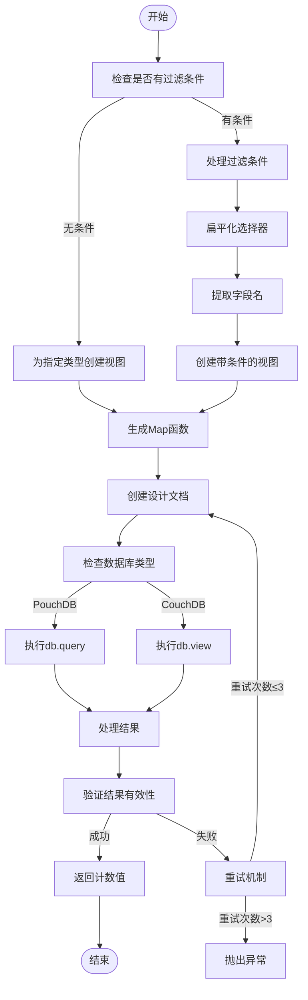
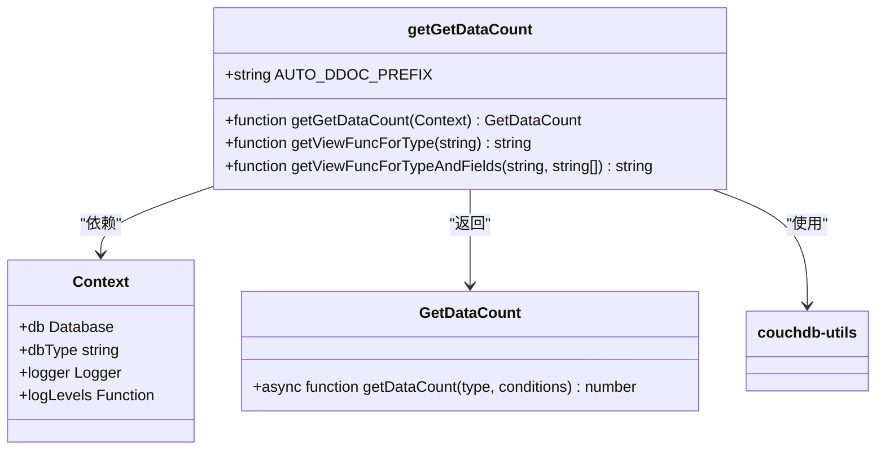
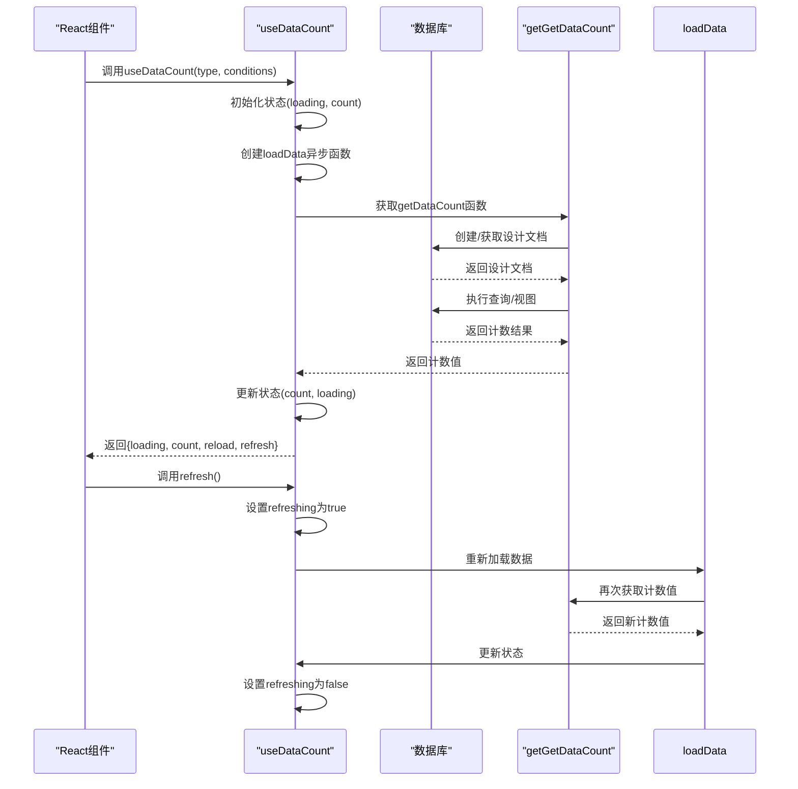
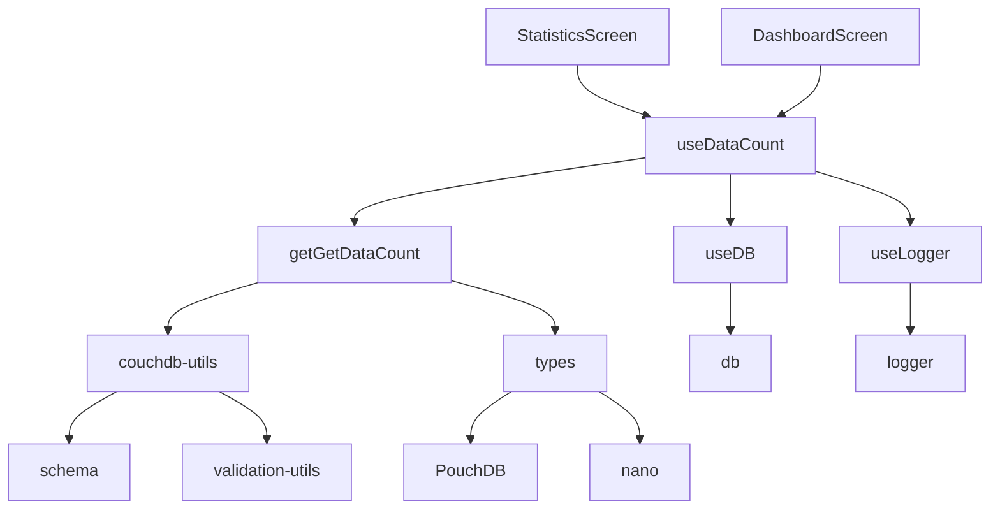
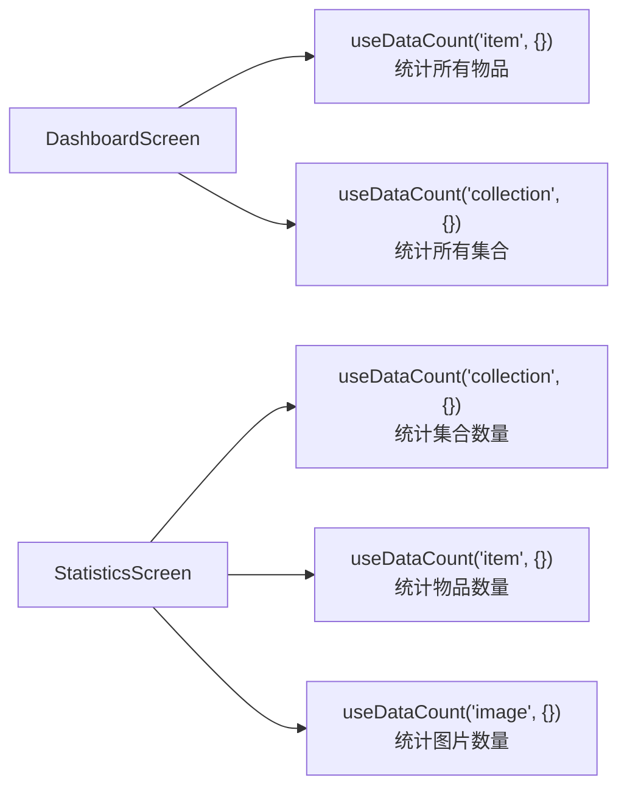

# 获取数据数量

<cite>
**本文档引用的文件**
- [getGetDataCount.ts](file://packages/data-storage-couchdb/lib/functions/getGetDataCount.ts)
- [useDataCount.ts](file://App/app/data/hooks/useDataCount.ts)
- [StatisticsScreen.tsx](file://App/app/features/inventory/screens/StatisticsScreen.tsx)
- [DashboardScreen.tsx](file://App/app/features/inventory/screens/DashboardScreen.tsx)
- [couchdb-utils.ts](file://packages/data-storage-couchdb/lib/functions/couchdb-utils.ts)
- [types.ts](file://packages/data-storage-couchdb/lib/functions/types.ts)
</cite>

## 目录
1. [简介](#简介)
2. [核心功能分析](#核心功能分析)
3. [架构与实现原理](#架构与实现原理)
4. [详细组件分析](#详细组件分析)
5. [依赖关系分析](#依赖关系分析)
6. [性能考量](#性能考量)
7. [使用场景与最佳实践](#使用场景与最佳实践)
8. [故障排除指南](#故障排除指南)
9. [结论](#结论)

## 简介
`getGetDataCount`函数是库存管理系统中的核心统计功能，专门用于高效计算特定类型数据记录的数量。该函数通过PouchDB/CouchDB的查询机制，利用设计文档（design document）和视图（view）的reduce功能，实现了对大数据集的快速计数操作。与传统的查询后计数方法相比，该函数在性能上有显著优势，特别适用于需要频繁统计库存物品、检查清单等数据量的场景。

## 核心功能分析

`getGetDataCount`函数的主要功能是统计指定数据类型（type）的记录数量。函数支持两种使用模式：无条件统计和有条件统计。在无条件模式下，函数会创建一个针对特定数据类型的视图，使用`_count` reduce函数直接返回总数。在有条件模式下，函数会根据提供的过滤条件动态生成相应的视图，确保查询结果的准确性。

函数通过自动创建和管理设计文档来优化查询性能，这些设计文档会被缓存以便后续重复使用。当数据库类型为PouchDB时，函数使用`db.query`方法；当为CouchDB时，使用`db.view`方法。这种设计使得函数能够兼容不同的数据库后端，同时保持一致的API接口。

**Section sources**
- [getGetDataCount.ts](file://packages/data-storage-couchdb/lib/functions/getGetDataCount.ts#L1-L277)

## 架构与实现原理

**Diagram sources**
- [getGetDataCount.ts](file://packages/data-storage-couchdb/lib/functions/getGetDataCount.ts#L1-L277)

## 详细组件分析

### getGetDataCount 函数分析

`getGetDataCount`函数的核心实现基于CouchDB/PouchDB的视图和reduce功能。函数首先根据输入参数判断是否需要应用过滤条件。如果没有条件，则创建一个简单的视图，该视图的map函数仅检查文档类型并发出文档ID。如果有条件，则函数会使用`flattenSelector`工具函数将嵌套的条件对象扁平化，然后提取所有涉及的字段名，用于构建更复杂的map函数。

**Diagram sources**
- [getGetDataCount.ts](file://packages/data-storage-couchdb/lib/functions/getGetDataCount.ts#L1-L277)
- [couchdb-utils.ts](file://packages/data-storage-couchdb/lib/functions/couchdb-utils.ts#L1-L351)

### useDataCount Hook 分析

`useDataCount`是一个React Hook，封装了`getGetDataCount`函数，使其能够在React组件中方便地使用。该Hook处理了加载状态、错误处理和数据刷新等常见的UI需求。

**Diagram sources**
- [useDataCount.ts](file://App/app/data/hooks/useDataCount.ts#L1-L109)
- [getGetDataCount.ts](file://packages/data-storage-couchdb/lib/functions/getGetDataCount.ts#L1-L277)

## 依赖关系分析

**Diagram sources**
- [getGetDataCount.ts](file://packages/data-storage-couchdb/lib/functions/getGetDataCount.ts#L1-L277)
- [useDataCount.ts](file://App/app/data/hooks/useDataCount.ts#L1-L109)
- [StatisticsScreen.tsx](file://App/app/features/inventory/screens/StatisticsScreen.tsx#L1-L126)
- [DashboardScreen.tsx](file://App/app/features/inventory/screens/DashboardScreen.tsx#L1-L514)

**Section sources**
- [getGetDataCount.ts](file://packages/data-storage-couchdb/lib/functions/getGetDataCount.ts#L1-L277)
- [useDataCount.ts](file://App/app/data/hooks/useDataCount.ts#L1-L109)
- [couchdb-utils.ts](file://packages/data-storage-couchdb/lib/functions/couchdb-utils.ts#L1-L351)
- [types.ts](file://packages/data-storage-couchdb/lib/functions/types.ts#L1-L39)

## 性能考量

`getGetDataCount`函数在性能设计上具有显著优势。与传统的"查询所有记录然后计数"的方法相比，该函数利用了CouchDB/PouchDB的reduce功能，能够在数据库层面直接完成计数操作，避免了大量数据的传输和客户端处理。

对于大数据集，这种性能优势尤为明显。传统方法的时间复杂度为O(n)，其中n是匹配记录的数量，而`getGetDataCount`的时间复杂度接近O(1)，因为它只返回一个计数值，而不是所有匹配的文档。此外，函数通过自动创建和重用设计文档，进一步优化了查询性能。

函数还实现了重试机制，最多重试3次，以应对设计文档创建过程中的临时性错误。这种设计确保了函数的可靠性，同时避免了无限重试导致的性能问题。

**Section sources**
- [getGetDataCount.ts](file://packages/data-storage-couchdb/lib/functions/getGetDataCount.ts#L1-L277)

## 使用场景与最佳实践

### 实际使用场景

`getGetDataCount`函数在库存管理系统中有多种实际应用场景：

1. **库存物品总数统计**：在仪表板上显示当前库存中所有物品的总数
2. **检查清单数量统计**：统计系统中创建的检查清单数量
3. **过期物品统计**：计算已过期或即将过期的物品数量
4. **RFID标签统计**：统计未标记或标签过期的物品数量
5. **低库存预警**：计算库存量低于安全水平的物品数量

### 使用示例

**Diagram sources**
- [DashboardScreen.tsx](file://App/app/features/inventory/screens/DashboardScreen.tsx#L1-L514)
- [StatisticsScreen.tsx](file://App/app/features/inventory/screens/StatisticsScreen.tsx#L1-L126)

### 最佳实践

1. **合理使用缓存**：函数自动管理设计文档的创建和重用，开发者无需手动管理
2. **避免频繁创建新视图**：尽量重用已有的条件组合，避免为每个微小变化创建新的设计文档
3. **处理异步操作**：使用`useDataCount` Hook时，注意处理加载状态和错误情况
4. **性能监控**：在大数据集上使用时，监控查询性能，必要时考虑预计算和缓存策略
5. **错误处理**：实现适当的错误处理机制，特别是在网络不稳定或数据库同步延迟的情况下

## 故障排除指南

### 常见问题及解决方案

1. **计数结果为0或不准确**
   - 检查数据库连接是否正常
   - 确认数据类型名称是否正确
   - 验证过滤条件是否符合预期
   - 检查设计文档是否成功创建

2. **性能问题**
   - 确认是否为首次查询，首次查询需要创建设计文档，会相对较慢
   - 检查是否有大量并发查询导致数据库负载过高
   - 考虑是否需要优化视图设计或添加索引

3. **设计文档创建失败**
   - 检查数据库写权限
   - 确认数据库空间是否充足
   - 查看日志中的具体错误信息

4. **类型错误**
   - 确保传入的类型参数是有效的数据类型名称
   - 验证条件对象的结构是否符合要求

**Section sources**
- [getGetDataCount.ts](file://packages/data-storage-couchdb/lib/functions/getGetDataCount.ts#L1-L277)
- [useDataCount.ts](file://App/app/data/hooks/useDataCount.ts#L1-L109)

## 结论

`getGetDataCount`函数是库存管理系统中一个高效、可靠的统计工具。通过利用CouchDB/PouchDB的视图和reduce功能，该函数能够在大数据集上实现快速的计数操作，相比传统的查询后计数方法具有显著的性能优势。函数的设计考虑了实际使用中的各种场景，提供了灵活的条件过滤功能和可靠的错误处理机制。

`useDataCount` Hook的封装使得该功能在React组件中易于使用，自动处理了加载状态、错误提示和数据刷新等常见的UI需求。在实际应用中，该函数被广泛用于仪表板、统计页面等需要实时显示数据量的场景，为用户提供及时、准确的信息反馈。

对于未来的优化，可以考虑增加更多的查询选项，如支持更复杂的条件组合，或者提供预计算和缓存机制以进一步提升性能。同时，完善监控和日志功能，有助于更好地诊断和解决潜在的性能问题。