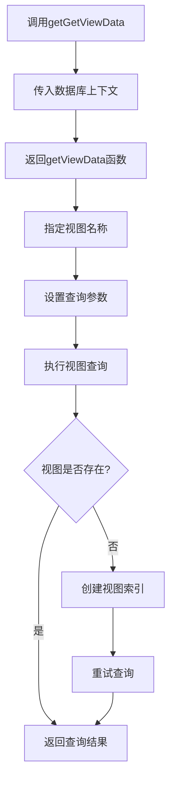
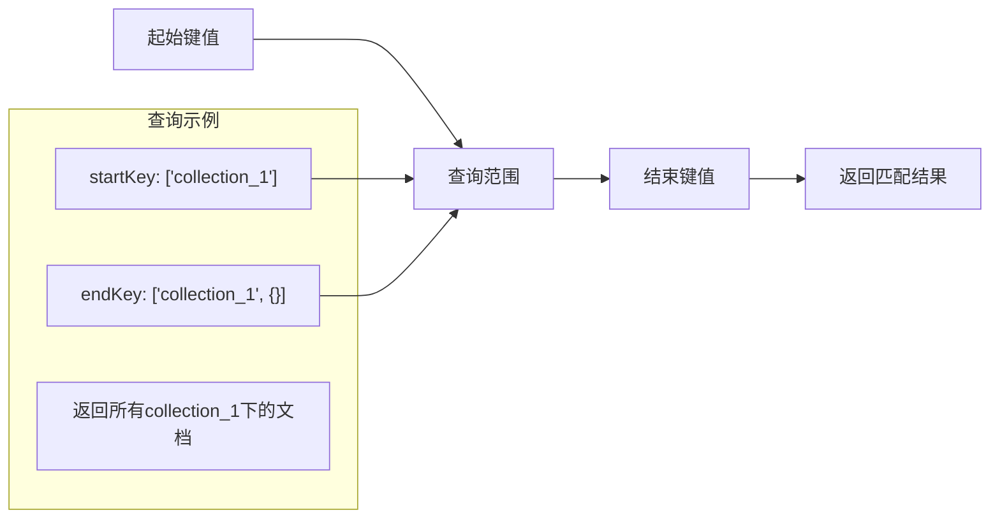
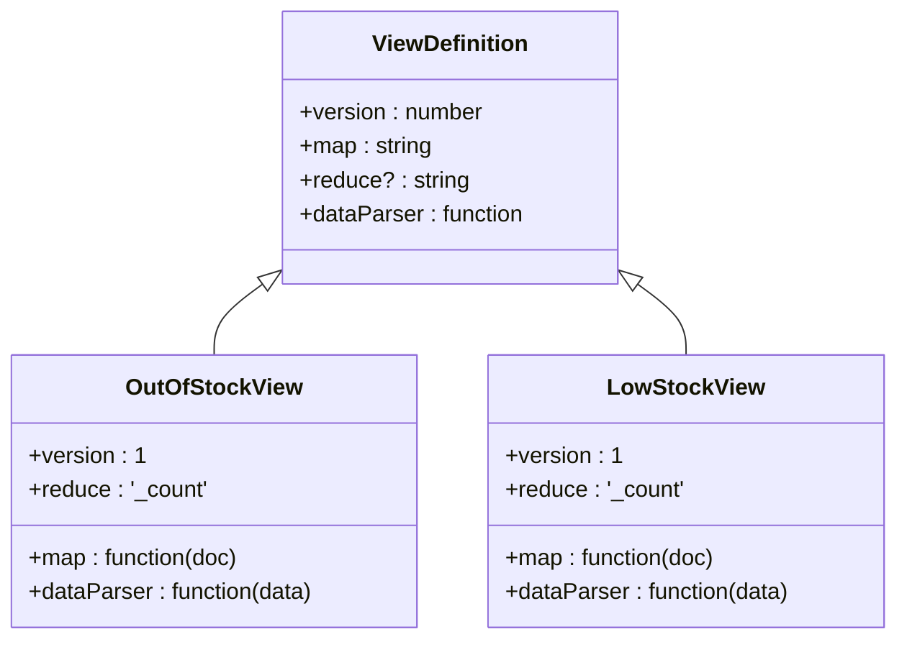
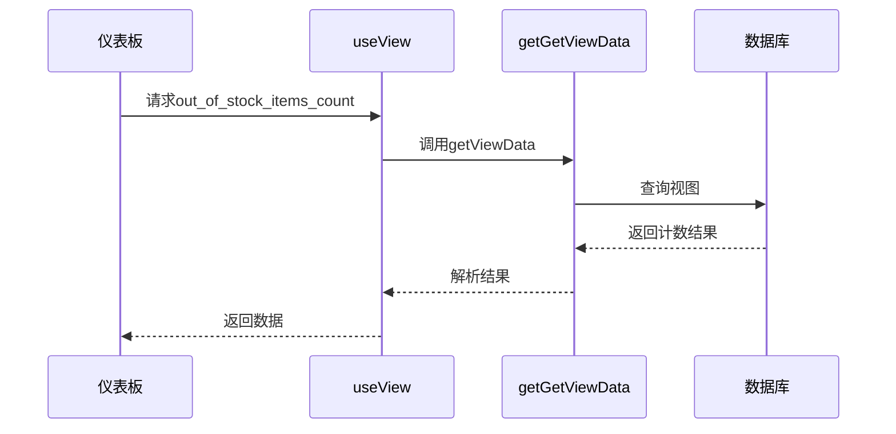
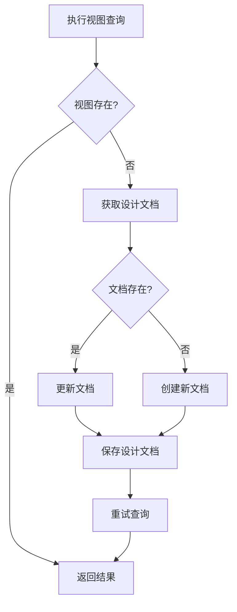
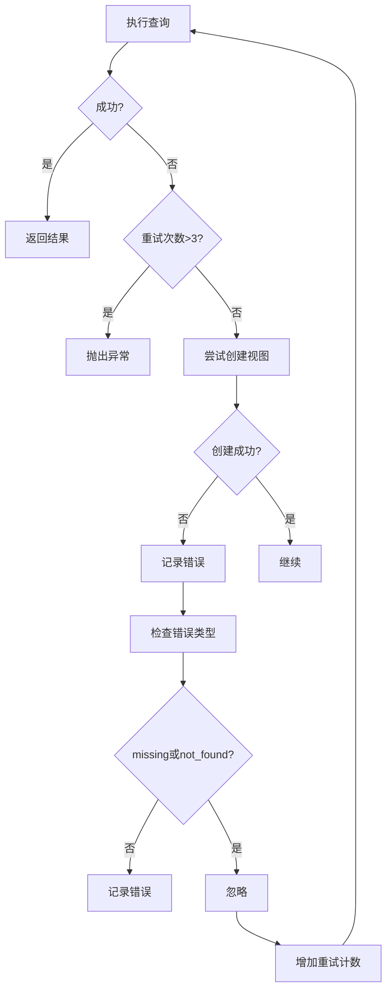

# 获取视图数据

<cite>
**本文档引用的文件**   
- [getGetViewData.ts](file://packages/data-storage-couchdb/lib/functions/getGetViewData.ts)
- [views.ts](file://packages/data-storage-couchdb/lib/views.ts)
- [useView.ts](file://App/app/data/hooks/useView.ts)
- [CouchDBData.ts](file://packages/data-storage-couchdb/lib/CouchDBData.ts)
- [StatisticsScreen.tsx](file://App/app/features/inventory/screens/StatisticsScreen.tsx)
- [ExpiredItemsScreen.tsx](file://App/app/features/inventory/screens/ExpiredItemsScreen.tsx)
- [LowOrOutOfStockItemsScreen.tsx](file://App/app/features/inventory/screens/LowOrOutOfStockItemsScreen.tsx)
- [DashboardScreen.tsx](file://App/app/features/inventory/screens/DashboardScreen.tsx)
</cite>

## 目录
1. [简介](#简介)
2. [核心功能](#核心功能)
3. [视图查询参数](#视图查询参数)
4. [预定义视图示例](#预定义视图示例)
5. [实际应用示例](#实际应用示例)
6. [视图索引与性能优化](#视图索引与性能优化)
7. [错误处理与重试机制](#错误处理与重试机制)
8. [最佳实践](#最佳实践)

## 简介

`getGetViewData`函数是库存管理系统中用于查询CouchDB视图的核心功能。该函数提供了一种高效、可靠的方式来查询预定义的视图，支持复杂的数据聚合和多维度查询。通过视图名称和查询参数，开发者可以轻松实现各种业务需求，如按类别统计物品、按状态筛选清单等。

该函数的设计充分考虑了移动应用的特殊需求，包括离线支持、性能优化和错误恢复机制。它与PouchDB和CouchDB的视图系统深度集成，确保了数据查询的一致性和可靠性。

**Section sources**
- [getGetViewData.ts](file://packages/data-storage-couchdb/lib/functions/getGetViewData.ts#L1-L126)

## 核心功能

`getGetViewData`函数的主要功能是查询CouchDB/PouchDB中的预定义视图。该函数接受数据库上下文和日志记录器作为参数，返回一个可复用的视图查询函数。

函数的核心特性包括：
- **类型安全**：使用TypeScript泛型确保视图名称和返回数据类型的正确性
- **自动视图创建**：在视图不存在时自动创建和维护视图索引
- **多数据库支持**：兼容PouchDB和CouchDB两种数据库类型
- **结果解析**：通过dataParser函数将原始查询结果转换为应用所需的格式

视图名称遵循特定的命名规范：`{VIEWS_PREFIX}_{viewName}_v{version}`，其中VIEWS_PREFIX定义为"01_inv_app"，确保了视图的唯一性和版本控制。

**Diagram sources **
- [getGetViewData.ts](file://packages/data-storage-couchdb/lib/functions/getGetViewData.ts#L24-L125)

**Section sources**
- [getGetViewData.ts](file://packages/data-storage-couchdb/lib/functions/getGetViewData.ts#L1-L126)
- [views.ts](file://packages/data-storage-couchdb/lib/views.ts#L3-L573)

## 视图查询参数

`getGetViewData`函数支持多种查询参数，以满足不同的查询需求。这些参数通过`GetViewDataOptions`类型定义，提供了完整的类型检查和文档支持。

### 查询参数说明

| 参数 | 类型 | 说明 |
|------|------|------|
| key | string \| string[] | 精确匹配指定键值的文档 |
| startKey | string \| string[] \| number | 查询范围的起始键值 |
| endKey | string \| string[] \| number | 查询范围的结束键值 |
| descending | boolean | 是否按降序排列结果 |
| includeDocs | boolean | 是否包含完整的文档数据 |

### 复合键查询

对于需要多维度查询的场景，系统支持复合键（数组形式的键值）。例如，在"out_of_stock_items"视图中，键值为`[doc.data.collection_id, doc._id]`，这允许按集合ID和文档ID进行联合查询。

### 范围查询示例

**Diagram sources **
- [getGetViewData.ts](file://packages/data-storage-couchdb/lib/functions/getGetViewData.ts#L5-L11)

**Section sources**
- [getGetViewData.ts](file://packages/data-storage-couchdb/lib/functions/getGetViewData.ts#L5-L11)

## 预定义视图示例

系统预定义了多个视图，涵盖了库存管理的各种业务场景。这些视图在`views.ts`文件中定义，每个视图都包含map函数、reduce函数（可选）和dataParser函数。

### 库存状态视图

**Diagram sources **
- [views.ts](file://packages/data-storage-couchdb/lib/views.ts#L41-L95)

### 过期物品视图

过期物品相关的视图包括"expired_items"和"expire_soon_items"，它们基于物品的过期日期进行查询。这些视图的map函数会检查物品的expiry_date或_expire_soon_at字段，并根据当前时间进行筛选。

### RFID相关视图

RFID相关的视图用于追踪RFID标签的状态，包括：
- rfid_untagged_items：未标记的物品
- rfid_tag_outdated_items：标签过期的物品
- 对应的计数视图（_count后缀）

### 数据聚合视图

"purchase_price_sums"视图是一个复杂的数据聚合示例，它按货币类型对采购价格进行求和。该视图的reduce函数实现了自定义的聚合逻辑，支持多货币的累加计算。

**Section sources**
- [views.ts](file://packages/data-storage-couchdb/lib/views.ts#L16-L573)

## 实际应用示例

### 仪表板数据统计

在`DashboardScreen.tsx`中，`getGetViewData`被用于获取各种统计数据，为用户提供实时的库存概览。

**Diagram sources **
- [DashboardScreen.tsx](file://App/app/features/inventory/screens/DashboardScreen.tsx#L46-L74)
- [getGetViewData.ts](file://packages/data-storage-couchdb/lib/functions/getGetViewData.ts#L30-L63)

### 过期物品管理

`ExpiredItemsScreen.tsx`使用两个视图来管理即将过期和已过期的物品：

1. **expired_items视图**：查询已过期的物品
2. **expire_soon_items视图**：查询即将过期的物品

查询时使用`startKey`参数和当前时间戳，结合`descending: true`实现按过期时间倒序排列。

### 低库存预警

`LowOrOutOfStockItemsScreen.tsx`结合使用了多个视图来提供全面的库存预警功能：

- out_of_stock_items：获取缺货物品列表
- low_stock_items：获取低库存物品列表
- 对应的计数视图：获取数量统计

这些视图的查询结果被整合到一个SectionList中，为用户提供清晰的库存状态视图。

**Section sources**
- [DashboardScreen.tsx](file://App/app/features/inventory/screens/DashboardScreen.tsx#L46-L74)
- [ExpiredItemsScreen.tsx](file://App/app/features/inventory/screens/ExpiredItemsScreen.tsx#L32-L52)
- [LowOrOutOfStockItemsScreen.tsx](file://App/app/features/inventory/screens/LowOrOutOfStockItemsScreen.tsx#L32-L48)

## 视图索引与性能优化

### 视图索引创建机制

`getGetViewData`函数内置了视图索引的自动创建和维护机制。当查询视图时，如果视图不存在，函数会自动创建相应的设计文档（_design文档）。

**Diagram sources **
- [getGetViewData.ts](file://packages/data-storage-couchdb/lib/functions/getGetViewData.ts#L68-L97)

### 性能优化策略

1. **指数退避重试**：最多重试3次，避免因临时错误导致查询失败
2. **缓存设计文档版本**：通过_rev字段确保设计文档的并发安全更新
3. **预计算聚合**：使用reduce函数在数据库层面完成数据聚合，减少传输数据量
4. **复合索引优化**：合理设计map函数的emit键值，支持高效的范围查询

### 索引管理

系统提供了开发者工具来管理和监控视图索引：
- PouchDBIndexesScreen：查看所有索引
- PouchDBIndexDetailScreen：查看索引详情
- DatabaseManagementScreen：重置数据库索引

**Section sources**
- [getGetViewData.ts](file://packages/data-storage-couchdb/lib/functions/getGetViewData.ts#L56-L125)
- [DatabaseManagementScreen.tsx](file://App/app/screens/DatabaseManagementScreen.tsx#L37-L75)

## 错误处理与重试机制

`getGetViewData`函数实现了健壮的错误处理机制，确保在各种异常情况下仍能提供可靠的服务。

### 错误处理流程

**Diagram sources **
- [getGetViewData.ts](file://packages/data-storage-couchdb/lib/functions/getGetViewData.ts#L58-L120)

### 错误类型处理

- **视图不存在**：自动创建视图并重试查询
- **网络错误**：记录错误但不中断流程，允许后续重试
- **其他错误**：记录详细错误信息，便于调试

**Section sources**
- [getGetViewData.ts](file://packages/data-storage-couchdb/lib/functions/getGetViewData.ts#L58-L125)

## 最佳实践

### 视图设计原则

1. **单一职责**：每个视图只负责一种查询需求
2. **版本控制**：通过version字段管理视图的变更
3. **性能考虑**：合理设计map函数的emit键值，避免全表扫描
4. **数据安全**：在dataParser中进行数据验证和清理

### 查询优化建议

1. **使用精确查询**：优先使用key参数而非startKey/endKey范围查询
2. **限制结果数量**：在不需要全部结果时设置合理的查询范围
3. **避免频繁重建**：合理设计视图结构，减少视图重建的需要
4. **监控索引大小**：定期检查视图索引的磁盘占用情况

### 开发者工具集成

利用系统提供的开发者工具可以有效监控和优化视图性能：
- 使用StatisticsScreen监控数据库和视图的大小
- 使用BenchmarkScreen测试查询性能
- 使用PouchDBIndexesScreen管理索引

**Section sources**
- [StatisticsScreen.tsx](file://App/app/features/inventory/screens/StatisticsScreen.tsx#L40-L74)
- [BenchmarkScreen.tsx](file://App/app/screens/dev-tools/BenchmarkScreen.tsx#L106-L181)