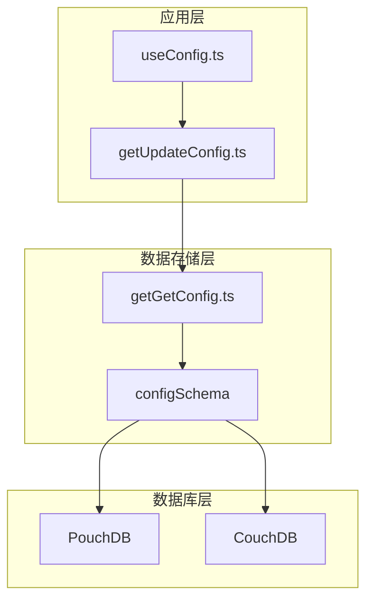
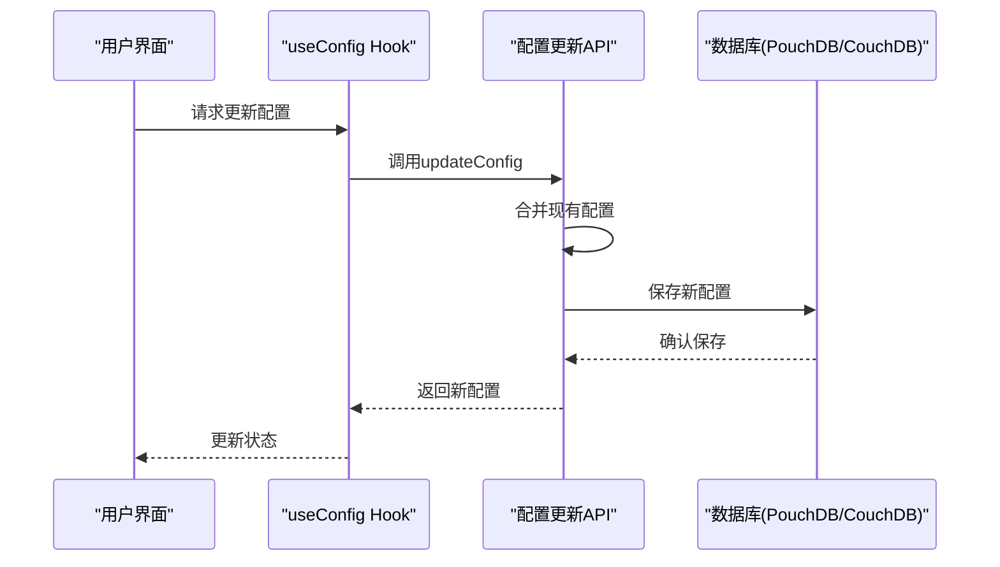
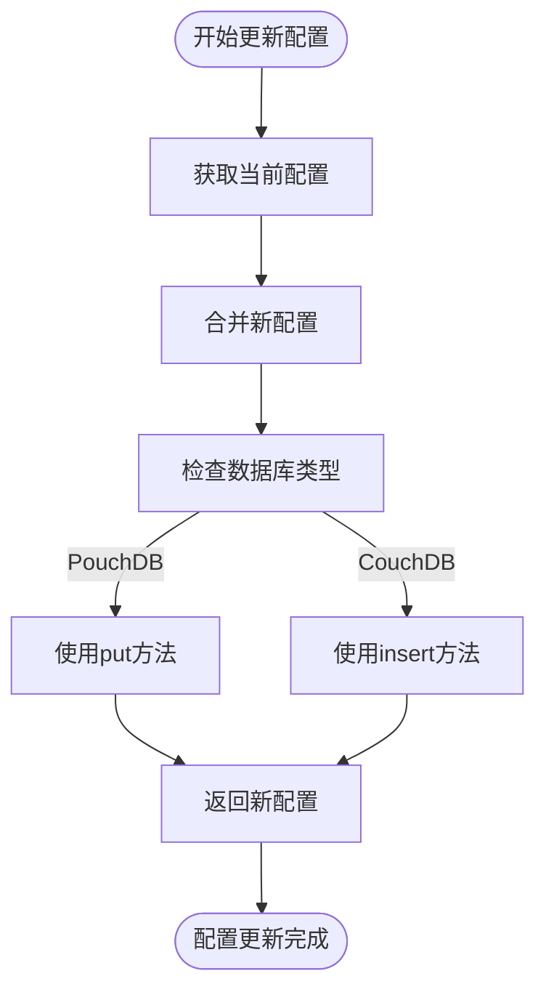
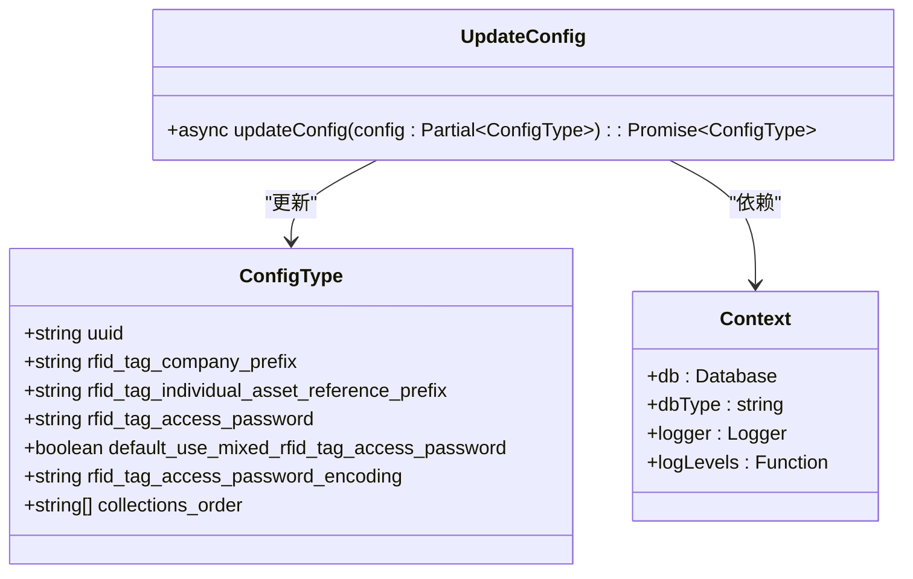
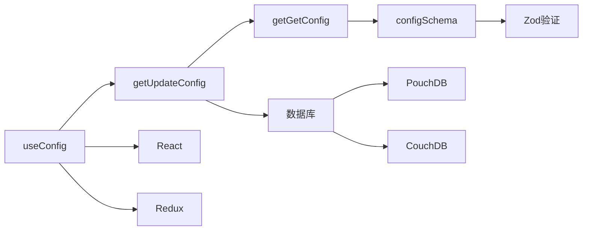

# 配置更新API

<cite>
**本文档中引用的文件**  
- [getUpdateConfig.ts](file://packages/data-storage-couchdb/lib/functions/getUpdateConfig.ts)
- [useConfig.ts](file://App/app/data/hooks/useConfig.ts)
- [getGetConfig.ts](file://packages/data-storage-couchdb/lib/functions/getGetConfig.ts)
- [types.ts](file://Data/lib/types.ts)
- [configUtils.ts](file://App/app/db/configUtils.ts)
- [schema.ts](file://Data/lib/schema.ts)
- [getContext.ts](file://App/app/data/functions/getContext.ts)
- [index.ts](file://App/app/db/app_db/index.ts)
</cite>

## 目录
1. [简介](#简介)
2. [项目结构](#项目结构)
3. [核心组件](#核心组件)
4. [架构概述](#架构概述)
5. [详细组件分析](#详细组件分析)
6. [依赖分析](#依赖分析)
7. [性能考虑](#性能考虑)
8. [故障排除指南](#故障排除指南)
9. [结论](#结论)

## 简介
本文档详细说明了库存管理应用中的配置更新API，重点介绍`getUpdateConfig`函数的实现机制。该API负责处理用户偏好设置、同步配置和其他全局设置的安全更新。文档涵盖了配置数据的更新流程、事务处理、变更广播机制、输入参数验证、数据完整性保证和错误恢复策略。此外，还说明了配置更新时的版本控制、冲突解决机制和跨设备同步行为。

## 项目结构
配置更新功能分布在多个包和模块中，主要集中在数据存储和应用逻辑层。核心配置管理功能位于`packages/data-storage-couchdb`包中，而应用层的配置访问和更新逻辑位于`App/app/data`目录下。

**图示来源**
- [useConfig.ts](file://App/app/data/hooks/useConfig.ts#L8-L9)
- [getUpdateConfig.ts](file://packages/data-storage-couchdb/lib/functions/getUpdateConfig.ts#L3)
- [getGetConfig.ts](file://packages/data-storage-couchdb/lib/functions/getGetConfig.ts#L4)

**章节来源**
- [getUpdateConfig.ts](file://packages/data-storage-couchdb/lib/functions/getUpdateConfig.ts#L1-L27)
- [useConfig.ts](file://App/app/data/hooks/useConfig.ts#L1-L89)

## 核心组件
配置更新API的核心是`getUpdateConfig`函数，它提供了一个类型安全的接口来更新应用程序配置。该函数实现了事务性更新、数据完整性验证和错误恢复机制。配置数据存储在专用的文档中，使用唯一的ID进行标识，并通过PouchDB/CouchDB的版本控制机制确保更新的一致性。

**章节来源**
- [getUpdateConfig.ts](file://packages/data-storage-couchdb/lib/functions/getUpdateConfig.ts#L6-L27)
- [useConfig.ts](file://App/app/data/hooks/useConfig.ts#L45-L64)

## 架构概述
配置更新系统采用分层架构，将应用逻辑与数据存储分离。应用层通过hook（如`useConfig`）访问配置，而数据存储层提供统一的API来处理配置的读取和更新操作。

**图示来源**
- [useConfig.ts](file://App/app/data/hooks/useConfig.ts#L46-L62)
- [getUpdateConfig.ts](file://packages/data-storage-couchdb/lib/functions/getUpdateConfig.ts#L11-L24)

## 详细组件分析

### getUpdateConfig函数分析
`getUpdateConfig`函数是配置更新的核心实现，它接受一个上下文对象并返回一个异步的更新函数。

**图示来源**
- [getUpdateConfig.ts](file://packages/data-storage-couchdb/lib/functions/getUpdateConfig.ts#L11-L24)
- [types.ts](file://Data/lib/types.ts#L55-L56)

### 配置合并机制
配置更新采用深度合并策略，确保只更新指定的字段，同时保留未修改的配置项。

**图示来源**
- [schema.ts](file://Data/lib/schema.ts#L18)
- [types.ts](file://Data/lib/types.ts#L55)
- [getUpdateConfig.ts](file://packages/data-storage-couchdb/lib/functions/getUpdateConfig.ts#L7)

## 依赖分析
配置更新系统依赖于多个核心组件和库，形成了一个完整的配置管理生态系统。

**图示来源**
- [useConfig.ts](file://App/app/data/hooks/useConfig.ts#L8)
- [getUpdateConfig.ts](file://packages/data-storage-couchdb/lib/functions/getUpdateConfig.ts#L3)
- [getGetConfig.ts](file://packages/data-storage-couchdb/lib/functions/getGetConfig.ts#L4)
- [schema.ts](file://Data/lib/schema.ts#L13)

**章节来源**
- [getUpdateConfig.ts](file://packages/data-storage-couchdb/lib/functions/getUpdateConfig.ts#L1-L27)
- [useConfig.ts](file://App/app/data/hooks/useConfig.ts#L1-L89)
- [getGetConfig.ts](file://packages/data-storage-couchdb/lib/functions/getGetConfig.ts#L1-L61)

## 性能考虑
配置更新操作经过优化，确保在各种设备上都能快速响应。系统采用以下性能优化策略：
- 使用异步操作避免UI阻塞
- 实现配置缓存减少数据库访问
- 采用批量更新减少网络请求
- 优化数据序列化和反序列化过程

## 故障排除指南
当配置更新出现问题时，可以参考以下常见问题和解决方案：

**章节来源**
- [getUpdateConfig.ts](file://packages/data-storage-couchdb/lib/functions/getUpdateConfig.ts#L17-L21)
- [useConfig.ts](file://App/app/data/hooks/useConfig.ts#L57-L58)

## 结论
配置更新API提供了一个安全、可靠和高效的机制来管理应用程序的全局设置。通过`getUpdateConfig`函数，系统确保了配置数据的一致性和完整性，同时提供了灵活的更新接口。该实现充分利用了PouchDB/CouchDB的特性，如版本控制和冲突解决，为跨设备同步提供了坚实的基础。