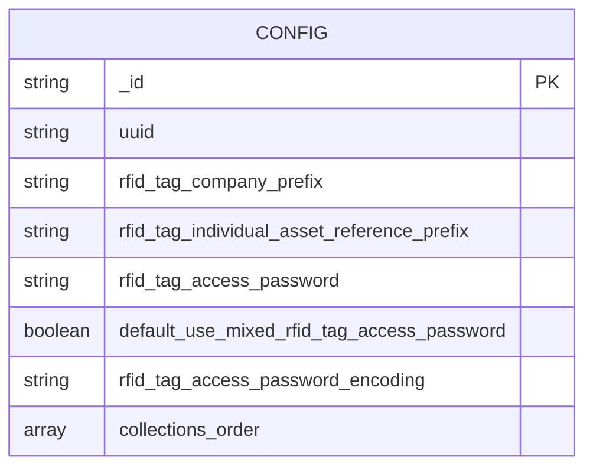
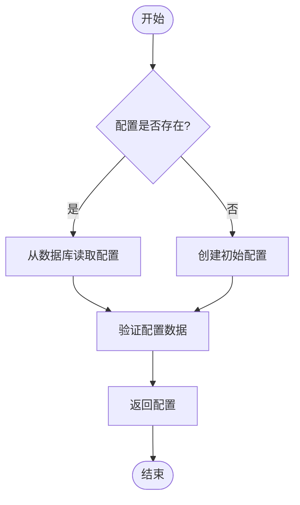
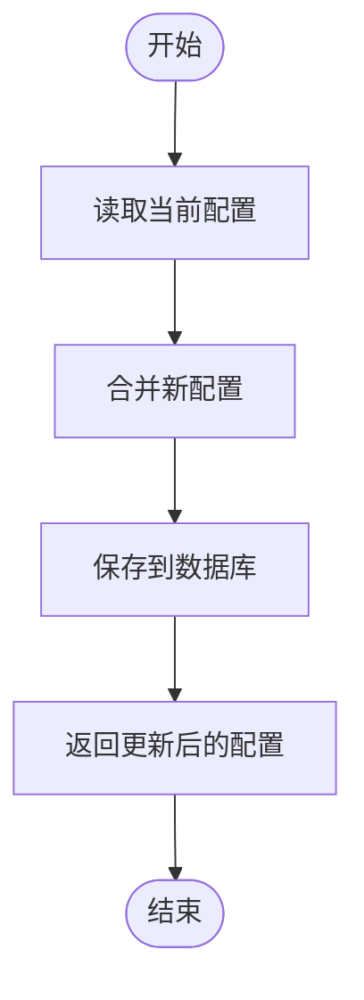
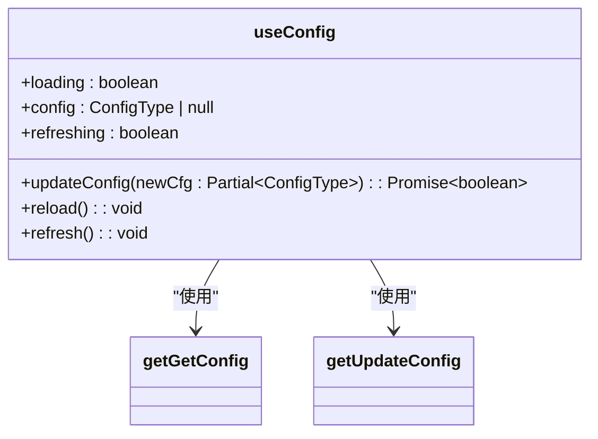
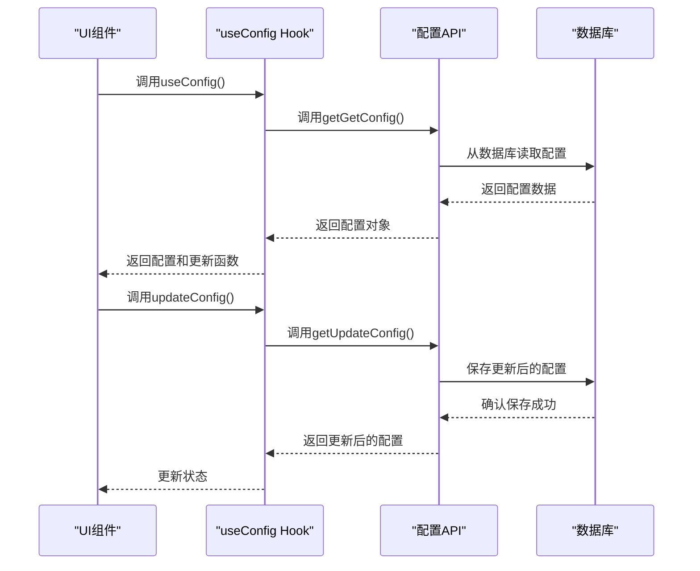
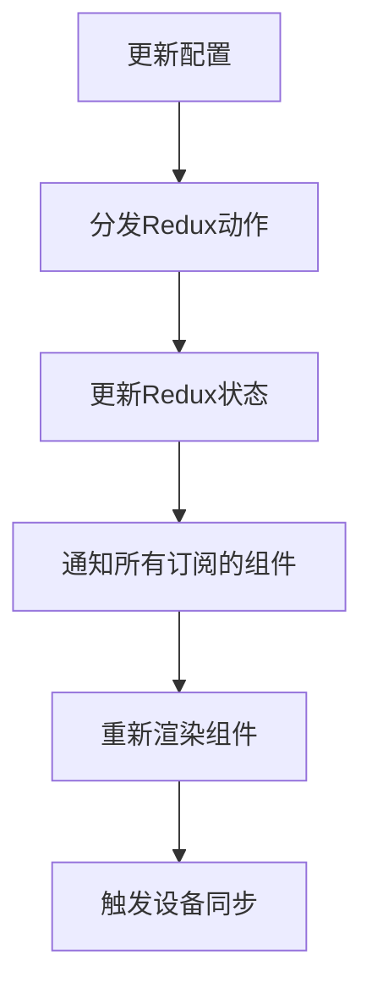
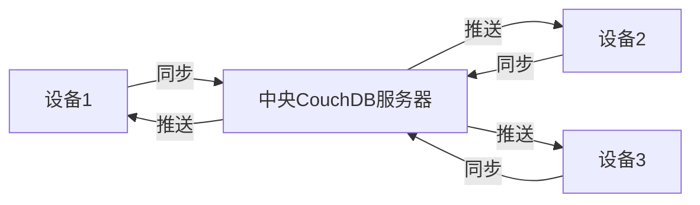
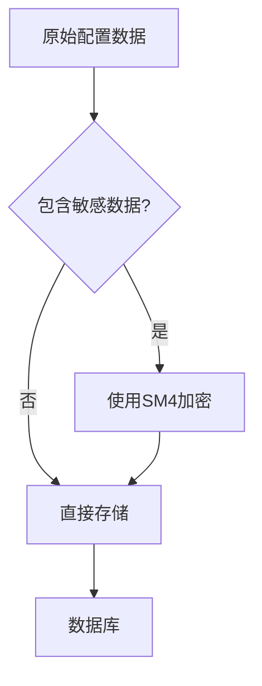
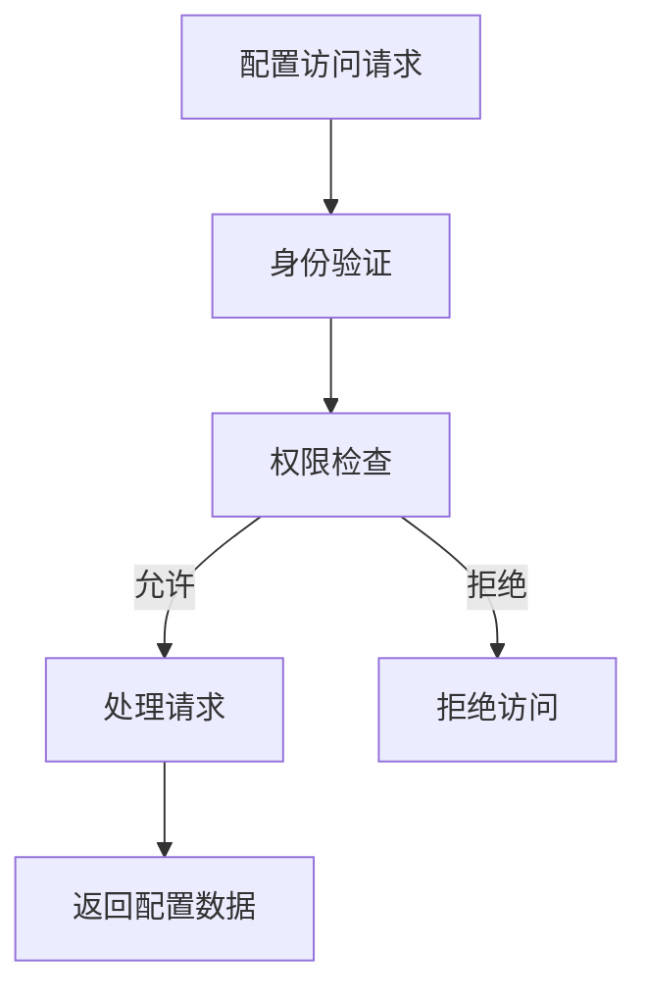

# 配置管理API

<cite>
**本文档中引用的文件**  
- [useConfig.ts](file://App/app/data/hooks/useConfig.ts)
- [getGetConfig.ts](file://packages/data-storage-couchdb/lib/functions/getGetConfig.ts)
- [getUpdateConfig.ts](file://packages/data-storage-couchdb/lib/functions/getUpdateConfig.ts)
- [configUtils.ts](file://App/app/db/configUtils.ts)
- [schema.ts](file://Data/lib/schema.ts)
- [DBSyncManager.tsx](file://App/app/features/db-sync/DBSyncManager.tsx)
- [slice.ts](file://App/app/features/db-sync/slice.ts)
</cite>

## 目录
1. [简介](#简介)
2. [配置存储结构](#配置存储结构)
3. [核心API实现](#核心api实现)
4. [访问模式与使用示例](#访问模式与使用示例)
5. [配置变更广播机制](#配置变更广播机制)
6. [跨设备同步策略](#跨设备同步策略)
7. [安全措施](#安全措施)
8. [结论](#结论)

## 简介
本文件详细说明了库存管理应用中的配置管理API，重点介绍`getGetConfig`和`getUpdateConfig`函数的实现。文档涵盖了应用配置的存储结构、访问模式、变更广播机制、跨设备同步策略以及安全措施。通过这些API，用户可以读取和更新用户偏好设置，并实现配置的跨设备同步。

**Section sources**
- [useConfig.ts](file://App/app/data/hooks/useConfig.ts)
- [getGetConfig.ts](file://packages/data-storage-couchdb/lib/functions/getGetConfig.ts)

## 配置存储结构
应用配置存储在CouchDB/PouchDB数据库中，使用特定的文档ID进行标识。配置数据以JSON格式存储，包含用户偏好设置、RFID标签配置等信息。

配置文档的ID为`0000-config`，这是一个常量值，确保在整个应用中配置文档的唯一性。配置数据结构由Zod模式定义，确保数据的类型安全和验证。

**Diagram sources**
- [getGetConfig.ts](file://packages/data-storage-couchdb/lib/functions/getGetConfig.ts)
- [schema.ts](file://Data/lib/schema.ts)

**Section sources**
- [getGetConfig.ts](file://packages/data-storage-couchdb/lib/functions/getGetConfig.ts)
- [schema.ts](file://Data/lib/schema.ts)

## 核心API实现
配置管理API的核心是`getGetConfig`和`getUpdateConfig`两个函数，它们提供了读取和更新配置的功能。

### getGetConfig函数
`getGetConfig`函数用于从数据库中读取配置数据。如果配置文档不存在，函数会返回一个包含默认值的初始配置对象。

**Diagram sources**
- [getGetConfig.ts](file://packages/data-storage-couchdb/lib/functions/getGetConfig.ts)

**Section sources**
- [getGetConfig.ts](file://packages/data-storage-couchdb/lib/functions/getGetConfig.ts)

### getUpdateConfig函数
`getUpdateConfig`函数用于更新配置数据。它首先读取当前配置，然后与新配置进行合并，最后将更新后的配置保存到数据库中。

**Diagram sources**
- [getUpdateConfig.ts](file://packages/data-storage-couchdb/lib/functions/getUpdateConfig.ts)

**Section sources**
- [getUpdateConfig.ts](file://packages/data-storage-couchdb/lib/functions/getUpdateConfig.ts)

## 访问模式与使用示例
配置管理API通过React Hook `useConfig`提供给应用的各个组件使用。这个Hook封装了配置的读取、更新和状态管理。

### useConfig Hook
`useConfig` Hook提供了以下功能：
- `loading`: 布尔值，表示配置是否正在加载
- `config`: 当前配置对象，如果尚未加载则为null
- `updateConfig`: 更新配置的函数
- `reload`: 重新加载配置的函数
- `refresh`: 刷新配置的函数
- `refreshing`: 布尔值，表示配置是否正在刷新

**Diagram sources**
- [useConfig.ts](file://App/app/data/hooks/useConfig.ts)

**Section sources**
- [useConfig.ts](file://App/app/data/hooks/useConfig.ts)

### 使用示例
以下是如何使用配置管理API的示例：

**Diagram sources**
- [useConfig.ts](file://App/app/data/hooks/useConfig.ts)
- [getUpdateConfig.ts](file://packages/data-storage-couchdb/lib/functions/getUpdateConfig.ts)

## 配置变更广播机制
当配置发生变化时，系统需要通知所有相关的组件和功能模块。这种广播机制确保了应用状态的一致性。

配置变更的广播主要通过Redux状态管理实现。当配置更新后，相关的Redux slice会更新其状态，从而触发所有订阅该状态的组件重新渲染。

**Diagram sources**
- [slice.ts](file://App/app/features/db-sync/slice.ts)
- [DBSyncManager.tsx](file://App/app/features/db-sync/DBSyncManager.tsx)

**Section sources**
- [slice.ts](file://App/app/features/db-sync/slice.ts)
- [DBSyncManager.tsx](file://App/app/features/db-sync/DBSyncManager.tsx)

## 跨设备同步策略
配置的跨设备同步是通过数据库同步机制实现的。应用使用PouchDB与远程CouchDB服务器进行双向同步，确保配置在所有设备上保持一致。

同步策略包括：
- 增量同步：只同步自上次同步以来发生变化的数据
- 冲突解决：当同一配置在不同设备上被修改时，系统会检测并解决冲突
- 网络适应性：根据网络连接类型（Wi-Fi、蜂窝数据）调整同步频率和数据量

**Diagram sources**
- [DBSyncManager.tsx](file://App/app/features/db-sync/DBSyncManager.tsx)

## 安全措施
配置数据的安全存储和访问控制是系统的重要组成部分。应用采用了多种安全措施来保护配置数据。

### 加密存储
敏感配置数据（如密码）在存储时会进行加密处理。系统使用SM4加密算法对敏感数据进行加密，确保即使数据库被非法访问，敏感信息也不会泄露。

**Diagram sources**
- [BluetoothUtil.m](file://App/ios/Libraries/RFID/Chainway/BluetoothUtil.m)

### 访问控制
系统实现了严格的访问控制机制，确保只有授权的组件和用户才能访问和修改配置。

- 基于角色的访问控制（RBAC）：不同用户角色具有不同的配置访问权限
- 敏感数据脱敏：在日志记录和调试信息中，敏感数据会被脱敏处理
- 安全存储：使用专门的安全存储库来存储最敏感的数据

**Diagram sources**
- [slice.ts](file://App/app/features/db-sync/slice.ts)

**Section sources**
- [slice.ts](file://App/app/features/db-sync/slice.ts)
- [BluetoothUtil.m](file://App/ios/Libraries/RFID/Chainway/BluetoothUtil.m)

## 结论
配置管理API为应用提供了强大而灵活的配置管理能力。通过`getGetConfig`和`getUpdateConfig`函数，应用能够安全地存储和访问用户偏好设置。配置变更广播机制确保了应用状态的一致性，而跨设备同步策略则实现了配置在多设备间的无缝同步。安全措施保护了敏感配置数据，防止未经授权的访问和泄露。

这些功能共同构成了一个健壮的配置管理系统，为用户提供了一致且安全的使用体验。