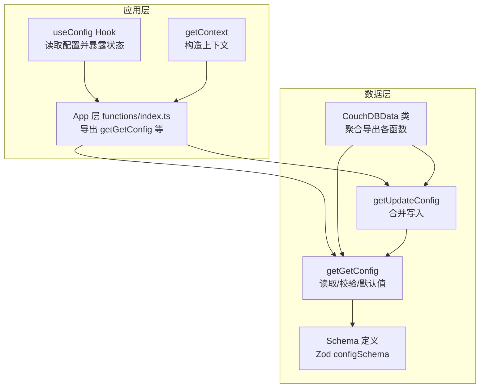
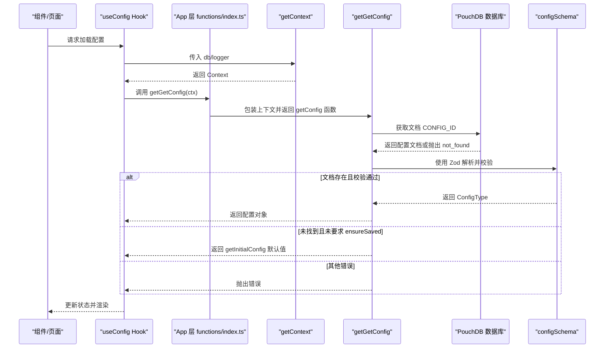
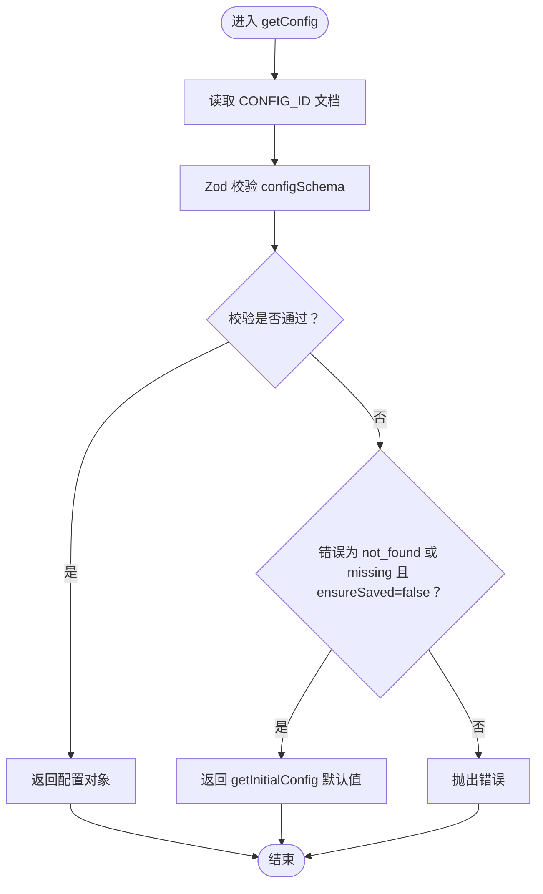
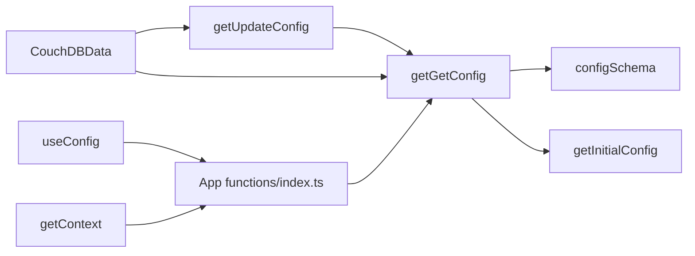

# 配置读取API

<cite>
**本文引用的文件**
- [packages/data-storage-couchdb/lib/functions/getGetConfig.ts](file://packages/data-storage-couchdb/lib/functions/getGetConfig.ts)
- [packages/data-storage-couchdb/lib/CouchDBData.ts](file://packages/data-storage-couchdb/lib/CouchDBData.ts)
- [packages/data-storage-couchdb/lib/functions/getUpdateConfig.ts](file://packages/data-storage-couchdb/lib/functions/getUpdateConfig.ts)
- [packages/data-storage-couchdb/lib/index.ts](file://packages/data-storage-couchdb/lib/index.ts)
- [App/app/data/functions/index.ts](file://App/app/data/functions/index.ts)
- [App/app/data/functions/getContext.ts](file://App/app/data/functions/getContext.ts)
- [App/app/data/hooks/useConfig.ts](file://App/app/data/hooks/useConfig.ts)
- [Data/lib/types.ts](file://Data/lib/types.ts)
- [Data/lib/schema.ts](file://Data/lib/schema.ts)
- [Data/lib/generated-schema.ts](file://Data/lib/generated-schema.ts)
- [Data/lib/mock-data/mock-config.ts](file://Data/lib/mock-data/mock-config.ts)
- [App/app/db/configUtils.ts](file://App/app/db/configUtils.ts)
</cite>

## 目录
1. [简介](#简介)
2. [项目结构](#项目结构)
3. [核心组件](#核心组件)
4. [架构总览](#架构总览)
5. [详细组件分析](#详细组件分析)
6. [依赖关系分析](#依赖关系分析)
7. [性能考量](#性能考量)
8. [故障排查指南](#故障排查指南)
9. [结论](#结论)
10. [附录](#附录)

## 简介
本文件系统性文档化“配置读取API”的实现与使用方式，重点围绕 getGetConfig 函数的实现机制展开，涵盖：
- 配置数据的获取流程与调用链路
- 缓存策略与默认值处理逻辑
- 返回数据结构、错误处理与异常情况
- 数据验证流程（Zod Schema）
- 性能优化建议与最佳实践
- 在应用中安全读取用户偏好设置、同步配置与全局设置的实际使用方法

## 项目结构
该能力由两部分协作完成：
- 数据层（packages/data-storage-couchdb）：提供 getGetConfig、getUpdateConfig 等函数，负责从数据库读取/合并配置，并进行数据校验与默认值回退。
- 应用层（App/app）：通过 useConfig Hook 将配置读取集成到 React 组件生命周期中；通过 getContext 包装上下文参数，统一透传给数据层。

图表来源
- [App/app/data/hooks/useConfig.ts](file://App/app/data/hooks/useConfig.ts#L1-L90)
- [App/app/data/functions/index.ts](file://App/app/data/functions/index.ts#L1-L103)
- [App/app/data/functions/getContext.ts](file://App/app/data/functions/getContext.ts#L1-L21)
- [packages/data-storage-couchdb/lib/functions/getGetConfig.ts](file://packages/data-storage-couchdb/lib/functions/getGetConfig.ts#L1-L61)
- [packages/data-storage-couchdb/lib/functions/getUpdateConfig.ts](file://packages/data-storage-couchdb/lib/functions/getUpdateConfig.ts#L1-L27)
- [packages/data-storage-couchdb/lib/CouchDBData.ts](file://packages/data-storage-couchdb/lib/CouchDBData.ts#L1-L97)
- [Data/lib/schema.ts](file://Data/lib/schema.ts#L1-L100)
- [Data/lib/generated-schema.ts](file://Data/lib/generated-schema.ts#L1-L133)

章节来源
- [App/app/data/hooks/useConfig.ts](file://App/app/data/hooks/useConfig.ts#L1-L90)
- [App/app/data/functions/index.ts](file://App/app/data/functions/index.ts#L1-L103)
- [App/app/data/functions/getContext.ts](file://App/app/data/functions/getContext.ts#L1-L21)
- [packages/data-storage-couchdb/lib/functions/getGetConfig.ts](file://packages/data-storage-couchdb/lib/functions/getGetConfig.ts#L1-L61)
- [packages/data-storage-couchdb/lib/functions/getUpdateConfig.ts](file://packages/data-storage-couchdb/lib/functions/getUpdateConfig.ts#L1-L27)
- [packages/data-storage-couchdb/lib/CouchDBData.ts](file://packages/data-storage-couchdb/lib/CouchDBData.ts#L1-L97)
- [Data/lib/schema.ts](file://Data/lib/schema.ts#L1-L100)
- [Data/lib/generated-schema.ts](file://Data/lib/generated-schema.ts#L1-L133)

## 核心组件
- getGetConfig：从数据库读取配置文档，使用 Zod Schema 进行严格校验；若未找到且未要求“已保存”，则返回初始默认配置。
- getUpdateConfig：基于当前配置与新配置合并后写入数据库，支持 PouchDB 的 put 或其他数据库类型的 insert。
- useConfig Hook：在组件聚焦时加载配置，提供更新与刷新能力，并处理错误日志。
- getContext：将 PouchDB 实例与日志级别等上下文参数封装为数据层可消费的 Context。
- CouchDBData 类：集中导出 getGetConfig、getUpdateConfig 等函数，便于上层统一注入。

章节来源
- [packages/data-storage-couchdb/lib/functions/getGetConfig.ts](file://packages/data-storage-couchdb/lib/functions/getGetConfig.ts#L1-L61)
- [packages/data-storage-couchdb/lib/functions/getUpdateConfig.ts](file://packages/data-storage-couchdb/lib/functions/getUpdateConfig.ts#L1-L27)
- [App/app/data/hooks/useConfig.ts](file://App/app/data/hooks/useConfig.ts#L1-L90)
- [App/app/data/functions/getContext.ts](file://App/app/data/functions/getContext.ts#L1-L21)
- [packages/data-storage-couchdb/lib/CouchDBData.ts](file://packages/data-storage-couchdb/lib/CouchDBData.ts#L1-L97)

## 架构总览
下图展示了从应用层到数据层的调用路径与职责划分：

图表来源
- [App/app/data/hooks/useConfig.ts](file://App/app/data/hooks/useConfig.ts#L1-L90)
- [App/app/data/functions/index.ts](file://App/app/data/functions/index.ts#L1-L103)
- [App/app/data/functions/getContext.ts](file://App/app/data/functions/getContext.ts#L1-L21)
- [packages/data-storage-couchdb/lib/functions/getGetConfig.ts](file://packages/data-storage-couchdb/lib/functions/getGetConfig.ts#L1-L61)
- [Data/lib/generated-schema.ts](file://Data/lib/generated-schema.ts#L1-L133)

## 详细组件分析

### getGetConfig 实现机制
- 输入参数：Context（包含 db、dbType、logger、logLevels），以及 getConfig 的可选参数 { ensureSaved }。
- 数据访问：根据 dbType 选择 db.get，统一读取固定文档 ID CONFIG_ID。
- 数据解析：使用 configSchema 对文档进行 Zod 校验，确保字段类型与格式符合预期。
- 默认值策略：
  - 若捕获到“未找到”或“missing”错误，且 ensureSaved 为 false，则返回 getInitialConfig 生成的默认配置。
  - 否则抛出错误，避免静默失败。
- 返回值：ConfigType（强类型配置对象）。

图表来源
- [packages/data-storage-couchdb/lib/functions/getGetConfig.ts](file://packages/data-storage-couchdb/lib/functions/getGetConfig.ts#L1-L61)
- [Data/lib/generated-schema.ts](file://Data/lib/generated-schema.ts#L1-L133)

章节来源
- [packages/data-storage-couchdb/lib/functions/getGetConfig.ts](file://packages/data-storage-couchdb/lib/functions/getGetConfig.ts#L1-L61)
- [Data/lib/types.ts](file://Data/lib/types.ts#L50-L54)
- [Data/lib/generated-schema.ts](file://Data/lib/generated-schema.ts#L1-L133)

### 默认值与初始配置
- getInitialConfig 会生成一个包含关键字段的默认配置对象，用于首次启动或缺失配置时的兜底。
- CouchDBData 类在构造时即绑定 getConfig，保证上层可直接通过 this.getConfig 使用。

章节来源
- [packages/data-storage-couchdb/lib/functions/getGetConfig.ts](file://packages/data-storage-couchdb/lib/functions/getGetConfig.ts#L1-L61)
- [packages/data-storage-couchdb/lib/CouchDBData.ts](file://packages/data-storage-couchdb/lib/CouchDBData.ts#L1-L97)

### 配置更新与合并写入
- getUpdateConfig 基于当前配置与传入的新配置进行合并，再写入数据库。
- 写入方式依据 dbType 选择 put 或 insert，确保兼容不同后端存储。

章节来源
- [packages/data-storage-couchdb/lib/functions/getUpdateConfig.ts](file://packages/data-storage-couchdb/lib/functions/getUpdateConfig.ts#L1-L27)

### 应用层集成：useConfig Hook
- 在组件聚焦时自动加载配置，避免重复请求。
- 提供 updateConfig 与 refresh 方法，支持局部更新与手动刷新。
- 统一错误处理，记录日志并可弹窗提示。

章节来源
- [App/app/data/hooks/useConfig.ts](file://App/app/data/hooks/useConfig.ts#L1-L90)

### 上下文与导出
- getContext 将 db 与日志级别等参数封装为 Context，供数据层函数使用。
- App 层 functions/index.ts 将数据层导出的 getGetConfig 包装后提供给应用层调用，保持接口一致性。

章节来源
- [App/app/data/functions/getContext.ts](file://App/app/data/functions/getContext.ts#L1-L21)
- [App/app/data/functions/index.ts](file://App/app/data/functions/index.ts#L1-L103)
- [packages/data-storage-couchdb/lib/index.ts](file://packages/data-storage-couchdb/lib/index.ts#L1-L40)

### 数据模型与验证
- configSchema 定义了配置对象的字段类型、必填/可选、正则约束等，确保配置数据的一致性与安全性。
- schema.ts 通过 generated-schema.ts 导出 configSchema 并暴露 ConfigType 类型。

章节来源
- [Data/lib/generated-schema.ts](file://Data/lib/generated-schema.ts#L1-L133)
- [Data/lib/schema.ts](file://Data/lib/schema.ts#L1-L100)
- [Data/lib/types.ts](file://Data/lib/types.ts#L50-L54)

### 兼容与迁移：旧版配置读取
- App/app/db/configUtils.ts 提供了旧版配置读取逻辑，采用默认配置与数据库返回的合并策略，作为历史兼容方案。

章节来源
- [App/app/db/configUtils.ts](file://App/app/db/configUtils.ts#L1-L29)

## 依赖关系分析
- getGetConfig 依赖：
  - Context（db、dbType、logger、logLevels）
  - configSchema（Zod 校验）
  - getInitialConfig（默认值）
- getUpdateConfig 依赖：
  - getGetConfig（读取当前配置）
  - CONFIG_ID（固定文档 ID）
- useConfig 依赖：
  - App 层 functions/index.ts（包装后的 getGetConfig）
  - 日志工具（统一记录错误）

图表来源
- [packages/data-storage-couchdb/lib/functions/getGetConfig.ts](file://packages/data-storage-couchdb/lib/functions/getGetConfig.ts#L1-L61)
- [packages/data-storage-couchdb/lib/functions/getUpdateConfig.ts](file://packages/data-storage-couchdb/lib/functions/getUpdateConfig.ts#L1-L27)
- [packages/data-storage-couchdb/lib/CouchDBData.ts](file://packages/data-storage-couchdb/lib/CouchDBData.ts#L1-L97)
- [App/app/data/hooks/useConfig.ts](file://App/app/data/hooks/useConfig.ts#L1-L90)
- [App/app/data/functions/index.ts](file://App/app/data/functions/index.ts#L1-L103)
- [App/app/data/functions/getContext.ts](file://App/app/data/functions/getContext.ts#L1-L21)

## 性能考量
- 单次读取：getGetConfig 每次调用都会触发一次数据库读取与 Zod 校验，建议在组件内缓存结果并在需要时显式刷新。
- 批量更新：getUpdateConfig 会先读取当前配置再合并写入，避免覆盖未变更字段。
- 错误快速失败：当文档不存在且未要求 ensureSaved 时立即返回默认值，减少不必要的重试与等待。
- 日志开销：Context 中包含 logger 与 logLevels，可在调试阶段开启更详细的日志，生产环境建议降低日志级别以减少开销。

[本节为通用性能建议，不直接分析具体文件]

## 故障排查指南
常见问题与处理建议：
- 数据库未就绪：useConfig 在 db 为空时会抛出错误，请确保在数据库初始化完成后才调用 getConfig。
- 文档缺失：当 CONFIG_ID 对应文档不存在且未设置 ensureSaved 时，将返回默认配置；如需强制要求已保存配置，请设置 ensureSaved=true。
- 校验失败：Zod 校验失败会抛出错误，检查配置字段类型与格式是否符合 configSchema 定义。
- 写入冲突：getUpdateConfig 使用 db.put 或 db.insert，若出现冲突请检查 dbType 与文档版本。

章节来源
- [App/app/data/hooks/useConfig.ts](file://App/app/data/hooks/useConfig.ts#L1-L90)
- [packages/data-storage-couchdb/lib/functions/getGetConfig.ts](file://packages/data-storage-couchdb/lib/functions/getGetConfig.ts#L1-L61)
- [Data/lib/generated-schema.ts](file://Data/lib/generated-schema.ts#L1-L133)

## 结论
getGetConfig 通过严格的 Zod 校验与合理的默认值策略，确保配置读取的可靠性与一致性。结合 useConfig Hook 与 getContext，应用层可以安全、高效地在组件生命周期中管理全局配置。建议在高频读取场景中配合本地缓存与按需刷新，以进一步提升用户体验与性能。

[本节为总结性内容，不直接分析具体文件]

## 附录

### API 定义与返回数据结构
- 函数签名与参数
  - getGetConfig(context): 返回 getConfig 函数
  - getConfig(options?): 返回 Promise<ConfigType>
    - options.ensureSaved: 是否禁止使用默认配置（true 时未找到文档将抛错）
- 返回数据结构
  - ConfigType：由 configSchema 生成的强类型配置对象，包含字段如 uuid、rfid_tag_*、collections_order 等。
- 错误处理
  - 文档不存在且未设置 ensureSaved：返回默认配置
  - 其他错误：抛出错误，包含错误消息

章节来源
- [Data/lib/types.ts](file://Data/lib/types.ts#L50-L54)
- [Data/lib/generated-schema.ts](file://Data/lib/generated-schema.ts#L1-L133)
- [packages/data-storage-couchdb/lib/functions/getGetConfig.ts](file://packages/data-storage-couchdb/lib/functions/getGetConfig.ts#L1-L61)

### 实际使用示例（路径指引）
- 在组件中读取配置
  - 参考路径：[App/app/data/hooks/useConfig.ts](file://App/app/data/hooks/useConfig.ts#L1-L90)
  - 关键点：在聚焦时调用 getGetConfig({ db, logger })()，设置状态并处理错误
- 在应用层封装与导出
  - 参考路径：[App/app/data/functions/index.ts](file://App/app/data/functions/index.ts#L1-L103)
  - 关键点：通过 getContext 构造 Context，再调用数据层 getGetConfig
- 更新配置
  - 参考路径：[packages/data-storage-couchdb/lib/functions/getUpdateConfig.ts](file://packages/data-storage-couchdb/lib/functions/getUpdateConfig.ts#L1-L27)
  - 关键点：合并当前配置与新配置后写入数据库
- 旧版兼容读取
  - 参考路径：[App/app/db/configUtils.ts](file://App/app/db/configUtils.ts#L1-L29)
  - 关键点：默认配置与数据库返回合并，作为历史兼容方案

### 数据验证流程
- 读取 CONFIG_ID 文档
- 使用 configSchema.parse 对文档进行严格校验
- 校验失败时抛出错误；成功则返回 ConfigType

章节来源
- [packages/data-storage-couchdb/lib/functions/getGetConfig.ts](file://packages/data-storage-couchdb/lib/functions/getGetConfig.ts#L1-L61)
- [Data/lib/generated-schema.ts](file://Data/lib/generated-schema.ts#L1-L133)

### 默认值处理逻辑
- 当捕获到 not_found 或 missing 且 ensureSaved=false 时，返回 getInitialConfig
- 否则抛出错误，避免静默失败

章节来源
- [packages/data-storage-couchdb/lib/functions/getGetConfig.ts](file://packages/data-storage-couchdb/lib/functions/getGetConfig.ts#L1-L61)

### Mock 配置（测试/演示）
- 参考路径：[Data/lib/mock-data/mock-config.ts](file://Data/lib/mock-data/mock-config.ts#L1-L14)
- 作用：提供静态配置对象与 GetConfig 实现，便于测试与演示

章节来源
- [Data/lib/mock-data/mock-config.ts](file://Data/lib/mock-data/mock-config.ts#L1-L14)