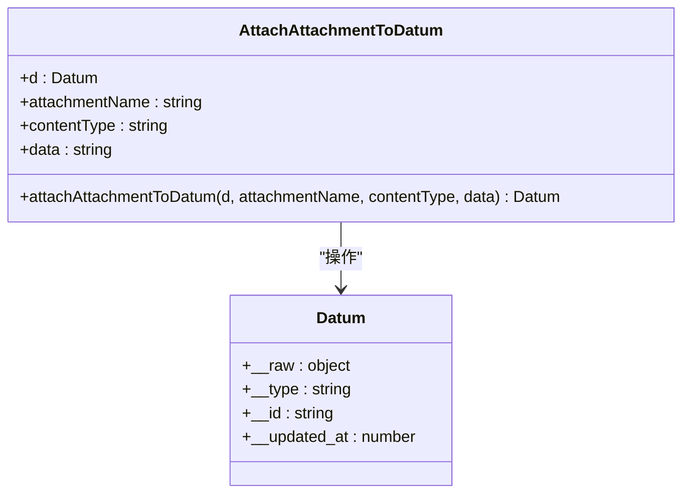
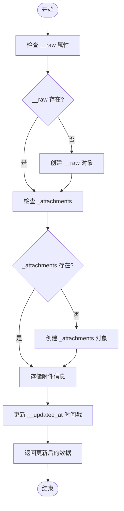
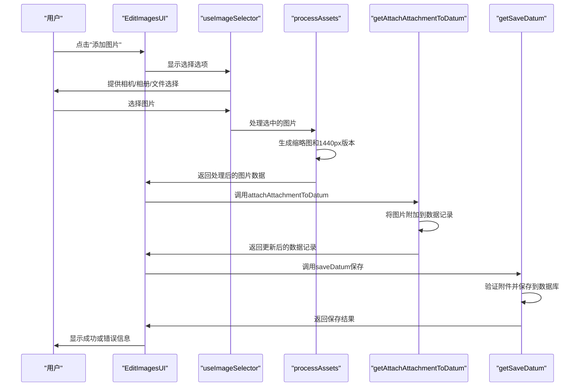
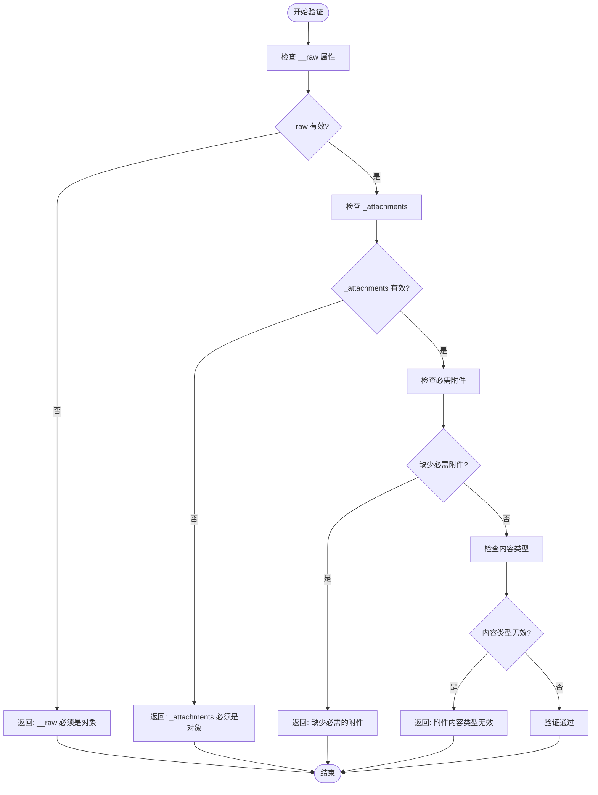
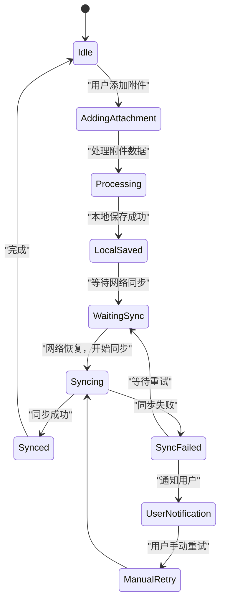
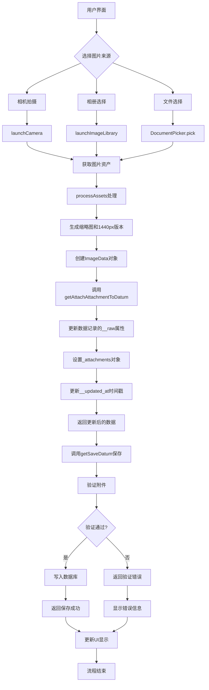

# 附件上传

<cite>
**本文档引用的文件**
- [getAttachAttachmentToDatum.ts](file://packages/data-storage-couchdb/lib/functions/getAttachAttachmentToDatum.ts)
- [attachments.ts](file://Data/lib/attachments.ts)
- [CouchDBData.ts](file://packages/data-storage-couchdb/lib/CouchDBData.ts)
- [EditImagesUI.tsx](file://App/app/features/inventory/components/EditImagesUI.tsx)
- [useImageSelector.ts](file://App/app/data/images/useImageSelector.ts)
- [getSaveDatum.ts](file://packages/data-storage-couchdb/lib/functions/getSaveDatum.ts)
- [getGetAttachmentFromDatum.ts](file://packages/data-storage-couchdb/lib/functions/getGetAttachmentFromDatum.ts)
- [getGetAttachmentInfoFromDatum.ts](file://packages/data-storage-couchdb/lib/functions/getGetAttachmentInfoFromDatum.ts)
- [getGetAllAttachmentInfoFromDatum.ts](file://packages/data-storage-couchdb/lib/functions/getGetAllAttachmentInfoFromDatum.ts)
</cite>

## 目录
1. [简介](#简介)
2. [核心功能实现](#核心功能实现)
3. [附件上传API详解](#附件上传api详解)
4. [文件格式与大小限制](#文件格式与大小限制)
5. [库存系统图片附件示例](#库存系统图片附件示例)
6. [错误处理机制](#错误处理机制)
7. [事务完整性与网络恢复](#事务完整性与网络恢复)
8. [API调用流程图](#api调用流程图)

## 简介
本文档详细描述了库存管理系统中附件上传功能的实现，重点介绍`getAttachAttachmentToDatum`函数的使用方法。该功能允许用户将图片、文档等二进制文件附加到数据记录上，为库存物品添加视觉信息。文档涵盖了请求参数、支持的文件格式、大小限制、MIME类型处理以及在库存系统中为物品添加图片附件的实际应用。

**Section sources**
- [getAttachAttachmentToDatum.ts](file://packages/data-storage-couchdb/lib/functions/getAttachAttachmentToDatum.ts)
- [attachments.ts](file://Data/lib/attachments.ts)

## 核心功能实现
附件上传功能的核心是`getAttachAttachmentToDatum`函数，它负责将二进制数据作为附件附加到指定的数据记录上。该函数通过操作数据对象的`__raw`属性来存储附件信息，确保附件与数据记录的关联性。



**Diagram sources**
- [getAttachAttachmentToDatum.ts](file://packages/data-storage-couchdb/lib/functions/getAttachAttachmentToDatum.ts)
- [CouchDBData.ts](file://packages/data-storage-couchdb/lib/CouchDBData.ts)

**Section sources**
- [getAttachAttachmentToDatum.ts](file://packages/data-storage-couchdb/lib/functions/getAttachAttachmentToDatum.ts)
- [CouchDBData.ts](file://packages/data-storage-couchdb/lib/CouchDBData.ts)

## 附件上传API详解
`getAttachAttachmentToDatum`函数是附件上传功能的主要接口，它接收四个参数：数据记录、附件名称、内容类型和二进制数据。

### 函数签名
```typescript
function getAttachAttachmentToDatum(context: Context): AttachAttachmentToDatum
```

### 参数说明
- **d**: 要附加附件的数据记录对象
- **attachmentName**: 附件的名称标识符
- **contentType**: 附件的MIME类型（如'image/jpeg'）
- **data**: 附件的二进制数据（通常为Base64编码字符串）

### 实现逻辑
函数首先确保数据记录的`__raw`属性存在并为对象类型，然后创建或访问`_attachments`对象来存储附件信息。最后更新记录的`__updated_at`时间戳以反映修改。



**Diagram sources**
- [getAttachAttachmentToDatum.ts](file://packages/data-storage-couchdb/lib/functions/getAttachAttachmentToDatum.ts)

**Section sources**
- [getAttachAttachmentToDatum.ts](file://packages/data-storage-couchdb/lib/functions/getAttachAttachmentToDatum.ts)

## 文件格式与大小限制
系统对附件的文件格式和大小有明确的限制，这些限制通过`attachment_definitions`配置对象进行定义。

### 支持的文件格式
目前系统主要支持图像文件，具体包括：
- JPEG格式（MIME类型：image/jpeg）
- PNG格式（MIME类型：image/png）

```typescript
export const attachment_definitions = attachment_defn({
  image: {
    'thumbnail-128': {
      content_types: ['image/jpeg', 'image/png'] as const,
      required: true,
    },
    'image-1440': {
      content_types: ['image/jpeg', 'image/png'] as const,
      required: true,
    },
  },
});
```

### 大小限制
- 从文件选择器上传的文件大小限制为64MB
- 图像在上传前会被自动调整大小，最大分辨率为1440像素
- 每个物品最多可附加10张图片

**Section sources**
- [attachments.ts](file://Data/lib/attachments.ts)
- [useImageSelector.ts](file://App/app/data/images/useImageSelector.ts)
- [EditImagesUI.tsx](file://App/app/features/inventory/components/EditImagesUI.tsx)

## 库存系统图片附件示例
在库存系统中，为物品添加图片附件是一个常见的使用场景。以下是在`EditImagesUI`组件中如何使用附件上传功能的实际示例。

### 使用流程
1. 用户通过相机、相册或文件选择器选择图片
2. 系统处理图片并生成不同尺寸的版本
3. 调用`getAttachAttachmentToDatum`将图片作为附件附加到物品记录
4. 保存更新后的物品记录



**Diagram sources**
- [EditImagesUI.tsx](file://App/app/features/inventory/components/EditImagesUI.tsx)
- [useImageSelector.ts](file://App/app/data/images/useImageSelector.ts)
- [getAttachAttachmentToDatum.ts](file://packages/data-storage-couchdb/lib/functions/getAttachAttachmentToDatum.ts)
- [getSaveDatum.ts](file://packages/data-storage-couchdb/lib/functions/getSaveDatum.ts)

**Section sources**
- [EditImagesUI.tsx](file://App/app/features/inventory/components/EditImagesUI.tsx)
- [useImageSelector.ts](file://App/app/data/images/useImageSelector.ts)

## 错误处理机制
系统实现了全面的错误处理机制，确保在各种异常情况下能够提供有意义的反馈。

### 验证错误
在保存数据时，系统会验证附件的完整性和正确性：



### 具体错误类型
- **存储空间不足**: 当设备存储空间不足时，文件选择器会阻止大文件上传
- **文件类型不支持**: 如果上传的文件类型不在允许的MIME类型列表中，系统会拒绝上传
- **必需附件缺失**: 对于标记为`required: true`的附件，如果缺失则无法保存数据记录
- **网络中断**: 在上传过程中网络中断会导致保存失败，但数据会保留在本地等待重试

**Diagram sources**
- [getSaveDatum.ts](file://packages/data-storage-couchdb/lib/functions/getSaveDatum.ts)
- [getGetAttachmentInfoFromDatum.ts](file://packages/data-storage-couchdb/lib/functions/getGetAttachmentInfoFromDatum.ts)

**Section sources**
- [getSaveDatum.ts](file://packages/data-storage-couchdb/lib/functions/getSaveDatum.ts)
- [getGetAttachmentInfoFromDatum.ts](file://packages/data-storage-couchdb/lib/functions/getGetAttachmentInfoFromDatum.ts)

## 事务完整性与网络恢复
系统通过多种机制确保附件上传过程中的数据完整性和网络中断恢复能力。

### 事务完整性保证
- **本地优先**: 所有附件操作首先在本地完成，确保用户界面的响应性
- **原子操作**: 附件的添加和数据记录的更新是原子操作，要么全部成功，要么全部失败
- **时间戳更新**: 每次附件操作都会更新`__updated_at`时间戳，便于同步和冲突检测

### 网络中断恢复机制
- **离线支持**: 系统支持离线操作，用户可以在无网络情况下添加附件
- **自动重试**: 当网络恢复时，系统会自动尝试同步未完成的附件上传
- **状态跟踪**: 每个附件都有完整的信息跟踪，包括内容类型、大小和摘要，便于验证和恢复



**Diagram sources**
- [getAttachAttachmentToDatum.ts](file://packages/data-storage-couchdb/lib/functions/getAttachAttachmentToDatum.ts)
- [getSaveDatum.ts](file://packages/data-storage-couchdb/lib/functions/getSaveDatum.ts)

**Section sources**
- [getAttachAttachmentToDatum.ts](file://packages/data-storage-couchdb/lib/functions/getAttachAttachmentToDatum.ts)
- [getSaveDatum.ts](file://packages/data-storage-couchdb/lib/functions/getSaveDatum.ts)

## API调用流程图
以下是附件上传功能的完整调用流程图，展示了从用户交互到数据存储的整个过程。



**Diagram sources**
- [useImageSelector.ts](file://App/app/data/images/useImageSelector.ts)
- [getAttachAttachmentToDatum.ts](file://packages/data-storage-couchdb/lib/functions/getAttachAttachmentToDatum.ts)
- [getSaveDatum.ts](file://packages/data-storage-couchdb/lib/functions/getSaveDatum.ts)

**Section sources**
- [useImageSelector.ts](file://App/app/data/images/useImageSelector.ts)
- [getAttachAttachmentToDatum.ts](file://packages/data-storage-couchdb/lib/functions/getAttachAttachmentToDatum.ts)
- [getSaveDatum.ts](file://packages/data-storage-couchdb/lib/functions/getSaveDatum.ts)