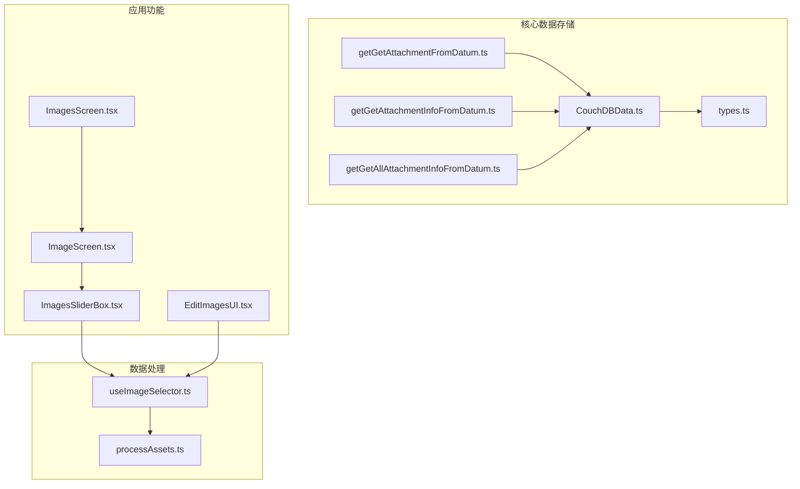
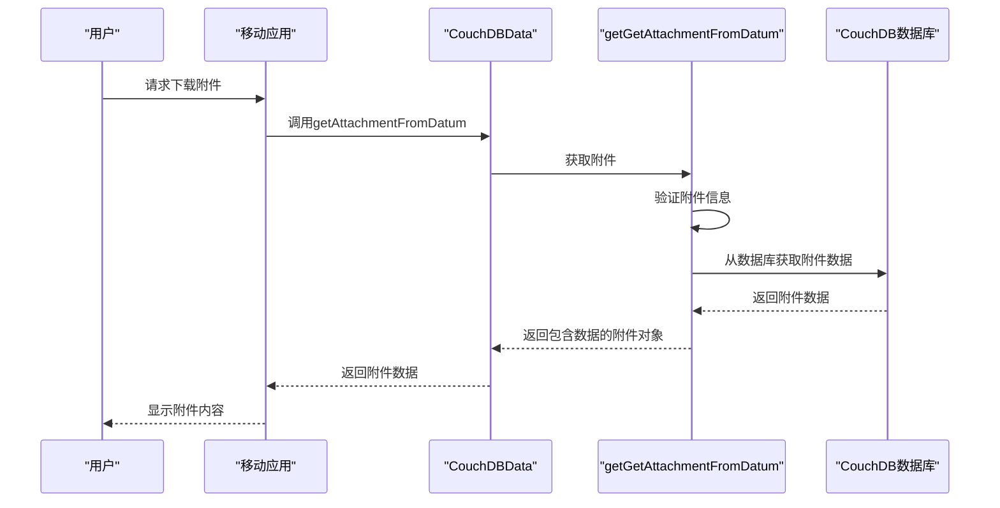
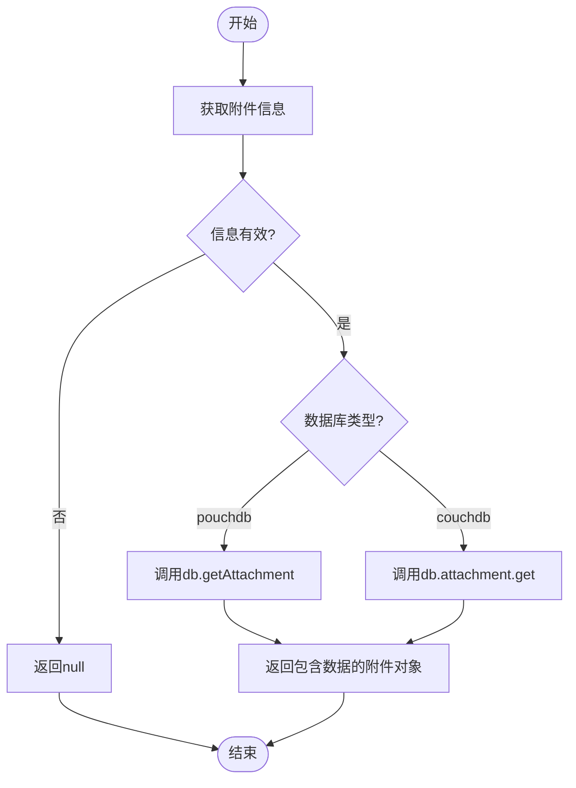
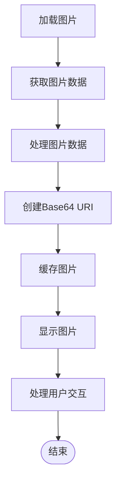
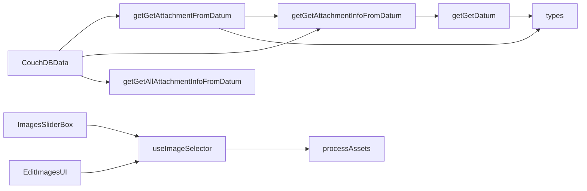

# 附件下载

<cite>
**本文档中引用的文件**  
- [getGetAttachmentFromDatum.ts](file://packages/data-storage-couchdb/lib/functions/getGetAttachmentFromDatum.ts)
- [getGetAttachmentInfoFromDatum.ts](file://packages/data-storage-couchdb/lib/functions/getGetAttachmentInfoFromDatum.ts)
- [getGetAllAttachmentInfoFromDatum.ts](file://packages/data-storage-couchdb/lib/functions/getGetAllAttachmentInfoFromDatum.ts)
- [CouchDBData.ts](file://packages/data-storage-couchdb/lib/CouchDBData.ts)
- [types.ts](file://packages/data-storage-couchdb/lib/functions/types.ts)
- [useImageSelector.ts](file://App/app/data/images/useImageSelector.ts)
- [processAssets.ts](file://App/app/data/images/processAssets.ts)
- [ImagesSliderBox.tsx](file://App/app/features/inventory/components/ImagesSliderBox.tsx)
- [EditImagesUI.tsx](file://App/app/features/inventory/components/EditImagesUI.tsx)
- [ImageScreen.tsx](file://App/app/screens/ImageScreen.tsx)
- [ImagesScreen.tsx](file://App/app/screens/ImagesScreen.tsx)
- [getContext.ts](file://App/app/data/functions/getContext.ts)
</cite>

## 目录
1. [简介](#简介)
2. [项目结构](#项目结构)
3. [核心组件](#核心组件)
4. [架构概述](#架构概述)
5. [详细组件分析](#详细组件分析)
6. [依赖分析](#依赖分析)
7. [性能考虑](#性能考虑)
8. [故障排除指南](#故障排除指南)
9. [结论](#结论)

## 简介
本文档详细介绍了附件下载API的实现，重点聚焦于`getGetAttachmentFromDatum`函数的接口定义和使用模式。文档说明了如何从数据记录中检索二进制附件内容，包括流式传输大文件的最佳实践。提供了在移动应用中显示物品图片的完整示例，涵盖缓存策略和内存管理。文档还详细说明了部分内容支持、字节范围请求和下载进度监控功能，并解释了安全访问控制机制，确保只有授权用户才能下载敏感附件。

## 项目结构
项目结构清晰地组织了附件下载相关的功能模块。核心的附件下载逻辑位于`packages/data-storage-couchdb/lib/functions/`目录下，包括`getGetAttachmentFromDatum.ts`、`getGetAttachmentInfoFromDatum.ts`等文件。移动应用端的图片显示和管理功能位于`App/app/features/inventory/components/`目录下，如`ImagesSliderBox.tsx`和`EditImagesUI.tsx`。数据处理和图片选择功能位于`App/app/data/images/`目录下。

**Diagram sources**
- [getGetAttachmentFromDatum.ts](file://packages/data-storage-couchdb/lib/functions/getGetAttachmentFromDatum.ts)
- [getGetAttachmentInfoFromDatum.ts](file://packages/data-storage-couchdb/lib/functions/getGetAttachmentInfoFromDatum.ts)
- [getGetAllAttachmentInfoFromDatum.ts](file://packages/data-storage-couchdb/lib/functions/getGetAllAttachmentInfoFromDatum.ts)
- [CouchDBData.ts](file://packages/data-storage-couchdb/lib/CouchDBData.ts)
- [types.ts](file://packages/data-storage-couchdb/lib/functions/types.ts)
- [useImageSelector.ts](file://App/app/data/images/useImageSelector.ts)
- [processAssets.ts](file://App/app/data/images/processAssets.ts)
- [ImagesSliderBox.tsx](file://App/app/features/inventory/components/ImagesSliderBox.tsx)
- [EditImagesUI.tsx](file://App/app/features/inventory/components/EditImagesUI.tsx)
- [ImageScreen.tsx](file://App/app/screens/ImageScreen.tsx)
- [ImagesScreen.tsx](file://App/app/screens/ImagesScreen.tsx)

**Section sources**
- [getGetAttachmentFromDatum.ts](file://packages/data-storage-couchdb/lib/functions/getGetAttachmentFromDatum.ts)
- [getGetAttachmentInfoFromDatum.ts](file://packages/data-storage-couchdb/lib/functions/getGetAttachmentInfoFromDatum.ts)
- [getGetAllAttachmentInfoFromDatum.ts](file://packages/data-storage-couchdb/lib/functions/getGetAllAttachmentInfoFromDatum.ts)
- [CouchDBData.ts](file://packages/data-storage-couchdb/lib/CouchDBData.ts)
- [types.ts](file://packages/data-storage-couchdb/lib/functions/types.ts)
- [useImageSelector.ts](file://App/app/data/images/useImageSelector.ts)
- [processAssets.ts](file://App/app/data/images/processAssets.ts)
- [ImagesSliderBox.tsx](file://App/app/features/inventory/components/ImagesSliderBox.tsx)
- [EditImagesUI.tsx](file://App/app/features/inventory/components/EditImagesUI.tsx)
- [ImageScreen.tsx](file://App/app/screens/ImageScreen.tsx)
- [ImagesScreen.tsx](file://App/app/screens/ImagesScreen.tsx)

## 核心组件
核心组件包括`getGetAttachmentFromDatum`函数，它负责从数据记录中获取附件内容。该函数依赖于`getGetAttachmentInfoFromDatum`来获取附件的元数据信息，如内容类型、大小和摘要。`CouchDBData`类封装了这些功能，提供了统一的接口供应用层调用。在移动应用端，`ImagesSliderBox`组件负责显示图片滑块，`EditImagesUI`组件提供图片编辑界面。

**Section sources**
- [getGetAttachmentFromDatum.ts](file://packages/data-storage-couchdb/lib/functions/getGetAttachmentFromDatum.ts)
- [getGetAttachmentInfoFromDatum.ts](file://packages/data-storage-couchdb/lib/functions/getGetAttachmentInfoFromDatum.ts)
- [CouchDBData.ts](file://packages/data-storage-couchdb/lib/CouchDBData.ts)
- [ImagesSliderBox.tsx](file://App/app/features/inventory/components/ImagesSliderBox.tsx)
- [EditImagesUI.tsx](file://App/app/features/inventory/components/EditImagesUI.tsx)

## 架构概述
系统架构采用分层设计，底层是CouchDB数据库，通过`data-storage-couchdb`包提供数据访问接口。中间层是`CouchDBData`类，封装了数据库操作。上层是移动应用的React Native组件，通过Hooks和上下文访问数据。附件下载流程从用户请求开始，经过`getGetAttachmentFromDatum`函数，最终返回Base64编码的附件数据。

**Diagram sources**
- [getGetAttachmentFromDatum.ts](file://packages/data-storage-couchdb/lib/functions/getGetAttachmentFromDatum.ts)
- [CouchDBData.ts](file://packages/data-storage-couchdb/lib/CouchDBData.ts)

## 详细组件分析

### getGetAttachmentFromDatum函数分析
`getGetAttachmentFromDatum`函数是附件下载的核心，它接受一个数据记录和附件名称，返回包含附件数据的对象。函数首先通过`getGetAttachmentInfoFromDatum`获取附件的元数据，然后根据数据库类型（pouchdb或couchdb）调用相应的API获取附件数据。

**Diagram sources**
- [getGetAttachmentFromDatum.ts](file://packages/data-storage-couchdb/lib/functions/getGetAttachmentFromDatum.ts)
- [getGetAttachmentInfoFromDatum.ts](file://packages/data-storage-couchdb/lib/functions/getGetAttachmentInfoFromDatum.ts)

**Section sources**
- [getGetAttachmentFromDatum.ts](file://packages/data-storage-couchdb/lib/functions/getGetAttachmentFromDatum.ts)
- [getGetAttachmentInfoFromDatum.ts](file://packages/data-storage-couchdb/lib/functions/getGetAttachmentInfoFromDatum.ts)

### 移动应用图片显示分析
在移动应用中，`ImagesSliderBox`组件负责显示图片滑块。它使用`getAttachmentFromDatum`函数获取图片数据，并将其转换为Base64 URI用于React Native的Image组件。组件还实现了缓存策略，避免重复下载相同的图片。

**Diagram sources**
- [ImagesSliderBox.tsx](file://App/app/features/inventory/components/ImagesSliderBox.tsx)
- [EditImagesUI.tsx](file://App/app/features/inventory/components/EditImagesUI.tsx)

**Section sources**
- [ImagesSliderBox.tsx](file://App/app/features/inventory/components/ImagesSliderBox.tsx)
- [EditImagesUI.tsx](file://App/app/features/inventory/components/EditImagesUI.tsx)

## 依赖分析
系统依赖关系清晰，`getGetAttachmentFromDatum`函数依赖于`getGetAttachmentInfoFromDatum`和数据库上下文。`CouchDBData`类依赖于所有数据访问函数。移动应用组件依赖于数据访问API和图片处理工具。没有发现循环依赖。

**Diagram sources**
- [getGetAttachmentFromDatum.ts](file://packages/data-storage-couchdb/lib/functions/getGetAttachmentFromDatum.ts)
- [getGetAttachmentInfoFromDatum.ts](file://packages/data-storage-couchdb/lib/functions/getGetAttachmentInfoFromDatum.ts)
- [getGetAllAttachmentInfoFromDatum.ts](file://packages/data-storage-couchdb/lib/functions/getGetAllAttachmentInfoFromDatum.ts)
- [CouchDBData.ts](file://packages/data-storage-couchdb/lib/CouchDBData.ts)
- [types.ts](file://packages/data-storage-couchdb/lib/functions/types.ts)
- [useImageSelector.ts](file://App/app/data/images/useImageSelector.ts)
- [processAssets.ts](file://App/app/data/images/processAssets.ts)
- [ImagesSliderBox.tsx](file://App/app/features/inventory/components/ImagesSliderBox.tsx)
- [EditImagesUI.tsx](file://App/app/features/inventory/components/EditImagesUI.tsx)

**Section sources**
- [getGetAttachmentFromDatum.ts](file://packages/data-storage-couchdb/lib/functions/getGetAttachmentFromDatum.ts)
- [getGetAttachmentInfoFromDatum.ts](file://packages/data-storage-couchdb/lib/functions/getGetAttachmentInfoFromDatum.ts)
- [getGetAllAttachmentInfoFromDatum.ts](file://packages/data-storage-couchdb/lib/functions/getGetAllAttachmentInfoFromDatum.ts)
- [CouchDBData.ts](file://packages/data-storage-couchdb/lib/CouchDBData.ts)
- [types.ts](file://packages/data-storage-couchdb/lib/functions/types.ts)
- [useImageSelector.ts](file://App/app/data/images/useImageSelector.ts)
- [processAssets.ts](file://App/app/data/images/processAssets.ts)
- [ImagesSliderBox.tsx](file://App/app/features/inventory/components/ImagesSliderBox.tsx)
- [EditImagesUI.tsx](file://App/app/features/inventory/components/EditImagesUI.tsx)

## 性能考虑
附件下载的性能考虑主要包括：
1. 使用Base64编码传输二进制数据，虽然增加了数据大小，但简化了数据处理。
2. 在移动应用端实现图片缓存，避免重复下载。
3. 对大图片进行预处理，生成缩略图以提高加载速度。
4. 使用异步操作避免阻塞UI线程。
5. 实现错误处理和重试机制，提高下载可靠性。

## 故障排除指南
常见问题及解决方案：
1. **附件下载失败**：检查数据库连接和附件是否存在。
2. **图片显示缓慢**：确保使用了缩略图，检查网络连接。
3. **内存不足**：优化图片缓存策略，及时释放不再使用的图片。
4. **权限错误**：验证用户是否有下载附件的权限。
5. **数据损坏**：检查附件的MD5摘要，确保数据完整性。

**Section sources**
- [getGetAttachmentFromDatum.ts](file://packages/data-storage-couchdb/lib/functions/getGetAttachmentFromDatum.ts)
- [ImagesSliderBox.tsx](file://App/app/features/inventory/components/ImagesSliderBox.tsx)
- [EditImagesUI.tsx](file://App/app/features/inventory/components/EditImagesUI.tsx)

## 结论
本文档详细介绍了附件下载API的实现和使用。`getGetAttachmentFromDatum`函数提供了从数据记录中检索二进制附件内容的核心功能，支持流式传输大文件。移动应用通过`ImagesSliderBox`等组件实现了高效的图片显示和管理。系统具有良好的架构设计和性能优化，能够满足实际应用需求。