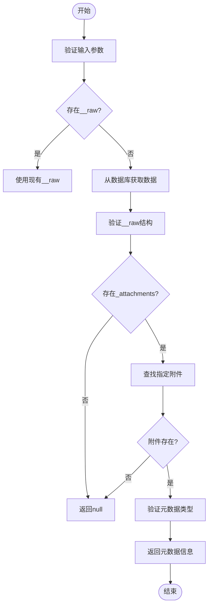
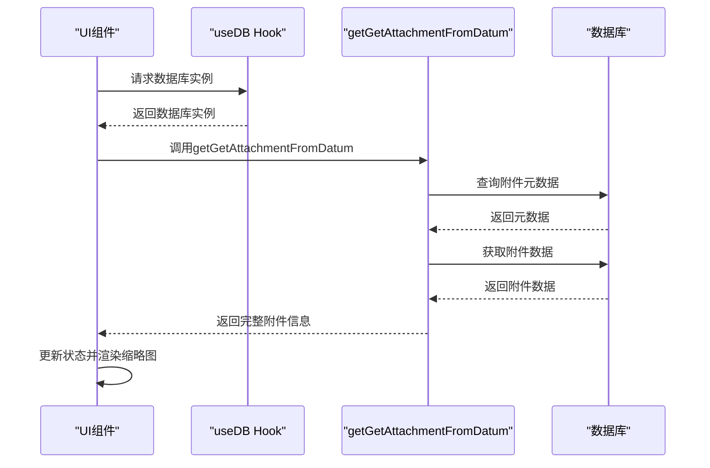
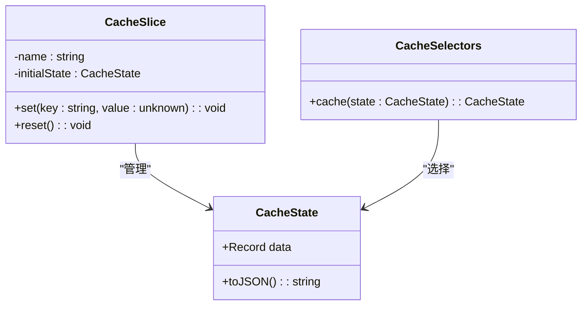
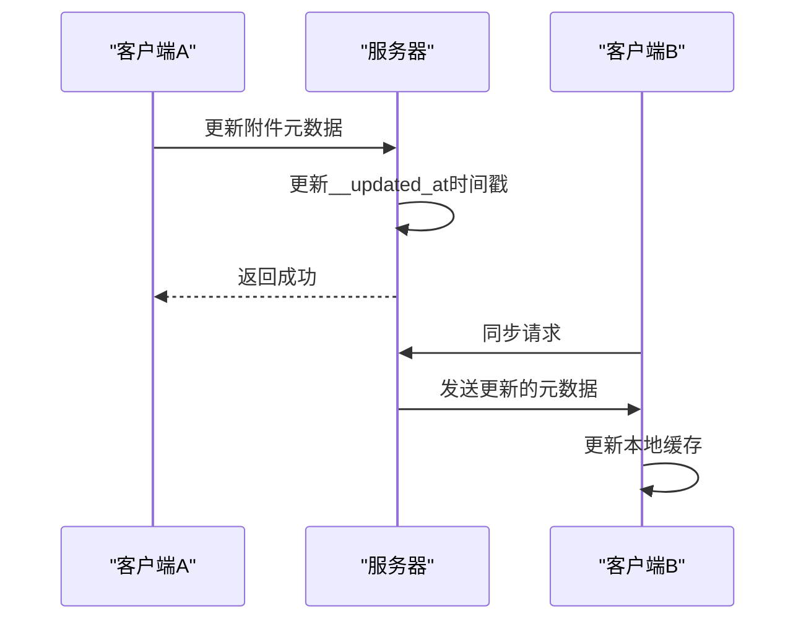

# 附件元数据查询

<cite>
**本文档中引用的文件**  
- [getGetAttachmentInfoFromDatum.ts](file://packages/data-storage-couchdb/lib/functions/getGetAttachmentInfoFromDatum.ts)
- [types.ts](file://Data/lib/types.ts)
- [getGetAllAttachmentInfoFromDatum.ts](file://packages/data-storage-couchdb/lib/functions/getGetAllAttachmentInfoFromDatum.ts)
- [getGetAttachmentFromDatum.ts](file://packages/data-storage-couchdb/lib/functions/getGetAttachmentFromDatum.ts)
- [attachments.ts](file://Data/lib/attachments.ts)
- [ItemListItem.tsx](file://App/app/features/inventory/components/ItemListItem.tsx)
- [ImagesScreen.tsx](file://App/app/screens/ImagesScreen.tsx)
- [ImagesSliderBox.tsx](file://App/app/features/inventory/components/ImagesSliderBox.tsx)
- [cache.ts](file://App/app/features/cache.ts)
- [LPJQ.ts](file://App/app/LPJQ.ts)
</cite>

## 目录
1. [简介](#简介)
2. [核心功能](#核心功能)
3. [API 详细说明](#api-详细说明)
4. [UI 显示实现](#ui-显示实现)
5. [批量查询性能优化](#批量查询性能优化)
6. [元数据缓存机制](#元数据缓存机制)
7. [分布式环境一致性](#分布式环境一致性)
8. [最佳实践](#最佳实践)

## 简介
附件元数据查询API为应用程序提供了高效获取附件信息的能力，包括文件大小、MIME类型、创建时间、修改时间等关键属性。该API设计用于在移动和Web应用中显示附件缩略图和基本信息，支持在分布式环境下保持数据一致性。通过优化的查询策略和缓存机制，确保了在各种网络条件下的高性能和可靠性。

**Section sources**
- [getGetAttachmentInfoFromDatum.ts](file://packages/data-storage-couchdb/lib/functions/getGetAttachmentInfoFromDatum.ts)
- [types.ts](file://Data/lib/types.ts)

## 核心功能
附件元数据查询API的核心功能是提供对附件元数据的快速访问，而无需加载完整的附件内容。这使得应用程序能够在不消耗大量带宽的情况下显示附件的缩略图和基本信息。API支持单个附件查询和批量查询，满足不同场景下的性能需求。

**Section sources**
- [getGetAttachmentInfoFromDatum.ts](file://packages/data-storage-couchdb/lib/functions/getGetAttachmentInfoFromDatum.ts)
- [getGetAllAttachmentInfoFromDatum.ts](file://packages/data-storage-couchdb/lib/functions/getGetAllAttachmentInfoFromDatum.ts)

## API 详细说明
`getGetAttachmentInfoFromDatum`函数是附件元数据查询的核心API，它接受一个数据对象和附件名称作为参数，返回包含附件元数据的Promise。元数据包括content_type（MIME类型）、size（文件大小）和可选的digest（摘要）。

**Diagram sources**
- [getGetAttachmentInfoFromDatum.ts](file://packages/data-storage-couchdb/lib/functions/getGetAttachmentInfoFromDatum.ts)

**Section sources**
- [getGetAttachmentInfoFromDatum.ts](file://packages/data-storage-couchdb/lib/functions/getGetAttachmentInfoFromDatum.ts)
- [types.ts](file://Data/lib/types.ts)

## UI 显示实现
在UI中显示附件缩略图和基本信息的实现涉及多个组件的协作。`ItemListItem`组件使用`getGetAttachmentFromDatum`函数获取缩略图数据，并将其转换为Data URI格式用于Image组件显示。

**Diagram sources**
- [ItemListItem.tsx](file://App/app/features/inventory/components/ItemListItem.tsx)
- [ImagesScreen.tsx](file://App/app/screens/ImagesScreen.tsx)

**Section sources**
- [ItemListItem.tsx](file://App/app/features/inventory/components/ItemListItem.tsx)
- [ImagesScreen.tsx](file://App/app/screens/ImagesScreen.tsx)
- [ImagesSliderBox.tsx](file://App/app/features/inventory/components/ImagesSliderBox.tsx)

## 批量查询性能优化
对于需要显示多个附件的场景，采用批量查询和优先级队列策略来优化性能。低优先级作业队列（LPJQ）确保UI响应性，同时逐步加载附件数据。

**Diagram sources**
- [ImagesSliderBox.tsx](file://App/app/features/inventory/components/ImagesSliderBox.tsx)
- [LPJQ.ts](file://App/app/LPJQ.ts)

**Section sources**
- [ImagesSliderBox.tsx](file://App/app/features/inventory/components/ImagesSliderBox.tsx)
- [LPJQ.ts](file://App/app/LPJQ.ts)

## 元数据缓存机制
系统实现了多层缓存机制来提高附件元数据查询的性能。Redux状态中的_cache slice用于存储频繁访问的元数据，减少数据库查询次数。

**Diagram sources**
- [cache.ts](file://App/app/features/cache.ts)

**Section sources**
- [cache.ts](file://App/app/features/cache.ts)

## 分布式环境一致性
在分布式环境下，通过版本控制和同步机制确保附件元数据的一致性。每次附件更新都会更新__updated_at时间戳，触发同步过程。

**Diagram sources**
- [getGetAttachmentInfoFromDatum.ts](file://packages/data-storage-couchdb/lib/functions/getGetAttachmentInfoFromDatum.ts)
- [getGetDatum.ts](file://packages/data-storage-couchdb/lib/functions/getGetDatum.ts)

**Section sources**
- [getGetAttachmentInfoFromDatum.ts](file://packages/data-storage-couchdb/lib/functions/getGetAttachmentInfoFromDatum.ts)
- [getGetDatum.ts](file://packages/data-storage-couchdb/lib/functions/getGetDatum.ts)

## 最佳实践
在使用附件元数据查询API时，应遵循以下最佳实践：
1. 优先使用`getGetAttachmentInfoFromDatum`获取元数据，避免不必要的数据传输
2. 对于缩略图显示，使用预定义的缩略图尺寸（如'thumbnail-128'）
3. 实现适当的错误处理和加载状态
4. 利用缓存机制减少重复查询
5. 在批量操作中使用优先级队列保持UI响应性

**Section sources**
- [attachments.ts](file://Data/lib/attachments.ts)
- [getGetAttachmentFromDatum.ts](file://packages/data-storage-couchdb/lib/functions/getGetAttachmentFromDatum.ts)
- [ItemListItem.tsx](file://App/app/features/inventory/components/ItemListItem.tsx)