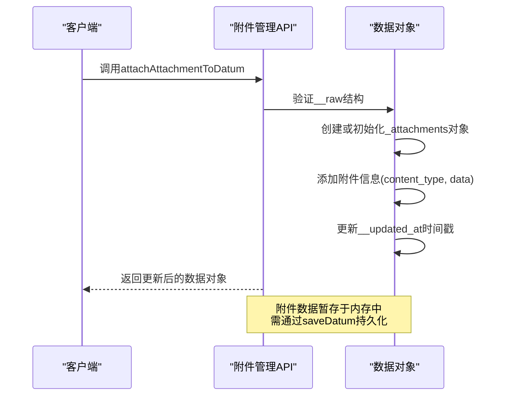
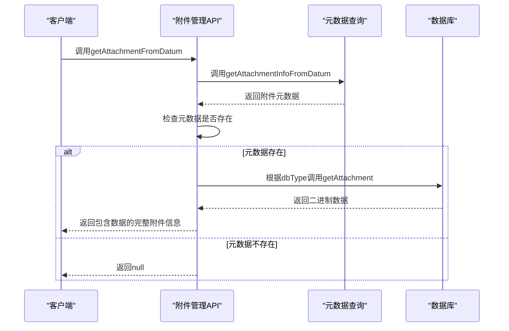
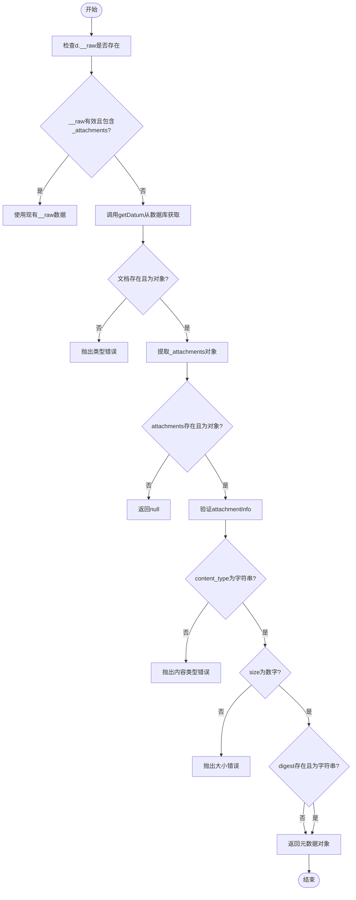
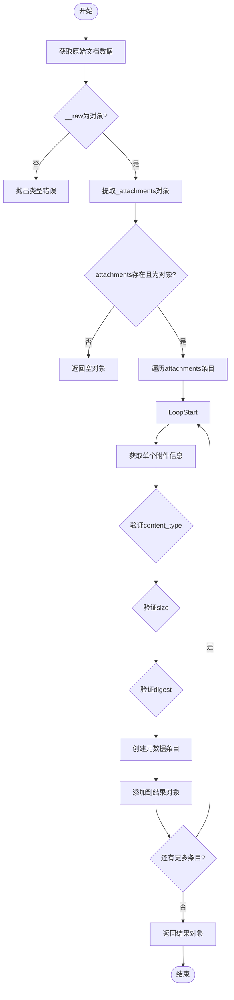
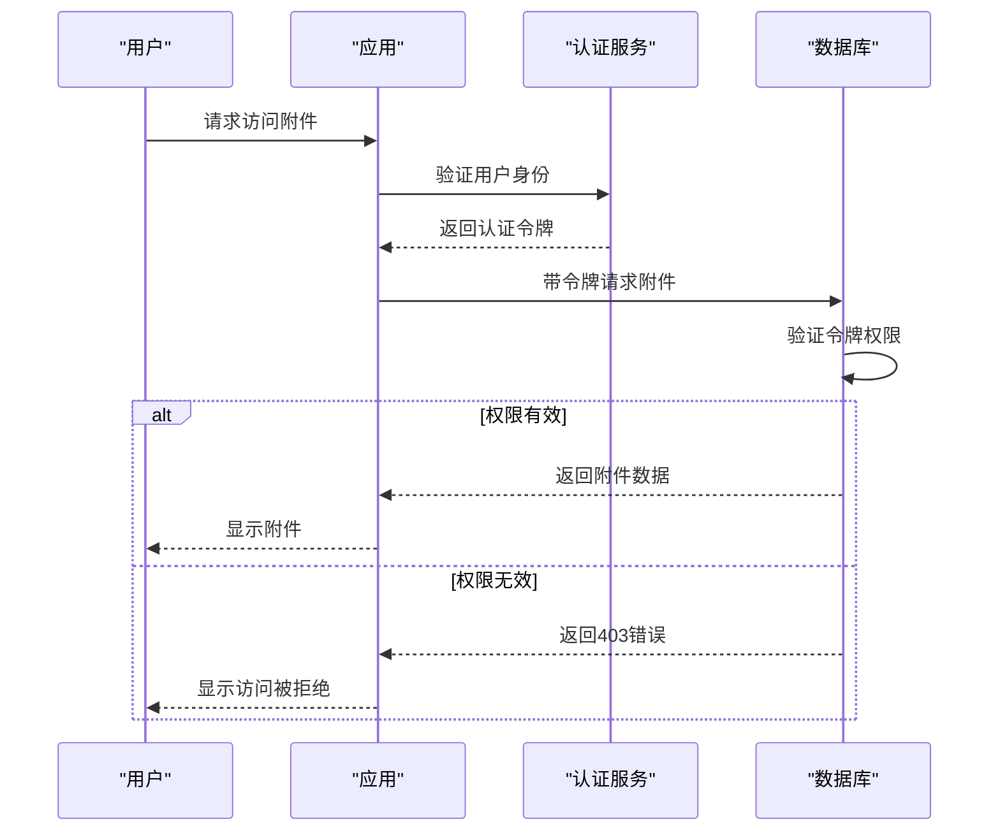
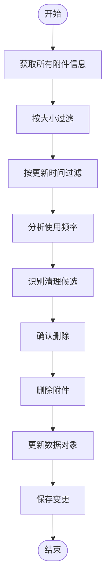
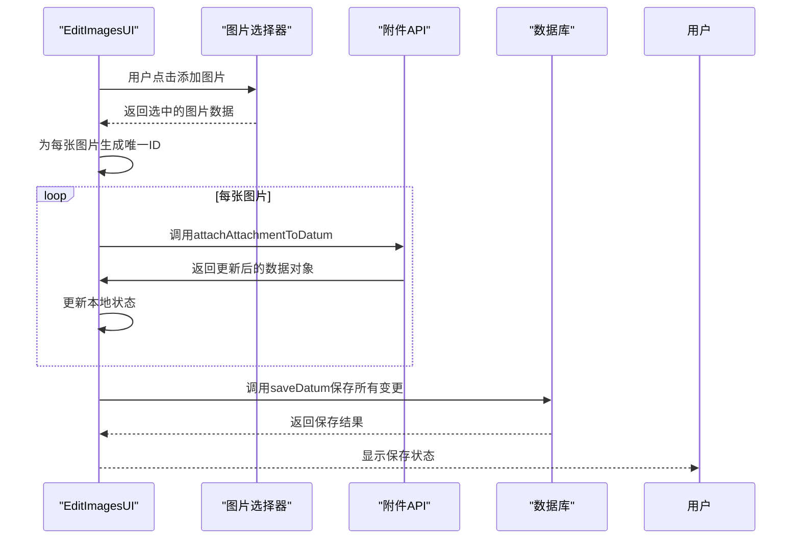
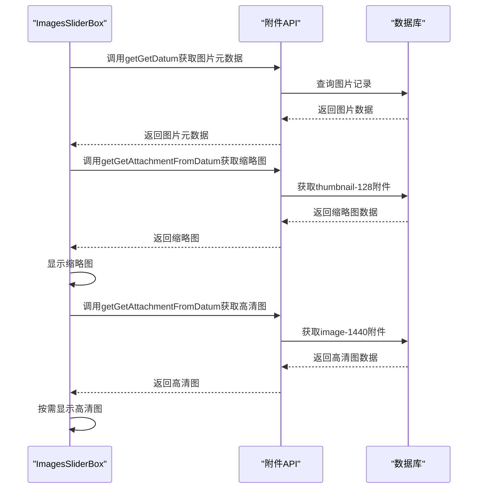

# 附件管理API

<cite>
**本文档中引用的文件**  
- [getAttachAttachmentToDatum.ts](file://packages/data-storage-couchdb/lib/functions/getAttachAttachmentToDatum.ts)
- [getGetAttachmentFromDatum.ts](file://packages/data-storage-couchdb/lib/functions/getGetAttachmentFromDatum.ts)
- [getGetAttachmentInfoFromDatum.ts](file://packages/data-storage-couchdb/lib/functions/getGetAttachmentInfoFromDatum.ts)
- [getGetAllAttachmentInfoFromDatum.ts](file://packages/data-storage-couchdb/lib/functions/getGetAllAttachmentInfoFromDatum.ts)
- [attachments.ts](file://Data/lib/attachments.ts)
- [types.ts](file://Data/lib/types.ts)
- [EditImagesUI.tsx](file://App/app/features/inventory/components/EditImagesUI.tsx)
- [ImagesSliderBox.tsx](file://App/app/features/inventory/components/ImagesSliderBox.tsx)
</cite>

## 目录
1. [简介](#简介)
2. [核心API接口定义](#核心api接口定义)
3. [附件存储策略与限制](#附件存储策略与限制)
4. [安全访问控制](#安全访问控制)
5. [附件版本管理与清理机制](#附件版本管理与清理机制)
6. [库存系统中图片管理的实际用法](#库存系统中图片管理的实际用法)
7. [错误处理与调试](#错误处理与调试)

## 简介

附件管理API为库存管理系统提供了完整的二进制文件（如图片、文档）上传、下载和元数据查询功能。该系统基于CouchDB/PouchDB数据库的附件功能，实现了对物品图片等附件的安全存储和高效访问。API设计遵循类型安全原则，通过TypeScript接口定义确保附件操作的正确性，并在库存管理场景中实现了图片的版本化存储和按需加载。

**Section sources**
- [getAttachAttachmentToDatum.ts](file://packages/data-storage-couchdb/lib/functions/getAttachAttachmentToDatum.ts#L1-L37)
- [getGetAttachmentFromDatum.ts](file://packages/data-storage-couchdb/lib/functions/getGetAttachmentFromDatum.ts#L1-L45)

## 核心API接口定义

附件管理API提供了三个核心函数：`getAttachAttachmentToDatum`、`getGetAttachmentFromDatum`和`getGetAttachmentInfoFromDatum`，分别用于附件的上传、下载和元数据查询。

### 附件上传：getAttachAttachmentToDatum

该函数用于将二进制数据作为附件附加到数据记录上。它不直接与数据库交互，而是将附件信息暂存到数据对象的`__raw`字段中，等待后续的`saveDatum`操作将数据持久化到数据库。



**Diagram sources**
- [getAttachAttachmentToDatum.ts](file://packages/data-storage-couchdb/lib/functions/getAttachAttachmentToDatum.ts#L1-L37)

**Section sources**
- [getAttachAttachmentToDatum.ts](file://packages/data-storage-couchdb/lib/functions/getAttachAttachmentToDatum.ts#L1-L37)
- [types.ts](file://Data/lib/types.ts#L166-L174)

### 附件下载：getGetAttachmentFromDatum

该函数用于从数据记录中获取附件的完整信息，包括元数据和二进制数据。它首先通过`getGetAttachmentInfoFromDatum`获取附件元数据，然后根据数据库类型（PouchDB或CouchDB）调用相应的API获取实际的二进制数据。



**Diagram sources**
- [getGetAttachmentFromDatum.ts](file://packages/data-storage-couchdb/lib/functions/getGetAttachmentFromDatum.ts#L1-L45)

**Section sources**
- [getGetAttachmentFromDatum.ts](file://packages/data-storage-couchdb/lib/functions/getGetAttachmentFromDatum.ts#L1-L45)
- [types.ts](file://Data/lib/types.ts#L180-L188)

### 元数据查询：getGetAttachmentInfoFromDatum

该函数用于查询附件的元数据信息，包括内容类型、大小和摘要。它优先使用数据对象中的`__raw`字段，如果不存在则从数据库中获取完整数据。



**Diagram sources**
- [getGetAttachmentInfoFromDatum.ts](file://packages/data-storage-couchdb/lib/functions/getGetAttachmentInfoFromDatum.ts#L1-L63)

**Section sources**
- [getGetAttachmentInfoFromDatum.ts](file://packages/data-storage-couchdb/lib/functions/getGetAttachmentInfoFromDatum.ts#L1-L63)
- [types.ts](file://Data/lib/types.ts#L176-L179)

### 批量元数据查询：getGetAllAttachmentInfoFromDatum

该函数用于获取数据记录中所有附件的元数据信息，返回一个以附件名称为键的对象。



**Diagram sources**
- [getGetAllAttachmentInfoFromDatum.ts](file://packages/data-storage-couchdb/lib/functions/getGetAllAttachmentInfoFromDatum.ts#L1-L67)

**Section sources**
- [getGetAllAttachmentInfoFromDatum.ts](file://packages/data-storage-couchdb/lib/functions/getGetAllAttachmentInfoFromDatum.ts#L1-L67)

## 附件存储策略与限制

附件存储策略通过`attachments.ts`文件中的`attachment_definitions`进行定义，为不同数据类型规定了附件的存储规范。

### 存储策略定义

```mermaid
classDiagram
class AttachmentDefn {
+content_types : string[]
+required? : boolean
}
class AttachmentNameOfDataType {
+T : DataTypeName
+returns : keyof attachment_definitions[T]
}
class AttachmentContentType {
+T : DataTypeName
+N : AttachmentNameOfDataType<T>
+returns : content_types[number]
}
class attachment_definitions {
+image : {
thumbnail-128 : AttachmentDefn
image-1440 : AttachmentDefn
}
}
AttachmentNameOfDataType --> attachment_definitions : "类型约束"
AttachmentContentType --> attachment_definitions : "类型约束"
attachment_definitions --> AttachmentDefn : "包含"
```

**Diagram sources**
- [attachments.ts](file://Data/lib/attachments.ts#L1-L47)

**Section sources**
- [attachments.ts](file://Data/lib/attachments.ts#L1-L47)

### 存储限制

根据`attachment_definitions`的定义，系统对图片附件实施了以下存储限制：

- **内容类型限制**：仅允许`image/jpeg`和`image/png`格式的图片
- **必需附件**：每个图片必须包含`thumbnail-128`和`image-1440`两个版本
- **版本化存储**：同一图片存储为不同分辨率的多个版本，以适应不同使用场景
- **大小限制**：虽然代码中未明确限制大小，但通过`size`字段记录附件大小，可用于后续的大小验证和清理

## 安全访问控制

系统通过多层机制确保附件的安全访问：

1. **类型安全控制**：通过TypeScript泛型和条件类型，确保只能访问为特定数据类型定义的附件
2. **数据验证**：在获取附件信息时，严格验证`content_type`、`size`和`digest`字段的类型
3. **访问权限**：附件访问依赖于底层数据库的认证机制，只有经过认证的用户才能访问数据库中的附件
4. **数据完整性**：通过`digest`字段验证附件的完整性，防止数据损坏



**Diagram sources**
- [getGetAttachmentFromDatum.ts](file://packages/data-storage-couchdb/lib/functions/getGetAttachmentFromDatum.ts#L21-L41)
- [getGetAttachmentInfoFromDatum.ts](file://packages/data-storage-couchdb/lib/functions/getGetAttachmentInfoFromDatum.ts#L39-L52)

**Section sources**
- [getGetAttachmentFromDatum.ts](file://packages/data-storage-couchdb/lib/functions/getGetAttachmentFromDatum.ts#L21-L41)
- [getGetAttachmentInfoFromDatum.ts](file://packages/data-storage-couchdb/lib/functions/getGetAttachmentInfoFromDatum.ts#L39-L52)

## 附件版本管理与清理机制

系统通过以下机制实现附件的版本管理和清理：

### 版本管理

- **多版本存储**：同一图片存储为`thumbnail-128`和`image-1440`两个版本，分别用于列表显示和详细查看
- **时间戳更新**：每次修改附件时，自动更新数据对象的`__updated_at`字段
- **历史记录**：通过`getGetDatumHistories`等函数可以查询数据的历史变更记录

### 清理机制

虽然代码中未直接实现清理功能，但提供了以下基础：

- **大小监控**：通过`size`字段记录每个附件的大小，可用于实现基于大小的清理策略
- **使用统计**：可以结合访问日志分析附件的使用频率，识别不常用的附件
- **批量操作**：`getAllAttachmentInfoFromDatum`函数支持批量获取附件信息，便于实现批量清理



**Section sources**
- [getGetAllAttachmentInfoFromDatum.ts](file://packages/data-storage-couchdb/lib/functions/getGetAllAttachmentInfoFromDatum.ts#L1-L67)
- [getSaveDatum.ts](file://packages/data-storage-couchdb/lib/functions/getSaveDatum.ts#L17-L40)

## 库存系统中图片管理的实际用法

在库存系统中，附件管理API主要用于物品图片的管理，主要通过`EditImagesUI`和`ImagesSliderBox`组件实现。

### 图片上传流程



**Section sources**
- [EditImagesUI.tsx](file://App/app/features/inventory/components/EditImagesUI.tsx#L1-L200)

### 图片下载与显示流程



**Section sources**
- [ImagesSliderBox.tsx](file://App/app/features/inventory/components/ImagesSliderBox.tsx#L1-L200)

### 实际代码示例

在`EditImagesUI.tsx`中，图片管理的实现包括：

1. 使用`useImageSelector`钩子选择图片
2. 通过`getAttachAttachmentToDatum`将图片作为附件附加到数据对象
3. 使用`getSaveDatum`保存包含附件的完整数据

在`ImagesSliderBox.tsx`中，图片显示的实现包括：

1. 使用`getGetDatum`获取图片元数据
2. 通过`getGetAttachmentFromDatum`获取不同分辨率的图片数据
3. 将Base64编码的图片数据用于React Native的Image组件显示

## 错误处理与调试

系统实现了完善的错误处理机制，确保附件操作的可靠性：

- **类型验证**：在获取附件信息时，严格验证各字段的类型，防止类型错误
- **空值处理**：当附件不存在时，返回`null`而不是抛出异常，使调用方可以优雅地处理缺失附件
- **异步错误**：所有异步操作都包含适当的错误处理，防止未捕获的Promise拒绝
- **调试支持**：通过`humanFileSize`等工具函数，便于在开发和调试过程中查看附件信息

**Section sources**
- [getGetAttachmentInfoFromDatum.ts](file://packages/data-storage-couchdb/lib/functions/getGetAttachmentInfoFromDatum.ts#L25-L52)
- [PouchDBAttachmentScreen.tsx](file://App/app/screens/dev-tools/pouchdb/PouchDBAttachmentScreen.tsx#L1-L173)