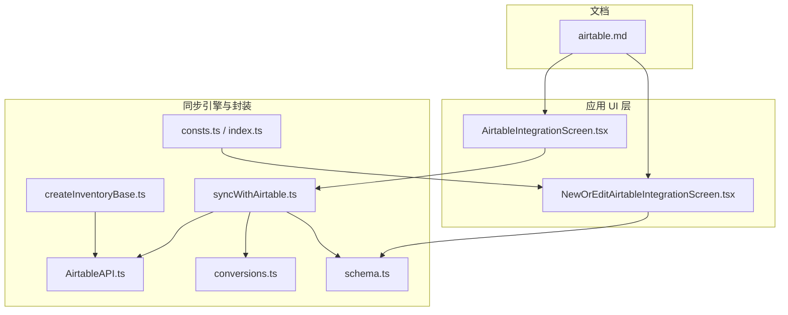
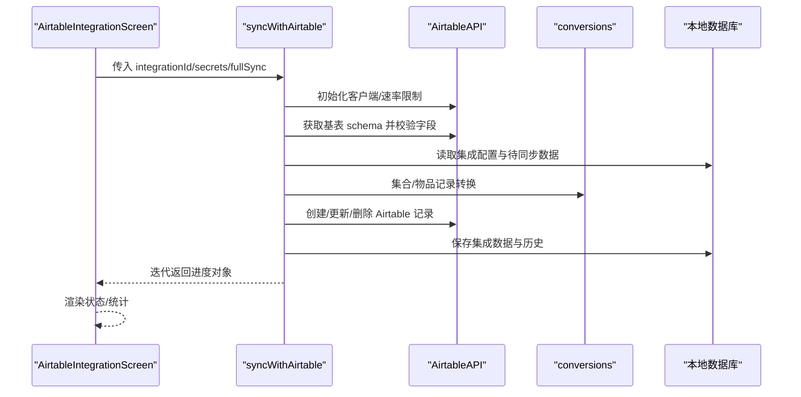
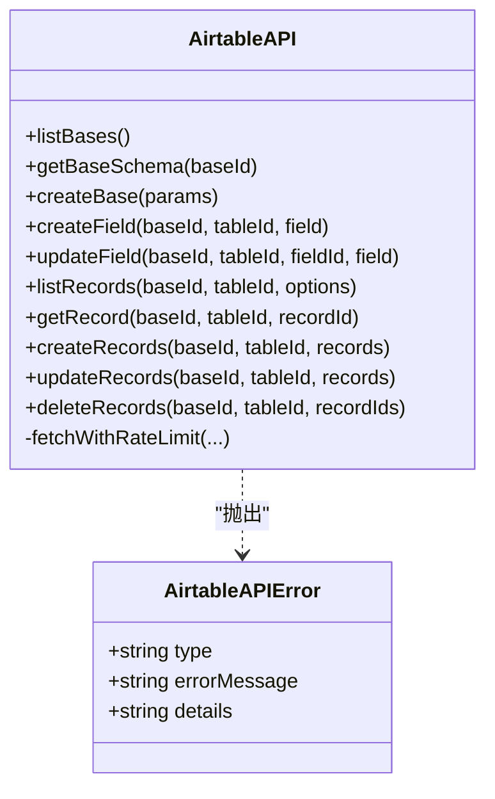
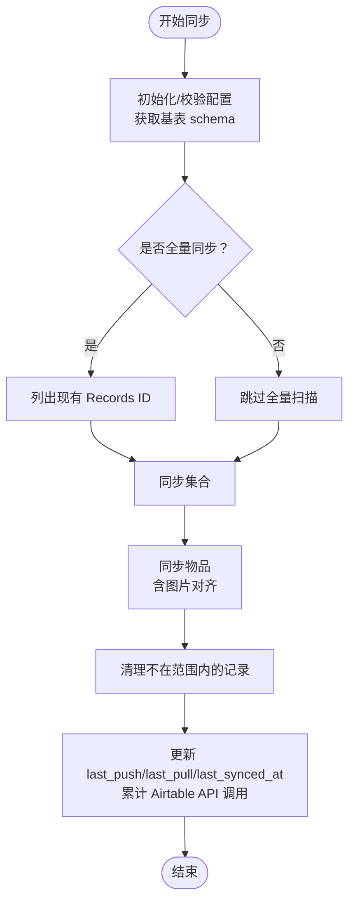
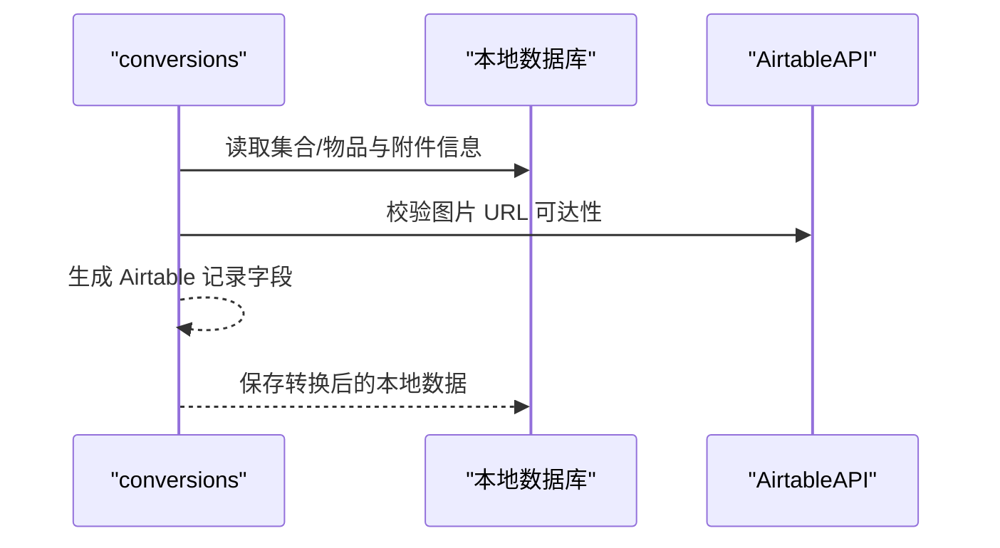
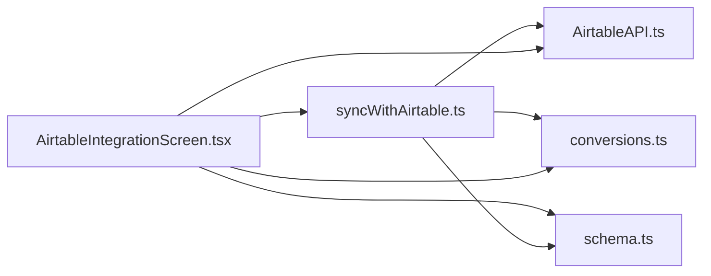

# Airtable 同步

<cite>
**本文引用的文件**
- [syncWithAirtable.ts](file://packages/integration-airtable/lib/syncWithAirtable.ts)
- [AirtableAPI.ts](file://packages/integration-airtable/lib/AirtableAPI.ts)
- [conversions.ts](file://packages/integration-airtable/lib/conversions.ts)
- [schema.ts](file://packages/integration-airtable/lib/schema.ts)
- [consts.ts](file://packages/integration-airtable/lib/consts.ts)
- [index.ts](file://packages/integration-airtable/lib/index.ts)
- [AirtableIntegrationScreen.tsx](file://App/app/features/integrations/screens/AirtableIntegrationScreen.tsx)
- [NewOrEditAirtableIntegrationScreen.tsx](file://App/app/features/integrations/screens/NewOrEditAirtableIntegrationScreen.tsx)
- [airtable.md](file://Inventory-Docs/integrations/data-synchronization/airtable.md)
- [createInventoryBase.ts](file://packages/integration-airtable/lib/createInventoryBase.ts)
</cite>

## 目录
1. [简介](#简介)
2. [项目结构](#项目结构)
3. [核心组件](#核心组件)
4. [架构总览](#架构总览)
5. [详细组件分析](#详细组件分析)
6. [依赖关系分析](#依赖关系分析)
7. [性能考量](#性能考量)
8. [故障排查指南](#故障排查指南)
9. [结论](#结论)
10. [附录](#附录)

## 简介
本文件系统性梳理了应用中与 Airtable 数据同步相关的实现与使用方式，覆盖从 UI 配置、数据模型映射、到与 Airtable API 的交互、增量与全量同步策略、图片上传与对齐、错误处理与重试、以及常见问题与限制说明。目标是帮助开发者与使用者理解“Airtable 同步”如何工作，并在需要时进行扩展或排障。

## 项目结构
Airtable 同步功能由两部分组成：
- 应用侧 UI 层：负责集成配置、触发同步、展示进度与统计。
- 同步引擎与 API 封装层：负责与 Airtable 基表交互、数据转换、冲突解决与历史记录。

图表来源
- [AirtableIntegrationScreen.tsx](file://App/app/features/integrations/screens/AirtableIntegrationScreen.tsx#L1-L774)
- [NewOrEditAirtableIntegrationScreen.tsx](file://App/app/features/integrations/screens/NewOrEditAirtableIntegrationScreen.tsx#L1-L620)
- [syncWithAirtable.ts](file://packages/integration-airtable/lib/syncWithAirtable.ts#L1-L1452)
- [AirtableAPI.ts](file://packages/integration-airtable/lib/AirtableAPI.ts#L1-L452)
- [conversions.ts](file://packages/integration-airtable/lib/conversions.ts#L1-L564)
- [schema.ts](file://packages/integration-airtable/lib/schema.ts#L1-L17)
- [consts.ts](file://packages/integration-airtable/lib/consts.ts#L1-L3)
- [index.ts](file://packages/integration-airtable/lib/index.ts#L1-L5)
- [createInventoryBase.ts](file://packages/integration-airtable/lib/createInventoryBase.ts#L1-L165)
- [airtable.md](file://Inventory-Docs/integrations/data-synchronization/airtable.md#L1-L77)

章节来源
- [AirtableIntegrationScreen.tsx](file://App/app/features/integrations/screens/AirtableIntegrationScreen.tsx#L1-L774)
- [NewOrEditAirtableIntegrationScreen.tsx](file://App/app/features/integrations/screens/NewOrEditAirtableIntegrationScreen.tsx#L1-L620)
- [syncWithAirtable.ts](file://packages/integration-airtable/lib/syncWithAirtable.ts#L1-L1452)
- [AirtableAPI.ts](file://packages/integration-airtable/lib/AirtableAPI.ts#L1-L452)
- [conversions.ts](file://packages/integration-airtable/lib/conversions.ts#L1-L564)
- [schema.ts](file://packages/integration-airtable/lib/schema.ts#L1-L17)
- [consts.ts](file://packages/integration-airtable/lib/consts.ts#L1-L3)
- [index.ts](file://packages/integration-airtable/lib/index.ts#L1-L5)
- [createInventoryBase.ts](file://packages/integration-airtable/lib/createInventoryBase.ts#L1-L165)
- [airtable.md](file://Inventory-Docs/integrations/data-synchronization/airtable.md#L1-L77)

## 核心组件
- AirtableAPI：封装 Airtable 元数据与记录操作，内置速率限制与重试逻辑，统一抛出结构化错误类型。
- 同步主流程（syncWithAirtable）：按集合与物品两类数据分别执行“推送（本地→Airtable）”与“拉取（Airtable→本地）”，支持增量与全量模式；处理删除标记、图片对齐、冲突合并与历史记录。
- 转换器（conversions）：定义集合与物品在本地数据与 Airtable 记录之间的双向映射，包含字段过滤、类型转换、图片 URL 校验等。
- 集成配置（schema）：对集成配置进行校验，包括基表 ID、同步范围（集合/容器）、图片公共端点与上传开关等。
- UI 层（AirtableIntegrationScreen、NewOrEditAirtableIntegrationScreen）：提供配置界面、触发同步、显示进度与统计、查看变更批次、打开 Airtable 基表链接等。
- 模板基表创建工具（createInventoryBase）：辅助创建符合集成要求的基表结构（已标注不支持自动创建 lastModifiedTime 字段）。
- 文档（airtable.md）：面向用户的使用说明、限制与最佳实践。

章节来源
- [AirtableAPI.ts](file://packages/integration-airtable/lib/AirtableAPI.ts#L1-L452)
- [syncWithAirtable.ts](file://packages/integration-airtable/lib/syncWithAirtable.ts#L1-L1452)
- [conversions.ts](file://packages/integration-airtable/lib/conversions.ts#L1-L564)
- [schema.ts](file://packages/integration-airtable/lib/schema.ts#L1-L17)
- [AirtableIntegrationScreen.tsx](file://App/app/features/integrations/screens/AirtableIntegrationScreen.tsx#L1-L774)
- [NewOrEditAirtableIntegrationScreen.tsx](file://App/app/features/integrations/screens/NewOrEditAirtableIntegrationScreen.tsx#L1-L620)
- [createInventoryBase.ts](file://packages/integration-airtable/lib/createInventoryBase.ts#L1-L165)
- [airtable.md](file://Inventory-Docs/integrations/data-synchronization/airtable.md#L1-L77)

## 架构总览
Airtable 同步采用“流式生成器 + 分阶段推进”的设计：
- UI 触发同步后，通过 AirtableIntegrationScreen 获取密钥与数据库句柄，调用同步主流程。
- 同步主流程以迭代器形式产出进度对象，UI 实时渲染。
- 主流程内部：
  - 初始化 API 客户端与速率限制器；
  - 读取集成配置并校验基表结构；
  - 执行集合与物品的双向同步（推送/拉取/删除）；
  - 维护集成数据（记录 Airtable 记录 ID、修改时间等）；
  - 更新集成统计（Airtable API 调用次数）。

图表来源
- [AirtableIntegrationScreen.tsx](file://App/app/features/integrations/screens/AirtableIntegrationScreen.tsx#L1-L774)
- [syncWithAirtable.ts](file://packages/integration-airtable/lib/syncWithAirtable.ts#L1-L1452)
- [AirtableAPI.ts](file://packages/integration-airtable/lib/AirtableAPI.ts#L1-L452)
- [conversions.ts](file://packages/integration-airtable/lib/conversions.ts#L1-L564)

## 详细组件分析

### AirtableAPI 类
- 职责：封装 Airtable 元数据与记录操作接口，统一错误类型，内置速率限制与重试。
- 关键能力：
  - 速率限制：并发互斥 + 最小请求间隔，避免 429/5xx。
  - 错误类型：AirtableAPIError，包含 type/message/details，便于 UI 区分认证失败、权限不足等。
  - 接口：listBases/getBaseSchema/createBase/createField/updateField/listRecords/getRecord/createRecords/updateRecords/deleteRecords。
- 使用场景：同步主流程直接调用，保证稳定与可观测。

图表来源
- [AirtableAPI.ts](file://packages/integration-airtable/lib/AirtableAPI.ts#L1-L452)

章节来源
- [AirtableAPI.ts](file://packages/integration-airtable/lib/AirtableAPI.ts#L1-L452)

### 同步主流程（syncWithAirtable）
- 流程概览：
  - 初始化与校验：读取集成配置、校验基表结构、准备图片上传开关。
  - 全量扫描（可选）：列出现有 Airtable 记录 ID，用于全量同步策略。
  - 通用同步函数 syncData：
    - 推送：将本地未同步或新创建的数据批量创建/更新到 Airtable。
    - 拉取：按 Modified At 或全量筛选拉取记录，转换为本地数据，保存并回写 Airtable。
    - 删除：根据删除标记或不在同步范围内的记录执行删除。
  - 集合同步：先确保集合记录存在，再进行集合级双向同步。
  - 物品同步：解析集合/容器关系，处理图片上传与对齐，维护图片关联。
  - 结束：更新集成数据中的 last_push/last_pull/last_synced_at，累计 Airtable API 调用次数。
- 关键点：
  - 增量与全量：默认基于上次推送时间增量同步；全量模式会强制重建缺失记录并忽略推送时间。
  - 冲突处理：以 Modified At 为准，本地更新时间更晚则保留本地；若保存失败则在 Airtable 写入错误消息字段。
  - 图片同步：通过公共端点校验可用性，支持上传与对齐；可通过“移除所有图片”清空。
  - 删除策略：Airtable 不直接删除记录，需使用“Delete”复选框标记，随后在下一次同步中删除。

图表来源
- [syncWithAirtable.ts](file://packages/integration-airtable/lib/syncWithAirtable.ts#L1-L1452)

章节来源
- [syncWithAirtable.ts](file://packages/integration-airtable/lib/syncWithAirtable.ts#L1-L1452)

### 数据转换（conversions）
- 集合转换：
  - 本地集合 → Airtable 记录：过滤可用字段，写入 Name、ID、Ref. No. 等。
  - Airtable 记录 → 本地集合：根据 Delete 字段决定删除，写入集成数据与修改时间。
- 物品转换：
  - 本地物品 → Airtable 记录：映射名称、类型、库存、RFID、图片 URL 列表、创建/更新时间等；支持“移除所有图片”。
  - Airtable 记录 → 本地物品：解析集合/容器链接、购买信息、过期日期、图标、RFID 等；自动补齐 collection_id。
- 图片处理：
  - 通过公共端点 HEAD 请求校验图片可达性；下载并处理为本地图片数据；与本地 item_image 关联。

图表来源
- [conversions.ts](file://packages/integration-airtable/lib/conversions.ts#L1-L564)

章节来源
- [conversions.ts](file://packages/integration-airtable/lib/conversions.ts#L1-L564)

### 集成配置（schema）
- 校验字段：
  - airtable_base_id：基表 ID。
  - scope_type：同步范围（collections 或 containers）。
  - collection_ids_to_sync/container_ids_to_sync：选择的集合/容器 ID 列表。
  - images_public_endpoint：图片公共端点（可选）。
  - disable_uploading_item_images：禁用图片上传（可选）。
- 作用：在 UI 与同步流程中作为输入约束，确保配置合法。

章节来源
- [schema.ts](file://packages/integration-airtable/lib/schema.ts#L1-L17)

### UI 层（AirtableIntegrationScreen / NewOrEditAirtableIntegrationScreen）
- 新建/编辑集成：
  - 选择同步范围（集合/容器），设置基表 ID，配置图片公共端点与上传开关。
  - 提供模板基表链接与使用说明。
- 同步控制：
  - 触发同步，支持全量同步与中止。
  - 实时显示进度（推送/拉取计数、错误计数、API 调用统计）。
  - 查看“该集成更新的数据”批次，便于回溯与撤销。
  - 打开 Airtable 基表链接。

章节来源
- [AirtableIntegrationScreen.tsx](file://App/app/features/integrations/screens/AirtableIntegrationScreen.tsx#L1-L774)
- [NewOrEditAirtableIntegrationScreen.tsx](file://App/app/features/integrations/screens/NewOrEditAirtableIntegrationScreen.tsx#L1-L620)

### 模板基表创建工具（createInventoryBase）
- 功能：创建 Items/Collections 两个表，并添加必要的字段（如 Delete、Synchronization Error Message 等）。
- 注意：当前实现无法自动创建 lastModifiedTime 字段，因此集成仍依赖本地 Modified At 字段进行增量判断。

章节来源
- [createInventoryBase.ts](file://packages/integration-airtable/lib/createInventoryBase.ts#L1-L165)

## 依赖关系分析
- UI 依赖：
  - AirtableIntegrationScreen 依赖同步主流程与 AirtableAPI 错误类型，用于展示进度与错误处理。
  - NewOrEditAirtableIntegrationScreen 依赖 schema 对配置进行校验与提示。
- 同步主流程依赖：
  - AirtableAPI：所有网络请求与速率限制。
  - conversions：字段映射与图片处理。
  - schema：配置校验。
  - UI 层提供的数据库访问函数（getDatum/getData/saveDatum 等）。
- 外部依赖：
  - Airtable API（元数据与记录接口）。
  - 图片公共端点（可选）。

图表来源
- [AirtableIntegrationScreen.tsx](file://App/app/features/integrations/screens/AirtableIntegrationScreen.tsx#L1-L774)
- [syncWithAirtable.ts](file://packages/integration-airtable/lib/syncWithAirtable.ts#L1-L1452)
- [AirtableAPI.ts](file://packages/integration-airtable/lib/AirtableAPI.ts#L1-L452)
- [conversions.ts](file://packages/integration-airtable/lib/conversions.ts#L1-L564)
- [schema.ts](file://packages/integration-airtable/lib/schema.ts#L1-L17)

章节来源
- [AirtableIntegrationScreen.tsx](file://App/app/features/integrations/screens/AirtableIntegrationScreen.tsx#L1-L774)
- [syncWithAirtable.ts](file://packages/integration-airtable/lib/syncWithAirtable.ts#L1-L1452)
- [AirtableAPI.ts](file://packages/integration-airtable/lib/AirtableAPI.ts#L1-L452)
- [conversions.ts](file://packages/integration-airtable/lib/conversions.ts#L1-L564)
- [schema.ts](file://packages/integration-airtable/lib/schema.ts#L1-L17)

## 性能考量
- 速率限制：AirtableAPI 内置并发互斥与最小间隔，避免 429/5xx；同时对 429/5xx 自动重试。
- 批量处理：推送/更新/删除均以 10 条为批，减少 API 调用次数。
- 图片校验：对图片 URL 先做 HEAD 校验，避免无效 URL 导致 Airtable 忽略。
- 建议：单次同步不超过 1000 项，避免超时与配额压力；必要时使用全量同步修复异常。

章节来源
- [AirtableAPI.ts](file://packages/integration-airtable/lib/AirtableAPI.ts#L1-L452)
- [syncWithAirtable.ts](file://packages/integration-airtable/lib/syncWithAirtable.ts#L1-L1452)
- [airtable.md](file://Inventory-Docs/integrations/data-synchronization/airtable.md#L1-L77)

## 故障排查指南
- 认证失败/未授权：
  - 现象：出现 AUTHENTICATION_REQUIRED/UNAUTHORIZED。
  - 处理：重新输入 Airtable Access Token；确认 token 具备 data.records:read/write、data.bases:read/write 权限。
- 基表结构不匹配：
  - 现象：找不到名为 Collections/Items 的表，或缺少 ID/Modified At 字段。
  - 处理：复制模板基表并确保字段名与类型正确；不要重命名同步字段。
- 删除记录导致不同步：
  - 现象：Airtable 直接删除记录后，再次同步未生效。
  - 处理：使用“Delete”复选框标记删除，下次同步自动删除；或执行全量同步修复。
- 图片无法上传/对齐：
  - 现象：图片 URL 不可达或为空。
  - 处理：检查 images_public_endpoint 是否可达；确保图片 URL HEAD 返回 200；必要时等待图片上传完成。
- 冲突与覆盖：
  - 现象：同一物品在两端被编辑，最终以最近修改为准。
  - 处理：同步前后各做一次同步，减少覆盖风险；查看“数据变更批次”并及时回滚。
- API 调用配额：
  - 现象：超过 Airtable 当月配额导致失败。
  - 处理：减少同步范围、降低频率、拆分工作区或升级计划。

章节来源
- [AirtableIntegrationScreen.tsx](file://App/app/features/integrations/screens/AirtableIntegrationScreen.tsx#L1-L774)
- [NewOrEditAirtableIntegrationScreen.tsx](file://App/app/features/integrations/screens/NewOrEditAirtableIntegrationScreen.tsx#L1-L620)
- [airtable.md](file://Inventory-Docs/integrations/data-synchronization/airtable.md#L1-L77)

## 结论
Airtable 同步通过清晰的模块划分与稳健的错误处理机制，实现了本地与 Airtable 之间的双向数据对齐。其关键优势在于：
- 明确的字段约定与结构校验，降低集成风险；
- 增量与全量双模式，兼顾效率与修复能力；
- 图片上传与对齐的自动化处理；
- 详尽的进度与统计反馈，便于用户掌控同步过程。

建议在生产环境中遵循“先同步、再编辑、再同步”的流程，合理设置同步范围与频率，并定期审查“数据变更批次”。

## 附录
- 模板基表链接：用于快速创建符合集成要求的基表。
- 使用文档：包含限制、最佳实践与常见问题解答。

章节来源
- [consts.ts](file://packages/integration-airtable/lib/consts.ts#L1-L3)
- [index.ts](file://packages/integration-airtable/lib/index.ts#L1-L5)
- [airtable.md](file://Inventory-Docs/integrations/data-synchronization/airtable.md#L1-L77)