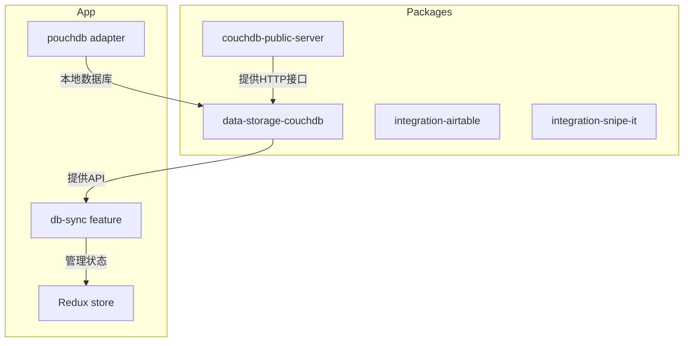
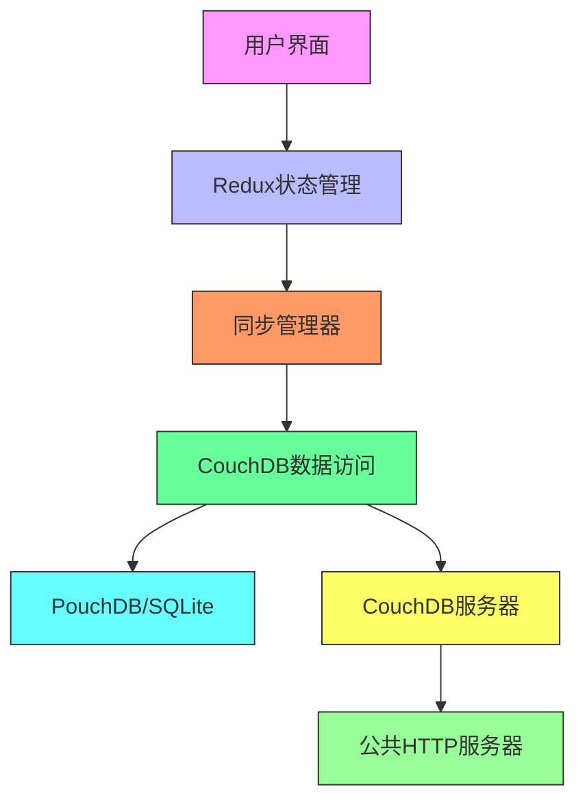
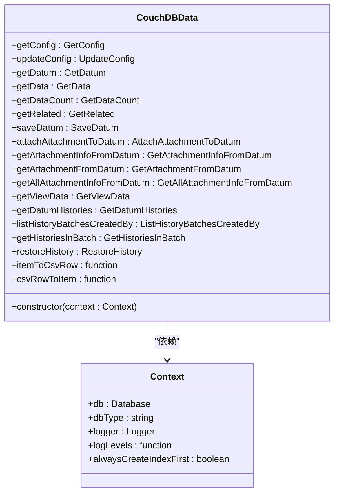
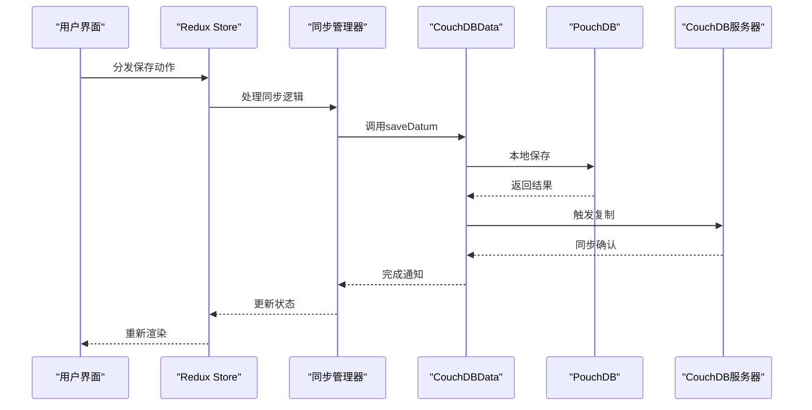
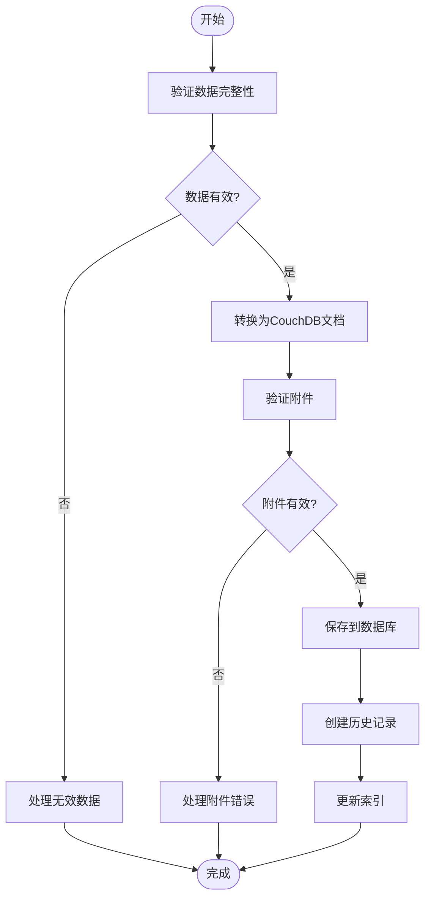
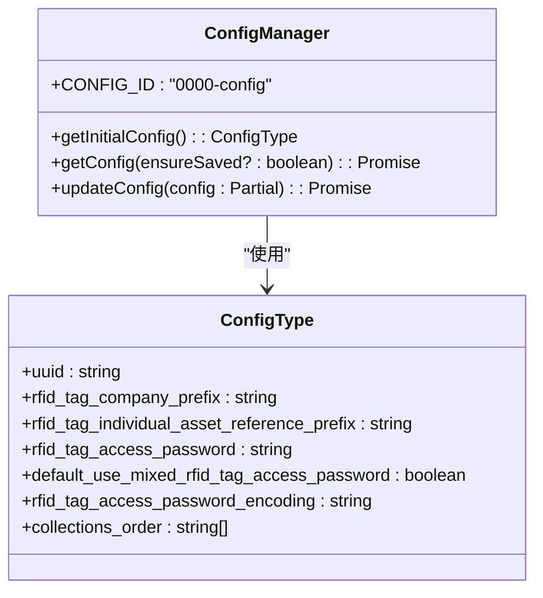
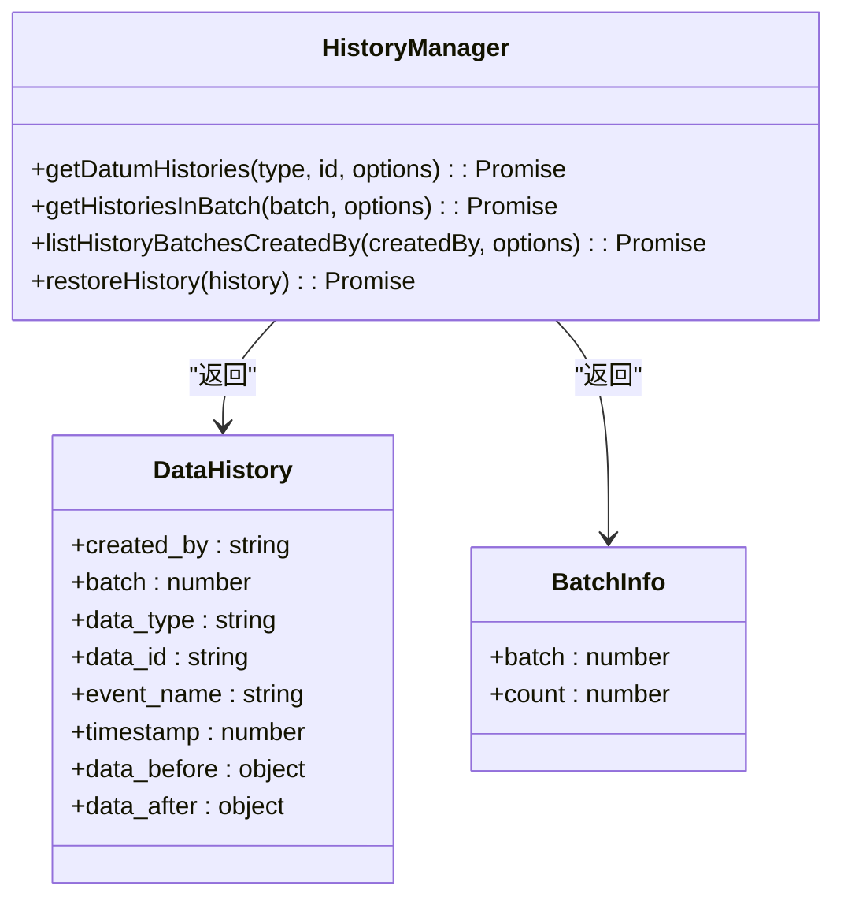
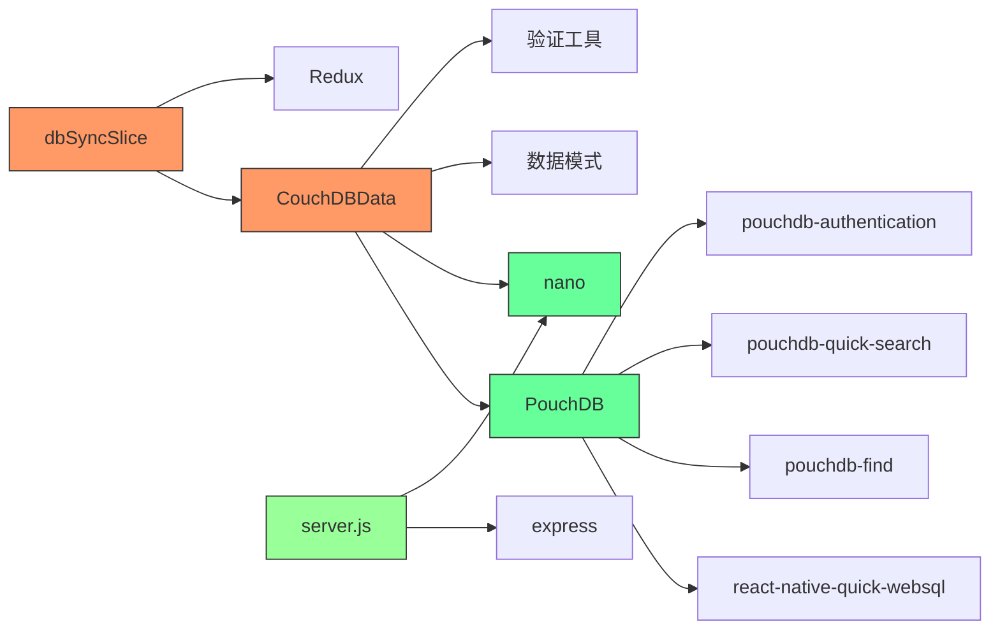

# CouchDB 数据共享

<cite>
**本文档中引用的文件**  
- [CouchDBData.ts](file://packages/data-storage-couchdb/lib/CouchDBData.ts)
- [getSaveDatum.ts](file://packages/data-storage-couchdb/lib/functions/getSaveDatum.ts)
- [getGetData.ts](file://packages/data-storage-couchdb/lib/functions/getGetData.ts)
- [getGetDatum.ts](file://packages/data-storage-couchdb/lib/functions/getGetDatum.ts)
- [getGetRelated.ts](file://packages/data-storage-couchdb/lib/functions/getGetRelated.ts)
- [couchdb-utils.ts](file://packages/data-storage-couchdb/lib/functions/couchdb-utils.ts)
- [getGetConfig.ts](file://packages/data-storage-couchdb/lib/functions/getGetConfig.ts)
- [getUpdateConfig.ts](file://packages/data-storage-couchdb/lib/functions/getUpdateConfig.ts)
- [getGetDatumHistories.ts](file://packages/data-storage-couchdb/lib/functions/getGetDatumHistories.ts)
- [getGetHistoriesInBatch.ts](file://packages/data-storage-couchdb/lib/functions/getGetHistoriesInBatch.ts)
- [getRestoreHistory.ts](file://packages/data-storage-couchdb/lib/functions/getRestoreHistory.ts)
- [getListHistoryBatchesCreatedBy.ts](file://packages/data-storage-couchdb/lib/functions/getListHistoryBatchesCreatedBy.ts)
- [server.js](file://packages/couchdb-public-server/server.js)
- [pouchdb.ts](file://App/app/db/pouchdb.ts)
- [dbSyncSlice.ts](file://App/app/features/db-sync/slice.ts)
</cite>

## 目录
1. [简介](#简介)
2. [项目结构](#项目结构)
3. [核心组件](#核心组件)
4. [架构概述](#架构概述)
5. [详细组件分析](#详细组件分析)
6. [依赖分析](#依赖分析)
7. [性能考虑](#性能考虑)
8. [故障排除指南](#故障排除指南)
9. [结论](#结论)

## 简介
本文档详细介绍了基于CouchDB的数据共享系统，该系统是Inventory应用程序的核心数据管理组件。该系统实现了本地PouchDB数据库与远程CouchDB服务器之间的双向同步，支持数据的分布式存储、版本控制和跨设备共享。系统采用模块化设计，通过TypeScript实现类型安全的数据操作，并利用PouchDB和CouchDB的复制功能实现无缝数据同步。

## 项目结构
Inventory项目采用多包架构，核心数据存储和同步功能位于`packages/data-storage-couchdb`目录中，而CouchDB公共服务器实现位于`packages/couchdb-public-server`目录中。应用程序的同步功能通过Redux状态管理集成在`App/app/features/db-sync`中。

**图源**  
- [CouchDBData.ts](file://packages/data-storage-couchdb/lib/CouchDBData.ts)
- [server.js](file://packages/couchdb-public-server/server.js)
- [dbSyncSlice.ts](file://App/app/features/db-sync/slice.ts)
- [pouchdb.ts](file://App/app/db/pouchdb.ts)

**节源**  
- [CouchDBData.ts](file://packages/data-storage-couchdb/lib/CouchDBData.ts)
- [server.js](file://packages/couchdb-public-server/server.js)
- [dbSyncSlice.ts](file://App/app/features/db-sync/slice.ts)

## 核心组件
系统的核心组件包括CouchDB数据访问层、同步管理器和服务器端接口。`CouchDBData`类提供了统一的数据访问接口，封装了对CouchDB/PouchDB的所有操作。`dbSyncSlice`实现了同步状态的Redux管理，而`couchdb-public-server`提供了安全的公共HTTP接口。

**节源**  
- [CouchDBData.ts](file://packages/data-storage-couchdb/lib/CouchDBData.ts)
- [dbSyncSlice.ts](file://App/app/features/db-sync/slice.ts)
- [server.js](file://packages/couchdb-public-server/server.js)

## 架构概述
系统采用分层架构，从下到上分别为数据库层、数据访问层、业务逻辑层和用户界面层。数据库层使用PouchDB作为本地存储，通过CouchDB协议与远程服务器同步。数据访问层提供类型安全的CRUD操作，业务逻辑层处理数据验证和业务规则，用户界面层通过Redux与数据层交互。

**图源**  
- [CouchDBData.ts](file://packages/data-storage-couchdb/lib/CouchDBData.ts)
- [dbSyncSlice.ts](file://App/app/features/db-sync/slice.ts)
- [pouchdb.ts](file://App/app/db/pouchdb.ts)
- [server.js](file://packages/couchdb-public-server/server.js)

## 详细组件分析

### CouchDB数据访问组件
`CouchDBData`类是数据访问的核心，通过依赖注入模式初始化各种数据操作函数。它提供了类型安全的数据获取、保存、删除和关系查询功能。

**图源**  
- [CouchDBData.ts](file://packages/data-storage-couchdb/lib/CouchDBData.ts)
- [couchdb-utils.ts](file://packages/data-storage-couchdb/lib/functions/couchdb-utils.ts)

**节源**  
- [CouchDBData.ts](file://packages/data-storage-couchdb/lib/CouchDBData.ts)
- [getSaveDatum.ts](file://packages/data-storage-couchdb/lib/functions/getSaveDatum.ts)
- [getGetData.ts](file://packages/data-storage-couchdb/lib/functions/getGetData.ts)

### 数据同步流程
数据同步流程涉及多个步骤，从用户操作到数据持久化再到远程同步。当用户修改数据时，系统首先在本地PouchDB中保存，然后通过CouchDB复制机制同步到远程服务器。

**图源**  
- [CouchDBData.ts](file://packages/data-storage-couchdb/lib/CouchDBData.ts)
- [dbSyncSlice.ts](file://App/app/features/db-sync/slice.ts)
- [pouchdb.ts](file://App/app/db/pouchdb.ts)

### 数据操作组件分析
系统提供了丰富的数据操作功能，包括基本的CRUD操作、数据关系处理、附件管理和历史版本控制。每个操作都经过精心设计，确保数据一致性和完整性。

#### 数据保存流程
数据保存流程包含验证、转换和持久化三个阶段。系统首先验证数据完整性，然后转换为CouchDB文档格式，最后持久化到数据库。

**图源**  
- [getSaveDatum.ts](file://packages/data-storage-couchdb/lib/functions/getSaveDatum.ts)
- [couchdb-utils.ts](file://packages/data-storage-couchdb/lib/functions/couchdb-utils.ts)

**节源**  
- [getSaveDatum.ts](file://packages/data-storage-couchdb/lib/functions/getSaveDatum.ts)
- [getGetDatum.ts](file://packages/data-storage-couchdb/lib/functions/getGetDatum.ts)
- [getGetRelated.ts](file://packages/data-storage-couchdb/lib/functions/getGetRelated.ts)

#### 配置管理组件
配置管理组件负责应用程序的全局设置存储和检索。系统使用特殊的文档ID（0000-config）来存储配置数据，并提供默认配置的生成机制。

**图源**  
- [getGetConfig.ts](file://packages/data-storage-couchdb/lib/functions/getGetConfig.ts)
- [getUpdateConfig.ts](file://packages/data-storage-couchdb/lib/functions/getUpdateConfig.ts)

**节源**  
- [getGetConfig.ts](file://packages/data-storage-couchdb/lib/functions/getGetConfig.ts)
- [getUpdateConfig.ts](file://packages/data-storage-couchdb/lib/functions/getUpdateConfig.ts)

#### 历史记录与恢复组件
系统提供了完整的数据历史记录功能，支持版本追踪和数据恢复。每个数据变更都会生成历史记录，用户可以查看变更历史并恢复到特定版本。

**图源**  
- [getGetDatumHistories.ts](file://packages/data-storage-couchdb/lib/functions/getGetDatumHistories.ts)
- [getGetHistoriesInBatch.ts](file://packages/data-storage-couchdb/lib/functions/getGetHistoriesInBatch.ts)
- [getListHistoryBatchesCreatedBy.ts](file://packages/data-storage-couchdb/lib/functions/getListHistoryBatchesCreatedBy.ts)
- [getRestoreHistory.ts](file://packages/data-storage-couchdb/lib/functions/getRestoreHistory.ts)

**节源**  
- [getGetDatumHistories.ts](file://packages/data-storage-couchdb/lib/functions/getGetDatumHistories.ts)
- [getGetHistoriesInBatch.ts](file://packages/data-storage-couchdb/lib/functions/getGetHistoriesInBatch.ts)
- [getListHistoryBatchesCreatedBy.ts](file://packages/data-storage-couchdb/lib/functions/getListHistoryBatchesCreatedBy.ts)
- [getRestoreHistory.ts](file://packages/data-storage-couchdb/lib/functions/getRestoreHistory.ts)

## 依赖分析
系统依赖关系复杂但组织良好，主要依赖包括PouchDB用于本地存储，nano用于服务器端CouchDB访问，以及各种PouchDB插件提供额外功能。前端应用通过Redux与数据层解耦，确保了良好的可维护性。

**图源**  
- [CouchDBData.ts](file://packages/data-storage-couchdb/lib/CouchDBData.ts)
- [pouchdb.ts](file://App/app/db/pouchdb.ts)
- [server.js](file://packages/couchdb-public-server/server.js)
- [dbSyncSlice.ts](file://App/app/features/db-sync/slice.ts)

**节源**  
- [CouchDBData.ts](file://packages/data-storage-couchdb/lib/CouchDBData.ts)
- [pouchdb.ts](file://App/app/db/pouchdb.ts)
- [server.js](file://packages/couchdb-public-server/server.js)
- [dbSyncSlice.ts](file://App/app/features/db-sync/slice.ts)

## 性能考虑
系统在性能方面进行了多项优化，包括索引自动创建、查询优化和缓存机制。`getGetData`函数实现了智能索引管理，根据查询条件自动创建和使用适当的索引。系统还采用了代理模式来延迟数据验证，提高读取性能。

**节源**  
- [getGetData.ts](file://packages/data-storage-couchdb/lib/functions/getGetData.ts)
- [couchdb-utils.ts](file://packages/data-storage-couchdb/lib/functions/couchdb-utils.ts)

## 故障排除指南
常见问题包括同步失败、索引创建错误和数据验证问题。对于同步问题，应检查网络连接和服务器配置；对于索引问题，确保数据库有适当的权限创建设计文档；对于数据验证问题，检查数据模式和输入数据的兼容性。

**节源**  
- [getSaveDatum.ts](file://packages/data-storage-couchdb/lib/functions/getSaveDatum.ts)
- [getGetData.ts](file://packages/data-storage-couchdb/lib/functions/getGetData.ts)
- [dbSyncSlice.ts](file://App/app/features/db-sync/slice.ts)

## 结论
CouchDB数据共享系统为Inventory应用程序提供了强大而灵活的数据管理能力。通过本地PouchDB和远程CouchDB的结合，系统实现了离线优先的设计理念，同时保证了数据的可靠同步。模块化的设计和类型安全的API使得系统易于维护和扩展，为未来的功能开发奠定了坚实的基础。