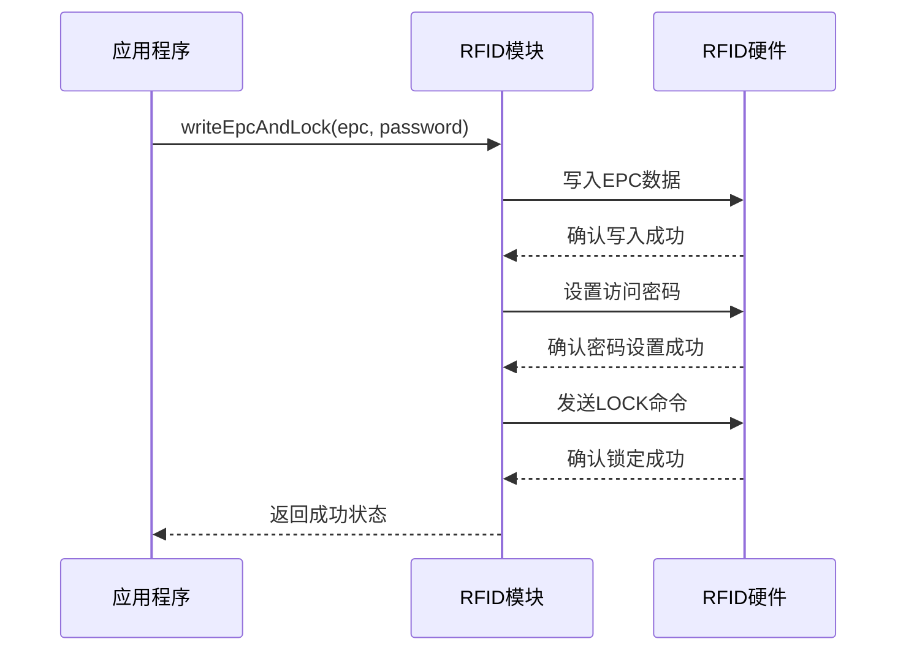

# RFID标签选择

<cite>
**本文档中引用的文件**  
- [README.md](file://Inventory-Docs/rfid/choosing-rfid-tags/README.md)
- [different-kinds-of-rfid-tags.md](file://Inventory-Docs/rfid/choosing-rfid-tags/different-kinds-of-rfid-tags.md)
- [RFIDSheet.tsx](file://App/app/features/rfid/RFIDSheet.tsx)
- [utils.ts](file://App/app/features/rfid/utils.ts)
- [RFIDWithUHFBLEModule.ts](file://App/app/modules/RFIDWithUHFBLEModule.ts)
- [RFIDWithUHFBaseModule.ts](file://App/app/modules/RFIDWithUHFBaseModule.ts)
- [RFIDWithUHFUARTModule.ts](file://App/app/modules/RFIDWithUHFUARTModule.ts)
- [rfid-overview.md](file://Inventory-Docs/rfid/rfid-overview.md)
</cite>

## 目录
1. [引言](#引言)
2. [UHF RFID标签](#uhf-rfid标签)
3. [选择兼容的RFID芯片](#选择兼容的rfid芯片)
4. [推荐的RFID芯片](#推荐的rfid芯片)
5. [金属表面专用RFID标签](#金属表面专用rfid标签)
6. [其他类型的RFID标签](#其他类型的rfid标签)
7. [RFID标签写入与锁定机制](#rfid标签写入与锁定机制)
8. [结论与建议](#结论与建议)

## 引言

在使用库存管理应用时，选择合适的RFID标签对于确保系统的效率和可靠性至关重要。本指南旨在帮助用户了解如何为Inventory应用选择最合适的RFID标签。通过正确选择标签，可以实现更高效的资产追踪、减少误读率，并提高整体操作的准确性。

Inventory应用专为配合UHF（超高频）RFID标签设计，这些标签与HF（高频）或其他类型的RFID标签不兼容。因此，在购买RFID标签时，必须确认所选的是UHF类型。此外，标签的性能还取决于其内置的RFID芯片，不同的芯片支持的功能也有所不同，特别是在写入和锁定功能方面。

本文档将详细介绍选择RFID标签的关键因素，包括推荐的芯片型号、适用于金属或液体环境的特殊标签，以及如何确保标签的安全性和兼容性。

**Section sources**
- [README.md](file://Inventory-Docs/rfid/choosing-rfid-tags/README.md#L1-L63)

## UHF RFID标签

Inventory应用专为配合UHF（超高频）RFID标签设计。这些标签与HF（高频）或其他类型的RFID标签不同，不能互换使用。在购买RFID标签时，请务必确认您选择的是正确的UHF类型。

UHF标签设计用于远距离读取，更适合在各种环境中进行资产追踪。它们能够在几米范围内被读取，这使得它们非常适合仓库、物流中心和其他需要快速扫描大量物品的场景。

需要注意的是，标准RFID标签在金属表面或靠近金属、液体容器上可能无法正常工作。这是因为金属或液体会干扰RFID标签天线的无线电波能量，导致信号减弱甚至完全失效。为了克服这些问题，市场上有专门设计的“金属表面专用RFID标签”或“抗金属RFID标签”，这些标签可以在金属或液体环境中有效工作。

**Section sources**
- [README.md](file://Inventory-Docs/rfid/choosing-rfid-tags/README.md#L7-L13)
- [rfid-overview.md](file://Inventory-Docs/rfid/rfid-overview.md#L5-L8)

## 选择兼容的RFID芯片

RFID标签有多种形状和尺寸，但其功能取决于所配备的RFID芯片。选择合适的芯片对于确保标签的兼容性和安全性至关重要。

### EPC内存库

您需要选择具有至少96位可写EPC内存库的UHF RFID标签。EPC（电子产品代码）是用于唯一标识每个标签的核心数据区域。确保EPC内存库足够大以存储所需的信息。

### LOCK命令

在写入RFID标签的过程中，Inventory应用会使用非永久性LOCK命令（ISO 18000-6C LOCK）来锁定标签，防止未经授权或意外的写入。并非所有RFID芯片都支持非永久性LOCK命令，因此建议选择支持该功能的芯片以确保安全性和兼容性。

如果标签不支持非永久性LOCK命令，虽然仍可成功写入EPC数据并使其可扫描和搜索，但存在以下风险：
1. 标签仍然可以被任何人读写，其他人可能会无意或故意覆盖您的EPC数据，导致物品丢失追踪。
2. 您可能会在试图写入或擦除另一个标签时意外写入错误的标签，造成混乱和混乱——原始物品可能失去其EPC而变得不可追踪，同时一个物品可能因拥有另一个物品的EPC而被误认为是另一个物品。

某些RFID芯片可能声称支持LOCK命令，但实际上仅支持永久性LOCK。一旦永久锁定，这些标签将无法再次解锁，成为永久只读标签。目前Inventory应用不支持此类标签，并将其视为不支持LOCK命令的标签。

**Section sources**
- [README.md](file://Inventory-Docs/rfid/choosing-rfid-tags/README.md#L15-L36)

## 推荐的RFID芯片

以下RFID标签芯片已经过测试，并确认与Inventory应用配合良好：

- **NXP UCODE 8**
- **Impinj Monza R6-P**
- **Impinj Monza 730**

这些芯片不仅支持96位以上的EPC内存库，还支持非永久性LOCK命令，确保了标签的安全性和兼容性。选择这些芯片的标签可以最大限度地减少误读和数据篡改的风险。

### 不推荐的芯片

以下芯片似乎无法与Inventory应用正常工作：

- **NXP UCODE 7**
- **NXP UCODE 9** - 该芯片似乎仅支持永久性LOCK
- **NXP UCODE 9xe**

这些芯片可能存在兼容性问题，尤其是NXP UCODE 9仅支持永久性LOCK，这会导致标签一旦锁定就无法再修改，不符合Inventory应用的需求。

**Section sources**
- [README.md](file://Inventory-Docs/rfid/choosing-rfid-tags/README.md#L38-L54)

## 金属表面专用RFID标签

标准RFID标签在金属表面、靠近金属或装有液体的容器上可能无法正常工作。这是因为金属或液体会使标签天线的无线电波能量失谐或吸收，从而降低或消除其通信能力。为了解决这些问题，专门设计的“金属表面专用RFID标签”或“抗金属RFID标签”可以在这些条件下有效工作。

尽管金属表面专用RFID标签能够在金属或液体附近工作，但它们通常比普通RFID标签价格更高。根据具体应用场景选择合适的标签类型非常重要。

### 柔性金属表面RFID标签

这些标签在外观和功能上类似于纸质贴纸标签，但厚度更大。它们包含特殊层，允许标签在附着于金属表面时正常运行。适用于传统贴纸标签因金属或液体干扰而失效的物品。

### 硬质PCB RFID标签

这些标签由刚性PCB材料制成，非常耐用。有多种安装方法可供选择，可根据具体需求进行定制：
- **螺丝固定**：许多硬质PCB RFID标签带有预钻孔，可直接用螺丝固定到资产上。
- **VHB胶带**：适用于光滑、非多孔表面的多功能快速解决方案。VHB（高强度粘合）胶带确保牢固粘附，适合无法钻孔或不希望钻孔的资产。
- **热缩管**：对于无法用螺丝固定或没有平坦粘贴表面的物品，热缩管是一种有效的附着方法。热缩管还可以用来加固VHB胶带或螺丝固定的RFID标签，平滑边缘，减少脱落的可能性，或提升外观。

**Section sources**
- [README.md](file://Inventory-Docs/rfid/choosing-rfid-tags/README.md#L56-L58)
- [different-kinds-of-rfid-tags.md](file://Inventory-Docs/rfid/choosing-rfid-tags/different-kinds-of-rfid-tags.md#L29-L57)

## 其他类型的RFID标签

市场上有多种UHF RFID标签，每种都针对特定的使用场景和环境设计。

### 透明贴纸标签

最常见的RFID标签类型，成本效益高，每片价格通常在0.1美元左右或更低。这些粘性标签可以贴在任何平坦表面上，耐水溅和酒精喷雾。提供多种尺寸，可根据物品选择最适合的尺寸。

### 纸质贴纸标签

具有可打印表面，可以使用热转印标签打印机在标签上打印物品信息，如名称、资产ID、存储单元、条形码或二维码，便于识别物品或扫描标签以获取更多信息或进行管理。提供多种尺寸，可根据物品选择最适合的尺寸。

最常见的纸张层类型是涂层纸或合成纸。使用合成纸层和合适的碳带时，标签可以抵抗水溅和酒精擦拭。

**提示**：建议在粘贴RFID标签前用酒精擦拭表面。塑料制品生产过程中常使用滑移添加剂以减少摩擦和防止粘连，但这些添加剂可能会影响标签的粘附效果。酒精可以去除残留的滑移添加剂，特别是在拉链袋上。

### 电缆标签

虽然通常用作零售业的珠宝标签，但这些标签也是标记电缆的好选择。当使用PVC或合成纸制成的电缆标签并配合合适的碳带时，标签可以承受水溅和酒精擦拭。

**Section sources**
- [different-kinds-of-rfid-tags.md](file://Inventory-Docs/rfid/choosing-rfid-tags/different-kinds-of-rfid-tags.md#L5-L63)

## RFID标签写入与锁定机制

Inventory应用通过调用底层模块实现RFID标签的写入和锁定功能。核心逻辑位于`RFIDWithUHFBaseModule.ts`文件中，其中定义了`writeEpcAndLock`函数，负责将EPC数据写入标签并设置访问密码及锁定状态。

**Diagram sources**
- [RFIDWithUHFBaseModule.ts](file://App/app/modules/RFIDWithUHFBaseModule.ts#L260-L348)
- [RFIDSheet.tsx](file://App/app/features/rfid/RFIDSheet.tsx#L745-L784)

该过程包括三个主要步骤：
1. **写入EPC数据**：将指定的EPC数据写入标签的EPC内存库。
2. **设置访问密码**：将新的访问密码写入标签的保留内存库，确保后续操作需要密码验证。
3. **锁定标签**：发送LOCK命令，锁定标签的EPC、访问和kill密码区域，防止未经授权的修改。

此机制依赖于RFID芯片对非永久性LOCK命令的支持。如果芯片不支持此功能，写入操作仍可成功，但无法锁定标签，存在数据被篡改的风险。

**Section sources**
- [RFIDWithUHFBaseModule.ts](file://App/app/modules/RFIDWithUHFBaseModule.ts#L260-L348)
- [RFIDSheet.tsx](file://App/app/features/rfid/RFIDSheet.tsx#L745-L784)

## 结论与建议

选择合适的RFID标签是确保Inventory应用高效运行的关键。建议优先选择支持非永久性LOCK命令的芯片，如NXP UCODE 8、Impinj Monza R6-P或Impinj Monza 730。这些芯片不仅能提供足够的EPC内存空间，还能确保标签的安全性，防止未经授权的写入。

对于在金属或液体环境中使用的标签，应选择专门设计的金属表面专用RFID标签，尽管成本较高，但能确保在复杂环境下的可靠读取。此外，透明贴纸标签和纸质贴纸标签适用于大多数常规场景，成本低廉且易于使用。

最后，务必在粘贴标签前清洁表面，特别是对于塑料制品，使用酒精去除滑移添加剂，以确保标签牢固粘附。通过遵循这些建议，您可以最大限度地提高RFID系统的性能和可靠性。

**Section sources**
- [README.md](file://Inventory-Docs/rfid/choosing-rfid-tags/README.md#L1-L63)
- [different-kinds-of-rfid-tags.md](file://Inventory-Docs/rfid/choosing-rfid-tags/different-kinds-of-rfid-tags.md#L1-L64)