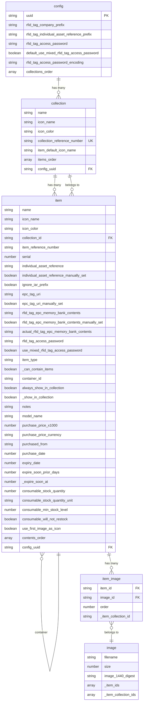
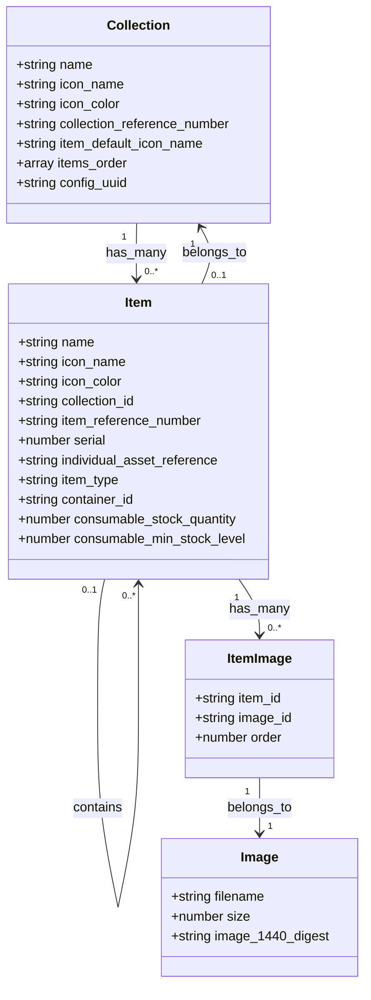
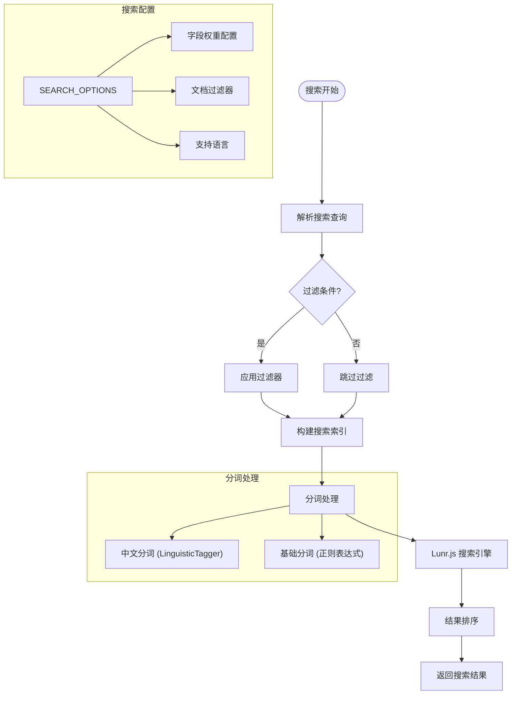

# 基本概念

<cite>
**本文档中引用的文件**  
- [basic-concepts.md](file://Inventory-Docs/guides/basic-concepts.md)
- [generated-schema.ts](file://Data/lib/generated-schema.ts)
- [relations.ts](file://Data/lib/relations.ts)
- [types.ts](file://Data/lib/types.ts)
- [SEARCH_OPTIONS.ts](file://App/app/features/inventory/consts/SEARCH_OPTIONS.ts)
</cite>

## 目录
1. [简介](#简介)
2. [核心数据模型](#核心数据模型)
3. [项目与集合](#项目与集合)
4. [项目类型](#项目类型)
5. [个体资产参考(IAR)](#个体资产参考iar)
6. [数据关系](#数据关系)
7. [搜索机制](#搜索机制)

## 简介

Inventory 是一款用于家庭和企业的 RFID 资产管理解决方案。通过结合 RFID 技术的库存管理，可以轻松跟踪物品可用性、防止丢失并在需要时定位物品。本应用的核心概念围绕项目（Item）和集合（Collection）构建，通过 RFID 技术实现高效的资产追踪和管理。

**Section sources**
- [basic-concepts.md](file://Inventory-Docs/guides/basic-concepts.md#L1-L68)

## 核心数据模型

应用的核心数据结构基于 TypeScript 和 Zod 模式定义，主要包含配置、集合、项目等数据类型。数据模型通过 PouchDB/CouchDB 进行本地存储和同步，支持完整的 CRUD 操作和数据验证。



**Diagram sources**
- [generated-schema.ts](file://Data/lib/generated-schema.ts#L5-L130)

## 项目与集合

在 Inventory 应用中，**项目**（Item）代表您拥有或管理的单个资产。每个项目都可以详细记录购买日期、价格、供应商、有效期等信息。

**项目按集合进行分类**，集合类似于广义的类别或文件夹。集合帮助您将项目组织成有意义的组。例如，您可能有名为"书籍"、"工具"或"办公用品"的集合。

每个项目必须属于一个集合，因此在添加项目之前需要创建必要的集合。

**Section sources**
- [basic-concepts.md](file://Inventory-Docs/guides/basic-concepts.md#L3-L10)

## 项目类型

Inventory 中的项目可以有不同类型的，每种类型都针对不同的需求：

1. **普通项目**：  
   这是标准资产，如办公椅、书籍或锤子。

2. **带部件的项目**：  
   有些项目附带额外的部件。例如，标签打印机可能有电源适配器和 USB 电缆。这种类型允许您将这些部件嵌套在主项目下，使每个部件都可以单独跟踪。

3. **容器**：  
   想象一个工具箱或抽屉。这种类型允许您嵌套通常存储在另一个项目内的项目，非常适合跟踪分组资产。

4. **消耗品**：  
   专为定期使用和补充的物品设计，如电池、水过滤器、灯泡、纸巾、电子模块或 3D 打印耗材卷。它支持监控数量和设置最低库存水平，有助于及时补货和库存控制。

**Section sources**
- [basic-concepts.md](file://Inventory-Docs/guides/basic-concepts.md#L11-L25)

## 个体资产参考(IAR)

个体资产参考（IAR）是 Inventory 应用中资产的可选唯一标识符。它为唯一标识项目提供了便捷的方式，可用于二维码、条形码或 RFID 标签中。

项目必须具有 IAR 才能进行 RFID 标签化，因为 IAR 构成了编码到项目 RFID 标签中的电子产品代码（EPC）的重要部分。

### IAR 结构

默认情况下，IAR 由三部分组成：

* **集合参考号（4 位数字）**：从项目的集合参考号派生，这个 4 位代码将项目分类到特定集合中。
* **项目参考号（6 位数字）**：分配给每个项目类型的唯一代码，可以手动设置或随机生成。
* **序列号（4 位数字）**：标识同一项目类型内的各个单元。默认为 0，您可以自由使用序列号：
  * 使用递增的序列号为同一型号添加更多单元，共享项目参考号。
  * 对于特定资产的配件或部件，使用相同的项目参考号，仅通过序列号区分。
  * 对于应存储在特定容器（如工具箱）中的项目，使用相同的项目参考号。

示例：`1234.123456.0000`

```
1234.123456.0000
╰┬─╯ ╰┬───╯ ╰┬─╯
 │    │     序列号
 │    │
 │   项目参考号
 │
集合参考号
```

**Section sources**
- [basic-concepts.md](file://Inventory-Docs/guides/basic-concepts.md#L27-L54)

## 数据关系

应用中的数据实体通过明确定义的关系相互关联，这些关系在代码中通过类型系统严格定义。



**Diagram sources**
- [relations.ts](file://Data/lib/relations.ts#L20-L43)
- [generated-schema.ts](file://Data/lib/generated-schema.ts#L21-L93)

## 搜索机制

应用实现了基于 Lunr.js 的全文搜索功能，支持多语言搜索（中文和英文）。搜索索引针对不同的使用场景进行了优化，包括默认搜索、按集合搜索、仅项目搜索和作为容器的项目搜索。



**Diagram sources**
- [SEARCH_OPTIONS.ts](file://App/app/features/inventory/consts/SEARCH_OPTIONS.ts#L1-L69)
- [pouchdb.ts](file://App/app/db/pouchdb.ts#L14-L79)