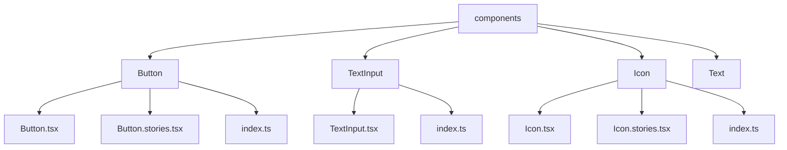

# UI组件开发指南

<cite>
**本文档中引用的文件**  
- [theme.ts](file://App/app/theme.ts)
- [App.tsx](file://App/app/App.tsx)
- [StorybookUIRoot.tsx](file://App/app/StorybookUIRoot.tsx)
- [Button.tsx](file://App/app/components/Button/Button.tsx)
- [Button.stories.tsx](file://App/app/components/Button/Button.stories.tsx)
- [TextInput.tsx](file://App/app/components/TextInput/TextInput.tsx)
- [Text.tsx](file://App/app/components/Text/Text.tsx)
- [Icon.tsx](file://App/app/components/Icon/Icon.tsx)
- [useColors.ts](file://App/app/hooks/useColors.ts)
- [useTheme.ts](file://App/app/hooks/useTheme.ts)
- [index.ts](file://App/app/components/Button/index.ts)
</cite>

## 目录
1. [简介](#简介)
2. [项目结构与组件组织](#项目结构与组件组织)
3. [设计系统与主题配置](#设计系统与主题配置)
4. [可复用组件结构规范](#可复用组件结构规范)
5. [TypeScript接口定义](#typescript接口定义)
6. [组件导出机制](#组件导出机制)
7. [Storybook故事编写](#storybook故事编写)
8. [无障碍访问最佳实践](#无障碍访问最佳实践)
9. [跨平台兼容性处理](#跨平台兼容性处理)
10. [具体组件实现示例](#具体组件实现示例)
11. [常见错误与性能优化](#常见错误与性能优化)

## 简介
本指南旨在为Inventory项目提供完整的React Native UI组件开发规范。文档详细说明了如何遵循设计系统创建可复用的UI组件，包括主题配置、TypeScript类型定义、Storybook集成、无障碍访问和跨平台兼容性等关键方面。通过遵循本指南，开发者可以确保UI组件的一致性、可维护性和高质量。

## 项目结构与组件组织
项目采用功能模块化的组件组织方式，所有UI组件集中存放在`App/app/components`目录下。每个组件都有独立的文件夹，包含组件实现文件（.tsx）、Storybook故事文件（.stories.tsx）和导出文件（index.ts）。这种结构提高了代码的可维护性和可发现性。



**图源**  
- [Button](file://App/app/components/Button)
- [TextInput](file://App/app/components/TextInput)
- [Icon](file://App/app/components/Icon)

**本节来源**  
- [App.tsx](file://App/app/App.tsx#L1-L223)
- [project_structure](file://project_structure)

## 设计系统与主题配置
项目基于Material Design 3（MD3）构建设计系统，通过`theme.ts`文件定义主题配置。主题系统支持明暗模式切换，并继承自`react-native-paper`的MD3主题。开发者应使用主题中的颜色和样式变量，确保UI一致性。

```typescript
// theme.ts
import { MD3DarkTheme, MD3LightTheme } from 'react-native-paper';

const baseTheme = {
  version: 3,
} as const;

export const lightTheme = {
  ...MD3LightTheme,
  ...baseTheme,
  colors: {
    ...MD3LightTheme.colors,
  },
} as const;

export const darkTheme = {
  ...MD3DarkTheme,
  ...baseTheme,
  colors: {
    ...MD3DarkTheme.colors,
  },
} as const;
```

颜色系统通过`useColors`钩子提供，包含平台特定的颜色变量和语义化颜色命名。组件应优先使用这些预定义颜色而非硬编码值。

**本节来源**  
- [theme.ts](file://App/app/theme.ts#L1-L29)
- [useColors.ts](file://App/app/hooks/useColors.ts#L1-L197)
- [App.tsx](file://App/app/App.tsx#L31-L42)

## 可复用组件结构规范
UI组件应遵循单一职责原则，保持功能专注和可复用性。组件结构应清晰分离关注点，使用函数式组件和Hooks。每个组件文件夹应包含：
- 主组件文件（Component.tsx）：实现核心功能
- Storybook文件（Component.stories.tsx）：提供可视化测试用例
- 导出文件（index.ts）：统一导出组件

组件应避免直接访问全局状态，而是通过props接收数据和回调函数。复杂状态管理应使用自定义Hooks封装。

**本节来源**  
- [Button.tsx](file://App/app/components/Button/Button.tsx#L1-L195)
- [TextInput.tsx](file://App/app/components/TextInput/TextInput.tsx#L1-L3)
- [Text.tsx](file://App/app/components/Text/Text.tsx#L1-L14)

## TypeScript接口定义
所有组件必须使用TypeScript定义props接口，确保类型安全和开发体验。接口应继承自基础组件的props类型，并使用`Omit`排除不需要的属性。对于复杂props，应定义详细的类型结构。

```typescript
// Button组件的props定义
type Props = { title?: string } & Omit<
  React.ComponentProps<typeof PaperButton>,
  'children'
> & {
    children?: (p: {
      color: string;
      textProps: Partial<React.ComponentProps<typeof Text>>;
      iconProps: Partial<React.ComponentProps<typeof Icon>>;
    }) => JSX.Element;
  };
```

类型定义应使用`readonly`和`as const`确保不可变性，提高性能和类型推断准确性。枚举类型和联合类型应优先于字符串字面量。

**本节来源**  
- [Button.tsx](file://App/app/components/Button/Button.tsx#L18-L27)
- [Icon.tsx](file://App/app/components/Icon/Icon.tsx#L17-L27)
- [useTheme.ts](file://App/app/hooks/useTheme.ts#L1-L3)

## 组件导出机制
组件通过`index.ts`文件统一导出，实现简洁的导入路径。导出文件应使用默认导出，保持API一致性。这种模式支持按需加载和树摇优化。

```typescript
// components/Button/index.ts
import Button from './Button';
export default Button;
```

导入时可使用别名路径`@app/components/Button`，这在`tsconfig.json`中通过paths配置实现。统一的导出机制简化了组件的使用和维护。

**本节来源**  
- [index.ts](file://App/app/components/Button/index.ts#L1-L3)
- [tsconfig.json](file://App/tsconfig.json#L17-L19)

## Storybook故事编写
所有UI组件必须配备Storybook故事，用于可视化测试和文档化。故事文件（.stories.tsx）应包含基础用例、不同状态和交互场景。使用args和argTypes实现可交互的控件面板。

```typescript
// Button.stories.tsx
export default {
  title: '[B] Button',
  component: Button,
  args: {
    title: 'Hello world',
    mode: 'text',
  },
  argTypes: {
    mode: {
      options: ['text', 'outlined', 'contained', 'elevated', 'contained-tonal'],
      control: { type: 'select' },
    },
  },
};
```

每个故事应覆盖主要使用场景，包括不同模式、状态（加载、禁用）、图标组合等。使用`StorybookSection`和`StorybookStoryContainer`组织故事布局。

**本节来源**  
- [Button.stories.tsx](file://App/app/components/Button/Button.stories.tsx#L1-L170)
- [StorybookUIRoot.tsx](file://App/app/StorybookUIRoot.tsx#L1-L107)

## 无障碍访问最佳实践
组件开发必须考虑无障碍访问（a11y），确保所有用户都能有效使用应用。关键实践包括：
- 为交互元素提供有意义的`accessibilityLabel`
- 正确设置`accessibilityRole`描述元素功能
- 确保足够的颜色对比度满足WCAG标准
- 支持屏幕阅读器的导航和操作

对于自定义组件，应继承基础组件的无障碍属性，并根据需要扩展。使用`react-native`的无障碍API确保跨平台一致性。

**本节来源**  
- [Button.tsx](file://App/app/components/Button/Button.tsx#L29-L195)
- [Text.tsx](file://App/app/components/Text/Text.tsx#L9-L13)
- [Icon.tsx](file://App/app/components/Icon/Icon.tsx#L29-L207)

## 跨平台兼容性处理
项目需要同时支持iOS和Android平台，组件应处理平台差异。使用`Platform.OS`进行条件渲染，适配不同平台的设计规范。例如，Button组件在iOS上使用`TouchableHighlight`，在Android上使用`PaperButton`。

```typescript
if (Platform.OS === 'ios') {
  // iOS特定实现
  return <TouchableHighlight />;
}
// Android和其他平台实现
return <PaperButton />;
```

对于平台特定的UI模式（如导航栏、弹窗），应使用平台原生组件或适配器。确保在两种平台上都提供一致的用户体验。

**本节来源**  
- [Button.tsx](file://App/app/components/Button/Button.tsx#L42-L115)
- [App.tsx](file://App/app/App.tsx#L56-L103)
- [StorybookUIRoot.tsx](file://App/app/StorybookUIRoot.tsx#L46-L94)

## 具体组件实现示例
### Button组件实现
Button组件封装了`react-native-paper`的Button，适配iOS人机界面指南。在iOS上使用系统风格的按钮，在Android上保持Material Design风格。支持多种模式（text、outlined、contained等）和图标组合。

```typescript
// 支持函数子组件模式，允许自定义渲染
<Button>
  {({ textProps, iconProps }) => (
    <>
      <Icon {...iconProps} name="checklist" />
      <Text {...textProps}>Title</Text>
    </>
  )}
</Button>
```

### TextInput组件实现
TextInput组件直接导出`react-native-paper`的TextInput，保持Material Design输入框的一致性。通过主题系统继承样式，支持各种输入类型和验证状态。

**本节来源**  
- [Button.tsx](file://App/app/components/Button/Button.tsx#L29-L195)
- [TextInput.tsx](file://App/app/components/TextInput/TextInput.tsx#L1-L3)
- [Button.stories.tsx](file://App/app/components/Button/Button.stories.tsx#L37-L170)

## 常见错误与性能优化
### 常见错误
- 避免在render方法中创建新的函数或对象，导致不必要的重渲染
- 不要硬编码颜色值，应使用主题或`useColors`提供的变量
- 确保所有交互元素都有适当的触摸区域（至少44x44pt）
- 避免在组件内部直接访问全局状态，破坏可复用性

### 性能优化
- 使用`React.memo`对纯组件进行记忆化
- 避免在JSX中内联样式对象，提取到`StyleSheet.create`
- 对长列表使用`FlatList`而非`ScrollView`
- 合理使用`useCallback`和`useMemo`缓存函数和计算值

通过遵循这些最佳实践，可以创建高性能、可维护的UI组件。

**本节来源**  
- [Button.tsx](file://App/app/components/Button/Button.tsx#L168-L192)
- [useColors.ts](file://App/app/hooks/useColors.ts#L6-L197)
- [commonStyles.ts](file://App/app/utils/commonStyles.ts)