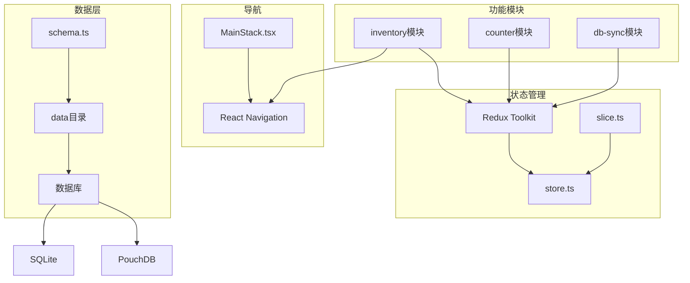
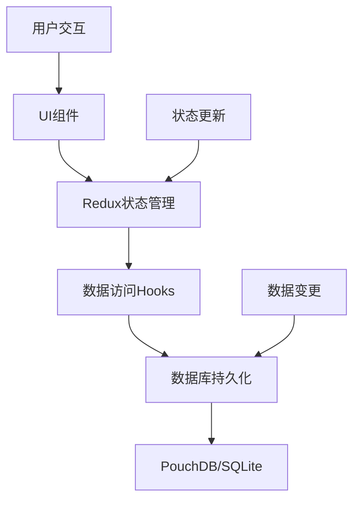
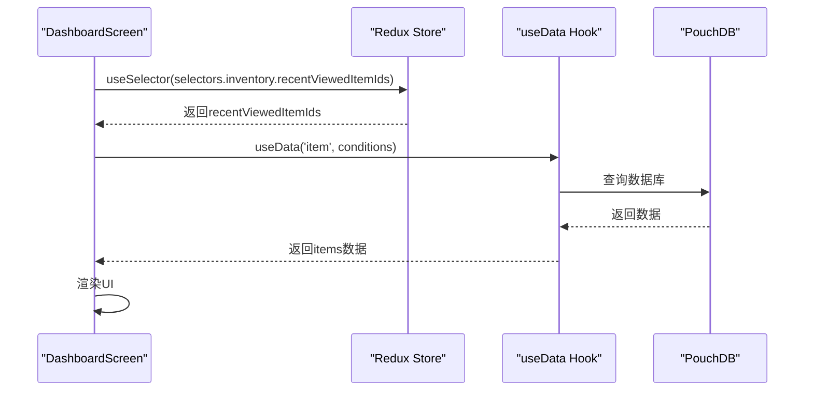
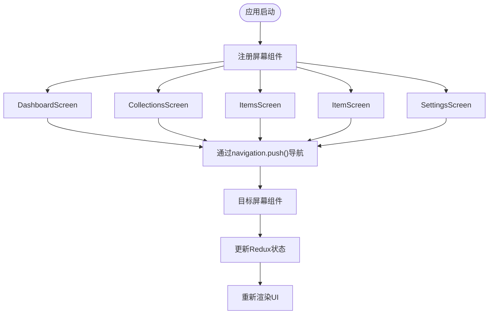
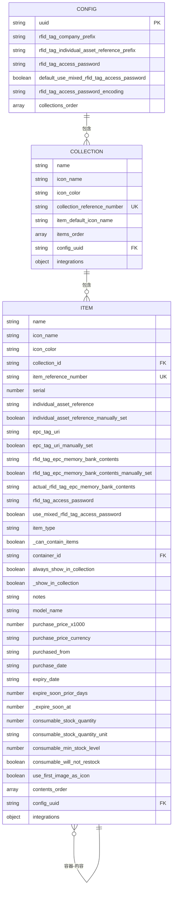
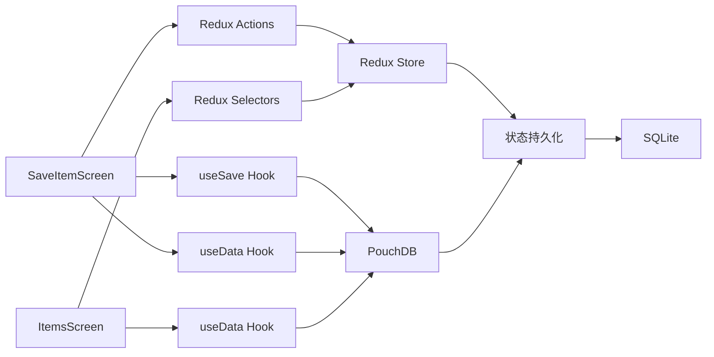

# 功能模块开发流程

<cite>
**本文档引用的文件**  
- [slice.ts](file://App/app/features/inventory/slice.ts)
- [DashboardScreen.tsx](file://App/app/features/inventory/screens/DashboardScreen.tsx)
- [MainStack.tsx](file://App/app/navigation/MainStack.tsx)
- [schema.ts](file://App/app/data/schema.ts)
- [pouchdb.ts](file://App/app/db/pouchdb.ts)
- [SaveItemScreen.tsx](file://App/app/features/inventory/screens/SaveItemScreen.tsx)
- [ItemsScreen.tsx](file://App/app/features/inventory/screens/ItemsScreen.tsx)
- [ItemListItem.tsx](file://App/app/features/inventory/components/ItemListItem.tsx)
- [useCheckItems.tsx](file://App/app/features/inventory/hooks/useCheckItems.tsx)
- [generated-schema.ts](file://Data/lib/generated-schema.ts)
- [csv-import.ts](file://App/app/features/inventory/utils/csv-import.ts)
- [store.ts](file://App/app/redux/store.ts)
</cite>

## 目录
1. [简介](#简介)
2. [项目结构概览](#项目结构概览)
3. [核心组件分析](#核心组件分析)
4. [架构概览](#架构概览)
5. [详细组件分析](#详细组件分析)
6. [依赖关系分析](#依赖关系分析)
7. [性能考虑](#性能考虑)
8. [故障排除指南](#故障排除指南)
9. [结论](#结论)

## 简介
本文档详细说明了如何基于Redux Toolkit和React Navigation在库存管理应用中开发新的功能模块。以inventory功能模块为例，文档涵盖了从状态管理、UI组件创建、导航集成到数据持久化的完整开发流程。通过“资产追踪”功能的开发示例，展示了如何从零开始添加新功能。

## 项目结构概览
项目采用功能模块化架构，主要分为以下几个核心目录：
- `App/app/features/`: 功能模块目录，每个功能模块（如inventory、counter等）包含自己的slice、screens和组件
- `App/app/navigation/`: 导航配置，包含主堆栈导航器
- `App/app/redux/`: Redux状态管理，包含store和通用工具
- `App/app/data/`: 数据层，包含数据模型、schema和数据访问hooks
- `App/app/db/`: 数据库层，包含PouchDB和SQLite的配置和工具



**图表来源**
- [MainStack.tsx](file://App/app/navigation/MainStack.tsx#L1-L361)
- [slice.ts](file://App/app/features/inventory/slice.ts#L1-L53)
- [pouchdb.ts](file://App/app/db/pouchdb.ts#L1-L102)

**章节来源**
- [MainStack.tsx](file://App/app/navigation/MainStack.tsx#L1-L361)
- [project_structure](file://project_structure#L1-L1000)

## 核心组件分析
功能模块开发的核心组件包括Redux slice、屏幕组件、导航配置和数据模型。这些组件共同构成了一个完整功能模块的基础架构。

**章节来源**
- [slice.ts](file://App/app/features/inventory/slice.ts#L1-L53)
- [DashboardScreen.tsx](file://App/app/features/inventory/screens/DashboardScreen.tsx#L1-L514)

## 架构概览
系统采用分层架构，从上到下分为UI层、状态管理层、数据访问层和持久化层。这种架构确保了关注点分离，提高了代码的可维护性和可测试性。



**图表来源**
- [slice.ts](file://App/app/features/inventory/slice.ts#L1-L53)
- [store.ts](file://App/app/redux/store.ts#L1-L124)
- [pouchdb.ts](file://App/app/db/pouchdb.ts#L1-L102)

## 详细组件分析

### Redux状态管理分析
Redux Toolkit是本项目状态管理的核心。通过createSlice创建的slice包含了状态定义、reducer逻辑和actions。

```mermaid
classDiagram
class InventoryState {
+Array<string> recentViewedItemIds
}
class inventorySlice {
+string name
+InventoryState initialState
+reducers : {
addRecentViewedItemId,
clearRecentViewedItemId,
reset
}
+actions
+selectors
}
class PersistableReducer {
+dehydrate(state)
+rehydrate(dehydratedState)
}
inventorySlice --> InventoryState : "使用"
inventorySlice --> PersistableReducer : "实现"
```

**图表来源**
- [slice.ts](file://App/app/features/inventory/slice.ts#L1-L53)

**章节来源**
- [slice.ts](file://App/app/features/inventory/slice.ts#L1-L53)

### 屏幕组件分析
屏幕组件通过React Navigation与Redux状态连接，实现UI与状态的双向绑定。



**图表来源**
- [DashboardScreen.tsx](file://App/app/features/inventory/screens/DashboardScreen.tsx#L1-L514)
- [slice.ts](file://App/app/features/inventory/slice.ts#L1-L53)

### 导航集成分析
主导航栈（MainStack）负责注册所有功能模块的屏幕，确保路由正确配置。



**图表来源**
- [MainStack.tsx](file://App/app/navigation/MainStack.tsx#L1-L361)

**章节来源**
- [MainStack.tsx](file://App/app/navigation/MainStack.tsx#L1-L361)

### 数据模型与持久化分析
数据模型通过Zod schema定义，数据持久化通过PouchDB实现，支持离线存储和同步。



**图表来源**
- [generated-schema.ts](file://Data/lib/generated-schema.ts#L1-L133)
- [pouchdb.ts](file://App/app/db/pouchdb.ts#L1-L102)

**章节来源**
- [generated-schema.ts](file://Data/lib/generated-schema.ts#L1-L133)
- [pouchdb.ts](file://App/app/db/pouchdb.ts#L1-L102)

## 依赖关系分析
项目各组件之间的依赖关系清晰，遵循单向数据流原则。



**图表来源**
- [SaveItemScreen.tsx](file://App/app/features/inventory/screens/SaveItemScreen.tsx#L1-L800)
- [ItemsScreen.tsx](file://App/app/features/inventory/screens/ItemsScreen.tsx#L1-L158)
- [store.ts](file://App/app/redux/store.ts#L1-L124)

**章节来源**
- [SaveItemScreen.tsx](file://App/app/features/inventory/screens/SaveItemScreen.tsx#L1-L800)
- [ItemsScreen.tsx](file://App/app/features/inventory/screens/ItemsScreen.tsx#L1-L158)

## 性能考虑
项目在性能方面做了多项优化：
- 使用useMemo和useCallback避免不必要的重新渲染
- 通过优先级队列（LPJQ）管理资源密集型操作
- 使用分页和懒加载处理大量数据
- 在iOS上使用原生导航栈提升性能

## 故障排除指南
常见问题及解决方案：
- **状态更新不生效**：检查reducer是否正确处理action，确保没有直接修改state
- **数据未持久化**：检查slice的dehydrate和rehydrate方法是否正确实现
- **导航失败**：确认屏幕已正确注册到MainStack中
- **数据查询慢**：检查数据库索引是否合理，考虑优化查询条件

**章节来源**
- [slice.ts](file://App/app/features/inventory/slice.ts#L1-L53)
- [MainStack.tsx](file://App/app/navigation/MainStack.tsx#L1-L361)
- [pouchdb.ts](file://App/app/db/pouchdb.ts#L1-L102)

## 结论
通过inventory功能模块的开发流程，展示了如何使用Redux Toolkit、React Navigation和PouchDB构建一个完整的功能模块。该流程可复用于开发其他功能模块如"资产追踪"，确保代码的一致性和可维护性。关键要点包括：合理设计状态结构、正确连接UI与状态、规范注册导航路由、遵循数据模型定义和实现可靠的数据持久化。