# 开发指南

<cite>
**本文档中引用的文件**  
- [App.tsx](file://App/app/App.tsx)
- [MainStack.tsx](file://App/app/navigation/MainStack.tsx)
- [store.ts](file://App/app/redux/store.ts)
- [useDB.ts](file://App/app/hooks/useDB.ts)
- [useData.ts](file://App/app/data/hooks/useData.ts)
- [Button.tsx](file://App/app/components/Button/Button.tsx)
- [Button.stories.tsx](file://App/app/components/Button/Button.stories.tsx)
- [slice.ts](file://App/app/features/counter/slice.ts)
- [StorybookScreen.tsx](file://App/app/screens/StorybookScreen.tsx)
- [jest.config.js](file://App/jest.config.js)
</cite>

## 目录
1. [简介](#简介)
2. [UI组件开发指南](#ui组件开发指南)
3. [功能模块开发流程](#功能模块开发流程)
4. [自定义Hook使用方法](#自定义hook使用方法)
5. [代码风格指南](#代码风格指南)
6. [测试策略](#测试策略)
7. [调试技巧](#调试技巧)
8. [结论](#结论)

## 简介
本开发指南旨在为贡献者提供全面的开发指导，涵盖UI组件开发、功能模块添加、自定义Hook使用、代码风格、测试策略和调试技巧等方面。通过遵循本指南，开发者可以确保代码质量和一致性，提高开发效率。

## UI组件开发指南
开发新UI组件时，应遵循现有的设计系统，确保组件的一致性和可重用性。每个UI组件都应包含相应的Storybook故事和单元测试。

### Storybook故事编写
Storybook用于可视化地展示和测试UI组件。每个组件都应有一个对应的`.stories.tsx`文件，其中定义了组件的各种状态和用法示例。

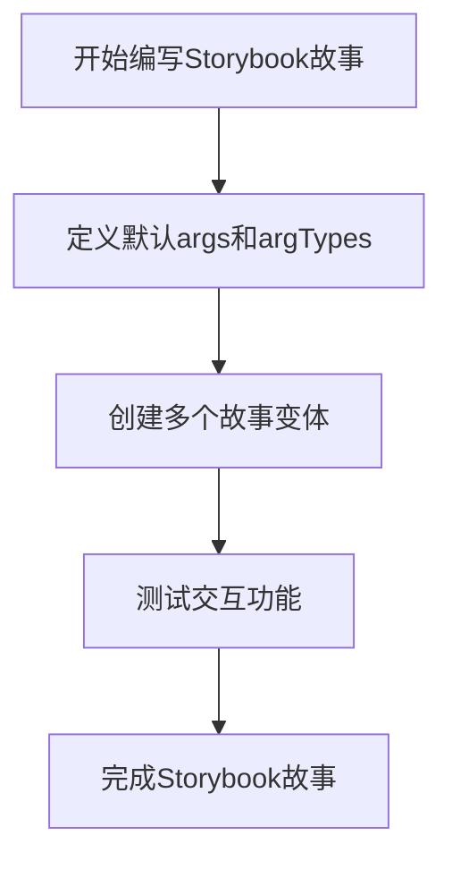

**图源**  
- [Button.stories.tsx](file://App/app/components/Button/Button.stories.tsx)

#### 示例：Button组件的Storybook配置
```typescript
export default {
  title: '[B] Button',
  component: Button,
  parameters: {
    notes: '默认按钮',
  },
  args: {
    title: 'Hello world',
    mode: 'text',
  },
  argTypes: {
    mode: {
      options: ['text', 'outlined', 'contained', 'elevated', 'contained-tonal'],
      control: { type: 'select' },
    },
  },
};
```

**节源**  
- [Button.stories.tsx](file://App/app/components/Button/Button.stories.tsx)

### 单元测试编写
每个UI组件都应有相应的单元测试，确保组件在各种条件下的正确行为。

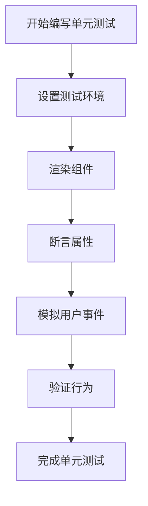

**图源**  
- [jest.config.js](file://App/jest.config.js)

## 功能模块开发流程
添加新功能模块的标准流程包括定义Redux slice、创建屏幕组件和设置导航。

### Redux Slice定义
Redux slice用于管理应用的状态。每个功能模块都应有自己的slice，包含reducer、actions和selectors。

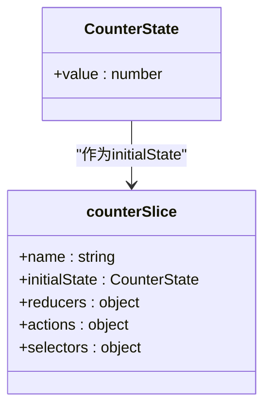

**图源**  
- [slice.ts](file://App/app/features/counter/slice.ts)

#### 示例：Counter模块的Slice定义
```typescript
export interface CounterState {
  value: number;
}

export const initialState: CounterState = {
  value: 0,
};

export const counterSlice = createSlice({
  name: 'counter',
  initialState,
  reducers: {
    increment: state => {
      state.value += 1;
    },
    decrement: state => {
      state.value -= 1;
    },
    incrementByAmount: (state, action: PayloadAction<number>) => {
      state.value += action.payload;
    },
  },
});
```

**节源**  
- [slice.ts](file://App/app/features/counter/slice.ts)

### 屏幕组件创建
屏幕组件是用户界面的主要组成部分。每个功能模块都应有自己的屏幕组件，通常位于`features/[module]/screens`目录下。

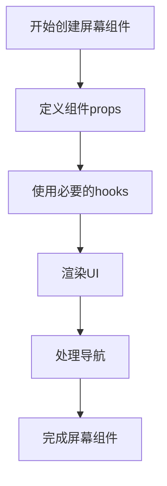

**图源**  
- [StorybookScreen.tsx](file://App/app/screens/StorybookScreen.tsx)

### 导航设置
新功能模块需要在导航系统中注册，以便用户可以访问。导航配置位于`navigation/MainStack.tsx`文件中。

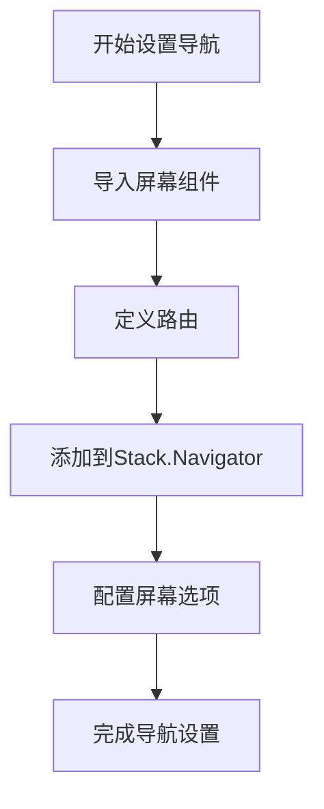

**图源**  
- [MainStack.tsx](file://App/app/navigation/MainStack.tsx)

## 自定义Hook使用方法
项目中使用了多种自定义Hook来简化常见的开发任务。

### useDB Hook
`useDB` Hook用于访问数据库实例，提供对PouchDB数据库的访问。

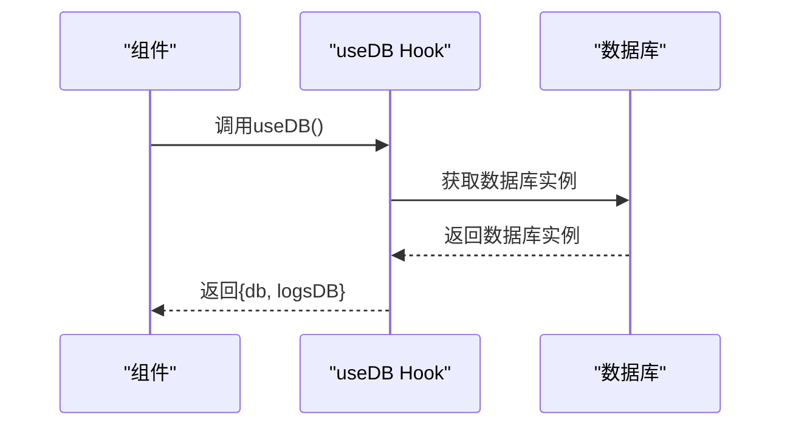

**图源**  
- [useDB.ts](file://App/app/hooks/useDB.ts)
- [App.tsx](file://App/app/App.tsx)

### useData Hook
`useData` Hook用于从数据库中获取数据，支持条件查询、排序和分页。

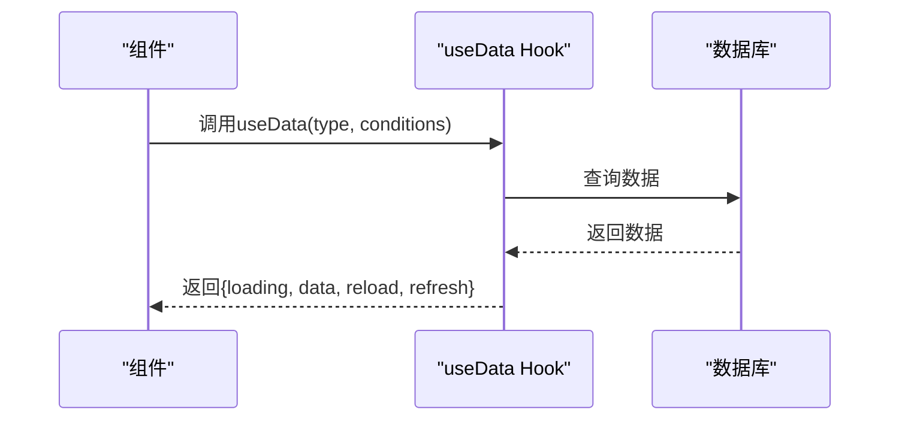

**图源**  
- [useData.ts](file://App/app/data/hooks/useData.ts)

## 代码风格指南
遵循一致的代码风格对于维护代码质量和可读性至关重要。

### TypeScript使用
- 使用TypeScript进行类型安全的开发
- 为所有函数和变量提供明确的类型注解
- 使用泛型提高代码的可重用性

### React最佳实践
- 使用函数组件和Hooks
- 遵循React的单一职责原则
- 避免不必要的重新渲染

### 文件组织
- 按功能组织文件结构
- 使用一致的命名约定
- 将相关文件放在同一目录下

## 测试策略
项目采用多层次的测试策略，包括单元测试和集成测试。

### 单元测试
单元测试用于验证单个组件或函数的正确性。

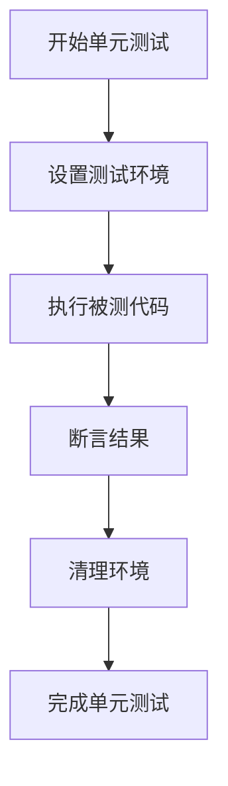

**图源**  
- [jest.config.js](file://App/jest.config.js)

### 集成测试
集成测试用于验证多个组件或模块之间的交互。

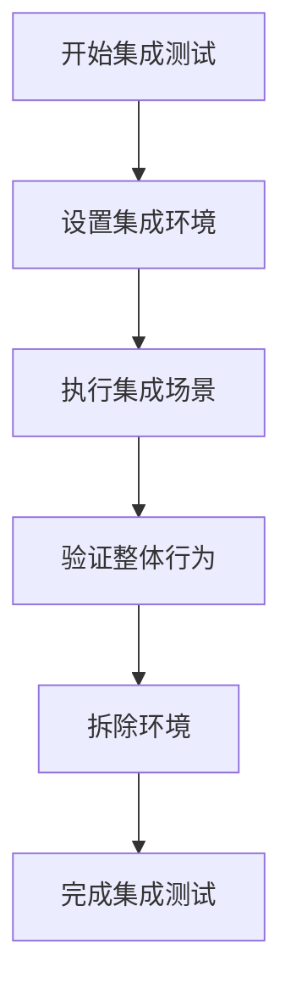

**图源**  
- [jest.config.js](file://App/jest.config.js)

## 调试技巧
有效的调试技巧可以帮助快速定位和解决问题。

### React DevTools使用
React DevTools用于检查React组件树和状态。

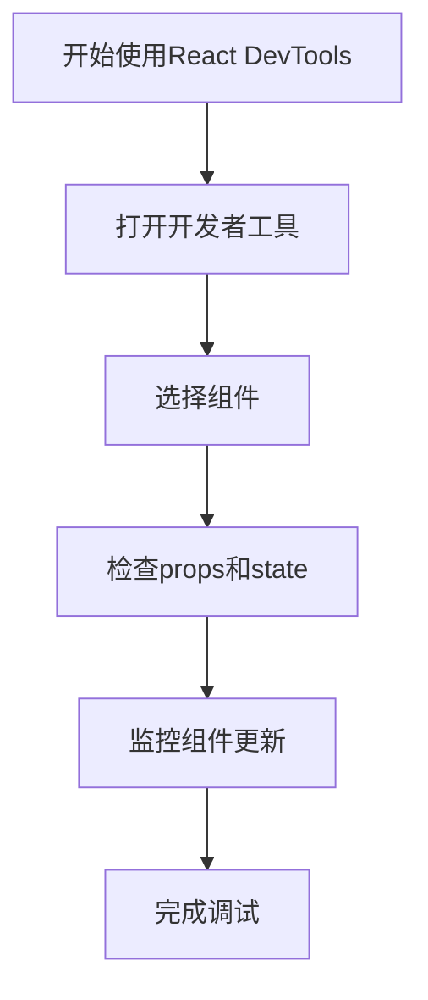

**图源**  
- [App.tsx](file://App/app/App.tsx)

### Redux DevTools使用
Redux DevTools用于跟踪Redux状态的变化。

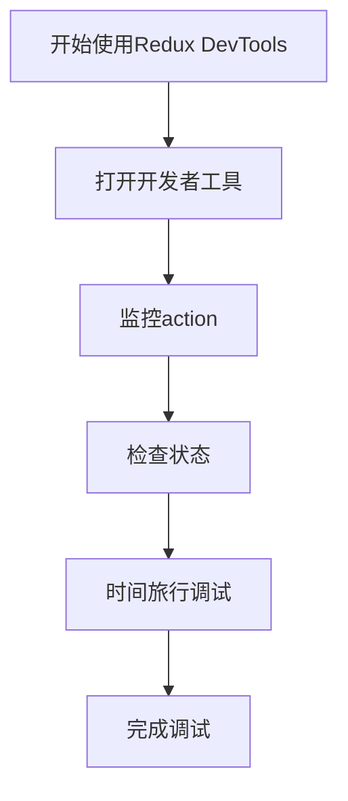

**图源**  
- [store.ts](file://App/app/redux/store.ts)

## 结论
本开发指南提供了全面的开发指导，涵盖了UI组件开发、功能模块添加、自定义Hook使用、代码风格、测试策略和调试技巧等方面。通过遵循本指南，贡献者可以更高效地参与项目开发，确保代码质量和一致性。