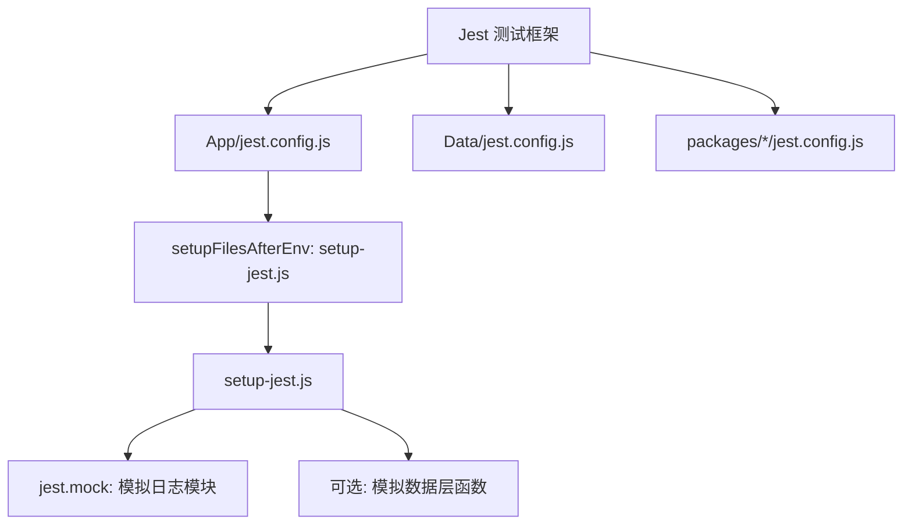
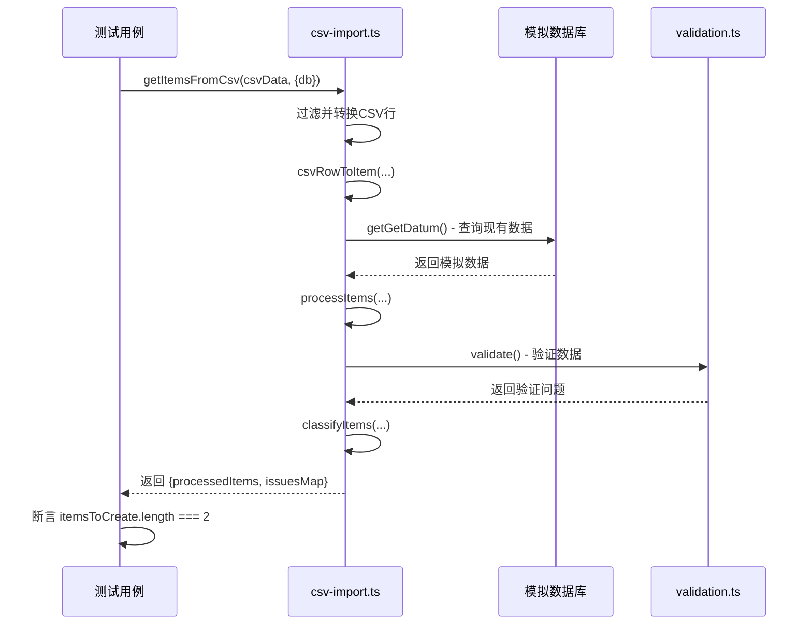
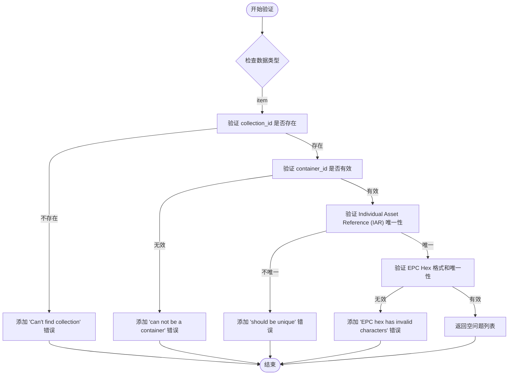

# 测试与质量保证

<cite>
**本文档中引用的文件**   
- [jest.config.js](file://App/jest.config.js)
- [setup-jest.js](file://App/setup-jest.js)
- [csv-import.ts](file://App/app/features/inventory/utils/csv-import.ts)
- [csv-import.test.ts](file://App/app/features/inventory/utils/csv-import.test.ts)
- [EPCUtils.ts](file://packages/epc-utils/lib/EPCUtils.ts)
- [EPCUtils.test.ts](file://packages/epc-utils/lib/EPCUtils.test.ts)
- [validation.ts](file://Data/lib/validation.ts)
- [validation.test.ts](file://Data/lib/__tests__/validation.test.ts)
- [print-utils.ts](file://App/app/features/label-printers/print-utils.ts)
- [print-utils.test.ts](file://App/app/features/label-printers/print-utils.test.ts)
- [csvRowToItem.ts](file://App/app/features/inventory/utils/csvRowToItem.ts)
- [csvRowToItem.test.ts](file://App/app/features/inventory/utils/csvRowToItem.test.ts)
</cite>

## 目录
1. [测试框架与配置](#测试框架与配置)
2. [工具函数的单元测试](#工具函数的单元测试)
3. [数据验证逻辑测试](#数据验证逻辑测试)
4. [Redux逻辑测试](#redux逻辑测试)
5. [测试覆盖率与CI集成](#测试覆盖率与ci集成)
6. [测试代码质量标准](#测试代码质量标准)

## 测试框架与配置

本项目采用Jest作为核心测试框架，为不同模块提供了独立的配置文件，确保测试环境的灵活性和隔离性。在`App`、`Data`和`packages`目录下均存在`jest.config.js`文件，这些配置文件继承了`react-native`预设，并统一配置了模块文件扩展名和模块映射规则。`moduleNameMapper`用于将`@deps/`路径别名正确解析到依赖目录，解决了Jest不支持`package.json.exports`的问题。

测试环境的设置通过`setup-jest.js`文件完成。该文件位于项目根目录，其路径在`App/jest.config.js`的`setupFilesAfterEnv`配置项中被引用。`setup-jest.js`的核心作用是进行依赖模拟（mocking），例如，它通过`jest.mock('app/logger/logsDB.ts')`语句模拟了日志数据库模块，防止测试过程中产生真实的日志写入。此外，该文件还包含对数据层函数（如`config.ts`、`getData.ts`等）的模拟，这些模拟被注释掉，表明它们是可选的，开发者可以根据具体测试需求进行启用。

**Diagram sources**
- [jest.config.js](file://App/jest.config.js#L1-L11)
- [setup-jest.js](file://App/setup-jest.js#L1-L11)

**Section sources**
- [jest.config.js](file://App/jest.config.js#L1-L11)
- [setup-jest.js](file://App/setup-jest.js#L1-L11)

## 工具函数的单元测试

项目中的工具函数通过单元测试进行严格验证，确保其逻辑的正确性和鲁棒性。测试策略包括模拟依赖、断言预期结果，并避免过度使用快照测试。

以`csv-import.ts`工具模块为例，它包含`getItemsFromCsv`、`processItems`和`classifyItems`三个核心函数。其对应的测试文件`csv-import.test.ts`展示了典型的单元测试模式。测试通过`jest.mock`模拟了`@app/data/functions`中的依赖函数（如`getGetConfig`、`getGetDatum`），并使用`setMockData`来准备测试数据。测试用例验证了函数在各种场景下的行为，例如：当CSV数据包含新项目时，应生成待创建的项目列表；当包含现有项目ID时，应生成待更新的项目列表；当数据违反模式或验证规则时，应正确识别出无效项目。测试通过断言`itemsToCreate`和`itemsToUpdate`数组的长度及内容来验证结果。

另一个例子是`EPCUtils.ts`，它提供了一系列与EPC（电子产品代码）编码相关的工具函数。其测试文件`EPCUtils.test.ts`大量使用了快照测试（`expect(snapshotData).toMatchSnapshot()`），这在测试复杂、确定性的数据转换逻辑时是合适的。测试用例覆盖了各种边界情况，例如，当输入无效的公司前缀时，`getMaxIarPrefix`函数应返回0；当尝试编码超出范围的序列号时，`encodeIndividualAssetReference`函数应抛出`IAREncodingError`异常。这些测试通过`expect(() => functionCall()).toThrow(ErrorType)`模式来验证异常处理。

**Diagram sources**
- [csv-import.ts](file://App/app/features/inventory/utils/csv-import.ts#L1-L133)
- [csv-import.test.ts](file://App/app/features/inventory/utils/csv-import.test.ts#L1-L321)
- [EPCUtils.test.ts](file://packages/epc-utils/lib/EPCUtils.test.ts#L1-L529)

**Section sources**
- [csv-import.ts](file://App/app/features/inventory/utils/csv-import.ts#L1-L133)
- [csv-import.test.ts](file://App/app/features/inventory/utils/csv-import.test.ts#L1-L321)
- [EPCUtils.ts](file://packages/epc-utils/lib/EPCUtils.ts#L1-L)
- [EPCUtils.test.ts](file://packages/epc-utils/lib/EPCUtils.test.ts#L1-L529)

## 数据验证逻辑测试

数据验证逻辑是保证应用数据完整性的关键。`validation.ts`文件定义了核心的验证逻辑，通过`getValidation`工厂函数返回一个包含`validate`和`validateDelete`方法的对象。`validate`方法根据数据类型（如`collection`、`item`）执行特定的验证规则。

`validation.test.ts`文件展示了如何为验证逻辑编写测试。测试通过提供模拟的依赖函数（`getConfig`、`getDatum`、`getData`、`getRelated`）来隔离被测单元。例如，一个测试用例模拟了一个有效的集合ID和一个不存在的集合ID，然后调用`validate`函数来验证一个项目。测试断言当`collection_id`指向一个不存在的集合时，验证结果中应包含一条路径为`['collection_id']`、消息为`Can't find collection with ID...`的错误信息。这种测试方法确保了验证逻辑的每个分支都能被正确执行和验证。

**Diagram sources**
- [validation.ts](file://Data/lib/validation.ts#L1-L494)
- [validation.test.ts](file://Data/lib/__tests__/validation.test.ts#L1-L55)

**Section sources**
- [validation.ts](file://Data/lib/validation.ts#L1-L494)
- [validation.test.ts](file://Data/lib/__tests__/validation.test.ts#L1-L55)

## Redux逻辑测试

虽然提供的上下文中没有直接的Redux action或reducer测试文件，但根据项目结构（存在`App/app/redux`目录），可以推断Redux逻辑的测试应遵循标准模式。对于异步action（通常使用Redux Thunk或Redux Toolkit的`createAsyncThunk`），测试应使用`jest.fn()`模拟action creator，并使用`redux-mock-store`来创建一个mock store。测试流程包括：
1.  分派异步action。
2.  断言store dispatch了预期的pending、fulfilled或rejected action。
3.  验证action的payload是否符合预期。

对于reducer，测试应专注于状态转换。测试用例会提供一个初始状态和一个action，然后断言reducer返回的新状态是否正确。例如，一个`SAVE_ITEM_SUCCESS` action应导致state中的items数组增加一个新项目。测试应覆盖正常流程和错误处理流程。

## 测试覆盖率与CI集成

项目应设定明确的测试覆盖率目标，例如：
*   **行覆盖率 (Line Coverage):** 目标 > 80%
*   **函数覆盖率 (Function Coverage):** 目标 > 85%
*   **分支覆盖率 (Branch Coverage):** 目标 > 70%

这些目标可以通过在`jest.config.js`中配置`coverageThreshold`来实现，以确保每次测试运行都满足最低标准。CI（持续集成）流程（如GitHub Actions或GitLab CI）应被配置为在每次代码推送或合并请求时自动运行测试套件。CI脚本应包含`yarn test --coverage`命令来生成覆盖率报告，并将结果上传到如Codecov或Coveralls等服务进行可视化。只有当所有测试通过且覆盖率达标时，才允许合并代码。

## 测试代码质量标准

为了保证测试代码本身的质量，项目应遵循以下标准：
*   **可读性:** 测试用例的命名应清晰描述其行为，例如`it('should create new items from CSV with no ID'...)`。使用`describe`块对相关测试进行分组。
*   **可维护性:** 避免过度依赖快照测试。快照测试适用于测试复杂、不易手动断言的输出（如UI组件的渲染结果或复杂的对象结构），但对于简单的值断言或逻辑验证，应优先使用精确的`expect(value).toBe(expected)`断言。这使得测试失败时更容易定位问题。
*   **性能:** 测试应尽可能快速。避免在测试中进行真实的网络请求或数据库操作，始终使用mock。对于耗时的异步操作，确保使用`jest.useFakeTimers()`来模拟时间。
*   **独立性:** 每个测试用例都应该是独立的，不依赖于其他测试的执行顺序或状态。使用`beforeEach`和`afterEach`钩子来设置和清理测试环境。